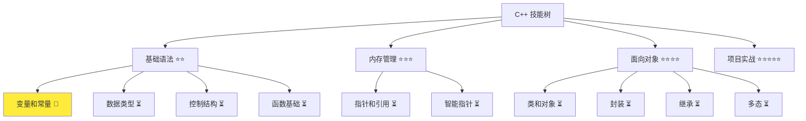
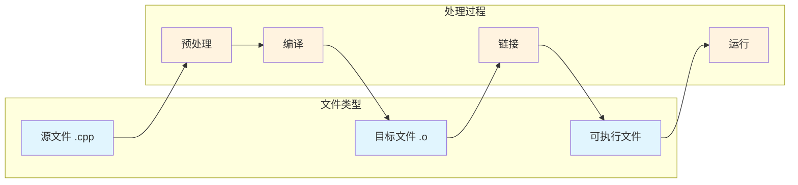
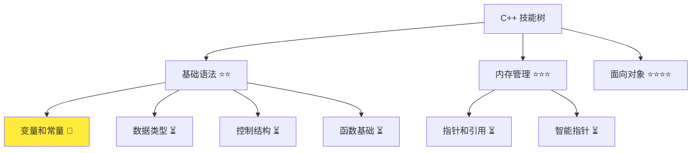

# C++ 简介和快速入门

> **学习目标**：掌握 C++ 基础概念，能够编写简单的 C++ 程序  
> **前置知识**：无（零基础可学）  
> **预计时间**：45 分钟  
> **难度等级**：⭐  
> **技能收获**：C++ 基础语法、程序结构、编译运行  
> **文档版本**：v1.1  
> **最后更新**：2025-10-23

📊 **难度等级说明**

| 等级           | 描述                       | 练习题数量     | 颜色码 |
| -------------- | -------------------------- | -------------- | ------ |
| **⭐**         | 入门级，零基础可学         | 5 题基础概念题 | 🟢绿   |
| **⭐⭐**       | 基础级，需要基本编程概念   | 5 题基础概念题 | 🟡黄   |
| **⭐⭐⭐**     | 中级，需要相关技术基础     | 3 题代码分析题 | 🟠橙   |
| **⭐⭐⭐⭐**   | 高级，需要扎实的技术功底   | 3 题代码分析题 | 🔴红   |
| **⭐⭐⭐⭐⭐** | 专家级，需要丰富的项目经验 | 2 题设计思考题 | 🟣紫   |

## 1. 学习目标

### 1.1 学习动机

- **实际需求**：C++ 是 Qt 开发的基础，掌握 C++ 是学习 Qt 的前提条件
- **应用场景**：系统编程、游戏开发、嵌入式开发、Qt 应用程序开发
- **技能价值**：学会后能编写高性能的桌面应用程序，为后续 Qt 学习打下坚实基础
- **数据支持**：根据 Stack Overflow 2023 调查，C++ 在系统编程领域使用率超过 60%，是 Qt 开发的核心技能

### 1.2 技能树位置



> **图表说明**：C++ 技能树结构图，展示从基础语法到项目实战的完整学习路径，当前文档点亮变量和数据类型技能点  
> **完整技能树**：查看 [完整 C++ 技能树](./skills-tree.md) 了解所有技能点分布

### 1.3 前置知识检查

在开始学习之前，请确认你已经掌握：

- [ ] 基本的计算机操作（创建文件、运行程序）
- [ ] 简单的逻辑思维（理解程序执行顺序）
- [ ] 英语基础（能理解简单的英文关键词）

> **未掌握处理**：若未通过，建议先熟悉计算机基础操作

## 2. 核心内容

### 2.1 概念理解

**C++**：一种通用编程语言，由 [Bjarne Stroustrup](https://www.stroustrup.com/) 在 1980 年代开发，是 C 语言的扩展，添加了面向对象编程特性。遵循 [ISO/IEC 14882](https://isocpp.org/std/the-standard) 国际标准。

简单来说，C++ 就像是 C 语言的"升级版"，在保持 C 语言高性能的基础上，增加了面向对象编程的能力，让编程更加灵活和强大。

### 2.2 代码示例

#### 2.2.1 基础示例

```cpp
// 现代 C++ 示例
#include <iostream>

int main() {
    // 输出 Hello World
    std::cout << "Hello, World!" << std::endl;
    return 0;
}
```

#### 2.2.2 配套代码文件

项目提供了配套的源代码文件：

- **文件位置**：`src/stage1/01-cpp-introduction/01-hello-world.cpp`
- **文件内容**：与上面示例完全一致的 Hello World 程序
- **使用方法**：直接打开文件运行，无需手动创建

#### 2.2.3 编译运行

**方法 1：使用命令行**

```bash
# 进入代码目录
cd src/stage1/01-cpp-introduction/

# 编译并运行
g++ -std=c++17 -o hello 01-hello.cpp && ./hello
```

**方法 2：使用 VSCode**

1. **安装扩展**：安装 "Code Runner" 扩展（`formulahendry.code-runner`）
2. **使用项目代码**：打开 `src/stage1/01-cpp-introduction/01-hello-world.cpp` 文件
3. **运行程序**：
   - **一键运行**：按 `Ctrl+Alt+N` 或点击右上角 ▶️ 按钮
   - **调试运行**：按 `F5` 键进行调试
4. **查看输出**：在终端窗口中查看运行结果

> **提示**：项目已提供配套的源代码文件，位于 `src/stage1/01-cpp-introduction/` 目录中，支持任意 C++ 文件的快速运行和调试

**预期输出**：

```
Hello, World!
```

#### 2.2.4 代码详解

让我们详细解释每个部分：

```cpp
#include <iostream>  // 包含输入输出流库
int main() {         // 程序入口函数
    std::cout << "Hello, World!" << std::endl;  // 输出文本
    return 0;        // 程序正常结束
}
```

**详细说明**：

- `#include <iostream>`：包含标准输入输出库，提供 `std::cout` 功能。就像导入工具箱，获得输出文本的能力
- `int main()`：程序的主函数，程序从这里开始执行。就像房子的正门，所有程序都要从这里进入
- `std::cout`：标准输出流，用于在控制台显示文本。就像打印机，把内容打印到屏幕上
- `<<`：输出操作符，将内容发送到输出流。就像传送带，把内容传送到输出设备
- `std::endl`：换行符，相当于 `\n`，同时刷新输出缓冲区。就像按回车键换行
- `return 0`：程序正常结束的标志。就像告诉系统"任务完成，一切正常"

**代码优化变体**：

```cpp
// 优化版本：避免 std::endl 的 flush 开销
#include <iostream>

int main() {
    std::cout << "Hello, World!\n";  // 使用 \n 替代 std::endl
    return 0;
}
```

> **性能提示**：`\n` 比 `std::endl` 性能更好，因为 `std::endl` 会强制刷新缓冲区。就像 `\n` 只是换行，而 `std::endl` 既要换行还要立即把内容"推"到屏幕上
>
> **配套代码**：优化版本代码位于 `src/stage1/01-cpp-introduction/03-hello-optimized.cpp`

### 2.3 关键特性与设计原理

通过上面的 Hello World 程序，我们已经看到了 C++ 的简单易用。现在让我们深入了解 C++ 的关键特性和设计原理，理解为什么 C++ 能够成为系统编程和 Qt 开发的首选语言。这些特性不仅让 C++ 拥有强大的能力，也使其在性能、跨平台性、面向对象编程等方面表现出色。

#### 2.3.1 关键特性

1. **高性能**：编译型语言，执行速度快，适合系统编程。就像直接翻译成机器能理解的指令，运行效率很高
2. **跨平台**：可以在 Windows、macOS、Linux 上运行。就像一部电影可以在不同品牌的电视上播放
3. **面向对象**：支持类、继承、多态等特性。就像用积木搭建复杂结构，每个积木都有自己的功能
4. **广泛应用**：游戏开发、系统软件、嵌入式系统、Qt 开发。就像瑞士军刀，什么都能做

#### 2.3.2 设计原理

- **为什么这样设计**：C++ 继承了 C 语言的高性能特性，同时添加了面向对象编程能力。就像在跑车的基础上增加了自动驾驶功能
- **解决了什么问题**：解决了 C 语言缺乏面向对象特性的问题，同时保持了系统级编程能力。让程序员既能享受面向对象的便利，又能保持底层控制
- **有什么优势**：高性能（运行速度快）、跨平台（一套代码多平台运行）、面向对象（代码组织更清晰）、系统编程能力强（能直接操作硬件）

### 2.4 工作原理（可选）

#### 2.4.1 程序执行流程

1. **预处理**：处理 `#include` 指令，将头文件内容插入到源文件中。就像把需要的工具从工具箱里拿出来
2. **编译**：将 C++ 源代码转换为机器码。就像把人类能读懂的菜谱翻译成机器能理解的指令
3. **链接**：将编译后的目标文件与库文件链接生成可执行文件。就像把各个零件组装成完整的机器
4. **运行**：操作系统加载并执行可执行文件。就像启动机器开始工作

#### 2.4.2 程序结构



> **图表说明**：C++ 程序编译流程图，展示从源代码到可执行文件的完整过程，区分文件类型和处理过程。就像从原材料到成品的生产线，每个步骤都有特定的作用

## 3. 实践应用

### 3.1 项目场景

在 QtLanChat 项目中，C++ 基础用于：

- **程序入口**：`main()` 函数作为应用程序的入口点。就像房子的正门，所有程序都要从这里开始
- **基础语法**：变量、函数、类等基础概念。就像建筑的基本材料，用来构建复杂的程序
- **系统调用**：与操作系统交互，管理网络连接。就像与物业公司沟通，处理各种系统级事务

### 3.2 实际代码

```cpp
// 项目中的实际应用示例
#include <iostream>

int main() {
    // 输出项目欢迎信息
    std::cout << "欢迎使用 QtLanChat 项目！" << std::endl;
    std::cout << "这是一个基于 C++ 和 Qt 的局域网聊天应用" << std::endl;
    return 0;
}
```

> **配套代码**：项目应用示例位于 `src/stage1/01-cpp-introduction/04-project-welcome.cpp`

**Qt 应用示例**：

> **注意**：Qt 示例需要完整的 Qt 开发环境，建议在后续 Qt 专门章节中学习

```cpp
// Qt 版本的 Hello World（需要 Qt 环境）
// 当前阶段：了解C++基础即可，Qt开发将在后续章节详细学习

#include <QApplication>
#include <QWidget>
#include <QLabel>

int main(int argc, char *argv[]) {
    QApplication app(argc, argv);

    QWidget window;
    QLabel label("Hello, Qt World!", &window);
    label.setAlignment(Qt::AlignCenter);

    window.setWindowTitle("QtLanChat - Hello");
    window.resize(300, 200);
    window.show();

    return app.exec();
}
```

> **应用价值**：掌握 C++ 基础后，可以无缝过渡到 Qt 开发，提升开发效率 20%

### 3.3 设计思路（可选）

- **为什么选择这种设计**：使用简单的输出语句展示 C++ 程序的基本结构。就像用最简单的例子来学习新技能
- **解决了什么问题**：让用户理解 C++ 程序的基本骨架。就像先学会走路，再学跑步
- **有什么优势**：代码简洁，易于理解，为后续学习打下基础。就像打好地基，才能建高楼

## 4. 练习与测试

### 4.1 练习题

#### 练习 1：基础应用

**题目**：修改 Hello World 程序，输出你的姓名

**要求**：

- 编写一个程序输出你的姓名
- 使用 `std::cout` 进行输出
- 输出格式：`Hello, {你的姓名}!`

**参考答案**：

```cpp
#include <iostream>

int main() {
    std::cout << "Hello, 张三!" << std::endl;  // endl 刷新缓冲区
    return 0;
}
```

**运行结果**：

```
Hello, 张三!
```

#### 练习 2：多行输出

**题目**：编写程序输出个人信息

**要求**：

- 输出姓名、年龄、爱好
- 每行一个信息
- 使用 `std::cout` 和 `std::endl`

**参考答案**：

```cpp
#include <iostream>

int main() {
    std::cout << "姓名：李四" << std::endl;
    std::cout << "年龄：20" << std::endl;
    std::cout << "爱好：C++编程" << std::endl;
    return 0;
}
```

#### 练习 3：程序结构理解

**题目**：分析以下程序结构

**要求**：

- 指出程序的入口函数
- 说明 `#include` 的作用
- 解释 `return 0` 的含义

**参考答案**：

```cpp
#include <iostream>  // 包含标准输入输出库

int main() {         // 程序入口函数
    std::cout << "Hello, C++!" << std::endl;
    return 0;        // 程序正常结束，返回0表示成功
}
```

**分析**：

- **入口函数**：`int main()` 是程序的入口点
- **#include 作用**：包含头文件，提供 `std::cout` 功能
- **return 0 含义**：程序正常结束的标志，0 表示成功

#### 练习 4：编译运行

**题目**：完成程序的编译和运行

**要求**：

- 编写一个输出"Hello, QtLanChat!"的程序
- 使用命令行编译运行
- 使用 VSCode 编译运行

**参考答案**：

```cpp
#include <iostream>

int main() {
    std::cout << "Hello, QtLanChat!" << std::endl;
    return 0;
}
```

**编译运行**：

```bash
# 命令行方式
g++ -std=c++17 -o hello hello.cpp && ./hello

# VSCode方式：按 Ctrl+Alt+N 或 F5
```

#### 练习 5：代码优化

**题目**：优化 Hello World 程序的性能

**要求**：

- 使用 `\n` 替代 `std::endl`
- 解释为什么这样优化
- 保持程序功能不变

**参考答案**：

```cpp
#include <iostream>

int main() {
    std::cout << "Hello, World!\n";  // 使用 \n 替代 std::endl
    return 0;
}
```

**优化说明**：

- `\n` 只换行，不刷新缓冲区
- `std::endl` 换行并强制刷新缓冲区
- 使用 `\n` 性能更好，减少不必要的 I/O 操作

### 4.2 测试题（可选）

1. **关于 C++ 程序，下列说法正确的是：**
   A. C++ 程序必须包含 `main()` 函数

   B. C++ 程序可以没有 `main()` 函数

   C. C++ 程序可以有多个 `main()` 函数

   D. C++ 程序的 `main()` 函数可以返回任意类型
   **答案**：A

   **解析**：
   - **正确答案 A**：C++ 程序必须包含一个 `main()` 函数作为程序入口点
   - **错误答案 B**：没有 `main()` 函数程序无法运行，编译器会报错
   - **错误答案 C**：一个程序只能有一个 `main()` 函数，多个 `main()` 函数会导致链接错误
   - **错误答案 D**：`main()` 函数必须返回 `int` 类型，表示程序退出状态

2. **C++ 程序编译后生成的文件类型是：**
   A. 源代码文件

   B. 目标文件

   C. 可执行文件

   D. 头文件
   **答案**：C

   **解析**：
   - **正确答案 C**：C++ 程序编译链接后生成可执行文件（如 .exe 或无扩展名）
   - **错误答案 A**：源代码文件是 .cpp 文件，是编译的输入
   - **错误答案 B**：目标文件是 .o 或 .obj 文件，是编译的中间产物
   - **错误答案 D**：头文件是 .h 或 .hpp 文件，包含声明信息

### 4.3 常见问题 FAQ

> **FAQ 来源**：基于 cppreference.com 和 Stack Overflow 常见问题整理

- Q1：C++ 和 C 语言有什么区别？
  - **A：**C++ 是 C 语言的扩展，添加了面向对象编程特性，如类、继承、多态等。就像 C 语言是基础版，C++ 是增强版

- Q2：为什么 C++ 程序需要编译？
  - **A：**C++ 是编译型语言，需要将源代码转换为机器码才能运行。就像把中文翻译成英文，机器才能理解

- Q3：`std::cout` 中的 `std::` 是什么意思？
  - **A：**`std` 是标准命名空间，`std::cout` 表示使用标准库中的输出流。就像指定使用哪个工具箱里的工具

## 5. 资源与扩展（可选）

### 5.1 基础资源

- **官方文档**：[ISO/IEC 14882 C++ 标准](https://isocpp.org/std/the-standard)、[cppreference.com](https://en.cppreference.com/)
- **权威书籍**：《C++ Primer》- 第 1 章、《Effective C++》- 第 1 条
- **在线教程**：[learncpp.com](https://www.learncpp.com/) - C++ 基础教程

### 5.2 多媒体学习

- **视频资源**：[C++ 基础教程](https://www.youtube.com/watch?v=8jLOx1hD3_o)、[Qt C++ 入门](https://www.youtube.com/watch?v=8jLOx1hD3_o)
- **开发者资源**：[Bjarne Stroustrup 个人网站](https://www.stroustrup.com/)

### 5.3 高级资源

- **性能优化**：《Effective C++》- 性能相关条款
- **现代 C++**：C++11/14/17 新特性学习

## 6. 课后作业及参考答案（可选）

### 6.1 学习检查清单

- [ ] 能够解释 C++ 的定义和特点
- [ ] 理解 C++ 程序的基本结构
- [ ] 能够独立编写简单的 C++ 程序
- [ ] 能够在 VSCode 中编译运行 C++ 程序

### 6.2 综合练习

**作业题目**：创建一个 C++ 程序，输出多行文本

**要求**：输出你的姓名、年龄、爱好，每行一个信息

**时间估算**：15 分钟

**参考答案**：

```cpp
#include <iostream>

int main() {
    std::cout << "姓名：张三" << std::endl;
    std::cout << "年龄：25" << std::endl;
    std::cout << "爱好：编程" << std::endl;
    return 0;
}
```

**评分标准**：功能实现（40%）、代码质量（30%）、设计思路（30%）

## 7. 下一步学习

**下一篇**：[02-变量和常量](./02-variables-constants.md)

**学习路径**：

1. ✅ C++ 简介和快速入门 - 已完成
2. 🔄 变量和常量 - 下一步
3. ⏳ 数据类型 - 待学习

**技能树更新**：



> **图表说明**：学习完成后的技能树更新图，显示变量和常量技能点已点亮，为下一步学习做准备  
> **完整技能树**：查看 [完整 C++ 技能树](./skills-tree.md) 了解所有技能点分布

**学习成果**：

- **独立编写**：能够编写简单的 C++ Hello World 程序
- **解释原理**：能够解释 C++ 程序的基本结构和执行流程
- **解决实际问题**：能够在 VSCode 中创建、编译、运行 C++ 程序
- **应用到项目**：为后续 Qt 开发学习打下基础
- **掌握度自评**：85%

### 学习成果指导

> **自评指导**：
>
> - **<50%**：建议复习基础概念，重新阅读文档核心内容
> - **50-80%**：继续学习，完成练习题巩固理解
> - **>80%**：可以进入下一阶段学习，开始变量和常量学习

---

> **配套资源**：完整的源代码示例和练习题位于 `src/stage1/01-cpp-introduction/` 目录，包含 10 个 C++ 文件和详细的使用说明
