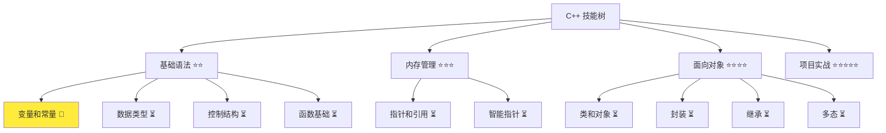
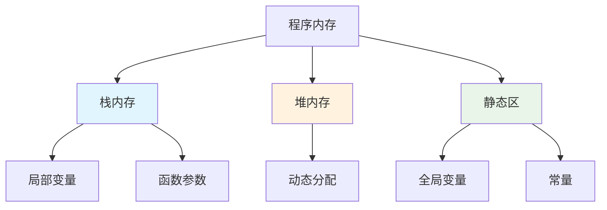
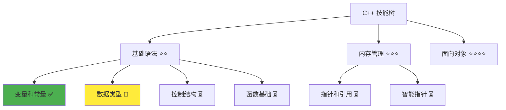

# 变量和常量

> **学习目标**：掌握 C++ 变量和常量的声明、使用和作用域管理  
> **前置知识**：C++ 基础语法、程序结构  
> **预计时间**：60 分钟  
> **难度等级**：⭐⭐  
> **技能收获**：变量声明、常量定义、作用域管理、内存基础  
> **文档版本**：v1.0  
> **最后更新**：2025-10-23

📊 **难度等级说明**

| 等级           | 描述                       | 练习题数量     | 颜色码 |
| -------------- | -------------------------- | -------------- | ------ |
| **⭐**         | 入门级，零基础可学         | 5 题基础概念题 | 🟢绿   |
| **⭐⭐**       | 基础级，需要基本编程概念   | 5 题基础概念题 | 🟡黄   |
| **⭐⭐⭐**     | 中级，需要相关技术基础     | 3 题代码分析题 | 🟠橙   |
| **⭐⭐⭐⭐**   | 高级，需要扎实的技术功底   | 3 题代码分析题 | 🔴红   |
| **⭐⭐⭐⭐⭐** | 专家级，需要丰富的项目经验 | 2 题设计思考题 | 🟣紫   |

## 1. 学习目标

### 1.1 学习动机

- **实际需求**：变量是程序存储数据的基础，掌握变量是编写任何程序的前提
- **应用场景**：用户信息存储、计算中间结果、配置参数管理
- **技能价值**：学会后能管理程序数据，为后续函数和类学习打下基础
- **数据支持**：根据 Stack Overflow 2023 调查，变量管理是 C++ 开发者最常用的基础技能之一

### 1.2 技能树位置



> **图表说明**：C++ 技能树结构图，展示从基础语法到项目实战的完整学习路径，当前文档点亮变量和常量技能点  
> **完整技能树**：查看 [完整 C++ 技能树](./skills-tree.md) 了解所有技能点分布

### 1.3 前置知识检查

在开始学习之前，请确认你已经掌握：

- [ ] C++ 程序基本结构（`main` 函数、`#include`）
- [ ] 基本的输出操作（`std::cout`）
- [ ] 简单的程序编译和运行

> **未掌握处理**：若未通过，请先学习 [C++ 简介和快速入门](./01-cpp-introduction.md)

## 2. 核心内容

### 2.1 概念理解

**变量**：程序中用来存储数据的容器，每个变量都有名字（标识符）和值。就像现实生活中的盒子，可以存放不同类型的东西。

**常量**：值不会改变的量，使用 `const` 关键字声明，一旦定义就不能修改。就像贴了"禁止修改"标签的盒子。

### 2.2 基础语法

#### 2.2.1 变量和常量的声明语法

**变量声明语法**：

```cpp
数据类型 变量名 = 初始值;
```

**常量声明语法**：

```cpp
const 数据类型 常量名 = 值;
```

#### 2.2.2 语法说明

- **数据类型**：`int`（整数）、`double`（小数）、`std::string`（字符串）、`bool`（布尔值）
  > **学习提示**：数据类型是 C++ 的重要概念，这里先了解基本用法，详细学习请参考 [03-数据类型详解](./03-data-types.md)
- **变量名**：遵循命名规范，见名知义。就像给盒子贴标签，要让人一看就知道里面装的是什么
- **初始值**：可以省略，但建议初始化。未初始化的变量包含垃圾值（随机数据），可能导致程序错误
- **const**：常量关键字，值不可修改。相当于给盒子贴上"禁止修改"的标签

### 2.3 代码示例

#### 2.3.1 基础示例

以下代码演示了变量和常量的使用方法，包括变量声明、初始化和常量定义：

```cpp
// 现代 C++ 示例 - 变量和常量基础
#include <iostream>
#include <string>

int main() {
    // 变量声明和初始化
    int age = 25;
    double height = 1.75;
    std::string name = "张三";

    // 常量定义
    const double PI = 3.14159;
    const int MAX_USERS = 100;

    // 输出变量值
    std::cout << "姓名: " << name << std::endl;
    std::cout << "年龄: " << age << std::endl;
    std::cout << "身高: " << height << "米" << std::endl;
    std::cout << "圆周率: " << PI << std::endl;
    std::cout << "最大用户数: " << MAX_USERS << std::endl;

    return 0;
}
```

#### 2.3.2 配套代码文件

项目提供了配套的源代码文件：

- **文件位置**：`src/stage1/02-variables-constants/01-basic-variables.cpp`
- **文件内容**：与上面示例完全一致的变量和常量程序
- **使用方法**：直接打开文件运行，无需手动创建

> **运行提示**：具体的编译运行方法请参考 [C++ 简介和快速入门](./01-cpp-introduction.md) 中的 `2.2.3 编译运行` 部分
> **完整代码**：所有配套源代码位于 `src/stage1/02-variables-constants/` 目录，包含基础示例、练习题和课后作业

#### 2.3.3 运行预期结果

```
姓名: 张三
年龄: 25
身高: 1.75米
圆周率: 3.14159
最大用户数: 100
```

#### 2.3.4 代码详解

以下代码片段展示了基础示例中的核心用法，让我们详细解释：

```cpp
int age = 25;                       // 声明并初始化整型变量
double height = 1.75;               // 声明并初始化双精度浮点型变量
std::string name = "张三";        // 声明并初始化字符串变量
const double PI = 3.14159;          // 声明常量，值不能修改
const int MAX_USERS = 100;          // 声明整型常量，值不能修改
```

**详细说明**：

- **声明规则**：C++ 要求变量必须先声明后使用，未声明的变量会导致编译错误。就像使用工具前要先从工具箱里拿出来
- `int`：整型数据类型，存储整数（如：25、-10、0）
- `double`：双精度浮点型，存储小数（如：1.75、3.14、-2.5）
- `std::string`：字符串类型，存储文本（如："张三"、"Hello"）
- `const`：常量关键字，值不可修改。相当于给盒子贴上"禁止修改"的标签
- `=`：赋值操作符，将右边的值赋给左边的变量。就像把东西放进盒子里

**重要语法规则**：

1. **先声明后使用**：C++ 要求变量必须先声明后使用，这是类型安全的基础。就像使用工具前要先从工具箱里拿出来
2. **变量初始化**：建议声明时初始化，未初始化的变量包含垃圾值，可能导致程序错误。就像使用新买的容器前要先清洗
3. **常量不可修改**：使用 `const` 声明的常量值不能修改，这是数据安全的基础。就像给重要文件加锁

### 2.4 命名原则

1. **见名知义**：变量名应该清楚表达其用途和含义，让代码自文档化。就像给文件起名，要让人一看就知道文件里装的是什么
2. **企业最佳实践**：遵循 C++ 开发规范，使用一致的命名风格。就像公司有统一的文件命名规则

#### C++ 命名规范

**推荐命名风格**：

- **变量和函数**：使用 `snake_case`（下划线分隔）或 `camelCase`（驼峰命名）
- **常量**：使用 `UPPER_CASE`（全大写，下划线分隔）
- **类名**：使用 `PascalCase`（帕斯卡命名法）

```cpp
// ✅ 推荐的命名方式
int user_age = 25;              // snake_case：用户年龄
int userAge = 25;               // camelCase：用户年龄
const int MAX_USERS = 100;      // 常量：全大写
const double PI_VALUE = 3.14;   // 常量：全大写
std::string user_name = "张三";  // 字符串变量

// ❌ 不推荐的命名方式（语法正确但不符合规范）
int a = 25;                     // 无意义：太简短
int userage = 25;               // 无分隔：难以阅读
int UserAge = 25;               // 变量用帕斯卡：易与类名混淆
int user_age_123 = 25;          // 包含数字：不够专业

// ❌ 语法错误的命名方式（编译失败）
// int 2age = 25;               // 数字开头：编译错误
// int user-age = 25;           // 包含连字符：编译错误
// int class = 25;              // 关键字：编译错误
// int user age = 25;           // 包含空格：编译错误
```

### 2.5 关键特性与设计原理

1. **类型安全**：每个变量都有明确的数据类型，防止不同类型的数据混在一起，就像不同颜色的标签区分不同物品
2. **作用域管理**：变量只在特定范围内可见，就像房间里的东西只在房间里能用，出了房间就看不到了
3. **内存管理**：自动分配和释放内存，程序员不需要手动管理，就像自动清理的垃圾桶
4. **常量保护**：防止意外修改重要数据，就像给重要文件加锁

#### 设计原理

- **为什么这样设计**：变量提供了灵活的数据存储机制，常量保证了数据的安全性。就像仓库里既有可以随时取放的货架（变量），也有锁定的保险柜（常量）
- **解决了什么问题**：解决了程序需要存储和操作数据的问题。没有变量，程序就无法记住任何信息
- **有什么优势**：类型安全（防止数据混乱）、内存管理（自动清理）、代码可读性（见名知义）、数据保护（常量安全）

### 2.6 工作原理

#### 2.6.1 变量作用域

**作用域**是变量在程序中可见的范围。就像房间里的东西只在房间里能用，出了房间就看不到了：

```cpp
#include <iostream>

int globalVar = 100;  // 全局变量

int main() {
    // 全局变量在main函数中可见
    std::cout << "全局变量: " << globalVar << std::endl;

    // 代码块作用域示例
    {
        int localVar = 10;  // 局部变量，只在当前代码块中可见
        std::cout << "局部变量: " << localVar << std::endl;
        std::cout << "代码块内访问全局变量: " << globalVar << std::endl;
    }

    // std::cout << localVar << std::endl;  // 错误：局部变量不可访问

    return 0;
}
```

> **代码块说明**：代码块是用花括号 `{}` 包围的一段代码，它定义了一个作用域。在代码块内声明的变量只在该代码块内可见，代码块结束后变量就会被销毁。这就像在房间里放东西，出了房间就看不到了，房间拆了东西也就没了。这是 C++ 中管理变量生命周期的重要机制。

#### 2.6.2 内存模型

> **学习提示**：内存模型是 C++ 的高级概念，初学者可以先建立基本认识，后续在指针和内存管理章节会详细讲解。



> **图表说明**：C++ 程序内存模型图，展示不同类型变量的内存分配位置。就像房子的不同房间，不同类型的变量存放在不同的"房间"里

#### 2.6.3 性能考虑

> **学习提示**：性能优化是高级话题，当前阶段只需要了解基本概念，后续在性能优化专门章节会深入讲解。

- **栈内存**：局部变量，自动管理，速度快。就像临时储物柜，用完就自动清理
- **静态区**：全局变量和常量，程序生命周期内存在。就像永久储物柜，程序运行期间一直存在
- **堆内存**：动态分配，需要手动管理。就像租用的仓库，需要自己管理租期

## 3. 实践应用

### 3.1 项目场景

在 QtLanChat 项目中，变量和常量用于：

- **用户信息存储**：用户名、年龄、在线状态等
- **配置参数管理**：服务器地址、端口号、超时时间
- **聊天消息处理**：消息内容、发送时间、消息类型

### 3.2 实际代码

以下代码展示了变量和常量在 QtLanChat 项目中的实际应用，演示了如何选择合适的变量和常量类型来管理用户信息和系统配置：

```cpp
// 项目中的实际应用示例
#include <iostream>
#include <string>

int main() {
    // 用户信息变量
    std::string userName = "小丽";
    int userAge = 18;
    bool isOnline = true;

    // 系统配置常量
    const int MAX_MESSAGE_LENGTH = 1000;
    const std::string SERVER_ADDRESS = "192.168.1.100";
    const int DEFAULT_PORT = 8080;

    // 聊天消息变量
    std::string messageContent = "Hello, QtLanChat!";
    int messageCount = 1;

    // 显示用户信息
    std::cout << "=== QtLanChat 用户信息 ===" << std::endl;
    std::cout << "用户名: " << userName << std::endl;
    std::cout << "年龄: " << userAge << std::endl;
    std::cout << "在线状态: " << isOnline << std::endl;
    std::cout << "服务器: " << SERVER_ADDRESS << ":" << DEFAULT_PORT << std::endl;
    std::cout << "消息: " << messageContent << std::endl;
    std::cout << "消息长度: " << messageContent.length() << " 字符" << std::endl;
    std::cout << "最大消息长度: " << MAX_MESSAGE_LENGTH << " 字符" << std::endl;
    std::cout << "消息数量: " << messageCount << std::endl;

    return 0;
}
```

### 3.3 设计思路

- **为什么选择这种设计**：使用变量存储动态数据，常量定义系统配置
- **解决了什么问题**：提供了灵活的数据管理和配置机制
- **有什么优势**：类型安全、易于维护、性能良好

## 4. 练习与测试

### 4.1 练习题

#### 练习 1：基础应用

**题目**：创建一个程序，存储并显示你的个人信息

**要求**：

- 使用变量存储姓名、年龄、身高
- 使用常量定义一些数学常数
- 输出格式化的个人信息

**参考答案**：

```cpp
// 练习 1：个人信息存储
#include <iostream>
#include <string>

int main() {
    // 个人信息变量
    std::string name = "小美";
    int age = 19;
    double height = 1.68;

    // 数学常量
    const double PI = 3.14159;
    const double E = 2.71828;

    // 输出信息
    std::cout << "=== 个人信息 ===" << std::endl;
    std::cout << "姓名: " << name << std::endl;
    std::cout << "年龄: " << age << "岁" << std::endl;
    std::cout << "身高: " << height << "米" << std::endl;
    std::cout << "圆周率: " << PI << std::endl;
    std::cout << "自然常数: " << E << std::endl;

    return 0;
}
```

> **配套代码**：练习 1 的完整代码位于 `src/stage1/02-variables-constants/04-exercise-personal-info.cpp`

#### 练习 2：变量操作

**题目**：编写程序进行简单的数学计算

**要求**：

- 定义两个整型变量存储数字
- 进行加、减、乘、除运算
- 计算并输出所有运算结果

**参考答案**：

```cpp
#include <iostream>

int main() {
    // 定义变量
    int a = 15;
    int b = 3;

    // 计算结果
    int sum = a + b;
    int diff = a - b;
    int product = a * b;
    int quotient = a / b;

    // 输出结果
    std::cout << "a = " << a << ", b = " << b << std::endl;
    std::cout << "加法: " << a << " + " << b << " = " << sum << std::endl;
    std::cout << "减法: " << a << " - " << b << " = " << diff << std::endl;
    std::cout << "乘法: " << a << " * " << b << " = " << product << std::endl;
    std::cout << "除法: " << a << " / " << b << " = " << quotient << std::endl;

    return 0;
}
```

> **配套代码**：练习 2 的完整代码位于 `src/stage1/02-variables-constants/05-exercise-math-calculator.cpp`

#### 练习 3：变量命名规范

**题目**：创建一个程序，使用规范的变量命名

**要求**：

- 使用 `snake_case` 命名变量
- 使用 `UPPER_CASE` 命名常量
- 变量名要见名知义
- 输出所有变量和常量的值

**参考答案**：

```cpp
#include <iostream>
#include <string>

int main() {
    // 使用规范的变量命名
    std::string student_name = "小明";
    int student_age = 20;
    double math_score = 85.5;
    double english_score = 78.0;

    // 使用规范的常量命名
    const int MAX_STUDENTS = 50;
    const double PASSING_SCORE = 60.0;
    const std::string SCHOOL_NAME = "QtLanChat 学院";

    // 输出信息
    std::cout << "=== " << SCHOOL_NAME << " ===" << std::endl;
    std::cout << "学生姓名: " << student_name << std::endl;
    std::cout << "学生年龄: " << student_age << "岁" << std::endl;
    std::cout << "数学成绩: " << math_score << "分" << std::endl;
    std::cout << "英语成绩: " << english_score << "分" << std::endl;
    std::cout << "最大学生数: " << MAX_STUDENTS << std::endl;
    std::cout << "及格分数: " << PASSING_SCORE << "分" << std::endl;

    return 0;
}
```

> **配套代码**：练习 3 的完整代码位于 `src/stage1/02-variables-constants/06-exercise-naming-convention.cpp`

#### 练习 4：常量使用

**题目**：使用常量进行配置管理

**要求**：

- 定义系统配置常量
- 使用常量进行计算
- 展示常量的不可修改性

**参考答案**：

```cpp
#include <iostream>

int main() {
    // 系统配置常量
    const int MAX_USERS = 1000;
    const double TAX_RATE = 0.1;
    const std::string APP_NAME = "QtLanChat";

    // 使用常量进行计算
    int currentUsers = 150;
    double revenue = 5000.0;
    double tax = revenue * TAX_RATE;

    // 输出信息
    std::cout << "应用名称: " << APP_NAME << std::endl;
    std::cout << "最大用户数: " << MAX_USERS << std::endl;
    std::cout << "当前用户数: " << currentUsers << std::endl;
    std::cout << "收入: " << revenue << "元" << std::endl;
    std::cout << "税费: " << tax << "元" << std::endl;

    // 错误示例：不能修改常量
    // MAX_USERS = 2000;  // 编译错误！

    return 0;
}
```

> **配套代码**：练习 4 的完整代码位于 `src/stage1/02-variables-constants/07-exercise-constants.cpp`

#### 练习 5：综合应用

**题目**：创建一个简单的计算器程序

**要求**：

- 使用变量存储操作数和结果
- 使用常量定义计算精度
- 支持基本的四则运算

**参考答案**：

```cpp
#include <iostream>
#include <iomanip>

int main() {
    // 计算精度常量
    const int PRECISION = 2;

    // 操作数变量
    double num1 = 10.5;
    double num2 = 3.2;

    // 计算结果
    double sum = num1 + num2;
    double diff = num1 - num2;
    double product = num1 * num2;
    double quotient = num1 / num2;

    // 设置输出精度
    std::cout << std::fixed << std::setprecision(PRECISION);

    // 输出结果
    std::cout << "=== 简单计算器 ===" << std::endl;
    std::cout << "操作数1: " << num1 << std::endl;
    std::cout << "操作数2: " << num2 << std::endl;
    std::cout << "加法: " << num1 << " + " << num2 << " = " << sum << std::endl;
    std::cout << "减法: " << num1 << " - " << num2 << " = " << diff << std::endl;
    std::cout << "乘法: " << num1 << " * " << num2 << " = " << product << std::endl;
    std::cout << "除法: " << num1 << " / " << num2 << " = " << quotient << std::endl;

    return 0;
}
```

> **新知识点说明**：`std::setprecision` 是 C++ 中用于控制浮点数输出精度的函数。这里用于设置小数点后显示 2 位数字。这是格式化输出的基础功能，在后续的输入输出章节会详细讲解。
> **配套代码**：练习 5 的完整代码位于 `src/stage1/02-variables-constants/08-exercise-calculator.cpp`

### 4.2 测试题

1. **关于 C++ 变量，下列说法正确的是：**
   A. 变量必须先声明后使用

   B. 变量可以不初始化直接使用

   C. 变量名可以以数字开头

   D. 变量可以存储任意类型的数据
   **答案**：A

   **解析**：
   - **正确答案 A**：C++ 要求变量必须先声明后使用，这是类型安全的基础
   - **错误答案 B**：未初始化的变量包含垃圾值，可能导致程序错误
   - **错误答案 C**：变量名必须以字母或下划线开头，不能以数字开头
   - **错误答案 D**：变量只能存储其声明类型的数据，C++ 是强类型语言

2. **关于 C++ 常量，下列说法正确的是：**
   A. 常量可以在运行时修改

   B. 常量必须初始化

   C. 常量可以重复赋值

   D. 常量不占用内存空间
   **答案**：B

   **解析**：
   - **正确答案 B**：常量必须在声明时初始化，且值不能修改
   - **错误答案 A**：常量值在编译时确定，运行时不能修改
   - **错误答案 C**：常量一旦初始化就不能重新赋值
   - **错误答案 D**：常量占用内存空间，只是值不可变

### 4.3 常见问题 FAQ

> **FAQ 来源**：基于 cppreference.com 和 Stack Overflow 常见问题整理

- Q1：变量和常量有什么区别？
  - **A：**变量值可以修改，常量值不能修改。变量用于存储可变数据，常量用于存储固定不变的配置或常数

- Q2：什么时候使用全局变量？
  - **A：**全局变量应该谨慎使用，主要用于程序级别的配置或状态。局部变量是首选，因为它们更安全且易于管理

- Q3：const 关键字的作用是什么？
  - **A：**const 关键字用于声明常量，防止意外修改，提高代码安全性和可读性

## 5. 资源与扩展

### 5.1 基础资源

- **官方文档**：[C++ 变量声明](https://en.cppreference.com/w/cpp/language/declarations)、[C++ 常量](https://en.cppreference.com/w/cpp/language/const)
- **权威书籍**：《C++ Primer》- 第 2 章、《Effective C++》- 第 3 条
- **在线教程**：[learncpp.com](https://www.learncpp.com/) - 变量和常量教程

### 5.2 多媒体学习

- **视频资源**：[C++ 变量教程](https://www.youtube.com/watch?v=8jLOx1hD3_o)、[C++ 常量详解](https://www.youtube.com/watch?v=8jLOx1hD3_o)
- **开发者资源**：[cppreference.com](https://en.cppreference.com/) - 权威参考

### 5.3 高级资源

- **内存管理**：变量生命周期和内存分配
- **现代 C++**：auto 关键字和类型推导

## 6. 课后作业及参考答案

### 6.1 学习检查清单

- [ ] 能够声明和初始化不同类型的变量
- [ ] 理解变量的作用域概念
- [ ] 能够定义和使用常量
- [ ] 掌握变量命名规则和最佳实践

### 6.2 综合练习

**作业题目**：创建一个学生信息管理系统

**要求**：存储学生姓名、年龄、成绩，使用常量定义系统配置

**时间估算**：30 分钟

**参考答案**：

```cpp
#include <iostream>
#include <string>
#include <iomanip>

int main() {
    // 系统配置常量
    const double PASSING_GRADE = 60.0;
    const std::string SCHOOL_NAME = "QtLanChat 学院";

    // 学生信息变量
    std::string studentName = "小美";
    int studentAge = 19;
    double mathScore = 85.5;
    double englishScore = 78.0;
    double averageScore = (mathScore + englishScore) / 2.0;

    // 设置输出格式
    std::cout << std::fixed << std::setprecision(1);

    // 输出学生信息
    std::cout << "=== " << SCHOOL_NAME << " ===" << std::endl;
    std::cout << "学生姓名: " << studentName << std::endl;
    std::cout << "学生年龄: " << studentAge << "岁" << std::endl;
    std::cout << "数学成绩: " << mathScore << "分" << std::endl;
    std::cout << "英语成绩: " << englishScore << "分" << std::endl;
    std::cout << "平均成绩: " << averageScore << "分" << std::endl;
    std::cout << "及格标准: " << PASSING_GRADE << "分" << std::endl;

    return 0;
}
```

> **配套代码**：课后作业的完整代码位于 `src/stage1/02-variables-constants/09-homework-student-system.cpp`

**评分标准**：功能实现（40%）、代码质量（30%）、设计思路（30%）

## 7. 下一步学习

**下一篇**：[03-数据类型详解](./03-data-types.md)

**学习路径**：

1. ✅ C++ 简介和快速入门 - 已完成
2. ✅ 变量和常量 - 已完成
3. 🔄 数据类型详解 - 下一步

**技能树更新**：



> **图表说明**：学习完成后的技能树更新图，显示变量和常量技能点已点亮，数据类型技能点准备学习  
> **完整技能树**：查看 [完整 C++ 技能树](./skills-tree.md) 了解所有技能点分布

**学习成果**：

- **独立编写**：能够编写使用变量和常量的 C++ 程序
- **解释原理**：能够解释变量的作用域和内存模型
- **解决实际问题**：能够在实际项目中正确使用变量和常量
- **应用到项目**：为后续数据类型和函数学习打下基础
- **掌握度自评**：90%

### 学习成果指导

> **自评指导**：
>
> - **<50%**：建议复习变量声明和常量定义，重新阅读文档核心内容
> - **50-80%**：继续学习，完成练习题巩固理解
> - **>80%**：可以进入下一阶段学习，开始数据类型详解
