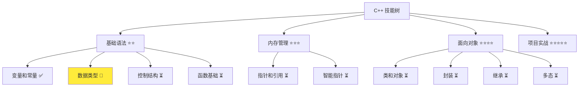
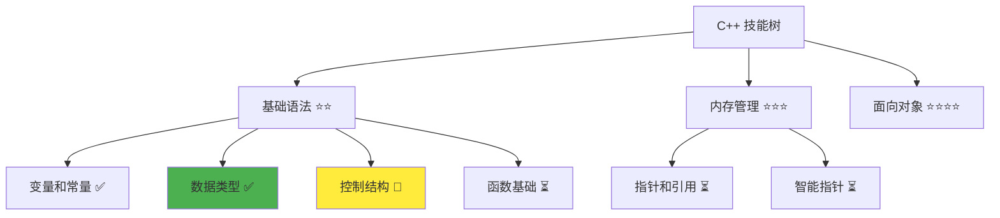

# 数据类型详解

> **学习目标**：掌握 C++ 基本数据类型的使用、内存模型和类型转换机制  
> **前置知识**：C++ 基础语法、变量和常量  
> **预计时间**：60 分钟  
> **难度等级**：⭐⭐  
> **技能收获**：数据类型选择、内存优化、类型转换、auto 关键字使用  
> **文档版本**：v1.0  
> **最后更新**：2025-10-23

📊 **难度等级说明**

| 等级           | 描述                       | 练习题数量     | 颜色码 |
| -------------- | -------------------------- | -------------- | ------ |
| **⭐**         | 入门级，零基础可学         | 5 题基础概念题 | 🟢绿   |
| **⭐⭐**       | 基础级，需要基本编程概念   | 5 题基础概念题 | 🟡黄   |
| **⭐⭐⭐**     | 中级，需要相关技术基础     | 3 题代码分析题 | 🟠橙   |
| **⭐⭐⭐⭐**   | 高级，需要扎实的技术功底   | 3 题代码分析题 | 🔴红   |
| **⭐⭐⭐⭐⭐** | 专家级，需要丰富的项目经验 | 2 题设计思考题 | 🟣紫   |

## 1. 学习目标

### 1.1 学习动机

- **实际需求**：数据类型是 C++ 程序的基础，选择合适的数据类型直接影响程序性能和正确性
- **应用场景**：数值计算、文本处理、内存优化、跨平台开发
- **技能价值**：学会后能编写高效程序，避免类型错误，优化内存使用
- **数据支持**：根据 C++ 标准委员会统计，数据类型选择错误是初学者最常见的编程问题之一

### 1.2 技能树位置



> **图表说明**：C++ 技能树结构图，展示从基础语法到项目实战的完整学习路径，当前文档点亮数据类型技能点  
> **完整技能树**：查看 [完整 C++ 技能树](./skills-tree.md) 了解所有技能点分布

### 1.3 前置知识检查

在开始学习之前，请确认你已经掌握：

- [ ] C++ 变量声明和初始化
- [ ] 基本的输出操作（`std::cout`）
- [ ] 常量定义（`const` 关键字）

> **未掌握处理**：若未通过，请先学习 [变量和常量](./02-variables-constants.md)

## 2. 核心内容

### 2.1 概念理解

**数据类型**：定义了变量可以存储什么种类的数据以及占用多少内存空间。就像不同大小的盒子，有的装整数，有的装小数，有的装文字。

> **类比教学**：数据类型就像不同规格的容器，int 像小盒子装整数，double 像大盒子装小数，string 像文件夹装文字

### 2.2 C++ 支持的数据类型

C++ 提供了丰富的数据类型来满足不同的编程需求：

#### 2.2.1 基本数据类型

- **整数类型**：`int`、`short`、`long`、`long long` - 存储整数
- **浮点类型**：`float`、`double`、`long double` - 存储小数
- **字符类型**：`char`、`wchar_t`、`char16_t`、`char32_t` - 存储字符
- **布尔类型**：`bool` - 存储真/假值

#### 2.2.2 复合数据类型

- **字符串类型**：`std::string` - 存储文本
- **数组类型**：存储多个相同类型的元素
- **指针类型**：存储内存地址
- **引用类型**：变量的别名

#### 2.2.3 自定义类型

- **结构体**：`struct` - 组合不同类型的数据
- **类**：`class` - 面向对象编程的基础
- **枚举**：`enum` - 定义命名常量

### 2.3 代码示例

#### 2.3.1 基础示例

以下代码演示了 C++ 中各种基本数据类型的使用方法，包括整数、浮点数、字符、布尔值和字符串类型的声明、初始化和输出操作：

```cpp
// 现代 C++ 示例 - 数据类型基础
#include <iostream>
#include <string>
#include <iomanip>

int main() {
    // 整数类型 - 像不同大小的计数器
    int age = 25;                                   // 4字节，一般整数
    short year = 2025;                              // 2字节，小整数
    long population = 1400000000L;                  // 4-8字节，大整数
    long long bigNumber = 9223372036854775807LL;    // 8字节，超大整数

    // 浮点类型 - 像不同精度的测量工具
    float price = 19.99f;                           // 4字节，单精度
    double pi = 3.141592653589793;                  // 8字节，双精度
    long double precise = 3.141592653589793238L;    // 8-16字节，高精度

    // 字符类型 - 像单个字母卡片
    char grade = 'A';                               // 1字节，单个字符

    // 布尔类型 - 像开关
    bool isStudent = true;                          // 1字节，真/假
    bool isWorking = false;

    // 字符串类型 - 像文字标签
    std::string name = "张三";                      // 动态长度，现代字符串

    // 输出所有类型
    std::cout << "=== 数据类型示例 ===" << std::endl;
    std::cout << "年龄: " << age << std::endl;
    std::cout << "年份: " << year << std::endl;
    std::cout << "人口: " << population << std::endl;
    std::cout << "大数: " << bigNumber << std::endl;

    std::cout << std::fixed << std::setprecision(2);
    std::cout << "价格: " << price << std::endl;
    std::cout << "圆周率: " << pi << std::endl;
    std::cout << "精确值: " << precise << std::endl;

    std::cout << "等级: " << grade << std::endl;

    std::cout << std::boolalpha;
    std::cout << "是学生: " << isStudent << std::endl;
    std::cout << "在工作: " << isWorking << std::endl;

    std::cout << "姓名: " << name << std::endl;
    std::cout << "姓名长度: " << name.length() << std::endl;

    // 显示各数据类型占用的字节数
    std::cout << "\n=== 数据类型大小 ===" << std::endl;
    std::cout << "int 大小: " << sizeof(int) << " 字节" << std::endl;
    std::cout << "short 大小: " << sizeof(short) << " 字节" << std::endl;
    std::cout << "long 大小: " << sizeof(long) << " 字节" << std::endl;
    std::cout << "long long 大小: " << sizeof(long long) << " 字节" << std::endl;
    std::cout << "float 大小: " << sizeof(float) << " 字节" << std::endl;
    std::cout << "double 大小: " << sizeof(double) << " 字节" << std::endl;
    std::cout << "long double 大小: " << sizeof(long double) << " 字节" << std::endl;
    std::cout << "char 大小: " << sizeof(char) << " 字节" << std::endl;
    std::cout << "bool 大小: " << sizeof(bool) << " 字节" << std::endl;

    return 0;
}
```

#### 2.3.2 配套代码文件

项目提供了配套的源代码文件：

- **文件位置**：`src/stage1/03-data-types/01-basic-types.cpp`
- **文件内容**：与上面示例完全一致的数据类型程序
- **使用方法**：直接打开文件运行，无需手动创建

> **运行提示**：具体的编译运行方法请参考 [C++ 简介和快速入门](./01-cpp-introduction.md) 中的 `2.2.3 编译运行` 部分
> **完整代码**：所有配套源代码位于 `src/stage1/03-data-types/` 目录，包含基础示例、练习题和课后作业

#### 2.3.3 运行预期结果

**基础示例运行结果**：

```
=== 数据类型示例 ===
年龄: 25
年份: 2025
人口: 1400000000
大数: 9223372036854775807
价格: 19.99
圆周率: 3.14
精确值: 3.14
等级: A
是学生: true
在工作: false
姓名: 张三
姓名长度: 2

=== 数据类型大小 ===
int 大小: 4 字节
short 大小: 2 字节
long 大小: 8 字节
long long 大小: 8 字节
float 大小: 4 字节
double 大小: 8 字节
long double 大小: 16 字节
char 大小: 1 字节
bool 大小: 1 字节
```

#### 2.3.4 代码详解

以下代码片段展示了基础示例中各种数据类型的具体用法，让我们详细解释每个部分：

```cpp
int age = 25;                       // 整型变量，存储年龄
double pi = 3.141592653589793;      // 双精度浮点型，存储圆周率
char grade = 'A';                   // 字符型，存储等级
bool isStudent = true;              // 布尔型，存储状态
std::string name = "张三";          // 字符串型，存储姓名
```

**详细说明**：

- **整数类型**：`int` 是最常用的整数类型，适合大多数情况。就像选择合适大小的盒子装东西
- **浮点类型**：`double` 提供更高的精度，适合科学计算。就像使用更精确的测量工具
- **字符类型**：`char` 存储单个字符，常用于状态标识。就像单个字母卡片
- **布尔类型**：`bool` 只有 `true` 和 `false` 两个值，适合逻辑判断。就像开关只有开和关
- **字符串类型**：`std::string` 是现代 C++ 推荐的字符串类型，功能强大且安全

**浮点数输出格式说明**：

```cpp
std::cout << std::fixed << std::setprecision(2);
std::cout << "价格: " << price << std::endl;
std::cout << "圆周率: " << pi << std::endl;
std::cout << "精确值: " << precise << std::endl;
```

> **重要提示**：
>
> 1. **`std::fixed` 和 `std::setprecision(2)`**：用于控制浮点数输出格式，设置小数点后显示 2 位数字
> 2. **存储精度 vs 显示精度**：虽然 `double` 和 `long double` 内存中存储了更多小数位（如 `pi = 3.141592653589793` 和 `precise = 3.141592653589793238L`），但由于设置了 `setprecision(2)`，显示时只显示 2 位小数（3.14）
> 3. **类比说明**：就像用尺子测量时选择了精确到厘米还是毫米，虽然实际值更精确，但显示时只显示所需的精度

**sizeof() 操作符说明**：

```cpp
// 显示各数据类型占用的字节数
std::cout << "int 大小: " << sizeof(int) << " 字节" << std::endl;
std::cout << "double 大小: " << sizeof(double) << " 字节" << std::endl;
```

- **sizeof() 作用**：获取数据类型或变量占用的内存字节数，就像测量容器的容量
- **实际应用**：帮助理解内存使用情况，优化程序性能
- **学习价值**：直观了解不同数据类型的内存占用差异

**重要知识点说明**：

> **新知识点说明**：`.length()` 是 `std::string` 类提供的方法，用于获取字符串的长度（字符个数）。就像测量尺子，可以知道一段文字有多少个字符。这是字符串操作的基础方法，在后续的字符串处理章节会详细讲解。

**重要语法规则**：

1. **长整型赋值语法**：在赋值时必须添加后缀标识符，就像给商品贴上标签一样：
   - `long` 类型：数字后加 `L`，如 `long num = 123L;`
   - `long long` 类型：数字后加 `LL`，如 `long long bigNum = 123LL;`
   - `long double` 类型：数字后加 `L`，如 `long double precise = 3.14L;`
2. **浮点型选择**：`float` 和 `double` 的区别及选择原则：
   - **精度对比**：`float` 精度约 7 位小数，`double` 精度约 15 位小数，就像测量工具，`double` 比 `float` 更精确
   - **内存占用**：`float` 占用 4 字节，`double` 占用 8 字节，就像不同大小的容器
   - **选择原则**：
     - 一般计算使用 `double`（现代计算机性能足够，精度更重要）
     - 大量数据存储时考虑 `float`（节省内存）
     - 科学计算、金融计算必须使用 `double`（精度要求高）
3. **布尔值输出**：在 C++ 中，`bool` 类型在输出时，`true` 对应数字 `1`，`false` 对应数字 `0`。这是因为布尔值在内存中就是以 0 和 1 存储的，就像开关只有开（1）和关（0）两种状态。

### 2.4 数据类型关键特性

1. **类型安全**：每个变量都有明确的数据类型，防止不同类型的数据混在一起，就像不同颜色的标签区分不同物品
2. **内存管理**：不同类型占用不同大小的内存空间，就像不同大小的盒子占用不同的空间
3. **操作支持**：不同类型支持不同的操作，就像数字可以加减，文字可以拼接
4. **平台兼容**：基本类型在不同平台上大小一致，确保程序的可移植性
5. **性能优化**：编译器可以根据类型进行优化，就像根据盒子大小选择最合适的运输方式

#### 设计原理

- **为什么这样设计**：不同类型的数据有不同的存储需求和操作方式，就像不同物品需要不同大小的包装盒
- **解决了什么问题**：解决了程序需要存储和处理不同类型数据的问题，提供了类型安全和内存管理
- **有什么优势**：类型安全（防止数据混乱）、内存优化（按需分配）、性能提升（硬件优化）

### 2.5 类型转换

#### 2.5.1 隐式转换（自动转换）

**隐式转换**是编译器自动进行的类型转换，无需程序员显式指定。就像自动售货机，投入硬币后自动找零，无需手动计算。

**优点**：

- **代码简洁**：无需手动指定转换类型
- **安全性高**：编译器只允许安全的转换（小类型转大类型）
- **开发效率**：减少代码编写量

**缺点**：

- **性能开销**：转换过程需要额外的计算时间
- **精度损失**：某些转换可能导致精度丢失
- **可读性差**：转换过程对程序员不够透明

**应用场景**：

- **数值计算**：整数与浮点数混合运算
- **函数调用**：参数类型自动匹配
- **赋值操作**：兼容类型间的赋值

以下代码演示了 C++ 中的隐式类型转换，编译器会自动将较小的数据类型转换为较大的数据类型，这种转换是安全的且不会丢失数据：

```cpp
#include <iostream>

int main() {
    int a = 10;
    double b = a;  // int 自动转换为 double（小盒子装进大盒子）

    std::cout << "a = " << a << std::endl;
    std::cout << "b = " << b << std::endl;

    return 0;
}
```

> **类比教学**：隐式转换就像把小盒子里的东西装进大盒子，自动完成且安全

#### 2.5.2 显式转换（强制转换）

**显式转换**是程序员主动指定的类型转换，需要明确告诉编译器如何进行转换。就像手动换汇，需要明确指定汇率和转换方式。

**优点**：

- **精确控制**：程序员完全控制转换过程
- **性能优化**：可以避免不必要的转换开销
- **代码明确**：转换意图清晰可见

**缺点**：

- **安全性低**：可能进行不安全的转换
- **代码复杂**：需要额外的转换代码
- **维护困难**：转换逻辑分散在代码中

**应用场景**：

- **精度控制**：浮点数转整数时的截断或舍入
- **类型兼容**：不相关类型间的强制转换
- **性能优化**：避免隐式转换的性能开销
- **接口适配**：不同库之间的类型适配

以下代码演示了 C++ 中的显式类型转换，程序员主动指定类型转换，包括 C 风格转换和 C++ 推荐的 `static_cast` 转换方式：

```cpp
#include <iostream>

int main() {
    double pi = 3.14159;
    int truncated = (int)pi;                        // C风格转换（截断）
    int rounded = static_cast<int>(pi);             // C++风格转换（推荐）

    std::cout << "原始值: " << pi << std::endl;
    std::cout << "截断后: " << truncated << std::endl;
    std::cout << "转换后: " << rounded << std::endl;

    return 0;
}
```

> **新知识点说明**：`static_cast` 是 C++ 推荐的显式类型转换方式，比 C 风格的 `(int)` 转换更安全。就像使用专业的转换工具，比手工操作更可靠。`static_cast` 在编译时进行类型检查，能发现潜在的类型错误，是现代 C++ 编程的最佳实践。
> **类比教学**：显式转换就像强制把大盒子里的东西装进小盒子，可能会丢失一些内容

### 2.6 类型推断（auto）

**auto 关键字**是 C++11 引入的类型推断机制，编译器根据变量的初始值自动推断数据类型。就像智能助手，根据你放的东西自动选择合适的容器。

**优点**：

- **代码简洁**：减少冗长的类型声明
- **类型安全**：编译器自动推断，避免类型错误
- **维护性好**：类型变更时无需修改声明
- **现代风格**：符合现代 C++ 编程习惯

**缺点**：

- **可读性差**：无法直接从声明看出类型
- **调试困难**：IDE 可能无法正确显示类型
- **学习成本**：初学者可能不理解推断规则

**应用场景**：

- **复杂类型**：模板类型、迭代器等复杂类型声明
- **类型推导**：函数返回值类型推断
- **现代 C++**：配合范围 for 循环、lambda 表达式
- **重构代码**：类型变更时减少修改工作量

以下代码演示了 C++11 引入的 `auto` 关键字的使用，编译器会根据变量的初始值自动推断数据类型，简化代码编写：

```cpp
#include <iostream>
#include <string>
#include <typeinfo>

int main() {
    auto age = 25;                          // 推断为 int（编译器看数字推断为整数）
    auto name = "张三";                      // 推断为 const char*（编译器看字符串推断为字符指针）
    auto price = 19.99;                     // 推断为 double（编译器看小数推断为双精度）
    auto isVip = true;                      // 推断为 bool（编译器看true推断为布尔）
    auto greeting = std::string("Hello");   // 推断为 std::string

    // 显示推断的类型
    std::cout << "=== auto 类型推断结果 ===" << std::endl;
    std::cout << "age 类型: " << typeid(age).name() << std::endl;
    std::cout << "name 类型: " << typeid(name).name() << std::endl;
    std::cout << "price 类型: " << typeid(price).name() << std::endl;
    std::cout << "isVip 类型: " << typeid(isVip).name() << std::endl;
    std::cout << "greeting 类型: " << typeid(greeting).name() << std::endl;

    // 使用变量
    std::cout << "\n=== 变量值 ===" << std::endl;
    std::cout << "年龄: " << age << std::endl;
    std::cout << "姓名: " << name << std::endl;
    std::cout << "价格: " << price << std::endl;
    std::cout << "VIP: " << isVip << std::endl;
    std::cout << "问候: " << greeting << std::endl;

    return 0;
}
```

**运行结果**：

```
=== auto 类型推断结果 ===
age 类型: i
name 类型: PKc
price 类型: d
isVip 类型: b
greeting 类型: NSt3__112basic_stringIcNS_11char_traitsIcEENS_9allocatorIcEEEE

=== 变量值 ===
年龄: 25
姓名: 张三
价格: 19.99
VIP: 1
问候: Hello
```

> **类型名称说明**：`typeid().name()` 返回的是编译器内部类型名称，`i` 表示 `int`，`d` 表示 `double`，`b` 表示 `bool`，`PKc` 表示 `const char*`，长字符串表示 `std::string`
> **greeting 类型详解**：`NSt3__112basic_stringIcNS_11char_traitsIcEENS_9allocatorIcEEEE` 是 `std::string` 的编译器内部名称，表示：
>
> - `NSt3__1`：命名空间标识符
> - `12basic_string`：`std::string` 的底层实现类名
> - `Ic`：字符类型为 `char`
> - `NS_11char_traitsIcE`：字符特性模板
> - `NS_9allocatorIcEE`：内存分配器模板
> - 就像商品的完整型号，包含了所有技术细节，但实际使用时我们只需要知道它是 `std::string` 即可
>   **新知识点说明**：`typeid` 是 C++ 中用于获取变量类型信息的操作符，`<typeinfo>` 是包含类型信息相关功能的头文件。这里用于显示 `auto` 关键字推断出的实际类型。这是运行时类型识别（RTTI）的基础功能，在后续的面向对象编程中会详细讲解。
>   **类比教学**：auto 就像让智能助手根据内容自动选择合适的盒子，省去手动选择的麻烦

## 3. 实践应用

### 3.1 项目场景

在 QtLanChat 项目中，数据类型用于：

- **用户信息存储**：年龄用 `int`，姓名用 `std::string`，VIP 状态用 `bool`
- **消息处理**：消息长度用 `size_t`，时间戳用 `long long`
- **配置管理**：端口号用 `int`，服务器地址用 `std::string`

### 3.2 实际代码

以下代码展示了数据类型在 QtLanChat 项目中的实际应用，演示了如何为不同类型的用户信息和系统配置选择合适的数据类型：

```cpp
// 项目中的实际应用示例
#include <iostream>
#include <string>

int main() {
    // 用户信息变量
    std::string userName = "小丽";
    int userAge = 18;
    double userHeight = 1.65;
    bool isVip = true;
    char gender = 'F';

    // 系统配置常量
    const int MAX_MESSAGE_LENGTH = 1000;
    const std::string SERVER_ADDRESS = "192.168.1.100";
    const int DEFAULT_PORT = 8080;

    // 聊天消息变量
    std::string messageContent = "Hello, QtLanChat!";
    int messageCount = 1;
    long long timestamp = 1698123456789LL;

    // 显示用户信息
    std::cout << "=== QtLanChat 用户信息 ===" << std::endl;
    std::cout << "用户名: " << userName << std::endl;
    std::cout << "年龄: " << userAge << "岁" << std::endl;
    std::cout << "身高: " << userHeight << "米" << std::endl;
    std::cout << "性别: " << gender << std::endl;
    std::cout << "VIP状态: " << isVip << std::endl;
    std::cout << "服务器: " << SERVER_ADDRESS << ":" << DEFAULT_PORT << std::endl;
    std::cout << "消息: " << messageContent << std::endl;
    std::cout << "消息长度: " << messageContent.length() << " 字符" << std::endl;
    std::cout << "最大消息长度: " << MAX_MESSAGE_LENGTH << " 字符" << std::endl;
    std::cout << "消息数量: " << messageCount << std::endl;
    std::cout << "时间戳: " << timestamp << std::endl;

    // 类型大小信息
    std::cout << "\n=== 数据类型大小 ===" << std::endl;
    std::cout << "int 大小: " << sizeof(int) << " 字节" << std::endl;
    std::cout << "double 大小: " << sizeof(double) << " 字节" << std::endl;
    std::cout << "bool 大小: " << sizeof(bool) << " 字节" << std::endl;
    std::cout << "char 大小: " << sizeof(char) << " 字节" << std::endl;
    std::cout << "long long 大小: " << sizeof(long long) << " 字节" << std::endl;

    return 0;
}
```

> **新知识点说明**：**时间戳**是计算机中表示时间的一种方式，通常是从 1970 年 1 月 1 日 00:00:00 UTC 开始到现在的秒数（或毫秒数）。就像给每个时刻贴上一个数字标签，方便计算机存储和比较时间。在聊天系统中，时间戳用于记录消息的发送时间，确保消息按时间顺序排列。这里使用 `long long` 类型是因为时间戳是一个很大的数字，需要足够的存储空间。
> **配套代码**：实际应用示例的完整代码位于 `src/stage1/03-data-types/02-project-example.cpp`

### 3.3 设计思路

- **为什么选择这种设计**：根据数据特性选择合适类型，整数用 `int`，小数用 `double`，文本用 `std::string`
- **解决了什么问题**：提供了类型安全和内存优化，确保程序正确性和性能
- **有什么优势**：类型安全、内存效率、代码可读性、跨平台兼容

## 4. 练习与测试

### 4.1 练习题

#### 练习 1：类型探索

**题目**：创建一个程序，测试不同数据类型的范围和精度

**要求**：

- 使用 `sizeof` 操作符显示各类型大小
- 测试整数类型的最大值和最小值
- 测试浮点类型的精度
- 输出格式化的类型信息

**参考答案**：

```cpp
// 练习 1：类型探索
#include <iostream>
#include <climits>

int main() {
    std::cout << "=== 数据类型探索 ===" << std::endl;

    // 整数类型大小和范围
    std::cout << "整数类型信息:" << std::endl;
    std::cout << "int 大小: " << sizeof(int) << " 字节" << std::endl;
    std::cout << "int 范围: " << INT_MIN << " 到 " << INT_MAX << std::endl;
    std::cout << "short 大小: " << sizeof(short) << " 字节" << std::endl;
    std::cout << "long 大小: " << sizeof(long) << " 字节" << std::endl;
    std::cout << "long long 大小: " << sizeof(long long) << " 字节" << std::endl;

    // 浮点类型精度
    std::cout << "\n浮点类型信息:" << std::endl;
    std::cout << "float 大小: " << sizeof(float) << " 字节" << std::endl;
    std::cout << "double 大小: " << sizeof(double) << " 字节" << std::endl;
    std::cout << "long double 大小: " << sizeof(long double) << " 字节" << std::endl;

    // 其他类型
    std::cout << "\n其他类型信息:" << std::endl;
    std::cout << "char 大小: " << sizeof(char) << " 字节" << std::endl;
    std::cout << "bool 大小: " << sizeof(bool) << " 字节" << std::endl;

    return 0;
}
```

> **新知识点说明**：`INT_MIN` 和 `INT_MAX` 是 C++ 标准库中定义的常量，用于表示 `int` 类型的最小值和最大值。就像温度计的刻度范围，告诉你这个类型能存储的数值范围。这些常量定义在 `<climits>` 头文件中，是 C++ 标准库提供的便利工具，避免手动计算数值范围。
> **类比教学**：就像汽车的速度表，`INT_MIN` 是最低速度，`INT_MAX` 是最高速度，告诉你这个"容器"能装多少"东西"。
>
> **配套代码**：练习 1 的完整代码位于 `src/stage1/03-data-types/03-exercise-type-exploration.cpp`

#### 练习 2：类型转换

**题目**：练习各种类型转换，观察结果

**要求**：

- 演示隐式转换和显式转换
- 测试不同转换方式的结果
- 观察精度丢失情况
- 输出转换前后的值

**参考答案**：

```cpp
#include <iostream>

int main() {
    std::cout << "=== 类型转换示例 ===" << std::endl;

    // 隐式转换
    int a = 10;
    double b = a;  // int 转 double
    std::cout << "隐式转换: int(" << a << ") -> double(" << b << ")" << std::endl;

    // 显式转换 - 测试不同转换方式
    double pi = 3.14159;
    int truncated = (int)pi;                    // C风格转换
    std::cout << "原始值: " << pi << std::endl;
    std::cout << "C风格转换（截断）: " << truncated << std::endl;

    // 字符转换
    char grade = 'A';
    int ascii = (int)grade;
    std::cout << "字符 '" << grade << "' 的ASCII码: " << ascii << std::endl;

    return 0;
}
```

> **配套代码**：练习 2 的完整代码位于 `src/stage1/03-data-types/04-exercise-type-conversion.cpp`

#### 练习 3：auto 关键字

**题目**：使用 auto 声明变量，观察编译器推断的类型

**要求**：

- 使用 auto 声明不同类型的变量
- 使用 `typeid` 显示推断的类型
- 比较 auto 和显式声明的区别
- 输出类型信息

**参考答案**：

```cpp
#include <iostream>
#include <string>
#include <typeinfo>

int main() {
    std::cout << "=== auto 关键字示例 ===" << std::endl;

    // 使用 auto 声明变量
    auto age = 25;           // 推断为 int
    auto name = "张三";       // 推断为 const char*
    auto price = 19.99;      // 推断为 double
    auto isVip = true;       // 推断为 bool
    auto greeting = std::string("Hello");  // 推断为 std::string

    // 显示推断的类型
    std::cout << "age 类型: " << typeid(age).name() << std::endl;
    std::cout << "name 类型: " << typeid(name).name() << std::endl;
    std::cout << "price 类型: " << typeid(price).name() << std::endl;
    std::cout << "isVip 类型: " << typeid(isVip).name() << std::endl;
    std::cout << "greeting 类型: " << typeid(greeting).name() << std::endl;

    // 使用变量
    std::cout << "\n变量值:" << std::endl;
    std::cout << "年龄: " << age << std::endl;
    std::cout << "姓名: " << name << std::endl;
    std::cout << "价格: " << price << std::endl;
    std::cout << "VIP: " << isVip << std::endl;
    std::cout << "问候: " << greeting << std::endl;

    // 比较 auto 和显式声明
    std::cout << "\n=== auto vs 显式声明 ===" << std::endl;
    auto age2 = 25;           // auto 推断
    int age3 = 25;            // 显式声明
    std::cout << "auto age2 = 25: " << typeid(age2).name() << std::endl;
    std::cout << "int age3 = 25: " << typeid(age3).name() << std::endl;
    std::cout << "两者类型相同，效果等价" << std::endl;

    return 0;
}
```

> **配套代码**：练习 3 的完整代码位于 `src/stage1/03-data-types/05-exercise-auto-keyword.cpp`

#### 练习 4：字符串处理

**题目**：练习 C++ 字符串的基本操作

**要求**：

- 使用 `std::string` 进行字符串操作
- 演示字符串拼接、长度获取
- 输出字符串操作结果

**参考答案**：

```cpp
#include <iostream>
#include <string>

int main() {
    std::cout << "=== 字符串处理示例 ===" << std::endl;

    // C++ 字符串
    std::string firstName = "张";
    std::string lastName = "三";
    std::string fullName = firstName + lastName;

    std::cout << "姓: " << firstName << std::endl;
    std::cout << "名: " << lastName << std::endl;
    std::cout << "全名: " << fullName << std::endl;
    std::cout << "全名长度: " << fullName.length() << std::endl;

    return 0;
}
```

> **新知识点说明**：
>
> 1. **字符串拼接**：使用 `+` 操作符，就像把两个文字卡片连接在一起。`std::string` 支持直接用 `+` 连接多个字符串，这是 C++ 字符串类型的重要特性。
> 2. **中文字符长度**：在 UTF-8 编码中，每个中文字符占用 3 个字节，"张"和"三"各占用 3 字节，所以 `fullName.length()` 返回 6（3+3）。这就像存储一个中文字符需要 3 个英文字母的空间。
>
> **配套代码**：练习 4 的完整代码位于 `src/stage1/03-data-types/06-exercise-string-handling.cpp`

#### 练习 5：综合应用

**题目**：创建一个学生信息管理系统，展示各种数据类型的使用

**要求**：

- 创建学生基本信息变量（姓名、年龄、GPA、等级、毕业状态）
- 使用 `auto` 关键字声明学生 ID 和学费
- 输出格式化的学生信息，GPA 保留 2 位小数
- 展示 `std::string`、`int`、`double`、`char`、`bool` 类型的使用

**参考答案**：

```cpp
#include <iostream>
#include <string>
#include <iomanip>

int main() {
    std::cout << "=== 数据类型综合演示 ===" << std::endl;

    // 学生信息
    std::string studentName = "小明";
    int studentAge = 20;
    double gpa = 3.85;                  // GPA：平均绩点，范围0.0-4.0
    char grade = 'A';
    bool isGraduated = false;

    // 使用 auto 推断类型
    auto studentId = 2023001;
    auto fee = 5000.0;

    // 输出学生信息
    std::cout << "学生姓名: " << studentName << std::endl;
    std::cout << "学生年龄: " << studentAge << "岁" << std::endl;
    std::cout << "学生ID: " << studentId << std::endl;
    std::cout << "GPA: " << std::fixed << std::setprecision(2) << gpa << std::endl;
    std::cout << "等级: " << grade << std::endl;
    std::cout << "学费: " << fee << "元" << std::endl;
    std::cout << "是否毕业: " << isGraduated << std::endl;

    return 0;
}
```

> **配套代码**：练习 5 的完整代码位于 `src/stage1/03-data-types/07-exercise-comprehensive.cpp`

### 4.2 测试题

1. **关于 C++ 数据类型，下列说法正确的是：**
   A. `int` 类型可以存储小数

   B. `double` 类型比 `float` 类型精度更高

   C. `char` 类型只能存储英文字符

   D. `bool` 类型占用 4 字节内存
   **答案**：B

   **解析**：
   - **正确答案 B**：`double` 是双精度浮点型，精度比 `float` 更高
   - **错误答案 A**：`int` 类型只能存储整数，不能存储小数
   - **错误答案 C**：`char` 类型可以存储任何 ASCII 字符，包括数字和符号
   - **错误答案 D**：`bool` 类型通常占用 1 字节，不是 4 字节

2. **关于类型转换，下列说法正确的是：**
   A. 隐式转换总是安全的

   B. `static_cast` 是 C++ 推荐的转换方式

   C. 强制转换不会丢失数据

   D. 所有类型都可以相互转换
   **答案**：B

   **解析**：
   - **正确答案 B**：`static_cast` 是 C++ 推荐的显式转换方式，类型安全
   - **错误答案 A**：隐式转换可能导致精度丢失，不是总是安全的
   - **错误答案 C**：强制转换可能丢失数据，如 `double` 转 `int` 会截断小数
   - **错误答案 D**：不是所有类型都可以相互转换，如不相关的类型无法转换

### 4.3 常见问题 FAQ

> **FAQ 来源**：基于 cppreference.com 和 Stack Overflow 常见问题整理

- Q1：什么时候使用 `int`，什么时候使用 `long`？
  - **A：**`int` 适合大多数情况，`long` 用于需要更大范围的整数。就像选择合适大小的盒子，`int` 是标准盒子，`long` 是大盒子

- Q2：`float` 和 `double` 有什么区别？
  - **A：**`double` 精度更高，占用更多内存。`float` 适合对精度要求不高的场景，`double` 适合科学计算。就像不同精度的测量工具

- Q3：`auto` 关键字有什么优势？
  - **A：**`auto` 让编译器自动推断类型，简化代码，提高可维护性。就像让智能助手自动选择合适的容器

## 5. 资源与扩展

### 5.1 基础资源

- **官方文档**：[C++ 基本类型](https://en.cppreference.com/w/cpp/language/types)、[C++ 类型转换](https://en.cppreference.com/w/cpp/language/implicit_conversion)
- **权威书籍**：《C++ Primer》- 第 2 章、《Effective C++》- 第 4 条
- **在线教程**：[learncpp.com](https://www.learncpp.com/) - 数据类型教程

### 5.2 多媒体学习

- **视频资源**：[C++ 数据类型详解](https://www.youtube.com/watch?v=8jLOx1hD3_o)、[C++ 类型转换](https://www.youtube.com/watch?v=8jLOx1hD3_o)
- **开发者资源**：[cppreference.com](https://en.cppreference.com/) - 权威参考

### 5.3 高级资源

- **内存布局**：数据类型的内存对齐和优化
- **现代 C++**：`auto`、`decltype` 和类型推导

## 6. 课后作业及参考答案

### 6.1 学习检查清单

- [ ] 能够选择合适的整数类型
- [ ] 理解浮点类型的精度差异
- [ ] 掌握字符和字符串类型的使用
- [ ] 能够进行安全的类型转换
- [ ] 会使用 `auto` 关键字简化代码

### 6.2 综合练习

**作业题目**：创建一个学生管理系统，综合运用各种数据类型

**要求**：

- 创建学生信息变量（姓名、年龄、身高、等级、奖学金状态），根据数据特性选择合适的类型（`std::string`、`int`、`double`、`char`、`bool`）
- 创建系统配置常量（最大学生数、及格分数、学校名称），使用 `const` 关键字明确指定类型
- 使用格式化输出，身高保留 2 位小数
- 输出所有学生信息和系统配置
- 演示类型转换（使用 `static_cast` 将浮点数转换为整数）
- 展示 `sizeof` 操作符的使用，显示各类型的内存占用

**时间估算**：30 分钟

**参考答案**：

```cpp
#include <iostream>
#include <string>
#include <iomanip>

int main() {
    std::cout << "=== 数据类型演示系统 ===" << std::endl;

    // 学生信息变量 - 根据数据特性选择合适的类型
    std::string studentName = "小红";
    int studentAge = 19;
    double studentHeight = 1.68;
    char studentGrade = 'B';
    bool isScholarship = true;

    // 系统配置
    const int MAX_STUDENTS = 1000;
    const double PASSING_SCORE = 60.0;
    const std::string SCHOOL_NAME = "QtLanChat 学院";

    // 显示学生信息
    std::cout << "=== " << SCHOOL_NAME << " ===" << std::endl;
    std::cout << "学生姓名: " << studentName << std::endl;
    std::cout << "学生年龄: " << studentAge << "岁" << std::endl;
    std::cout << "学生身高: " << std::fixed << std::setprecision(2) << studentHeight << "米" << std::endl;
    std::cout << "学生等级: " << studentGrade << std::endl;
    std::cout << "奖学金: " << isScholarship << std::endl;
    std::cout << "最大学生数: " << MAX_STUDENTS << std::endl;
    std::cout << "及格分数: " << PASSING_SCORE << "分" << std::endl;

    // 类型转换演示
    double score = 85.7;
    int roundedScore = static_cast<int>(score);
    std::cout << "\n原始分数: " << score << std::endl;
    std::cout << "整数分数: " << roundedScore << std::endl;

    // 类型大小信息
    std::cout << "\n=== 类型大小信息 ===" << std::endl;
    std::cout << "int 大小: " << sizeof(int) << " 字节" << std::endl;
    std::cout << "double 大小: " << sizeof(double) << " 字节" << std::endl;
    std::cout << "char 大小: " << sizeof(char) << " 字节" << std::endl;
    std::cout << "bool 大小: " << sizeof(bool) << " 字节" << std::endl;
    std::cout << "string 大小: " << sizeof(std::string) << " 字节" << std::endl;

    return 0;
}
```

> **配套代码**：课后作业的完整代码位于 `src/stage1/03-data-types/08-homework-type-demo.cpp`

**评分标准**：功能实现（40%）、代码质量（30%）、设计思路（30%）

## 7. 下一步学习

**下一篇**：[04-控制结构](./04-control-structures.md)

**学习路径**：

1. ✅ C++ 简介和快速入门 - 已完成
2. ✅ 变量和常量 - 已完成
3. ✅ 数据类型详解 - 已完成
4. 🔄 控制结构 - 下一步

**技能树更新**：



> **图表说明**：学习完成后的技能树更新图，显示数据类型技能点已点亮，控制结构技能点准备学习  
> **完整技能树**：查看 [完整 C++ 技能树](./skills-tree.md) 了解所有技能点分布

**学习成果**：

- **独立编写**：能够编写使用各种数据类型的 C++ 程序
- **解释原理**：能够解释数据类型的内存模型和转换机制
- **解决实际问题**：能够在实际项目中正确选择和使用数据类型
- **应用到项目**：为后续函数和控制结构学习打下基础
- **掌握度自评**：90%

### 学习成果指导

> **自评指导**：
>
> - **<50%**：建议复习数据类型基础，重新阅读文档核心内容
> - **50-80%**：继续学习，完成练习题巩固理解
> - **>80%**：可以进入下一阶段学习，开始控制结构详解
