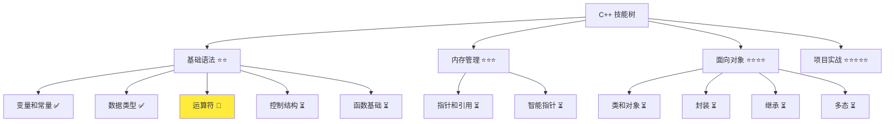
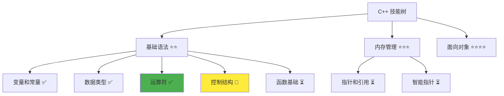

# 运算符详解

> **学习目标**：掌握 C++ 运算符的使用、优先级和表达式求值规则  
> **前置知识**：C++ 变量和常量、数据类型  
> **预计时间**：45 分钟  
> **难度等级**：⭐⭐  
> **技能收获**：运算符使用、表达式求值、优先级理解、复合赋值  
> **文档版本**：v1.0  
> **最后更新**：2025-10-23

📊 **难度等级说明**

| 等级           | 描述                       | 练习题数量     | 颜色码 |
| -------------- | -------------------------- | -------------- | ------ |
| **⭐**         | 入门级，零基础可学         | 5 题基础概念题 | 🟢绿   |
| **⭐⭐**       | 基础级，需要基本编程概念   | 5 题基础概念题 | 🟡黄   |
| **⭐⭐⭐**     | 中级，需要相关技术基础     | 3 题代码分析题 | 🟠橙   |
| **⭐⭐⭐⭐**   | 高级，需要扎实的技术功底   | 3 题代码分析题 | 🔴红   |
| **⭐⭐⭐⭐⭐** | 专家级，需要丰富的项目经验 | 2 题设计思考题 | 🟣紫   |

## 1. 学习目标

### 1.1 学习动机

- **实际需求**：运算符是表达式的基础，掌握运算符是编写正确程序的前提
- **应用场景**：数学计算、逻辑判断、赋值操作、数据比较
- **技能价值**：学会后能正确编写表达式，避免逻辑错误，提高代码质量
- **数据支持**：根据 Stack Overflow 2023 调查，运算符优先级错误是初学者最常见的错误之一

### 1.2 技能树位置



### 1.3 前置知识检查

在开始学习之前，请确认你已经掌握：

- [ ] C++ 变量声明和初始化
- [ ] 基本数据类型（int、double、bool、std::string）
- [ ] 基本的输出操作（std::cout）

> **未掌握处理**：若未通过，请先学习 [数据类型详解](./03-data-types.md)

## 2. 核心内容

### 2.1 概念理解

**运算符**：对数据进行操作的符号，如加减乘除、比较大小、逻辑判断等。就像数学中的计算符号，但功能更强大。

> **类比教学**：运算符就像计算器上的各种按钮，每个按钮都有特定的功能。就像 "+" 按钮用来做加法，"==" 按钮用来比较两个数是否相等。

### 2.2 基础语法

C++ 提供了丰富的运算符类别：

#### 2.2.1 算术运算符

- **加法**：`+` - 两数相加，就像计算器上的加号
- **减法**：`-` - 两数相减，就像计算器上的减号
- **乘法**：`*` - 两数相乘，就像计算器上的乘号
- **除法**：`/` - 两数相除，就像计算器上的除号
- **取余**：`%` - 两数相除后的余数，就像"分蛋糕"剩下的部分

#### 2.2.2 赋值运算符

- **基本赋值**：`=` - 将值赋给变量，就像把东西放到盒子里
- **加法赋值**：`+=` - 先加后赋值，就像先往盒子里添东西再封好
- **减法赋值**：`-=` - 先减后赋值
- **乘法赋值**：`*=` - 先乘后赋值
- **除法赋值**：`/=` - 先除后赋值

#### 2.2.3 自增自减运算符

- **前置自增**：`++x` - 先加 1再使用，就像先升级再使用
- **后置自增**：`x++` - 先使用再加 1，就像使用完再升级
- **前置自减**：`--x` - 先减 1再使用，就像先降级再使用
- **后置自减**：`x--` - 先使用再减 1，就像使用完再降级

> **重要提示**：`x++` 和 `++x` 的区别在于使用顺序。`++x` 先递增再返回值（就像先调档位再开车），`x++` 先返回值再递增（就像先开车再调档位）。

#### 2.2.4 比较运算符

- **等于**：`==` - 判断两数是否相等，就像用天平比较重量
- **不等于**：`!=` - 判断两数是否不等
- **大于**：`>` - 判断左数是否大于右数
- **小于**：`<` - 判断左数是否小于右数
- **大于等于**：`>=` - 判断左数是否大于或等于右数
- **小于等于**：`<=` - 判断左数是否小于或等于右数

#### 2.2.5 逻辑运算符

- **与**：`&&` - 两个条件都为真才为真，就像两把锁都要开
- **或**：`||` - 至少一个条件为真就为真，就像开任意一把锁即可
- **非**：`!` - 条件取反，真变假，假变真

### 2.3 代码示例

#### 2.3.1 基础示例

以下代码演示了 C++ 中各种运算符的使用方法，包括算术、赋值、比较和逻辑运算符：

```cpp
// 现代 C++ 示例 - 运算符基础
#include <iostream>

int main() {
    // 算术运算符
    int a = 10, b = 3;
    std::cout << "=== 算术运算符 ===" << std::endl;
    std::cout << "a = " << a << ", b = " << b << std::endl;
    std::cout << "a + b = " << (a + b) << std::endl;
    std::cout << "a - b = " << (a - b) << std::endl;
    std::cout << "a * b = " << (a * b) << std::endl;
    std::cout << "a / b = " << (a / b) << std::endl;
    std::cout << "a % b = " << (a % b) << std::endl;

    // 赋值运算符
    int c = 5;
    std::cout << "\n=== 赋值运算符 ===" << std::endl;
    std::cout << "原始 c = " << c << std::endl;
    c += 3;  // c = c + 3
    std::cout << "c += 3, c = " << c << std::endl;
    c *= 2;  // c = c * 2
    std::cout << "c *= 2, c = " << c << std::endl;

    // 比较运算符
    std::cout << "\n=== 比较运算符 ===" << std::endl;
    bool result1 = (a > b);
    bool result2 = (a == b);
    std::cout << "a > b  : " << result1 << std::endl;
    std::cout << "a == b : " << result2 << std::endl;

    // 逻辑运算符
    std::cout << "\n=== 逻辑运算符 ===" << std::endl;
    bool x = true, y = false;
    std::cout << "x = " << x << ", y = " << y << std::endl;
    std::cout << "x && y = " << (x && y) << std::endl;
    std::cout << "x || y = " << (x || y) << std::endl;
    std::cout << "!x = " << (!x) << std::endl;

    // 自增自减运算符
    std::cout << "\n=== 自增自减运算符 ===" << std::endl;
    int d = 5, e = 5;
    std::cout << "d = " << d << ", e = " << e << std::endl;
    std::cout << "++d 后的值: " << (++d) << std::endl;  // 前置自增
    std::cout << "e++ 的值: " << (e++) << std::endl;    // 后置自增
    std::cout << "e++ 后，e = " << e << std::endl;

    return 0;
}
```

#### 2.3.2 配套代码文件

项目提供了配套的源代码文件：

- **文件位置**：`src/stage1/04-operators/01-basic-operators.cpp`
- **文件内容**：与上面示例完全一致的运算符程序

> **运行提示**：具体的编译运行方法请参考 [C++ 简介和快速入门](./01-cpp-introduction.md) 中的 `2.2.3 编译运行` 部分

#### 2.3.3 运行预期结果

```
=== 算术运算符 ===
a = 10, b = 3
a + b = 13
a - b = 7
a * b = 30
a / b = 3
a % b = 1

=== 赋值运算符 ===
原始 c = 5
c += 3, c = 8
c *= 2, c = 16

=== 比较运算符 ===
a > b  : 1
a == b : 0

=== 逻辑运算符 ===
x = 1, y = 0
x && y = 0
x || y = 1
!x = 0

=== 自增自减运算符 ===
d = 5, e = 5
++d 后的值: 6
e++ 的值: 5
e++ 后，e = 6
```

#### 2.3.4 代码详解

以下代码片段展示了基础示例中的核心用法，让我们详细解释：

```cpp
int a = 10, b = 3;
int result = a + b;          // 加法运算
int quotient = a / b;        // 整数除法
int remainder = a % b;       // 取余运算

c += 3;                      // 复合赋值：c = c + 3
bool isGreater = (a > b);    // 比较运算
bool logicAnd = (x && y);    // 逻辑与运算

int value = 5;
int pre = ++value;           // 前置自增：value先加1再返回，pre=6, value=6
int post = value++;          // 后置自增：value先返回再加1，post=6, value=7
```

**详细说明**：

- **算术运算符**：用于数值计算，就像计算器上的按钮
  - **整数除法**：`10 / 3 = 3`（舍去小数部分），就像分苹果，10 个苹果 3 人分，每人得到 3 个
  - **取余运算**：`10 % 3 = 1`（得到余数），就像分苹果剩下的 1 个
- **复合赋值**：先运算后赋值，就像先计算再更新变量值
  - `c += 3` 等价于 `c = c + 3`，就像往盒子里再加 3 样东西
- **自增自减运算符**：用于递增或递减变量
  - **前置自增**：`++value` 先加 1再返回，就像先升级再使用新功能
  - **后置自增**：`value++` 先返回原值再加 1，就像先用旧功能再升级
  - **区别**：`int x = 5; int a = ++x;` 后 `a=6, x=6`，而 `int b = x++;` 后 `b=6, x=7`
- **比较运算符**：返回 `bool` 类型（真或假），就像判断对错
  - `a > b` 返回 `true` 或 `false`，就像问"10 大于 3 吗？"答案是真
- **逻辑运算符**：用于多个条件的组合判断
  - `&&`：两个条件都为真才为真，就像两把锁都要开
  - `||`：至少一个条件为真就为真，就像开任意一把锁即可
  - `!`：取反，真变假，假变真

**重要语法规则**：

1. **整数除法**：两个整数相除时，结果也是整数（舍去小数部分）。如 `10 / 3 = 3`，不是 `3.33`。就像分苹果，不能分成小数个。
2. **取余运算（%）**：只能用于整数类型，返回除法运算的余数。如 `10 % 3 = 1`（10 除以 3 余 1）。就像分东西时剩下的部分。
3. **自增自减的使用**：单独使用时（如 `x++;`）前置和后置效果相同，但作为表达式使用时有区别。建议初学者优先使用前置形式 `++x`，因为它更直观。
4. **运算符优先级**：不同的运算符有不同的优先级，就像数学中的运算顺序（先乘除后加减）。

### 2.4 运算符优先级

#### 2.4.1 优先级规则

运算符优先级就像数学中的运算顺序，优先级高的运算符先计算：

| 优先级 | 运算符     | 说明       | 类比                         |
| ------ | ---------- | ---------- | ---------------------------- |
| 1      | `()`       | 括号       | 就像计算时括号最优先         |
| 2      | `*/%`      | 乘除模     | 次优先，就像先算乘除         |
| 3      | `+-`       | 加减       | 最后算，就像先算乘除后算加减 |
| 4      | `<> <= >=` | 比较运算   | 在加减之后                   |
| 5      | `== !=`    | 等于不等于 | 比较的最后                   |
| 6      | `&&`       | 逻辑与     | 逻辑判断中优先               |
| 7      | `\|\|`     | 逻辑或     | 逻辑判断中最后               |
| 8      | `=`        | 赋值       | 最后执行                     |

#### 2.4.2 优先级示例

```cpp
int a = 10, b = 3, c = 2;
int result = a + b * c;      // 先算 b*c，再算 a+6 = 16（不是 26）
int result2 = (a + b) * c;   // 先算 a+b，再算 13*2 = 26
bool logic = a > b && b < c; // 先算 a>b，再算 b<c，最后算 &&
```

> **重要提示**：当不确定优先级时，使用括号明确运算顺序，就像数学中括号可以让计算更清晰。

### 2.5 关键特性与设计原理

#### 2.5.1 关键特性

1. **类型安全**：运算符会自动进行类型转换，防止类型错误。就像不同单位转换，比如米变厘米
2. **效率优化**：复合赋值运算符（如 `+=`）比普通赋值更高效，减少代码冗余。就像打包时直接往包里放，比先拿出再放回更省事
3. **逻辑清晰**：比较和逻辑运算符使条件判断更直观。就像用判断题和选择题来判断条件
4. **计算准确**：整数除法和取余运算提供精确的整数计算能力。就像分苹果时能够准确地计算余数

#### 2.5.2 设计原理

- **为什么这样设计**：运算符提供灵活的数据操作能力，使程序能够进行计算和判断。就像计算器上的各种按钮，每个都有特定功能
- **解决了什么问题**：解决了程序需要计算、比较和逻辑判断的问题。没有运算符，程序就无法处理数据
- **有什么优势**：操作简单（符号直观）、效率高（硬件支持）、逻辑清晰（表达式易读）、类型安全（自动转换）

## 3. 实践应用

### 3.1 项目场景

在 QtLanChat 项目中，运算符用于：

- **用户认证**：判断密码是否正确（`password == inputPassword`）
- **消息计数**：统计消息数量（`messageCount++`）
- **条件显示**：根据年龄判断是否显示内容（`age >= 18 && isVip`）

### 3.2 实际代码

以下代码展示了运算符在 QtLanChat 项目中的实际应用：

```cpp
// 项目中的实际应用示例
#include <iostream>
#include <string>

int main() {
    // 用户信息
    int messageCount = 0;
    int userAge = 20;
    bool isVip = true;

    // 模拟收到消息（使用 += 运算符）
    messageCount += 1;  // messageCount = messageCount + 1
    std::cout << "收到新消息！当前消息数: " << messageCount << std::endl;

    // 年龄判断（使用比较和逻辑运算符）
    bool canAccess = (userAge >= 18) && isVip;
    std::cout << "年龄: " << userAge << ", VIP: " << isVip << std::endl;
    std::cout << "能否访问高级功能: " << canAccess << std::endl;

    // 消息状态（使用取余运算符检查奇偶数）
    if (messageCount % 2 == 0) {
        std::cout << "消息数量为偶数" << std::endl;
    } else {
        std::cout << "消息数量为奇数" << std::endl;
    }

    return 0;
}
```

> **配套代码**：实际应用示例的完整代码位于 `src/stage1/04-operators/02-project-example.cpp`

### 3.3 设计思路

- **为什么选择这种设计**：使用运算符进行条件判断和数据计算，让程序更智能
- **解决了什么问题**：提供了灵活的数据操作和逻辑判断机制
- **有什么优势**：代码简洁、逻辑清晰、易于理解和维护

## 4. 练习与测试

### 4.1 练习题

#### 练习 1：算术运算

**题目**：编写程序进行基本的算术运算

**要求**：

- 定义两个整数变量
- 执行加、减、乘、除、取余运算
- 输出所有运算结果

**参考答案**：

```cpp
#include <iostream>

int main() {
    int a = 25, b = 4;

    std::cout << "=== 算术运算 ===" << std::endl;
    std::cout << "a = " << a << ", b = " << b << std::endl;
    std::cout << "a + b = " << (a + b) << std::endl;
    std::cout << "a - b = " << (a - b) << std::endl;
    std::cout << "a * b = " << (a * b) << std::endl;
    std::cout << "a / b = " << (a / b) << std::endl;
    std::cout << "a % b = " << (a % b) << std::endl;

    return 0;
}
```

**运行结果**：

```
=== 算术运算 ===
a = 25, b = 4
a + b = 29
a - b = 21
a * b = 100
a / b = 6
a % b = 1
```

> **配套代码**：练习 1 的完整代码位于 `src/stage1/04-operators/03-exercise-arithmetic.cpp`

#### 练习 2：复合赋值

**题目**：使用复合赋值运算符更新变量值

**要求**：

- 初始变量值为 10
- 使用 +=、-=、\*=、/= 运算符
- 输出每次运算后的结果

**参考答案**：

```cpp
#include <iostream>

int main() {
    int value = 10;

    std::cout << "=== 复合赋值运算 ===" << std::endl;
    std::cout << "初始值: " << value << std::endl;

    value += 5;  // value = value + 5
    std::cout << "value += 5: " << value << std::endl;

    value -= 3;  // value = value - 3
    std::cout << "value -= 3: " << value << std::endl;

    value *= 2;  // value = value * 2
    std::cout << "value *= 2: " << value << std::endl;

    value /= 3;  // value = value / 3
    std::cout << "value /= 3: " << value << std::endl;

    return 0;
}
```

> **配套代码**：练习 2 的完整代码位于 `src/stage1/04-operators/04-exercise-compound-assignment.cpp`

#### 练习 3：比较运算

**题目**：使用比较运算符判断两个数的大小关系

**要求**：

- 定义两个整数
- 使用 >、<、== 等比较运算符
- 输出比较结果

**参考答案**：

```cpp
#include <iostream>

int main() {
    int a = 15, b = 20;

    std::cout << "=== 比较运算 ===" << std::endl;
    std::cout << "a = " << a << ", b = " << b << std::endl;

    std::cout << "a > b  : " << (a > b) << std::endl;
    std::cout << "a < b  : " << (a < b) << std::endl;
    std::cout << "a == b : " << (a == b) << std::endl;
    std::cout << "a != b : " << (a != b) << std::endl;

    return 0;
}
```

> **配套代码**：练习 3 的完整代码位于 `src/stage1/04-operators/05-exercise-comparison.cpp`

#### 练习 4：逻辑运算

**题目**：使用逻辑运算符组合多个条件

**要求**：

- 定义两个 bool 变量
- 使用 &&、||、! 运算符
- 输出逻辑运算结果

**参考答案**：

```cpp
#include <iostream>

int main() {
    bool condition1 = true;
    bool condition2 = false;

    std::cout << "=== 逻辑运算 ===" << std::endl;
    std::cout << "condition1 = " << condition1 << std::endl;
    std::cout << "condition2 = " << condition2 << std::endl;

    std::cout << "condition1 && condition2: " << (condition1 && condition2) << std::endl;
    std::cout << "condition1 || condition2: " << (condition1 || condition2) << std::endl;
    std::cout << "!condition1: " << (!condition1) << std::endl;

    return 0;
}
```

> **配套代码**：练习 4 的完整代码位于 `src/stage1/04-operators/06-exercise-logical.cpp`

#### 练习 5：综合应用

**题目**：创建一个简单的计算器，综合运用各种运算符

**要求**：

- 定义两个数字
- 执行四则运算
- 使用比较运算符判断结果
- 使用逻辑运算符组合条件

**参考答案**：

```cpp
#include <iostream>

int main() {
    std::cout << "=== 综合练习：简单计算器 ===" << std::endl;

    int num1 = 15, num2 = 3;

    // 算术运算
    int sum = num1 + num2;
    int product = num1 * num2;

    std::cout << "num1 = " << num1 << ", num2 = " << num2 << std::endl;
    std::cout << "sum = " << sum << ", product = " << product << std::endl;

    // 比较运算
    bool isSumGreater = (sum > product);
    std::cout << "sum > product: " << isSumGreater << std::endl;

    // 逻辑运算
    bool complex = (num1 > 10) && (num2 < 5);
    std::cout << "(num1 > 10) && (num2 < 5): " << complex << std::endl;

    return 0;
}
```

> **配套代码**：练习 5 的完整代码位于 `src/stage1/04-operators/07-exercise-comprehensive.cpp`

### 4.2 测试题

1. **关于运算符优先级，下列说法正确的是：**
   A. 乘法和除法比加减法优先

   B. 比较运算符比算术运算符优先

   C. 逻辑运算符比赋值运算符优先

   D. 所有运算符优先级相同
   **答案**：A

   **解析**：
   - **正确答案 A**：乘法和除法（\*/%）比加减法优先级高，就像数学中的先乘除后加减
   - **错误答案 B**：比较运算符优先级低于算术运算符
   - **错误答案 C**：赋值运算符优先级最低
   - **错误答案 D**：不同运算符有不同的优先级

2. **关于整数除法，下列说法正确的是：**
   A. `10 / 3 = 3.33`

   B. `10 / 3 = 3`（小数部分被舍去）

   C. `10 / 3 = 3`（产生编译错误）

   D. `10 / 3 = 4`（四舍五入）
   **答案**：B

   **解析**：
   - **正确答案 B**：整数除法会舍去小数部分，结果为 3
   - **错误答案 A**：整数除法不返回小数
   - **错误答案 C**：不会产生编译错误
   - **错误答案 D**：整数除法不四舍五入，直接截断

### 4.3 常见问题 FAQ

> **FAQ 来源**：基于 cppreference.com 和 Stack Overflow 常见问题整理

- Q1：整数除法和浮点数除法有什么区别？
  - **A：**整数除法结果也是整数，舍去小数部分；浮点数除法结果可以是小数。就像整数计算 `10 / 3 = 3`，浮点数计算 `10.0 / 3.0 = 3.33`

- Q2：什么时候使用复合赋值运算符？
  - **A：**需要在原有值基础上更新时使用，如 `count += 1`。就像往盒子里再添东西，比拿出重放更高效

- Q3：逻辑运算符 && 和 || 有什么区别？
  - **A：**`&&` 需要两个条件都为真，`||` 只要一个条件为真即可。就像两把锁都要开 vs 开任意一把锁

## 5. 资源与扩展

### 5.1 基础资源

- **官方文档**：[C++ 运算符](https://en.cppreference.com/w/cpp/language/operator_precedence)
- **权威书籍**：《C++ Primer》- 第 4 章
- **在线教程**：[learncpp.com](https://www.learncpp.com/) - 运算符教程

### 5.2 多媒体学习

- **视频资源**：[C++ 运算符详解](https://www.youtube.com/watch?v=8jLOx1hD3_o)
- **开发者资源**：[cppreference.com](https://en.cppreference.com/) - 权威参考

## 6. 课后作业及参考答案

### 6.1 学习检查清单

- [ ] 能够使用算术运算符进行计算
- [ ] 理解运算符优先级规则
- [ ] 掌握复合赋值运算符的使用
- [ ] 能够正确使用比较和逻辑运算符

### 6.2 综合练习

**作业题目**：创建一个成绩判断系统

**要求**：

- 定义学生的语文、数学、英语成绩
- 计算平均分
- 使用比较运算符判断是否及格（平均分 >= 60）
- 使用逻辑运算符判断是否优秀（平均分 >= 90）

**时间估算**：30 分钟

**参考答案**：

```cpp
#include <iostream>

int main() {
    std::cout << "=== 成绩判断系统 ===" << std::endl;

    int chinese = 85;
    int math = 90;
    int english = 88;

    // 计算平均分
    int total = chinese + math + english;
    int average = total / 3;

    // 判断及格和优秀
    bool isPass = (average >= 60);
    bool isExcellent = (average >= 90);

    // 输出结果
    std::cout << "语文: " << chinese << " 分" << std::endl;
    std::cout << "数学: " << math << " 分" << std::endl;
    std::cout << "英语: " << english << " 分" << std::endl;
    std::cout << "平均分: " << average << " 分" << std::endl;
    std::cout << "是否及格: " << isPass << std::endl;
    std::cout << "是否优秀: " << isExcellent << std::endl;

    return 0;
}
```

**评分标准**：功能实现（40%）、代码质量（30%）、设计思路（30%）

## 7. 下一步学习

**下一篇**：[05-控制结构](./05-control-structures.md)

**学习路径**：

1. ✅ C++ 简介和快速入门 - 已完成
2. ✅ 变量和常量 - 已完成
3. ✅ 数据类型详解 - 已完成
4. ✅ 运算符详解 - 已完成
5. 🔄 控制结构 - 下一步

**技能树更新**：



**学习成果**：

- **独立编写**：能够编写使用各种运算符的表达式
- **解释原理**：能够解释运算符优先级和表达式求值顺序
- **解决实际问题**：能够在实际项目中正确使用运算符
- **应用到项目**：为后续控制结构学习打下基础
- **掌握度自评**：85%

### 学习成果指导

> **自评指导**：
>
> - **<50%**：建议复习运算符基础，重新阅读文档核心内容
> - **50-80%**：继续学习，完成练习题巩固理解
> - **>80%**：可以进入下一阶段学习，开始控制结构详解
