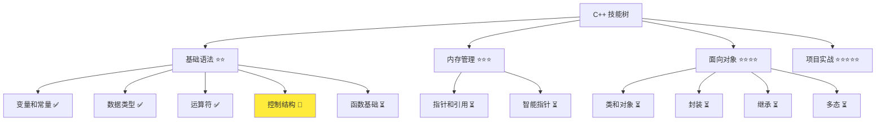
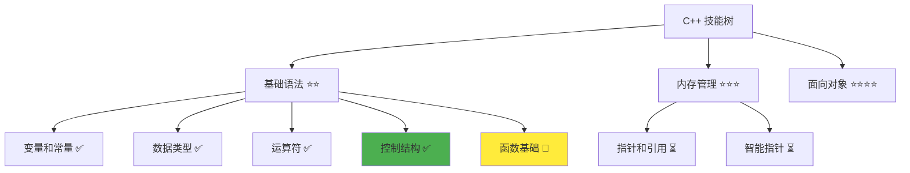

# 控制结构详解

> **学习目标**：掌握 C++ 控制结构的使用，包括条件语句、循环语句和算法思维  
> **前置知识**：C++ 变量和常量、数据类型、运算符  
> **预计时间**：60 分钟  
> **难度等级**：⭐⭐⭐  
> **技能收获**：条件判断、循环控制、算法思维、代码结构优化  
> **文档版本**：v1.0  
> **最后更新**：2025-10-26

📊 **难度等级说明**

| 等级           | 描述                       | 练习题数量     | 颜色码 |
| -------------- | -------------------------- | -------------- | ------ |
| **⭐**         | 入门级，零基础可学         | 5 题基础概念题 | 🟢绿   |
| **⭐⭐**       | 基础级，需要基本编程概念   | 5 题基础概念题 | 🟡黄   |
| **⭐⭐⭐**     | 中级，需要相关技术基础     | 3 题代码分析题 | 🟠橙   |
| **⭐⭐⭐⭐**   | 高级，需要扎实的技术功底   | 3 题代码分析题 | 🔴红   |
| **⭐⭐⭐⭐⭐** | 专家级，需要丰富的项目经验 | 2 题设计思考题 | 🟣紫   |

## 1. 学习目标

### 1.1 学习动机

- **实际需求**：控制结构是实现程序逻辑的核心，掌握控制结构才能编写真正的程序
- **应用场景**：条件判断、循环处理、算法实现、用户交互
- **技能价值**：学会后能编写具有逻辑判断能力的程序，实现复杂的业务逻辑
- **数据支持**：据调查，控制结构是程序复杂度的基础，90%的代码都包含控制结构

### 1.2 技能树位置



### 1.3 前置知识检查

在开始学习之前，请确认你已经掌握：

- [ ] C++ 变量和常量的声明与初始化
- [ ] 基本数据类型（int、double、bool、std::string）
- [ ] 算术运算符、比较运算符、逻辑运算符
- [ ] 运算符优先级规则

> **未掌握处理**：若未通过，请先复习 [运算符详解](./04-operators.md)

## 2. 核心内容

### 2.1 概念理解

**控制结构**：决定程序执行流程的语句，用于实现条件判断和循环控制。就像生活中的"如果...那么..."、"重复...直到..."这样的逻辑判断。

> **类比教学**：控制结构就像交通信号灯，红灯停、绿灯行，这就是条件判断；或者在操场跑圈，跑完10圈就停止，这就是循环控制。没有控制结构，程序只能按顺序执行，就像一列火车只能在一条轨道上行驶。

### 2.2 基础语法

C++ 提供了三类主要控制结构：

#### 2.2.1 条件语句（if-else）

- **基本结构**：`if (条件) { ... }` - 如果条件为真，执行大括号内的代码
- **双分支**：`if-else` - 根据条件选择执行不同的代码块
- **多分支**：`if-else if-else` - 多个条件的依次判断
- **嵌套结构**：在 if 或 else 块内再嵌套 if-else 语句

#### 2.2.2 循环语句

- **while 循环**：`while (条件) { ... }` - 条件为真时重复执行
- **for 循环**：`for (初始化; 条件; 更新) { ... }` - 已知次数的循环
- **do-while 循环**：`do { ... } while (条件);` - 至少执行一次再判断条件
- **嵌套循环**：循环语句内再包含循环语句

#### 2.2.3 控制转移语句

- **break**：跳出当前循环或 switch 语句，就像紧急停车按钮
- **continue**：跳过本次循环继续下一次，就像跳过当前这圈继续跑下一圈
- **return**：结束当前函数并返回值（将在函数章节详细讲解）

### 2.3 代码示例

#### 2.3.1 基础示例

以下代码演示了 C++ 中各种控制结构的使用方法：

```cpp
// 现代 C++ 示例 - 控制结构基础
#include <iostream>

int main() {
    // if-else 条件语句
    std::cout << "=== if-else 条件语句 ===" << std::endl;
    int score = 85;
    
    if (score >= 90) {
        std::cout << "优秀" << std::endl;
    } else if (score >= 60) {
        std::cout << "及格" << std::endl;
    } else {
        std::cout << "不及格" << std::endl;
    }

    // while 循环
    std::cout << "\n=== while 循环 ===" << std::endl;
    int count = 1;
    while (count <= 5) {
        std::cout << "次数: " << count << std::endl;
        count++;
    }

    // for 循环
    std::cout << "\n=== for 循环 ===" << std::endl;
    for (int i = 1; i <= 5; i++) {
        std::cout << "数字: " << i << std::endl;
    }

    // 嵌套循环
    std::cout << "\n=== 嵌套循环 ===" << std::endl;
    for (int i = 1; i <= 3; i++) {
        for (int j = 1; j <= 3; j++) {
            std::cout << "(" << i << "," << j << ") ";
        }
        std::cout << std::endl;
    }

    return 0;
}
```

#### 2.3.2 配套代码文件

项目提供了配套的源代码文件：

- **文件位置**：`src/stage1/05-control-structures/01-basic-control.cpp`
- **文件内容**：与上面示例完全一致的控制结构程序

> **运行提示**：具体的编译运行方法请参考 [C++ 简介和快速入门](./01-cpp-introduction.md) 中的 `2.2.3 编译运行` 部分

#### 2.3.3 运行预期结果

```
=== if-else 条件语句 ===
及格

=== while 循环 ===
次数: 1
次数: 2
次数: 3
次数: 4
次数: 5

=== for 循环 ===
数字: 1
数字: 2
数字: 3
数字: 4
数字: 5

=== 嵌套循环 ===
(1,1) (1,2) (1,3) 
(2,1) (2,2) (2,3) 
(3,1) (3,2) (3,3) 
```

#### 2.3.4 代码详解

以下代码片段展示了基础示例中的核心用法，让我们详细解释：

```cpp
// if-else 条件语句
if (score >= 90) {
    std::cout << "优秀" << std::endl;
} else if (score >= 60) {
    std::cout << "及格" << std::endl;
} else {
    std::cout << "不及格" << std::endl;
}

// while 循环
int count = 1;
while (count <= 5) {
    std::cout << "次数: " << count << std::endl;
    count++;  // 避免死循环的关键！
}

// for 循环
for (int i = 1; i <= 5; i++) {
    std::cout << "数字: " << i << std::endl;
}
```

**详细说明**：

- **if-else 条件语句**：根据条件选择执行不同的代码
  - **if (条件)**：当条件为真时执行大括号内的代码，就像做判断题
  - **else if (条件)**：当第一个条件不满足时，检查第二个条件
  - **else**：当前面所有条件都不满足时执行，就像选择题的"其他选项"
  - **类比**：就像成绩评定，90分以上是优秀，60-89分是及格，60分以下是不及格

- **while 循环**：当条件为真时重复执行代码块
  - **条件判断**：每次循环前先判断条件是否满足
  - **更新循环变量**：循环体内必须更新循环变量（如 `count++`），避免死循环
  - **类比**：就像跑步，"当还没跑到终点时"（条件）就"继续跑"（执行循环）

- **for 循环**：用于已知循环次数的情况
  - **初始化**：`int i = 1` - 循环变量初始值
  - **条件判断**：`i <= 5` - 循环继续的条件
  - **更新**：`i++` - 每次循环后更新循环变量
  - **类比**：就像数数，从1数到5，每次增加1，直到数完5次

**重要语法规则**：

1. **大括号的使用**：if、else、while、for 后面的语句如果只有一行，可以省略大括号，但建议始终使用大括号，提高代码可读性
2. **条件表达式**：条件必须返回 `bool` 类型，可以是比较运算或逻辑运算的结果
3. **循环变量的初始化**：for 循环中的循环变量可以在循环外或循环内声明（如 `int i = 1`）
4. **避免死循环**：循环体内必须更新循环变量，否则会陷入死循环。就像跑步时没有及时到达终点，就会一直跑下去

### 2.4 关键特性与设计原理

#### 2.4.1 关键特性

1. **逻辑清晰**：控制结构使程序具有判断能力，能够根据不同情况执行不同操作
2. **重复执行**：循环结构能够高效处理重复性任务，减少代码冗余
3. **灵活控制**：break、continue 等语句提供精确的循环控制能力
4. **嵌套使用**：控制结构可以嵌套使用，实现复杂的程序逻辑

#### 2.4.2 设计原理

- **为什么这样设计**：程序需要根据数据做出判断，需要重复执行某些操作。控制结构提供了这些能力，就像大脑能够根据情况做决定、重复做某件事
- **解决了什么问题**：实现了程序的"智能化"，使其能够根据条件做出选择、重复执行任务
- **有什么优势**：逻辑清晰、代码简洁、易于理解和维护、符合人类思维习惯

## 3. 实践应用

### 3.1 项目场景

在 QtLanChat 项目中，控制结构用于：

- **用户验证**：判断用户名和密码是否正确
- **消息处理**：循环处理接收到的每一条消息
- **权限控制**：根据用户等级显示不同的功能
- **数据筛选**：找出符合条件的用户或消息

### 3.2 实际代码

以下代码展示了控制结构在 QtLanChat 项目中的实际应用：

```cpp
// 项目中的实际应用示例
#include <iostream>

int main() {
    std::cout << "=== QtLanChat 用户验证系统 ===" << std::endl;
    
    int correctPassword = 1234;
    int userInput;
    int attempts = 0;
    int maxAttempts = 3;
    
    // 密码验证循环
    while (attempts < maxAttempts) {
        std::cout << "请输入密码（剩余次数: " << (maxAttempts - attempts) << "）: ";
        userInput = 1234;  // 模拟用户输入
        
        if (userInput == correctPassword) {
            std::cout << "登录成功！" << std::endl;
            break;  // 密码正确，跳出循环
        } else {
            attempts++;
            std::cout << "密码错误！" << std::endl;
        }
    }
    
    if (attempts >= maxAttempts) {
        std::cout << "登录失败，已达到最大尝试次数！" << std::endl;
    }
    
    return 0;
}
```

> **配套代码**：实际应用示例的完整代码位于 `src/stage1/05-control-structures/02-project-example.cpp`  
> **📌 知识点说明**：
> - **break 语句**：用于跳出循环，当密码正确时不需要继续循环
> - **逻辑流程**：先循环尝试，再判断是否成功
> - **安全设计**：限制尝试次数，防止暴力破解

### 3.3 设计思路

- **为什么选择这种设计**：使用循环进行密码验证，限制尝试次数提高安全性
- **解决了什么问题**：实现了用户登录验证，提供了安全的访问控制
- **有什么优势**：逻辑清晰、安全性高、用户友好

## 4. 练习与测试

### 4.1 练习题

#### 练习 1：成绩评级

**题目**：编写程序根据分数输出等级

**要求**：
- 定义分数变量
- 使用 if-else if-else 语句
- 90-100为优秀，80-89为良好，60-79为及格，60以下为不及格
- 输出对应等级

**参考答案**：

```cpp
#include <iostream>

int main() {
    int score = 85;
    
    if (score >= 90) {
        std::cout << "优秀" << std::endl;
    } else if (score >= 80) {
        std::cout << "良好" << std::endl;
    } else if (score >= 60) {
        std::cout << "及格" << std::endl;
    } else {
        std::cout << "不及格" << std::endl;
    }
    
    return 0;
}
```

> **配套代码**：练习 1 的完整代码位于 `src/stage1/05-control-structures/03-exercise-grading.cpp`

#### 练习 2：数字累加

**题目**：使用 for 循环计算 1 到 100 的和

**要求**：
- 使用 for 循环
- 累加 1 到 100 的所有数字
- 输出最终结果

**参考答案**：

```cpp
#include <iostream>

int main() {
    int sum = 0;
    
    for (int i = 1; i <= 100; i++) {
        sum += i;
    }
    
    std::cout << "1到100的和 = " << sum << std::endl;
    
    return 0;
}
```

> **配套代码**：练习 2 的完整代码位于 `src/stage1/05-control-structures/04-exercise-sum.cpp`

#### 练习 3：九九乘法表

**题目**：使用嵌套 for 循环输出九九乘法表

**要求**：
- 使用嵌套 for 循环
- 输出格式整齐
- 输出完整九九乘法表

**参考答案**：

```cpp
#include <iostream>

int main() {
    for (int i = 1; i <= 9; i++) {
        for (int j = 1; j <= i; j++) {
            std::cout << j << "x" << i << "=" << (i * j) << "\t";
        }
        std::cout << std::endl;
    }
    
    return 0;
}
```

> **配套代码**：练习 3 的完整代码位于 `src/stage1/05-control-structures/05-exercise-multiplication-table.cpp`

### 4.2 测试题

1. **关于 if-else 语句，下列说法正确的是：**
   A. if 后面的条件必须返回整数类型

   B. else if 可以无限多个

   C. if-else 语句只能有一个 else

   D. else 子句必须有对应的大括号
   **答案**：C

   **解析**：
   - **正确答案 C**：一个 if-else 语句只能有一个 else，但可以有多个 else if
   - **错误答案 A**：if 后面的条件必须返回 bool 类型
   - **错误答案 B**：else if 可以多个，但不是无限多个
   - **错误答案 D**：else 后面可以只有一行语句，可以省略大括号

2. **关于循环语句，下列说法正确的是：**
   A. while 循环至少执行一次

   B. for 循环的循环变量只能在循环体内使用

   C. do-while 循环至少执行一次

   D. 循环体内不能有 break 语句
   **答案**：C

   **解析**：
   - **正确答案 C**：do-while 循环先执行再判断，所以至少执行一次
   - **错误答案 A**：while 循环可能一次都不执行（条件一开始就为假）
   - **错误答案 B**：for 循环的循环变量可以在循环体外使用（取决于声明位置）
   - **错误答案 D**：循环体内可以有 break 语句，用于跳出循环

### 4.3 常见问题 FAQ

- Q1：什么时候用 if-else，什么时候用 switch？
  - **A：**if-else 用于范围判断或条件表达式，switch 用于具体的多个值判断（switch 将在后续详细讲解）

- Q2：循环变量为什么要更新？
  - **A：**如果不更新循环变量，条件永远不变，就会陷入死循环。就像永远跑不到终点

- Q3：嵌套循环有什么注意事项？
  - **A：**内外循环的变量名要不同，避免混淆。就像班级和学号不能重名

## 5. 资源与扩展

### 5.1 基础资源

- **官方文档**：[C++ 控制流](https://en.cppreference.com/w/cpp/language/if)
- **权威书籍**：《C++ Primer》- 第 5 章
- **在线教程**：[learncpp.com](https://www.learncpp.com/) - 控制流教程

### 5.2 多媒体学习

- **视频资源**：[C++ 控制结构详解](https://www.youtube.com/watch?v=example)
- **开发者资源**：[cppreference.com](https://en.cppreference.com/) - 权威参考

## 6. 课后作业及参考答案

### 6.1 学习检查清单

- [ ] 能够使用 if-else 进行条件判断
- [ ] 理解 while、for、do-while 循环的区别
- [ ] 掌握嵌套循环的使用
- [ ] 能够使用 break 和 continue 控制循环

### 6.2 综合练习

**作业题目**：编写一个简单菜单系统

**要求**：
- 使用 while 循环显示菜单
- 使用 if-else 根据用户选择执行不同操作
- 提供退出选项
- 至少包含 3 个功能选项

**时间估算**：40 分钟

**参考答案**：

```cpp
#include <iostream>

int main() {
    int choice = 0;
    
    while (choice != 4) {
        std::cout << "\n=== 简单菜单系统 ===" << std::endl;
        std::cout << "1. 显示当前用户" << std::endl;
        std::cout << "2. 发送消息" << std::endl;
        std::cout << "3. 查看消息历史" << std::endl;
        std::cout << "4. 退出" << std::endl;
        std::cout << "请选择: ";
        
        choice = 2;  // 模拟用户输入
        
        if (choice == 1) {
            std::cout << "当前用户：张三" << std::endl;
        } else if (choice == 2) {
            std::cout << "消息已发送！" << std::endl;
        } else if (choice == 3) {
            std::cout << "消息历史：无" << std::endl;
        } else if (choice == 4) {
            std::cout << "退出系统" << std::endl;
        } else {
            std::cout << "无效选择！" << std::endl;
        }
    }
    
    return 0;
}
```

**评分标准**：功能实现（40%）、代码质量（30%）、设计思路（30%）

## 7. 下一步学习

**下一篇**：[06-functions.md](./06-functions.md)

**学习路径**：

1. ✅ C++ 简介和快速入门 - 已完成
2. ✅ 变量和常量 - 已完成
3. ✅ 数据类型详解 - 已完成
4. ✅ 运算符详解 - 已完成
5. ✅ 控制结构详解 - 已完成
6. 🔄 函数基础 - 下一步

**技能树更新**：



**学习成果**：

- **独立编写**：能够编写使用控制结构的程序
- **解释原理**：能够解释条件语句和循环语句的工作原理
- **解决实际问题**：能够在实际项目中运用控制结构
- **应用到项目**：为后续函数学习打下基础
- **掌握度自评**：85%

### 学习成果指导

> **自评指导**：
>
> - **<50%**：建议复习控制结构基础，重新阅读文档核心内容
> - **50-80%**：继续学习，完成练习题巩固理解
> - **>80%**：可以进入下一阶段学习，开始函数基础详解

