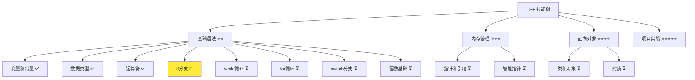
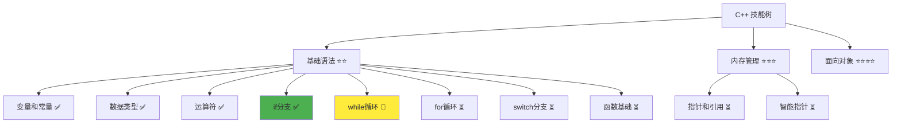

# 分支结构详解

> **学习目标**：掌握 C++ 分支结构的使用，包括 if-else 语句和条件判断  
> **前置知识**：C++ 变量和常量、数据类型、运算符  
> **预计时间**：30 分钟  
> **难度等级**：⭐⭐  
> **技能收获**：条件判断、if-else 语句、多分支结构、逻辑思维  
> **文档版本**：v1.0  
> **最后更新**：2025-10-26

📊 **难度等级说明**

| 等级           | 描述                       | 练习题数量     | 颜色码 |
| -------------- | -------------------------- | -------------- | ------ |
| **⭐**         | 入门级，零基础可学         | 5 题基础概念题 | 🟢绿   |
| **⭐⭐**       | 基础级，需要基本编程概念   | 5 题基础概念题 | 🟡黄   |
| **⭐⭐⭐**     | 中级，需要相关技术基础     | 3 题代码分析题 | 🟠橙   |
| **⭐⭐⭐⭐**   | 高级，需要扎实的技术功底   | 3 题代码分析题 | 🔴红   |
| **⭐⭐⭐⭐⭐** | 专家级，需要丰富的项目经验 | 2 题设计思考题 | 🟣紫   |

## 1. 学习目标

### 1.1 学习动机

- **实际需求**：分支结构是程序决策的基础，掌握分支结构才能让程序做出智能判断
- **应用场景**：条件判断、用户验证、权限控制、数据筛选
- **技能价值**：学会后能编写具有判断能力的程序，根据不同的情况执行不同的操作
- **数据支持**：几乎所有程序都需要条件判断，if-else 是最基础也是最重要的控制结构

### 1.2 技能树位置



### 1.3 前置知识检查

在开始学习之前，请确认你已经掌握：

- [ ] C++ 变量和常量的声明与初始化
- [ ] 基本数据类型（int、double、bool、std::string）
- [ ] 算术运算符、比较运算符（>, <, ==, !=）、逻辑运算符（&&, ||, !）
- [ ] 运算符优先级规则

> **未掌握处理**：若未通过，请先复习 [运算符详解](./04-operators.md)

## 2. 核心内容

### 2.1 概念理解

**分支结构（if-else）**：根据条件选择执行不同代码的语句结构。就像生活中的"如果...那么..."这样的逻辑判断。

> **类比教学**：分支结构就像交通信号灯，红灯停、绿灯行，根据信号灯的颜色（条件）决定是停车还是前进。没有分支结构，程序只能按顺序执行，就像只有一条路可以走。

### 2.2 基础语法

C++ 分支结构主要有三种形式：

#### 2.2.1 单分支（if）

**用途**：需要满足特定条件才执行某个操作

**基本语法**：

```cpp
if (条件) {
    // 条件为真时执行的代码
}
```

> 语法说明：当条件为真时，执行 `{}` 内的代码。

**类比**：就像"如果下雨，就带伞"，伪代码示例如下：

```
if (下雨) {
    带伞
}
```

#### 2.2.2 双分支（if-else）

**用途**：需要在两种情况下选择执行不同的操作

**基本语法**：

```cpp
if (条件) {
    // 条件为真时执行的代码
} else {
    // 条件为假时执行的代码
}
```

> 语法说明：当条件为真时，执行 `if` 后的代码；否则执行 `else` 后的代码。

**类比**：就像"如果天气好，就去公园，否则就待在家"，伪代码示例如下：

```
if (天气好) {
    去公园
} else {
    待在家
}
```

#### 2.2.3 多分支（if-else if-else）

**用途**：需要在多个条件下选择执行不同的操作

**基本语法**：

```cpp
if (条件1) {
    // 条件1为真时执行
} else if (条件2) {
    // 条件2为真时执行
} else if (条件3) {
    // 条件3为真时执行
} else {
    // 所有条件都不满足时执行
}
```

> 语法说明：从上到下依次检查条件，一旦找到满足的条件就执行对应的代码块并结束。

**类比**：就像成绩评定，90 分以上是优秀，80-89 是良好，60-79 是及格，60 以下是不及格，伪代码示例如下：

```
if (分数 >= 90) {
    评为优秀
} else if (分数 >= 80) {
    评为良好
} else if (分数 >= 60) {
    评为及格
} else {
    评为不及格
}
```

### 2.3 代码示例

#### 2.3.1 基础示例

以下代码演示了 C++ 中各种分支结构的使用方法：

```cpp
// 现代 C++ 示例 - 分支结构基础
#include <iostream>

int main() {
    // 单分支 - if
    std::cout << "=== 单分支 if ===" << std::endl;
    int temp = 30;
    if (temp > 25) {
        std::cout << "今天很热，建议少穿点" << std::endl;
    }

    // 双分支 - if-else
    std::cout << "\n=== 双分支 if-else ===" << std::endl;
    int age = 18;
    if (age >= 18) {
        std::cout << "已成年" << std::endl;
    } else {
        std::cout << "未成年" << std::endl;
    }

    // 多分支 - if-else if-else
    std::cout << "\n=== 多分支 if-else if-else ===" << std::endl;
    int score = 85;
    if (score >= 90) {
        std::cout << "优秀" << std::endl;
    } else if (score >= 80) {
        std::cout << "良好" << std::endl;
    } else if (score >= 60) {
        std::cout << "及格" << std::endl;
    } else {
        std::cout << "不及格" << std::endl;
    }

    // 嵌套分支
    std::cout << "\n=== 嵌套分支 ===" << std::endl;
    bool isVip = true;
    int userAge = 20;
    if (userAge >= 18) {
        if (isVip) {
            std::cout << "成年VIP用户，可以访问所有功能" << std::endl;
        } else {
            std::cout << "成年普通用户，可以访问基本功能" << std::endl;
        }
    } else {
        std::cout << "未成年用户，访问受限" << std::endl;
    }

    return 0;
}
```

#### 2.3.2 配套代码文件

项目提供了配套的源代码文件：

- **文件位置**：`src/stage1/05-if-branch/01-basic-if.cpp`
- **文件内容**：与上面示例完全一致的分支结构程序

> **运行提示**：具体的编译运行方法请参考 [C++ 简介和快速入门](./01-cpp-introduction.md) 中的 `2.2.3 编译运行` 部分

#### 2.3.3 运行预期结果

```
=== 单分支 if ===
今天很热，建议少穿点

=== 双分支 if-else ===
已成年

=== 多分支 if-else if-else ===
良好

=== 嵌套分支 ===
成年VIP用户，可以访问所有功能
```

#### 2.3.4 代码详解

以下代码片段展示了基础示例中的核心用法，让我们详细解释：

```cpp
// 单分支
if (temp > 25) {
    std::cout << "今天很热，建议少穿点" << std::endl;
}

// 双分支
if (age >= 18) {
    std::cout << "已成年" << std::endl;
} else {
    std::cout << "未成年" << std::endl;
}

// 多分支
if (score >= 90) {
    std::cout << "优秀" << std::endl;
} else if (score >= 80) {
    std::cout << "良好" << std::endl;
} else if (score >= 60) {
    std::cout << "及格" << std::endl;
} else {
    std::cout << "不及格" << std::endl;
}
```

**详细说明**：

- **单分支（if）**：只在条件为真时执行代码
  - **条件判断**：如果括号内的条件为真（true），就执行大括号内的代码
  - **类比**：就像"如果下雨了"（条件），就"带伞"（执行代码）
  - **注意**：条件为假时，什么都不做，直接跳过

- **双分支（if-else）**：根据条件执行不同的代码块
  - **if 块**：条件为真时执行
  - **else 块**：条件为假时执行
  - **类比**：就像"如果天气好"（条件），"就去公园"（if 块），否则"就待在家"（else 块）
  - **特点**：两个分支必须执行其中一个，就像硬币的两面

- **多分支（if-else if-else）**：依次检查多个条件
  - **执行顺序**：从上到下依次检查条件
  - **找到匹配**：一旦找到满足的条件，执行对应的代码块并结束
  - **类比**：就像成绩评定，从上到下检查分数区间，找到对应的等级
  - **注意**：多个 else if 可以有多个，但 else 只能有一个
  - **最佳实践提示**：从代码可读性和维护性考虑，建议 else if 的数量不超过 3-5 个。如果条件过多，可以考虑使用 switch 语句（后续章节会学习）或重构代码结构

- **嵌套分支**：在 if 或 else 块内再嵌套 if-else 语句
  - **用途**：处理更复杂的条件判断
  - **类比**：就像先判断是否成年（外层），再判断是否 VIP（内层）
  - **注意**：嵌套层级不宜过深，一般不超过 2-3 层

**重要语法规则**：

1. **大括号的使用**：if、else 后面的语句如果只有一行，可以省略大括号，但**强烈建议始终使用大括号**，提高代码可读性和避免潜在错误
2. **条件表达式**：条件必须返回 `bool` 类型，可以是比较运算或逻辑运算的结果
3. **else 的数量**：一个 if-else 语句只能有一个 else，但可以有多个 else if
4. **执行顺序**：多分支结构按照从上到下的顺序检查条件，一旦找到满足的条件就执行并结束，不会继续检查后面的条件

### 2.4 关键特性与设计原理

#### 2.4.1 关键特性

1. **逻辑清晰**：if-else 结构使程序具有判断能力，能够根据不同情况执行不同操作
2. **灵活控制**：单分支、双分支、多分支提供了不同层次的判断能力
3. **嵌套使用**：可以嵌套使用，实现复杂的判断逻辑
4. **可读性强**：代码逻辑接近自然语言，易于理解

#### 2.4.2 设计原理

- **为什么这样设计**：程序需要根据数据做出判断，需要针对不同情况执行不同的操作。if-else 结构提供了这种判断能力，就像大脑能够根据情况做决定
- **解决了什么问题**：实现了程序的"智能化"，使其能够根据条件做出选择
- **有什么优势**：逻辑清晰、代码简洁、易于理解和维护、符合人类思维习惯

## 3. 实践应用

### 3.1 项目场景

在 QtLanChat 项目中，分支结构用于：

- **用户验证**：判断用户名和密码是否正确（`if (password == correctPassword)`）
- **权限控制**：根据用户等级显示不同的功能（`if (isVip)`）
- **消息过滤**：筛选符合条件的信息（`if (messageAge < maxAge)`）

### 3.2 实际代码

以下代码展示了分支结构在 QtLanChat 项目中的实际应用：

```cpp
// 项目中的实际应用示例
#include <iostream>

int main() {
    std::cout << "=== QtLanChat 权限控制 ===" << std::endl;
    std::cout << "请输入年龄: ";

    int userAge;
    std::cin >> userAge;  // 用户输入年龄

    std::cout << "请输入VIP状态（1=是，0=否）: ";

    int vipStatus;
    std::cin >> vipStatus;
    bool isVip = (vipStatus == 1);

    int messageCount = 5;

    // 年龄判断
    if (userAge >= 18) {
        std::cout << "年龄: " << userAge << "岁 - 已成年" << std::endl;

        // 嵌套判断：VIP状态
        if (isVip) {
            std::cout << "用户类型：VIP用户" << std::endl;

            // 嵌套判断：消息数量
            if (messageCount >= 10) {
                std::cout << "消息较多，建议清理历史记录" << std::endl;
            } else {
                std::cout << "消息数量正常" << std::endl;
            }
        } else {
            std::cout << "用户类型：普通用户" << std::endl;
            std::cout << "部分功能受限" << std::endl;
        }
    } else {
        std::cout << "年龄: " << userAge << "岁 - 未成年" << std::endl;
        std::cout << "访问受限，部分功能不可用" << std::endl;
    }

    return 0;
}
```

> **配套代码**：实际应用示例的完整代码位于 `src/stage1/05-if-branch/02-project-example.cpp`
>
> **📌 新知识点 - 用户输入（`std::cin`）**：
>
> - **`std::cin >> userAge;`**：从键盘读取用户的输入，赋值给变量
> - **类比**：就像在手机上输入密码，">>" 就像数据流向，从键盘（cin）流向变量
> - **输入变量**：需要先定义变量（如 `int userAge;`），然后才能读取输入
> - **使用场景**：让程序能够根据用户的输入做出不同的判断，增加交互性

### 3.3 设计思路

- **为什么选择这种设计**：使用嵌套的 if-else 实现多层权限判断，先判断年龄，再判断 VIP 状态
- **解决了什么问题**：实现了基于年龄和会员状态的权限控制
- **有什么优势**：逻辑清晰、易于扩展、安全性高

## 4. 练习与测试

### 4.1 练习题

#### 练习 1：温度判断

**题目**：根据温度输出建议

**要求**：

- 提示用户输入温度
- 使用 `std::cin` 读取用户输入
- 使用 if-else if-else 语句
- 30 度以上输出"炎热"，20-30 度输出"温暖"，10-20 度输出"凉爽"，10 度以下输出"寒冷"
- 输出对应建议

**参考答案**：

```cpp
#include <iostream>

int main() {
    int temp;

    std::cout << "请输入温度: ";
    std::cin >> temp;

    if (temp >= 30) {
        std::cout << "炎热，注意防暑" << std::endl;
    } else if (temp >= 20) {
        std::cout << "温暖，适合出行" << std::endl;
    } else if (temp >= 10) {
        std::cout << "凉爽，注意保暖" << std::endl;
    } else {
        std::cout << "寒冷，注意防寒" << std::endl;
    }

    return 0;
}
```

> **配套代码**：练习 1 的完整代码位于 `src/stage1/05-if-branch/03-exercise-temperature.cpp`

#### 练习 2：数字判断

**题目**：判断一个数字是正数、负数还是零

**要求**：

- 提示用户输入数字
- 使用 `std::cin` 读取用户输入
- 使用 if-else if-else 语句判断
- 正数输出"正数"，负数输出"负数"，零输出"零"
- 输出判断结果

**参考答案**：

```cpp
#include <iostream>

int main() {
    int number;

    std::cout << "请输入一个数字: ";
    std::cin >> number;

    if (number > 0) {
        std::cout << "正数" << std::endl;
    } else if (number < 0) {
        std::cout << "负数" << std::endl;
    } else {
        std::cout << "零" << std::endl;
    }

    return 0;
}
```

> **配套代码**：练习 2 的完整代码位于 `src/stage1/05-if-branch/04-exercise-number-sign.cpp`

#### 练习 3：简易计算器

**题目**：实现加减乘除的简易计算器

**要求**：

- 提示用户输入第一个数字、运算符和第二个数字
- 使用 `std::cin` 读取用户输入
- 使用 if-else if-else 根据运算符执行不同运算
- 支持 +、-、\*、/ 四种运算
- 输出运算结果
- 处理除零错误

**参考答案**：

```cpp
#include <iostream>

int main() {
    int num1;
    int num2;
    char operation;

    std::cout << "请输入第一个数字: ";
    std::cin >> num1;

    std::cout << "请输入运算符 (+, -, *, /): ";
    std::cin >> operation;

    std::cout << "请输入第二个数字: ";
    std::cin >> num2;

    std::cout << num1 << " " << operation << " " << num2 << " = ";

    if (operation == '+') {
        std::cout << (num1 + num2) << std::endl;
    } else if (operation == '-') {
        std::cout << (num1 - num2) << std::endl;
    } else if (operation == '*') {
        std::cout << (num1 * num2) << std::endl;
    } else if (operation == '/') {
        if (num2 != 0) {
            std::cout << (num1 / num2) << std::endl;
        } else {
            std::cout << "错误：除数不能为0！" << std::endl;
        }
    } else {
        std::cout << "不支持的运算符！" << std::endl;
    }

    return 0;
}
```

> **配套代码**：练习 3 的完整代码位于 `src/stage1/05-if-branch/05-exercise-calculator.cpp`

### 4.2 测试题

1. **关于 if-else 语句，下列说法正确的是：**
   A. if 后面的条件必须返回整数类型

   B. else if 可以无限多个

   C. if-else 语句只能有一个 else

   D. else 子句必须有对应的大括号
   **答案**：C

   **解析**：
   - **正确答案 C**：一个 if-else 语句只能有一个 else，但可以有多个 else if
   - **错误答案 A**：if 后面的条件必须返回 bool 类型
   - **错误答案 B**：虽然理论上 else if 可以有多个，但从可读性和维护性考虑，建议不超过 3-5 个
   - **错误答案 D**：else 后面可以只有一行语句，可以省略大括号

2. **关于嵌套 if-else，下列说法正确的是：**
   A. 嵌套层级没有限制

   B. 嵌套结构会增加代码复杂度

   C. 嵌套的 if 和 else 必须成对出现

   D. 嵌套结构无法实现复杂逻辑
   **答案**：B

   **解析**：
   - **正确答案 B**：深度嵌套会降低代码可读性和可维护性，虽然语法上嵌套层级没有限制，但实践中建议控制在 2-3 层
   - **错误答案 A**：虽然语法上嵌套层级没有限制，但过深嵌套会让代码难以理解和维护
   - **错误答案 C**：else 是可选的，不是必须成对出现
   - **错误答案 D**：嵌套结构正是用来实现复杂逻辑的

### 4.3 常见问题 FAQ

- Q1：什么时候用 if-else if-else，什么时候用多个 if？
  - **A：**if-else if 用于互斥的条件（只能执行一个分支），多个独立的 if 用于可以同时执行多个操作的情况。就像单选题（if-else if）和多项选择题（多个 if）

- Q2：大括号能不能省略？
  - **A：**技术上可以，但**强烈建议始终使用大括号**。省略大括号虽然代码更短，但容易出错，特别是后续添加代码时容易出错

- Q3：嵌套 if-else 有什么注意事项？
  - **A：**嵌套层级不宜过深，一般不超过 2-3 层。过深的嵌套会让代码难以理解和维护，可以考虑拆分或使用其他结构

## 5. 资源与扩展

### 5.1 基础资源

- **官方文档**：[C++ if 语句](https://en.cppreference.com/w/cpp/language/if)
- **权威书籍**：《C++ Primer》- 第 5.3 节
- **在线教程**：[learncpp.com](https://www.learncpp.com/) - if 语句教程

### 5.2 多媒体学习

- **视频资源**：[C++ 分支结构详解](https://www.youtube.com/results?search_query=C%2B%2B+if+statements+tutorial)
- **开发者资源**：[cppreference.com](https://en.cppreference.com/) - 权威参考

## 6. 课后作业及参考答案

### 6.1 学习检查清单

- [ ] 能够使用单分支 if 进行条件判断
- [ ] 理解 if-else 双分支的使用
- [ ] 掌握 if-else if-else 多分支的使用
- [ ] 能够正确使用嵌套 if-else 语句

### 6.2 综合练习

**作业题目**：编写一个等级评定系统

**要求**：

- 提示用户输入三门科目成绩（数学、英语、语文）
- 使用 `std::cin` 读取用户输入
- 计算平均分
- 使用 if-else if-else 根据平均分评定等级：90-100 为优秀，80-89 为良好，60-79 为及格，60 以下为不及格
- 输出所有科目成绩、平均分和等级

**时间估算**：30 分钟

**参考答案**：

```cpp
#include <iostream>

int main() {
    std::cout << "=== 学生等级评定系统 ===" << std::endl;

    int math;
    int english;
    int chinese;

    std::cout << "请输入数学成绩: ";
    std::cin >> math;

    std::cout << "请输入英语成绩: ";
    std::cin >> english;

    std::cout << "请输入语文成绩: ";
    std::cin >> chinese;

    std::cout << "\n数学: " << math << " 分" << std::endl;
    std::cout << "英语: " << english << " 分" << std::endl;
    std::cout << "语文: " << chinese << " 分" << std::endl;

    int total = math + english + chinese;
    int average = total / 3;
    std::cout << "平均分: " << average << " 分" << std::endl;

    // 等级评定
    if (average >= 90) {
        std::cout << "等级: 优秀" << std::endl;
    } else if (average >= 80) {
        std::cout << "等级: 良好" << std::endl;
    } else if (average >= 60) {
        std::cout << "等级: 及格" << std::endl;
    } else {
        std::cout << "等级: 不及格" << std::endl;
    }

    return 0;
}
```

**评分标准**：功能实现（40%）、代码质量（30%）、设计思路（30%）

## 7. 下一步学习

**下一篇**：[06-while-loop.md](./06-while-loop.md)

**学习路径**：

1. ✅ C++ 简介和快速入门 - 已完成
2. ✅ 变量和常量 - 已完成
3. ✅ 数据类型详解 - 已完成
4. ✅ 运算符详解 - 已完成
5. ✅ if 分支详解 - 已完成
6. 🔄 while 循环 - 下一步

**技能树更新**：



**学习成果**：

- **独立编写**：能够编写使用 if-else 分支结构的程序
- **解释原理**：能够解释条件语句的工作原理
- **解决实际问题**：能够在实际项目中运用分支结构
- **应用到项目**：为后续循环结构学习打下基础
- **掌握度自评**：85%

### 学习成果指导

> **自评指导**：
>
> - **<50%**：建议复习 if-else 基础，重新阅读文档核心内容
> - **50-80%**：继续学习，完成练习题巩固理解
> - **>80%**：可以进入下一阶段学习，开始 while 循环详解
