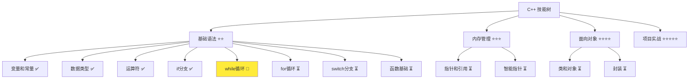
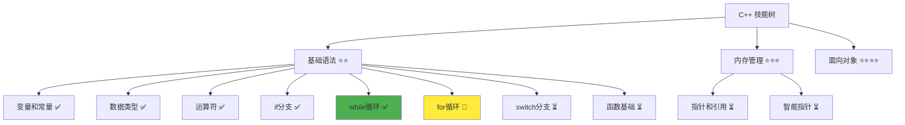

# while 循环详解

> **学习目标**：掌握 C++ while 循环的使用，能够编写重复执行的程序  
> **前置知识**：C++ 变量和常量、数据类型、运算符、分支结构  
> **预计时间**：30 分钟  
> **难度等级**：⭐⭐  
> **技能收获**：循环控制、重复执行、程序简化、算法思维  
> **文档版本**：v1.0  
> **最后更新**：2025-10-26

📊 **难度等级说明**

| 等级           | 描述                       | 练习题数量     | 颜色码 |
| -------------- | -------------------------- | -------------- | ------ |
| **⭐**         | 入门级，零基础可学         | 5 题基础概念题 | 🟢绿   |
| **⭐⭐**       | 基础级，需要基本编程概念   | 5 题基础概念题 | 🟡黄   |
| **⭐⭐⭐**     | 中级，需要相关技术基础     | 3 题代码分析题 | 🟠橙   |
| **⭐⭐⭐⭐**   | 高级，需要扎实的技术功底   | 3 题代码分析题 | 🔴红   |
| **⭐⭐⭐⭐⭐** | 专家级，需要丰富的项目经验 | 2 题设计思考题 | 🟣紫   |

## 1. 学习目标

### 1.1 学习动机

- **实际需求**：循环结构是程序重复执行的基础，掌握循环可以让程序处理大量重复的工作
- **应用场景**：用户输入处理、数据求和、菜单循环、列表遍历
- **技能价值**：学会后能编写高效的程序，自动处理重复任务，大大提高编程效率
- **数据支持**：循环结构与分支结构一起，构成了程序逻辑控制的两大支柱

### 1.2 技能树位置



> **图表说明**：C++ 技能树结构图，当前文档点亮 while 循环技能点

### 1.3 前置知识检查

在开始学习之前，请确认你已经掌握：

- [ ] C++ 变量和常量的声明与初始化
- [ ] 基本数据类型（int、double、bool、std::string）
- [ ] 算术运算符、比较运算符（>, <, ==, !=）、逻辑运算符（&&, ||, !）
- [ ] if-else 分支结构的使用

> **未掌握处理**：若未通过，请先复习 [if 分支结构](./05-if-branch.md)

## 2. 核心内容

### 2.1 概念理解

**while 循环**：根据条件重复执行代码块的结构。只要条件为真，就会一直执行循环体中的代码。

> **类比教学**：while 循环就像"只要不下雨，就一直散步"，会一直重复执行，直到下雨了（条件变为假）才停止。或者像洗手间的水龙头，"只要按着开关，水就一直流"，松开开关（条件变为假），水就停止。

### 2.2 基础语法

C++ 中的 while 循环语法简单易懂：

#### 2.2.1 while 循环基本语法

```cpp
while (条件) {
    // 循环体：需要重复执行的代码
}
```

> 语法说明：当条件为真时，执行大括号内的代码；执行完后再次检查条件，如果仍然为真，继续执行；直到条件为假时，循环结束，程序继续执行循环后的代码。

**类比**：就像"只要门开着，就不断有人进出"，伪代码示例如下：

```
while (门开着) {
    有人进出
}
```

#### 2.2.2 while 循环的特点

- **条件检查**：循环开始前和每次循环结束后都会检查条件
- **先判断后执行**：如果一开始条件就为假，循环体一次都不会执行
- **无限循环风险**：如果条件永远为真，会陷入无限循环

### 2.3 代码示例

#### 2.3.1 基础示例

以下代码演示了 while 循环的各种使用场景：

```cpp
// 现代 C++ 示例 - while 循环基础
#include <iostream>

int main() {
    // 示例 1：计数循环
    std::cout << "=== while 计数循环 ===" << std::endl;
    int count = 1;
    while (count <= 5) {
        std::cout << "计数: " << count << std::endl;
        count++;  // 重要：改变条件，避免无限循环
    }

    // 示例 2：用户输入循环
    std::cout << "\n=== while 用户输入循环 ===" << std::endl;
    int number;
    std::cout << "请输入一个正数（输入0退出）: ";
    std::cin >> number;
    
    while (number != 0) {
        std::cout << "你输入的数字是: " << number << std::endl;
        std::cout << "请输入下一个数字（输入0退出）: ";
        std::cin >> number;
    }
    std::cout << "循环已退出" << std::endl;

    // 示例 3：求和循环
    std::cout << "\n=== while 求和循环 ===" << std::endl;
    int sum = 0;
    int num = 1;
    while (num <= 10) {
        sum += num;
        num++;
    }
    std::cout << "1到10的和是: " << sum << std::endl;

    // 示例 4：条件循环（根据布尔值）
    std::cout << "\n=== while 条件循环 ===" << std::endl;
    bool isRunning = true;
    int value = 1;
    while (isRunning) {
        std::cout << value << " ";
        value++;
        if (value > 5) {
            isRunning = false;  // 改变条件，退出循环
        }
    }
    std::cout << std::endl;

    return 0;
}
```

> **📌 重要提醒**：while 循环中必须要有改变条件的语句（如 `count++`、`num++`、`number = 新值` 等），否则会陷入无限循环！

#### 2.3.2 配套代码文件

项目提供了配套的源代码文件：

- **文件位置**：`src/stage1/06-while-loop/01-basic-while.cpp`
- **文件内容**：与上面示例完全一致的 while 循环程序

> **运行提示**：具体的编译运行方法请参考 [C++ 简介和快速入门](./01-cpp-introduction.md) 中的 `2.2.3 编译运行` 部分

#### 2.3.3 运行预期结果

```
=== while 计数循环 ===
计数: 1
计数: 2
计数: 3
计数: 4
计数: 5

=== while 用户输入循环 ===
请输入一个正数（输入0退出）: 7
你输入的数字是: 7
请输入下一个数字（输入0退出）: 15
你输入的数字是: 15
请输入下一个数字（输入0退出）: 0
循环已退出

=== while 求和循环 ===
1到10的和是: 55

=== while 条件循环 ===
1 2 3 4 5
```

#### 2.3.4 代码详解

以下代码片段展示了基础示例中的核心用法：

```cpp
// 计数循环
int count = 1;
while (count <= 5) {
    std::cout << "计数: " << count << std::endl;
    count++;  // 每执行一次，count加1
}
```

**详细说明**：

- **条件检查**：`while (count <= 5)` 检查 count 是否小于等于 5
- **循环体**：大括号内的代码会被重复执行
- **条件更新**：`count++` 每执行一次循环，count 就加 1
- **类比**：就像数数，从1数到5，每数一次就检查是否数完了

```cpp
// 用户输入循环
while (number != 0) {
    std::cout << "你输入的数字是: " << number << std::endl;
    std::cout << "请输入下一个数字（输入0退出）: ";
    std::cin >> number;  // 每次循环都读取新输入
}
```

**详细说明**：

- **用户控制**：用户输入 0 退出循环
- **持续输入**：在循环体内读取新的输入
- **类比**：就像自助取餐，不断拿食物，直到说"不要了"（输入0）才停止

```cpp
// 求和循环
int sum = 0;
int num = 1;
while (num <= 10) {
    sum += num;  // 累加
    num++;       // 递增
}
```

**详细说明**：

- **累加器**：`sum` 用来累计总和
- **循环变量**：`num` 从 1 递增到 10
- **类比**：就像往盒子里放球，每次放一个球，盒子里的球数就增加
- **公式**：`sum = 1 + 2 + 3 + ... + 10 = 55`

**重要语法规则**：

1. **避免无限循环**：必须在循环体内改变条件，否则会永远执行
   - 正确：`count++`、`number++`、`value--`
   - 错误：忘记更新变量，导致条件永远为真
   - **类比**：就像忘记关水龙头，水会一直流

2. **先判断后执行**：while 先检查条件，再决定是否执行
   - 如果条件一开始就为假，循环体一次都不执行
   - **类比**：就像"如果天已经黑了，就不散步了"（条件为假，直接跳过）

3. **循环变量初始化**：要在循环外初始化循环变量
   - 正确：`int count = 1;` 然后 `while (count <= 5)`
   - **类比**：就像开车前要检查油箱，从起点（1）开始

### 2.4 关键特性与设计原理

#### 2.4.1 关键特性

1. **灵活控制**：while 循环适合条件不确定的情况，比如用户输入
2. **先判断后执行**：确保条件满足才执行代码
3. **简单语法**：只有一个条件判断，语法简洁

#### 2.4.2 设计原理

- **为什么这样设计**：实际编程中经常需要重复执行某些操作，比如处理用户多次输入、累加数据等。while 循环提供了这种重复执行的能力，就像重复做同一件事直到完成
- **解决了什么问题**：减少了代码重复，可以用循环代替多次写相同的代码
- **有什么优势**：简洁高效、易于理解和维护、代码量大幅减少

## 3. 实践应用

### 3.1 项目场景

在 QtLanChat 项目中，while 循环用于：

- **用户菜单循环**：显示菜单，等待用户选择，直到用户选择退出
- **消息接收循环**：持续监听网络消息，直到程序退出
- **数据验证循环**：要求用户输入正确格式的数据，直到输入有效

### 3.2 实际代码

以下代码展示了 while 循环在 QtLanChat 项目中的实际应用：

```cpp
// 项目中的实际应用示例
#include <iostream>

int main() {
    std::cout << "=== QtLanChat 菜单系统 ===" << std::endl;
    
    int choice = -1;  // 初始化选择
    
    while (choice != 0) {
        // 显示菜单
        std::cout << "\n--- 主菜单 ---" << std::endl;
        std::cout << "1. 发送消息" << std::endl;
        std::cout << "2. 查看历史" << std::endl;
        std::cout << "3. 用户设置" << std::endl;
        std::cout << "0. 退出程序" << std::endl;
        std::cout << "请选择: ";
        
        std::cin >> choice;
        
        if (choice == 1) {
            std::cout << ">>> 发送消息功能" << std::endl;
        } else if (choice == 2) {
            std::cout << ">>> 查看历史功能" << std::endl;
        } else if (choice == 3) {
            std::cout << ">>> 用户设置功能" << std::endl;
        } else if (choice == 0) {
            std::cout << ">>> 正在退出程序..." << std::endl;
        } else {
            std::cout << ">>> 无效选择，请重试" << std::endl;
        }
    }
    
    std::cout << "程序已退出，再见！" << std::endl;
    
    return 0;
}
```

> **配套代码**：实际应用示例的完整代码位于 `src/stage1/06-while-loop/02-project-example.cpp`

### 3.3 设计思路

- **为什么选择这种设计**：使用 while 循环实现菜单系统，用户可以选择多次操作，直到选择退出
- **解决了什么问题**：提供了友好的交互界面，用户可以持续使用程序，不用重启
- **有什么优势**：用户体验好、代码结构清晰、易于扩展功能

## 4. 练习与测试

### 4.1 练习题

#### 练习 1：倒计时

**题目**：使用 while 循环实现倒计时功能

**要求**：

- 提示用户输入一个正整数
- 使用 `std::cin` 读取用户输入
- 从输入的数字倒计时到 0
- 每次输出当前数字，并递减
- 提示倒计时完成

**参考答案**：

```cpp
#include <iostream>

int main() {
    int count;

    std::cout << "请输入一个正整数: ";
    std::cin >> count;

    std::cout << "倒计时开始：" << std::endl;
    while (count >= 0) {
        std::cout << count << std::endl;
        count--;  // 递减，避免无限循环
    }
    std::cout << "倒计时完成！" << std::endl;

    return 0;
}
```

> **配套代码**：练习 1 的完整代码位于 `src/stage1/06-while-loop/03-exercise-countdown.cpp`

#### 练习 2：数字累加器

**题目**：使用 while 循环实现数字累加功能

**要求**：

- 提示用户输入多个数字
- 使用 `std::cin` 读取用户输入
- 每次输入后累加总和
- 用户输入 0 时停止
- 输出累加的总和

**参考答案**：

```cpp
#include <iostream>

int main() {
    int sum = 0;
    int number;

    std::cout << "请输入数字（输入0停止）: ";
    std::cin >> number;

    while (number != 0) {
        sum += number;
        std::cout << "当前总和: " << sum << std::endl;
        std::cout << "请输入下一个数字（输入0停止）: ";
        std::cin >> number;
    }

    std::cout << "\n最终总和: " << sum << std::endl;

    return 0;
}
```

> **配套代码**：练习 2 的完整代码位于 `src/stage1/06-while-loop/04-exercise-sum.cpp`

#### 练习 3：密码验证

**题目**：使用 while 循环实现密码验证功能

**要求**：

- 设置一个正确密码（如 123456）
- 提示用户输入密码
- 使用 `std::cin` 读取用户输入
- 如果密码错误，要求重新输入
- 最多允许 3 次输入机会
- 密码正确或次数用完时退出循环
- 输出验证结果

**参考答案**：

```cpp
#include <iostream>

int main() {
    int correctPassword = 123456;
    int userPassword;
    int attempts = 0;
    int maxAttempts = 3;

    std::cout << "=== 密码验证系统 ===" << std::endl;

    while (attempts < maxAttempts) {
        std::cout << "请输入密码（剩余" << (maxAttempts - attempts) << "次机会）: ";
        std::cin >> userPassword;

        if (userPassword == correctPassword) {
            std::cout << "密码正确，欢迎！" << std::endl;
            break;  // 密码正确，退出循环
        } else {
            attempts++;
            std::cout << "密码错误，请重试" << std::endl;
        }
    }

    if (attempts >= maxAttempts) {
        std::cout << "密码错误次数过多，程序退出" << std::endl;
    }

    return 0;
}
```

> **配套代码**：练习 3 的完整代码位于 `src/stage1/06-while-loop/05-exercise-password.cpp`

### 4.2 测试题（可选）

1. **关于 while 循环，下列说法正确的是：**
   A. while 循环至少会执行一次

   B. while 循环中必须要有改变条件的语句

   C. while 循环的条件只能是整数类型

   D. while 循环的条件只能放在开头
   **答案**：B

   **解析**：
   - **正确答案 B**：while 循环中必须要有改变条件的语句（如 `count++`、`number++` 等），否则会陷入无限循环
   - **错误答案 A**：while 循环是"先判断后执行"，如果条件一开始就为假，循环体一次都不会执行
   - **错误答案 C**：while 循环的条件必须返回 bool 类型，可以使用比较运算符或逻辑运算符
   - **错误答案 D**：while 循环的条件只能放在开头，这是语法要求

2. **关于无限循环，下列说法正确的是：**
   A. 无限循环永远不会停止

   B. 无限循环是编程错误，必须避免

   C. while (true) 会创建无限循环

   D. 所有无限循环都是有害的
   **答案**：C

   **解析**：
   - **正确答案 C**：`while (true)` 会创建无限循环，因为条件永远为真
   - **错误答案 A**：无限循环可以被 `break` 语句中断
   - **错误答案 B**：有时候需要无限循环（如服务器程序），但必须提供退出机制
   - **错误答案 D**：有些无限循环是有意的（如游戏主循环、服务器监听），但需要 `break` 或 `return` 退出

### 4.3 常见问题 FAQ

- Q1：while 循环和 if-else 有什么区别？
  - **A：**while 循环会重复执行代码，而 if-else 只执行一次。就像"如果下雨就带伞"（if-else，只执行一次）和"只要下雨就一直打伞"（while 循环，重复执行）
- Q2：什么时候使用 while 循环，什么时候使用其他循环？
  - **A：**while 适合条件不确定的情况（如用户输入、菜单循环），for 循环适合确定次数的情况（如遍历数组）。while 更适合条件驱动的重复，for 更适合计数驱动的重复
- Q3：如何避免无限循环？
  - **A：**确保循环体内有改变条件的语句，或者使用 `break` 语句跳出循环。就像"走几步就停下来"（改变变量），或者"遇到障碍就停止"（break 语句）

## 5. 资源与扩展

### 5.1 基础资源

- **官方文档**：[C++ while 循环](https://en.cppreference.com/w/cpp/language/while)
- **权威书籍**：《C++ Primer》- 第 5.1.1 节
- **在线教程**：[learncpp.com](https://www.learncpp.com/) - while 循环教程

### 5.2 多媒体学习

- **视频资源**：[C++ while 循环详解](https://www.youtube.com/results?search_query=C%2B%2B+while+loop+tutorial)
- **开发者资源**：[cppreference.com](https://en.cppreference.com/) - 权威参考

## 6. 课后作业及参考答案

### 6.1 学习检查清单

- [ ] 能够使用 while 循环实现重复执行
- [ ] 理解 while 循环的条件检查机制
- [ ] 掌握避免无限循环的方法
- [ ] 能够实现用户输入循环

### 6.2 综合练习

**作业题目**：编写一个简单的计算器循环程序

**要求**：

- 使用 while 循环显示菜单
- 提示用户输入两个数字和运算符
- 使用 `std::cin` 读取用户输入
- 执行相应的运算并输出结果
- 用户可以选择继续计算或退出

**时间估算**：30 分钟

**参考答案**：

```cpp
#include <iostream>

int main() {
    std::cout << "=== 简单计算器循环程序 ===" << std::endl;
    
    int choice = 1;
    int num1, num2;
    char operation;
    
    while (choice == 1) {
        std::cout << "\n请输入第一个数字: ";
        std::cin >> num1;
        
        std::cout << "请输入运算符 (+, -, *, /): ";
        std::cin >> operation;
        
        std::cout << "请输入第二个数字: ";
        std::cin >> num2;
        
        std::cout << num1 << " " << operation << " " << num2 << " = ";
        
        if (operation == '+') {
            std::cout << (num1 + num2) << std::endl;
        } else if (operation == '-') {
            std::cout << (num1 - num2) << std::endl;
        } else if (operation == '*') {
            std::cout << (num1 * num2) << std::endl;
        } else if (operation == '/') {
            if (num2 != 0) {
                std::cout << (num1 / num2) << std::endl;
            } else {
                std::cout << "错误：除数不能为0！" << std::endl;
            }
        } else {
            std::cout << "不支持的运算符！" << std::endl;
        }
        
        std::cout << "\n继续计算（输入1）还是退出（输入0）? ";
        std::cin >> choice;
    }
    
    std::cout << "程序已退出，再见！" << std::endl;
    
    return 0;
}
```

**评分标准**：功能实现（40%）、代码质量（30%）、用户体验（30%）

## 7. 下一步学习

**下一篇**：[07-for-loop.md](./07-for-loop.md)

**学习路径**：

1. ✅ C++ 简介和快速入门 - 已完成
2. ✅ 变量和常量 - 已完成
3. ✅ 数据类型详解 - 已完成
4. ✅ 运算符详解 - 已完成
5. ✅ if 分支详解 - 已完成
6. ✅ while 循环 - 已完成
7. 🔄 for 循环 - 下一步
8. ⏳ switch 分支 - 待学习

**技能树更新**：



**学习成果**：

- **独立编写**：能够编写使用 while 循环的程序
- **解释原理**：能够解释循环的工作原理
- **解决实际问题**：能够实现菜单系统、用户输入循环
- **应用到项目**：为后续 for 循环学习打下基础
- **掌握度自评**：85%

### 学习成果指导

> **自评指导**：
>
> - **<50%**：建议复习 while 循环基础，重新阅读文档核心内容
> - **50-80%**：继续学习，完成练习题巩固理解
> - **>80%**：可以进入下一阶段学习，开始 for 循环详解
