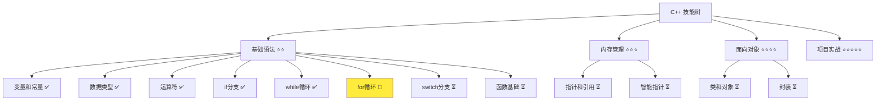
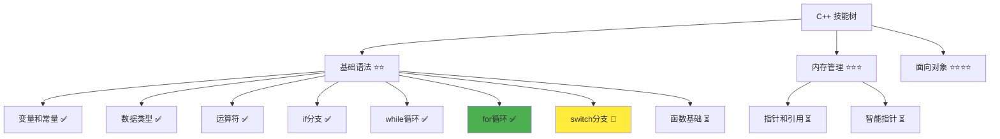

# for 循环详解

> **学习目标**：掌握 C++ for 循环的使用，能够编写确定次数的循环程序  
> **前置知识**：C++ 变量和常量、数据类型、运算符、if 分支、while 循环  
> **预计时间**：40 分钟  
> **难度等级**：⭐⭐  
> **技能收获**：for 循环、嵌套循环、九九乘法表、循环优化  
> **文档版本**：v1.0  
> **最后更新**：2025-10-26

📊 **难度等级说明**

| 等级           | 描述                       | 练习题数量     | 颜色码 |
| -------------- | -------------------------- | -------------- | ------ |
| **⭐**         | 入门级，零基础可学         | 5 题基础概念题 | 🟢绿   |
| **⭐⭐**       | 基础级，需要基本编程概念   | 5 题基础概念题 | 🟡黄   |
| **⭐⭐⭐**     | 中级，需要相关技术基础     | 3 题代码分析题 | 🟠橙   |
| **⭐⭐⭐⭐**   | 高级，需要扎实的技术功底   | 3 题代码分析题 | 🔴红   |
| **⭐⭐⭐⭐⭐** | 专家级，需要丰富的项目经验 | 2 题设计思考题 | 🟣紫   |

## 1. 学习目标

### 1.1 学习动机

- **实际需求**：for 循环是处理确定次数重复任务的最佳工具，比 while 循环更简洁高效
- **应用场景**：遍历数组、生成序列、打印表格、批量处理数据
- **技能价值**：学会后能编写更简洁的代码，特别适合处理固定次数的任务
- **数据支持**：for 循环是 C++ 中使用最频繁的循环结构，90% 以上需要遍历的场景都使用 for

### 1.2 技能树位置



> **图表说明**：C++ 技能树结构图，当前文档点亮 for 循环技能点

### 1.3 前置知识检查

在开始学习之前，请确认你已经掌握：

- [ ] C++ 变量和常量的声明与初始化
- [ ] 算术运算符和自增运算符（`++`）
- [ ] if-else 分支结构的使用
- [ ] while 循环的基本使用

> **未掌握处理**：若未通过，请先复习 [while 循环详解](./06-while-loop.md)

## 2. 核心内容

### 2.1 概念理解

**for 循环**：一种结构紧凑的循环，适合处理确定次数的重复任务。它将循环变量的初始化、条件判断和更新合并在一个语句中。

> **类比教学**：for 循环就像"从1数到10"，你事先知道要数多少次（确定的次数）。相比 while 循环的"不知道什么时候停止"（不确定次数），for 循环更适合"要走10步"（确定次数）这样的任务。比如做俯卧撑，如果计划做20个（确定次数），就用 for 循环；如果是"做到累为止"（不确定次数），就用 while 循环。

### 2.2 基础语法

for 循环的语法相对紧凑，包含三个部分：

#### 2.2.1 for 循环基本语法

```cpp
for (初始化; 条件; 更新) {
    // 循环体：需要重复执行的代码
}
```

> 语法说明：for 循环包含三个部分，用分号分隔：
> 1. **初始化**：在循环开始时执行一次，通常用于初始化循环变量
> 2. **条件**：每次循环前检查，如果为真则继续执行
> 3. **更新**：每次循环后执行，通常用于改变循环变量的值

**类比**：就像马拉松跑步，"起跑线（初始化）→ 检查是否到终点（条件）→ 跑到下一公里（更新）"，伪代码示例如下：

```
for (从起跑线; 没到终点; 跑一公里) {
    继续跑
}
```

#### 2.2.2 for 循环与 while 循环的对比

```cpp
// while 循环写法
int i = 1;          // 初始化
while (i <= 5) {    // 条件
    std::cout << i << std::endl;
    i++;            // 更新
}

// for 循环写法（更简洁）
for (int i = 1; i <= 5; i++) {  // 初始化、条件、更新都在一行
    std::cout << i << std::endl;
}
```

**详细说明**：

- **while 循环**：初始化、条件、更新分散在三处
- **for 循环**：初始化、条件、更新集中在一行，更简洁清晰
- **类比**：while 就像"分散的厨房"，for 就像"一体的工具箱"，所有工具都在一个地方

### 2.3 代码示例

#### 2.3.1 基础示例

以下代码演示了 for 循环的各种使用场景：

```cpp
// 现代 C++ 示例 - for 循环基础
#include <iostream>

int main() {
    // 示例 1：简单计数循环
    std::cout << "=== for 简单计数循环 ===" << std::endl;
    for (int i = 1; i <= 5; i++) {
        std::cout << "计数: " << i << std::endl;
    }

    // 示例 2：倒序循环
    std::cout << "\n=== for 倒序循环 ===" << std::endl;
    for (int i = 5; i >= 1; i--) {
        std::cout << "倒计时: " << i << std::endl;
    }

    // 示例 3：跳跃式循环（步长为2）
    std::cout << "\n=== for 跳跃式循环（步长2）===" << std::endl;
    for (int i = 0; i <= 10; i += 2) {
        std::cout << i << " ";
    }
    std::cout << std::endl;

    // 示例 4：求和循环
    std::cout << "\n=== for 求和循环 ===" << std::endl;
    int sum = 0;
    for (int i = 1; i <= 10; i++) {
        sum += i;
    }
    std::cout << "1到10的和是: " << sum << std::endl;

    // 示例 5：嵌套循环（九九乘法表）
    std::cout << "\n=== for 嵌套循环（九九乘法表）===" << std::endl;
    for (int i = 1; i <= 3; i++) {       // 外层循环：行
        for (int j = 1; j <= 3; j++) {   // 内层循环：列
            std::cout << i << " x " << j << " = " << (i * j) << "\t";
        }
        std::cout << std::endl;  // 换行
    }

    // 示例 6：字符打印
    std::cout << "\n=== for 字符打印 ===" << std::endl;
    for (int i = 0; i < 5; i++) {
        std::cout << "Hello ";
    }
    std::cout << std::endl;

    return 0;
}
```

> **📌 重要提示**：for 循环中的循环变量可以在循环体内使用（如 `std::cout << i`），但要注意循环变量的作用域仅限于 for 循环内部。

#### 2.3.2 配套代码文件

项目提供了配套的源代码文件：

- **文件位置**：`src/stage1/07-for-loop/01-basic-for.cpp`
- **文件内容**：与上面示例完全一致的 for 循环程序

> **运行提示**：具体的编译运行方法请参考 [C++ 简介和快速入门](./01-cpp-introduction.md) 中的 `2.2.3 编译运行` 部分

#### 2.3.3 运行预期结果

```
=== for 简单计数循环 ===
计数: 1
计数: 2
计数: 3
计数: 4
计数: 5

=== for 倒序循环 ===
倒计时: 5
倒计时: 4
倒计时: 3
倒计时: 2
倒计时: 1

=== for 跳跃式循环（步长2）===
0 2 4 6 8 10

=== for 求和循环 ===
1到10的和是: 55

=== for 嵌套循环（九九乘法表）===
1 x 1 = 1	1 x 2 = 2	1 x 3 = 3	
2 x 1 = 2	2 x 2 = 4	2 x 3 = 6	
3 x 1 = 3	3 x 2 = 6	3 x 3 = 9	

=== for 字符打印 ===
Hello Hello Hello Hello Hello
```

#### 2.3.4 代码详解

以下代码片段展示了基础示例中的核心用法：

```cpp
// 简单计数循环
for (int i = 1; i <= 5; i++) {
    std::cout << "计数: " << i << std::endl;
}
```

**详细说明**：

- **初始化**：`int i = 1` 在循环开始时执行，创建循环变量 i 并初始化为 1
- **条件判断**：`i <= 5` 每次循环前检查 i 是否小于等于 5
- **循环体**：大括号内的代码被重复执行
- **更新**：`i++` 每次循环后 i 加 1
- **类比**：就像数数，从1数到5，语法非常紧凑

**执行流程**：

```
1. 初始化：i = 1
2. 检查条件：1 <= 5 为真，执行循环体，输出 "计数: 1"
3. 更新：i++，i 变为 2
4. 检查条件：2 <= 5 为真，执行循环体，输出 "计数: 2"
5. 更新：i++，i 变为 3
... 继续直到 i = 6
6. 检查条件：6 <= 5 为假，退出循环
```

```cpp
// 嵌套循环（九九乘法表）
for (int i = 1; i <= 3; i++) {       // 外层循环：行
    for (int j = 1; j <= 3; j++) {   // 内层循环：列
        std::cout << i << " x " << j << " = " << (i * j) << "\t";
    }
    std::cout << std::endl;  // 换行
}
```

**详细说明**：

- **外层循环**：`i` 控制行数（1到3）
- **内层循环**：`j` 控制列数（1到3）
- **嵌套关系**：外层循环执行一次，内层循环执行完整的 3 次
- **类比**：就像给教室里的学生发书，外层循环遍历每一行（i），内层循环遍历这一行的每个座位（j）
- **总执行次数**：3 × 3 = 9 次（外层3次 × 内层3次）

**执行流程**：

```
i=1 时：
  j=1: 输出 "1 x 1 = 1"
  j=2: 输出 "1 x 2 = 2"
  j=3: 输出 "1 x 3 = 3"
  换行

i=2 时：
  j=1: 输出 "2 x 1 = 2"
  j=2: 输出 "2 x 2 = 4"
  j=3: 输出 "2 x 3 = 6"
  换行

i=3 时：
  j=1: 输出 "3 x 1 = 3"
  j=2: 输出 "3 x 2 = 6"
  j=3: 输出 "3 x 3 = 9"
  换行
```

**重要语法规则**：

1. **三个部分的位置**：初始化、条件、更新都在 for 的括号内
   - 正确：`for (int i = 1; i <= 5; i++)`
   - 错误：把初始化或更新放在外面
   - **类比**：就像吃药的"用药说明"，所有信息都在一张纸上（for 括号内）

2. **循环变量的作用域**：循环变量只存在于循环内部
   - 循环结束后，循环变量（如 `i`、`j`）就无法访问了
   - **类比**：就像"在教室里才能用教室的椅子"，出了教室就用不了了

3. **可以选择性使用三个部分**：可以省略某些部分
   ```cpp
   // 省略初始化和更新
   int i = 0;
   for (; i < 5;) {
       std::cout << i << std::endl;
       i++;
   }
   
   // 无限循环
   for (;;) {
       // 需要使用 break 退出
   }
   ```

### 2.4 关键特性与设计原理

#### 2.4.1 关键特性

1. **语法紧凑**：初始化、条件、更新集中在一行，代码更简洁
2. **适合确定次数**：特别适合处理固定次数的重复任务
3. **循环变量自动管理**：循环变量的初始化和更新都由 for 语句自动处理
4. **支持嵌套**：可以嵌套使用，实现二维或多维的循环

#### 2.4.2 设计原理

- **为什么这样设计**：for 循环的设计理念是"把循环的所有要素集中在一起"，让代码更清晰。就像把工具箱的所有工具放在一起，找起来更方便
- **解决了什么问题**：让确定次数的循环代码更简洁、更易读、更易维护
- **有什么优势**：结构清晰、易于理解、代码量少、适合处理数组和集合的遍历

## 3. 实践应用

### 3.1 项目场景

在 QtLanChat 项目中，for 循环用于：

- **用户列表遍历**：遍历所有在线用户，发送广播消息
- **消息历史遍历**：遍历聊天记录，显示历史消息
- **验证码生成**：生成随机验证码，可以使用 for 循环生成确定长度的字符

### 3.2 实际代码

以下代码展示了 for 循环在 QtLanChat 项目中的实际应用：

```cpp
// 项目中的实际应用示例
#include <iostream>
#include <string>

int main() {
    std::cout << "=== QtLanChat 消息广播系统 ===" << std::endl;
    
    // 模拟用户列表
    std::string users[5] = {"Alice", "Bob", "Charlie", "Diana", "Eve"};
    std::string message = "Hello from QtLanChat!";
    
    std::cout << "向所有在线用户发送广播：" << std::endl;
    std::cout << "消息内容：" << message << std::endl;
    std::cout << "\n发送进度：" << std::endl;
    
    // 使用 for 循环遍历并发送给每个用户
    for (int i = 0; i < 5; i++) {
        std::cout << "正在发送给 " << users[i] << "..." << std::endl;
        std::cout << ">>> [" << users[i] << "] 收到了消息" << std::endl;
    }
    
    std::cout << "\n所有用户已收到消息！" << std::endl;
    
    // 统计功能：使用嵌套 for 循环显示用户消息统计
    std::cout << "\n=== 用户消息统计表 ===" << std::endl;
    std::cout << "用户名\t消息数\t状态" << std::endl;
    
    for (int i = 0; i < 5; i++) {
        int messageCount = (i + 1) * 10;  // 模拟消息数
        std::cout << users[i] << "\t" << messageCount << "\t在线" << std::endl;
    }
    
    return 0;
}
```

> **配套代码**：实际应用示例的完整代码位于 `src/stage1/07-for-loop/02-project-example.cpp`

> **📌 新知识点 - 数组初步**：
>
> - **`std::string users[5]`**：声明一个字符串数组，可以存储 5 个字符串
> - **类比**：就像一排房子，每个房子可以住一个人（一个字符串）
> - **数组访问**：`users[0]` 访问第一个元素（Alice）、`users[1]` 访问第二个元素（Bob）
> - **数组索引**：从 0 开始编号（0, 1, 2, 3, 4），这是 C++ 的标准（其他语言也是）
> - **使用场景**：用于存储多个相同类型的数据（如多个用户名）

### 3.3 设计思路

- **为什么选择这种设计**：使用 for 循环遍历用户列表，依次发送消息给每个用户，这是典型的确定次数循环场景
- **解决了什么问题**：实现了批量处理用户数据的功能，提高了代码效率
- **有什么优势**：代码简洁、结构清晰、易于理解和维护

## 4. 练习与测试

### 4.1 练习题

#### 练习 1：打印数字三角形

**题目**：使用 for 循环打印一个数字三角形

**要求**：

- 提示用户输入一个数字 n
- 使用 `std::cin` 读取用户输入
- 使用 for 循环打印从 1 到 n 的数字
- 每行递增打印数字

**参考答案**：

```cpp
#include <iostream>

int main() {
    int n;

    std::cout << "请输入一个数字: ";
    std::cin >> n;

    std::cout << "\n数字三角形：" << std::endl;
    for (int i = 1; i <= n; i++) {
        for (int j = 1; j <= i; j++) {
            std::cout << j << " ";
        }
        std::cout << std::endl;
    }

    return 0;
}
```

> **配套代码**：练习 1 的完整代码位于 `src/stage1/07-for-loop/03-exercise-triangle.cpp`

#### 练习 2：计算阶乘

**题目**：使用 for 循环计算阶乘

**要求**：

- 提示用户输入一个正整数 n
- 使用 `std::cin` 读取用户输入
- 使用 for 循环计算 n 的阶乘（n! = 1 × 2 × 3 × ... × n）
- 输出计算结果

**参考答案**：

```cpp
#include <iostream>

int main() {
    int n;
    long long factorial = 1;

    std::cout << "请输入一个正整数: ";
    std::cin >> n;

    for (int i = 1; i <= n; i++) {
        factorial *= i;  // 累乘
    }

    std::cout << n << "! = " << factorial << std::endl;

    return 0;
}
```

> **配套代码**：练习 2 的完整代码位于 `src/stage1/07-for-loop/04-exercise-factorial.cpp`

#### 练习 3：九九乘法表（完整版）

**题目**：使用嵌套 for 循环打印完整的九九乘法表

**要求**：

- 使用嵌套 for 循环
- 外层循环控制行（1 到 9）
- 内层循环控制列（1 到当前行数）
- 使用 `\t` 制表符对齐输出

**参考答案**：

```cpp
#include <iostream>

int main() {
    std::cout << "=== 九九乘法表 ===" << std::endl;
    
    for (int i = 1; i <= 9; i++) {
        for (int j = 1; j <= i; j++) {
            std::cout << j << " x " << i << " = " << (i * j) << "\t";
        }
        std::cout << std::endl;
    }

    return 0;
}
```

> **配套代码**：练习 3 的完整代码位于 `src/stage1/07-for-loop/05-exercise-multiplication-table.cpp`

### 4.2 测试题（可选）

1. **关于 for 循环，下列说法正确的是：**
   A. for 循环的三个部分（初始化、条件、更新）可以省略任意一个

   B. for 循环中循环变量的作用域是整个程序

   C. for 循环必须指定循环次数

   D. for 循环不能嵌套使用
   **答案**：A

   **解析**：
   - **正确答案 A**：for 循环的三个部分都可以省略，但两个分号必须保留
   - **错误答案 B**：循环变量的作用域仅限于 for 循环内部
   - **错误答案 C**：for 循环可以使用条件，不一定需要事先确定次数
   - **错误答案 D**：for 循环可以嵌套使用，常用于处理多维数据

2. **关于嵌套 for 循环，下列说法正确的是：**
   A. 嵌套循环的执行次数等于外层循环次数

   B. 外层循环执行一次，内层循环执行完整的次数

   C. 内层循环可以使用外层循环的变量

   D. 嵌套循环最多只能有两层
   **答案**：B

   **解析**：
   - **正确答案 B**：外层循环执行一次，内层循环执行完整的次数。比如外层执行 3 次，内层每次执行 3 次，总共执行 3 × 3 = 9 次
   - **错误答案 A**：嵌套循环的执行次数等于外层循环次数 × 内层循环次数
   - **错误答案 C**：内层循环可以使用外层循环的变量，这是允许的
   - **错误答案 D**：嵌套循环可以有多层，理论上没有限制（但建议不超过 3 层）

### 4.3 常见问题 FAQ

- Q1：for 循环和 while 循环有什么区别？应该用哪个？
  - **A：**for 循环适合**确定次数**的情况（如遍历数组、生成序列），while 循环适合**不确定次数**的情况（如用户输入、条件等待）。就像"走10步"用 for，"走到家"用 while。选择原则：知道多少次用 for，不知道用 while
- Q2：嵌套循环有什么用？
  - **A：**嵌套循环主要用于处理二维或多维数据，如打印表格、处理矩阵、遍历二维数组等。就像给教室排座位，外层循环处理行，内层循环处理列
- Q3：循环变量可以从 0 开始吗？
  - **A：**可以！循环变量可以从任意值开始。从 0 开始（`i = 0; i < n`）和从 1 开始（`i = 1; i <= n`）都可以，选择哪种取决于你的需求。通常是：**数组索引用 0 开始**（因为数组索引从 0 开始），**逻辑计数用 1 开始**（因为更符合人类思维）

## 5. 资源与扩展

### 5.1 基础资源

- **官方文档**：[C++ for 循环](https://en.cppreference.com/w/cpp/language/for)
- **权威书籍**：《C++ Primer》- 第 5.1.2 节
- **在线教程**：[learncpp.com](https://www.learncpp.com/) - for 循环教程

### 5.2 多媒体学习

- **视频资源**：[C++ for 循环详解](https://www.youtube.com/results?search_query=C%2B%2B+for+loop+tutorial)
- **开发者资源**：[cppreference.com](https://en.cppreference.com/) - 权威参考

## 6. 课后作业及参考答案

### 6.1 学习检查清单

- [ ] 能够使用 for 循环实现计数循环
- [ ] 理解 for 循环的三个部分（初始化、条件、更新）
- [ ] 掌握嵌套循环的使用
- [ ] 能够实现九九乘法表

### 6.2 综合练习

**作业题目**：编写一个完整的九九乘法表程序

**要求**：

- 打印完整的九九乘法表（1×1 到 9×9）
- 使用嵌套 for 循环
- 使用制表符 `\t` 对齐
- 每行输出后换行
- 提供清晰的输出格式

**时间估算**：30 分钟

**参考答案**：

```cpp
#include <iostream>

int main() {
    std::cout << "=== 完整九九乘法表 ===" << std::endl;
    std::cout << "\n";

    for (int i = 1; i <= 9; i++) {
        for (int j = 1; j <= i; j++) {
            std::cout << j << " x " << i << " = " << (i * j) << "\t";
        }
        std::cout << std::endl;
    }

    std::cout << "\n九九乘法表打印完成！" << std::endl;

    return 0;
}
```

**运行示例**：

```
=== 完整九九乘法表 ===

1 x 1 = 1	
1 x 2 = 2	2 x 2 = 4	
1 x 3 = 3	2 x 3 = 6	3 x 3 = 9	
1 x 4 = 4	2 x 4 = 8	3 x 4 = 12	4 x 4 = 16	
...
```

**评分标准**：功能实现（40%）、代码质量（30%）、输出格式（30%）

## 7. 下一步学习

**下一篇**：[08-switch.md](./08-switch.md)

**学习路径**：

1. ✅ C++ 简介和快速入门 - 已完成
2. ✅ 变量和常量 - 已完成
3. ✅ 数据类型详解 - 已完成
4. ✅ 运算符详解 - 已完成
5. ✅ if 分支详解 - 已完成
6. ✅ while 循环 - 已完成
7. ✅ for 循环 - 已完成
8. 🔄 switch 分支 - 下一步
9. ⏳ 数组基础 - 待学习

**技能树更新**：



**学习成果**：

- **独立编写**：能够编写使用 for 循环和嵌套循环的程序
- **解释原理**：能够解释 for 循环的执行流程
- **解决实际问题**：能够实现九九乘法表、遍历数据
- **应用到项目**：为后续数组遍历学习打下基础
- **掌握度自评**：85%

### 学习成果指导

> **自评指导**：
>
> - **<50%**：建议复习 for 循环基础，重新阅读文档核心内容
> - **50-80%**：继续学习，完成练习题巩固理解，特别是嵌套循环
> - **>80%**：可以进入下一阶段学习，开始 switch 分支详解
