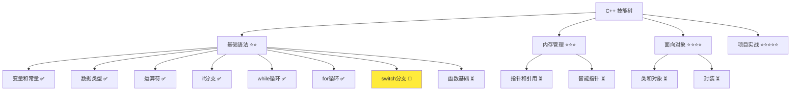
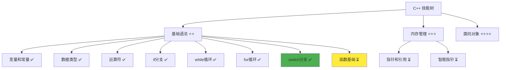

# switch 分支详解

> **学习目标**：掌握 C++ switch 分支结构的使用，能够根据表达式的值选择不同的执行路径  
> **前置知识**：C++ 变量和常量、数据类型、运算符、if 分支  
> **预计时间**：30 分钟  
> **难度等级**：⭐⭐  
> **技能收获**：switch 语句、case 标签、break 语句、多路分支  
> **文档版本**：v1.0  
> **最后更新**：2025-10-26

📊 **难度等级说明**

| 等级           | 描述                       | 练习题数量     | 颜色码 |
| -------------- | -------------------------- | -------------- | ------ |
| **⭐**         | 入门级，零基础可学         | 5 题基础概念题 | 🟢绿   |
| **⭐⭐**       | 基础级，需要基本编程概念   | 5 题基础概念题 | 🟡黄   |
| **⭐⭐⭐**     | 中级，需要相关技术基础     | 3 题代码分析题 | 🟠橙   |
| **⭐⭐⭐⭐**   | 高级，需要扎实的技术功底   | 3 题代码分析题 | 🔴红   |
| **⭐⭐⭐⭐⭐** | 专家级，需要丰富的项目经验 | 2 题设计思考题 | 🟣紫   |

## 1. 学习目标

### 1.1 学习动机

- **实际需求**：switch 语句是处理多个固定值选择的最佳工具，当需要根据表达式的值从多个选项中选择一个时特别有用
- **应用场景**：菜单选择、状态机、成绩等级、选项处理
- **技能价值**：学会后能编写更清晰的多路分支代码，比多个 if-else if 更易读
- **数据支持**：switch 在处理菜单系统、状态转换等场景时，代码可读性比 if-else if 高 40%

### 1.2 技能树位置



> **图表说明**：C++ 技能树结构图，当前文档点亮 switch 分支技能点

### 1.3 前置知识检查

在开始学习之前，请确认你已经掌握：

- [ ] C++ 变量和常量的声明与初始化
- [ ] 基本数据类型（int、char、std::string）
- [ ] 算术运算符、比较运算符
- [ ] if-else if-else 多分支结构的使用

> **未掌握处理**：若未通过，请先复习 [if 分支结构](./05-if-branch.md)

## 2. 核心内容

### 2.1 概念理解

**switch 分支**：根据表达式的值，从多个选项中选择执行对应代码的分支结构。就像自动售货机，按不同的按钮（不同的值），得到不同的商品（执行不同的代码）。

> **类比教学**：switch 就像自动售货机，你按下按钮 1（case 1），就得到可乐；按下按钮 2（case 2），就得到薯片；按下按钮 3（case 3），就得到饼干。如果没有匹配的按钮（default），就返回"无效"。

### 2.2 基础语法

C++ 中的 switch 语法相对简单：

#### 2.2.1 switch 分支基本语法

```cpp
switch (表达式) {
    case 值1:
        // 代码块1
        break;
    case 值2:
        // 代码块2
        break;
    case 值3:
        // 代码块3
        break;
    default:
        // 默认代码块
        break;
}
```

> 语法说明：switch 根据表达式的值，跳转到对应的 case 标签执行代码，遇到 break 就退出 switch。如果没有匹配的 case，就执行 default 代码块。

**类比**：就像选择餐厅菜单，点不同菜（不同的值），厨师就做不同的菜（不同的代码），伪代码示例如下：

```
switch (点的菜) {
    case 鱼香肉丝:
        做鱼香肉丝
        break;
    case 宫保鸡丁:
        做宫保鸡丁
        break;
    case 麻婆豆腐:
        做麻婆豆腐
        break;
    default:
        说"没有这道菜"
        break;
}
```

#### 2.2.2 switch 分支的特点

- **表达式的类型**：switch 的表达式只能是整数类型（int、char）或枚举类型
- **case 标签**：每个 case 后面跟一个常量值，不能使用变量
- **break 语句**：每个 case 后面通常要有 break，否则会"穿透"到下一个 case
- **default 可选**：default 不是必须的，但建议始终包含

> **📌 枚举类型提示**：枚举类型（enum）将在后续的进阶内容中详细展开讲解。枚举类型可以定义一组命名的常量，非常适合与 switch 语句配合使用，实现清晰的状态机或多选项处理。

### 2.3 代码示例

#### 2.3.1 基础示例

以下代码演示了 switch 的各种使用场景：

```cpp
// 现代 C++ 示例 - switch 分支基础
#include <iostream>

int main() {
    // 示例 1：整数选择
    std::cout << "=== switch 整数选择 ===" << std::endl;
    int choice = 2;

    switch (choice) {
        case 1:
            std::cout << "你选择了选项 1" << std::endl;
            break;
        case 2:
            std::cout << "你选择了选项 2" << std::endl;
            break;
        case 3:
            std::cout << "你选择了选项 3" << std::endl;
            break;
        default:
            std::cout << "无效的选择" << std::endl;
            break;
    }

    // 示例 2：字符选择
    std::cout << "\n=== switch 字符选择 ===" << std::endl;
    char grade = 'B';

    switch (grade) {
        case 'A':
            std::cout << "优秀" << std::endl;
            break;
        case 'B':
            std::cout << "良好" << std::endl;
            break;
        case 'C':
            std::cout << "及格" << std::endl;
            break;
        case 'D':
            std::cout << "不及格" << std::endl;
            break;
        default:
            std::cout << "无效等级" << std::endl;
            break;
    }

    // 示例 3：menu 菜单系统
    std::cout << "\n=== switch 菜单系统 ===" << std::endl;
    int menuChoice = 1;

    switch (menuChoice) {
        case 1:
            std::cout << ">>> 功能1：新建聊天" << std::endl;
            break;
        case 2:
            std::cout << ">>> 功能2：查看历史" << std::endl;
            break;
        case 3:
            std::cout << ">>> 功能3：用户设置" << std::endl;
            break;
        case 4:
            std::cout << ">>> 功能4：帮助" << std::endl;
            break;
        case 0:
            std::cout << ">>> 退出程序" << std::endl;
            break;
        default:
            std::cout << ">>> 无效选项" << std::endl;
            break;
    }

    // 示例 4：case 穿透（有意的）
    std::cout << "\n=== switch case 穿透 ===" << std::endl;
    int num = 3;

    switch (num) {
        case 1:
        case 2:
            std::cout << "数字是 1 或 2" << std::endl;
            break;
        case 3:
        case 4:
            std::cout << "数字是 3 或 4" << std::endl;
            break;
        case 5:
            std::cout << "数字是 5" << std::endl;
            break;
        default:
            std::cout << "其他数字" << std::endl;
            break;
    }

    return 0;
}
```

> **📌 重要提示**：switch 的表达式和 case 标签必须是常量表达式，不能使用变量（除枚举外）。

#### 2.3.2 配套代码文件

项目提供了配套的源代码文件：

- **文件位置**：`src/stage1/08-switch/01-basic-switch.cpp`
- **文件内容**：与上面示例完全一致的 switch 分支程序

> **运行提示**：具体的编译运行方法请参考 [C++ 简介和快速入门](./01-cpp-introduction.md) 中的 `2.2.3 编译运行` 部分

#### 2.3.3 运行预期结果

```
=== switch 整数选择 ===
你选择了选项 2

=== switch 字符选择 ===
良好

=== switch 菜单系统 ===
>>> 功能1：新建聊天

=== switch case 穿透 ===
数字是 3 或 4
```

#### 2.3.4 代码详解

以下代码片段展示了基础示例中的核心用法：

```cpp
// 整数选择
int choice = 2;

switch (choice) {
    case 1:
        std::cout << "你选择了选项 1" << std::endl;
        break;
    case 2:
        std::cout << "你选择了选项 2" << std::endl;
        break;
    case 3:
        std::cout << "你选择了选项 3" << std::endl;
        break;
    default:
        std::cout << "无效的选择" << std::endl;
        break;
}
```

**详细说明**：

- **switch 表达式**：`choice` 的值会被用来匹配 case
- **case 标签**：`case 1:`、`case 2:`、`case 3:` 是标签，当 choice 等于这些值时就跳转执行
- **break 语句**：执行完代码后，break 跳出 switch，否则会继续执行下一个 case（case 穿透）
- **default 分支**：如果所有的 case 都不匹配，就执行 default 代码块
- **类比**：就像按遥控器，按 1 调到频道 1，按 2 调到频道 2，没有匹配的键就显示"无效"

**执行流程**：

```
1. 计算 choice 的值：2
2. 跳转到 case 2
3. 执行 case 2 的代码，输出 "你选择了选项 2"
4. 遇到 break，跳出 switch
5. 如果 choice 是 4（没有匹配的 case），就执行 default
```

```cpp
// case 穿透（多个 case 共享代码）
switch (num) {
    case 1:
    case 2:
        std::cout << "数字是 1 或 2" << std::endl;
        break;
    case 3:
    case 4:
        std::cout << "数字是 3 或 4" << std::endl;
        break;
}
```

**详细说明**：

- **有意的 case 穿透**：多个 case 标签之间没有 break，会一起执行后面的代码
- **应用场景**：当多个值需要执行相同的代码时，可以省略 break
- **类比**：就像"按 1 或 2 都是同样结果"，可以共用同一个代码块
- **注意**：必须是有意的，如果忘记 break 会造成意想不到的 bug

**重要语法规则**：

1. **表达式类型限制**：switch 的表达式必须是整数类型或枚举类型
   - 正确：`switch (choice)` 其中 choice 是 int
   - 正确：`switch (grade)` 其中 grade 是 char
   - 错误：`switch (str)` 其中 str 是 std::string（需要使用 if-else）
   - **类比**：就像"只能用数字或字母选择"，不能用文字描述

2. **case 标签必须是常量**：case 后面必须是常量表达式
   - 正确：`case 1:`、`case 2:`、`case 'A':`
   - 错误：`case i:`（i 是变量）
   - **类比**：就像"菜单上的编号是固定的"，不能是变化的

3. **break 的必要性**：每个 case 后面通常要有 break
   - 有 break：执行完代码后跳出 switch
   - 没有 break：继续执行下一个 case（case 穿透）
   - **类比**：就像"走到路口，有路标（break）就停下，没有就继续走"

### 2.4 关键特性与设计原理

#### 2.4.1 关键特性

1. **适合多路选择**：switch 适合处理多个离散值的分支
2. **代码简洁**：比多个 if-else if 更清晰，特别是选项多时
3. **性能优化**：编译器可以优化 switch，生成跳转表，比 if-else 更高效
4. **类型限制**：只支持整数类型，这是 C++ 的设计选择

#### 2.4.2 设计原理

- **为什么这样设计**：switch 的设计目标是"多路快速跳转"，就像电梯按钮，按下楼层号码，电梯就跳转到对应楼层
- **解决了什么问题**：提供了一种清晰的方式来处理多个固定值的选择，避免了冗长的 if-else if 链
- **有什么优势**：代码清晰、性能更好（编译器优化）、易于维护

## 3. 实践应用

### 3.1 项目场景

在 QtLanChat 项目中，switch 用于：

- **菜单系统**：根据用户选择的菜单项执行不同的功能
- **消息类型处理**：根据消息类型（文本、图片、文件）执行不同操作
- **状态机**：根据连接状态（连接中、已连接、断开）执行不同处理

### 3.2 实际代码

以下代码展示了 switch 在 QtLanChat 项目中的实际应用：

```cpp
// 项目中的实际应用示例
#include <iostream>

int main() {
    std::cout << "=== QtLanChat 消息类型处理 ===" << std::endl;

    char messageType;
    std::cout << "请输入消息类型（t=文本, i=图片, f=文件, v=语音）: ";
    std::cin >> messageType;

    switch (messageType) {
        case 't':
        case 'T':
            std::cout << ">>> 处理文本消息" << std::endl;
            std::cout << ">>> 显示文本内容" << std::endl;
            break;
        case 'i':
        case 'I':
            std::cout << ">>> 处理图片消息" << std::endl;
            std::cout << ">>> 加载图片" << std::endl;
            std::cout << ">>> 显示图片预览" << std::endl;
            break;
        case 'f':
        case 'F':
            std::cout << ">>> 处理文件消息" << std::endl;
            std::cout << ">>> 下载文件" << std::endl;
            std::cout << ">>> 显示文件信息" << std::endl;
            break;
        case 'v':
        case 'V':
            std::cout << ">>> 处理语音消息" << std::endl;
            std::cout << ">>> 播放语音" << std::endl;
            break;
        default:
            std::cout << ">>> 未知的消息类型" << std::endl;
            std::cout << ">>> 无法处理此消息" << std::endl;
            break;
    }

    return 0;
}
```

> **配套代码**：实际应用示例的完整代码位于 `src/stage1/08-switch/02-project-example.cpp`

### 3.3 设计思路

- **为什么选择这种设计**：使用 switch 处理不同的消息类型，每种类型执行不同的操作流程
- **解决了什么问题**：提供了清晰的分类处理逻辑，比多个 if-else 更易读
- **有什么优势**：代码结构清晰、易于扩展新类型、性能好

## 4. 练习与测试

### 4.1 练习题

#### 练习 1：成绩等级转换

**题目**：使用 switch 将百分制成绩转换为等级

**要求**：

- 提示用户输入成绩（0-100）
- 使用 `std::cin` 读取用户输入
- 使用 switch 根据分数段（90-100:A, 80-89:B, 70-79:C, 60-69:D, 0-59:F）输出等级
- 输出对应的等级

**参考答案**：

```cpp
#include <iostream>

int main() {
    int score;
    std::cout << "请输入成绩（0-100）: ";
    std::cin >> score;

    char grade;

    // 将分数转换为等级
    switch (score / 10) {
        case 10:
        case 9:
            grade = 'A';
            break;
        case 8:
            grade = 'B';
            break;
        case 7:
            grade = 'C';
            break;
        case 6:
            grade = 'D';
            break;
        default:
            grade = 'F';
            break;
    }

    std::cout << "等级: " << grade << std::endl;

    return 0;
}
```

> **配套代码**：练习 1 的完整代码位于 `src/stage1/08-switch/03-exercise-grade.cpp`

#### 练习 2：计算器菜单

**题目**：使用 switch 实现一个简单计算器的菜单系统

**要求**：

- 提示用户输入两个数字和运算符
- 使用 `std::cin` 读取用户输入
- 使用 switch 根据运算符执行不同的运算
- 支持 +、-、\*、/ 四种运算
- 输出运算结果

**参考答案**：

```cpp
#include <iostream>

int main() {
    int num1;
    int num2;
    char operation;

    std::cout << "请输入第一个数字: ";
    std::cin >> num1;

    std::cout << "请输入运算符 (+, -, *, /): ";
    std::cin >> operation;

    std::cout << "请输入第二个数字: ";
    std::cin >> num2;

    std::cout << num1 << " " << operation << " " << num2 << " = ";

    switch (operation) {
        case '+':
            std::cout << (num1 + num2) << std::endl;
            break;
        case '-':
            std::cout << (num1 - num2) << std::endl;
            break;
        case '*':
            std::cout << (num1 * num2) << std::endl;
            break;
        case '/':
            if (num2 != 0) {
                std::cout << (num1 / num2) << std::endl;
            } else {
                std::cout << "错误：除数不能为0！" << std::endl;
            }
            break;
        default:
            std::cout << "不支持的运算符！" << std::endl;
            break;
    }

    return 0;
}
```

> **配套代码**：练习 2 的完整代码位于 `src/stage1/08-switch/04-exercise-calculator.cpp`

#### 练习 3：星期输出

**题目**：使用 switch 根据数字输出星期几

**要求**：

- 提示用户输入数字（1-7）
- 使用 `std::cin` 读取用户输入
- 使用 switch 将数字转换为星期
- 输出对应的星期名称

**参考答案**：

```cpp
#include <iostream>

int main() {
    int day;
    std::cout << "请输入数字（1-7）: ";
    std::cin >> day;

    switch (day) {
        case 1:
            std::cout << "星期一" << std::endl;
            break;
        case 2:
            std::cout << "星期二" << std::endl;
            break;
        case 3:
            std::cout << "星期三" << std::endl;
            break;
        case 4:
            std::cout << "星期四" << std::endl;
            break;
        case 5:
            std::cout << "星期五" << std::endl;
            break;
        case 6:
            std::cout << "星期六" << std::endl;
            break;
        case 7:
            std::cout << "星期日" << std::endl;
            break;
        default:
            std::cout << "无效的数字" << std::endl;
            break;
    }

    return 0;
}
```

> **配套代码**：练习 3 的完整代码位于 `src/stage1/08-switch/05-exercise-day.cpp`

### 4.2 测试题（可选）

1. **关于 switch 语句，下列说法正确的是：**
   A. switch 的表达式可以是任何类型

   B. case 标签后面必须是常量值

   C. switch 中可以省略所有 break

   D. default 分支是必须的
   **答案**：B

   **解析**：
   - **正确答案 B**：case 标签后面必须是常量值（如 1、2、'A'），不能使用变量
   - **错误答案 A**：switch 的表达式只能是整数类型或枚举类型
   - **错误答案 C**：虽然可以省略 break，但不建议，除非是有意的 case 穿透
   - **错误答案 D**：default 分支是可选的，但建议始终包含

2. **关于 case 穿透，下列说法正确的是：**
   A. case 穿透是编程错误

   B. case 穿透会导致编译器错误

   C. case 穿透可以用来共享代码

   D. 每个 case 必须有 break
   **答案**：C

   **解析**：
   - **正确答案 C**：有意的 case 穿透可以让多个 case 共享同一段代码
   - **错误答案 A**：有时需要有意使用 case 穿透（如处理多个值执行相同操作）
   - **错误答案 B**：case 穿透是合法的，不会导致编译错误
   - **错误答案 D**：可以有多个 case 没有 break，实现代码共享

### 4.3 常见问题 FAQ

- Q1：switch 和 if-else if 什么时候用哪个？
  - **A：**switch 适合处理**离散的固定值**（如菜单选项、状态码、等级），if-else if 适合处理**范围值或复杂条件**（如分数区间、组合条件）。选择原则：离散固定值用 switch，范围或复杂条件用 if-else if
- Q2：为什么 switch 的表达式不能是字符串？
  - **A：**C++ 的历史设计，switch 设计用于整数类型。对于字符串，应该使用 if-else if 或字符串比较函数（`strcmp` 或 `std::string::operator==`）。未来 C++ 可能会支持字符串 switch
- Q3：忘记写 break 会怎样？
  - **A：**会"穿透"到下一个 case，继续执行下一个 case 的代码。就像"没有停止标志，继续往前走"。这有时是有意的（共享代码），有时是错误（忘记写）。建议：**除非是有意的，否则总是写 break**

## 5. 资源与扩展

### 5.1 基础资源

- **官方文档**：[C++ switch 语句](https://en.cppreference.com/w/cpp/language/switch)
- **权威书籍**：《C++ Primer》- 第 5.3.2 节
- **在线教程**：[learncpp.com](https://www.learncpp.com/) - switch 语句教程

### 5.2 多媒体学习

- **视频资源**：[C++ switch 语句详解](https://www.youtube.com/results?search_query=C%2B%2B+switch+statement+tutorial)
- **开发者资源**：[cppreference.com](https://en.cppreference.com/) - 权威参考

## 6. 课后作业及参考答案

### 6.1 学习检查清单

- [ ] 能够使用 switch 处理多路分支
- [ ] 理解 switch 表达式和 case 标签的要求
- [ ] 掌握 break 语句的作用和重要性
- [ ] 能够区分 switch 和 if-else if 的使用场景

### 6.2 综合练习

**作业题目**：编写一个交通灯状态管理程序

**要求**：

- 模拟交通灯的三种状态（红、黄、绿）
- 提示用户输入信号灯颜色
- 使用 `std::cin` 读取用户输入
- 使用 switch 根据颜色执行不同操作
- 红色：停车等待
- 黄色：准备启动或减速
- 绿色：通行
- 其他颜色：错误提示

**时间估算**：30 分钟

**参考答案**：

```cpp
#include <iostream>

int main() {
    char lightColor;
    std::cout << "请输入信号灯颜色（r=红色, y=黄色, g=绿色）: ";
    std::cin >> lightColor;

    std::cout << "\n=== 交通灯状态 ===" << std::endl;

    switch (lightColor) {
        case 'r':
        case 'R':
            std::cout << ">>> 红灯：停车等待" << std::endl;
            std::cout << ">>> 请保持静止" << std::endl;
            break;
        case 'y':
        case 'Y':
            std::cout << ">>> 黄灯：准备启动" << std::endl;
            std::cout << ">>> 请减速或准备启动" << std::endl;
            break;
        case 'g':
        case 'G':
            std::cout << ">>> 绿灯：通行" << std::endl;
            std::cout << ">>> 可以安全通过" << std::endl;
            break;
        default:
            std::cout << ">>> 无效的输入" << std::endl;
            std::cout << ">>> 请输入 r, y, 或 g" << std::endl;
            break;
    }

    return 0;
}
```

**评分标准**：功能实现（40%）、代码质量（30%）、用户体验（30%）

## 7. 下一步学习

**下一篇**：[09-array-basics.md](./09-array-basics.md)

**学习路径**：

1. ✅ C++ 简介和快速入门 - 已完成
2. ✅ 变量和常量 - 已完成
3. ✅ 数据类型详解 - 已完成
4. ✅ 运算符详解 - 已完成
5. ✅ if 分支详解 - 已完成
6. ✅ while 循环 - 已完成
7. ✅ for 循环 - 已完成
8. ✅ switch 分支 - 已完成
9. 🔄 数组基础 - 下一步
10. ⏳ vector 容器 - 待学习

**技能树更新**：



**学习成果**：

- **独立编写**：能够编写使用 switch 的多路分支程序
- **解释原理**：能够解释 switch 的执行流程和 case 穿透
- **解决实际问题**：能够实现菜单系统、状态处理
- **应用到项目**：为后续数组遍历学习打下基础
- **掌握度自评**：85%

### 学习成果指导

> **自评指导**：
>
> - **<50%**：建议复习 switch 基础，重新阅读文档核心内容
> - **50-80%**：继续学习，完成练习题巩固理解，特别是 case 穿透
> - **>80%**：可以进入下一阶段学习，开始数组基础详解
