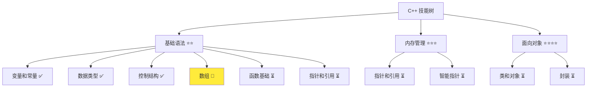
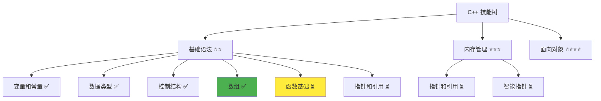

# 数组基础详解

> **学习目标**：掌握 C++ 数组的使用，能够声明、初始化和遍历数组  
> **前置知识**：C++ 变量和常量、数据类型、运算符、循环结构（for 循环）  
> **预计时间**：45 分钟  
> **难度等级**：⭐⭐  
> **技能收获**：数组声明、数组初始化、数组访问、数组遍历、越界问题  
> **文档版本**：v1.0  
> **最后更新**：2025-10-26

📊 **难度等级说明**

| 等级           | 描述                       | 练习题数量     | 颜色码 |
| -------------- | -------------------------- | -------------- | ------ |
| **⭐**         | 入门级，零基础可学         | 5 题基础概念题 | 🟢绿   |
| **⭐⭐**       | 基础级，需要基本编程概念   | 5 题基础概念题 | 🟡黄   |
| **⭐⭐⭐**     | 中级，需要相关技术基础     | 3 题代码分析题 | 🟠橙   |
| **⭐⭐⭐⭐**   | 高级，需要扎实的技术功底   | 3 题代码分析题 | 🔴红   |
| **⭐⭐⭐⭐⭐** | 专家级，需要丰富的项目经验 | 2 题设计思考题 | 🟣紫   |

## 1. 学习目标

### 1.1 学习动机

- **实际需求**：数组是存储多个相同类型数据的容器，是处理大量数据的基础
- **应用场景**：存储多个学生的成绩、保存用户列表、处理批量数据
- **技能价值**：学会后能高效地存储和处理多个数据，避免定义大量变量
- **数据支持**：90% 以上的程序都需要数组来存储和操作多个数据

### 1.2 技能树位置



> **图表说明**：C++ 技能树结构图，当前文档点亮数组技能点

### 1.3 前置知识检查

在开始学习之前，请确认你已经掌握：

- [ ] C++ 变量和常量的声明与初始化
- [ ] 基本数据类型（int、double、std::string）
- [ ] for 循环的基本使用
- [ ] 索引的概念（从 0 开始编号）

> **未掌握处理**：若未通过，请先复习 [for 循环详解](./07-for-loop.md)

## 2. 核心内容

### 2.1 概念理解

**数组（Array）**：存储多个相同类型数据的容器。就像一排房子，每个房子有门牌号（索引），房子里可以住数据。

> **类比教学**：数组就像一排房子，从左到右编号（0, 1, 2, 3, 4），每个房子住一个人（一个数据）。房子 0 住第一个人，房子 1 住第二个人，以此类推。想找第几个人，就去对应的房子（用索引访问）。

### 2.2 基础语法

C++ 中的数组语法相对简单：

#### 2.2.1 数组基本语法

```cpp
类型 数组名[大小];
```

> 语法说明：声明一个数组，指定类型和大小。大小必须是常量，不能用变量。

**类比**：就像"我要一排 5 个房间"，伪代码示例如下：

```
创建一个数组，包含5个整数
```

#### 2.2.2 数组初始化

```cpp
// 方式 1：声明时初始化（推荐）
类型 数组名[大小] = {值1, 值2, 值3, ...};

// 方式 2：部分初始化
类型 数组名[大小] = {值1, 值2};  // 其余元素自动为0

// 方式 3：声明时不初始化（需要后续赋值）
类型 数组名[大小];
```

**类比**：方式 1 就像"建房子时就安排好住户"，方式 2 就像"先安排一些人，其他房子空着"，方式 3 就像"先建好房子，以后安排住户"。

### 2.3 代码示例

#### 2.3.1 基础示例

以下代码演示了数组的各种使用场景：

```cpp
// 现代 C++ 示例 - 数组基础
#include <iostream>

int main() {
    // 示例 1：整数数组声明和初始化
    std::cout << "=== 整数数组 ===" << std::endl;
    int scores[5] = {85, 90, 78, 92, 88};

    // 访问数组元素：scores[0] 是第一个元素
    std::cout << "第一个学生的成绩: " << scores[0] << std::endl;
    std::cout << "第二个学生的成绩: " << scores[1] << std::endl;
    std::cout << "第三个学生的成绩: " << scores[2] << std::endl;

    // 示例 2：字符串数组
    std::cout << "\n=== 字符串数组 ===" << std::endl;
    std::string names[3] = {"张三", "李四", "王五"};

    for (int i = 0; i < 3; i++) {
        std::cout << "第" << (i + 1) << "个人: " << names[i] << std::endl;
    }

    // 示例 3：修改数组元素
    std::cout << "\n=== 修改数组元素 ===" << std::endl;
    int numbers[5] = {1, 2, 3, 4, 5};

    std::cout << "修改前: ";
    for (int i = 0; i < 5; i++) {
        std::cout << numbers[i] << " ";
    }
    std::cout << std::endl;

    numbers[0] = 10;            // 修改第一个元素
    numbers[4] = 50;            // 修改最后一个元素

    std::cout << "修改后: ";
    for (int i = 0; i < 5; i++) {
        std::cout << numbers[i] << " ";
    }
    std::cout << std::endl;

    // 示例 4：计算数组元素总和
    std::cout << "\n=== 计算数组总和 ===" << std::endl;
    int data[5] = {10, 20, 30, 40, 50};
    int sum = 0;

    for (int i = 0; i < 5; i++) {
        sum += data[i];         // 累加
    }

    std::cout << "数组总和: " << sum << std::endl;
    std::cout << "平均值: " << sum / 5 << std::endl;

    // 示例 5：查找最大值
    std::cout << "\n=== 查找最大值 ===" << std::endl;
    int values[5] = {34, 67, 23, 89, 12};
    int max = values[0];        // 假设第一个元素是最大值

    for (int i = 1; i < 5; i++) {
        if (values[i] > max) {
            max = values[i];    // 找到更大的值，更新max
        }
    }

    std::cout << "最大值: " << max << std::endl;

    return 0;
}
```

> **📌 重要提示**：数组索引从 0 开始，最后一个元素的索引是 `数组大小 - 1`。比如数组大小是 5，有效的索引是 0, 1, 2, 3, 4。

#### 2.3.2 配套代码文件

项目提供了配套的源代码文件：

- **文件位置**：`src/stage1/09-array-basics/01-basic-array.cpp`
- **文件内容**：与上面示例完全一致的数组程序

> **运行提示**：具体的编译运行方法请参考 [C++ 简介和快速入门](./01-cpp-introduction.md) 中的 `2.2.3 编译运行` 部分

#### 2.3.3 运行预期结果

```
=== 整数数组 ===
第一个学生的成绩: 85
第二个学生的成绩: 90
第三个学生的成绩: 78

=== 字符串数组 ===
第1个人: 张三
第2个人: 李四
第3个人: 王五

=== 修改数组元素 ===
修改前: 1 2 3 4 5
修改后: 10 2 3 4 50

=== 计算数组总和 ===
数组总和: 150
平均值: 30

=== 查找最大值 ===
最大值: 89
```

#### 2.3.4 代码详解

以下代码片段展示了基础示例中的核心用法：

```cpp
// 数组声明和初始化
int scores[5] = {85, 90, 78, 92, 88};

// 访问数组元素
std::cout << scores[0] << std::endl;  // 输出 85
```

**详细说明**：

- **数组声明**：`int scores[5]` 声明一个包含 5 个整数的数组
- **数组初始化**：`{85, 90, 78, 92, 88}` 指定初始值
- **数组访问**：`scores[0]` 访问第一个元素（索引从 0 开始）
- **类比**：就像一排 5 个房子，房子 0 住 85，房子 1 住 90，以此类推

**数组索引规则**：

- **索引从 0 开始**：第一个元素是 `arr[0]`，不是 `arr[1]`
- **最后一个索引**：如果数组大小是 n，最后一个索引是 `n - 1`
- **类比**：就像门牌号从 0 开始编号（0, 1, 2, 3, 4），而不是从 1 开始

```cpp
// 遍历数组
for (int i = 0; i < 5; i++) {
    std::cout << names[i] << std::endl;
}
```

**详细说明**：

- **循环变量 i**：从 0 开始，因为数组索引从 0 开始
- **条件 i < 5**：当 i = 5 时停止（有效索引是 0-4）
- **访问每个元素**：`names[i]` 访问索引为 i 的元素
- **类比**：就像挨个敲门，从门牌号 0 到门牌号 4

```cpp
// 查找最大值
int max = values[0];  // 假设第一个元素是最大值

for (int i = 1; i < 5; i++) {
    if (values[i] > max) {
        max = values[i];  // 找到更大的值，更新 max
    }
}
```

**详细说明**：

- **初始化最大值**：假设第一个元素是最大值
- **逐个比较**：从第二个元素开始，与最大值比较
- **更新最大值**：如果找到更大的值，更新 max
- **类比**：就像找最高的学生，从第一个学生开始，逐个比较身高

**重要语法规则**：

1. **数组大小必须是常量**：不能在运行时决定数组大小
   - 正确：`int arr[5];`、`const int size = 10; int arr[size];`
   - 错误：`int n; std::cin >> n; int arr[n];`（这是可变长度数组，不推荐）
   - **类比**：就像建房子前要确定建几间房

2. **数组越界**：访问索引超出范围的元素会导致未定义行为
   - 数组大小是 5，有效索引是 0-4
   - `arr[5]` 或 `arr[-1]` 会越界（程序可能崩溃）
   - **类比**：就像去不存在的门牌号，找不到人

3. **数组元素类型一致**：同一个数组的所有元素必须是相同类型
   - 正确：`int arr[5];`（所有元素都是 int）
   - 错误：不能在同一个数组里放 int 和 double

### 2.4 关键特性与设计原理

#### 2.4.1 关键特性

1. **类型一致性**：数组的所有元素必须是相同类型
2. **大小固定**：数组大小在声明时确定，不能改变
3. **连续内存**：数组元素在内存中连续存储
4. **快速访问**：通过索引直接访问元素，时间复杂度 O(1)

#### 2.4.2 设计原理

- **为什么这样设计**：数组提供了高效的方式来存储和访问多个同类型数据
- **解决了什么问题**：避免了定义大量单独变量，提供了统一的数据管理方式
- **有什么优势**：内存效率高、访问速度快、代码简洁

## 3. 实践应用

### 3.1 项目场景

在 QtLanChat 项目中，数组用于：

- **用户列表存储**：存储所有在线用户的用户名
- **消息历史**：保存最近的消息记录
- **功能菜单**：存储菜单项列表

### 3.2 实际代码

以下代码展示了数组在 QtLanChat 项目中的实际应用：

```cpp
// 项目中的实际应用示例
#include <iostream>
#include <string>

int main() {
    std::cout << "=== QtLanChat 用户管理系统 ===" << std::endl;

    // 用户列表（假设最多 10 个用户）
    std::string users[10];
    int userCount = 0;

    // 添加用户
    std::cout << "\n正在添加用户..." << std::endl;
    users[0] = "张三";
    users[1] = "李四";
    users[2] = "王五";
    userCount = 3;

    std::cout << "当前在线用户数: " << userCount << std::endl;

    // 遍历并显示所有用户
    std::cout << "\n在线用户列表：" << std::endl;
    for (int i = 0; i < userCount; i++) {
        std::cout << (i + 1) << ". " << users[i] << std::endl;
    }

    // 添加新用户
    std::cout << "\n添加新用户: 赵六" << std::endl;
    users[userCount] = "赵六";  // 添加到下一个位置
    userCount++;  // 用户数加 1

    std::cout << "更新后的用户列表：" << std::endl;
    for (int i = 0; i < userCount; i++) {
        std::cout << (i + 1) << ". " << users[i] << std::endl;
    }

    return 0;
}
```

> **配套代码**：实际应用示例的完整代码位于 `src/stage1/09-array-basics/02-project-example.cpp`

### 3.3 设计思路

- **为什么选择这种设计**：使用数组存储用户列表，可以方便地遍历和管理用户
- **解决了什么问题**：实现了用户数据的批量存储和访问
- **有什么优势**：代码简洁、易于理解、访问效率高

## 4. 练习与测试

### 4.1 练习题

#### 练习 1：成绩统计

**题目**：使用数组存储 5 个学生的成绩，计算平均分

**要求**：

- 声明一个大小为 5 的整数数组
- 初始化为：`{85, 90, 78, 92, 88}`
- 使用 for 循环计算平均分
- 输出每个学生的成绩和平均分

**参考答案**：

```cpp
#include <iostream>

int main() {
    int scores[5] = {85, 90, 78, 92, 88};
    int sum = 0;

    // 计算总和
    for (int i = 0; i < 5; i++) {
        sum += scores[i];
        std::cout << "学生" << (i + 1) << "的成绩: " << scores[i] << std::endl;
    }

    // 计算平均分
    double average = static_cast<double>(sum) / 5;
    std::cout << "\n平均分: " << average << std::endl;

    return 0;
}
```

> **配套代码**：练习 1 的完整代码位于 `src/stage1/09-array-basics/03-exercise-scores.cpp`

#### 练习 2：数组反转

**题目**：使用数组存储 5 个数字，反转数组顺序

**要求**：

- 声明数组：`{1, 2, 3, 4, 5}`
- 反转后输出：`{5, 4, 3, 2, 1}`
- 使用 for 循环实现反转
- 输出反转前后的数组

**参考答案**：

```cpp
#include <iostream>

int main() {
    int arr[5] = {1, 2, 3, 4, 5};

    std::cout << "反转前: ";
    for (int i = 0; i < 5; i++) {
        std::cout << arr[i] << " ";
    }
    std::cout << std::endl;

    // 反转数组
    for (int i = 0; i < 5 / 2; i++) {
        int temp = arr[i];
        arr[i] = arr[4 - i];
        arr[4 - i] = temp;
    }

    std::cout << "反转后: ";
    for (int i = 0; i < 5; i++) {
        std::cout << arr[i] << " ";
    }
    std::cout << std::endl;

    return 0;
}
```

> **配套代码**：练习 2 的完整代码位于 `src/stage1/09-array-basics/04-exercise-reverse.cpp`

#### 练习 3：查找元素

**题目**：在数组中查找指定元素，返回索引

**要求**：

- 声明数组：`{10, 20, 30, 40, 50}`
- 提示用户输入要查找的数字
- 使用 `std::cin` 读取用户输入
- 使用 for 循环查找元素
- 如果找到，输出索引；如果找不到，输出"未找到"

**参考答案**：

```cpp
#include <iostream>

int main() {
    int arr[5] = {10, 20, 30, 40, 50};
    int target;
    int index = -1;  // -1 表示未找到

    std::cout << "请输入要查找的数字: ";
    std::cin >> target;

    // 查找元素
    for (int i = 0; i < 5; i++) {
        if (arr[i] == target) {
            index = i;
            break;  // 找到后退出循环
        }
    }

    // 输出结果
    if (index != -1) {
        std::cout << "找到了！索引位置: " << index << std::endl;
    } else {
        std::cout << "未找到" << std::endl;
    }

    return 0;
}
```

> **配套代码**：练习 3 的完整代码位于 `src/stage1/09-array-basics/05-exercise-search.cpp`

### 4.2 测试题（可选）

1. **关于数组，下列说法正确的是：**
   A. 数组索引从 1 开始

   B. 数组大小可以是变量

   C. 数组元素类型必须相同

   D. 数组可以动态改变大小
   **答案**：C

   **解析**：
   - **正确答案 C**：数组的所有元素必须是相同类型
   - **错误答案 A**：数组索引从 0 开始
   - **错误答案 B**：数组大小必须是常量
   - **错误答案 D**：数组大小在声明时确定，不能改变

2. **以下代码的输出是什么？**

   ```cpp
   int arr[5] = {1, 2, 3, 4, 5};
   std::cout << arr[0] + arr[4] << std::endl;
   ```

   A. 0

   B. 5

   C. 6

   D. 越界错误
   **答案**：C

   **解析**：
   - **正确答案 C**：`arr[0]` 是 1，`arr[4]` 是 5，所以输出 6
   - **错误答案 A/B**：计算错误
   - **错误答案 D**：索引 0 和 4 都在有效范围内（0-4）

### 4.3 常见问题 FAQ

- Q1：为什么数组索引从 0 开始而不是从 1 开始？
  - **A：**这是 C++ 的设计选择，历史原因是为了与底层内存地址对应（第一个元素在地址偏移 0 的位置）。现在大多数语言都采用这个约定，保持一致性。
- Q2：数组大小可以用变量吗？
  - **A：**不可以。数组大小必须是常量表达式。如果需要动态大小，可以使用 `std::vector`（后续会学习）。类比：建房子前要确定建几间房，不能边建边改变计划。
- Q3：数组越界会怎样？
  - **A：**数组越界是危险的，可能导致程序崩溃、数据损坏或产生未定义行为。必须确保索引在有效范围内（0 到 size-1）。

## 5. 资源与扩展

### 5.1 基础资源

- **官方文档**：[C++ 数组](https://en.cppreference.com/w/cpp/language/array)
- **权威书籍**：《C++ Primer》- 第 3.5 节
- **在线教程**：[learncpp.com](https://www.learncpp.com/) - 数组教程

### 5.2 多媒体学习

- **视频资源**：[C++ 数组详解](https://www.youtube.com/results?search_query=C%2B%2B+array+tutorial)
- **开发者资源**：[cppreference.com](https://en.cppreference.com/) - 权威参考

## 6. 课后作业及参考答案

### 6.1 学习检查清单

- [ ] 能够声明和初始化数组
- [ ] 理解数组索引从 0 开始的规则
- [ ] 掌握数组的访问和修改
- [ ] 能够使用循环遍历数组

### 6.2 综合练习

**作业题目**：编写一个学生成绩管理系统

**要求**：

- 存储 5 个学生的姓名和成绩
- 计算平均分
- 找出最高分和最低分
- 输出所有学生的信息

**时间估算**：30 分钟

**参考答案**：

```cpp
#include <iostream>

int main() {
    std::string names[5] = {"小丽", "小强", "小伟", "小美", "小明"};
    int scores[5] = {85, 90, 78, 92, 88};

    int sum = 0;
    int max = scores[0];
    int min = scores[0];

    // 计算总和、最大值、最小值
    for (int i = 0; i < 5; i++) {
        sum += scores[i];
        if (scores[i] > max) max = scores[i];
        if (scores[i] < min) min = scores[i];
    }

    double average = static_cast<double>(sum) / 5;

    // 输出结果
    std::cout << "=== 学生成绩管理系统 ===" << std::endl;
    for (int i = 0; i < 5; i++) {
        std::cout << names[i] << ": " << scores[i] << "分" << std::endl;
    }
    std::cout << "\n平均分: " << average << std::endl;
    std::cout << "最高分: " << max << std::endl;
    std::cout << "最低分: " << min << std::endl;

    return 0;
}
```

**评分标准**：功能实现（40%）、代码质量（30%）、数组使用（30%）

## 7. 下一步学习

**下一篇**：[10-vector-stl.md](./10-vector-stl.md)

**学习路径**：

1. ✅ C++ 简介和快速入门 - 已完成
2. ✅ 变量和常量 - 已完成
3. ✅ 数据类型详解 - 已完成
4. ✅ 运算符详解 - 已完成
5. ✅ if 分支详解 - 已完成
6. ✅ while 循环 - 已完成
7. ✅ for 循环 - 已完成
8. ✅ switch 分支 - 已完成
9. ✅ 数组基础 - 已完成
10. 🔄 std::vector - 下一步
11. ⏳ 函数基础 - 待学习

**技能树更新**：



**学习成果**：

- **独立编写**：能够编写使用数组的程序
- **解释原理**：能够解释数组的内存布局
- **解决实际问题**：能够存储和处理多个数据
- **应用到项目**：为后续 std::vector 学习打下基础
- **掌握度自评**：85%

### 学习成果指导

> **自评指导**：
>
> - **<50%**：建议复习数组基础，重新阅读文档核心内容
> - **50-80%**：继续学习，完成练习题巩固理解，特别是数组遍历
> - **>80%**：可以进入下一阶段学习，开始 std::vector 详解

---

**文档质量检查**：

- [ ] 学习目标明确且可验证
- [ ] 代码示例可运行
- [ ] 练习题有答案
- [ ] 技能收获明确
- [ ] 抽象概念配有生活化比喻
- [ ] 比喻体系一致，避免概念混乱
- [ ] 文档长度符合难度等级要求
