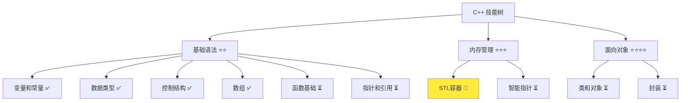
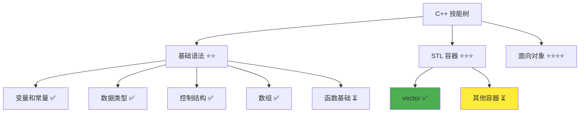

# std::vector 详解

> **学习目标**：掌握 C++ std::vector 容器的使用，能够动态管理数组  
> **前置知识**：C++ 数组基础、for 循环  
> **预计时间**：45 分钟  
> **难度等级**：⭐⭐⭐  
> **技能收获**：vector 声明、动态大小、常用方法、STL 容器基础  
> **文档版本**：v1.0  
> **最后更新**：2025-10-26

📊 **难度等级说明**

| 等级           | 描述                       | 练习题数量     | 颜色码 |
| -------------- | -------------------------- | -------------- | ------ |
| **⭐**         | 入门级，零基础可学         | 5 题基础概念题 | 🟢绿   |
| **⭐⭐**       | 基础级，需要基本编程概念   | 5 题基础概念题 | 🟡黄   |
| **⭐⭐⭐**     | 中级，需要相关技术基础     | 3 题代码分析题 | 🟠橙   |
| **⭐⭐⭐⭐**   | 高级，需要扎实的技术功底   | 3 题代码分析题 | 🔴红   |
| **⭐⭐⭐⭐⭐** | 专家级，需要丰富的项目经验 | 2 题设计思考题 | 🟣紫   |

## 1. 学习目标

### 1.1 学习动机

- **实际需求**：`std::vector` 是动态数组，可以随时添加和删除元素，解决了 C 风格数组大小固定的问题
- **应用场景**：不确定数量的数据存储、动态管理用户列表、弹性的数据处理
- **技能价值**：学会后能编写更灵活的程序，无需提前知道数据量
- **数据支持**：`std::vector` 是现代 C++ 中使用频率最高的容器，90% 的场景替代了 C 风格数组

### 1.2 技能树位置



> **图表说明**：C++ 技能树结构图，当前文档点亮 STL 容器技能点

### 1.3 前置知识检查

在开始学习之前，请确认你已经掌握：

- [ ] C++ 数组的声明和初始化
- [ ] for 循环的基本使用
- [ ] 数组的遍历和访问
- [ ] 基本数据类型（int、std::string）

> **未掌握处理**：若未通过，请先复习 [数组基础](./09-array-basics.md)

## 2. 核心内容

### 2.1 概念理解

**std::vector**：C++ 标准库中的动态数组容器，可以自动调整大小，支持随时添加和删除元素。

> **类比教学**：`std::vector` 就像一个可以自动扩展的仓库，你不需要提前知道要存多少东西，随时可以往里放，也可以随时拿走。相比 C 风格数组的"固定大小的房子"，vector 就像"可伸缩的帐篷"，需要多少空间就展开多少空间。

### 2.2 基础语法

C++ 中的 vector 是模板类，需要包含头文件：

```cpp
#include <vector>       // vector 头文件
```

#### 2.2.1 vector 基本语法

```cpp
std::vector<类型> 变量名;
```

> 语法说明：声明一个 vector，类型可以是任何数据类型。`<类型>` 是模板参数，指定存储什么类型的数据。

**模板概念说明**：

- **模板（Template）**：可以理解为"通用模具"，vector 是一个通用容器模板，通过指定类型参数来生成特定类型的容器
- **类比**：就像"我要一个可以装整数的袋子"或"我要一个可以装字符串的袋子"，`<>` 里指定装什么类型的东西。`std::vector<int>` 表示"整数类型的容器"，`std::vector<std::string>` 表示"字符串类型的容器"
- **为什么叫模板**：同一个 vector 模板可以用于不同的数据类型，只需要改变 `<>` 中的类型参数

#### 2.2.2 vector 初始化

```cpp
// 方式 1：声明空 vector（推荐）
std::vector<int> vec;                   // 空的整数 vector

// 方式 2：指定初始大小
std::vector<int> vec(5);                // 5 个整数，初始值为 0

// 方式 3：指定初始大小和初始值
std::vector<int> vec(5, 10);            // 5 个整数，都是 10

// 方式 4：从数组初始化
int arr[] = {1, 2, 3, 4, 5};
std::vector<int> vec(arr, arr + 5);     // 从数组复制

// 方式 5：列表初始化（C++11，推荐，最简洁）
std::vector<int> vec = {1, 2, 3, 4, 5};  // 直接用花括号初始化
std::vector<int> vec2{10, 20, 30};       // 也可以省略等号
```

**类比**：方式 1 就像"先拿个空袋子"，方式 2 就像"拿个能装 5 个东西的袋子（都是空的）"，方式 3 就像"拿个能装 5 个东西的袋子（都装 10）"，方式 4 就像"把现有盒子里的东西搬到袋子里"，方式 5 就像"直接指定袋子里的东西"。

> **📌 提示**：方式 5（列表初始化）是 C++11 引入的现代初始化方式，最简洁直观。如果初始值确定，推荐使用这种方式。

**方式 4 详细说明**：

- `arr`：数组的起始位置（从第一个元素 `arr[0]` 开始）
- `arr + 5`：数组的结束位置（第 6 个元素的位置，但不包含它）
- `vec(arr, arr + 5)`：将数组从 `arr[0]` 到 `arr[4]`（共 5 个元素）复制到 vector 中
- **类比**：就像说"把盒子里的前 5 个东西全部搬到袋子里"，`arr` 是起点，`arr + 5` 是终点（但不包括终点，只复制前 5 个）

> **📌 提示**：这种方式使用了"范围"的概念，从起点到终点（不包含终点）。这是 C++ 中常见的设计，后续学习 STL 算法时会再次遇到这种"左闭右开区间"的概念。

### 2.3 代码示例

#### 2.3.1 基础示例

以下代码演示了 vector 的各种使用场景：

```cpp
// 现代 C++ 示例 - vector 基础
#include <iostream>
#include <vector>

int main() {
    // 示例 1：声明和使用 vector
    std::cout << "=== 基本使用 ===" << std::endl;
    std::vector<int> vec;

    vec.push_back(10);              // 添加元素
    vec.push_back(20);
    vec.push_back(30);

    std::cout << "第一个元素: " << vec[0] << std::endl;
    std::cout << "向量大小: " << vec.size() << std::endl;

    // 示例 2：遍历 vector
    std::cout << "\n=== 遍历 vector ===" << std::endl;
    for (int i = 0; i < vec.size(); i++) {
        std::cout << vec[i] << " ";
    }
    std::cout << std::endl;

    // 示例 3：访问和修改元素
    std::cout << "\n=== 修改元素 ===" << std::endl;
    vec[0] = 100;                   // 修改第一个元素
    for (int i = 0; i < vec.size(); i++) {
        std::cout << vec[i] << " ";
    }
    std::cout << std::endl;

    // 示例 4：删除元素
    std::cout << "\n=== 删除元素 ===" << std::endl;
    vec.pop_back();                 // 删除最后一个元素
    std::cout << "删除后的大小: " << vec.size() << std::endl;
    for (int i = 0; i < vec.size(); i++) {
        std::cout << vec[i] << " ";
    }
    std::cout << std::endl;

    // 示例 5：判断是否为空
    std::cout << "\n=== 判断是否为空 ===" << std::endl;
    if (!vec.empty()) {
        std::cout << "vector 不为空，包含 " << vec.size() << " 个元素" << std::endl;
    }

    return 0;
}
```

> **📌 重要提示**：vector 需要在 `<>` 中指定类型，如 `std::vector<int>`、`std::vector<std::string>`。

补充示例（进阶预览 - 在中间插入和删除元素）：

```cpp
// 示例 6：在中间插入元素（insert）
// begin() + 2 表示指向索引2位置的"位置标记"（后续会详细解释）
std::vector<int> v1 = {10, 20, 30, 40};
v1.insert(v1.begin() + 2, 99);   // 在索引2之前插入 99，结果：10 20 99 30 40

// 示例 7：删除中间元素与批量删除（erase）
std::vector<int> v2 = {1, 2, 3, 4, 5, 6};
v2.erase(v2.begin() + 1);        // 删除索引1处的元素（2）=> 1 3 4 5 6

// 遍历删除所有偶数：it 是一个"位置标记"（迭代器），用于遍历和定位元素
// erase 删除后会返回下一个有效位置，必须用返回值更新 it（安全做法）
for (auto it = v2.begin(); it != v2.end(); ) {
    if ((*it) % 2 == 0) {
        it = v2.erase(it);       // 删除偶数，并用返回值更新位置标记
    } else {
        ++it;                    // 不是偶数，移动到下一个位置
    }
}
// 结果：1 3 5
```

> **📌 提示**：示例 6 和 7 中使用了一些新概念（如 `begin()`、`end()`、迭代器 `it`），这些概念会在下面的"代码详解"部分详细解释。

#### 2.3.2 配套代码文件

项目提供了配套的源代码文件：

- **文件位置**：`src/stage1/10-vector-stl/01-basic-vector.cpp`
- **文件内容**：与上面示例完全一致的 vector 程序

> **运行提示**：具体的编译运行方法请参考 [C++ 简介和快速入门](./01-cpp-introduction.md) 中的 `2.2.3 编译运行` 部分

#### 2.3.3 运行预期结果

```
=== 基本使用 ===
第一个元素: 10
向量大小: 3

=== 遍历 vector ===
10 20 30

=== 修改元素 ===
100 20 30

=== 删除元素 ===
删除后的大小: 2
100 20

=== 判断是否为空 ===
vector 不为空，包含 2 个元素
```

#### 2.3.4 代码详解

以下代码片段展示了基础示例中的核心用法：

```cpp
// 声明 vector
std::vector<int> vec;                   // 声明一个整数 vector

// 添加元素
vec.push_back(10);
vec.push_back(20);
```

**详细说明**：

- **`std::vector<int>`**：声明一个存储整数的 vector
- **`push_back()`**：在 vector 末尾添加元素
- **类比**：就像往袋子里装东西，一个一个地放进去

```cpp
// 访问元素
std::cout << vec[0] << std::endl;       // 输出第一个元素
std::cout << vec.size() << std::endl;   // 输出大小
```

**详细说明**：

- **`vec[0]`**：访问第 0 个元素（与数组相同）
- **`vec.size()`**：返回 vector 中元素的数量，返回值类型是 `size_t`（无符号整数类型）
- **类型说明**：`size_t` 是无符号整数类型，通常与 `int` 兼容，但在与 `int` 比较或运算时，如果编译器警告类型不匹配，可以使用 `static_cast<int>(vec.size())` 转换
- **类比**：就像看袋子的大小，可以知道里面装了多少东西

```cpp
// 遍历 vector
for (int i = 0; i < vec.size(); i++) {
    std::cout << vec[i] << " ";
}
```

**详细说明**：

- **循环条件**：`i < vec.size()` - 从 0 到大小减 1
- **访问方式**：`vec[i]` - 使用索引访问元素
- **动态大小**：`vec.size()` 会随着添加/删除元素而变化
- **类比**：就像从袋子里一个接一个地取出东西

```cpp
// 在中间插入（insert）
std::vector<int> demoInsert = {10, 20, 30, 40};
demoInsert.insert(demoInsert.begin() + 2, 99);  // 在索引2之前插入 99
// 结果：10 20 99 30 40

// 在遍历中删除（erase）
std::vector<int> demoErase = {1, 2, 3, 4, 5, 6};
for (auto it = demoErase.begin(); it != demoErase.end(); ) {
    if ((*it) % 2 == 0) {
        it = demoErase.erase(it);   // 返回下一个有效迭代器，避免失效
    } else {
        ++it;
    }
}
// 结果：1 3 5
```

**迭代器概念说明**：

在理解 `insert` 和 `erase` 之前，我们需要先了解**迭代器（iterator）**：

- **迭代器是什么**：迭代器可以理解为"指向容器中某个元素位置的标记"或"元素的位置指针"
- **类比**：如果把 vector 想象成一排房子（元素），迭代器就像门牌号或者指向某个房子的指针。`vec.begin()` 指向第一间房子，`vec.end()` 指向最后一间房子后面的位置（作为结束标记）
- **基本用法**：
  - `vec.begin()` - 返回指向第一个元素的迭代器
  - `vec.end()` - 返回指向最后一个元素后面的迭代器（作为结束标记）
  - `vec.begin() + i` - 返回指向第 i 个元素的迭代器（就像"第一间房子 + 2 = 第三间房子"）
  - `*it` - 通过迭代器访问元素的值（就像"看门牌号对应的房子里住的人"）
- **为什么要用迭代器**：当我们需要在中间插入或删除元素时，不能直接用索引，需要用迭代器来精确定位操作位置

**insert/erase 关键点**：

- **`insert(pos, x)`**：在迭代器 `pos` 指向的位置**之前**插入元素 `x`
  - 例如：`vec.insert(vec.begin() + 2, 99)` 表示在索引 2 的位置之前插入 99
  - 类比：就像在第三间房子前插入一间新房子，原来第三间房子变成第四间
- **`erase(pos)`**：删除迭代器 `pos` 指向的元素，并返回删除后**下一个有效元素的迭代器**
  - 例如：`it = vec.erase(it)` 删除当前元素，并将 `it` 更新为下一个元素的位置
  - **重要**：删除后原来的迭代器会失效，必须用返回的新迭代器继续遍历
  - 类比：就像拆掉一间房子后，门牌号重新编排，需要获取新的门牌号才能继续找到下一间房子
- **遍历删除的正确做法**：使用 `it = vec.erase(it)` 而不是 `vec.erase(it)`，因为删除后需要更新迭代器位置

> **📌 提示**：迭代器是一个重要概念，这里先建立初步理解。后续在指针与迭代器章节会系统讲解迭代器的底层原理和更多用法。

**重要语法规则**：

1. **vector 是模板类**：必须用 `<>` 指定类型
   - `std::vector<int>` - 整数向量
   - `std::vector<std::string>` - 字符串向量
   - **类比**：就像说"我要装衣服的袋子"或"我要装书的袋子"

2. **动态大小**：可以随时添加和删除元素
   - `push_back()` - 在末尾添加元素
   - `pop_back()` - 删除最后一个元素
   - **类比**：袋子可以变大变小，随时调整

3. **常用方法**：
   - `size()` - 返回元素数量
   - `empty()` - 判断是否为空
   - `vec[i]` - 访问索引为 i 的元素

### 2.4 关键特性与设计原理

#### 2.4.1 关键特性

1. **动态大小**：可以随时添加和删除元素
2. **类型安全**：模板类型检查，避免类型错误
3. **自动内存管理**：自动分配和释放内存
4. **高效操作**：末尾添加/删除操作非常快速

#### 2.4.2 设计原理

- **为什么这样设计**：解决了 C 风格数组大小固定的问题，提供了更灵活的数据管理方式
- **解决了什么问题**：无需提前知道数据量，可以动态调整存储空间
- **有什么优势**：使用方便、内存自动管理、类型安全、代码简洁

## 3. 实践应用

### 3.1 项目场景

在 QtLanChat 项目中，vector 用于：

- **动态用户列表**：存储所有在线用户，数量随时变化
- **消息历史**：保存消息记录，可以动态添加
- **在线用户管理**：随时添加和删除用户

### 3.2 实际代码

以下代码展示了 vector 在 QtLanChat 项目中的实际应用：

```cpp
// 项目中的实际应用示例
#include <iostream>
#include <vector>
#include <string>

int main() {
    std::cout << "=== QtLanChat 动态用户管理 ===" << std::endl;

    // 使用 vector 存储用户列表
    std::vector<std::string> users;

    // 添加用户
    std::cout << "\n用户上线..." << std::endl;
    users.push_back("张三");
    users.push_back("李四");
    users.push_back("王五");

    std::cout << "当前在线用户数: " << users.size() << std::endl;

    // 显示所有用户
    std::cout << "在线用户列表：" << std::endl;
    for (int i = 0; i < users.size(); i++) {
        std::cout << (i + 1) << ". " << users[i] << std::endl;
    }

    // 用户下线（简化为删除最后一个）
    std::cout << "\n王五下线了" << std::endl;
    users.pop_back();

    std::cout << "当前在线用户数: " << users.size() << std::endl;
    std::cout << "剩余用户：" << std::endl;
    for (int i = 0; i < users.size(); i++) {
        std::cout << (i + 1) << ". " << users[i] << std::endl;
    }

    return 0;
}
```

> **配套代码**：实际应用示例的完整代码位于 `src/stage1/10-vector-stl/02-project-example.cpp`

### 3.3 设计思路

- **为什么选择这种设计**：使用 vector 可以动态管理用户列表，无需提前知道用户数量
- **解决了什么问题**：实现了灵活的用户管理，可以随时添加和删除用户
- **有什么优势**：代码简洁、动态管理、易于维护

## 4. 练习与测试

### 4.1 练习题

#### 练习 1：动态成绩管理

**题目**：使用 vector 动态管理学生成绩

**要求**：

- 声明一个 `std::vector<int>` 存储成绩
- 使用 `push_back()` 添加 5 个成绩
- 使用 for 循环遍历并输出所有成绩
- 计算平均分

**参考答案**：

```cpp
#include <iostream>
#include <vector>

int main() {
    std::vector<int> scores;

    // 添加成绩
    scores.push_back(85);
    scores.push_back(90);
    scores.push_back(78);
    scores.push_back(92);
    scores.push_back(88);

    // 遍历并计算平均分
    int sum = 0;
    std::cout << "成绩列表：" << std::endl;
    for (int i = 0; i < scores.size(); i++) {
        std::cout << "学生" << (i + 1) << ": " << scores[i] << std::endl;
        sum += scores[i];
    }

    double average = static_cast<double>(sum) / scores.size();
    std::cout << "\n平均分: " << average << std::endl;

    return 0;
}
```

> **配套代码**：练习 1 的完整代码位于 `src/stage1/10-vector-stl/03-exercise-scores.cpp`

#### 练习 2：动态数据管理（删除所有偶数）

**题目**：使用 vector 动态添加和删除数据

**要求**：

- 创建一个整数 vector
- 使用循环添加 10 个数字（1 到 10）
- 删除所有偶数
- 输出剩余的数字

> 新知识点提示：本练习需要在遍历时安全删除元素。正确做法是使用迭代器配合 `erase`，并使用 `it = vec.erase(it)` 接住返回的下一个有效迭代器，避免迭代器失效。

**参考答案（迭代器 + erase）**：

```cpp
#include <iostream>
#include <vector>

int main() {
    std::vector<int> vec;

    // 添加 1 到 10
    for (int i = 1; i <= 10; i++) {
        vec.push_back(i);
    }

    std::cout << "原始数据: ";
    for (int i = 0; i < vec.size(); i++) {
        std::cout << vec[i] << " ";
    }
    std::cout << std::endl;

    // 删除所有偶数：使用迭代器配合 erase 安全删除
    for (auto it = vec.begin(); it != vec.end(); ) {
        if ((*it) % 2 == 0) {
            it = vec.erase(it);   // 返回下一个有效迭代器
        } else {
            ++it;
        }
    }

    std::cout << "删除偶数后: ";
    for (int i = 0; i < vec.size(); i++) {
        std::cout << vec[i] << " ";
    }
    std::cout << std::endl;

    return 0;
}
```

> **配套代码**：练习 2 的完整代码位于 `src/stage1/10-vector-stl/04-exercise-manage.cpp`

#### 练习 3：在指定位置插入元素

**题目**：向 `vector<int>` 中在指定位置插入一个元素。

**要求**：

- 读入位置 `pos` 与数值 `x`
- 若 `0 <= pos <= vec.size()`，执行 `vec.insert(vec.begin() + pos, x)`
- 输出插入后的序列

**参考答案**：

```cpp
#include <iostream>
#include <vector>

int main() {
    std::vector<int> vec = {10, 20, 30, 40};

    int pos;
    int x;
    std::cout << "请输入插入位置和数值（如：2 99）: ";
    std::cin >> pos >> x;

    if (pos >= 0 && pos <= static_cast<int>(vec.size())) {
        vec.insert(vec.begin() + pos, x);
    } else {
        std::cout << "位置非法，未进行插入" << std::endl;
    }

    for (int i = 0; i < vec.size(); i++) {
        std::cout << vec[i] << " ";
    }
    std::cout << std::endl;

    return 0;
}
```

> **配套代码**：练习 3 的完整代码位于 `src/stage1/10-vector-stl/05-exercise-insert.cpp`

#### 练习 4：删除指定值的所有出现

**题目**：从 `vector<int>` 中删除给定值 `x` 的全部出现。

**要求**：

- 使用迭代器 + `erase` 循环删除，或使用 `erase-remove` 惯用法
- 输出删除后的序列

**参考答案（迭代器 + erase 版）**：

```cpp
#include <iostream>
#include <vector>

int main() {
    std::vector<int> vec = {1, 2, 3, 2, 4, 2, 5};
    int x;
    std::cout << "要删除的值: ";
    std::cin >> x;

    for (auto it = vec.begin(); it != vec.end(); ) {
        if (*it == x) {
            it = vec.erase(it);
        } else {
            ++it;
        }
    }

    for (int i = 0; i < vec.size(); i++) {
        std::cout << vec[i] << " ";
    }
    std::cout << std::endl;
    return 0;
}
```

> **配套代码**：练习 4 的完整代码位于 `src/stage1/10-vector-stl/06-exercise-remove.cpp`

### 4.2 测试题（可选）

1. **关于 vector，下列说法正确的是：**
   A. vector 大小在声明时确定，不能改变

   B. vector 可以存储不同类型的数据

   C. vector 使用 `push_back()` 添加元素

   D. vector 索引从 1 开始
   **答案**：C

   **解析**：
   - **正确答案 C**：`push_back()` 在 vector 末尾添加元素
   - **错误答案 A**：vector 大小可以动态改变
   - **错误答案 B**：vector 只能存储相同类型的数据（由模板参数决定）
   - **错误答案 D**：vector 索引从 0 开始，与数组相同

2. **以下关于在遍历中删除元素的说法，正确的是：**
   A. 用 `for (int i = 0; i < vec.size(); i++)` 并在体内随意 `erase` 不会有问题

   B. `erase` 会返回下一个有效迭代器，应该用它更新迭代器

   C. 只能用 `pop_back()` 删除元素

   D. `erase` 不会使迭代器失效
   **答案**：B

   **解析**：
   - **正确答案 B**：`it = vec.erase(it)` 是安全删除的常用写法
   - **错误答案 A/D**：`erase` 会使当前位置及之后的迭代器失效，必须接住返回值
   - **错误答案 C**：`pop_back()` 只能删除末尾元素

3. **以下关于 `insert` 的说法正确的是：**
   A. `insert(pos, x)` 中 `pos` 可以越界

   B. `insert` 会在 `pos` 之前插入元素

   C. `insert` 只能在末尾插入

   D. `insert` 不能和迭代器一起用
   **答案**：B

   **解析**：
   - **正确答案 B**：`insert` 会在迭代器 `pos` 指向的位置**之前**插入元素。例如 `vec.insert(vec.begin() + 2, 99)` 会在索引 2 之前插入 99
   - **错误答案 A**：`pos` 必须在 `[begin(), end()]` 范围内，越界会导致未定义行为或程序崩溃
   - **错误答案 C**：`insert` 可以在任意位置插入，不仅限于末尾。`push_back()` 才是只在末尾插入
   - **错误答案 D**：`insert` 必须使用迭代器作为第一个参数来指定插入位置，例如 `vec.insert(vec.begin() + i, x)`

### 4.3 常见问题 FAQ

- Q1：vector 和数组有什么区别？
  - **A：**数组大小固定，vector 大小可动态调整；数组不需要头文件，vector 需要 `#include <vector>`；数组分配在栈上，vector 分配在堆上。选择原则：确定大小用数组，不确定用 vector
- Q2：vector 什么时候会重新分配内存？
  - **A：**当添加元素导致容量不足时，vector 会自动分配更大的内存。类比：就像房子装不下时，搬家到更大的房子

## 5. 资源与扩展

### 5.1 基础资源

- **官方文档**：[C++ std::vector](https://en.cppreference.com/w/cpp/container/vector)
- **权威书籍**：《C++ Primer》- 第 3.3.2 节
- **在线教程**：[learncpp.com](https://www.learncpp.com/) - vector 教程

### 5.2 多媒体学习

- **视频资源**：[C++ vector 详解](https://www.youtube.com/results?search_query=C%2B%2B+vector+tutorial)
- **开发者资源**：[cppreference.com](https://en.cppreference.com/) - 权威参考

## 6. 课后作业及参考答案

### 6.1 学习检查清单

**基础操作**：

- [ ] 能够声明 vector（`std::vector<类型> 变量名`）
- [ ] 理解模板的概念（vector 是通用容器模板）
- [ ] 掌握 vector 的 5 种初始化方式（空、指定大小、指定大小和值、从数组初始化、列表初始化）
- [ ] 理解 vector 模板参数的作用（`std::vector<int>`、`std::vector<std::string>`）
- [ ] 能够使用 `push_back()` 在末尾添加元素
- [ ] 能够使用 `pop_back()` 删除末尾元素
- [ ] 能够使用索引访问和修改元素（`vec[i]`）
- [ ] 能够使用 `size()` 获取元素数量
- [ ] 能够使用 `empty()` 判断是否为空
- [ ] 能够使用 for 循环遍历 vector

**进阶操作**：

- [ ] 理解迭代器的概念和基本用法（`begin()`、`end()`、`*it`）
- [ ] 能够使用 `insert(pos, x)` 在指定位置插入元素
- [ ] 能够使用 `erase(pos)` 删除指定位置的元素
- [ ] 掌握遍历删除的正确做法（`it = vec.erase(it)`）
- [ ] 理解迭代器失效的概念和安全删除的重要性

**综合应用**：

- [ ] 能够结合循环、条件判断和 vector 操作解决实际问题
- [ ] 能够选择合适的方法（`push_back` / `pop_back` vs `insert` / `erase`）
- [ ] 能够理解 vector 相比数组的优势（动态大小、灵活操作）

### 6.2 综合练习

**作业题目**：编写一个学生成绩管理系统的完整版本

**功能需求**：

1. **数据初始化**：使用数组初始化方式创建初始成绩列表 `{85, 90, 78, 92, 88, 75, 95}`
2. **动态添加**：提示用户输入新的成绩，使用 `push_back()` 添加到列表末尾
3. **显示统计**：计算并显示平均分、最高分、最低分
4. **插入操作**：允许用户在指定位置插入新成绩（使用 `insert`）
5. **删除操作**：
   - 删除指定成绩的所有出现（使用 `erase` 和迭代器）
   - 删除不及格成绩（< 60 分）
6. **展示功能**：显示所有成绩列表

**交互示例**：

```
=== 学生成绩管理系统 ===
当前成绩列表：85 90 78 92 88 75 95

请选择操作：
1. 添加成绩（末尾）
2. 插入成绩（指定位置）
3. 删除指定成绩的所有出现
4. 删除所有不及格成绩
5. 显示统计信息
6. 显示所有成绩
0. 退出

请输入选择:
```

**时间估算**：45 分钟

**参考答案**：

```cpp
#include <iostream>
#include <vector>

int main() {
    // 功能1：使用数组初始化方式创建初始成绩列表
    int arr[] = {85, 90, 78, 92, 88, 75, 95};
    std::vector<int> scores(arr, arr + 7);

    std::cout << "=== 学生成绩管理系统 ===" << std::endl;

    int choice;
    do {
        // 显示菜单
        std::cout << "\n当前成绩列表：";
        for (int i = 0; i < scores.size(); i++) {
            std::cout << scores[i] << " ";
        }
        std::cout << std::endl;

        std::cout << "\n请选择操作：\n";
        std::cout << "1. 添加成绩（末尾）\n";
        std::cout << "2. 插入成绩（指定位置）\n";
        std::cout << "3. 删除指定成绩的所有出现\n";
        std::cout << "4. 删除所有不及格成绩\n";
        std::cout << "5. 显示统计信息\n";
        std::cout << "6. 显示所有成绩\n";
        std::cout << "0. 退出\n";
        std::cout << "\n请输入选择: ";
        std::cin >> choice;

        if (choice == 1) {
            // 功能2：动态添加成绩
            int score;
            std::cout << "请输入成绩: ";
            std::cin >> score;
            scores.push_back(score);
            std::cout << "已添加成绩: " << score << std::endl;

        } else if (choice == 2) {
            // 功能4：插入成绩
            int pos, score;
            std::cout << "请输入插入位置和成绩（如：2 99）: ";
            std::cin >> pos >> score;

            if (pos >= 0 && pos <= static_cast<int>(scores.size())) {
                scores.insert(scores.begin() + pos, score);
                std::cout << "已在位置 " << pos << " 插入成绩: " << score << std::endl;
            } else {
                std::cout << "位置非法！" << std::endl;
            }

        } else if (choice == 3) {
            // 功能5：删除指定成绩的所有出现
            int target;
            std::cout << "请输入要删除的成绩: ";
            std::cin >> target;

            int count = 0;
            for (auto it = scores.begin(); it != scores.end(); ) {
                if (*it == target) {
                    it = scores.erase(it);
                    count++;
                } else {
                    ++it;
                }
            }

            if (count > 0) {
                std::cout << "已删除 " << count << " 个成绩: " << target << std::endl;
            } else {
                std::cout << "未找到成绩: " << target << std::endl;
            }

        } else if (choice == 4) {
            // 功能5：删除所有不及格成绩（< 60）
            int count = 0;
            for (auto it = scores.begin(); it != scores.end(); ) {
                if (*it < 60) {
                    it = scores.erase(it);
                    count++;
                } else {
                    ++it;
                }
            }
            std::cout << "已删除 " << count << " 个不及格成绩" << std::endl;

        } else if (choice == 5) {
            // 功能3：显示统计信息
            if (scores.empty()) {
                std::cout << "成绩列表为空！" << std::endl;
                continue;
            }

            int sum = 0;
            int max = scores[0];
            int min = scores[0];

            for (int i = 0; i < scores.size(); i++) {
                sum += scores[i];
                if (scores[i] > max) max = scores[i];
                if (scores[i] < min) min = scores[i];
            }

            double average = static_cast<double>(sum) / scores.size();

            std::cout << "\n=== 统计信息 ===" << std::endl;
            std::cout << "平均分: " << average << std::endl;
            std::cout << "最高分: " << max << std::endl;
            std::cout << "最低分: " << min << std::endl;
            std::cout << "成绩数量: " << scores.size() << std::endl;

        } else if (choice == 6) {
            // 功能6：显示所有成绩
            std::cout << "\n=== 所有成绩 ===" << std::endl;
            if (scores.empty()) {
                std::cout << "成绩列表为空！" << std::endl;
            } else {
                for (int i = 0; i < scores.size(); i++) {
                    std::cout << "学生" << (i + 1) << ": " << scores[i] << "分" << std::endl;
                }
            }
        }

    } while (choice != 0);

    std::cout << "\n感谢使用！" << std::endl;
    return 0;
}
```

**评分标准**：

- **功能实现**（40%）：所有 6 个功能都能正确实现
- **vector 操作**（30%）：正确使用 push_back、insert、erase、迭代器遍历
- **代码质量**（30%）：代码结构清晰、逻辑正确、边界条件处理（空列表、非法位置等）

## 7. 下一步学习

**下一篇**：[11-string-advanced.md](./11-string-advanced.md)

**学习路径**：

1. ✅ C++ 简介和快速入门 - 已完成
2. ✅ 变量和常量 - 已完成
3. ✅ 数据类型详解 - 已完成
4. ✅ 运算符详解 - 已完成
5. ✅ if 分支详解 - 已完成
6. ✅ while 循环 - 已完成
7. ✅ for 循环 - 已完成
8. ✅ switch 分支 - 已完成
9. ✅ 数组基础 - 已完成
10. ✅ std::vector - 已完成
11. 🔄 字符串进阶 - 下一步

**技能树更新**：



**学习成果**：

- **独立编写**：能够编写使用 vector 的程序
- **解释原理**：能够解释 vector 的动态大小机制
- **解决实际问题**：能够动态管理数据集合
- **应用到项目**：为后续更多 STL 容器学习打下基础
- **掌握度自评**：85%

### 学习成果指导

> **自评指导**：
>
> - **<50%**：建议复习 vector 基础，重新阅读文档核心内容
> - **50-80%**：继续学习，完成练习题巩固理解
> - **>80%**：可以进入下一阶段学习，开始字符串进阶
