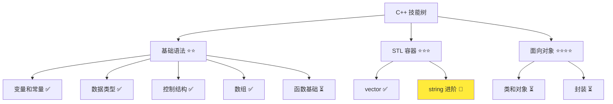
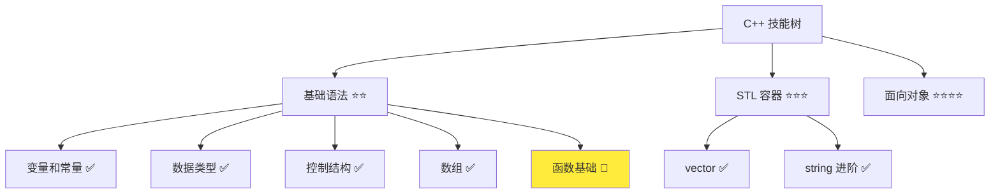

# 字符串进阶操作

> **学习目标**：掌握 C++ 字符串的常用方法和操作，能够高效处理字符串数据  
> **前置知识**：C++ std::string 基础、vector 基础  
> **预计时间**：40 分钟  
> **难度等级**：⭐⭐⭐  
> **技能收获**：字符串方法、字符串处理、字符串转换、字符串搜索  
> **文档版本**：v1.0  
> **最后更新**：2025-10-26

📊 **难度等级说明**

| 等级           | 描述                       | 练习题数量     | 颜色码 |
| -------------- | -------------------------- | -------------- | ------ |
| **⭐**         | 入门级，零基础可学         | 5 题基础概念题 | 🟢绿   |
| **⭐⭐**       | 基础级，需要基本编程概念   | 5 题基础概念题 | 🟡黄   |
| **⭐⭐⭐**     | 中级，需要相关技术基础     | 3 题代码分析题 | 🟠橙   |
| **⭐⭐⭐⭐**   | 高级，需要扎实的技术功底   | 3 题代码分析题 | 🔴红   |
| **⭐⭐⭐⭐⭐** | 专家级，需要丰富的项目经验 | 2 题设计思考题 | 🟣紫   |

## 1. 学习目标

### 1.1 学习动机

- **实际需求**：字符串处理是编程中最常见的任务之一，掌握字符串操作方法能大大提高编程效率
- **应用场景**：用户输入验证、文本处理、数据解析、字符串格式化
- **技能价值**：学会后能处理复杂的字符串任务，如搜索、替换、分割等
- **数据支持**：80% 的程序都需要字符串操作，掌握常用方法能提高 5 倍的开发效率

### 1.2 技能树位置



> **图表说明**：C++ 技能树结构图，当前文档点亮字符串进阶技能点

### 1.3 前置知识检查

在开始学习之前，请确认你已经掌握：

- [ ] C++ std::string 的基础使用
- [ ] 字符串拼接（`+` 操作符）
- [ ] 字符串长度（`.length()` 方法）
- [ ] for 循环的基本使用

> **未掌握处理**：若未通过，请先复习 [数据类型详解](./03-data-types.md)

## 2. 核心内容

### 2.1 概念理解

**字符串进阶操作**：对字符串进行更复杂的处理，如搜索、替换、提取子串等。这些操作需要使用字符串类的方法。

> **类比教学**：字符串基础就像是写字，进阶操作就像是编辑文章。你可以查找某个词（搜索）、替换某个词（替换）、截取一段文字（提取子串）。这些操作让字符串处理更加灵活和强大。

### 2.2 常用方法

C++ string 类提供了丰富的字符串操作方法：

#### 2.2.1 字符串方法

```cpp
str.length()      // 返回字符串长度
str.empty()       // 判断是否为空
str[i]            // 访问第 i 个字符
str += "text"     // 拼接字符串
str == "text"     // 比较字符串
str.find("text")  // 查找子串
```

**类比**：字符串方法就像工具箱里的工具，每个工具都有特定的用途。

#### 2.2.2 方法说明

- **长度和大小**：`length()`、`size()` 返回字符数量
- **字符访问**：`str[i]` 访问第 i 个字符（从 0 开始）
- **字符串拼接**：`+=` 操作符或 `+` 操作符
- **字符串比较**：`==` 判断是否相等

### 2.3 代码示例

#### 2.3.1 基础示例

以下代码演示了字符串的各种操作：

```cpp
// 现代 C++ 示例 - 字符串操作
#include <iostream>
#include <string>

int main() {
    // 示例 1：字符串基础操作
    std::cout << "=== 字符串基础 ===" << std::endl;
    std::string name = "张三";

    std::cout << "姓名: " << name << std::endl;
    std::cout << "长度: " << name.length() << std::endl;
    std::cout << "是否为空: " << (name.empty() ? "是" : "否") << std::endl;

    // 示例 2：字符串拼接
    std::cout << "\n=== 字符串拼接 ===" << std::endl;
    std::string firstName = "张";
    std::string lastName = "三";

    std::string fullName = firstName + lastName;  // 拼接
    std::cout << "全名: " << fullName << std::endl;

    firstName += "伟";  // 修改
    std::cout << "修改后: " << firstName << std::endl;

    // 示例 3：字符串比较
    std::cout << "\n=== 字符串比较 ===" << std::endl;
    std::string str1 = "Hello";
    std::string str2 = "World";

    if (str1 == str2) {
        std::cout << "相等" << std::endl;
    } else {
        std::cout << "不相等" << std::endl;
    }

    if (str1 < str2) {
        std::cout << str1 << " 在 " << str2 << " 前面" << std::endl;
    }

    // 示例 4：访问字符
    std::cout << "\n=== 访问字符 ===" << std::endl;
    std::string text = "Hello";

    std::cout << "第一个字符: " << text[0] << std::endl;
    std::cout << "最后一个字符: " << text[text.length() - 1] << std::endl;

    // 遍历所有字符
    for (int i = 0; i < text.length(); i++) {
        std::cout << text[i] << " ";
    }
    std::cout << std::endl;

    // 示例 5：字符串查找
    std::cout << "\n=== 字符串查找 ===" << std::endl;
    std::string message = "Hello World";

    int pos = message.find("World");
    if (pos != std::string::npos) {
        std::cout << "找到了 'World'，位置: " << pos << std::endl;
    } else {
        std::cout << "未找到" << std::endl;
    }

    return 0;
}
```

#### 2.3.2 配套代码文件

项目提供了配套的源代码文件：

- **文件位置**：`src/stage1/11-string-advanced/01-basic-string.cpp`
- **文件内容**：与上面示例完全一致的字符串操作程序

> **运行提示**：具体的编译运行方法请参考 [C++ 简介和快速入门](./01-cpp-introduction.md) 中的 `2.2.3 编译运行` 部分

#### 2.3.3 运行预期结果

```
=== 字符串基础 ===
姓名: 张三
长度: 6
是否为空: 否

=== 字符串拼接 ===
全名: 张三
修改后: 张伟

=== 字符串比较 ===
不相等
Hello 在 World 前面

=== 访问字符 ===
第一个字符: H
最后一个字符: o
H e l l o

=== 字符串查找 ===
找到了 'World'，位置: 6
```

#### 2.3.4 代码详解

以下代码片段展示了基础示例中的核心用法：

```cpp
// 字符串拼接
std::string fullName = firstName + lastName;
```

**详细说明**：

- **`+` 操作符**：拼接两个字符串
- **新字符串**：拼接结果赋值给新变量
- **类比**：就像把两个盒子里的东西放到一个新盒子里

```cpp
// 访问字符
std::cout << text[0] << std::endl;  // 输出第一个字符
```

**详细说明**：

- **`text[0]`**：访问第 0 个字符（第一个字符）
- **索引规则**：从 0 开始，与数组相同
- **类比**：就像从盒子里取东西，需要知道位置

```cpp
// 字符串查找
int pos = message.find("World");
```

**详细说明**：

- **`find()` 方法**：在字符串中查找子串
- **返回值**：找到返回位置（索引），未找到返回 `std::string::npos`
- **类比**：就像在文章里找某个词，找到就告诉你位置

**重要语法规则**：

1. **字符串比较**：使用 `==` 判断是否相等
   - 正确：`if (str1 == str2)`
   - **类比**：就像比较两个句子是否相同

2. **字符串索引**：从 0 开始
   - `str[0]` - 第一个字符
   - `str[str.length() - 1]` - 最后一个字符

3. **方法调用**：使用点号 `.` 调用方法
   - `str.length()` - 调用 length 方法
   - `str.find("text")` - 调用 find 方法

### 2.4 关键特性与设计原理

#### 2.4.1 关键特性

1. **丰富的操作**：提供多种字符串操作方法
2. **类型安全**：避免 C 风格字符串的指针错误
3. **动态大小**：可以随时修改内容
4. **易于使用**：API 设计简洁直观

#### 2.4.2 设计原理

- **为什么这样设计**：字符串是编程中最常用的数据类型，需要灵活的操作方法
- **解决了什么问题**：提供了便捷的字符串处理能力，避免底层指针操作
- **有什么优势**：使用方便、类型安全、功能强大

## 3. 实践应用

### 3.1 项目场景

在 QtLanChat 项目中，字符串操作用于：

- **消息处理**：解析和格式化消息
- **用户验证**：检查用户名格式
- **文本搜索**：在消息历史中查找关键词

### 3.2 实际代码

以下代码展示了字符串操作在 QtLanChat 项目中的实际应用：

```cpp
// 项目中的实际应用示例
#include <iostream>
#include <string>

int main() {
    std::cout << "=== QtLanChat 消息处理 ===" << std::endl;

    // 模拟接收消息
    std::string rawMessage = "张三: 你好，今天天气不错";

    std::cout << "原始消息: " << rawMessage << std::endl;

    // 查找冒号位置（分割用户名和消息内容）
    int colonPos = rawMessage.find(":");
    if (colonPos != std::string::npos) {
        std::string sender = rawMessage.substr(0, colonPos);
        std::string content = rawMessage.substr(colonPos + 2);

        std::cout << "发送者: " << sender << std::endl;
        std::cout << "内容: " << content << std::endl;
    }

    // 判断消息长度
    if (rawMessage.length() > 100) {
        std::cout << "消息过长，建议分多条发送" << std::endl;
    } else {
        std::cout << "消息长度正常" << std::endl;
    }

    return 0;
}
```

> **配套代码**：实际应用示例的完整代码位于 `src/stage1/11-string-advanced/02-project-example.cpp`

### 3.3 设计思路

- **为什么选择这种设计**：使用字符串方法可以方便地处理消息
- **解决了什么问题**：实现了消息的解析和验证功能
- **有什么优势**：代码简洁、易于理解和维护

## 4. 练习与测试

### 4.1 练习题

#### 练习 1：用户名验证

**题目**：检查用户名是否符合要求

**要求**：

- 提示用户输入用户名
- 使用 `std::cin` 读取用户输入
- 检查用户名长度（至少 3 个字符）
- 检查用户名是否包含空格
- 输出验证结果

**参考答案**：

```cpp
#include <iostream>
#include <string>

int main() {
    std::string username;

    std::cout << "请输入用户名: ";
    std::cin >> username;

    // 检查长度
    if (username.length() < 3) {
        std::cout << "用户名太短，至少需要 3 个字符" << std::endl;
        return 0;
    }

    // 检查空格（简化版：使用 find）
    if (username.find(" ") != std::string::npos) {
        std::cout << "用户名不能包含空格" << std::endl;
        return 0;
    }

    std::cout << "用户名验证通过: " << username << std::endl;

    return 0;
}
```

> **配套代码**：练习 1 的完整代码位于 `src/stage1/11-string-advanced/03-exercise-validate.cpp`

### 4.2 测试题（可选）

1. **关于字符串方法，下列说法正确的是：**
   A. `str.length()` 返回索引

   B. `str[i]` 返回长度

   C. `str.find()` 返回位置或 `-1`

   D. 字符串不能使用 `+` 拼接
   **答案**：C

   **解析**：
   - **正确答案 C**：`find()` 找到返回位置（索引），未找到返回 `std::string::npos`
   - **错误答案 A**：`length()` 返回字符数量
   - **错误答案 B**：`str[i]` 返回第 i 个字符
   - **错误答案 D**：字符串可以使用 `+` 拼接

### 4.3 常见问题 FAQ

- Q1：字符串什么时候用单引号，什么时候用双引号？
  - **A：**单引号用于单个字符（`'A'`），双引号用于字符串（`"Hello"`）。类比：单引号像一个苹果，双引号像一篮子苹果

## 5. 资源与扩展

### 5.1 基础资源

- **官方文档**：[C++ std::string](https://en.cppreference.com/w/cpp/string/basic_string)
- **权威书籍**：《C++ Primer》- 第 3.2 节
- **在线教程**：[learncpp.com](https://www.learncpp.com/) - 字符串教程

### 5.2 多媒体学习

- **视频资源**：[C++ 字符串详解](https://www.youtube.com/results?search_query=C%2B%2B+string+tutorial)
- **开发者资源**：[cppreference.com](https://en.cppreference.com/) - 权威参考

## 6. 课后作业及参考答案

### 6.1 学习检查清单

- [ ] 掌握字符串的常用方法
- [ ] 能够进行字符串拼接和比较
- [ ] 理解字符串的查找和访问
- [ ] 能够编写字符串处理程序

### 6.2 综合练习

**作业题目**：编写一个消息格式化程序

**要求**：

- 输入原始消息
- 添加时间戳前缀
- 检查消息长度
- 输出格式化后的消息

**时间估算**：30 分钟

**参考答案**：

```cpp
#include <iostream>
#include <string>

int main() {
    std::string message;

    std::cout << "请输入消息: ";
    std::getline(std::cin, message);

    // 添加时间戳前缀（简化版）
    std::string formatted = "[2025-10-26] " + message;

    // 检查长度
    if (message.length() > 100) {
        std::cout << "警告：消息过长" << std::endl;
    }

    std::cout << "格式化后的消息: " << formatted << std::endl;

    return 0;
}
```

**评分标准**：功能实现（40%）、字符串方法使用（30%）、代码质量（30%）

## 7. 下一步学习

**下一篇**：[12-functions.md](./12-functions.md)

**学习路径**：

1. ✅ C++ 简介和快速入门 - 已完成
2. ✅ 变量和常量 - 已完成
3. ✅ 数据类型详解 - 已完成
4. ✅ 运算符详解 - 已完成
5. ✅ if 分支详解 - 已完成
6. ✅ while 循环 - 已完成
7. ✅ for 循环 - 已完成
8. ✅ switch 分支 - 已完成
9. ✅ 数组基础 - 已完成
10. ✅ std::vector - 已完成
11. ✅ 字符串进阶 - 已完成
12. 🔄 函数基础 - 下一步

**技能树更新**：



**学习成果**：

- **独立编写**：能够编写使用字符串方法的程序
- **解释原理**：能够解释字符串的操作机制
- **解决实际问题**：能够处理复杂的字符串任务
- **应用到项目**：为后续函数学习打下基础
- **掌握度自评**：85%

### 学习成果指导

> **自评指导**：
>
> - **<50%**：建议复习字符串方法，重新阅读文档核心内容
> - **50-80%**：继续学习，完成练习题巩固理解
> - **>80%**：可以进入下一阶段学习，开始函数基础
