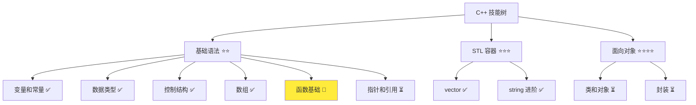
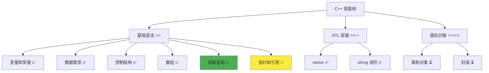

# 函数基础详解

> **学习目标**：掌握 C++ 函数的定义和调用，能够编写可复用的代码模块  
> **前置知识**：C++ 基础语法、变量和常量、数据类型、控制结构  
> **预计时间**：45 分钟  
> **难度等级**：⭐⭐  
> **技能收获**：函数定义、函数调用、参数传递、返回值、作用域  
> **文档版本**：v1.0  
> **最后更新**：2025-10-26

📊 **难度等级说明**

| 等级           | 描述                       | 练习题数量     | 颜色码 |
| -------------- | -------------------------- | -------------- | ------ |
| **⭐**         | 入门级，零基础可学         | 5 题基础概念题 | 🟢绿   |
| **⭐⭐**       | 基础级，需要基本编程概念   | 5 题基础概念题 | 🟡黄   |
| **⭐⭐⭐**     | 中级，需要相关技术基础     | 3 题代码分析题 | 🟠橙   |
| **⭐⭐⭐⭐**   | 高级，需要扎实的技术功底   | 3 题代码分析题 | 🔴红   |
| **⭐⭐⭐⭐⭐** | 专家级，需要丰富的项目经验 | 2 题设计思考题 | 🟣紫   |

## 1. 学习目标

### 1.1 学习动机

- **实际需求**：函数是代码复用的基础，可以将重复的逻辑封装成独立的功能模块，提高代码的可维护性和可读性
- **应用场景**：计算工具、数据处理、业务逻辑封装、代码组织
- **技能价值**：学会后能将复杂程序拆分成多个函数，代码结构更清晰，更容易维护
- **数据支持**：函数是编程的基础概念，几乎每个程序都会使用函数，掌握函数能提高 3-5 倍的开发效率

### 1.2 技能树位置



> **图表说明**：C++ 技能树结构图，当前文档点亮函数基础技能点

### 1.3 前置知识检查

在开始学习之前，请确认你已经掌握：

- [ ] C++ 变量和常量的声明与使用
- [ ] 基本数据类型（int、double、std::string）
- [ ] 控制结构（if、for、while）
- [ ] 数组和 vector 的基础使用

> **未掌握处理**：若未通过，请先复习 [控制结构详解](./07-for-loop.md) 和 [数组基础](./09-array-basics.md)

## 2. 核心内容

### 2.1 概念理解

**函数（Function）**：将一段代码封装成一个独立的功能模块，可以重复调用。函数就像一个"工具箱"，里面装着特定的工具（代码），需要用时调用它即可。

> **类比教学**：函数就像一台自动售货机。你投入参数（投入硬币），按下按钮（调用函数），它执行特定操作（执行代码），然后返回结果（输出商品）。同一个售货机可以反复使用，函数也可以反复调用，避免重复写代码。

### 2.2 基础语法

C++ 函数的基本结构：

#### 2.2.1 函数定义语法

```cpp
返回类型 函数名(参数列表) {
    // 函数体（代码）
    return 返回值;
}
```

**语法说明**：

- **返回类型**：函数返回的数据类型（如 `int`、`double`、`void`）
- **函数名**：函数的名称（推荐使用 `camelCase` 命名规范，如 `calculateSum`、`getUserName`）
- **参数列表**：输入参数，可以有多个，用逗号分隔
- **函数体**：具体的执行代码
- **return 语句**：返回结果（`void` 类型可以不返回）

**类比**：就像定义一台"机器"的说明书，说明输入什么（参数）、做什么（函数体）、输出什么（返回值）。

#### 2.2.2 函数调用语法

```cpp
函数名(实参列表);
```

**语法说明**：

- **函数名**：要调用的函数名称
- **实参列表**：传递给函数的实际参数值

**类比**：就像使用自动售货机，投入实际的硬币（实参），按下按钮（调用），得到商品（返回值）。

### 2.3 代码示例

#### 2.3.1 基础示例

以下代码演示了函数的各种使用场景：

```cpp
// 现代 C++ 示例 - 函数基础
#include <iostream>
#include <string>

// 示例 1：无参数、无返回值的函数
void greet() {
    std::cout << "Hello, World!" << std::endl;
}

// 示例 2：有参数、有返回值的函数
int add(int a, int b) {
    return a + b;
}

// 示例 3：计算两个数的最大值
int getMax(int a, int b) {
    if (a > b) {
        return a;
    } else {
        return b;
    }
}

// 示例 4：字符串处理函数
std::string formatMessage(std::string name, std::string message) {
    return name + ": " + message;
}

// 示例 5：无参数、有返回值的函数
int getTen() {
    return 10;
}

int main() {
    // 示例 1：调用无参数函数
    std::cout << "=== 无参数函数 ===" << std::endl;
    greet();
    greet();  // 可以重复调用

    // 示例 2：调用有参数函数
    std::cout << "\n=== 有参数函数 ===" << std::endl;
    int sum = add(5, 3);
    std::cout << "5 + 3 = " << sum << std::endl;

    int result = add(10, 20);
    std::cout << "10 + 20 = " << result << std::endl;

    // 示例 3：使用返回值
    std::cout << "\n=== 使用返回值 ===" << std::endl;
    int maximum = getMax(7, 12);
    std::cout << "getMax(7, 12) = " << maximum << std::endl;

    // 示例 4：字符串函数
    std::cout << "\n=== 字符串函数 ===" << std::endl;
    std::string formatted = formatMessage("张三", "你好");
    std::cout << formatted << std::endl;

    // 示例 5：直接使用返回值
    std::cout << "\n=== 直接使用返回值 ===" << std::endl;
    std::cout << "getTen() = " << getTen() << std::endl;

    return 0;
}
```

> **📌 重要提示**：函数必须在使用前定义，或者先声明后定义。上面的代码将函数定义放在 `main()` 之前，这样就可以在 `main()` 中调用它们。

#### 2.3.2 配套代码文件

项目提供了配套的源代码文件：

- **文件位置**：`src/stage1/12-functions/01-basic-functions.cpp`
- **文件内容**：与上面示例完全一致的函数程序

> **运行提示**：具体的编译运行方法请参考 [C++ 简介和快速入门](./01-cpp-introduction.md) 中的 `2.2.3 编译运行` 部分

#### 2.3.3 运行预期结果

```
=== 无参数函数 ===
Hello, World!
Hello, World!

=== 有参数函数 ===
5 + 3 = 8
10 + 20 = 30

=== 使用返回值 ===
getMax(7, 12) = 12

=== 字符串函数 ===
张三: 你好

=== 直接使用返回值 ===
getTen() = 10
```

#### 2.3.4 代码详解

以下代码片段展示了基础示例中的核心用法：

```cpp
// 函数定义（camelCase 命名规范）
int add(int a, int b) {
    return a + b;
}
```

**详细说明**：

- **函数名**：`add` - 函数的名字，用于调用
- **参数**：`int a, int b` - 两个整数参数，是函数的输入
- **返回类型**：`int` - 返回一个整数
- **函数体**：`return a + b;` - 执行加法并返回结果
- **参数说明**：`a` 和 `b` 是**形式参数**（形参），它们是函数内部的变量，接收调用时传入的值
- **类比**：就像定义一台加法器，输入两个数字，输出它们的和

```cpp
// 函数调用
int sum = add(5, 3);
```

**详细说明**：

- **调用过程**：
  1. `add(5, 3)` - 调用函数，传入实际参数 5 和 3
  2. 函数执行：`a = 5`, `b = 3`, 计算 `a + b = 8`
  3. `return 8` - 返回结果 8
  4. `int sum = 8` - 将返回值赋给变量 `sum`
- **实参 vs 形参**：
  - **实参**：调用时传入的实际值（如 `5`、`3`）
  - **形参**：函数定义中的参数变量（如 `a`、`b`）
- **类比**：就像使用加法器，投入 5 和 3（实参），得到 8（返回值）

```cpp
// void 函数（无返回值）
void greet() {
    std::cout << "Hello, World!" << std::endl;
}
```

**详细说明**：

- **`void`**：表示函数不返回任何值
- **用途**：用于执行某些操作（如输出、显示信息），不需要返回结果
- **调用**：`greet();` - 直接调用，不使用返回值
- **类比**：就像按下一个按钮，它会执行某个操作，但不产生可拿走的"商品"

```cpp
// 函数声明和定义分离
int multiply(int x, int y);  // 声明（函数原型）

int main() {
    int result = multiply(4, 5);  // 调用
    std::cout << result << std::endl;
    return 0;
}

// 定义（函数实现）
int multiply(int x, int y) {
    return x * y;
}
```

**详细说明**：

- **函数声明**：告诉编译器函数的存在，包括函数名、参数类型、返回类型
- **函数定义**：实现函数的具体代码
- **为什么分离**：允许在 `main()` 之前声明，在 `main()` 之后定义，提高代码可读性
- **类比**：就像先告诉别人"我有一台机器"，然后再详细说明这台机器怎么用

**重要语法规则**：

1. **函数命名**：
   - **推荐规范**：使用 `camelCase`（小驼峰命名法），第一个单词首字母小写，后续单词首字母大写
   - **命名建议**：使用动词开头的名称，清楚描述函数的功能
   - **示例**：`calculateSum()`、`printMessage()`、`getUserName()`
   - **说明**：这与 Qt 框架的命名风格一致（如 `QString::isEmpty()`），便于后续 Qt 开发
   - **注意**：C++ 标准库使用 `snake_case`（如 `std::getline()`），但自定义函数建议使用 `camelCase`
   - **类比**：函数名应该清楚描述函数做什么，就像给工具贴标签

2. **参数传递（值传递）**：函数调用时，实参的值会复制给形参
   - `add(5, 3)` 中，`a` 得到 5，`b` 得到 3
   - 这是"值传递"：传递的是值的副本，不是变量本身
   - 修改形参不会影响实参（后续会学习引用传递，可以修改实参）

3. **返回值**：
   - 使用 `return` 语句返回结果
   - `void` 函数可以不写 `return`，或写 `return;`
   - 函数遇到 `return` 会立即结束执行

4. **作用域**：函数内部的变量只在函数内有效
   - 形参和函数内定义的变量都是局部变量
   - 函数外无法访问函数内的变量

### 2.4 关键特性与设计原理

#### 2.4.1 关键特性

1. **代码复用**：同一段代码可以多次调用，避免重复
2. **模块化**：将复杂问题分解成多个函数，代码结构清晰
3. **易于维护**：修改功能只需修改一个函数
4. **可读性**：函数名描述了功能，代码更易理解

#### 2.4.2 设计原理

- **为什么这样设计**：函数是代码组织和复用的基础机制，将相关代码封装在一起
- **解决了什么问题**：避免了代码重复，提高了代码的可维护性和可读性
- **有什么优势**：代码更简洁、结构更清晰、易于测试和调试

## 3. 实践应用

### 3.1 项目场景

在 QtLanChat 项目中，函数用于：

- **消息格式化**：将原始消息格式化成标准格式
- **用户验证**：检查用户名和密码是否有效
- **数据计算**：计算在线用户数、消息统计等
- **代码组织**：将不同功能封装成独立函数，便于管理

### 3.2 实际代码

以下代码展示了函数在 QtLanChat 项目中的实际应用：

```cpp
// 项目中的实际应用示例
#include <iostream>
#include <string>

// 函数 1：验证用户名长度
bool isValidUsername(std::string username) {
    return username.length() >= 3 && username.length() <= 20;
}

// 函数 2：格式化消息
std::string formatMessage(std::string sender, std::string content) {
    return "[" + sender + "] " + content;
}

// 函数 3：检查消息是否为空
bool isEmptyMessage(std::string message) {
    // 方法1：使用 empty() 检查是否为空字符串
    if (message.empty()) {
        return true;
    }
    // 方法2：检查是否只包含空格（简化版：遍历检查）
    for (size_t i = 0; i < message.length(); i++) {
        if (message[i] != ' ') {
            return false;  // 发现非空格字符，不是空消息
        }
    }
    return true;  // 全是空格，视为空消息
}

// 函数 4：计算消息长度
int getMessageLength(std::string message) {
    return static_cast<int>(message.length());
}

int main() {
    std::cout << "=== QtLanChat 函数应用 ===" << std::endl;

    // 使用函数验证用户名
    std::string username = "张三";
    if (isValidUsername(username)) {
        std::cout << "用户名有效: " << username << std::endl;
    } else {
        std::cout << "用户名无效（长度应在 3-20 之间）" << std::endl;
    }

    // 使用函数格式化消息
    std::string formatted = formatMessage("张三", "你好，今天天气不错");
    std::cout << "\n格式化后的消息: " << formatted << std::endl;

    // 使用函数检查消息
    std::string message1 = "Hello";
    std::string message2 = "   ";
    std::cout << "\n消息检查:" << std::endl;
    std::cout << "message1 是否为空: " << (isEmptyMessage(message1) ? "是" : "否") << std::endl;
    std::cout << "message2 是否为空: " << (isEmptyMessage(message2) ? "是" : "否") << std::endl;

    // 使用函数计算长度
    std::cout << "\n消息长度: " << getMessageLength(formatted) << " 字节" << std::endl;

    return 0;
}
```

> **配套代码**：实际应用示例的完整代码位于 `src/stage1/12-functions/02-project-example.cpp`

### 3.3 设计思路

- **为什么选择这种设计**：使用函数将验证、格式化等逻辑封装，代码更清晰，便于复用
- **解决了什么问题**：实现了代码的模块化和复用，提高了可维护性
- **有什么优势**：每个函数职责单一，易于理解和测试

## 4. 练习与测试

### 4.1 练习题

#### 练习 1：编写计算函数

**题目**：编写一个函数计算三个数的平均值

**要求**：

- 函数名：`calculateAverage`
- 参数：三个 `double` 类型的数
- 返回值：平均值（`double` 类型）
- 在 `main()` 中调用并输出结果

**参考答案**：

```cpp
#include <iostream>

// 函数定义（遵循 camelCase 命名规范）
double calculateAverage(double a, double b, double c) {
    return (a + b + c) / 3.0;
}

int main() {
    double result = calculateAverage(10.0, 20.0, 30.0);
    std::cout << "平均值: " << result << std::endl;
    return 0;
}
```

> **配套代码**：练习 1 的完整代码位于 `src/stage1/12-functions/03-exercise-average.cpp`

#### 练习 2：编写判断函数

**题目**：编写一个函数判断一个数是否为偶数

**要求**：

- 函数名：`isEven`
- 参数：一个 `int` 类型的数
- 返回值：`bool` 类型（是偶数返回 `true`，否则返回 `false`）
- 在 `main()` 中测试多个数字

**参考答案**：

```cpp
#include <iostream>

bool isEven(int number) {
    return number % 2 == 0;
}

int main() {
    std::cout << "5 是偶数吗? " << (isEven(5) ? "是" : "否") << std::endl;
    std::cout << "8 是偶数吗? " << (isEven(8) ? "是" : "否") << std::endl;
    return 0;
}
```

> **配套代码**：练习 2 的完整代码位于 `src/stage1/12-functions/04-exercise-even.cpp`

#### 练习 3：编写字符串处理函数

**题目**：编写一个函数将字符串转换为大写（简化版：只处理小写字母）

**要求**：

- 函数名：`toUpperCase`
- 参数：一个 `std::string` 类型的字符串
- 返回值：转换后的字符串
- 只处理小写字母 'a'-'z'（转换为 'A'-'Z'）

**参考答案**：

```cpp
#include <iostream>
#include <string>

std::string toUpperCase(std::string str) {
    for (size_t i = 0; i < str.length(); i++) {
        if (str[i] >= 'a' && str[i] <= 'z') {
            str[i] = str[i] - 'a' + 'A';  // 转换为大写
        }
    }
    return str;
}

int main() {
    std::string text = "Hello World";
    std::string upper = toUpperCase(text);
    std::cout << "原字符串: " << text << std::endl;
    std::cout << "转换后: " << upper << std::endl;
    return 0;
}
```

> **配套代码**：练习 3 的完整代码位于 `src/stage1/12-functions/05-exercise-uppercase.cpp`

### 4.2 测试题（可选）

1. **关于函数，下列说法正确的是：**
   A. 函数必须有参数

   B. 函数必须有返回值

   C. `void` 函数不返回任何值

   D. 函数名可以包含空格
   **答案**：C

   **解析**：
   - **正确答案 C**：`void` 函数不返回任何值，只执行某些操作
   - **错误答案 A**：函数可以没有参数，如 `void greet()`
   - **错误答案 B**：`void` 函数不需要返回值
   - **错误答案 D**：函数名必须遵循标识符命名规则，不能包含空格

2. **以下代码的输出是什么？**

   ```cpp
   int add(int a, int b) {
       return a + b;
   }

   int main() {
       std::cout << add(2, 3) + add(4, 5) << std::endl;
       return 0;
   }
   ```

   A. 5

   B. 9

   C. 14

   D. 编译错误
   **答案**：C

   **解析**：
   - **正确答案 C**：`add(2, 3)` 返回 5，`add(4, 5)` 返回 9，5 + 9 = 14
   - **错误答案 A/B**：只计算了其中一个函数调用
   - **错误答案 D**：代码语法正确，可以编译运行

3. **关于函数参数，下列说法正确的是：**
   A. 实参和形参的名称必须相同

   B. 实参的数量必须等于形参的数量

   C. 函数可以修改实参的值（在当前示例范围内）

   D. 参数可以有默认值
   **答案**：B

   **解析**：
   - **正确答案 B**：调用函数时，实参的数量和类型必须与形参匹配
   - **错误答案 A**：实参和形参的名称可以不同，只要类型匹配
   - **错误答案 C**：在当前示例中（值传递），修改形参不会影响实参
   - **错误答案 D**：C++ 支持默认参数，但这是进阶内容

### 4.3 常见问题 FAQ

- Q1：函数必须在 `main()` 之前定义吗？
  - **A：**不一定。可以在 `main()` 之前声明，在 `main()` 之后定义。声明只需要函数原型：`返回类型 函数名(参数列表);`。类比：就像先告诉别人"我有一台机器"，然后再详细说明
- Q2：函数可以调用其他函数吗？
  - **A：**可以。函数可以调用其他函数，包括调用自己（递归，这是进阶内容）。类比：就像一台机器可以使用其他机器来完成工作
- Q3：函数可以没有参数吗？
  - **A：**可以。函数可以没有参数，参数列表为空：`void functionName()`。类比：就像一台不需要投入任何东西，按下按钮就能工作的机器
- Q4：`void` 函数可以写 `return` 吗？
  - **A：**可以。`void` 函数可以写 `return;`（不返回值）来提前结束函数。如果不写 `return`，函数执行完所有代码后自动结束
- Q5：函数内部的变量和函数外部的变量有关系吗？
  - **A：**函数内部的局部变量与函数外部的变量是独立的。即使名字相同，它们也是不同的变量。这是"作用域"的概念，后续会详细讲解。类比：就像两个不同房间里的同名物品，它们是不同的东西

## 5. 资源与扩展

### 5.1 基础资源

- **官方文档**：[C++ 函数](https://en.cppreference.com/w/cpp/language/functions)
- **权威书籍**：《C++ Primer》- 第 6.1 节
- **在线教程**：[learncpp.com](https://www.learncpp.com/) - 函数教程

### 5.2 多媒体学习

- **视频资源**：[C++ 函数详解](https://www.youtube.com/results?search_query=C%2B%2B+function+tutorial)
- **开发者资源**：[cppreference.com](https://en.cppreference.com/) - 权威参考

## 6. 课后作业及参考答案

### 6.1 学习检查清单

- [ ] 能够定义函数（函数名、参数、返回类型）
- [ ] 能够调用函数并接收返回值
- [ ] 理解实参和形参的区别
- [ ] 理解 `void` 函数的用途
- [ ] 能够编写简单的工具函数

### 6.2 综合练习

**作业题目**：编写一个简单的计算器程序

**要求**：

- 定义函数：`add`（加法）、`subtract`（减法）、`multiply`（乘法）、`divide`（除法）
- 在 `main()` 中调用这些函数
- 处理除零错误（除数不能为 0）
- 输出计算结果

**时间估算**：30 分钟

**参考答案**：

```cpp
#include <iostream>

int add(int a, int b) {
    return a + b;
}

int subtract(int a, int b) {
    return a - b;
}

int multiply(int a, int b) {
    return a * b;
}

double divide(int a, int b) {
    if (b == 0) {
        std::cout << "错误：除数不能为 0" << std::endl;
        return 0.0;
    }
    return static_cast<double>(a) / b;
}

int main() {
    int num1 = 10;
    int num2 = 3;

    std::cout << "=== 简单计算器 ===" << std::endl;
    std::cout << num1 << " + " << num2 << " = " << add(num1, num2) << std::endl;
    std::cout << num1 << " - " << num2 << " = " << subtract(num1, num2) << std::endl;
    std::cout << num1 << " * " << num2 << " = " << multiply(num1, num2) << std::endl;
    std::cout << num1 << " / " << num2 << " = " << divide(num1, num2) << std::endl;

    // 测试除零
    std::cout << "\n测试除零：" << std::endl;
    divide(10, 0);

    return 0;
}
```

**评分标准**：功能实现（40%）、函数定义正确（30%）、代码质量（30%）

## 7. 下一步学习

**下一篇**：[13-pointers-references.md](./13-pointers-references.md)

**学习路径**：

1. ✅ C++ 简介和快速入门 - 已完成
2. ✅ 变量和常量 - 已完成
3. ✅ 数据类型详解 - 已完成
4. ✅ 运算符详解 - 已完成
5. ✅ if 分支详解 - 已完成
6. ✅ while 循环 - 已完成
7. ✅ for 循环 - 已完成
8. ✅ switch 分支 - 已完成
9. ✅ 数组基础 - 已完成
10. ✅ std::vector - 已完成
11. ✅ 字符串进阶 - 已完成
12. ✅ 函数基础 - 已完成
13. 🔄 指针和引用 - 下一步

**技能树更新**：



**学习成果**：

- **独立编写**：能够编写和使用函数
- **解释原理**：能够解释函数的作用和调用过程
- **解决实际问题**：能够将代码模块化，提高代码质量
- **应用到项目**：为后续高级特性学习打下基础
- **掌握度自评**：85%

### 学习成果指导

> **自评指导**：
>
> - **<50%**：建议复习函数基础，重新阅读文档核心内容
> - **50-80%**：继续学习，完成练习题巩固理解
> - **>80%**：可以进入下一阶段学习，开始指针和引用

---

**文档质量检查**：

- [ ] 学习目标明确且可验证
- [ ] 代码示例可运行
- [ ] 练习题有答案
- [ ] 技能收获明确
- [ ] 抽象概念配有生活化比喻
- [ ] 比喻体系一致，避免概念混乱
- [ ] 文档长度符合难度等级要求
