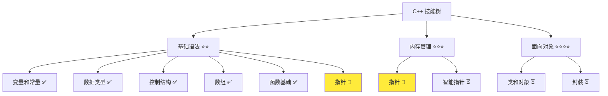
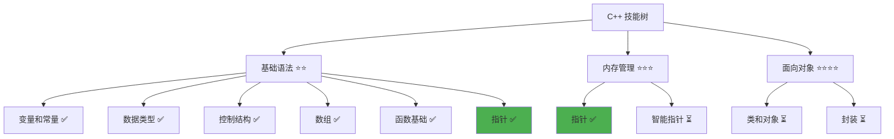

# 指针详解

> **学习目标**：掌握 C++ 指针的概念与使用，理解内存模型和指针操作  
> **前置知识**：C++ 函数基础、变量和常量、数据类型  
> **预计时间**：45 分钟  
> **难度等级**：⭐⭐⭐  
> **技能收获**：指针操作、内存地址、指针传递、动态内存基础  
> **文档版本**：v1.0  
> **最后更新**：2025-10-26

📊 **难度等级说明**

| 等级           | 描述                       | 练习题数量     | 颜色码 |
| -------------- | -------------------------- | -------------- | ------ |
| **⭐**         | 入门级，零基础可学         | 5 题基础概念题 | 🟢绿   |
| **⭐⭐**       | 基础级，需要基本编程概念   | 5 题基础概念题 | 🟡黄   |
| **⭐⭐⭐**     | 中级，需要相关技术基础     | 3 题代码分析题 | 🟠橙   |
| **⭐⭐⭐⭐**   | 高级，需要扎实的技术功底   | 3 题代码分析题 | 🔴红   |
| **⭐⭐⭐⭐⭐** | 专家级，需要丰富的项目经验 | 2 题设计思考题 | 🟣紫   |

## 1. 学习目标

### 1.1 学习动机

- **实际需求**：指针是 C++ 的核心特性，理解指针对掌握内存管理和高效编程至关重要
- **应用场景**：函数参数传递、动态内存分配、数据结构实现、底层系统编程
- **技能价值**：学会后能编写更高效的代码，理解 C++ 内存模型，为后续内存管理和数据结构学习打基础
- **数据支持**：指针是 C++ 区别于其他高级语言的重要特性，掌握指针能深入理解程序的内存布局

### 1.2 技能树位置



> **图表说明**：C++ 技能树结构图，当前文档点亮指针技能点

### 1.3 前置知识检查

在开始学习之前，请确认你已经掌握：

- [ ] C++ 变量和常量的声明与使用
- [ ] 基本数据类型（int、double、std::string）
- [ ] 函数的定义和调用
- [ ] 值传递的概念（函数参数传递）

> **未掌握处理**：若未通过，请先复习 [函数基础详解](./12-functions.md) 和 [变量和常量](./02-variables-constants.md)

## 2. 核心内容

### 2.1 概念理解

**指针（Pointer）**：存储变量内存地址的变量。指针就像"地址标签"，指向内存中的某个位置，可以通过指针访问或修改该位置的值。

> **类比教学**：
>
> - **指针**：就像门牌号。变量是房子，指针是门牌号（地址）。你可以通过门牌号找到房子，也可以通过门牌号修改房子里的东西。但门牌号本身不是房子，只是一个地址标识。
> - **内存地址**：每个变量在内存中都有一个唯一的地址，就像每个房子都有一个唯一的门牌号
> - **解引用**：通过指针访问值，就像通过门牌号找到房子并查看里面的东西

### 2.2 基础语法

#### 2.2.1 指针声明

**指针声明语法**：

```cpp
数据类型* 指针变量名;
// 或者
数据类型 *指针变量名;
```

**语法说明**：

- `数据类型*`：表示指向该类型数据的指针
- `*`：声明时表示"这是指针类型"
- **推荐风格**：使用 `int* ptr` 而不是 `int *ptr`，强调类型是指针

#### 2.2.2 获取地址

**使用 `&` 操作符获取变量的地址**：

```cpp
int num = 42;
int* ptr = &num;  // ptr 存储 num 的地址
```

**语法说明**：

- `&`：取地址操作符，获取变量的内存地址
- `&num`：返回变量 `num` 在内存中的地址
- **类比**：`&` 像问"这个房子在哪里"，得到的是门牌号

#### 2.2.3 解引用

**使用 `*` 操作符通过指针访问值**：

```cpp
*指针变量名 = 值;           // 修改
int value = *指针变量名;    // 读取
```

**语法说明**：

- `*`：解引用操作符（当用于指针变量时），获取指针指向的值
- `*ptr`：访问 `ptr` 指向的变量的值
- **类比**：`*` 像"去这个地址看看"，找到房子并查看或修改里面的东西

**重要提示**：

- 声明时的 `*` 表示类型，使用时的 `*` 表示解引用
- `int* ptr` - 声明：`ptr` 是指向 `int` 的指针
- `*ptr = 10` - 使用：将 10 赋给 `ptr` 指向的变量

### 2.3 代码示例

#### 2.3.1 基础示例

以下代码演示了指针的基本使用方法：

```cpp
// 现代 C++ 示例 - 指针基础
#include <iostream>

int main() {
    // 1. 指针声明和初始化
    int num = 42;
    int* ptr = &num;  // ptr 存储 num 的地址

    std::cout << "=== 指针基础 ===" << std::endl;
    std::cout << "num 的值: " << num << std::endl;
    std::cout << "num 的地址: " << &num << std::endl;
    std::cout << "ptr 的值（地址）: " << ptr << std::endl;
    std::cout << "ptr 指向的值: " << *ptr << std::endl;

    // 2. 通过指针修改值
    *ptr = 100;
    std::cout << "\n通过指针修改后：" << std::endl;
    std::cout << "num 的值: " << num << std::endl;
    std::cout << "*ptr 的值: " << *ptr << std::endl;

    // 3. 指针可以重新指向其他变量
    int num2 = 200;
    ptr = &num2;  // ptr 现在指向 num2
    std::cout << "\n指针重新指向 num2：" << std::endl;
    std::cout << "num 的值: " << num << std::endl;
    std::cout << "num2 的值: " << num2 << std::endl;
    std::cout << "*ptr 的值: " << *ptr << std::endl;

    // 4. 空指针
    int* nullPtr = nullptr;  // 空指针，不指向任何对象
    std::cout << "\n空指针：" << std::endl;
    std::cout << "nullPtr 的值: " << nullPtr << std::endl;
    // *nullPtr = 10;  // 危险！不能解引用空指针

    return 0;
}
```

#### 2.3.2 配套代码文件

项目提供了配套的源代码文件：

- **文件位置**：`src/stage1/13-pointers/01-basic-pointers.cpp`
- **文件内容**：与上面示例完全一致的指针程序

> **运行提示**：具体的编译运行方法请参考 [C++ 简介和快速入门](./01-cpp-introduction.md) 中的 `2.2.3 编译运行` 部分

#### 2.3.3 运行预期结果

```
=== 指针基础 ===
num 的值: 42
num 的地址: 0x7ffee1234560
ptr 的值（地址）: 0x7ffee1234560
ptr 指向的值: 42

通过指针修改后：
num 的值: 100
*ptr 的值: 100

指针重新指向 num2：
num 的值: 100
num2 的值: 200
*ptr 的值: 200

空指针：
nullPtr 的值: 0x0
```

> **注意**：实际的内存地址会因系统而异，但 `num` 和 `ptr` 的值应该相同。

#### 2.3.4 代码详解

以下代码片段展示了基础示例中的核心用法：

```cpp
int num = 42;
int* ptr = &num;  // ptr 存储 num 的地址
```

**详细说明**：

- `int num = 42;`：创建一个整型变量，值为 42，存储在内存的某个地址
- `int* ptr`：声明一个指向整数的指针变量
- `&num`：获取变量 `num` 的内存地址
- `ptr = &num`：将 `num` 的地址赋给指针 `ptr`
- **类比**：`num` 是房子（存储值 42），`&num` 是门牌号（地址），`ptr` 是记录门牌号的标签

```cpp
*ptr = 100;  // 通过指针修改值
```

**详细说明**：

- `*ptr`：解引用操作，访问指针指向的值
- `*ptr = 100;`：将 100 赋给 `ptr` 指向的变量（即 `num`）
- 此时 `num` 的值变为 100
- **类比**：通过门牌号找到房子，把房子里的东西换成 100

```cpp
int* nullPtr = nullptr;  // 空指针
```

**详细说明**：

- `nullptr`：C++11 引入的空指针字面量，表示指针不指向任何对象
- 空指针的值通常是 `0x0`（十六进制 0）
- 解引用空指针会导致程序崩溃
- **类比**：空指针就像一个不存在的门牌号，无法找到对应的房子

### 2.4 指针在函数中的使用

#### 2.4.1 值传递 vs 指针传递

**值传递**（之前学过的）：

```cpp
void swapByValue(int a, int b) {
    int temp = a;
    a = b;
    b = temp;
    // 交换的是形参，不影响实参
}

int main() {
    int x = 10, y = 20;
    swapByValue(x, y);
    std::cout << x << " " << y << std::endl;  // 输出: 10 20（未交换）
    return 0;
}
```

**指针传递**：

```cpp
void swapByPointer(int* a, int* b) {
    int temp = *a;  // 通过指针读取 a 指向的值
    *a = *b;        // 通过指针修改 a 指向的值
    *b = temp;      // 通过指针修改 b 指向的值
    // 通过指针修改实参的值
}

int main() {
    int x = 10, y = 20;
    swapByPointer(&x, &y);  // 传递地址
    std::cout << x << " " << y << std::endl;  // 输出: 20 10（已交换）
    return 0;
}
```

**详细说明**：

- **指针传递**：传递的是地址，函数可以通过指针修改实参的值
- 调用时需要传递变量的地址（`&x`、`&y`）
- 函数内部需要通过解引用（`*a`、`*b`）访问和修改值
- **类比**：给文件地址，可以通过地址找到原件并修改

**对比总结**：

| 传递方式 | 传递内容 | 能否修改实参 | 语法复杂度 |
| -------- | -------- | ------------ | ---------- |
| 值传递   | 值的副本 | 否           | 简单       |
| 指针传递 | 地址     | 是           | 中等       |

### 2.5 关键特性与设计原理

#### 2.5.1 关键特性

1. **直接内存访问**：指针提供了直接访问内存的能力
2. **修改函数参数**：通过指针，函数可以修改传入的实参
3. **灵活性强**：指针可以重新指向不同的变量
4. **支持空值**：指针可以为 `nullptr`，表示不指向任何对象

#### 2.5.2 设计原理

- **为什么这样设计**：指针提供了直接操作内存和高效传递参数的方式
- **解决了什么问题**：允许函数修改实参，提供了灵活的内存操作能力
- **有什么优势**：高效、灵活、底层控制能力强

### 2.6 常见陷阱和注意事项

#### 2.6.1 指针常见错误

**错误 1：未初始化的指针**

```cpp
int* ptr;                   // 危险！未初始化
*ptr = 10;                  // 未定义行为，可能导致程序崩溃
```

**正确做法**：

```cpp
int* ptr = nullptr;         // 初始化为空指针
if (ptr != nullptr) {
    *ptr = 10;
}
```

**错误 2：悬空指针（野指针）**

```cpp
int* ptr = new int(10);     // 动态分配内存（将在内存管理章节详细讲解）
delete ptr;                 // 释放内存
*ptr = 20;                  // 危险！ptr 指向的内存已被释放
```

**正确做法**：

```cpp
int* ptr = new int(10);     // 动态分配内存
delete ptr;                 // 释放内存
ptr = nullptr;              // 释放后立即置空
```

> **新知识点说明**：`new` 和 `delete` 是 C++ 中动态内存分配的操作符。这里为了演示悬空指针的概念，提前引入了这些操作符。动态内存管理将在后续章节详细讲解。

**错误 3：空指针解引用**

```cpp
int* ptr = nullptr;
*ptr = 10;                  // 危险！解引用空指针会导致程序崩溃
```

**正确做法**：

```cpp
int* ptr = nullptr;
if (ptr != nullptr) {       // 检查指针是否为空
    *ptr = 10;
}
```

**最佳实践**：

1. **始终初始化指针**：声明时初始化为 `nullptr`
2. **使用前检查**：解引用前检查指针是否为空
3. **释放后置空**：释放内存后立即将指针置为 `nullptr`
4. **避免悬空指针**：不要使用已释放内存的指针

## 3. 实践应用

### 3.1 项目场景

在 QtLanChat 项目中，指针用于：

- **可选参数**：函数参数可能为空时使用指针（如 `User* recipient = nullptr`）
- **查找函数**：在数组中查找元素，返回指向元素的指针
- **动态内存管理**：分配和管理动态内存（将在后续章节学习）
- **底层操作**：需要直接访问内存地址的场景

### 3.2 实际代码

以下代码展示了指针在 QtLanChat 项目中的实际应用：

```cpp
// 项目中的实际应用示例
#include <iostream>
#include <string>

// 用户信息结构（简化版）
struct User {
    std::string name;
    int age;
    bool isOnline;
};

// 函数 1：使用指针处理可选参数
void sendMessage(const std::string& sender, const std::string& content, User* recipient = nullptr) {
    std::cout << "[" << sender << "]: " << content << std::endl;
    if (recipient != nullptr) {  // 检查指针是否为空
        std::cout << "发送给: " << recipient->name << std::endl;
    } else {
        std::cout << "（广播消息）" << std::endl;
    }
}

// 函数 2：在数组中查找用户，返回指针
User* findUser(User users[], int size, const std::string& name) {
    for (int i = 0; i < size; i++) {
        if (users[i].name == name) {
            return &users[i];  // 返回指向用户的指针
        }
    }
    return nullptr;  // 未找到，返回空指针
}

// 函数 3：使用指针修改用户状态
void updateUserStatusByPointer(User* user, bool status) {
    if (user != nullptr) {  // 安全检查
        user->isOnline = status;
        std::cout << user->name << " 的状态已更新为: " << (status ? "在线" : "离线") << std::endl;
    }
}

int main() {
    std::cout << "=== QtLanChat 指针应用 ===" << std::endl;

    // 创建用户数组
    User users[3] = {
        {"张三", 25, true},
        {"李四", 30, false},
        {"王五", 28, true}
    };

    // 使用指针处理可选参数
    std::cout << "\n发送消息：" << std::endl;
    sendMessage("系统", "欢迎使用 QtLanChat", &users[0]);  // 发送给特定用户
    sendMessage("系统", "系统公告");  // 广播消息（recipient 为空指针）

    // 使用指针查找用户
    std::cout << "\n查找用户：" << std::endl;
    User* found = findUser(users, 3, "李四");
    if (found != nullptr) {
        std::cout << "找到用户: " << found->name << "，年龄: " << found->age << std::endl;
    } else {
        std::cout << "未找到用户" << std::endl;
    }

    // 使用指针修改用户状态
    std::cout << "\n更新状态：" << std::endl;
    updateUserStatusByPointer(found, true);

    return 0;
}
```

> **配套代码**：实际应用示例的完整代码位于 `src/stage1/13-pointers/02-project-example.cpp`
>
> **新知识点说明**：
>
> - `struct`（结构体）用于将多个相关数据组合在一起。这里为了演示指针的使用，提前引入了结构体概念。结构体将在后续章节详细讲解。
> - `->` 操作符：通过指针访问结构体成员，`ptr->name` 等价于 `(*ptr).name`

### 3.3 设计思路

- **为什么选择这种设计**：使用指针处理可选参数更灵活，查找函数返回指针可以避免复制，便于修改原数据
- **解决了什么问题**：提供了灵活的接口设计，支持可选参数，避免了数据复制
- **有什么优势**：高效、灵活、支持空值

## 4. 练习与测试

### 4.1 练习题

#### 练习 1：指针基础操作

**题目**：编写程序，使用指针完成以下操作

**要求**：

- 创建一个整型变量，值为 100
- 创建一个指针指向该变量
- 通过指针读取并输出该变量的值
- 通过指针将该变量的值修改为 200
- 输出修改后的值

**参考答案**：

```cpp
#include <iostream>

int main() {
    int num = 100;
    int* ptr = &num;

    std::cout << "通过指针读取的值: " << *ptr << std::endl;

    *ptr = 200;
    std::cout << "通过指针修改后的值: " << num << std::endl;

    return 0;
}
```

> **配套代码**：练习 1 的完整代码位于 `src/stage1/13-pointers/03-exercise-pointer-basic.cpp`

#### 练习 2：指针传递

**题目**：编写一个函数，使用指针参数将两个整数的值交换

**要求**：

- 函数名：`swap`
- 参数：两个整型指针
- 无返回值
- 在 `main()` 中测试

**参考答案**：

```cpp
#include <iostream>

void swap(int* a, int* b) {
    int temp = *a;
    *a = *b;
    *b = temp;
}

int main() {
    int x = 10, y = 20;
    std::cout << "交换前: x = " << x << ", y = " << y << std::endl;

    swap(&x, &y);  // 传递地址
    std::cout << "交换后: x = " << x << ", y = " << y << std::endl;

    return 0;
}
```

> **配套代码**：练习 2 的完整代码位于 `src/stage1/13-pointers/04-exercise-swap.cpp`

#### 练习 3：查找函数

**题目**：编写一个函数，在整数数组中查找指定值，返回指向该元素的指针

**要求**：

- 函数名：`findValue`
- 参数：整数数组、数组大小、要查找的值
- 返回值：指向找到元素的指针，未找到返回 `nullptr`
- 在 `main()` 中测试查找成功和失败的情况

**参考答案**：

```cpp
#include <iostream>

int* findValue(int arr[], int size, int value) {
    for (int i = 0; i < size; i++) {
        if (arr[i] == value) {
            return &arr[i];  // 返回指向元素的指针
        }
    }
    return nullptr;  // 未找到
}

int main() {
    int numbers[5] = {10, 20, 30, 40, 50};

    int* found = findValue(numbers, 5, 30);
    if (found != nullptr) {
        std::cout << "找到值: " << *found << std::endl;
        std::cout << "位置: " << (found - numbers) << std::endl;  // 指针算术
    } else {
        std::cout << "未找到" << std::endl;
    }

    return 0;
}
```

> **配套代码**：练习 3 的完整代码位于 `src/stage1/13-pointers/05-exercise-find.cpp`

### 4.2 测试题（可选）

1. **关于指针，下列说法正确的是：**
   A. 指针必须在声明时初始化

   B. 指针可以为空（`nullptr`）

   C. 指针不能重新指向其他变量

   D. 解引用空指针是安全的
   **答案**：B

   **解析**：
   - **正确答案 B**：指针可以为 `nullptr`（空指针），表示不指向任何对象
   - **错误答案 A**：指针可以不初始化（但不推荐，危险）
   - **错误答案 C**：指针可以重新指向其他变量
   - **错误答案 D**：解引用空指针会导致程序崩溃

2. **以下代码的输出是什么？**

   ```cpp
   int a = 10;
   int* p = &a;
   *p = 20;
   std::cout << a << std::endl;
   ```

   A. 10

   B. 20

   C. 编译错误

   D. 运行时错误
   **答案**：B

   **解析**：
   - **正确答案 B**：`*p = 20` 通过指针修改了 `a` 的值，所以 `a` 变为 20
   - **错误答案 A**：值已被修改
   - **错误答案 C/D**：代码语法正确，可以运行

3. **以下代码有什么问题？**

   ```cpp
   int* ptr;
   *ptr = 10;
   ```

   A. 没有问题

   B. 指针未初始化，可能导致未定义行为

   C. 语法错误

   D. 逻辑错误
   **答案**：B

   **解析**：
   - **正确答案 B**：指针 `ptr` 未初始化，解引用未初始化的指针是未定义行为，可能导致程序崩溃
   - **错误答案 A/C/D**：语法正确，但逻辑危险

### 4.3 常见问题 FAQ

- Q1：`int* p` 和 `int *p` 有什么区别？
  - **A：**没有区别，只是风格不同。`int* p` 强调类型是指针，`int *p` 强调变量是指针。推荐使用 `int* p`。

- Q2：指针占用多少内存？
  - **A：**指针通常占用 8 字节（64 位系统）或 4 字节（32 位系统），存储的是内存地址。

- Q3：可以有两个指针指向同一个变量吗？
  - **A：**可以。多个指针可以指向同一个变量，通过任何一个指针修改都会影响原变量。

- Q4：指针可以指向指针吗？
  - **A：**可以。可以有指针的指针（`int**`），用于更复杂的数据结构，这是进阶内容。

- Q5：什么时候使用指针，什么时候使用其他方式？
  - **A：**需要表示"可能为空"、需要重新绑定、需要底层内存操作时使用指针。对于一般参数传递，更推荐使用引用（将在下一章学习）。

## 5. 资源与扩展

### 5.1 基础资源

- **官方文档**：[C++ 指针](https://en.cppreference.com/w/cpp/language/pointer)
- **权威书籍**：《C++ Primer》- 第 2.3 节
- **在线教程**：[learncpp.com](https://www.learncpp.com/) - 指针教程

### 5.2 多媒体学习

- **视频资源**：[C++ 指针详解](https://www.youtube.com/results?search_query=C%2B%2B+pointer+tutorial)
- **开发者资源**：[cppreference.com](https://en.cppreference.com/) - 权威参考

## 6. 课后作业及参考答案

### 6.1 学习检查清单

- [ ] 能够声明和初始化指针
- [ ] 能够使用 `&` 获取变量地址
- [ ] 能够使用 `*` 解引用指针
- [ ] 理解空指针的概念和使用
- [ ] 能够使用指针传递参数，修改实参
- [ ] 理解指针的常见陷阱和注意事项

### 6.2 综合练习

**作业题目**：编写一个简单的数组操作程序

**要求**：

- 创建一个包含 5 个整数的数组
- 编写函数 `findMax`（接收数组和大小，返回指向最大值的指针）
- 编写函数 `updateValue`（接收指向数组元素的指针和新值，修改该元素）
- 在 `main()` 中测试所有功能

**时间估算**：30 分钟

**参考答案**：

```cpp
#include <iostream>

int* findMax(int arr[], int size) {
    if (size == 0) return nullptr;

    int* maxPtr = &arr[0];
    for (int i = 1; i < size; i++) {
        if (arr[i] > *maxPtr) {
            maxPtr = &arr[i];
        }
    }
    return maxPtr;
}

void updateValue(int* ptr, int newValue) {
    if (ptr != nullptr) {
        *ptr = newValue;
    }
}

int main() {
    int numbers[5] = {10, 30, 20, 50, 40};

    std::cout << "=== 数组操作程序 ===" << std::endl;
    std::cout << "原始数组: ";
    for (int i = 0; i < 5; i++) {
        std::cout << numbers[i] << " ";
    }
    std::cout << std::endl;

    int* maxPtr = findMax(numbers, 5);
    if (maxPtr != nullptr) {
        std::cout << "最大值: " << *maxPtr << std::endl;
    }

    updateValue(&numbers[2], 100);
    std::cout << "更新后数组: ";
    for (int i = 0; i < 5; i++) {
        std::cout << numbers[i] << " ";
    }
    std::cout << std::endl;

    return 0;
}
```

**评分标准**：功能实现（40%）、指针使用正确（30%）、代码质量（30%）

## 7. 下一步学习

**下一篇**：[14-引用详解](./14-references.md)

> **学习建议**：建议先掌握指针的基础用法，然后再学习引用。理解指针有助于更好地理解引用与指针的区别和联系。

**学习路径**：

1. ✅ C++ 简介和快速入门 - 已完成
2. ✅ 变量和常量 - 已完成
3. ✅ 数据类型详解 - 已完成
4. ✅ 运算符详解 - 已完成
5. ✅ if 分支详解 - 已完成
6. ✅ while 循环 - 已完成
7. ✅ for 循环 - 已完成
8. ✅ switch 分支 - 已完成
9. ✅ 数组基础 - 已完成
10. ✅ std::vector - 已完成
11. ✅ 字符串进阶 - 已完成
12. ✅ 函数基础 - 已完成
13. ✅ 指针详解 - 已完成
14. 🔄 引用详解 - 下一步

**技能树更新**：



**学习成果**：

- **独立编写**：能够使用指针进行内存操作和参数传递
- **解释原理**：能够解释指针的概念和内存模型
- **解决实际问题**：能够编写使用指针的函数，处理可选参数和查找操作
- **应用到项目**：为后续引用学习和内存管理学习打下基础
- **掌握度自评**：80%

### 学习成果指导

> **自评指导**：
>
> - **<50%**：建议复习指针的基础概念，重新阅读文档核心内容
> - **50-80%**：继续学习，完成练习题巩固理解
> - **>80%**：可以进入下一阶段学习，开始引用详解

---

**文档质量检查**：

- [x] 学习目标明确且可验证
- [x] 代码示例可运行
- [x] 练习题有答案
- [x] 技能收获明确
- [x] 抽象概念配有生活化比喻
- [x] 比喻体系一致，避免概念混乱
- [x] 文档长度符合难度等级要求
