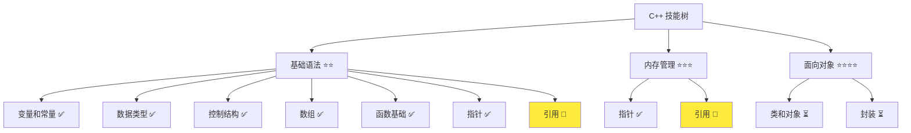
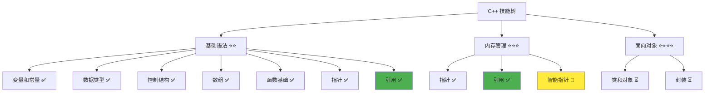

# 引用详解

> **学习目标**：掌握 C++ 引用的概念与使用，理解引用传递机制和应用场景  
> **前置知识**：C++ 函数基础、变量和常量、数据类型、指针基础  
> **预计时间**：45 分钟  
> **难度等级**：⭐⭐⭐  
> **技能收获**：引用传递、const 引用、参数传递优化、性能提升  
> **文档版本**：v1.0  
> **最后更新**：2025-10-26

📊 **难度等级说明**

| 等级           | 描述                       | 练习题数量     | 颜色码 |
| -------------- | -------------------------- | -------------- | ------ |
| **⭐**         | 入门级，零基础可学         | 5 题基础概念题 | 🟢绿   |
| **⭐⭐**       | 基础级，需要基本编程概念   | 5 题基础概念题 | 🟡黄   |
| **⭐⭐⭐**     | 中级，需要相关技术基础     | 3 题代码分析题 | 🟠橙   |
| **⭐⭐⭐⭐**   | 高级，需要扎实的技术功底   | 3 题代码分析题 | 🔴红   |
| **⭐⭐⭐⭐⭐** | 专家级，需要丰富的项目经验 | 2 题设计思考题 | 🟣紫   |

## 1. 学习目标

### 1.1 学习动机

- **实际需求**：引用是 C++ 的重要特性，理解引用对编写高效、安全的代码至关重要
- **应用场景**：函数参数传递、避免大对象复制、返回值优化、循环中的元素访问
- **技能价值**：学会后能编写更高效的代码，避免不必要的复制，提高程序性能
- **数据支持**：使用引用传递大对象可以提升 10-100 倍的性能（避免复制开销），是 C++ 高效编程的关键

### 1.2 技能树位置



> **图表说明**：C++ 技能树结构图，当前文档点亮引用技能点

### 1.3 前置知识检查

在开始学习之前，请确认你已经掌握：

- [ ] C++ 变量和常量的声明与使用
- [ ] 基本数据类型（int、double、std::string）
- [ ] 函数的定义和调用
- [ ] 值传递的概念（函数参数传递）
- [ ] 指针的基础概念（地址、解引用、空指针）

> **未掌握处理**：若未通过，请先复习 [函数基础详解](./12-functions.md) 和 [指针详解](./13-pointers.md)  
> **重要提示**：建议先学习指针，再学习引用。了解指针有助于更好地理解引用与指针的区别和联系。

## 2. 核心内容

### 2.1 概念理解

**引用（Reference）**：变量的别名，是已存在变量的另一个名字。引用不是新的变量，只是原变量的另一个名称，使用引用就是使用原变量。

> **类比教学**：
>
> - **引用**：就像同一个人的两个名字。比如"张三"和"小张"指的是同一个人，无论用哪个名字叫他，都是同一个人。引用也是同样的道理，它只是给变量起了另一个名字。
> - **与指针的区别**：指针像门牌号（地址），引用像同一个人的另一个名字。门牌号可以改变，但一个人的名字一旦确定就不能改变（引用不能重新绑定）。
> - **内存模型**：引用不占用额外的内存空间（编译器优化），它只是原变量的别名

### 2.2 基础语法

#### 2.2.1 引用声明

**引用声明语法**：

```cpp
数据类型& 引用变量名 = 原变量名;
```

**语法说明**：

- `数据类型&`：表示该类型的引用
- `&`：在引用声明中表示"这是引用类型"
- 引用必须在声明时初始化，不能先声明后初始化
- **类比**：引用就像给变量起了一个新名字，但这个新名字必须在声明时就确定指向哪个变量

#### 2.2.2 引用使用

**引用使用特点**：

```cpp
int value = 50;
int& ref = value;  // ref 是 value 的别名

ref = 200;         // 直接使用，无需解引用
// 等价于 value = 200;
```

**重要特性**：

- 引用必须在声明时初始化
- 引用不能重新绑定到其他变量
- 引用就是原变量的别名，操作引用就是操作原变量
- 引用不占用额外内存（编译器优化）
- **类比**：给同一个人起两个名字，"value" 和 "ref" 都指向同一个人

### 2.3 代码示例

#### 2.3.1 基础示例

以下代码演示了引用的基本使用方法：

```cpp
// 现代 C++ 示例 - 引用基础
#include <iostream>

int main() {
    // 1. 引用声明和初始化
    int value = 50;
    int& ref = value;  // ref 是 value 的别名

    std::cout << "=== 引用基础 ===" << std::endl;
    std::cout << "value 的值: " << value << std::endl;
    std::cout << "ref 的值: " << ref << std::endl;
    std::cout << "value 的地址: " << &value << std::endl;
    std::cout << "ref 的地址: " << &ref << std::endl;  // 地址相同！

    // 2. 通过引用修改值
    ref = 200;
    std::cout << "\n通过引用修改后：" << std::endl;
    std::cout << "value 的值: " << value << std::endl;
    std::cout << "ref 的值: " << ref << std::endl;

    // 3. 直接修改原变量，引用也会变化
    value = 300;
    std::cout << "\n直接修改 value 后：" << std::endl;
    std::cout << "value 的值: " << value << std::endl;
    std::cout << "ref 的值: " << ref << std::endl;

    // 4. 引用不能重新绑定
    int value2 = 100;
    // ref = value2;  // 这不是重新绑定！这是将 value2 的值赋给 value
    std::cout << "\n尝试'重新绑定'（实际是赋值）：" << std::endl;
    ref = value2;  // 等价于 value = value2;
    std::cout << "value 的值: " << value << std::endl;
    std::cout << "value2 的值: " << value2 << std::endl;
    std::cout << "ref 的地址仍然是 value 的地址: " << (&ref == &value ? "是" : "否") << std::endl;

    return 0;
}
```

#### 2.3.2 配套代码文件

项目提供了配套的源代码文件：

- **文件位置**：`src/stage1/14-references/01-basic-references.cpp`
- **文件内容**：与上面示例完全一致的引用程序

> **运行提示**：具体的编译运行方法请参考 [C++ 简介和快速入门](./01-cpp-introduction.md) 中的 `2.2.3 编译运行` 部分

#### 2.3.3 运行预期结果

```
=== 引用基础 ===
value 的值: 50
ref 的值: 50
value 的地址: 0x7ffee123455c
ref 的地址: 0x7ffee123455c

通过引用修改后：
value 的值: 200
ref 的值: 200

直接修改 value 后：
value 的值: 300
ref 的值: 300

尝试'重新绑定'（实际是赋值）：
value 的值: 100
value2 的值: 100
ref 的地址仍然是 value 的地址: 是
```

> **注意**：`value` 和 `ref` 的地址相同，说明它们是同一个变量。

#### 2.3.4 代码详解

以下代码片段展示了基础示例中的核心用法：

```cpp
int value = 50;
int& ref = value;  // ref 是 value 的别名
```

**详细说明**：

- `int value = 50;`：创建一个整型变量，值为 50
- `int& ref`：声明一个整型引用
- `ref = value`：将 `ref` 初始化为 `value` 的别名（必须在声明时完成）
- 此后 `ref` 和 `value` 指的是同一个变量
- `&ref` 和 `&value` 的地址相同
- **类比**：给同一个人起两个名字，"value" 和 "ref" 都指向同一个人

```cpp
ref = 200;  // 通过引用修改值
```

**详细说明**：

- `ref = 200;`：通过引用修改值，等价于 `value = 200;`
- 此时 `value` 和 `ref` 的值都变为 200
- **类比**：无论用哪个名字叫他，修改的都是同一个人

```cpp
int value2 = 100;
ref = value2;  // 这不是重新绑定！
```

**详细说明**：

- `ref = value2;`：这不是将 `ref` 重新绑定到 `value2`，而是将 `value2` 的值赋给 `ref` 指向的变量（即 `value`）
- `ref` 仍然是 `value` 的引用，不会变成 `value2` 的引用
- `value` 的值变为 100，`ref` 和 `value` 仍然是同一个变量
- **类比**：你不能改变一个人的名字指向另一个人，只能改变这个人的属性

### 2.4 const 引用

#### 2.4.1 const 引用概念

**const 引用**：只读引用，不能通过引用修改原变量，用于只读访问。

**语法**：

```cpp
const 数据类型& 引用变量名 = 原变量名;
```

**使用场景**：

- 传递大对象作为函数参数，只读访问
- 避免复制大对象的开销，同时保证数据安全
- 在函数中只读取参数，不修改参数

**示例**：

```cpp
void printString(const std::string& str) {  // const 引用，只读
    std::cout << str << std::endl;
    // str = "new";  // 错误！不能通过 const 引用修改
}

int main() {
    std::string text = "Hello";
    printString(text);  // 传递引用，避免复制
    return 0;
}
```

**详细说明**：

- `const std::string& str`：const 引用参数
- 函数内不能通过 `str` 修改原字符串
- 传递时避免复制整个字符串，提高性能
- **类比**：就像给文件起另一个名字，但只能读，不能写

#### 2.4.2 const 引用 vs 非 const 引用

**非 const 引用**：可以修改原变量

```cpp
void increment(int& num) {  // 非 const 引用，可修改
    num++;  // 可以修改
}
```

**const 引用**：只读访问

```cpp
void print(const int& num) {  // const 引用，只读
    std::cout << num << std::endl;
    // num++;  // 错误！不能修改
}
```

**选择原则**：

- 需要修改参数：使用非 const 引用
- 只需要读取参数：使用 const 引用（推荐）
- **最佳实践**：优先使用 const 引用，只有在需要修改时才使用非 const 引用

### 2.5 引用在函数中的使用

> **实际开发重点**：在实际开发中，**引用最常作为函数的形参使用**。通过引用传递参数，函数可以直接操作原始数据，避免数据复制，提高程序效率。这是引用在实际项目中最重要、最常见的应用场景。

#### 2.5.1 值传递 vs 引用传递

**值传递**（之前学过的）：

```cpp
void swapByValue(int a, int b) {
    int temp = a;
    a = b;
    b = temp;
    // 交换的是形参，不影响实参
}

int main() {
    int x = 10, y = 20;
    swapByValue(x, y);
    std::cout << x << " " << y << std::endl;  // 输出: 10 20（未交换）
    return 0;
}
```

**引用传递**（推荐方式）：

```cpp
void swapByReference(int& a, int& b) {
    int temp = a;  // 直接使用，无需解引用
    a = b;
    b = temp;
    // 直接操作原变量
}

int main() {
    int x = 10, y = 20;
    swapByReference(x, y);  // 传递变量本身（引用会自动处理）
    std::cout << x << " " << y << std::endl;  // 输出: 20 10（已交换）
    return 0;
}
```

**详细说明**：

- **引用传递**：传递的是别名，直接操作原变量，语法更简洁
- 调用时直接传递变量（不需要 `&`），编译器自动处理
- 函数内部直接使用，无需解引用
- **推荐**：优先使用引用传递，因为它更安全且语法更简洁

**对比总结**：

| 传递方式 | 传递内容 | 能否修改实参 | 语法复杂度 | 性能                 |
| -------- | -------- | ------------ | ---------- | -------------------- |
| 值传递   | 值的副本 | 否           | 简单       | 可能较慢（需要复制） |
| 引用传递 | 别名     | 是           | 简单       | 快（无需复制）       |

**类比**：

- **值传递**：复印文件，修改复印件不影响原件
- **引用传递**：给文件另一个名字，用这个名字修改就是修改原件

#### 2.5.2 const 引用传递（推荐）

**使用 const 引用传递大对象**：

```cpp
// 值传递：会复制整个字符串（性能差）
void printByValue(std::string str) {
    std::cout << str << std::endl;
}

// const 引用传递：不复制，只传递引用（性能好）
void printByReference(const std::string& str) {
    std::cout << str << std::endl;
}

int main() {
    std::string longText = "这是一个很长的字符串...";  // 假设很长

    printByValue(longText);      // 复制整个字符串，性能差
    printByReference(longText);  // 只传递引用，性能好，推荐

    return 0;
}
```

**性能对比**：

- 值传递：需要复制整个对象（大对象复制开销大）
- const 引用传递：只传递引用，不复制（性能好）
- **推荐**：对于所有非基本类型的参数，优先使用 const 引用传递

### 2.6 引用的应用场景

> **实际开发说明**：在实际开发中，引用主要用于**作为函数的形参**，让函数可以直接使用原始数据。以下场景都是基于这个核心应用展开的。

#### 2.6.1 场景 1：引用作为函数形参（最核心的应用）

**实际开发中的核心用法**：引用作为函数形参，让函数直接操作原始数据。

**为什么这是最重要的应用**：

1. **避免数据复制**：传递大型对象（如 `std::string`、`std::vector`、自定义结构体）时，值传递会复制整个对象，性能开销大。使用引用传递，函数直接访问原始数据，无需复制。
2. **允许修改原始数据**：当函数需要修改传入的参数时，使用非 const 引用可以直接修改原始数据，无需返回值。
3. **语法简洁安全**：相比指针，引用语法更简洁（无需解引用），更安全（不能为空），是函数参数传递的首选方式。

**实际开发中的典型用法**：

```cpp
#include <iostream>
#include <string>
#include <vector>

// 用法 1：const 引用参数 - 只读访问，避免复制（最常见）
void processUserData(const std::string& userName, const std::vector<int>& userScores) {
    // 函数可以直接使用原始数据，无需复制
    std::cout << "用户: " << userName << std::endl;
    std::cout << "分数: ";
    for (size_t i = 0; i < userScores.size(); i++) {  // 使用索引遍历
        std::cout << userScores[i] << " ";
    }
    std::cout << std::endl;
    // 不能修改 userName 和 userScores（const 保护）
}

// 用法 2：非 const 引用参数 - 需要修改原始数据
void updateUserScore(std::vector<int>& scores, int index, int newScore) {
    if (index >= 0 && index < scores.size()) {
        scores[index] = newScore;  // 直接修改原始数据
    }
}

// 用法 3：混合使用 - 有些参数只读，有些需要修改
void processAndUpdate(const std::string& userName, std::vector<int>& scores) {
    std::cout << "处理用户: " << userName << std::endl;  // 只读
    for (size_t i = 0; i < scores.size(); i++) {  // 使用索引遍历
        scores[i] += 10;  // 给所有分数加 10
    }
}

int main() {
    std::string name = "张三";
    std::vector<int> scores = {85, 90, 88, 92};

    // 传递引用，函数直接使用原始数据，不复制
    processUserData(name, scores);

    // 通过引用修改原始数据
    updateUserScore(scores, 0, 95);
    processUserData(name, scores);

    // 混合使用
    processAndUpdate(name, scores);
    processUserData(name, scores);

    return 0;
}
```

**实际开发中的最佳实践**：

1. **优先使用 const 引用**：如果函数不需要修改参数，使用 `const T&`，既避免复制又保证数据安全。
2. **需要修改时使用非 const 引用**：如果函数需要修改参数，使用 `T&`。
3. **基本类型可以值传递**：对于 `int`、`double`、`bool` 等基本类型，值传递和引用传递性能差异不大，可以值传递。
4. **自定义类型优先引用传递**：对于结构体、类、容器等自定义类型，优先使用引用传递。

**性能对比示例**：

```cpp
#include <iostream>
#include <string>
#include <vector>

// 性能差：值传递，复制整个对象
void processByValue(std::string data, std::vector<int> numbers) {
    // 复制了整个字符串和整个 vector，开销大
}

// 性能好：引用传递，直接使用原始数据
void processByReference(const std::string& data, const std::vector<int>& numbers) {
    // 只传递引用（8 字节），不复制数据，性能好
}

int main() {
    std::string largeString = "这是一个很长的字符串...";  // 假设很大
    std::vector<int> largeVector(1000000, 1);  // 100万个元素

    // 值传递：复制 100万+ 个元素，性能差
    processByValue(largeString, largeVector);

    // 引用传递：只传递引用，性能好（快 10-100 倍）
    processByReference(largeString, largeVector);

    return 0;
}
```

**总结**：在实际开发中，**引用作为函数形参是最核心的应用**。它让函数可以直接操作原始数据，避免不必要的复制，提高程序性能，同时语法简洁安全。

#### 2.6.2 场景 2：避免大对象复制（const 引用的典型应用）

**问题**：传递大对象（如 `std::string`、`std::vector`、结构体）时，值传递会复制整个对象，性能差。

**解决方案**：使用 const 引用传递。

```cpp
#include <iostream>
#include <string>
#include <vector>

// 场景：传递字符串（大对象）
void processString(const std::string& text) {  // const 引用
    std::cout << "处理字符串: " << text << std::endl;
    // 不需要修改，使用 const 引用
}

// 场景：传递 vector（大对象）
void printVector(const std::vector<int>& vec) {  // const 引用
    for (size_t i = 0; i < vec.size(); i++) {
        std::cout << vec[i] << " ";
    }
    std::cout << std::endl;
}

int main() {
    std::string longText = "这是一个很长的文本...";
    std::vector<int> numbers = {1, 2, 3, 4, 5, 6, 7, 8, 9, 10};

    processString(longText);  // 不复制，只传递引用
    printVector(numbers);     // 不复制，只传递引用

    return 0;
}
```

**性能提升**：

- 值传递大对象：需要复制所有数据，开销大
- const 引用传递：只传递引用（8 字节），开销小
- **性能提升**：10-100 倍（取决于对象大小）

#### 2.6.3 场景 3：修改函数参数（非 const 引用的典型应用）

**问题**：需要函数修改传入的参数值。

**解决方案**：使用非 const 引用传递。

```cpp
#include <iostream>

// 场景：修改参数值
void increment(int& num) {  // 非 const 引用
    num++;  // 修改原变量
}

void resetToZero(int& value) {  // 非 const 引用
    value = 0;  // 修改原变量
}

int main() {
    int count = 5;
    std::cout << "原始值: " << count << std::endl;

    increment(count);  // 通过引用修改
    std::cout << "递增后: " << count << std::endl;

    resetToZero(count);  // 通过引用修改
    std::cout << "重置后: " << count << std::endl;

    return 0;
}
```

**应用场景**：

- 交换两个变量的值
- 修改对象的状态
- 更新配置参数
- 累加器、计数器

#### 2.6.4 场景 4：返回值优化（返回引用）

**问题**：返回大对象时，值返回会复制整个对象。

**解决方案**：返回引用（需要注意返回的变量不能是局部变量）。

```cpp
#include <iostream>
#include <string>

// 全局变量或静态变量可以返回引用
std::string globalMessage = "Hello";

// 场景：返回全局变量的引用
const std::string& getGlobalMessage() {  // 返回 const 引用
    return globalMessage;  // 返回全局变量的引用
}

// 场景：返回传入参数的引用
const std::string& getLongerString(const std::string& a, const std::string& b) {
    return (a.length() > b.length()) ? a : b;  // 返回参数的引用
}

int main() {
    const std::string& msg = getGlobalMessage();  // 不复制
    std::cout << msg << std::endl;

    std::string str1 = "短";
    std::string str2 = "这是一个较长的字符串";
    const std::string& longer = getLongerString(str1, str2);  // 不复制
    std::cout << "较长的字符串: " << longer << std::endl;

    return 0;
}
```

**重要提示**：

- 只能返回全局变量、静态变量或传入参数的引用
- **不能返回局部变量的引用**（局部变量在函数结束后被销毁）
- 如果不需要修改，返回 const 引用

#### 2.6.5 场景 5：在循环中使用引用（提高效率）

**问题**：在 `for` 循环中遍历 `std::vector` 等容器时，使用值会导致复制。

**解决方案**：使用引用遍历。

> **📌 新语法说明**：下面的示例使用了**范围 for 循环**（range-based for loop，C++11 引入）。语法为 `for (类型 变量名 : 容器)`，它会自动遍历容器中的每个元素。这是遍历容器的现代写法，比索引 for 循环更简洁。

```cpp
#include <iostream>
#include <string>
#include <vector>

int main() {
    std::vector<std::string> names = {"张三", "李四", "王五", "赵六"};

    // 错误做法：值传递，每次循环都复制字符串
    for (std::string name : names) {  // 复制，性能差
        std::cout << name << " ";
    }
    std::cout << std::endl;

    // 正确做法 1：const 引用，只读访问（推荐）
    for (const std::string& name : names) {  // 引用，性能好
        std::cout << name << " ";
    }
    std::cout << std::endl;

    // 正确做法 2：非 const 引用，可以修改元素
    for (std::string& name : names) {  // 引用，可以修改
        name = "新名字";  // 修改原元素
    }

    // 修改后打印
    for (const std::string& name : names) {
        std::cout << name << " ";
    }
    std::cout << std::endl;

    return 0;
}
```

> **📌 提示**：如果还不熟悉范围 for 循环，也可以使用索引 for 循环配合引用。例如：`for (size_t i = 0; i < names.size(); i++) { const std::string& name = names[i]; ... }`，但范围 for 循环更简洁。

**性能提升**：

- 值传递：每次循环都复制元素，开销大
- 引用传递：只传递引用，开销小
- **性能提升**：容器越大，提升越明显

#### 2.6.6 场景 6：与 STL 容器配合使用

**问题**：STL 容器（如 `std::vector`、`std::string`）的元素访问和参数传递。

**解决方案**：使用引用。

```cpp
#include <iostream>
#include <vector>
#include <string>

// 场景：函数接收 vector 引用
void modifyVector(std::vector<int>& vec) {  // 非 const 引用，可修改
    vec.push_back(100);  // 修改原容器
}

void printVector(const std::vector<int>& vec) {  // const 引用，只读
    for (size_t i = 0; i < vec.size(); i++) {
        std::cout << vec[i] << " ";
    }
    std::cout << std::endl;
}

// 场景：函数返回 vector 中元素的引用
int& getElement(std::vector<int>& vec, size_t index) {
    return vec[index];  // 返回元素的引用，可以修改
}

int main() {
    std::vector<int> numbers = {1, 2, 3, 4, 5};

    printVector(numbers);  // const 引用传递

    modifyVector(numbers);  // 非 const 引用传递，修改容器
    printVector(numbers);

    getElement(numbers, 0) = 999;  // 通过返回的引用修改元素
    printVector(numbers);

    return 0;
}
```

**应用场景**：

- 传递容器参数（避免复制整个容器）
- 遍历容器元素（避免复制元素）
- 修改容器元素（通过引用）
- 返回容器元素的引用

### 2.7 引用 vs 指针

#### 2.7.1 对比表

| 特性         | 引用                 | 指针                       |
| ------------ | -------------------- | -------------------------- |
| **初始化**   | 必须初始化           | 可以不初始化（但危险）     |
| **重新绑定** | 不能重新绑定         | 可以指向其他变量           |
| **空值**     | 不能为空             | 可以为 `nullptr`（空指针） |
| **语法**     | 直接使用，无需解引用 | 需要 `*` 解引用            |
| **内存占用** | 不占用额外内存       | 占用内存（存储地址）       |
| **安全性**   | 更安全（不能为空）   | 需要检查空指针             |
| **适用场景** | 函数参数传递（推荐） | 可选参数、动态内存         |

**类比总结**：

- **引用**：像同一个人的另一个名字，一旦确定就不能改变，更安全
- **指针**：像门牌号，可以指向不同的房子，也可以不指向任何房子（空指针）

#### 2.7.2 选择原则

**优先使用引用的情况**：

- **函数参数传递（最常用）**：作为函数形参，让函数直接操作原始数据，避免复制，提高性能。这是引用在实际开发中最核心的应用。
- 需要修改函数参数：使用非 const 引用直接修改原始数据
- 返回值优化（返回引用）：返回大对象时避免复制
- 循环中遍历容器元素：避免复制每个元素

**需要使用指针的情况**：

- 需要表示"可能为空"（可选参数）
- 需要重新绑定（指向不同对象）
- 动态内存分配（将在后续章节学习）
- 底层内存操作

**推荐**：

- 对于函数参数传递，**优先使用引用**，特别是 const 引用
- 只有在需要"可能为空"或"需要重新绑定"时才使用指针

### 2.8 关键特性与设计原理

#### 2.8.1 关键特性

1. **避免复制大对象**：使用引用传递可以避免复制大对象的开销，提高性能
2. **修改函数参数**：通过引用，函数可以修改传入的实参
3. **语法简洁**：引用使用更简洁，无需解引用
4. **更安全**：引用不能为空，避免空指针问题

#### 2.8.2 设计原理

- **为什么这样设计**：引用提供了高效且安全的参数传递方式，避免了指针的复杂性
- **解决了什么问题**：避免了值传递的大对象复制开销，提供了更自然的参数传递方式
- **有什么优势**：高效、安全、易用、语法简洁

### 2.9 常见陷阱和注意事项

#### 2.9.1 引用常见错误

**错误 1：引用未初始化**

```cpp
int& ref;  // 错误！引用必须初始化
```

**正确做法**：

```cpp
int value = 10;
int& ref = value;  // 正确
```

**错误 2：引用绑定到空值**

```cpp
int& ref = nullptr;  // 错误！引用不能为空
```

**错误 3：返回局部变量的引用**

```cpp
int& getLocalValue() {
    int local = 10;
    return local;  // 危险！局部变量在函数结束后被销毁
}

int main() {
    int& ref = getLocalValue();  // 悬空引用！
    std::cout << ref << std::endl;  // 未定义行为
    return 0;
}
```

**正确做法**：

```cpp
// 方法1：返回全局变量或静态变量的引用
int global = 10;
int& getGlobalValue() {
    return global;  // 正确
}

// 方法2：返回传入参数的引用
int& getMax(int& a, int& b) {
    return (a > b) ? a : b;  // 正确，返回参数的引用
}
```

**错误 4：误认为引用可以重新绑定**

```cpp
int a = 10, b = 20;
int& ref = a;
ref = b;  // 这不是重新绑定！这是将 b 的值赋给 a
// ref 仍然是 a 的引用，a 的值变为 20
```

**最佳实践**：

1. **始终在声明时初始化引用**
2. **不要返回局部变量的引用**
3. **优先使用 const 引用传递参数**
4. **只在需要修改时才使用非 const 引用**

## 3. 实践应用

### 3.1 项目场景

在 QtLanChat 项目中，引用用于：

- **高效参数传递**：传递大对象（如用户信息、消息内容、用户列表）时使用 const 引用，避免复制开销
- **修改函数参数**：需要修改传入参数时使用非 const 引用，如更新用户状态、修改消息内容
- **返回值优化**：返回大对象时使用引用，避免复制
- **循环遍历**：在 `for` 循环中使用引用遍历容器，提高效率

### 3.2 实际代码

以下代码展示了引用在 QtLanChat 项目中的实际应用：

```cpp
// 项目中的实际应用示例
#include <iostream>
#include <string>
#include <vector>

// 用户信息结构（简化版）
struct User {
    std::string name;
    int age;
    bool isOnline;
};

// 函数 1：使用 const 引用传递大对象（避免复制，只读）
void printUserInfo(const User& user) {
    std::cout << "用户名: " << user.name << std::endl;
    std::cout << "年龄: " << user.age << std::endl;
    std::cout << "在线状态: " << (user.isOnline ? "在线" : "离线") << std::endl;
}

// 函数 2：使用非 const 引用修改参数
void updateUserStatus(User& user, bool status) {
    user.isOnline = status;
    std::cout << user.name << " 的状态已更新为: " << (status ? "在线" : "离线") << std::endl;
}

// 函数 3：使用 const 引用传递字符串（避免复制）
void processMessage(const std::string& message) {
    std::cout << "处理消息: " << message << std::endl;
}

// 函数 4：交换两个用户的状态（使用引用）
void swapUserStatus(User& user1, User& user2) {
    bool temp = user1.isOnline;
    user1.isOnline = user2.isOnline;
    user2.isOnline = temp;
}

// 函数 5：使用 const 引用传递容器（避免复制整个容器）
void printUserList(const std::vector<User>& users) {
    std::cout << "用户列表：" << std::endl;
    for (const User& user : users) {  // 使用引用遍历，避免复制
        printUserInfo(user);
    }
}

// 函数 6：查找用户，返回引用（避免复制）
User& findUserByName(std::vector<User>& users, const std::string& name) {
    for (User& user : users) {  // 使用引用遍历
        if (user.name == name) {
            return user;  // 返回元素的引用
        }
    }
    // 未找到时返回第一个元素（简化处理）
    return users[0];
}

int main() {
    std::cout << "=== QtLanChat 引用应用 ===" << std::endl;

    // 创建用户
    User user1 = {"张三", 25, true};
    User user2 = {"李四", 30, false};

    // 使用 const 引用传递（避免复制）
    std::cout << "\n用户信息：" << std::endl;
    printUserInfo(user1);
    printUserInfo(user2);

    // 使用非 const 引用修改参数
    std::cout << "\n更新状态：" << std::endl;
    updateUserStatus(user1, false);
    updateUserStatus(user2, true);

    // 使用 const 引用传递字符串
    std::cout << "\n处理消息：" << std::endl;
    std::string message = "这是一条很长的消息内容...";
    processMessage(message);  // 不复制，只传递引用

    // 使用引用交换状态
    std::cout << "\n交换状态：" << std::endl;
    std::cout << "交换前：" << std::endl;
    std::cout << "user1 状态: " << (user1.isOnline ? "在线" : "离线") << std::endl;
    std::cout << "user2 状态: " << (user2.isOnline ? "在线" : "离线") << std::endl;
    swapUserStatus(user1, user2);
    std::cout << "交换后：" << std::endl;
    std::cout << "user1 状态: " << (user1.isOnline ? "在线" : "离线") << std::endl;
    std::cout << "user2 状态: " << (user2.isOnline ? "在线" : "离线") << std::endl;

    // 使用 const 引用传递容器
    std::cout << "\n用户列表：" << std::endl;
    std::vector<User> users = {user1, user2, {"王五", 28, true}};
    printUserList(users);  // 不复制整个容器

    // 使用引用查找和修改用户
    std::cout << "\n查找和修改用户：" << std::endl;
    User& found = findUserByName(users, "李四");  // 返回引用
    found.age = 31;  // 通过引用修改
    printUserInfo(found);

    return 0;
}
```

> **配套代码**：实际应用示例的完整代码位于 `src/stage1/14-references/02-project-example.cpp`
>
> **新知识点说明**：`struct`（结构体）用于将多个相关数据组合在一起。这里为了演示引用的使用，提前引入了结构体概念。结构体将在后续章节详细讲解。

### 3.3 设计思路

- **为什么选择这种设计**：使用 const 引用传递大对象避免复制，使用非 const 引用修改参数更简洁安全，使用引用遍历容器提高效率
- **解决了什么问题**：提高了程序性能，简化了参数传递语法，提高了代码可读性
- **有什么优势**：高效、安全、易用、性能优异

## 4. 练习与测试

### 4.1 练习题

#### 练习 1：引用基础操作

**题目**：编写程序，使用引用完成以下操作

**要求**：

- 创建一个整型变量，值为 100
- 创建一个引用指向该变量
- 通过引用读取并输出该变量的值
- 通过引用将该变量的值修改为 200
- 输出修改后的值

**参考答案**：

```cpp
#include <iostream>

int main() {
    int num = 100;
    int& ref = num;

    std::cout << "通过引用读取的值: " << ref << std::endl;

    ref = 200;
    std::cout << "通过引用修改后的值: " << num << std::endl;

    return 0;
}
```

> **配套代码**：练习 1 的完整代码位于 `src/stage1/14-references/03-exercise-reference-basic.cpp`

#### 练习 2：引用传递

**题目**：编写一个函数，使用引用参数将两个整数的值交换

**要求**：

- 函数名：`swap`
- 参数：两个整型引用
- 无返回值
- 在 `main()` 中测试

**参考答案**：

```cpp
#include <iostream>

void swap(int& a, int& b) {
    int temp = a;
    a = b;
    b = temp;
}

int main() {
    int x = 10, y = 20;
    std::cout << "交换前: x = " << x << ", y = " << y << std::endl;

    swap(x, y);
    std::cout << "交换后: x = " << x << ", y = " << y << std::endl;

    return 0;
}
```

> **配套代码**：练习 2 的完整代码位于 `src/stage1/14-references/04-exercise-swap.cpp`

#### 练习 3：避免大对象复制

**题目**：编写一个函数，接收一个字符串的 const 引用，统计字符串中字符 'a' 的个数

**要求**：

- 函数名：`countChar`
- 参数：一个 `std::string` 的 const 引用
- 返回值：字符 'a' 的个数
- 使用 const 引用避免字符串复制

**参考答案**：

```cpp
#include <iostream>
#include <string>

int countChar(const std::string& str) {
    int count = 0;
    for (size_t i = 0; i < str.length(); i++) {
        if (str[i] == 'a' || str[i] == 'A') {
            count++;
        }
    }
    return count;
}

int main() {
    std::string text = "Hello, this is a sample text";
    int result = countChar(text);
    std::cout << "字符 'a' 的个数: " << result << std::endl;

    return 0;
}
```

> **配套代码**：练习 3 的完整代码位于 `src/stage1/14-references/05-exercise-count-char.cpp`

#### 练习 4：在循环中使用引用

**题目**：编写程序，使用引用遍历 `std::vector` 并修改元素

**要求**：

- 创建一个包含 5 个整数的 `std::vector`
- 使用引用遍历，将所有元素乘以 2
- 使用 const 引用遍历，打印所有元素

**参考答案**：

```cpp
#include <iostream>
#include <vector>

int main() {
    std::vector<int> numbers = {1, 2, 3, 4, 5};

    std::cout << "原始数组: ";
    for (const int& num : numbers) {  // const 引用，只读
        std::cout << num << " ";
    }
    std::cout << std::endl;

    // 使用非 const 引用修改元素
    for (int& num : numbers) {  // 非 const 引用，可修改
        num *= 2;
    }

    std::cout << "修改后数组: ";
    for (const int& num : numbers) {  // const 引用，只读
        std::cout << num << " ";
    }
    std::cout << std::endl;

    return 0;
}
```

> **配套代码**：练习 4 的完整代码位于 `src/stage1/14-references/06-exercise-loop-reference.cpp`

### 4.2 测试题（可选）

1. **关于引用，下列说法正确的是：**
   A. 引用可以在声明后初始化

   B. 引用可以重新绑定到其他变量

   C. 引用必须初始化，且不能重新绑定

   D. 引用可以为空
   **答案**：C

   **解析**：
   - **正确答案 C**：引用必须在声明时初始化，且一旦绑定就不能改变
   - **错误答案 A**：引用必须在声明时初始化
   - **错误答案 B**：引用不能重新绑定
   - **错误答案 D**：引用不能为空

2. **以下代码的输出是什么？**

   ```cpp
   int a = 10;
   int& r = a;
   r = 20;
   std::cout << a << std::endl;
   ```

   A. 10

   B. 20

   C. 编译错误

   D. 运行时错误
   **答案**：B

   **解析**：
   - **正确答案 B**：`r = 20` 通过引用修改了 `a` 的值，所以 `a` 变为 20
   - **错误答案 A**：值已被修改
   - **错误答案 C/D**：代码语法正确，可以运行

3. **什么时候应该使用 const 引用？**
   A. 需要修改函数参数时

   B. 需要传递大对象且只读取时

   C. 需要重新绑定时

   D. 需要表示可能为空时
   **答案**：B

   **解析**：
   - **正确答案 B**：const 引用用于传递大对象且只读取，避免复制开销
   - **错误答案 A**：需要修改时使用非 const 引用
   - **错误答案 C/D**：引用不能重新绑定，也不能为空

### 4.3 常见问题 FAQ

- Q1：什么时候使用引用，什么时候使用指针？
  - **A：**优先使用引用。需要表示"可能为空"、需要重新绑定、需要动态内存分配时使用指针。引用更安全、语法更简洁，推荐优先使用。

- Q2：为什么使用 `const` 引用？
  - **A：**`const` 引用表示只读，不能通过引用修改原变量。用于传递大对象时避免复制，同时保证数据安全。这是最佳实践。

- Q3：引用会占用额外内存吗？
  - **A：**引用不占用额外内存，它只是别名，编译器会优化。但引用在底层实现上可能占用少量内存（编译器内部处理），对外不可见。

- Q4：可以返回局部变量的引用吗？
  - **A：**不可以！局部变量在函数结束后被销毁，返回其引用会导致悬空引用（未定义行为）。只能返回全局变量、静态变量或传入参数的引用。

- Q5：引用和指针的主要区别是什么？
  - **A：**引用必须初始化、不能重新绑定、不能为空、语法更简洁；指针可以不初始化、可以重新指向、可以为空、需要解引用。引用更安全，指针更灵活。

- Q6：在循环中使用引用有什么好处？
  - **A：**在 `for` 循环中使用引用遍历容器（如 `std::vector`）可以避免复制每个元素，提高性能。特别是对于大对象，性能提升明显。

## 5. 资源与扩展

### 5.1 基础资源

- **官方文档**：[C++ 引用](https://en.cppreference.com/w/cpp/language/reference)
- **权威书籍**：《C++ Primer》- 第 2.4 节
- **在线教程**：[learncpp.com](https://www.learncpp.com/) - 引用教程

### 5.2 多媒体学习

- **视频资源**：[C++ 引用详解](https://www.youtube.com/results?search_query=C%2B%2B+reference+tutorial)
- **开发者资源**：[cppreference.com](https://en.cppreference.com/) - 权威参考

## 6. 课后作业及参考答案

### 6.1 学习检查清单

- [ ] 能够声明和使用引用
- [ ] 理解 const 引用的用途
- [ ] 能够使用引用传递参数，避免大对象复制
- [ ] 能够使用引用修改函数参数
- [ ] 理解引用在循环中的应用
- [ ] 理解引用和指针的区别
- [ ] 理解引用的常见陷阱

### 6.2 综合练习

**作业题目**：编写一个用户管理系统（简化版）

**要求**：

- 定义一个 `User` 结构体（包含 `name` 和 `age`）
- 编写函数 `printUser`（使用 const 引用打印用户信息）
- 编写函数 `updateAge`（使用非 const 引用修改用户年龄）
- 编写函数 `processUserList`（使用 const 引用接收用户列表，使用引用遍历）
- 在 `main()` 中测试所有功能

**时间估算**：30 分钟

**参考答案**：

```cpp
#include <iostream>
#include <string>
#include <vector>

struct User {
    std::string name;
    int age;
};

void printUser(const User& user) {
    std::cout << "姓名: " << user.name << ", 年龄: " << user.age << std::endl;
}

void updateAge(User& user, int newAge) {
    user.age = newAge;
    std::cout << user.name << " 的年龄已更新为: " << newAge << std::endl;
}

void processUserList(const std::vector<User>& users) {
    std::cout << "用户列表：" << std::endl;
    for (const User& user : users) {  // 使用 const 引用遍历
        printUser(user);
    }
}

int main() {
    std::vector<User> users = {
        {"张三", 25},
        {"李四", 30},
        {"王五", 28}
    };

    std::cout << "=== 用户管理系统 ===" << std::endl;

    // 打印所有用户
    processUserList(users);

    // 更新年龄
    std::cout << "\n更新年龄：" << std::endl;
    updateAge(users[0], 26);  // 通过引用修改

    // 再次打印
    std::cout << "\n更新后的用户列表：" << std::endl;
    processUserList(users);

    return 0;
}
```

**评分标准**：功能实现（40%）、引用使用正确（30%）、代码质量（30%）

## 7. 下一步学习

**下一篇**：[15-memory-management.md](./15-memory-management.md)

**学习路径**：

1. ✅ C++ 简介和快速入门 - 已完成
2. ✅ 变量和常量 - 已完成
3. ✅ 数据类型详解 - 已完成
4. ✅ 运算符详解 - 已完成
5. ✅ if 分支详解 - 已完成
6. ✅ while 循环 - 已完成
7. ✅ for 循环 - 已完成
8. ✅ switch 分支 - 已完成
9. ✅ 数组基础 - 已完成
10. ✅ std::vector - 已完成
11. ✅ 字符串进阶 - 已完成
12. ✅ 函数基础 - 已完成
13. ✅ 指针详解 - 已完成
14. ✅ 引用详解 - 已完成
15. 🔄 内存管理 - 下一步

**技能树更新**：



**学习成果**：

- **独立编写**：能够使用引用进行高效的参数传递和返回值优化
- **解释原理**：能够解释引用的概念和内存模型
- **解决实际问题**：能够编写高效的函数，避免大对象复制，提高程序性能
- **应用到项目**：为后续内存管理和面向对象学习打下基础
- **掌握度自评**：85%

### 学习成果指导

> **自评指导**：
>
> - **<50%**：建议复习引用的基础概念，重新阅读文档核心内容
> - **50-80%**：继续学习，完成练习题巩固理解
> - **>80%**：可以进入下一阶段学习，开始内存管理

---

**文档质量检查**：

- [x] 学习目标明确且可验证
- [x] 代码示例可运行
- [x] 练习题有答案
- [x] 技能收获明确
- [x] 抽象概念配有生活化比喻
- [x] 比喻体系一致，避免概念混乱
- [x] 文档长度符合难度等级要求
