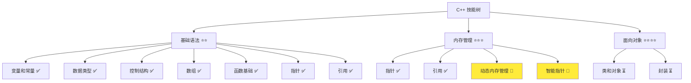
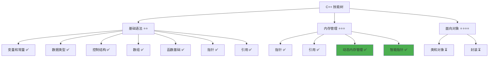

# 内存管理详解

> **学习目标**：掌握 C++ 动态内存管理，理解 new/delete 和智能指针的使用，掌握 RAII 原则  
> **前置知识**：C++ 指针基础、引用基础、函数基础  
> **预计时间**：60 分钟  
> **难度等级**：⭐⭐⭐  
> **技能收获**：动态内存分配、内存泄漏防护、智能指针使用、RAII 原则  
> **文档版本**：v1.0  
> **最后更新**：2025-11-09

📊 **难度等级说明**

| 等级           | 描述                       | 练习题数量     | 颜色码 |
| -------------- | -------------------------- | -------------- | ------ |
| **⭐**         | 入门级，零基础可学         | 5 题基础概念题 | 🟢绿   |
| **⭐⭐**       | 基础级，需要基本编程概念   | 5 题基础概念题 | 🟡黄   |
| **⭐⭐⭐**     | 中级，需要相关技术基础     | 3 题代码分析题 | 🟠橙   |
| **⭐⭐⭐⭐**   | 高级，需要扎实的技术功底   | 3 题代码分析题 | 🔴红   |
| **⭐⭐⭐⭐⭐** | 专家级，需要丰富的项目经验 | 2 题设计思考题 | 🟣紫   |

## 1. 学习目标

### 1.1 学习动机

- **实际需求**：动态内存管理是 C++ 编程的核心技能，理解内存管理对编写高效、安全的程序至关重要
- **应用场景**：动态创建对象、管理大型数据结构、避免内存泄漏、提高程序性能
- **技能价值**：学会后能正确管理内存，避免内存泄漏，编写更安全、高效的代码
- **数据支持**：内存泄漏是 C++ 程序中最常见的问题之一，掌握智能指针可以显著降低内存泄漏风险

### 1.2 技能树位置



> **图表说明**：C++ 技能树结构图，当前文档点亮内存管理技能点

### 1.3 前置知识检查

在开始学习之前，请确认你已经掌握：

- [ ] C++ 指针的基础概念（声明、取地址、解引用）
- [ ] 空指针的概念（`nullptr`）
- [ ] 引用的基础概念
- [ ] 函数的基础使用

> **未掌握处理**：若未通过，请先复习 [指针详解](./13-pointers.md) 和 [引用详解](./14-references.md)

## 2. 核心内容

### 2.1 概念理解

**内存管理**：程序运行时对内存的分配和释放。C++ 提供了手动内存管理（new/delete）和自动内存管理（智能指针）两种方式。

> **类比教学**：
>
> - **栈内存**：像自动售货机，你放东西进去，用完自动弹出。变量在栈上分配，函数结束时自动释放。
> - **堆内存**：像仓库，你需要手动申请空间，用完后必须手动归还。使用 `new` 申请，`delete` 释放。
> - **内存泄漏**：就像从仓库借了东西忘记归还，仓库空间越来越少，最终可能无法再借。
> - **智能指针**：像自动归还系统，你借东西时自动记录，用完后自动归还，不用担心忘记。

### 2.2 栈内存 vs 堆内存

#### 2.2.1 栈内存（自动管理）

**栈内存特点**：

- 由编译器自动分配和释放
- 变量在作用域结束时自动销毁
- 速度快，但大小有限
- 适合存储局部变量、函数参数

**示例**：

```cpp
void function() {
    int num = 10;               // 栈内存，函数结束时自动释放
    std::string str = "Hello";  // 栈内存，函数结束时自动释放
}  // 函数结束，num 和 str 自动销毁
```

#### 2.2.2 堆内存（手动管理）

**堆内存特点**：

- 由程序员手动分配和释放
- 使用 `new` 分配，`delete` 释放
- 速度较慢，但大小灵活
- 适合存储动态大小的数据、大对象

**示例**：

```cpp
int* ptr = new int(10);  // 在堆上分配内存
// 使用 ptr...
delete ptr;              // 必须手动释放
ptr = nullptr;           // 释放后置空
```

**对比总结**：

| 特性     | 栈内存            | 堆内存           |
| -------- | ----------------- | ---------------- |
| 分配方式 | 自动              | 手动（new）      |
| 释放方式 | 自动              | 手动（delete）   |
| 速度     | 快                | 较慢             |
| 大小     | 有限（通常几 MB） | 大（取决于系统） |
| 适用场景 | 局部变量、小对象  | 动态数据、大对象 |

### 2.3 动态内存分配（new/delete）

#### 2.3.1 new 操作符

**语法**：

```cpp
指针变量 = new 数据类型;                // 分配单个对象
指针变量 = new 数据类型(初始值);         // 分配并初始化
指针变量 = new 数据类型[大小];          // 分配数组
```

**示例**：

```cpp
// 分配单个整数
int* ptr = new int;                 // 未初始化
int* ptr2 = new int(42);            // 初始化为 42

// 分配数组
int* arr = new int[10];             // 分配 10 个整数的数组

// 分配字符串
std::string* str = new std::string("Hello");
```

**详细说明**：

- `new` 在堆上分配内存，返回指向该内存的指针
- 如果分配失败，`new` 会抛出异常（`std::bad_alloc`）
- 分配的内存必须用 `delete` 释放，否则会造成内存泄漏

#### 2.3.2 delete 操作符

**语法**：

```cpp
delete 指针变量;                    // 释放单个对象
delete[] 指针变量;                  // 释放数组
```

**示例**：

```cpp
int* ptr = new int(42);
delete ptr;                         // 释放单个对象
ptr = nullptr;                      // 释放后置空（重要！）

int* arr = new int[10];
delete[] arr;                       // 释放数组（必须用 delete[]）
arr = nullptr;
```

**重要规则**：

1. **配对使用**：每个 `new` 必须对应一个 `delete`
2. **数组释放**：`new[]` 必须用 `delete[]` 释放，不能用 `delete`
3. **释放后置空**：释放后立即将指针置为 `nullptr`，避免悬空指针
4. **不能重复释放**：已经释放的内存不能再次释放

#### 2.3.3 基础示例

以下代码演示了动态内存分配的基本使用：

```cpp
// 现代 C++ 示例 - 动态内存分配基础
#include <iostream>

int main() {
    // 示例 1：分配单个整数
    std::cout << "=== 分配单个对象 ===" << std::endl;
    int* ptr = new int(100);
    std::cout << "分配的值: " << *ptr << std::endl;
    *ptr = 200;
    std::cout << "修改后的值: " << *ptr << std::endl;
    delete ptr;                     // 释放内存
    ptr = nullptr;                  // 置空

    // 示例 2：分配数组
    std::cout << "\n=== 分配数组 ===" << std::endl;
    int* arr = new int[5];
    for (int i = 0; i < 5; i++) {
        arr[i] = i * 10;
    }
    std::cout << "数组内容: ";
    for (int i = 0; i < 5; i++) {
        std::cout << arr[i] << " ";
    }
    std::cout << std::endl;
    delete[] arr;                   // 释放数组（必须用 delete[]）
    arr = nullptr;

    // 示例 3：分配失败处理（简化版）
    std::cout << "\n=== 内存分配完成 ===" << std::endl;

    return 0;
}
```

#### 2.3.4 配套代码文件

项目提供了配套的源代码文件：

- **文件位置**：`src/stage1/15-memory-management/01-basic-new-delete.cpp`
- **文件内容**：与上面示例完全一致的程序

> **运行提示**：具体的编译运行方法请参考 [C++ 简介和快速入门](./01-cpp-introduction.md) 中的 `2.2.3 编译运行` 部分

#### 2.3.5 运行预期结果

```
=== 分配单个对象 ===
分配的值: 100
修改后的值: 200

=== 分配数组 ===
数组内容: 0 10 20 30 40

=== 内存分配完成 ===
```

### 2.4 内存泄漏问题

#### 2.4.1 什么是内存泄漏

**内存泄漏**：程序分配了内存但忘记释放，导致内存无法被回收，最终可能导致程序耗尽内存。

**类比**：就像从图书馆借书，借了但忘记还，图书馆的书越来越少。

#### 2.4.2 常见的内存泄漏场景

**场景 1：忘记释放内存**

```cpp
void function() {
    int* ptr = new int(10);
    // 忘记 delete ptr;  // 内存泄漏！
}
```

**场景 2：提前返回，未释放内存**

```cpp
void function() {
    int* ptr = new int(10);
    if (someCondition) {
        return;  // 提前返回，忘记释放内存
    }
    delete ptr;  // 永远不会执行
}
```

**场景 3：异常导致未释放**

```cpp
void function() {
    int* ptr = new int(10);
    someFunction();  // 如果抛出异常，delete 不会执行
    delete ptr;
}
```

#### 2.4.3 防止内存泄漏的最佳实践

1. **配对使用**：每个 `new` 必须对应一个 `delete`
2. **释放后置空**：`delete` 后立即将指针置为 `nullptr`
3. **使用智能指针**：优先使用智能指针，自动管理内存（推荐）
4. **RAII 原则**：资源获取即初始化，利用对象生命周期管理资源

### 2.5 智能指针（推荐方式）

#### 2.5.1 为什么需要智能指针

**问题**：手动管理内存容易出错，容易忘记释放或重复释放。

**解决方案**：智能指针自动管理内存，对象销毁时自动释放内存。

**优势**：

- 自动释放内存，避免内存泄漏
- 异常安全，即使发生异常也能正确释放
- 代码更简洁，不需要手动 `delete`

#### 2.5.2 unique_ptr（独占所有权）

**概念**：`unique_ptr` 独占所指向的对象，同一时间只能有一个 `unique_ptr` 指向该对象。

**语法**：

```cpp
#include <memory>  // 需要包含头文件

std::unique_ptr<类型> 指针变量名 = std::make_unique<类型>(参数);
```

**示例**：

```cpp
#include <iostream>
#include <memory>

int main() {
    // 创建 unique_ptr（推荐方式）
    std::unique_ptr<int> ptr = std::make_unique<int>(42);
    std::cout << "值: " << *ptr << std::endl;

    // 使用指针
    *ptr = 100;
    std::cout << "修改后的值: " << *ptr << std::endl;

    // 不需要手动 delete，函数结束时自动释放
    return 0;
}
```

**特点**：

- **独占所有权，不能复制，只能移动**：
  - **独占所有权**：同一时间只能有一个 `unique_ptr` 指向该对象，就像一把钥匙只能给一个人
  - **不能复制**：不能像普通变量那样复制（`unique_ptr<int> ptr2 = ptr1;` 会编译错误）
  - **只能移动**：可以使用 `std::move()` 将所有权转移给另一个 `unique_ptr`，转移后原指针变为空
  - **示例**：

    ```cpp
    std::unique_ptr<int> ptr1 = std::make_unique<int>(42);
    // std::unique_ptr<int> ptr2 = ptr1;            // 错误！不能复制
    std::unique_ptr<int> ptr2 = std::move(ptr1);    // 正确！移动所有权
    // 现在 ptr1 为空（nullptr），ptr2 拥有对象
    ```

- 自动释放内存，无需手动 `delete`
- 性能开销小，几乎与原始指针相同

#### 2.5.3 shared_ptr（共享所有权）

**概念**：`shared_ptr` 允许多个指针共享同一个对象，使用引用计数管理内存。

**语法**：

```cpp
#include <memory>

std::shared_ptr<类型> 指针变量名 = std::make_shared<类型>(参数);
```

**示例**：

```cpp
#include <iostream>
#include <memory>

int main() {
    // 创建 shared_ptr（推荐方式）
    std::shared_ptr<int> ptr1 = std::make_shared<int>(42);
    std::cout << "ptr1 的值: " << *ptr1 << std::endl;

    // 共享所有权
    std::shared_ptr<int> ptr2 = ptr1;                           // 可以复制
    std::cout << "ptr2 的值: " << *ptr2 << std::endl;
    std::cout << "引用计数: " << ptr1.use_count() << std::endl;  // 输出: 2

    // 当所有 shared_ptr 都销毁时，内存自动释放
    return 0;
}
```

**特点**：

- **共享所有权，可以复制**：
  - **共享所有权**：多个 `shared_ptr` 可以同时指向同一个对象，就像多个人可以共享同一把钥匙
  - **可以复制**：可以像普通变量那样复制（`shared_ptr<int> ptr2 = ptr1;` 是合法的）
  - **示例**：

    ```cpp
    std::shared_ptr<int> ptr1 = std::make_shared<int>(42);
    std::shared_ptr<int> ptr2 = ptr1;  // 正确！可以复制，两个指针共享同一个对象
    std::shared_ptr<int> ptr3 = ptr1;  // 也可以，现在三个指针共享同一个对象
    // 所有指针都指向同一个 int 对象（值为 42）
    ```

- **使用引用计数，当计数为 0 时自动释放**：
  - **引用计数**：系统会记录有多少个 `shared_ptr` 指向同一个对象，这个数量就是"引用计数"
  - **计数增加**：每次复制 `shared_ptr` 时，引用计数加 1
  - **计数减少**：每次 `shared_ptr` 销毁时，引用计数减 1
  - **自动释放**：当引用计数变为 0 时（没有任何 `shared_ptr` 指向该对象），自动释放内存
  - **示例**：

    ```cpp
    std::shared_ptr<int> ptr1 = std::make_shared<int>(42);
    std::cout << ptr1.use_count() << std::endl;         // 输出: 1（只有 ptr1 指向对象）

    {
        std::shared_ptr<int> ptr2 = ptr1;
        std::cout << ptr1.use_count() << std::endl;     // 输出: 2（ptr1 和 ptr2 都指向对象）
    }  // ptr2 离开作用域，销毁，引用计数减 1

    std::cout << ptr1.use_count() << std::endl;         // 输出: 1（只有 ptr1 指向对象）
    // 当 ptr1 也销毁时，引用计数变为 0，内存自动释放
    ```

- 性能开销略大于 `unique_ptr`（需要维护引用计数）

#### 2.5.4 unique_ptr vs shared_ptr

| 特性         | unique_ptr                   | shared_ptr                       |
| ------------ | ---------------------------- | -------------------------------- |
| 所有权       | 独占（一把钥匙只能给一个人） | 共享（多个人可以共享同一把钥匙） |
| 是否可以复制 | 否（只能移动）               | 是                               |
| 性能         | 高（几乎无开销）             | 中等（引用计数开销）             |
| 适用场景     | 单一所有者（推荐）           | 多个所有者                       |
| 推荐使用     | 优先使用                     | 需要共享时使用                   |

**详细对比示例**：

```cpp
// unique_ptr：独占所有权
std::unique_ptr<int> ptr1 = std::make_unique<int>(42);
// std::unique_ptr<int> ptr2 = ptr1;                // 错误！不能复制
std::unique_ptr<int> ptr2 = std::move(ptr1);        // 正确！移动后 ptr1 为空

// shared_ptr：共享所有权
std::shared_ptr<int> ptr3 = std::make_shared<int>(42);
std::shared_ptr<int> ptr4 = ptr3;                   // 正确！可以复制，两个指针共享同一个对象
std::cout << ptr3.use_count() << std::endl;         // 输出: 2（两个指针共享）
```

**选择原则**：

- **优先使用 `unique_ptr`**：大多数情况下，一个对象只有一个所有者（性能更好，更简单）
- **需要共享时使用 `shared_ptr`**：多个对象需要共享同一个资源时（如多个对象需要访问同一个用户数据）

### 2.6 RAII 原则

#### 2.6.1 RAII 概念

**RAII（Resource Acquisition Is Initialization）**：资源获取即初始化。将资源的生命周期与对象的生命周期绑定，对象创建时获取资源，对象销毁时自动释放资源。

**核心思想**：利用 C++ 对象的自动清理特性，自动管理资源（内存、文件、锁等）。

> **📌 新概念说明**：
>
> - **对象销毁**：当变量离开作用域时（比如函数结束、代码块结束），变量会被自动清理，这个过程叫做"销毁"
> - **自动清理**：就像局部变量在函数结束时自动消失一样，智能指针对象在销毁时会自动释放它管理的内存
> - **示例**：
>
>   ```cpp
>   void function() {
>       int num = 10;  // 变量创建
>       // 使用 num...
>   }  // 函数结束，num 自动销毁（清理）
>
>   void function2() {
>       std::unique_ptr<int> ptr = std::make_unique<int>(10);  // 智能指针创建，获取内存
>       // 使用 ptr...
>   }  // 函数结束，ptr 自动销毁，同时自动释放内存（自动清理）
>   ```
>
> - **简单理解**：智能指针就像一个"自动管家"，当它自己消失时，会自动把管理的内存也释放掉，不需要你手动 `delete`

**类比**：就像自动门，你进入时自动打开，离开时自动关闭，不需要手动操作。

#### 2.6.2 RAII 示例

**手动管理（容易出错）**：

```cpp
void function() {
    int* ptr = new int(10);
    // 如果这里发生异常或提前返回，内存泄漏
    delete ptr;
}
```

**使用智能指针（RAII，自动管理）**：

```cpp
#include <memory>

void function() {
    std::unique_ptr<int> ptr = std::make_unique<int>(10);
    // 即使发生异常或提前返回，内存也会自动释放
    // 函数结束时，ptr 自动销毁，内存自动释放
}
```

**优势**：

- 自动管理资源，无需手动释放
- 异常安全，即使发生异常也能正确释放
- 代码更简洁，减少错误

### 2.7 关键特性与设计原理

#### 2.7.1 关键特性

1. **动态内存分配**：可以在运行时动态分配内存，大小灵活
2. **自动内存管理**：使用智能指针自动管理内存，避免内存泄漏
3. **异常安全**：智能指针保证即使发生异常也能正确释放内存
4. **性能优化**：合理使用堆内存可以优化程序性能

#### 2.7.2 设计原理

- **为什么这样设计**：提供了灵活的内存管理方式，智能指针解决了手动管理的复杂性
- **解决了什么问题**：避免了内存泄漏，提供了异常安全的内存管理
- **有什么优势**：安全、高效、易用

### 2.8 常见陷阱和注意事项

#### 2.8.1 常见错误

**错误 1：忘记释放内存**

```cpp
int* ptr = new int(10);
// 忘记 delete ptr;           // 内存泄漏
```

**正确做法**：

```cpp
int* ptr = new int(10);
// 使用 ptr...
delete ptr;
ptr = nullptr;
```

**错误 2：重复释放**

```cpp
int* ptr = new int(10);
delete ptr;
delete ptr;                 // 错误！重复释放，未定义行为
```

**正确做法**：

```cpp
int* ptr = new int(10);
delete ptr;
ptr = nullptr;              // 置空后，即使再次 delete 也不会出错（delete nullptr 是安全的）
```

**错误 3：数组释放错误**

```cpp
int* arr = new int[10];
delete arr;                 // 错误！应该用 delete[]
```

**正确做法**：

```cpp
int* arr = new int[10];
delete[] arr;               // 正确
arr = nullptr;
```

**错误 4：使用已释放的内存**

```cpp
int* ptr = new int(10);
delete ptr;
*ptr = 20;                  // 错误！使用已释放的内存，未定义行为
```

**正确做法**：

```cpp
int* ptr = new int(10);
delete ptr;
ptr = nullptr;              // 置空
if (ptr != nullptr) {       // 检查后再使用
    *ptr = 20;
}
```

**最佳实践**：

1. **优先使用智能指针**：`unique_ptr` 或 `shared_ptr`
2. **配对使用 new/delete**：每个 `new` 必须对应一个 `delete`
3. **释放后置空**：`delete` 后立即将指针置为 `nullptr`
4. **数组用 delete[]**：`new[]` 必须用 `delete[]` 释放
5. **遵循 RAII 原则**：利用对象生命周期管理资源

## 3. 实践应用

### 3.1 项目场景

在 QtLanChat 项目中，内存管理用于：

- **动态创建对象**：根据用户输入动态创建用户对象、消息对象
- **管理大型数据结构**：动态管理用户列表、消息历史
- **避免内存泄漏**：使用智能指针确保资源正确释放
- **性能优化**：合理使用堆内存优化程序性能

### 3.2 实际代码

以下代码展示了内存管理在 QtLanChat 项目中的实际应用：

```cpp
// 项目中的实际应用示例
#include <iostream>
#include <memory>
#include <vector>
#include <string>

// 用户信息结构（简化版）
struct User {
    std::string name;
    int age;
    bool isOnline;
};

// 使用智能指针管理用户对象
void createUser() {
    // 使用 unique_ptr 创建用户（推荐）
    std::unique_ptr<User> user = std::make_unique<User>();
    user->name = "张三";
    user->age = 25;
    user->isOnline = true;

    std::cout << "创建用户: " << user->name << std::endl;
    // 函数结束时，user 自动销毁，内存自动释放
}

// 使用智能指针管理用户数组
void manageUserList() {
    std::vector<std::unique_ptr<User>> users;

    // 动态添加用户
    users.push_back(std::make_unique<User>());
    users.back()->name = "李四";
    users.back()->age = 30;

    users.push_back(std::make_unique<User>());
    users.back()->name = "王五";
    users.back()->age = 28;

    std::cout << "用户列表：" << std::endl;
    for (const auto& user : users) {
        std::cout << "- " << user->name << " (" << user->age << "岁)" << std::endl;
    }
    // 函数结束时，所有 unique_ptr 自动销毁，内存自动释放
}

// 使用 shared_ptr 共享用户对象
void shareUser() {
    std::shared_ptr<User> user = std::make_shared<User>();
    user->name = "赵六";
    user->age = 32;

    // 多个地方可以共享同一个用户对象
    std::shared_ptr<User> userCopy = user;
    std::cout << "原始引用计数: " << user.use_count() << std::endl;  // 输出: 2

    // 使用共享的用户对象
    std::cout << "用户名: " << userCopy->name << std::endl;
    // 当所有 shared_ptr 都销毁时，内存自动释放
}

int main() {
    std::cout << "=== QtLanChat 内存管理应用 ===" << std::endl;

    createUser();
    std::cout << std::endl;

    manageUserList();
    std::cout << std::endl;

    shareUser();

    return 0;
}
```

> **配套代码**：实际应用示例的完整代码位于 `src/stage1/15-memory-management/02-project-example.cpp`

### 3.3 设计思路

- **为什么选择这种设计**：使用智能指针自动管理内存，避免内存泄漏，代码更安全简洁
- **解决了什么问题**：避免了手动内存管理的复杂性和错误，提供了异常安全的内存管理
- **有什么优势**：安全、高效、易用、自动管理

## 4. 练习与测试

### 4.1 练习题

#### 练习 1：动态分配数组

**题目**：使用 `new` 动态分配一个包含 5 个整数的数组，初始化后打印，然后释放内存。

**要求**：

- 使用 `new[]` 分配数组
- 初始化数组元素为 1, 2, 3, 4, 5
- 打印数组内容
- 使用 `delete[]` 释放内存
- 释放后置空指针

**参考答案**：

```cpp
#include <iostream>

int main() {
    int* arr = new int[5];

    for (int i = 0; i < 5; i++) {
        arr[i] = i + 1;
    }

    std::cout << "数组内容: ";
    for (int i = 0; i < 5; i++) {
        std::cout << arr[i] << " ";
    }
    std::cout << std::endl;

    delete[] arr;
    arr = nullptr;

    return 0;
}
```

> **配套代码**：练习 1 的完整代码位于 `src/stage1/15-memory-management/03-exercise-dynamic-array.cpp`

#### 练习 2：使用 unique_ptr

**题目**：使用 `unique_ptr` 创建一个整数，修改其值并打印。

**要求**：

- 使用 `std::make_unique` 创建 `unique_ptr`
- 修改指针指向的值
- 打印值
- 不需要手动释放（自动管理）

**参考答案**：

```cpp
#include <iostream>
#include <memory>

int main() {
    std::unique_ptr<int> ptr = std::make_unique<int>(100);

    std::cout << "初始值: " << *ptr << std::endl;

    *ptr = 200;
    std::cout << "修改后的值: " << *ptr << std::endl;

    // 不需要手动 delete，自动释放
    return 0;
}
```

> **配套代码**：练习 2 的完整代码位于 `src/stage1/15-memory-management/04-exercise-unique-ptr.cpp`

#### 练习 3：使用 shared_ptr

**题目**：使用 `shared_ptr` 创建对象，创建多个共享该对象的指针，观察引用计数。

**要求**：

- 使用 `std::make_shared` 创建 `shared_ptr`
- 创建多个 `shared_ptr` 共享同一个对象
- 使用 `use_count()` 观察引用计数变化

**参考答案**：

```cpp
#include <iostream>
#include <memory>

int main() {
    std::shared_ptr<int> ptr1 = std::make_shared<int>(42);
    std::cout << "ptr1 创建后，引用计数: " << ptr1.use_count() << std::endl;

    {
        std::shared_ptr<int> ptr2 = ptr1;
        std::cout << "ptr2 创建后，引用计数: " << ptr1.use_count() << std::endl;

        std::shared_ptr<int> ptr3 = ptr1;
        std::cout << "ptr3 创建后，引用计数: " << ptr1.use_count() << std::endl;
    }  // ptr2 和 ptr3 离开作用域，自动销毁

    std::cout << "ptr2 和 ptr3 销毁后，引用计数: " << ptr1.use_count() << std::endl;

    return 0;  // ptr1 销毁，内存自动释放
}
```

> **配套代码**：练习 3 的完整代码位于 `src/stage1/15-memory-management/05-exercise-shared-ptr.cpp`

### 4.2 测试题（可选）

1. **关于 new 和 delete，下列说法正确的是：**
   A. `new` 分配的内存会自动释放

   B. `new[]` 必须用 `delete[]` 释放

   C. `delete` 后不需要将指针置空

   D. 可以重复 `delete` 同一个指针
   **答案**：B

   **解析**：
   - **正确答案 B**：`new[]` 分配数组必须用 `delete[]` 释放
   - **错误答案 A**：`new` 分配的内存必须手动 `delete` 释放
   - **错误答案 C**：`delete` 后应该将指针置为 `nullptr`
   - **错误答案 D**：重复 `delete` 会导致未定义行为

2. **关于智能指针，下列说法正确的是：**
   A. `unique_ptr` 可以复制

   B. `shared_ptr` 使用引用计数管理内存

   C. 智能指针需要手动 `delete`

   D. `unique_ptr` 和 `shared_ptr` 性能相同
   **答案**：B

   **解析**：
   - **正确答案 B**：`shared_ptr` 使用引用计数，当计数为 0 时自动释放
   - **错误答案 A**：`unique_ptr` 不能复制，只能移动
   - **错误答案 C**：智能指针自动管理内存，不需要手动 `delete`
   - **错误答案 D**：`unique_ptr` 性能更好，`shared_ptr` 有引用计数开销

3. **什么时候应该使用 `unique_ptr`，什么时候使用 `shared_ptr`？**
   A. 总是使用 `shared_ptr`

   B. 总是使用 `unique_ptr`

   C. 优先使用 `unique_ptr`，需要共享时使用 `shared_ptr`

   D. 两者性能相同，可以随意选择
   **答案**：C

   **解析**：
   - **正确答案 C**：优先使用 `unique_ptr`（性能更好），需要多个所有者共享时使用 `shared_ptr`
   - **错误答案 A/B/D**：应该根据所有权需求选择

### 4.3 常见问题 FAQ

- Q1：为什么优先使用智能指针而不是 new/delete？
  - **A：**智能指针自动管理内存，避免内存泄漏，提供异常安全，代码更简洁。只有在特殊情况下才需要手动管理内存。

- Q2：`unique_ptr` 和 `shared_ptr` 的主要区别是什么？
  - **A：**`unique_ptr` 独占所有权，不能复制，性能更好；`shared_ptr` 共享所有权，可以复制，使用引用计数，性能略差。优先使用 `unique_ptr`。

- Q3：什么时候会发生内存泄漏？
  - **A：**分配了内存但忘记释放，或者提前返回/异常导致未执行 `delete`。使用智能指针可以避免这些问题。

- Q4：`delete` 和 `delete[]` 有什么区别？
  - **A：**`delete` 用于释放单个对象，`delete[]` 用于释放数组。`new[]` 必须用 `delete[]` 释放，不能混用。

- Q5：RAII 原则是什么？
  - **A：**资源获取即初始化，将资源生命周期与对象生命周期绑定，对象销毁时自动释放资源。智能指针是 RAII 的典型应用。

## 5. 资源与扩展

### 5.1 基础资源

- **官方文档**：[C++ 智能指针](https://en.cppreference.com/w/cpp/memory)
- **权威书籍**：《C++ Primer》- 第 12 章
- **在线教程**：[learncpp.com](https://www.learncpp.com/) - 内存管理教程

### 5.2 多媒体学习

- **视频资源**：[C++ 内存管理详解](https://www.youtube.com/results?search_query=C%2B%2B+memory+management+tutorial)
- **开发者资源**：[cppreference.com](https://en.cppreference.com/) - 权威参考

## 6. 课后作业及参考答案

### 6.1 学习检查清单

- [ ] 理解栈内存和堆内存的区别
- [ ] 能够使用 `new` 和 `delete` 分配和释放内存
- [ ] 理解内存泄漏的概念和危害
- [ ] 能够使用 `unique_ptr` 管理内存
- [ ] 能够使用 `shared_ptr` 管理内存
- [ ] 理解 RAII 原则
- [ ] 理解 `unique_ptr` 和 `shared_ptr` 的区别

### 6.2 综合练习

**作业题目**：编写一个动态用户管理系统

**要求**：

- 使用 `unique_ptr` 管理用户对象
- 动态添加和删除用户
- 使用 `vector<unique_ptr<User>>` 存储用户列表
- 实现添加用户、删除用户、显示所有用户的功能

**时间估算**：30 分钟

**参考答案**：

```cpp
#include <iostream>
#include <memory>
#include <vector>
#include <string>

struct User {
    std::string name;
    int age;
};

int main() {
    std::vector<std::unique_ptr<User>> users;

    // 添加用户
    users.push_back(std::make_unique<User>());
    users.back()->name = "张三";
    users.back()->age = 25;

    users.push_back(std::make_unique<User>());
    users.back()->name = "李四";
    users.back()->age = 30;

    // 显示所有用户
    std::cout << "=== 用户列表 ===" << std::endl;
    for (size_t i = 0; i < users.size(); i++) {
        std::cout << (i + 1) << ". " << users[i]->name
                  << " (" << users[i]->age << "岁)" << std::endl;
    }

    // 删除第一个用户
    if (!users.empty()) {
        users.erase(users.begin());
        std::cout << "\n删除第一个用户后：" << std::endl;
        for (size_t i = 0; i < users.size(); i++) {
            std::cout << (i + 1) << ". " << users[i]->name
                      << " (" << users[i]->age << "岁)" << std::endl;
        }
    }

    // 函数结束时，所有 unique_ptr 自动销毁，内存自动释放
    return 0;
}
```

**评分标准**：功能实现（40%）、智能指针使用正确（30%）、代码质量（30%）

## 7. 下一步学习

**下一篇**：[16-struct.md](./16-struct.md)

**学习路径**：

1. ✅ C++ 简介和快速入门 - 已完成
2. ✅ 变量和常量 - 已完成
3. ✅ 数据类型详解 - 已完成
4. ✅ 运算符详解 - 已完成
5. ✅ if 分支详解 - 已完成
6. ✅ while 循环 - 已完成
7. ✅ for 循环 - 已完成
8. ✅ switch 分支 - 已完成
9. ✅ 数组基础 - 已完成
10. ✅ std::vector - 已完成
11. ✅ 字符串进阶 - 已完成
12. ✅ 函数基础 - 已完成
13. ✅ 指针详解 - 已完成
14. ✅ 引用详解 - 已完成
15. ✅ 内存管理 - 已完成
16. 🔄 结构体 - 下一步

**技能树更新**：



**学习成果**：

- **独立编写**：能够使用 new/delete 和智能指针管理内存
- **解释原理**：能够解释栈内存和堆内存的区别，理解 RAII 原则
- **解决实际问题**：能够避免内存泄漏，编写安全的内存管理代码
- **应用到项目**：为后续面向对象编程和项目开发打下基础
- **掌握度自评**：85%

### 学习成果指导

> **自评指导**：
>
> - **<50%**：建议复习内存管理的基础概念，重新阅读文档核心内容
> - **50-80%**：继续学习，完成练习题巩固理解
> - **>80%**：可以进入下一阶段学习，开始结构体学习

---

**文档质量检查**：

- [x] 学习目标明确且可验证
- [x] 代码示例可运行
- [x] 练习题有答案
- [x] 技能收获明确
- [x] 抽象概念配有生活化比喻
- [x] 比喻体系一致，避免概念混乱
- [x] 文档长度符合难度等级要求
