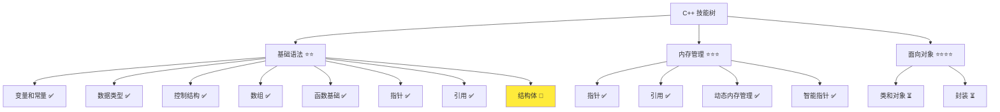
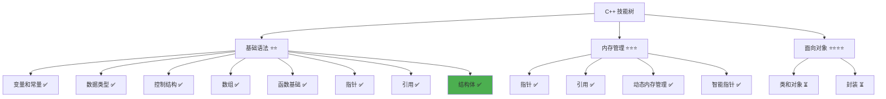

# 结构体详解

> **学习目标**：掌握 C++ 结构体的定义与使用，理解结构体作为自定义数据类型的作用和应用场景  
> **前置知识**：C++ 变量和常量、数据类型、函数基础、引用基础  
> **预计时间**：45 分钟  
> **难度等级**：⭐⭐  
> **技能收获**：结构体定义、成员访问、初始化、作为函数参数、数据组织  
> **文档版本**：v1.0  
> **最后更新**：2025-11-09

📊 **难度等级说明**

| 等级           | 描述                       | 练习题数量     | 颜色码 |
| -------------- | -------------------------- | -------------- | ------ |
| **⭐**         | 入门级，零基础可学         | 5 题基础概念题 | 🟢绿   |
| **⭐⭐**       | 基础级，需要基本编程概念   | 5 题基础概念题 | 🟡黄   |
| **⭐⭐⭐**     | 中级，需要相关技术基础     | 3 题代码分析题 | 🟠橙   |
| **⭐⭐⭐⭐**   | 高级，需要扎实的技术功底   | 3 题代码分析题 | 🔴红   |
| **⭐⭐⭐⭐⭐** | 专家级，需要丰富的项目经验 | 2 题设计思考题 | 🟣紫   |

## 1. 学习目标

### 1.1 学习动机

- **实际需求**：结构体是 C++ 中组织相关数据的重要方式，理解结构体对编写清晰、易维护的程序至关重要
- **应用场景**：组织相关数据、表示复杂对象、作为函数参数、构建数据结构
- **技能价值**：学会后能更好地组织数据，编写更清晰、易维护的代码，为后续面向对象编程打基础
- **数据支持**：结构体是 C++ 中自定义数据类型的基础，是面向对象编程（类）的前置知识

### 1.2 技能树位置



> **图表说明**：C++ 技能树结构图，当前文档点亮结构体技能点

### 1.3 前置知识检查

在开始学习之前，请确认你已经掌握：

- [ ] C++ 变量和常量的声明与使用
- [ ] 基本数据类型（int、double、std::string、bool）
- [ ] 函数的基础使用（定义、调用、参数传递）
- [ ] 引用的基础概念（可选，但推荐）

> **未掌握处理**：若未通过，请先复习 [变量和常量](./02-variables-constants.md)、[数据类型详解](./03-data-types.md) 和 [函数基础详解](./12-functions.md)

## 2. 核心内容

### 2.1 概念理解

**结构体（Struct）**：将多个不同类型的数据组合在一起，形成一个新的数据类型。结构体就像一个"数据容器"，可以把相关的数据打包在一起。

> **类比教学**：
>
> - **结构体**：像一张信息卡片，上面有多个字段（姓名、年龄、地址等），所有信息都属于同一个人
> - **成员变量**：结构体中的每个数据项，就像卡片上的每个字段
> - **结构体变量**：用结构体类型创建的变量，就像填写好的一张卡片
> - **数据组织**：把相关的数据放在一起，就像把一个人的所有信息放在一张卡片上，方便管理和使用

### 2.2 结构体定义

#### 2.2.1 定义语法

**语法**：

```cpp
struct 结构体名称 {
    数据类型1 成员变量1;
    数据类型2 成员变量2;
    // ... 更多成员变量
};
```

**示例**：

```cpp
// 定义用户信息结构体
struct User {
    std::string name;           // 姓名
    int age;                    // 年龄
    bool isOnline;              // 是否在线
};
```

**详细说明**：

- `struct` 是关键字，用于定义结构体
- `User` 是结构体名称（推荐使用 `PascalCase` 命名规范）
- 大括号内是成员变量列表
- 每个成员变量都有自己的数据类型
- 结构体定义以分号 `;` 结束

#### 2.2.2 结构体命名规范

**推荐命名规范**：

- **结构体名称**：使用 `PascalCase`（首字母大写的驼峰命名法）
  - 示例：`User`、`Student`、`Message`、`UserInfo`
- **成员变量**：使用 `camelCase`（小驼峰命名法，与 Qt 框架一致）
  - 示例：`userName`、`userAge`、`isOnline`
- **说明**：C++ 标准库使用 `snake_case`，但自定义代码推荐使用 `camelCase` 和 `PascalCase`

### 2.3 结构体变量声明和使用

#### 2.3.1 声明结构体变量

**语法**：

```cpp
结构体名称 变量名;
```

**示例**：

```cpp
User user1;                     // 声明一个 User 类型的变量
```

#### 2.3.2 访问成员变量

**语法**：

```cpp
结构体变量名.成员变量名
```

**示例**：

```cpp
User user1;
user1.name = "张三";                     // 设置姓名
user1.age = 25;                         // 设置年龄
user1.isOnline = true;                  // 设置在线状态

std::cout << user1.name << std::endl;   // 访问姓名
std::cout << user1.age << std::endl;    // 访问年龄
```

**详细说明**：

- 使用点号 `.` 访问结构体的成员变量
- 可以读取和修改成员变量的值
- 每个结构体变量都有自己独立的成员变量副本

#### 2.3.3 基础示例

以下代码演示了结构体的基本使用：

```cpp
// 现代 C++ 示例 - 结构体基础
#include <iostream>
#include <string>

// 定义用户信息结构体
struct User {
    std::string name;
    int age;
    bool isOnline;
};

int main() {
    // 声明结构体变量
    User user1;

    // 设置成员变量的值
    user1.name = "张三";
    user1.age = 25;
    user1.isOnline = true;

    // 访问并输出成员变量
    std::cout << "=== 用户信息 ===" << std::endl;
    std::cout << "姓名: " << user1.name << std::endl;
    std::cout << "年龄: " << user1.age << std::endl;
    std::cout << "在线状态: " << (user1.isOnline ? "在线" : "离线") << std::endl;

    // 创建另一个用户
    User user2;
    user2.name = "李四";
    user2.age = 30;
    user2.isOnline = false;

    std::cout << "\n=== 用户 2 信息 ===" << std::endl;
    std::cout << "姓名: " << user2.name << std::endl;
    std::cout << "年龄: " << user2.age << std::endl;
    std::cout << "在线状态: " << (user2.isOnline ? "在线" : "离线") << std::endl;

    return 0;
}
```

#### 2.3.4 配套代码文件

项目提供了配套的源代码文件：

- **文件位置**：`src/stage1/16-struct/01-basic-struct.cpp`
- **文件内容**：与上面示例完全一致的程序

> **运行提示**：具体的编译运行方法请参考 [C++ 简介和快速入门](./01-cpp-introduction.md) 中的 `2.2.3 编译运行` 部分

#### 2.3.5 运行预期结果

```
=== 用户信息 ===
姓名: 张三
年龄: 25
在线状态: 在线

=== 用户 2 信息 ===
姓名: 李四
年龄: 30
在线状态: 离线
```

### 2.4 结构体初始化

#### 2.4.1 初始化方式

**方式 1：声明后逐个赋值（最常用）**

```cpp
User user1;
user1.name = "张三";
user1.age = 25;
user1.isOnline = true;
```

**方式 2：列表初始化（C++11，推荐）**

```cpp
User user1 = {"张三", 25, true};    // 按成员变量定义顺序初始化
```

**方式 3：声明时初始化**

```cpp
User user1{"张三", 25, true};       // C++11 语法，省略 = 号
```

**详细说明**：

- **列表初始化**：使用大括号 `{}` 按顺序提供所有成员变量的初始值
- **顺序要求**：必须按照结构体定义中成员变量的顺序提供值
- **类型匹配**：提供的值必须与成员变量的类型匹配
- **推荐**：列表初始化更简洁，是 C++11 推荐的方式

#### 2.4.2 初始化示例

```cpp
#include <iostream>
#include <string>

struct User {
    std::string name;
    int age;
    bool isOnline;
};

int main() {
    // 方式 1：声明后逐个赋值
    User user1;
    user1.name = "张三";
    user1.age = 25;
    user1.isOnline = true;

    // 方式 2：列表初始化（推荐）
    User user2 = {"李四", 30, false};

    // 方式 3：声明时初始化（C++11）
    User user3{"王五", 28, true};

    std::cout << "用户 1: " << user1.name << ", " << user1.age << "岁" << std::endl;
    std::cout << "用户 2: " << user2.name << ", " << user2.age << "岁" << std::endl;
    std::cout << "用户 3: " << user3.name << ", " << user3.age << "岁" << std::endl;

    return 0;
}
```

### 2.5 结构体作为函数参数

#### 2.5.1 值传递（复制整个结构体）

**语法**：

```cpp
void 函数名(结构体类型 参数名) {
    // 使用参数
}
```

**示例**：

```cpp
void printUser(User user) {
    std::cout << "姓名: " << user.name << std::endl;
    std::cout << "年龄: " << user.age << std::endl;
}

int main() {
    User user1 = {"张三", 25, true};
    printUser(user1);           // 传递结构体，会复制整个结构体
    return 0;
}
```

**特点**：

- 函数接收的是结构体的副本
- 修改函数内的参数不会影响原始结构体
- 对于大结构体，复制开销较大

#### 2.5.2 引用传递（推荐，避免复制）

**语法**：

```cpp
void 函数名(const 结构体类型& 参数名) {     // const 引用，只读
    // 使用参数
}

void 函数名(结构体类型& 参数名) {           // 非 const 引用，可修改
    // 使用参数
}
```

**示例**：

```cpp
// const 引用传递（只读，推荐）
void printUser(const User& user) {
    std::cout << "姓名: " << user.name << std::endl;
    std::cout << "年龄: " << user.age << std::endl;
    // user.age = 30;                   // 错误！const 引用不能修改
}

// 非 const 引用传递（可修改）
void updateUserAge(User& user, int newAge) {
    user.age = newAge;                  // 直接修改原始结构体
}

int main() {
    User user1 = {"张三", 25, true};
    printUser(user1);                   // 传递引用，不复制
    updateUserAge(user1, 30);           // 通过引用修改
    printUser(user1);                   // 输出: 年龄: 30
    return 0;
}
```

**特点**：

- **const 引用**：只读访问，不能修改，避免复制（推荐用于只读场景）
- **非 const 引用**：可以修改原始结构体，避免复制（用于需要修改的场景）
- **性能优势**：不复制整个结构体，性能更好
- **推荐**：对于结构体参数，优先使用 const 引用传递

#### 2.5.3 指针传递

**语法**：

```cpp
void 函数名(结构体类型* 参数名) {
    // 使用参数（需要解引用）
}
```

**示例**：

```cpp
void printUser(User* user) {
    if (user != nullptr) {          // 检查指针是否为空
        std::cout << "姓名: " << user->name << std::endl;  // 使用 -> 访问成员
        std::cout << "年龄: " << user->age << std::endl;
    }
}

int main() {
    User user1 = {"张三", 25, true};
    printUser(&user1);              // 传递地址
    return 0;
}
```

**特点**：

- 使用指针访问成员变量时，使用 `->` 操作符（而不是 `.`）
- 需要检查指针是否为空
- 可以表示可选参数（指针可以为 `nullptr`）

#### 2.5.4 三种传递方式对比

| 传递方式      | 语法               | 是否复制 | 能否修改 | 性能 | 推荐度     |
| ------------- | ------------------ | -------- | -------- | ---- | ---------- |
| 值传递        | `User user`        | 是       | 否       | 差   | ⭐         |
| const 引用    | `const User& user` | 否       | 否       | 好   | ⭐⭐⭐⭐⭐ |
| 非 const 引用 | `User& user`       | 否       | 是       | 好   | ⭐⭐⭐⭐   |
| 指针传递      | `User* user`       | 否       | 是       | 好   | ⭐⭐⭐     |

**选择原则**：

- **只读访问**：使用 `const 引用`（最推荐）
- **需要修改**：使用 `非 const 引用`（推荐）或 `指针`（可选参数时）
- **小结构体**：可以使用值传递，但引用传递更通用
- **大结构体**：必须使用引用或指针，避免复制开销

### 2.6 结构体数组和容器

#### 2.6.1 结构体数组

**语法**：

```cpp
结构体名称 数组名[大小];
```

**示例**：

```cpp
User users[3];                  // 声明包含 3 个 User 的数组

// 初始化
users[0] = {"张三", 25, true};
users[1] = {"李四", 30, false};
users[2] = {"王五", 28, true};

// 访问
std::cout << users[0].name << std::endl;
```

#### 2.6.2 结构体 vector（推荐）

**语法**：

```cpp
std::vector<结构体名称> 变量名;
```

**示例**：

```cpp
#include <vector>

std::vector<User> users;

// 添加元素
users.push_back({"张三", 25, true});
users.push_back({"李四", 30, false});

// 访问
std::cout << users[0].name << std::endl;

// 遍历
for (const auto& user : users) {
    std::cout << user.name << ", " << user.age << "岁" << std::endl;
}
```

**优势**：

- 动态大小，可以随时添加和删除元素
- 使用范围 for 循环遍历更方便
- 推荐使用 `vector` 而不是数组

### 2.7 关键特性与设计原理

#### 2.7.1 关键特性

1. **数据组织**：将相关的数据组合在一起，形成逻辑单元
2. **类型安全**：结构体是自定义类型，编译器会进行类型检查
3. **代码清晰**：使用结构体可以让代码更易读、易维护
4. **灵活传递**：可以作为函数参数，支持值传递、引用传递、指针传递

#### 2.7.2 设计原理

- **为什么这样设计**：结构体提供了组织相关数据的方式，让代码更清晰、易维护
- **解决了什么问题**：避免了使用多个独立变量管理相关数据的问题，提供了数据封装的基础
- **有什么优势**：代码清晰、类型安全、易于扩展

### 2.8 常见陷阱和注意事项

#### 2.8.1 常见错误

**错误 1：忘记结构体定义后的分号**

```cpp
struct User {
    std::string name;
    int age;
}  // 错误！缺少分号
```

**正确做法**：

```cpp
struct User {
    std::string name;
    int age;
};  // 正确！必须有分号
```

**错误 2：列表初始化顺序错误**

```cpp
User user1 = {25, "张三", true};    // 错误！顺序不对
```

**正确做法**：

```cpp
User user1 = {"张三", 25, true};    // 正确！按定义顺序
```

**错误 3：访问不存在的成员变量**

```cpp
User user1;
user1.address = "北京";             // 错误！User 结构体中没有 address 成员
```

**正确做法**：

```cpp
// 先在结构体中定义 address 成员
struct User {
    std::string name;
    int age;
    std::string address;            // 添加 address 成员
};

User user1;
user1.address = "北京";             // 正确
```

**最佳实践**：

1. **使用 const 引用传递**：对于只读访问，使用 `const 引用` 避免复制
2. **使用列表初始化**：初始化结构体时使用列表初始化，更简洁
3. **合理组织数据**：将相关的数据放在同一个结构体中
4. **命名规范**：结构体名称使用 `PascalCase`，成员变量使用 `camelCase`

## 3. 实践应用

### 3.1 项目场景

在 QtLanChat 项目中，结构体用于：

- **用户信息管理**：组织用户的姓名、年龄、在线状态等信息
- **消息数据组织**：组织消息的发送者、内容、时间等信息
- **数据传递**：作为函数参数传递复杂数据
- **数据结构构建**：构建用户列表、消息列表等数据结构

### 3.2 实际代码

以下代码展示了结构体在 QtLanChat 项目中的实际应用：

```cpp
// 项目中的实际应用示例
#include <iostream>
#include <string>
#include <vector>

// 用户信息结构体
struct User {
    std::string name;
    int age;
    bool isOnline;
};

// 消息结构体
struct Message {
    std::string sender;      // 发送者
    std::string content;     // 消息内容
    int timestamp;           // 时间戳（简化）
};

// 函数 1：使用 const 引用传递结构体（只读，推荐）
void printUserInfo(const User& user) {
    std::cout << "=== 用户信息 ===" << std::endl;
    std::cout << "姓名: " << user.name << std::endl;
    std::cout << "年龄: " << user.age << std::endl;
    std::cout << "在线状态: " << (user.isOnline ? "在线" : "离线") << std::endl;
}

// 函数 2：使用非 const 引用修改结构体
void updateUserStatus(User& user, bool status) {
    user.isOnline = status;
    std::cout << user.name << " 的状态已更新为: " << (status ? "在线" : "离线") << std::endl;
}

// 函数 3：使用 const 引用传递消息（只读）
void printMessage(const Message& msg) {
    std::cout << "[" << msg.sender << "]: " << msg.content << std::endl;
}

// 函数 4：管理用户列表
void manageUserList() {
    std::vector<User> users;

    // 添加用户
    users.push_back({"张三", 25, true});
    users.push_back({"李四", 30, false});
    users.push_back({"王五", 28, true});

    // 遍历并打印用户信息
    std::cout << "\n=== 用户列表 ===" << std::endl;
    for (const auto& user : users) {
        printUserInfo(user);
        std::cout << std::endl;
    }
}

int main() {
    std::cout << "=== QtLanChat 结构体应用 ===" << std::endl;

    // 创建用户
    User user1 = {"张三", 25, true};
    printUserInfo(user1);

    // 更新用户状态
    updateUserStatus(user1, false);
    printUserInfo(user1);

    // 创建消息
    Message msg1 = {"张三", "你好，大家好！", 1234567890};
    printMessage(msg1);

    // 管理用户列表
    manageUserList();

    return 0;
}
```

> **配套代码**：实际应用示例的完整代码位于 `src/stage1/16-struct/02-project-example.cpp`

### 3.3 设计思路

- **为什么选择这种设计**：使用结构体组织相关数据，代码更清晰、易维护
- **解决了什么问题**：避免了使用多个独立变量管理相关数据的问题，提供了数据封装的基础
- **有什么优势**：代码清晰、类型安全、易于扩展、便于传递

## 4. 练习与测试

### 4.1 练习题

#### 练习 1：定义和使用结构体

**题目**：定义一个学生结构体（包含姓名、年龄、成绩），创建两个学生并输出他们的信息。

**要求**：

- 定义 `Student` 结构体，包含 `name`（std::string）、`age`（int）、`score`（double）
- 创建两个学生，使用列表初始化
- 输出每个学生的信息

**参考答案**：

```cpp
#include <iostream>
#include <string>

struct Student {
    std::string name;
    int age;
    double score;
};

int main() {
    Student student1 = {"张三", 20, 85.5};
    Student student2 = {"李四", 21, 92.0};

    std::cout << "学生 1: " << student1.name << ", " << student1.age
              << "岁, 成绩: " << student1.score << std::endl;
    std::cout << "学生 2: " << student2.name << ", " << student2.age
              << "岁, 成绩: " << student2.score << std::endl;

    return 0;
}
```

> **配套代码**：练习 1 的完整代码位于 `src/stage1/16-struct/03-exercise-student.cpp`

#### 练习 2：结构体作为函数参数

**题目**：编写函数使用 const 引用打印学生信息，使用非 const 引用修改学生成绩。

**要求**：

- 使用 `const 引用` 传递结构体参数（只读）
- 使用 `非 const 引用` 传递结构体参数（可修改）
- 创建学生并测试函数

**参考答案**：

```cpp
#include <iostream>
#include <string>

struct Student {
    std::string name;
    int age;
    double score;
};

// 使用 const 引用打印学生信息（只读）
void printStudent(const Student& student) {
    std::cout << "姓名: " << student.name << std::endl;
    std::cout << "年龄: " << student.age << std::endl;
    std::cout << "成绩: " << student.score << std::endl;
}

// 使用非 const 引用修改成绩
void updateScore(Student& student, double newScore) {
    student.score = newScore;
}

int main() {
    Student student1 = {"张三", 20, 85.5};

    std::cout << "修改前：" << std::endl;
    printStudent(student1);

    updateScore(student1, 95.0);

    std::cout << "\n修改后：" << std::endl;
    printStudent(student1);

    return 0;
}
```

> **配套代码**：练习 2 的完整代码位于 `src/stage1/16-struct/04-exercise-function-param.cpp`

#### 练习 3：结构体 vector

**题目**：使用 `vector` 存储学生列表，添加多个学生并遍历输出。

**要求**：

- 使用 `std::vector<Student>` 存储学生
- 使用 `push_back` 添加至少 3 个学生
- 使用范围 for 循环遍历并输出所有学生信息

**参考答案**：

```cpp
#include <iostream>
#include <string>
#include <vector>

struct Student {
    std::string name;
    int age;
    double score;
};

void printStudent(const Student& student) {
    std::cout << student.name << ", " << student.age
              << "岁, 成绩: " << student.score << std::endl;
}

int main() {
    std::vector<Student> students;

    // 添加学生
    students.push_back({"张三", 20, 85.5});
    students.push_back({"李四", 21, 92.0});
    students.push_back({"王五", 19, 88.5});

    // 遍历并输出
    std::cout << "=== 学生列表 ===" << std::endl;
    for (const auto& student : students) {
        printStudent(student);
    }

    return 0;
}
```

> **配套代码**：练习 3 的完整代码位于 `src/stage1/16-struct/05-exercise-vector.cpp`

### 4.2 测试题（可选）

1. **关于结构体，下列说法正确的是：**
   A. 结构体定义后不需要分号

   B. 结构体成员变量必须使用相同的类型

   C. 结构体可以作为函数参数传递

   D. 结构体变量之间不能赋值
   **答案**：C

   **解析**：
   - **正确答案 C**：结构体可以作为函数参数传递（值传递、引用传递、指针传递）
   - **错误答案 A**：结构体定义后必须有分号
   - **错误答案 B**：结构体成员变量可以使用不同的类型
   - **错误答案 D**：结构体变量之间可以赋值（会复制所有成员变量）

2. **关于结构体作为函数参数，下列说法正确的是：**
   A. 值传递性能最好

   B. const 引用传递可以修改原始结构体

   C. 对于大结构体，应该使用引用传递

   D. 指针传递必须使用 `.` 访问成员
   **答案**：C

   **解析**：
   - **正确答案 C**：对于大结构体，使用引用传递可以避免复制，性能更好
   - **错误答案 A**：值传递会复制整个结构体，性能较差
   - **错误答案 B**：const 引用是只读的，不能修改原始结构体
   - **错误答案 D**：指针传递使用 `->` 访问成员，不是 `.`

3. **什么时候应该使用结构体？**
   A. 任何时候都使用结构体

   B. 需要组织相关数据时使用结构体

   C. 结构体只能存储相同类型的数据

   D. 结构体不能作为函数参数
   **答案**：B

   **解析**：
   - **正确答案 B**：当需要将相关的数据组织在一起时，使用结构体
   - **错误答案 A/C/D**：结构体用于组织相关数据，可以存储不同类型，可以作为函数参数

### 4.3 常见问题 FAQ

- Q1：结构体和数组有什么区别？
  - **A：**数组存储相同类型的多个数据，结构体可以存储不同类型的相关数据。数组用索引访问，结构体用成员变量名访问。

- Q2：什么时候使用值传递，什么时候使用引用传递？
  - **A：**对于结构体，优先使用 const 引用传递（只读）或非 const 引用传递（需要修改）。值传递会复制整个结构体，性能较差，不推荐用于大结构体。

- Q3：结构体可以嵌套吗？
  - **A：**可以。结构体的成员变量可以是另一个结构体类型，形成嵌套结构体。

- Q4：结构体和类有什么区别？
  - **A：**在 C++ 中，结构体和类非常相似。主要区别是默认访问权限：结构体默认是 `public`，类默认是 `private`。结构体通常用于简单的数据组织，类用于面向对象编程。

- Q5：如何初始化结构体数组？
  - **A：**可以使用列表初始化：`User users[3] = {{"张三", 25, true}, {"李四", 30, false}, {"王五", 28, true}};` 或逐个赋值。

## 5. 资源与扩展

### 5.1 基础资源

- **官方文档**：[C++ 结构体](https://en.cppreference.com/w/cpp/language/struct)
- **权威书籍**：《C++ Primer》- 第 2.6 节
- **在线教程**：[learncpp.com](https://www.learncpp.com/) - 结构体教程

### 5.2 多媒体学习

- **视频资源**：[C++ 结构体详解](https://www.youtube.com/results?search_query=C%2B%2B+struct+tutorial)
- **开发者资源**：[cppreference.com](https://en.cppreference.com/) - 权威参考

## 6. 课后作业及参考答案

### 6.1 学习检查清单

- [ ] 能够定义结构体
- [ ] 能够声明和使用结构体变量
- [ ] 能够访问和修改结构体成员变量
- [ ] 能够使用列表初始化结构体
- [ ] 能够使用结构体作为函数参数（值传递、引用传递）
- [ ] 能够使用结构体数组和 vector
- [ ] 理解结构体的应用场景

### 6.2 综合练习

**作业题目**：编写一个简单的图书管理系统

**要求**：

- 定义 `Book` 结构体，包含书名、作者、价格、库存数量
- 使用 `vector<Book>` 存储图书列表
- 实现添加图书、显示所有图书、查找图书的功能
- 使用 const 引用传递结构体参数

**时间估算**：30 分钟

**参考答案**：

```cpp
#include <iostream>
#include <string>
#include <vector>

struct Book {
    std::string title;      // 书名
    std::string author;     // 作者
    double price;           // 价格
    int stock;              // 库存
};

// 使用 const 引用打印图书信息
void printBook(const Book& book) {
    std::cout << "《" << book.title << "》" << std::endl;
    std::cout << "  作者: " << book.author << std::endl;
    std::cout << "  价格: " << book.price << " 元" << std::endl;
    std::cout << "  库存: " << book.stock << " 本" << std::endl;
}

// 显示所有图书
void printAllBooks(const std::vector<Book>& books) {
    std::cout << "=== 图书列表 ===" << std::endl;
    for (size_t i = 0; i < books.size(); i++) {
        std::cout << (i + 1) << ". ";
        printBook(books[i]);
        std::cout << std::endl;
    }
}

// 查找图书（按书名）
void findBook(const std::vector<Book>& books, const std::string& title) {
    bool found = false;
    for (const auto& book : books) {
        if (book.title == title) {
            std::cout << "找到图书：" << std::endl;
            printBook(book);
            found = true;
            break;
        }
    }
    if (!found) {
        std::cout << "未找到图书: " << title << std::endl;
    }
}

int main() {
    std::vector<Book> books;

    // 添加图书
    books.push_back({"C++ Primer", "Stanley B. Lippman", 128.0, 10});
    books.push_back({"Effective C++", "Scott Meyers", 89.0, 5});
    books.push_back({"The C++ Programming Language", "Bjarne Stroustrup", 158.0, 8});

    // 显示所有图书
    printAllBooks(books);

    // 查找图书
    std::cout << "\n=== 查找图书 ===" << std::endl;
    findBook(books, "C++ Primer");
    findBook(books, "不存在的书");

    return 0;
}
```

**评分标准**：功能实现（40%）、结构体使用正确（30%）、代码质量（30%）

## 7. 下一步学习

**下一篇**：[17-enum.md](./17-enum.md)

**学习路径**：

1. ✅ C++ 简介和快速入门 - 已完成
2. ✅ 变量和常量 - 已完成
3. ✅ 数据类型详解 - 已完成
4. ✅ 运算符详解 - 已完成
5. ✅ if 分支详解 - 已完成
6. ✅ while 循环 - 已完成
7. ✅ for 循环 - 已完成
8. ✅ switch 分支 - 已完成
9. ✅ 数组基础 - 已完成
10. ✅ std::vector - 已完成
11. ✅ 字符串进阶 - 已完成
12. ✅ 函数基础 - 已完成
13. ✅ 指针详解 - 已完成
14. ✅ 引用详解 - 已完成
15. ✅ 内存管理 - 已完成
16. ✅ 结构体 - 已完成
17. 🔄 枚举类型 - 下一步

**技能树更新**：



**学习成果**：

- **独立编写**：能够定义和使用结构体，组织相关数据
- **解释原理**：能够解释结构体的作用和应用场景
- **解决实际问题**：能够使用结构体组织数据，作为函数参数传递
- **应用到项目**：为后续面向对象编程和项目开发打下基础
- **掌握度自评**：85%

### 学习成果指导

> **自评指导**：
>
> - **<50%**：建议复习结构体的基础概念，重新阅读文档核心内容
> - **50-80%**：继续学习，完成练习题巩固理解
> - **>80%**：可以进入下一阶段学习，开始枚举类型学习

---

**文档质量检查**：

- [x] 学习目标明确且可验证
- [x] 代码示例可运行
- [x] 练习题有答案
- [x] 技能收获明确
- [x] 抽象概念配有生活化比喻
- [x] 比喻体系一致，避免概念混乱
- [x] 文档长度符合难度等级要求
