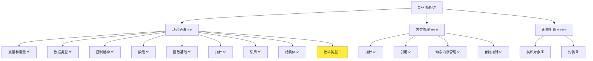
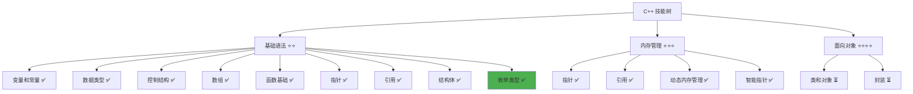

# 枚举类型详解

> **学习目标**：掌握 C++ 枚举类型的定义与使用，理解枚举作为命名常量集合的作用和应用场景  
> **前置知识**：C++ 变量和常量、数据类型、switch 分支  
> **预计时间**：40 分钟  
> **难度等级**：⭐⭐  
> **技能收获**：枚举定义、枚举值使用、枚举与 switch 配合、状态管理  
> **文档版本**：v1.0  
> **最后更新**：2025-11-09

📊 **难度等级说明**

| 等级           | 描述                       | 练习题数量     | 颜色码 |
| -------------- | -------------------------- | -------------- | ------ |
| **⭐**         | 入门级，零基础可学         | 5 题基础概念题 | 🟢绿   |
| **⭐⭐**       | 基础级，需要基本编程概念   | 5 题基础概念题 | 🟡黄   |
| **⭐⭐⭐**     | 中级，需要相关技术基础     | 3 题代码分析题 | 🟠橙   |
| **⭐⭐⭐⭐**   | 高级，需要扎实的技术功底   | 3 题代码分析题 | 🔴红   |
| **⭐⭐⭐⭐⭐** | 专家级，需要丰富的项目经验 | 2 题设计思考题 | 🟣紫   |

## 1. 学习目标

### 1.1 学习动机

- **实际需求**：枚举类型是 C++ 中定义命名常量集合的重要方式，理解枚举对编写清晰、易维护的程序至关重要
- **应用场景**：状态管理、菜单选项、消息类型、错误码、配置选项
- **技能价值**：学会后能更好地管理常量，编写更清晰、类型安全的代码，与 switch 语句完美配合
- **数据支持**：枚举类型提供了类型安全的常量定义方式，比使用 `#define`（宏定义，不推荐）或 `const int`（单个常量）更安全、更易维护

### 1.2 技能树位置



> **图表说明**：C++ 技能树结构图，当前文档点亮枚举类型技能点

### 1.3 前置知识检查

在开始学习之前，请确认你已经掌握：

- [ ] C++ 变量和常量的声明与使用
- [ ] 基本数据类型（int、char、bool）
- [ ] switch 分支结构的使用
- [ ] 常量（const）的概念

> **未掌握处理**：若未通过，请先复习 [变量和常量](./02-variables-constants.md)、[数据类型详解](./03-data-types.md) 和 [switch 分支详解](./08-switch.md)

## 2. 核心内容

### 2.1 概念理解

**枚举类型（Enum）**：定义一组命名常量的数据类型。枚举就像一个"选项清单"，把相关的常量值组织在一起，给每个值起一个有意义的名称。

> **类比教学**：
>
> - **枚举**：像交通信号灯的颜色选项（红、黄、绿），或者一周的星期（周一、周二、周三...）
> - **枚举值**：枚举中的每个命名常量，就像清单上的每个选项
> - **枚举变量**：用枚举类型创建的变量，只能取枚举中定义的值
> - **类型安全**：使用枚举可以避免使用错误的常量值，就像只能选择清单上存在的选项

### 2.2 枚举定义

#### 2.2.1 定义语法

**语法**：

```cpp
enum 枚举名称 {
    枚举值1,
    枚举值2,
    枚举值3,
    // ... 更多枚举值
};
```

**示例**：

```cpp
// 定义用户状态枚举
enum UserStatus {
    Online,      // 在线
    Offline,     // 离线
    Away,        // 离开
    Busy         // 忙碌
};

// 定义消息类型枚举
enum MessageType {
    Text,        // 文本消息
    Image,       // 图片消息
    File,        // 文件消息
    System       // 系统消息
};
```

**详细说明**：

- `enum` 是关键字，用于定义枚举类型
- 枚举名称推荐使用 `PascalCase` 命名规范（首字母大写的驼峰命名法）
- 枚举值推荐使用 `PascalCase` 命名规范（与枚举名称一致）
- 枚举值之间用逗号 `,` 分隔
- 最后一个枚举值后面可以加逗号（可选）
- 枚举定义以分号 `;` 结束

#### 2.2.2 枚举值的特点

**默认值**：

- 第一个枚举值默认为 `0`
- 后续枚举值依次递增（1, 2, 3...）
- 可以手动指定枚举值的数值

**示例**：

```cpp
enum Status {
    Pending,     // 0
    Active,      // 1
    Inactive,    // 2
    Deleted      // 3
};

// 手动指定值
enum Priority {
    Low = 1,     // 1
    Medium = 5,  // 5
    High = 10    // 10
};
```

### 2.3 枚举变量声明和使用

#### 2.3.1 声明枚举变量

**语法**：

```cpp
枚举名称 变量名;
```

**示例**：

```cpp
UserStatus status;           // 声明一个 UserStatus 类型的变量
MessageType msgType;         // 声明一个 MessageType 类型的变量
```

#### 2.3.2 使用枚举值

**语法**：

```cpp
变量名 = 枚举名称::枚举值;
// 或者（C++11 之前）
变量名 = 枚举值;
```

**示例**：

```cpp
UserStatus status;
status = UserStatus::Online;     // 设置为在线状态
status = UserStatus::Offline;    // 设置为离线状态

MessageType msgType;
msgType = MessageType::Text;     // 设置为文本消息
```

**详细说明**：

- 使用 `枚举名称::枚举值` 的方式更清晰（C++11 推荐）
- 也可以直接使用 `枚举值`（需要确保没有命名冲突）
- 枚举变量只能赋值为枚举中定义的值

#### 2.3.3 基础示例

以下代码演示了枚举的基本使用：

```cpp
// 现代 C++ 示例 - 枚举基础
#include <iostream>

// 定义用户状态枚举
enum UserStatus {
    Online,
    Offline,
    Away,
    Busy
};

int main() {
    // 声明枚举变量
    UserStatus user1Status = UserStatus::Online;
    UserStatus user2Status = UserStatus::Offline;

    // 输出枚举值
    std::cout << "=== 用户状态 ===" << std::endl;
    std::cout << "用户 1 状态: " << user1Status << std::endl;  // 输出: 0
    std::cout << "用户 2 状态: " << user2Status << std::endl;  // 输出: 1

    // 修改状态
    user1Status = UserStatus::Away;
    std::cout << "用户 1 新状态: " << user1Status << std::endl;  // 输出: 2

    return 0;
}
```

#### 2.3.4 配套代码文件

项目提供了配套的源代码文件：

- **文件位置**：`src/stage1/17-enum/01-basic-enum.cpp`
- **文件内容**：与上面示例完全一致的程序

> **运行提示**：具体的编译运行方法请参考 [C++ 简介和快速入门](./01-cpp-introduction.md) 中的 `2.2.3 编译运行` 部分

#### 2.3.5 运行预期结果

```
=== 用户状态 ===
用户 1 状态: 0
用户 2 状态: 1
用户 1 新状态: 2
```

> **注意**：直接输出枚举变量会显示其对应的整数值。如果需要显示有意义的字符串，需要使用 switch 语句或映射表。

### 2.4 枚举与 switch 配合使用

枚举类型与 switch 语句是完美的组合。枚举提供了类型安全的常量，switch 提供了清晰的多路分支。

#### 2.4.1 基本用法

**示例**：

```cpp
#include <iostream>

enum UserStatus {
    Online,
    Offline,
    Away,
    Busy
};

// 使用 switch 处理枚举值
void printStatus(UserStatus status) {
    switch (status) {
        case UserStatus::Online:
            std::cout << "用户在线" << std::endl;
            break;
        case UserStatus::Offline:
            std::cout << "用户离线" << std::endl;
            break;
        case UserStatus::Away:
            std::cout << "用户离开" << std::endl;
            break;
        case UserStatus::Busy:
            std::cout << "用户忙碌" << std::endl;
            break;
        default:
            std::cout << "未知状态" << std::endl;
            break;
    }
}

int main() {
    UserStatus status = UserStatus::Online;
    printStatus(status);  // 输出: 用户在线

    status = UserStatus::Busy;
    printStatus(status);  // 输出: 用户忙碌

    return 0;
}
```

**优势**：

- **类型安全**：只能使用枚举中定义的值
- **代码清晰**：枚举值名称有语义，比数字更易读
- **易于维护**：添加新的枚举值，编译器会提示需要处理的新 case
- **避免错误**：不会因为写错数字而导致逻辑错误

#### 2.4.2 完整示例

```cpp
#include <iostream>
#include <string>

enum MessageType {
    Text,
    Image,
    File,
    System
};

// 处理不同类型的消息
void processMessage(MessageType type, const std::string& content) {
    switch (type) {
        case MessageType::Text:
            std::cout << "[文本消息] " << content << std::endl;
            break;
        case MessageType::Image:
            std::cout << "[图片消息] 图片路径: " << content << std::endl;
            break;
        case MessageType::File:
            std::cout << "[文件消息] 文件路径: " << content << std::endl;
            break;
        case MessageType::System:
            std::cout << "[系统消息] " << content << std::endl;
            break;
        default:
            std::cout << "[未知类型] " << content << std::endl;
            break;
    }
}

int main() {
    processMessage(MessageType::Text, "你好，大家好！");
    processMessage(MessageType::Image, "/path/to/image.jpg");
    processMessage(MessageType::File, "/path/to/document.pdf");
    processMessage(MessageType::System, "系统维护中...");

    return 0;
}
```

### 2.5 枚举作为函数参数

枚举可以作为函数参数，提供类型安全的参数传递。

#### 2.5.1 值传递

**示例**：

```cpp
enum Priority {
    Low,
    Medium,
    High
};

// 枚举作为函数参数（值传递）
void setPriority(Priority priority) {
    switch (priority) {
        case Priority::Low:
            std::cout << "设置优先级为：低" << std::endl;
            break;
        case Priority::Medium:
            std::cout << "设置优先级为：中" << std::endl;
            break;
        case Priority::High:
            std::cout << "设置优先级为：高" << std::endl;
            break;
    }
}

int main() {
    setPriority(Priority::High);
    return 0;
}
```

#### 2.5.2 const 引用传递（推荐）

对于枚举，值传递已经足够高效（枚举本质上是整数），但使用 const 引用传递也是可以的，并且与结构体等大对象的传递方式保持一致。

**示例**：

```cpp
void setPriority(const Priority& priority) {
    // 使用 const 引用传递（与结构体传递方式一致）
    switch (priority) {
        case Priority::Low:
            std::cout << "设置优先级为：低" << std::endl;
            break;
        // ... 其他 case
    }
}
```

### 2.6 枚举在结构体中的应用

枚举经常与结构体配合使用，为结构体的成员变量提供类型安全的选项。

**示例**：

```cpp
#include <iostream>
#include <string>

enum UserStatus {
    Online,
    Offline,
    Away,
    Busy
};

// 用户信息结构体
struct User {
    std::string name;
    int age;
    UserStatus status;  // 使用枚举类型
};

void printUser(const User& user) {
    std::cout << "姓名: " << user.name << std::endl;
    std::cout << "年龄: " << user.age << std::endl;
    std::cout << "状态: ";

    switch (user.status) {
        case UserStatus::Online:
            std::cout << "在线" << std::endl;
            break;
        case UserStatus::Offline:
            std::cout << "离线" << std::endl;
            break;
        case UserStatus::Away:
            std::cout << "离开" << std::endl;
            break;
        case UserStatus::Busy:
            std::cout << "忙碌" << std::endl;
            break;
    }
}

int main() {
    User user1 = {"张三", 25, UserStatus::Online};
    printUser(user1);

    user1.status = UserStatus::Busy;
    printUser(user1);

    return 0;
}
```

### 2.7 关键特性与设计原理

#### 2.7.1 关键特性

1. **类型安全**：枚举变量只能取枚举中定义的值，避免使用错误的常量
2. **可读性强**：枚举值名称有语义，比数字常量更易理解
3. **易于维护**：集中管理相关常量，修改时只需修改一处
4. **与 switch 完美配合**：枚举是 switch 语句的理想选择

#### 2.7.2 设计原理

- **为什么这样设计**：枚举提供了类型安全的常量定义方式，避免了使用 `#define` 或 `const int` 的缺点
- **解决了什么问题**：避免了魔法数字（magic numbers）、提高了代码可读性、提供了类型检查
- **有什么优势**：类型安全、代码清晰、易于维护、与 switch 完美配合

> **📌 补充说明：`#define` 是什么？**
>
> - **`#define`**：C/C++ 的宏定义，用于定义常量或宏。例如：`#define MAX_SIZE 100`
> - **缺点**：没有类型检查、容易出错、调试困难、不推荐在现代 C++ 中使用
> - **推荐方式**：使用 `const` 常量（单个常量）或 `enum` 枚举（一组相关常量）
> - **示例对比**：
>
>   ```cpp
>   // 不推荐：使用 #define
>   #define STATUS_ONLINE 0
>   #define STATUS_OFFLINE 1
>
>   // 推荐：使用枚举
>   enum UserStatus {
>       Online,
>       Offline
>   };
>   ```

### 2.8 常见陷阱和注意事项

#### 2.8.1 常见错误

**错误 1：忘记枚举定义后的分号**

```cpp
enum Status {
    Active,
    Inactive
}  // 错误！缺少分号
```

**正确做法**：

```cpp
enum Status {
    Active,
    Inactive
};  // 正确！必须有分号
```

**错误 2：使用未定义的枚举值**

```cpp
enum Status {
    Active,
    Inactive
};

Status s = Status::Deleted;  // 错误！Deleted 不在枚举中
```

**正确做法**：

```cpp
enum Status {
    Active,
    Inactive,
    Deleted  // 先添加到枚举中
};

Status s = Status::Deleted;  // 正确
```

**错误 3：直接使用整数赋值（不推荐）**

```cpp
enum Status {
    Active,
    Inactive
};

Status s = 1;  // 不推荐！应该使用 Status::Inactive
```

**正确做法**：

```cpp
Status s = Status::Inactive;  // 正确！使用枚举值
```

**最佳实践**：

1. **使用枚举名称限定**：使用 `枚举名称::枚举值` 的方式，避免命名冲突
2. **与 switch 配合使用**：使用 switch 处理枚举值，代码更清晰
3. **合理命名**：枚举名称和枚举值使用有意义的名称
4. **集中管理**：将相关的枚举值放在同一个枚举中

## 3. 实践应用

### 3.1 项目场景

在 QtLanChat 项目中，枚举类型用于：

- **用户状态管理**：定义用户的在线状态（在线、离线、离开、忙碌）
- **消息类型管理**：定义消息的类型（文本、图片、文件、系统消息）
- **菜单选项**：定义菜单选项（添加好友、发送消息、设置等）
- **错误码管理**：定义错误码（成功、失败、超时等）

### 3.2 实际代码

以下代码展示了枚举类型在 QtLanChat 项目中的实际应用：

```cpp
// 项目中的实际应用示例
#include <iostream>
#include <string>
#include <vector>

// 用户状态枚举
enum UserStatus {
    Online,
    Offline,
    Away,
    Busy
};

// 消息类型枚举
enum MessageType {
    Text,
    Image,
    File,
    System
};

// 用户信息结构体
struct User {
    std::string name;
    int age;
    UserStatus status;  // 使用枚举类型
};

// 消息结构体
struct Message {
    std::string sender;
    std::string content;
    MessageType type;  // 使用枚举类型
};

// 函数 1：使用 switch 处理用户状态
void printUserStatus(const User& user) {
    std::cout << "=== 用户信息 ===" << std::endl;
    std::cout << "姓名: " << user.name << std::endl;
    std::cout << "年龄: " << user.age << std::endl;
    std::cout << "状态: ";

    switch (user.status) {
        case UserStatus::Online:
            std::cout << "在线" << std::endl;
            break;
        case UserStatus::Offline:
            std::cout << "离线" << std::endl;
            break;
        case UserStatus::Away:
            std::cout << "离开" << std::endl;
            break;
        case UserStatus::Busy:
            std::cout << "忙碌" << std::endl;
            break;
    }
}

// 函数 2：使用 switch 处理消息类型
void processMessage(const Message& msg) {
    switch (msg.type) {
        case MessageType::Text:
            std::cout << "[文本消息] " << msg.sender << ": " << msg.content << std::endl;
            break;
        case MessageType::Image:
            std::cout << "[图片消息] " << msg.sender << " 发送了一张图片: " << msg.content << std::endl;
            break;
        case MessageType::File:
            std::cout << "[文件消息] " << msg.sender << " 发送了一个文件: " << msg.content << std::endl;
            break;
        case MessageType::System:
            std::cout << "[系统消息] " << msg.content << std::endl;
            break;
    }
}

// 函数 3：更新用户状态
void updateUserStatus(User& user, UserStatus newStatus) {
    user.status = newStatus;
    std::cout << user.name << " 的状态已更新" << std::endl;
    printUserStatus(user);
}

int main() {
    std::cout << "=== QtLanChat 枚举类型应用 ===" << std::endl;

    // 创建用户
    User user1 = {"张三", 25, UserStatus::Online};
    printUserStatus(user1);

    // 更新用户状态
    updateUserStatus(user1, UserStatus::Busy);

    // 创建消息
    Message msg1 = {"张三", "你好，大家好！", MessageType::Text};
    Message msg2 = {"李四", "/path/to/image.jpg", MessageType::Image};
    Message msg3 = {"系统", "系统维护中...", MessageType::System};

    // 处理消息
    std::cout << "\n=== 消息处理 ===" << std::endl;
    processMessage(msg1);
    processMessage(msg2);
    processMessage(msg3);

    return 0;
}
```

> **配套代码**：实际应用示例的完整代码位于 `src/stage1/17-enum/02-project-example.cpp`

### 3.3 设计思路

- **为什么选择这种设计**：使用枚举类型管理状态和类型，代码更清晰、类型安全、易于维护
- **解决了什么问题**：避免了使用魔法数字（magic numbers）、提高了代码可读性、提供了类型检查
- **有什么优势**：类型安全、代码清晰、易于维护、与 switch 完美配合

## 4. 练习与测试

### 4.1 练习题

#### 练习 1：定义和使用枚举

**题目**：定义一个优先级枚举（低、中、高），创建任务并设置优先级。

**要求**：

- 定义 `Priority` 枚举，包含 `Low`、`Medium`、`High`
- 创建任务结构体，包含任务名称和优先级
- 使用 switch 输出任务的优先级信息

**参考答案**：

```cpp
#include <iostream>
#include <string>

enum Priority {
    Low,
    Medium,
    High
};

struct Task {
    std::string name;
    Priority priority;
};

void printTask(const Task& task) {
    std::cout << "任务: " << task.name << std::endl;
    std::cout << "优先级: ";

    switch (task.priority) {
        case Priority::Low:
            std::cout << "低" << std::endl;
            break;
        case Priority::Medium:
            std::cout << "中" << std::endl;
            break;
        case Priority::High:
            std::cout << "高" << std::endl;
            break;
    }
}

int main() {
    Task task1 = {"完成报告", Priority::High};
    Task task2 = {"回复邮件", Priority::Medium};

    printTask(task1);
    printTask(task2);

    return 0;
}
```

> **配套代码**：练习 1 的完整代码位于 `src/stage1/17-enum/03-exercise-priority.cpp`

#### 练习 2：枚举与 switch 配合

**题目**：定义一个星期枚举，编写函数根据星期输出不同的信息。

**要求**：

- 定义 `Weekday` 枚举，包含周一到周日
- 编写函数使用 switch 判断是工作日还是周末
- 输出相应的信息

**参考答案**：

```cpp
#include <iostream>

enum Weekday {
    Monday,
    Tuesday,
    Wednesday,
    Thursday,
    Friday,
    Saturday,
    Sunday
};

void checkWeekday(Weekday day) {
    switch (day) {
        case Weekday::Monday:
        case Weekday::Tuesday:
        case Weekday::Wednesday:
        case Weekday::Thursday:
        case Weekday::Friday:
            std::cout << "工作日" << std::endl;
            break;
        case Weekday::Saturday:
        case Weekday::Sunday:
            std::cout << "周末" << std::endl;
            break;
    }
}

int main() {
    checkWeekday(Weekday::Monday);   // 输出: 工作日
    checkWeekday(Weekday::Saturday); // 输出: 周末

    return 0;
}
```

> **配套代码**：练习 2 的完整代码位于 `src/stage1/17-enum/04-exercise-weekday.cpp`

#### 练习 3：枚举在结构体中的应用

**题目**：定义一个订单结构体，使用枚举表示订单状态，并实现状态转换。

**要求**：

- 定义 `OrderStatus` 枚举（待付款、已付款、已发货、已完成）
- 定义 `Order` 结构体，包含订单号和状态
- 编写函数更新订单状态

**参考答案**：

```cpp
#include <iostream>
#include <string>

enum OrderStatus {
    Pending,    // 待付款
    Paid,       // 已付款
    Shipped,    // 已发货
    Completed   // 已完成
};

struct Order {
    std::string orderId;
    OrderStatus status;
};

void printOrder(const Order& order) {
    std::cout << "订单号: " << order.orderId << std::endl;
    std::cout << "状态: ";

    switch (order.status) {
        case OrderStatus::Pending:
            std::cout << "待付款" << std::endl;
            break;
        case OrderStatus::Paid:
            std::cout << "已付款" << std::endl;
            break;
        case OrderStatus::Shipped:
            std::cout << "已发货" << std::endl;
            break;
        case OrderStatus::Completed:
            std::cout << "已完成" << std::endl;
            break;
    }
}

void updateOrderStatus(Order& order, OrderStatus newStatus) {
    order.status = newStatus;
    std::cout << "订单状态已更新" << std::endl;
}

int main() {
    Order order = {"ORD001", OrderStatus::Pending};
    printOrder(order);

    updateOrderStatus(order, OrderStatus::Paid);
    printOrder(order);

    return 0;
}
```

> **配套代码**：练习 3 的完整代码位于 `src/stage1/17-enum/05-exercise-order.cpp`

### 4.2 测试题（可选）

1. **关于枚举类型，下列说法正确的是：**
   A. 枚举值必须是整数

   B. 枚举变量可以直接用整数赋值

   C. 枚举提供了类型安全的常量定义方式

   D. 枚举值不能手动指定数值
   **答案**：C

   **解析**：
   - **正确答案 C**：枚举提供了类型安全的常量定义方式，避免使用魔法数字
   - **错误答案 A**：枚举值本质上是整数，但通过枚举类型提供类型安全
   - **错误答案 B**：虽然技术上可以用整数赋值，但不推荐，应该使用枚举值
   - **错误答案 D**：可以手动指定枚举值的数值

2. **关于枚举与 switch 的配合，下列说法正确的是：**
   A. 枚举不能用于 switch 语句

   B. 枚举是 switch 语句的理想选择

   C. switch 只能处理整数，不能处理枚举

   D. 枚举值在 switch 中必须使用数字
   **答案**：B

   **解析**：
   - **正确答案 B**：枚举与 switch 是完美的组合，提供了类型安全的多路分支
   - **错误答案 A/C/D**：枚举可以用于 switch，并且是推荐的使用方式

3. **什么时候应该使用枚举类型？**
   A. 任何时候都使用枚举

   B. 需要定义一组相关的命名常量时使用枚举

   C. 枚举只能用于状态管理

   D. 枚举不能与结构体配合使用
   **答案**：B

   **解析**：
   - **正确答案 B**：当需要定义一组相关的命名常量时，使用枚举类型
   - **错误答案 A/C/D**：枚举有多种应用场景，可以与结构体配合使用

### 4.3 常见问题 FAQ

- Q1：枚举和 const 常量有什么区别？
  - **A：**枚举定义了一组相关的命名常量，提供了类型安全；const 常量是单个常量。枚举更适合定义一组相关的选项，如状态、类型等。

- Q2：枚举值可以重复吗？
  - **A：**可以，但通常不推荐。如果多个枚举值需要相同的数值，可以手动指定相同的值。

- Q3：枚举可以转换为整数吗？
  - **A：**可以。枚举值本质上是整数，可以隐式转换为整数。但应该谨慎使用，避免破坏类型安全。

- Q4：枚举可以定义在函数内部吗？
  - **A：**可以。枚举可以定义在全局作用域、命名空间、类或函数内部。根据使用范围选择合适的定义位置。

- Q5：如何输出枚举值的名称而不是数字？
  - **A：**需要使用 switch 语句或映射表将枚举值转换为字符串。直接输出枚举变量会显示其对应的整数值。

## 5. 资源与扩展

### 5.1 基础资源

- **官方文档**：[C++ 枚举类型](https://en.cppreference.com/w/cpp/language/enum)
- **权威书籍**：《C++ Primer》- 第 2.3 节
- **在线教程**：[learncpp.com](https://www.learncpp.com/) - 枚举类型教程

### 5.2 多媒体学习

- **视频资源**：[C++ 枚举类型详解](https://www.youtube.com/results?search_query=C%2B%2B+enum+tutorial)
- **开发者资源**：[cppreference.com](https://en.cppreference.com/) - 权威参考

## 6. 课后作业及参考答案

### 6.1 学习检查清单

- [ ] 能够定义枚举类型
- [ ] 能够声明和使用枚举变量
- [ ] 能够使用枚举值
- [ ] 能够使用 switch 处理枚举值
- [ ] 能够将枚举作为函数参数
- [ ] 能够在结构体中使用枚举
- [ ] 理解枚举的应用场景

### 6.2 综合练习

**作业题目**：编写一个简单的任务管理系统

**要求**：

- 定义 `Priority` 枚举（低、中、高）
- 定义 `TaskStatus` 枚举（待办、进行中、已完成）
- 定义 `Task` 结构体，包含任务名称、优先级和状态
- 实现添加任务、更新任务状态、显示任务列表的功能
- 使用 switch 处理枚举值

**时间估算**：30 分钟

**参考答案**：

```cpp
#include <iostream>
#include <string>
#include <vector>

enum Priority {
    Low,
    Medium,
    High
};

enum TaskStatus {
    Todo,
    InProgress,
    Completed
};

struct Task {
    std::string name;
    Priority priority;
    TaskStatus status;
};

void printTask(const Task& task) {
    std::cout << "任务: " << task.name << std::endl;
    std::cout << "优先级: ";

    switch (task.priority) {
        case Priority::Low:
            std::cout << "低";
            break;
        case Priority::Medium:
            std::cout << "中";
            break;
        case Priority::High:
            std::cout << "高";
            break;
    }

    std::cout << " | 状态: ";

    switch (task.status) {
        case TaskStatus::Todo:
            std::cout << "待办";
            break;
        case TaskStatus::InProgress:
            std::cout << "进行中";
            break;
        case TaskStatus::Completed:
            std::cout << "已完成";
            break;
    }

    std::cout << std::endl;
}

void printAllTasks(const std::vector<Task>& tasks) {
    std::cout << "=== 任务列表 ===" << std::endl;
    for (size_t i = 0; i < tasks.size(); i++) {
        std::cout << (i + 1) << ". ";
        printTask(tasks[i]);
    }
}

void updateTaskStatus(Task& task, TaskStatus newStatus) {
    task.status = newStatus;
    std::cout << "任务状态已更新" << std::endl;
}

int main() {
    std::vector<Task> tasks;

    // 添加任务
    tasks.push_back({"完成报告", Priority::High, TaskStatus::Todo});
    tasks.push_back({"回复邮件", Priority::Medium, TaskStatus::InProgress});
    tasks.push_back({"准备会议", Priority::Low, TaskStatus::Completed});

    // 显示所有任务
    printAllTasks(tasks);

    // 更新任务状态
    std::cout << "\n=== 更新任务状态 ===" << std::endl;
    updateTaskStatus(tasks[0], TaskStatus::InProgress);
    printTask(tasks[0]);

    return 0;
}
```

**评分标准**：功能实现（40%）、枚举使用正确（30%）、代码质量（30%）

## 7. 下一步学习

**下一篇**：[18-classes-objects.md](./18-classes-objects.md)

**学习路径**：

1. ✅ C++ 简介和快速入门 - 已完成
2. ✅ 变量和常量 - 已完成
3. ✅ 数据类型详解 - 已完成
4. ✅ 运算符详解 - 已完成
5. ✅ if 分支详解 - 已完成
6. ✅ while 循环 - 已完成
7. ✅ for 循环 - 已完成
8. ✅ switch 分支 - 已完成
9. ✅ 数组基础 - 已完成
10. ✅ std::vector - 已完成
11. ✅ 字符串进阶 - 已完成
12. ✅ 函数基础 - 已完成
13. ✅ 指针详解 - 已完成
14. ✅ 引用详解 - 已完成
15. ✅ 内存管理 - 已完成
16. ✅ 结构体 - 已完成
17. ✅ 枚举类型 - 已完成
18. 🔄 类和对象 - 下一步

**技能树更新**：



**学习成果**：

- **独立编写**：能够定义和使用枚举类型，管理命名常量
- **解释原理**：能够解释枚举的作用和应用场景
- **解决实际问题**：能够使用枚举管理状态、类型等，与 switch 配合使用
- **应用到项目**：为后续面向对象编程和项目开发打下基础
- **掌握度自评**：85%

### 学习成果指导

> **自评指导**：
>
> - **<50%**：建议复习枚举的基础概念，重新阅读文档核心内容
> - **50-80%**：继续学习，完成练习题巩固理解
> - **>80%**：可以进入下一阶段学习，开始类和对象学习

---

**文档质量检查**：

- [x] 学习目标明确且可验证
- [x] 代码示例可运行
- [x] 练习题有答案
- [x] 技能收获明确
- [x] 抽象概念配有生活化比喻
- [x] 比喻体系一致，避免概念混乱
- [x] 文档长度符合难度等级要求
