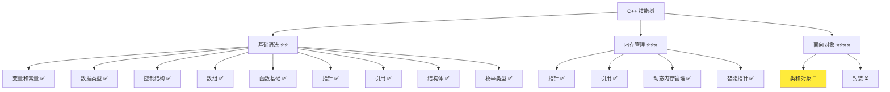
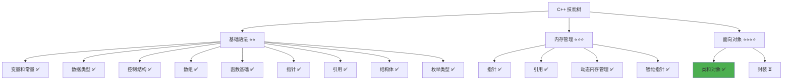

# 类和对象详解

> **学习目标**：掌握 C++ 类的定义与使用，理解面向对象编程的基础概念，学会创建和使用对象  
> **前置知识**：C++ 结构体、函数基础、引用基础  
> **预计时间**：60 分钟  
> **难度等级**：⭐⭐⭐  
> **技能收获**：类定义、成员变量、成员函数、构造函数、对象创建和使用  
> **文档版本**：v1.0  
> **最后更新**：2025-11-09

📊 **难度等级说明**

| 等级           | 描述                       | 练习题数量     | 颜色码 |
| -------------- | -------------------------- | -------------- | ------ |
| **⭐**         | 入门级，零基础可学         | 5 题基础概念题 | 🟢绿   |
| **⭐⭐**       | 基础级，需要基本编程概念   | 5 题基础概念题 | 🟡黄   |
| **⭐⭐⭐**     | 中级，需要相关技术基础     | 3 题代码分析题 | 🟠橙   |
| **⭐⭐⭐⭐**   | 高级，需要扎实的技术功底   | 3 题代码分析题 | 🔴红   |
| **⭐⭐⭐⭐⭐** | 专家级，需要丰富的项目经验 | 2 题设计思考题 | 🟣紫   |

## 1. 学习目标

### 1.1 学习动机

- **实际需求**：类是 C++ 面向对象编程的基础，理解类对编写现代、可维护的程序至关重要
- **应用场景**：数据封装、代码组织、模块化设计、构建复杂系统
- **技能价值**：学会后能更好地组织代码，实现数据封装，为后续继承、多态等高级特性打下基础
- **数据支持**：类是 C++ 面向对象编程的核心，是构建大型软件系统的基础

### 1.2 技能树位置



> **图表说明**：C++ 技能树结构图，当前文档点亮类和对象技能点

### 1.3 前置知识检查

在开始学习之前，请确认你已经掌握：

- [ ] C++ 结构体的定义和使用
- [ ] 函数的基础使用（定义、调用、参数传递）
- [ ] 引用的基础概念（const 引用）
- [ ] 基本数据类型（int、double、std::string、bool）

> **未掌握处理**：若未通过，请先复习 [结构体详解](./16-struct.md)、[函数基础详解](./12-functions.md) 和 [引用详解](./14-references.md)

## 2. 核心内容

### 2.1 概念理解

**类（Class）**：将数据和操作数据的函数组合在一起，形成一个新的数据类型。类就像一个"智能容器"，不仅能存储数据，还能定义操作这些数据的方法。

**对象（Object）**：用类创建的具体实例。就像用"汽车设计图"（类）制造出的"具体汽车"（对象）。

> **类比教学**：
>
> - **类**：像汽车的设计图，定义了汽车有哪些部件（成员变量）和功能（成员函数）
> - **对象**：像根据设计图制造出的具体汽车，每辆车都有自己的颜色、型号等属性
> - **成员变量**：类中的数据，就像设计图中的部件（发动机、轮胎等）
> - **成员函数**：类中的函数，就像设计图中的功能（启动、加速、刹车等）
> - **封装**：将数据和操作数据的函数放在一起，并通过访问控制（public/private）保护数据，就像把汽车的部件和功能都设计在一张图纸上，并且有些部件是公开的（如车门），有些是私有的（如发动机内部结构）

### 2.2 类与结构体的关系

在 C++ 中，`class` 和 `struct` 非常相似，主要区别是默认访问权限：

> **📌 访问权限说明**：
>
> - **public（公开的）**：可以在类外部访问的成员，就像公共区域，任何人都可以进入
> - **private（私有的）**：只能在类内部访问的成员，就像私人房间，只有类自己可以使用
>
> 详细说明请参考下面的 `2.3.2 访问控制` 部分。

- **struct**：默认所有成员都是 `public`（公开的）
- **class**：默认所有成员都是 `private`（私有的）

**示例对比**：

```cpp
// 使用 struct（默认 public）
struct User {
    std::string name;  // 默认 public，可以直接访问
    int age;
};

// 使用 class（默认 private）
class User {
    std::string name;  // 默认 private，不能直接访问
    int age;
};
```

**说明**：在实际开发中，`struct` 通常用于简单的数据组织，`class` 用于面向对象编程（需要封装）。

### 2.3 类的定义

#### 2.3.1 定义语法

**语法**：

```cpp
class 类名称 {
public:
    // 公开的成员（可以在类外部访问）
    成员变量;
    成员函数;

private:
    // 私有的成员（只能在类内部访问）
    成员变量;
    成员函数;
};
```

**示例**：

```cpp
// 定义用户类
class User {
public:
    // 公开的成员变量
    std::string name;
    int age;

    // 公开的成员函数
    void printInfo() {
        std::cout << "姓名: " << name << std::endl;
        std::cout << "年龄: " << age << std::endl;
    }

private:
    // 私有的成员变量（外部不能直接访问）
    std::string password;
};
```

**详细说明**：

- `class` 是关键字，用于定义类
- 类名称推荐使用 `PascalCase` 命名规范
- `public`：公开访问权限，可以在类外部访问
- `private`：私有访问权限，只能在类内部访问
- 类定义以分号 `;` 结束

#### 2.3.2 访问控制

**访问权限说明**：

- **public（公开）**：可以在类外部访问，用于提供接口
- **private（私有）**：只能在类内部访问，用于数据保护
- **protected（保护）**：将在继承章节详细讲解

**示例**：

```cpp
class User {
public:
    std::string name;           // 公开，外部可以访问
    void printInfo();           // 公开，外部可以调用

private:
    std::string password;       // 私有，外部不能访问
    void validatePassword();    // 私有，外部不能调用
};
```

### 2.4 成员变量和成员函数

#### 2.4.1 成员变量

**定义**：类中的数据，用于存储对象的状态。

**示例**：

```cpp
class User {
public:
    std::string name;           // 成员变量
    int age;                    // 成员变量
    bool isOnline;              // 成员变量
};
```

#### 2.4.2 成员函数

**定义**：类中的函数，用于操作成员变量或提供功能。

**示例**：

```cpp
class User {
public:
    std::string name;
    int age;

    // 成员函数：打印用户信息
    void printInfo() {
        std::cout << "姓名: " << name << std::endl;
        std::cout << "年龄: " << age << std::endl;
    }

    // 成员函数：设置年龄
    void setAge(int newAge) {
        age = newAge;
    }

    // 成员函数：获取年龄
    int getAge() const {
        return age;
    }
};
```

**说明**：

- 成员函数可以直接访问类的成员变量
- `const` 成员函数：表示函数不会修改成员变量（只读函数）

### 2.5 对象的创建和使用

#### 2.5.1 创建对象

C++ 中有两种创建对象的方式：栈对象和堆对象。

**方式 1：栈对象（推荐）**

**语法**：

```cpp
类名称 对象名;
```

**示例**：

```cpp
User user1;  // 在栈上创建对象，函数结束时自动销毁
```

**特点**：

- 对象在栈上分配，由编译器自动管理
- 作用域结束时自动销毁，不需要手动释放
- 简单、安全，是默认推荐的方式

**方式 2：堆对象**

**语法**：

```cpp
类名称* 指针名 = new 类名称();
```

**示例（使用 new/delete）**：

```cpp
User* user1 = new User();  // 在堆上创建对象，需要手动释放
// 使用对象...
delete user1;  // 必须手动释放
```

**示例（使用智能指针，推荐）**：

```cpp
#include <memory>

std::unique_ptr<User> user1 = std::make_unique<User>();  // 使用智能指针，自动释放
// 使用对象...
// 不需要手动 delete，智能指针会自动释放
```

**特点**：

- 对象在堆上分配，需要手动管理
- 使用 `new/delete` 必须手动释放，否则会造成内存泄漏
- 使用智能指针可以自动管理，更安全（推荐）
- 适用于需要动态分配、多态等场景

> **📌 补充说明：栈对象 vs 堆对象**：
>
> - **栈对象**：`User user1;` - 对象在栈上分配，自动管理，简单安全，是默认推荐的方式
> - **堆对象（new/delete）**：`User* user1 = new User();` - 对象在堆上分配，需要手动 `delete`，容易造成内存泄漏
> - **堆对象（智能指针）**：`std::unique_ptr<User> user1 = std::make_unique<User>();` - 对象在堆上分配，智能指针自动管理，推荐使用
> - **使用建议**：
>   - 优先使用栈对象
>   - 如果需要堆对象，优先使用智能指针（`unique_ptr` 或 `shared_ptr`）
>   - 只有在特殊情况下才使用 `new/delete`
> - **详细说明**：
>   - 关于栈和堆的详细概念，请参考 [内存管理详解](./15-memory-management.md) 中的 `2.2 栈内存 vs 堆内存` 部分
>   - 关于智能指针的详细用法，请参考 [内存管理详解](./15-memory-management.md) 中的 `2.5 智能指针` 部分

#### 2.5.2 访问成员

**访问成员变量**：

```cpp
对象名.成员变量名
```

**调用成员函数**：

```cpp
对象名.成员函数名(参数)
```

**示例**：

```cpp
User user1;

// 访问成员变量
user1.name = "张三";
user1.age = 25;

// 调用成员函数
user1.printInfo();
user1.setAge(30);
```

### 2.6 基础示例

以下代码演示了类的基本使用：

```cpp
// 现代 C++ 示例 - 类和对象基础
#include <iostream>
#include <string>

// 定义用户类
class User {
public:
    // 成员变量
    std::string name;
    int age;
    bool isOnline;

    // 成员函数：打印用户信息
    void printInfo() {
        std::cout << "=== 用户信息 ===" << std::endl;
        std::cout << "姓名: " << name << std::endl;
        std::cout << "年龄: " << age << std::endl;
        std::cout << "在线状态: " << (isOnline ? "在线" : "离线") << std::endl;
    }

    // 成员函数：设置在线状态
    void setOnline(bool status) {
        isOnline = status;
        std::cout << name << " 的状态已更新为: " << (status ? "在线" : "离线") << std::endl;
    }
};

int main() {
    // 创建对象
    User user1;

    // 设置成员变量
    user1.name = "张三";
    user1.age = 25;
    user1.isOnline = true;

    // 调用成员函数
    user1.printInfo();

    // 修改状态
    user1.setOnline(false);
    user1.printInfo();

    return 0;
}
```

#### 2.6.1 配套代码文件

项目提供了配套的源代码文件：

- **文件位置**：`src/stage1/18-classes-objects/01-basic-class.cpp`
- **文件内容**：与上面示例完全一致的程序

> **运行提示**：具体的编译运行方法请参考 [C++ 简介和快速入门](./01-cpp-introduction.md) 中的 `2.2.3 编译运行` 部分

#### 2.6.2 运行预期结果

```
=== 用户信息 ===
姓名: 张三
年龄: 25
在线状态: 在线
张三 的状态已更新为: 离线
=== 用户信息 ===
姓名: 张三
年龄: 25
在线状态: 离线
```

### 2.7 构造函数

#### 2.7.1 构造函数的概念

**构造函数（Constructor）**：在创建对象时自动调用的特殊函数，用于初始化对象的成员变量。

**特点**：

- 函数名与类名相同
- 没有返回值（连 `void` 都不写）
- 在创建对象时自动调用
- 可以重载（可以有多个构造函数）

> **📌 补充说明：函数重载是什么？**
>
> - **函数重载（Function Overloading）**：同一个函数名可以有多个不同的版本，通过参数类型或数量来区分
> - **示例**：可以定义多个构造函数，参数不同，编译器会根据传入的参数自动选择合适的构造函数
> - **简单理解**：就像同一个名字"开门"，但可以用钥匙开门、用密码开门、用指纹开门，都是"开门"但方式不同
> - **注意**：函数重载是进阶内容，当前只需要知道构造函数可以有多个版本即可，详细内容将在后续章节讲解

#### 2.7.2 构造函数的定义

**语法**：

```cpp
class 类名称 {
public:
    类名称(参数列表) {
        // 初始化代码
    }
};
```

**示例**：

```cpp
class User {
public:
    std::string name;
    int age;
    bool isOnline;

    // 构造函数：初始化成员变量
    User(const std::string& userName, int userAge) {
        name = userName;
        age = userAge;
        isOnline = false;  // 默认离线
        std::cout << "创建用户: " << name << std::endl;
    }
};
```

#### 2.7.3 使用构造函数创建对象

**语法**：

```cpp
类名称 对象名(参数);
```

**示例**：

```cpp
// 使用构造函数创建对象
User user1("张三", 25);  // 自动调用构造函数
```

#### 2.7.4 构造函数示例

```cpp
#include <iostream>
#include <string>

class User {
public:
    std::string name;
    int age;
    bool isOnline;

    // 构造函数
    User(const std::string& userName, int userAge) {
        name = userName;
        age = userAge;
        isOnline = false;
        std::cout << "创建用户: " << name << std::endl;
    }

    void printInfo() {
        std::cout << "姓名: " << name << ", 年龄: " << age << std::endl;
    }
};

int main() {
    // 使用构造函数创建对象
    User user1("张三", 25);
    User user2("李四", 30);

    user1.printInfo();
    user2.printInfo();

    return 0;
}
```

### 2.8 析构函数

#### 2.8.1 析构函数的概念

**析构函数（Destructor）**：在对象销毁时自动调用的特殊函数，用于清理资源。

**特点**：

- 函数名是 `~类名称`（波浪号 + 类名）
- 没有返回值，没有参数
- 在对象销毁时自动调用
- 每个类只能有一个析构函数

#### 2.8.2 析构函数的定义

**语法**：

```cpp
class 类名称 {
public:
    ~类名称() {
        // 清理代码
    }
};
```

**示例**：

```cpp
class User {
public:
    std::string name;

    // 构造函数
    User(const std::string& userName) {
        name = userName;
        std::cout << "创建用户: " << name << std::endl;
    }

    // 析构函数
    ~User() {
        std::cout << "销毁用户: " << name << std::endl;
    }
};
```

> **📌 说明**：对于简单的类（如上面的示例），析构函数通常不需要做任何事情，编译器会自动处理。析构函数主要用于释放动态分配的内存、关闭文件等资源清理工作。

#### 2.8.3 析构函数示例

```cpp
#include <iostream>
#include <string>

class User {
public:
    std::string name;

    User(const std::string& userName) {
        name = userName;
        std::cout << "创建用户: " << name << std::endl;
    }

    ~User() {
        std::cout << "销毁用户: " << name << std::endl;
    }
};

int main() {
    {
        User user1("张三");
        // 对象 user1 在这个代码块结束时自动销毁
    }  // 这里会调用析构函数

    std::cout << "代码块结束" << std::endl;

    return 0;
}
```

**运行结果**：

```
创建用户: 张三
销毁用户: 张三
代码块结束
```

### 2.9 类与结构体的对比

#### 2.9.1 语法对比

| 特性         | struct         | class        |
| ------------ | -------------- | ------------ |
| 默认访问权限 | public         | private      |
| 用途         | 简单的数据组织 | 面向对象编程 |
| 成员函数     | 支持           | 支持         |
| 构造函数     | 支持           | 支持         |
| 析构函数     | 支持           | 支持         |

> **📌 补充说明**：
>
> - 虽然结构体也支持成员函数、构造函数和析构函数（与类非常相似），但在 [结构体详解](./16-struct.md) 中我们专注于数据组织的基础用法，没有涉及这些特性
> - 这样设计是为了循序渐进：先掌握结构体的数据组织，再学习类的完整功能
> - 在实际开发中，如果只需要简单的数据组织，使用结构体即可；如果需要封装和成员函数，使用类更合适

#### 2.9.2 使用建议

- **使用 struct**：简单的数据组织，所有成员都是公开的，不需要数据保护（如坐标点、配置项）
- **使用 class**：需要封装和数据保护，通过 private 成员隐藏实现细节，通过 public 成员提供接口（如用户类、消息类）

> **📌 封装概念的澄清**：
>
> - **数据组织**：将相关数据放在一起（结构体也可以做到）
> - **封装（Encapsulation）**：不仅将数据和函数放在一起，更重要的是通过访问控制（private/public）来保护数据，隐藏实现细节，只暴露必要的接口
> - **为什么结构体不算封装**：虽然结构体技术上支持成员函数，但结构体默认所有成员都是 public，无法实现数据保护。真正的封装需要 private 成员来隐藏数据，通过 public 函数提供受控的访问接口
> - **类的封装**：使用 private 保护数据，使用 public 提供接口，这才是真正的封装

**示例对比**：

```cpp
// 使用 struct：简单的数据组织
struct Point {
    int x;
    int y;
};

// 使用 class：需要封装和成员函数
class User {
private:
    std::string password;  // 私有，需要保护

public:
    std::string name;
    void setPassword(const std::string& pwd);  // 通过函数设置密码
};
```

### 2.10 关键特性与设计原理

#### 2.10.1 关键特性

1. **数据封装**：将数据和操作数据的函数组合在一起
2. **访问控制**：通过 `public` 和 `private` 控制成员的访问权限
3. **自动初始化**：构造函数在创建对象时自动调用
4. **自动清理**：析构函数在对象销毁时自动调用

#### 2.10.2 设计原理

- **为什么这样设计**：类提供了数据封装和代码组织的方式，让代码更清晰、易维护
- **解决了什么问题**：避免了数据与操作分离的问题，提供了更好的代码组织方式
- **有什么优势**：代码清晰、易于维护、支持封装、为继承和多态打下基础

### 2.11 常见陷阱和注意事项

#### 2.11.1 常见错误

**错误 1：忘记类定义后的分号**

```cpp
class User {
    std::string name;
}  // 错误！缺少分号
```

**正确做法**：

```cpp
class User {
    std::string name;
};  // 正确！必须有分号
```

**错误 2：访问私有成员**

```cpp
class User {
private:
    std::string password;
};

User user;
user.password = "123456";  // 错误！password 是私有的
```

**正确做法**：

```cpp
class User {
private:
    std::string password;

public:
    void setPassword(const std::string& pwd) {
        password = pwd;  // 在类内部可以访问私有成员
    }
};

User user;
user.setPassword("123456");  // 正确！通过公开函数设置
```

**错误 3：构造函数有返回类型**

```cpp
class User {
    void User() {  // 错误！构造函数不能有返回类型
        // ...
    }
};
```

**正确做法**：

```cpp
class User {
public:
    User() {  // 正确！构造函数没有返回类型
        // ...
    }
};
```

**最佳实践**：

1. **合理使用访问控制**：需要保护的成员设为 `private`，提供接口的成员设为 `public`
2. **使用构造函数初始化**：在构造函数中初始化成员变量，避免未初始化的对象
3. **命名规范**：类名使用 `PascalCase`，成员变量和成员函数使用 `camelCase`
4. **成员函数使用 const**：不修改成员变量的函数使用 `const` 修饰

## 3. 实践应用

### 3.1 项目场景

在 QtLanChat 项目中，类用于：

- **用户管理**：定义 `User` 类，封装用户信息和操作
- **消息处理**：定义 `Message` 类，封装消息数据和操作
- **系统管理**：定义各种管理类，封装系统功能
- **模块化设计**：将相关功能组织成类，提高代码可维护性

### 3.2 实际代码

以下代码展示了类在 QtLanChat 项目中的实际应用：

```cpp
// 项目中的实际应用示例
#include <iostream>
#include <string>
#include <vector>

// 用户类
class User {
public:
    std::string name;
    int age;
    bool isOnline;

    // 构造函数
    User(const std::string& userName, int userAge) {
        name = userName;
        age = userAge;
        isOnline = false;
    }

    // 成员函数：打印用户信息
    void printInfo() {
        std::cout << "=== 用户信息 ===" << std::endl;
        std::cout << "姓名: " << name << std::endl;
        std::cout << "年龄: " << age << std::endl;
        std::cout << "在线状态: " << (isOnline ? "在线" : "离线") << std::endl;
    }

    // 成员函数：设置在线状态
    void setOnline(bool status) {
        isOnline = status;
        std::cout << name << " 的状态已更新为: " << (status ? "在线" : "离线") << std::endl;
    }
};

// 消息类
class Message {
public:
    std::string sender;
    std::string content;
    int timestamp;

    // 构造函数
    Message(const std::string& from, const std::string& msg) {
        sender = from;
        content = msg;
        timestamp = 1234567890;  // 简化时间戳
    }

    // 成员函数：打印消息
    void printMessage() {
        std::cout << "[" << sender << "]: " << content << std::endl;
    }
};

// 用户管理类
class UserManager {
private:
    std::vector<User> users;

public:
    // 成员函数：添加用户
    void addUser(const std::string& name, int age) {
        users.push_back(User(name, age));
        std::cout << "添加用户: " << name << std::endl;
    }

    // 成员函数：显示所有用户
    void printAllUsers() {
        std::cout << "\n=== 用户列表 ===" << std::endl;
        for (size_t i = 0; i < users.size(); i++) {
            users[i].printInfo();
            std::cout << std::endl;
        }
    }
};

int main() {
    std::cout << "=== QtLanChat 类和对象应用 ===" << std::endl;

    // 创建用户对象
    User user1("张三", 25);
    user1.setOnline(true);
    user1.printInfo();

    // 创建消息对象
    Message msg1("张三", "你好，大家好！");
    msg1.printMessage();

    // 使用用户管理类
    UserManager manager;
    manager.addUser("李四", 30);
    manager.addUser("王五", 28);
    manager.printAllUsers();

    return 0;
}
```

> **配套代码**：实际应用示例的完整代码位于 `src/stage1/18-classes-objects/02-project-example.cpp`

### 3.3 设计思路

- **为什么选择这种设计**：使用类组织代码，实现数据封装和功能模块化，代码更清晰、易维护
- **解决了什么问题**：避免了数据与操作分离的问题，提供了更好的代码组织方式
- **有什么优势**：代码清晰、易于维护、支持封装、便于扩展

## 4. 练习与测试

### 4.1 练习题

#### 练习 1：定义和使用类

**题目**：定义一个 `Student` 类，包含姓名、年龄、成绩，并实现打印信息的功能。

**要求**：

- 定义 `Student` 类，包含 `name`（std::string）、`age`（int）、`score`（double）
- 实现 `printInfo()` 成员函数，打印学生信息
- 创建两个学生对象并输出信息

**参考答案**：

```cpp
#include <iostream>
#include <string>

class Student {
public:
    std::string name;
    int age;
    double score;

    void printInfo() {
        std::cout << "姓名: " << name << std::endl;
        std::cout << "年龄: " << age << std::endl;
        std::cout << "成绩: " << score << std::endl;
    }
};

int main() {
    Student student1;
    student1.name = "张三";
    student1.age = 20;
    student1.score = 85.5;

    Student student2;
    student2.name = "李四";
    student2.age = 21;
    student2.score = 92.0;

    student1.printInfo();
    std::cout << std::endl;
    student2.printInfo();

    return 0;
}
```

> **配套代码**：练习 1 的完整代码位于 `src/stage1/18-classes-objects/03-exercise-student.cpp`

#### 练习 2：构造函数的使用

**题目**：为 `Student` 类添加构造函数，使用构造函数创建学生对象。

**要求**：

- 添加构造函数，接受姓名、年龄、成绩作为参数
- 使用构造函数创建学生对象
- 实现打印信息的功能

**参考答案**：

```cpp
#include <iostream>
#include <string>

class Student {
public:
    std::string name;
    int age;
    double score;

    // 构造函数
    Student(const std::string& studentName, int studentAge, double studentScore) {
        name = studentName;
        age = studentAge;
        score = studentScore;
    }

    void printInfo() {
        std::cout << "姓名: " << name << ", 年龄: " << age
                  << ", 成绩: " << score << std::endl;
    }
};

int main() {
    // 使用构造函数创建对象
    Student student1("张三", 20, 85.5);
    Student student2("李四", 21, 92.0);

    student1.printInfo();
    student2.printInfo();

    return 0;
}
```

> **配套代码**：练习 2 的完整代码位于 `src/stage1/18-classes-objects/04-exercise-constructor.cpp`

#### 练习 3：成员函数的使用

**题目**：为 `Student` 类添加设置和获取成绩的成员函数。

**要求**：

- 添加 `setScore()` 成员函数，用于设置成绩
- 添加 `getScore()` 成员函数，用于获取成绩
- 测试设置和获取功能

**参考答案**：

```cpp
#include <iostream>
#include <string>

class Student {
public:
    std::string name;
    int age;
    double score;

    Student(const std::string& studentName, int studentAge, double studentScore) {
        name = studentName;
        age = studentAge;
        score = studentScore;
    }

    // 设置成绩
    void setScore(double newScore) {
        score = newScore;
    }

    // 获取成绩
    double getScore() const {
        return score;
    }

    void printInfo() {
        std::cout << "姓名: " << name << ", 成绩: " << score << std::endl;
    }
};

int main() {
    Student student1("张三", 20, 85.5);

    std::cout << "修改前：" << std::endl;
    student1.printInfo();

    student1.setScore(95.0);

    std::cout << "\n修改后：" << std::endl;
    std::cout << "成绩: " << student1.getScore() << std::endl;

    return 0;
}
```

> **配套代码**：练习 3 的完整代码位于 `src/stage1/18-classes-objects/05-exercise-member-functions.cpp`

### 4.2 测试题（可选）

1. **关于类和对象，下列说法正确的是：**
   A. 类就是对象

   B. 对象是类的实例

   C. 类不能有成员函数

   D. 对象不能调用成员函数
   **答案**：B

   **解析**：
   - **正确答案 B**：对象是用类创建的具体实例
   - **错误答案 A**：类是类型定义，对象是具体实例
   - **错误答案 C/D**：类可以有成员函数，对象可以调用成员函数

2. **关于构造函数，下列说法正确的是：**
   A. 构造函数可以有返回值

   B. 构造函数在对象销毁时调用

   C. 构造函数用于初始化对象

   D. 构造函数名可以任意
   **答案**：C

   **解析**：
   - **正确答案 C**：构造函数用于初始化对象的成员变量
   - **错误答案 A**：构造函数没有返回值
   - **错误答案 B**：析构函数在对象销毁时调用
   - **错误答案 D**：构造函数名必须与类名相同

3. **关于访问控制，下列说法正确的是：**
   A. private 成员可以在类外部访问

   B. public 成员只能在类内部访问

   C. private 成员只能在类内部访问

   D. 所有成员默认都是 public
   **答案**：C

   **解析**：
   - **正确答案 C**：private 成员只能在类内部访问
   - **错误答案 A/B/D**：private 成员不能在外部访问，public 成员可以在外部访问，class 默认是 private

### 4.3 常见问题 FAQ

- Q1：类和结构体有什么区别？
  - **A：**主要区别是默认访问权限：struct 默认是 public，class 默认是 private。struct 通常用于简单的数据组织，class 用于面向对象编程。

- Q2：构造函数必须定义吗？
  - **A：**不是必须的。如果不定义构造函数，编译器会提供一个默认构造函数（无参数）。但建议定义构造函数来初始化成员变量。

- Q3：析构函数必须定义吗？
  - **A：**对于简单的类，通常不需要定义析构函数。只有在需要释放动态分配的内存、关闭文件等资源清理时才需要定义。

- Q4：成员函数可以在类外部定义吗？
  - **A：**可以。可以在类内声明，在类外定义。但需要在函数名前加上 `类名::`。

- Q5：一个类可以创建多个对象吗？
  - **A：**可以。一个类可以创建多个对象，每个对象都有自己独立的成员变量副本。

## 5. 资源与扩展

### 5.1 基础资源

- **官方文档**：[C++ 类](https://en.cppreference.com/w/cpp/language/class)
- **权威书籍**：《C++ Primer》- 第 7 章
- **在线教程**：[learncpp.com](https://www.learncpp.com/) - 类和对象教程

### 5.2 多媒体学习

- **视频资源**：[C++ 类和对象详解](https://www.youtube.com/results?search_query=C%2B%2B+class+object+tutorial)
- **开发者资源**：[cppreference.com](https://en.cppreference.com/) - 权威参考

## 6. 课后作业及参考答案

### 6.1 学习检查清单

- [ ] 能够定义类
- [ ] 能够创建和使用对象
- [ ] 能够定义和使用成员变量
- [ ] 能够定义和使用成员函数
- [ ] 能够定义和使用构造函数
- [ ] 能够理解访问控制（public、private）
- [ ] 能够理解类与结构体的区别

### 6.2 综合练习

**作业题目**：编写一个简单的图书管理系统

**要求**：

- 定义 `Book` 类，包含书名、作者、价格、库存数量
- 实现构造函数，用于初始化图书信息
- 实现 `printInfo()` 成员函数，打印图书信息
- 实现 `updateStock()` 成员函数，更新库存数量
- 创建多个图书对象并测试功能

**时间估算**：40 分钟

**参考答案**：

```cpp
#include <iostream>
#include <string>
#include <vector>

class Book {
public:
    std::string title;
    std::string author;
    double price;
    int stock;

    // 构造函数
    Book(const std::string& bookTitle, const std::string& bookAuthor,
         double bookPrice, int bookStock) {
        title = bookTitle;
        author = bookAuthor;
        price = bookPrice;
        stock = bookStock;
    }

    // 打印图书信息
    void printInfo() {
        std::cout << "《" << title << "》" << std::endl;
        std::cout << "  作者: " << author << std::endl;
        std::cout << "  价格: " << price << " 元" << std::endl;
        std::cout << "  库存: " << stock << " 本" << std::endl;
    }

    // 更新库存
    void updateStock(int newStock) {
        stock = newStock;
        std::cout << "《" << title << "》的库存已更新为: " << stock << " 本" << std::endl;
    }
};

int main() {
    std::vector<Book> books;

    // 创建图书对象
    books.push_back(Book("C++ Primer", "Stanley B. Lippman", 128.0, 10));
    books.push_back(Book("Effective C++", "Scott Meyers", 89.0, 5));
    books.push_back(Book("The C++ Programming Language", "Bjarne Stroustrup", 158.0, 8));

    // 显示所有图书
    std::cout << "=== 图书列表 ===" << std::endl;
    for (size_t i = 0; i < books.size(); i++) {
        std::cout << (i + 1) << ". ";
        books[i].printInfo();
        std::cout << std::endl;
    }

    // 更新库存
    std::cout << "=== 更新库存 ===" << std::endl;
    books[0].updateStock(15);
    books[0].printInfo();

    return 0;
}
```

**评分标准**：功能实现（40%）、类使用正确（30%）、代码质量（30%）

## 7. 下一步学习

**下一篇**：[19-encapsulation.md](./19-encapsulation.md)

**学习路径**：

1. ✅ C++ 简介和快速入门 - 已完成
2. ✅ 变量和常量 - 已完成
3. ✅ 数据类型详解 - 已完成
4. ✅ 运算符详解 - 已完成
5. ✅ if 分支详解 - 已完成
6. ✅ while 循环 - 已完成
7. ✅ for 循环 - 已完成
8. ✅ switch 分支 - 已完成
9. ✅ 数组基础 - 已完成
10. ✅ std::vector - 已完成
11. ✅ 字符串进阶 - 已完成
12. ✅ 函数基础 - 已完成
13. ✅ 指针详解 - 已完成
14. ✅ 引用详解 - 已完成
15. ✅ 内存管理 - 已完成
16. ✅ 结构体 - 已完成
17. ✅ 枚举类型 - 已完成
18. ✅ 类和对象 - 已完成
19. 🔄 封装 - 下一步

**技能树更新**：



**学习成果**：

- **独立编写**：能够定义类、创建对象、使用成员变量和成员函数
- **解释原理**：能够解释类的作用、构造函数和析构函数的作用
- **解决实际问题**：能够使用类组织代码，实现数据封装
- **应用到项目**：为后续封装、继承、多态等高级特性打下基础
- **掌握度自评**：80%

### 学习成果指导

> **自评指导**：
>
> - **<50%**：建议复习类的基础概念，重新阅读文档核心内容
> - **50-80%**：继续学习，完成练习题巩固理解
> - **>80%**：可以进入下一阶段学习，开始封装学习

---

**文档质量检查**：

- [x] 学习目标明确且可验证
- [x] 代码示例可运行
- [x] 练习题有答案
- [x] 技能收获明确
- [x] 抽象概念配有生活化比喻
- [x] 比喻体系一致，避免概念混乱
- [x] 文档长度符合难度等级要求
