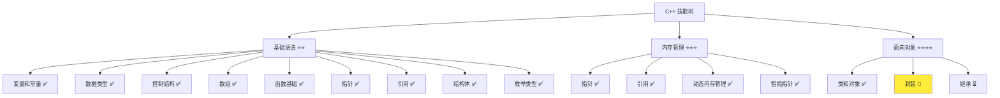
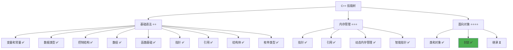

# 封装详解

> **学习目标**：掌握 C++ 封装的概念和实现，理解数据隐藏和接口设计，学会使用 getter/setter 模式  
> **前置知识**：C++ 类和对象、访问控制（public、private）  
> **预计时间**：50 分钟  
> **难度等级**：⭐⭐⭐  
> **技能收获**：封装概念、访问控制、getter/setter 模式、数据隐藏、接口设计  
> **文档版本**：v1.0  
> **最后更新**：2025-11-09

📊 **难度等级说明**

| 等级           | 描述                       | 练习题数量     | 颜色码 |
| -------------- | -------------------------- | -------------- | ------ |
| **⭐**         | 入门级，零基础可学         | 5 题基础概念题 | 🟢绿   |
| **⭐⭐**       | 基础级，需要基本编程概念   | 5 题基础概念题 | 🟡黄   |
| **⭐⭐⭐**     | 中级，需要相关技术基础     | 3 题代码分析题 | 🟠橙   |
| **⭐⭐⭐⭐**   | 高级，需要扎实的技术功底   | 3 题代码分析题 | 🔴红   |
| **⭐⭐⭐⭐⭐** | 专家级，需要丰富的项目经验 | 2 题设计思考题 | 🟣紫   |

## 1. 学习目标

### 1.1 学习动机

- **实际需求**：封装是面向对象编程的核心特性之一，理解封装对编写安全、可维护的程序至关重要
- **应用场景**：数据保护、接口设计、隐藏实现细节、提高代码安全性
- **技能价值**：学会后能更好地保护数据，设计清晰的接口，提高代码的可维护性和安全性
- **数据支持**：封装是面向对象编程的三大特性之一（封装、继承、多态），是构建大型软件系统的基础

### 1.2 技能树位置



> **图表说明**：C++ 技能树结构图，当前文档点亮封装技能点

### 1.3 前置知识检查

在开始学习之前，请确认你已经掌握：

- [ ] C++ 类的定义和使用
- [ ] 访问控制（public、private）的概念
- [ ] 成员变量和成员函数的使用
- [ ] 构造函数的基础使用

> **未掌握处理**：若未通过，请先复习 [类和对象详解](./18-classes-objects.md)

## 2. 核心内容

### 2.1 概念理解

**封装（Encapsulation）**：将数据和操作数据的函数组合在一起，并通过访问控制（private/public）来保护数据，隐藏实现细节，只暴露必要的接口。

> **类比教学**：
>
> - **封装**：像银行的保险箱，重要的数据（如密码、余额）被锁在保险箱里（private），只有通过特定的接口（如 ATM 机、柜台）才能访问
> - **数据隐藏**：将敏感数据设为 private，就像把贵重物品锁在保险箱里，外部无法直接访问
> - **接口设计**：通过 public 函数提供受控的访问，就像银行提供 ATM 机、柜台等服务，而不是直接打开保险箱
> - **getter/setter**：像银行的工作人员，通过特定的流程（getter 获取、setter 设置）来操作数据，而不是直接操作

### 2.2 为什么需要封装

#### 2.2.1 数据保护

**问题**：如果不使用封装，数据可能被意外修改或访问。

**示例（未封装）**：

```cpp
class User {
public:
    std::string name;
    int age;
    std::string password;           // 危险！密码是公开的
};

int main() {
    User user;
    user.password = "123456";       // 任何人都可以直接修改密码
    std::cout << user.password;     // 任何人都可以直接查看密码
    return 0;
}
```

**问题**：

- 密码是敏感数据，不应该被直接访问
- 无法验证密码的合法性（如长度、复杂度）
- 无法控制密码的修改方式

#### 2.2.2 封装的优势

**使用封装后**：

```cpp
class User {
private:
    std::string password;           // 私有，外部无法直接访问

public:
    std::string name;
    int age;

    // 通过函数设置密码（可以验证）
    void setPassword(const std::string& pwd) {
        if (pwd.length() >= 6) {    // 验证密码长度
            password = pwd;
        } else {
            std::cout << "密码长度至少 6 位" << std::endl;
        }
    }

    // 通过函数获取密码（可以控制访问）
    bool checkPassword(const std::string& pwd) const {
        return password == pwd;     // 不直接返回密码，而是验证
    }
};
```

**优势**：

- **数据保护**：密码是私有的，外部无法直接访问
- **数据验证**：可以在 setter 中验证数据的合法性
- **接口控制**：只暴露必要的接口，隐藏实现细节

### 2.3 访问控制详解

#### 2.3.1 public（公开）

**定义**：可以在类外部访问的成员。

**用途**：

- 提供类的接口（如 getter、setter 函数）
- 允许外部访问的成员变量（通常不推荐，除非是常量）

**示例**：

```cpp
class User {
public:
    std::string name;               // 公开的成员变量
    void printInfo();               // 公开的成员函数
};
```

#### 2.3.2 private（私有）

**定义**：只能在类内部访问的成员。

**用途**：

- 保护敏感数据（如密码、内部状态）
- 隐藏实现细节（如辅助函数）

**示例**：

```cpp
class User {
private:
    std::string password;           // 私有的成员变量
    void validatePassword();        // 私有的成员函数
};
```

#### 2.3.3 protected（保护）

**定义**：可以在类内部和派生类中访问的成员。

**说明**：将在继承章节详细讲解，当前只需要知道它的存在即可。

### 2.4 Getter 和 Setter 模式

#### 2.4.1 Getter（获取器）

**定义**：用于获取私有成员变量值的公开函数。

**命名规范**：通常以 `get` 开头，如 `getName()`、`getAge()`

**示例**：

```cpp
class User {
private:
    std::string name;
    int age;

public:
    // Getter：获取姓名
    std::string getName() const {
        return name;
    }

    // Getter：获取年龄
    int getAge() const {
        return age;
    }
};
```

**特点**：

- 通常使用 `const` 修饰（不修改成员变量）
- 返回成员变量的值或引用
- 可以在返回前进行格式化或验证

#### 2.4.2 Setter（设置器）

**定义**：用于设置私有成员变量值的公开函数。

**命名规范**：通常以 `set` 开头，如 `setName()`、`setAge()`

**示例**：

```cpp
class User {
private:
    std::string name;
    int age;

public:
    // Setter：设置姓名
    void setName(const std::string& newName) {
        if (!newName.empty()) {  // 验证姓名不为空
            name = newName;
        }
    }

    // Setter：设置年龄
    void setAge(int newAge) {
        if (newAge > 0 && newAge < 150) {  // 验证年龄范围
            age = newAge;
        } else {
            std::cout << "年龄必须在 0-150 之间" << std::endl;
        }
    }
};
```

**特点**：

- 可以在设置前验证数据的合法性
- 可以记录修改日志
- 可以触发相关操作（如通知、更新）

#### 2.4.3 Getter/Setter 完整示例

```cpp
#include <iostream>
#include <string>

class User {
private:
    std::string name;
    int age;
    std::string password;

public:
    // 构造函数
    User(const std::string& userName, int userAge) {
        name = userName;
        age = userAge;
        password = "";
    }

    // Getter：获取姓名
    std::string getName() const {
        return name;
    }

    // Getter：获取年龄
    int getAge() const {
        return age;
    }

    // Setter：设置姓名
    void setName(const std::string& newName) {
        if (!newName.empty()) {
            name = newName;
        }
    }

    // Setter：设置年龄
    void setAge(int newAge) {
        if (newAge > 0 && newAge < 150) {
            age = newAge;
        }
    }

    // Setter：设置密码（带验证）
    void setPassword(const std::string& pwd) {
        if (pwd.length() >= 6) {
            password = pwd;
            std::cout << "密码设置成功" << std::endl;
        } else {
            std::cout << "密码长度至少 6 位" << std::endl;
        }
    }

    // 验证密码（不直接返回密码）
    bool checkPassword(const std::string& pwd) const {
        return password == pwd;
    }

    // 打印用户信息
    void printInfo() const {
        std::cout << "姓名: " << name << std::endl;
        std::cout << "年龄: " << age << std::endl;
    }
};

int main() {
    User user("张三", 25);

    // 使用 Getter 获取信息
    std::cout << "姓名: " << user.getName() << std::endl;
    std::cout << "年龄: " << user.getAge() << std::endl;

    // 使用 Setter 修改信息
    user.setName("李四");
    user.setAge(30);
    user.setPassword("123456");

    // 验证密码
    if (user.checkPassword("123456")) {
        std::cout << "密码正确" << std::endl;
    }

    user.printInfo();

    return 0;
}
```

#### 2.4.4 配套代码文件

项目提供了配套的源代码文件：

- **文件位置**：`src/stage1/19-encapsulation/01-basic-encapsulation.cpp`
- **文件内容**：与上面示例完全一致的程序

> **运行提示**：具体的编译运行方法请参考 [C++ 简介和快速入门](./01-cpp-introduction.md) 中的 `2.2.3 编译运行` 部分

#### 2.4.5 运行预期结果

```
姓名: 张三
年龄: 25
密码设置成功
密码正确
姓名: 李四
年龄: 30
```

### 2.5 封装的优势

#### 2.5.1 数据保护

- **防止意外修改**：私有成员变量无法被外部直接修改
- **数据验证**：可以在 setter 中验证数据的合法性
- **访问控制**：可以控制哪些数据可以被访问，哪些不能

#### 2.5.2 接口设计

- **清晰的接口**：通过 public 函数提供清晰的接口
- **隐藏实现**：实现细节隐藏在 private 中，外部不需要关心
- **易于维护**：修改实现细节不影响外部代码

#### 2.5.3 代码组织

- **逻辑集中**：数据和操作数据的函数放在一起
- **职责明确**：每个类负责自己的数据管理
- **易于理解**：代码结构更清晰，易于理解

### 2.6 封装的最佳实践

#### 2.6.1 数据成员设为 private

**原则**：除非有特殊原因，否则成员变量应该设为 private。

**示例**：

```cpp
class User {
private:
    std::string name;               // 推荐：设为 private
    int age;                        // 推荐：设为 private

public:
    // 通过 getter/setter 访问
    std::string getName() const { return name; }
    void setName(const std::string& n) { name = n; }
};
```

#### 2.6.2 提供必要的 Getter/Setter

**原则**：只为需要外部访问的成员变量提供 getter/setter。

**示例**：

```cpp
class User {
private:
    std::string name;
    int age;
    std::string password;           // 不需要 getter（安全考虑）
    int loginCount;                 // 不需要 getter/setter（内部使用）

public:
    // 提供必要的 getter/setter
    std::string getName() const { return name; }
    void setName(const std::string& n) { name = n; }
    int getAge() const { return age; }
    void setAge(int a) { age = a; }
    // password 和 loginCount 不需要 getter/setter
};
```

#### 2.6.3 在 Setter 中验证数据

**原则**：在 setter 中验证数据的合法性，确保数据的有效性。

**示例**：

```cpp
void setAge(int newAge) {
    if (newAge > 0 && newAge < 150) {
        age = newAge;
    } else {
        std::cout << "年龄无效" << std::endl;
    }
}
```

#### 2.6.4 使用 const 修饰 Getter

**原则**：getter 函数应该使用 `const` 修饰，表示不会修改对象。

**示例**：

```cpp
std::string getName() const {       // 使用 const
    return name;
}
```

### 2.7 常见陷阱和注意事项

#### 2.7.1 常见错误

**错误 1：忘记将敏感数据设为 private**

```cpp
class User {
public:
    std::string password;           // 错误！密码应该是私有的
};
```

**正确做法**：

```cpp
class User {
private:
    std::string password;           // 正确！密码是私有的

public:
    void setPassword(const std::string& pwd);
};
```

**错误 2：Getter 返回私有成员的引用（允许修改）**

```cpp
class User {
private:
    std::string name;

public:
    std::string& getName() {        // 错误！返回引用允许外部修改
        return name;
    }
};
```

**正确做法**：

```cpp
class User {
private:
    std::string name;

public:
    std::string getName() const {   // 正确！返回值，不允许修改
        return name;
    }
};
```

**错误 3：Setter 不验证数据**

```cpp
void setAge(int newAge) {
    age = newAge;                   // 错误！没有验证数据
}
```

**正确做法**：

```cpp
void setAge(int newAge) {
    if (newAge > 0 && newAge < 150) {  // 正确！验证数据
        age = newAge;
    }
}
```

**最佳实践**：

1. **敏感数据设为 private**：密码、内部状态等应该设为 private
2. **提供必要的接口**：只为需要外部访问的成员提供 getter/setter
3. **验证数据**：在 setter 中验证数据的合法性
4. **使用 const**：getter 函数使用 const 修饰
5. **避免返回引用**：getter 通常返回值而不是引用，避免外部修改

## 3. 实践应用

### 3.1 项目场景

在 QtLanChat 项目中，封装用于：

- **用户信息保护**：保护用户的密码、敏感信息
- **数据验证**：验证用户输入的数据（如用户名长度、密码复杂度）
- **接口设计**：提供清晰的接口，隐藏实现细节
- **状态管理**：管理对象的内部状态，控制状态的修改

### 3.2 实际代码

以下代码展示了封装在 QtLanChat 项目中的实际应用：

```cpp
// 项目中的实际应用示例
#include <iostream>
#include <string>
#include <vector>

// 用户类（使用封装）
class User {
private:
    std::string name;
    int age;
    std::string password;
    bool isOnline;

public:
    // 构造函数
    User(const std::string& userName, int userAge) {
        name = userName;
        age = userAge;
        password = "";
        isOnline = false;
    }

    // Getter：获取姓名
    std::string getName() const {
        return name;
    }

    // Getter：获取年龄
    int getAge() const {
        return age;
    }

    // Getter：获取在线状态
    bool getIsOnline() const {
        return isOnline;
    }

    // Setter：设置姓名（带验证）
    void setName(const std::string& newName) {
        if (!newName.empty() && newName.length() <= 50) {
            name = newName;
        } else {
            std::cout << "姓名长度必须在 1-50 之间" << std::endl;
        }
    }

    // Setter：设置年龄（带验证）
    void setAge(int newAge) {
        if (newAge > 0 && newAge < 150) {
            age = newAge;
        } else {
            std::cout << "年龄必须在 0-150 之间" << std::endl;
        }
    }

    // Setter：设置密码（带验证）
    void setPassword(const std::string& pwd) {
        if (pwd.length() >= 6) {
            password = pwd;
            std::cout << "密码设置成功" << std::endl;
        } else {
            std::cout << "密码长度至少 6 位" << std::endl;
        }
    }

    // 验证密码
    bool checkPassword(const std::string& pwd) const {
        return password == pwd;
    }

    // 设置在线状态
    void setOnline(bool status) {
        isOnline = status;
        std::cout << name << " 的状态已更新为: " << (status ? "在线" : "离线") << std::endl;
    }

    // 打印用户信息
    void printInfo() const {
        std::cout << "=== 用户信息 ===" << std::endl;
        std::cout << "姓名: " << name << std::endl;
        std::cout << "年龄: " << age << std::endl;
        std::cout << "在线状态: " << (isOnline ? "在线" : "离线") << std::endl;
    }
};

// 用户管理类（使用封装）
class UserManager {
private:
    std::vector<User> users;

public:
    // 添加用户
    void addUser(const std::string& name, int age) {
        users.push_back(User(name, age));
        std::cout << "添加用户: " << name << std::endl;
    }

    // 查找用户（按姓名）
    User* findUser(const std::string& name) {
        for (size_t i = 0; i < users.size(); i++) {
            if (users[i].getName() == name) {
                return &users[i];
            }
        }
        return nullptr;
    }

    // 显示所有用户
    void printAllUsers() {
        std::cout << "\n=== 用户列表 ===" << std::endl;
        for (size_t i = 0; i < users.size(); i++) {
            users[i].printInfo();
            std::cout << std::endl;
        }
    }
};

int main() {
    std::cout << "=== QtLanChat 封装应用 ===" << std::endl;

    // 创建用户
    User user1("张三", 25);
    user1.setPassword("123456");
    user1.setOnline(true);
    user1.printInfo();

    // 使用 getter 获取信息
    std::cout << "\n使用 getter 获取信息：" << std::endl;
    std::cout << "姓名: " << user1.getName() << std::endl;
    std::cout << "年龄: " << user1.getAge() << std::endl;
    std::cout << "在线状态: " << (user1.getIsOnline() ? "在线" : "离线") << std::endl;

    // 使用 setter 修改信息（带验证）
    std::cout << "\n使用 setter 修改信息：" << std::endl;
    user1.setName("李四");
    user1.setAge(30);
    user1.setPassword("123");       // 密码太短，会被拒绝
    user1.setPassword("12345678");  // 密码有效

    // 验证密码
    if (user1.checkPassword("12345678")) {
        std::cout << "密码验证成功" << std::endl;
    }

    // 使用用户管理类
    UserManager manager;
    manager.addUser("王五", 28);
    manager.addUser("赵六", 32);
    manager.printAllUsers();

    return 0;
}
```

> **配套代码**：实际应用示例的完整代码位于 `src/stage1/19-encapsulation/02-project-example.cpp`

### 3.3 设计思路

- **为什么选择这种设计**：使用封装保护数据，通过 getter/setter 提供受控的访问接口，提高代码的安全性和可维护性
- **解决了什么问题**：避免了数据被意外修改的问题，提供了数据验证机制，隐藏了实现细节
- **有什么优势**：数据安全、接口清晰、易于维护、便于扩展

## 4. 练习与测试

### 4.1 练习题

#### 练习 1：实现 Getter/Setter

**题目**：为 `Student` 类实现 getter/setter，保护成员变量。

**要求**：

- 将 `name`、`age`、`score` 设为 private
- 实现 `getName()`、`getAge()`、`getScore()` getter 函数
- 实现 `setName()`、`setAge()`、`setScore()` setter 函数（带验证）
- 在 setter 中验证数据（姓名不为空，年龄在 0-150 之间，成绩在 0-100 之间）

**参考答案**：

```cpp
#include <iostream>
#include <string>

class Student {
private:
    std::string name;
    int age;
    double score;

public:
    // 构造函数
    Student(const std::string& studentName, int studentAge, double studentScore) {
        name = studentName;
        age = studentAge;
        score = studentScore;
    }

    // Getter
    std::string getName() const {
        return name;
    }

    int getAge() const {
        return age;
    }

    double getScore() const {
        return score;
    }

    // Setter（带验证）
    void setName(const std::string& newName) {
        if (!newName.empty()) {
            name = newName;
        }
    }

    void setAge(int newAge) {
        if (newAge > 0 && newAge < 150) {
            age = newAge;
        }
    }

    void setScore(double newScore) {
        if (newScore >= 0 && newScore <= 100) {
            score = newScore;
        }
    }

    void printInfo() const {
        std::cout << "姓名: " << name << ", 年龄: " << age
                  << ", 成绩: " << score << std::endl;
    }
};

int main() {
    Student student("张三", 20, 85.5);

    // 使用 getter
    std::cout << "姓名: " << student.getName() << std::endl;
    std::cout << "年龄: " << student.getAge() << std::endl;

    // 使用 setter（带验证）
    student.setName("李四");
    student.setAge(25);
    student.setScore(95.0);

    student.printInfo();

    return 0;
}
```

> **配套代码**：练习 1 的完整代码位于 `src/stage1/19-encapsulation/03-exercise-getter-setter.cpp`

#### 练习 2：保护敏感数据

**题目**：为 `Account` 类实现密码保护，不允许直接访问密码。

**要求**：

- 将 `password` 设为 private
- 实现 `setPassword()` 函数（验证密码长度至少 6 位）
- 实现 `checkPassword()` 函数（验证密码，不直接返回密码）
- 不允许直接获取密码

**参考答案**：

```cpp
#include <iostream>
#include <string>

class Account {
private:
    std::string username;
    std::string password;

public:
    Account(const std::string& user, const std::string& pwd) {
        username = user;
        password = pwd;
    }

    std::string getUsername() const {
        return username;
    }

    void setPassword(const std::string& pwd) {
        if (pwd.length() >= 6) {
            password = pwd;
            std::cout << "密码设置成功" << std::endl;
        } else {
            std::cout << "密码长度至少 6 位" << std::endl;
        }
    }

    bool checkPassword(const std::string& pwd) const {
        return password == pwd;
    }
};

int main() {
    Account account("张三", "123456");

    // 可以获取用户名
    std::cout << "用户名: " << account.getUsername() << std::endl;

    // 可以设置密码（带验证）
    account.setPassword("123");  // 会被拒绝
    account.setPassword("12345678");  // 成功

    // 可以验证密码，但不能直接获取
    if (account.checkPassword("12345678")) {
        std::cout << "密码正确" << std::endl;
    }

    return 0;
}
```

> **配套代码**：练习 2 的完整代码位于 `src/stage1/19-encapsulation/04-exercise-password-protection.cpp`

#### 练习 3：封装完整应用

**题目**：实现一个 `BankAccount` 类，使用封装保护余额和交易记录。

**要求**：

- 将 `balance`（余额）和 `transactionCount`（交易次数）设为 private
- 实现 `getBalance()` getter（只读）
- 实现 `deposit()`（存款）和 `withdraw()`（取款）函数
- 在取款时验证余额是否足够
- 记录交易次数

**参考答案**：

```cpp
#include <iostream>
#include <string>

class BankAccount {
private:
    double balance;
    int transactionCount;

public:
    BankAccount(double initialBalance) {
        balance = initialBalance;
        transactionCount = 0;
    }

    double getBalance() const {
        return balance;
    }

    int getTransactionCount() const {
        return transactionCount;
    }

    void deposit(double amount) {
        if (amount > 0) {
            balance += amount;
            transactionCount++;
            std::cout << "存款 " << amount << " 元，余额: " << balance << std::endl;
        }
    }

    bool withdraw(double amount) {
        if (amount > 0 && amount <= balance) {
            balance -= amount;
            transactionCount++;
            std::cout << "取款 " << amount << " 元，余额: " << balance << std::endl;
            return true;
        } else {
            std::cout << "余额不足或金额无效" << std::endl;
            return false;
        }
    }
};

int main() {
    BankAccount account(1000.0);

    std::cout << "初始余额: " << account.getBalance() << std::endl;

    account.deposit(500.0);
    account.withdraw(200.0);
    account.withdraw(2000.0);  // 余额不足

    std::cout << "最终余额: " << account.getBalance() << std::endl;
    std::cout << "交易次数: " << account.getTransactionCount() << std::endl;

    return 0;
}
```

> **配套代码**：练习 3 的完整代码位于 `src/stage1/19-encapsulation/05-exercise-bank-account.cpp`

### 4.2 测试题（可选）

1. **关于封装，下列说法正确的是：**
   A. 封装就是将所有成员设为 public

   B. 封装通过 private 保护数据，通过 public 提供接口

   C. 封装不允许使用 getter/setter

   D. 封装会降低代码的可维护性
   **答案**：B

   **解析**：
   - **正确答案 B**：封装通过 private 保护数据，通过 public 提供接口
   - **错误答案 A**：封装应该将敏感数据设为 private
   - **错误答案 C**：封装通常使用 getter/setter 提供接口
   - **错误答案 D**：封装提高代码的可维护性

2. **关于 getter/setter，下列说法正确的是：**
   A. Getter 应该返回私有成员的引用

   B. Setter 不需要验证数据

   C. Getter 应该使用 const 修饰

   D. 所有成员变量都需要 getter/setter
   **答案**：C

   **解析**：
   - **正确答案 C**：Getter 应该使用 const 修饰，表示不修改对象
   - **错误答案 A**：Getter 通常返回值而不是引用，避免外部修改
   - **错误答案 B**：Setter 应该验证数据的合法性
   - **错误答案 D**：只为需要外部访问的成员提供 getter/setter

3. **什么时候应该使用封装？**
   A. 任何时候都不使用封装

   B. 需要保护数据、隐藏实现细节时使用封装

   C. 封装只用于密码保护

   D. 封装会降低代码性能
   **答案**：B

   **解析**：
   - **正确答案 B**：需要保护数据、隐藏实现细节时使用封装
   - **错误答案 A/C/D**：封装是面向对象编程的核心特性，用于数据保护和接口设计

### 4.3 常见问题 FAQ

- Q1：为什么需要封装？直接访问成员变量不是更方便吗？
  - **A：**封装可以保护数据不被意外修改，可以在 setter 中验证数据，可以隐藏实现细节。虽然直接访问更方便，但会降低代码的安全性和可维护性。

- Q2：Getter 应该返回值还是引用？
  - **A：**通常返回值。如果返回引用，外部可以修改私有成员，破坏了封装。只有在特殊情况下（如需要提高性能）才返回 const 引用。

- Q3：所有成员变量都需要 getter/setter 吗？
  - **A：**不是。只为需要外部访问的成员变量提供 getter/setter。内部使用的成员变量（如计数器、辅助变量）不需要提供接口。

- Q4：封装会影响性能吗？
  - **A：**现代编译器会优化 getter/setter，性能影响可以忽略不计。封装带来的安全性和可维护性优势远大于微小的性能开销。

- Q5：什么时候应该将成员变量设为 public？
  - **A：**通常不推荐。只有在特殊情况下（如简单的数据容器、常量）才考虑设为 public。大多数情况下应该使用 private + getter/setter。

## 5. 资源与扩展

### 5.1 基础资源

- **官方文档**：[C++ 访问控制](https://en.cppreference.com/w/cpp/language/access)
- **权威书籍**：《C++ Primer》- 第 7 章
- **在线教程**：[learncpp.com](https://www.learncpp.com/) - 封装教程

### 5.2 多媒体学习

- **视频资源**：[C++ 封装详解](https://www.youtube.com/results?search_query=C%2B%2B+encapsulation+tutorial)
- **开发者资源**：[cppreference.com](https://en.cppreference.com/) - 权威参考

## 6. 课后作业及参考答案

### 6.1 学习检查清单

- [ ] 能够理解封装的概念和作用
- [ ] 能够使用 private 保护数据
- [ ] 能够实现 getter/setter 函数
- [ ] 能够在 setter 中验证数据
- [ ] 能够理解封装的优势
- [ ] 能够设计清晰的接口

### 6.2 综合练习

**作业题目**：编写一个用户管理系统

**要求**：

- 定义 `User` 类，包含姓名、年龄、邮箱、密码
- 将所有成员变量设为 private
- 实现 getter/setter 函数（带验证）
- 验证规则：
  - 姓名：长度 1-50
  - 年龄：0-150
  - 邮箱：包含 @ 符号
  - 密码：长度至少 6 位
- 实现 `printInfo()` 函数（不显示密码）
- 实现 `changePassword()` 函数（需要旧密码验证）

**时间估算**：45 分钟

**参考答案**：

```cpp
#include <iostream>
#include <string>

class User {
private:
    std::string name;
    int age;
    std::string email;
    std::string password;

public:
    User(const std::string& userName, int userAge, const std::string& userEmail) {
        name = userName;
        age = userAge;
        email = userEmail;
        password = "";
    }

    // Getter
    std::string getName() const { return name; }
    int getAge() const { return age; }
    std::string getEmail() const { return email; }

    // Setter（带验证）
    void setName(const std::string& newName) {
        if (newName.length() >= 1 && newName.length() <= 50) {
            name = newName;
        } else {
            std::cout << "姓名长度必须在 1-50 之间" << std::endl;
        }
    }

    void setAge(int newAge) {
        if (newAge > 0 && newAge < 150) {
            age = newAge;
        } else {
            std::cout << "年龄必须在 0-150 之间" << std::endl;
        }
    }

    void setEmail(const std::string& newEmail) {
        if (newEmail.find('@') != std::string::npos) {
            email = newEmail;
        } else {
            std::cout << "邮箱格式无效（必须包含 @）" << std::endl;
        }
    }

    void setPassword(const std::string& pwd) {
        if (pwd.length() >= 6) {
            password = pwd;
            std::cout << "密码设置成功" << std::endl;
        } else {
            std::cout << "密码长度至少 6 位" << std::endl;
        }
    }

    bool changePassword(const std::string& oldPwd, const std::string& newPwd) {
        if (password.empty()) {
            std::cout << "请先设置密码" << std::endl;
            return false;
        }

        if (password != oldPwd) {
            std::cout << "旧密码错误" << std::endl;
            return false;
        }

        if (newPwd.length() >= 6) {
            password = newPwd;
            std::cout << "密码修改成功" << std::endl;
            return true;
        } else {
            std::cout << "新密码长度至少 6 位" << std::endl;
            return false;
        }
    }

    void printInfo() const {
        std::cout << "=== 用户信息 ===" << std::endl;
        std::cout << "姓名: " << name << std::endl;
        std::cout << "年龄: " << age << std::endl;
        std::cout << "邮箱: " << email << std::endl;
        // 不显示密码
    }
};

int main() {
    User user("张三", 25, "zhangsan@example.com");

    // 设置密码
    user.setPassword("123456");

    // 修改信息（带验证）
    user.setName("李四");
    user.setAge(30);
    user.setEmail("lisi@example.com");

    // 修改密码（需要旧密码）
    user.changePassword("123456", "newpass123");
    user.changePassword("wrong", "newpass456");  // 旧密码错误

    // 显示信息（不显示密码）
    user.printInfo();

    return 0;
}
```

**评分标准**：功能实现（40%）、封装使用正确（30%）、数据验证（30%）

## 7. 下一步学习

**下一篇**：[20-inheritance.md](./20-inheritance.md)

**学习路径**：

1. ✅ C++ 简介和快速入门 - 已完成
2. ✅ 变量和常量 - 已完成
3. ✅ 数据类型详解 - 已完成
4. ✅ 运算符详解 - 已完成
5. ✅ if 分支详解 - 已完成
6. ✅ while 循环 - 已完成
7. ✅ for 循环 - 已完成
8. ✅ switch 分支 - 已完成
9. ✅ 数组基础 - 已完成
10. ✅ std::vector - 已完成
11. ✅ 字符串进阶 - 已完成
12. ✅ 函数基础 - 已完成
13. ✅ 指针详解 - 已完成
14. ✅ 引用详解 - 已完成
15. ✅ 内存管理 - 已完成
16. ✅ 结构体 - 已完成
17. ✅ 枚举类型 - 已完成
18. ✅ 类和对象 - 已完成
19. ✅ 封装 - 已完成
20. 🔄 继承 - 下一步

**技能树更新**：



**学习成果**：

- **独立编写**：能够使用封装保护数据，实现 getter/setter 函数
- **解释原理**：能够解释封装的作用和优势
- **解决实际问题**：能够使用封装设计安全的类接口
- **应用到项目**：为后续继承、多态等高级特性打下基础
- **掌握度自评**：85%

### 学习成果指导

> **自评指导**：
>
> - **<50%**：建议复习封装的基础概念，重新阅读文档核心内容
> - **50-80%**：继续学习，完成练习题巩固理解
> - **>80%**：可以进入下一阶段学习，开始继承学习

---

**文档质量检查**：

- [x] 学习目标明确且可验证
- [x] 代码示例可运行
- [x] 练习题有答案
- [x] 技能收获明确
- [x] 抽象概念配有生活化比喻
- [x] 比喻体系一致，避免概念混乱
- [x] 文档长度符合难度等级要求
