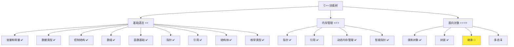
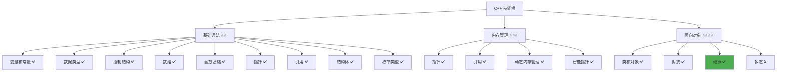

# 继承详解

> **学习目标**：掌握 C++ 继承的概念和实现，理解基类和派生类的关系，学会使用继承实现代码复用  
> **前置知识**：C++ 类和对象、封装、访问控制（public、private、protected）  
> **预计时间**：60 分钟  
> **难度等级**：⭐⭐⭐⭐  
> **技能收获**：继承概念、基类和派生类、访问控制、代码复用、类层次设计  
> **文档版本**：v1.0  
> **最后更新**：2025-11-09

📊 **难度等级说明**

| 等级           | 描述                       | 练习题数量     | 颜色码 |
| -------------- | -------------------------- | -------------- | ------ |
| **⭐**         | 入门级，零基础可学         | 5 题基础概念题 | 🟢绿   |
| **⭐⭐**       | 基础级，需要基本编程概念   | 5 题基础概念题 | 🟡黄   |
| **⭐⭐⭐**     | 中级，需要相关技术基础     | 3 题代码分析题 | 🟠橙   |
| **⭐⭐⭐⭐**   | 高级，需要扎实的技术功底   | 3 题代码分析题 | 🔴红   |
| **⭐⭐⭐⭐⭐** | 专家级，需要丰富的项目经验 | 2 题设计思考题 | 🟣紫   |

## 1. 学习目标

### 1.1 学习动机

- **实际需求**：继承是面向对象编程的核心特性之一，理解继承对编写可复用、可扩展的程序至关重要
- **应用场景**：代码复用、类层次设计、功能扩展、多态实现
- **技能价值**：学会后能更好地组织代码，实现代码复用，提高代码的可维护性和可扩展性
- **数据支持**：继承是面向对象编程的三大特性之一（封装、继承、多态），是构建大型软件系统的基础

### 1.2 技能树位置



> **图表说明**：C++ 技能树结构图，当前文档点亮继承技能点

### 1.3 前置知识检查

在开始学习之前，请确认你已经掌握：

- [ ] C++ 类的定义和使用
- [ ] 封装的概念和实现
- [ ] 访问控制（public、private、protected）的概念
- [ ] 构造函数和析构函数的基础使用

> **未掌握处理**：若未通过，请先复习 [类和对象详解](./18-classes-objects.md) 和 [封装详解](./19-encapsulation.md)

## 2. 核心内容

### 2.1 概念理解

**继承（Inheritance）**：允许一个类（派生类）继承另一个类（基类）的成员变量和成员函数，实现代码复用和功能扩展。

> **类比教学**：
>
> - **继承**：像父子关系，孩子（派生类）继承了父母（基类）的特征和能力，同时可以有自己的特点
> - **基类（父类）**：被继承的类，定义了通用的特征和行为
> - **派生类（子类）**：继承基类的类，可以添加新的特征和行为，也可以修改继承来的行为
> - **代码复用**：派生类自动拥有基类的所有成员，不需要重复编写相同的代码
> - **功能扩展**：派生类可以在基类的基础上添加新功能，就像孩子在父母的基础上发展自己的特长

### 2.2 为什么需要继承

#### 2.2.1 代码复用

**问题**：如果不使用继承，相似的类需要重复编写相同的代码。

**示例（未使用继承）**：

```cpp
// 学生类
class Student {
private:
    std::string name;
    int age;
    std::string studentId;

public:
    void printInfo() {
        std::cout << "姓名: " << name << std::endl;
        std::cout << "年龄: " << age << std::endl;
    }
};

// 教师类
class Teacher {
private:
    std::string name;
    int age;
    std::string teacherId;  // 与 Student 类有很多重复代码

public:
    void printInfo() {
        std::cout << "姓名: " << name << std::endl;
        std::cout << "年龄: " << age << std::endl;
    }
};
```

**问题**：

- 代码重复：`name`、`age`、`printInfo()` 在两个类中重复
- 维护困难：修改时需要同时修改多个类
- 扩展困难：添加新功能需要在多个类中重复添加

#### 2.2.2 继承的优势

**使用继承后**：

```cpp
// 基类：人员类
class Person {
protected:
    std::string name;
    int age;

public:
    Person(const std::string& n, int a) : name(n), age(a) {}

    void printInfo() {
        std::cout << "姓名: " << name << std::endl;
        std::cout << "年龄: " << age << std::endl;
    }
};

// 派生类：学生类
class Student : public Person {
private:
    std::string studentId;

public:
    Student(const std::string& n, int a, const std::string& id)
        : Person(n, a), studentId(id) {}
};

// 派生类：教师类
class Teacher : public Person {
private:
    std::string teacherId;

public:
    Teacher(const std::string& n, int a, const std::string& id)
        : Person(n, a), teacherId(id) {}
};
```

> **📌 补充说明：初始化列表语法**：
>
> - **初始化列表**：构造函数参数列表后的 `: 成员1(值1), 成员2(值2)` 部分称为初始化列表
> - **作用**：在构造函数体执行之前初始化成员变量和调用基类构造函数
> - **语法**：`构造函数(参数) : 基类构造函数(参数), 成员变量(值) { 构造函数体 }`
> - **示例**：`Student(const std::string& n, int a, const std::string& id) : Person(n, a), studentId(id) {}`
>   - `Person(n, a)`：调用基类 Person 的构造函数，传入 n 和 a
>   - `studentId(id)`：初始化成员变量 studentId，值为 id
>   - `{}`：构造函数体为空（所有初始化都在初始化列表中完成）
> - **为什么使用初始化列表**：这是调用基类构造函数和初始化成员变量的标准方式，比在构造函数体中赋值更高效

**优势**：

- **代码复用**：`name`、`age`、`printInfo()` 只需在基类中定义一次
- **易于维护**：修改基类，所有派生类自动继承修改
- **易于扩展**：派生类可以添加新功能，不影响基类

### 2.3 继承的语法

#### 2.3.1 定义语法

**语法**：

```cpp
class 派生类名称 : 继承方式 基类名称 {
    // 派生类的成员
};
```

**示例**：

```cpp
// 基类
class Person {
protected:
    std::string name;
    int age;

public:
    void printInfo() {
        std::cout << "姓名: " << name << std::endl;
    }
};

// 派生类
class Student : public Person {
private:
    std::string studentId;

public:
    void printStudentInfo() {
        printInfo();  // 可以使用基类的成员函数
        std::cout << "学号: " << studentId << std::endl;
    }
};
```

**详细说明**：

- `:` 表示继承关系
- `public` 是继承方式（最常用）
- 派生类自动拥有基类的所有 public 和 protected 成员
- 派生类可以添加新的成员变量和成员函数

#### 2.3.2 继承方式

**继承方式**：

- **public 继承**：最常用，保持基类的访问权限
- **private 继承**：较少使用，将基类的 public 成员变为 private
- **protected 继承**：较少使用，将基类的 public 成员变为 protected

**说明**：当前阶段只学习 public 继承，其他继承方式将在高级课程中讲解。

### 2.4 访问控制与继承

#### 2.4.1 protected（保护）

**定义**：可以在类内部和派生类中访问的成员，但在类外部不能访问。

**访问权限对比**：

| 访问权限  | 类内部 | 派生类 | 类外部 |
| --------- | ------ | ------ | ------ |
| public    | ✅     | ✅     | ✅     |
| protected | ✅     | ✅     | ❌     |
| private   | ✅     | ❌     | ❌     |

**示例**：

```cpp
class Person {
public:
    std::string name;           // public：类内部、派生类、类外部都可以访问

protected:
    int age;                    // protected：类内部和派生类可以访问，类外部不能访问

private:
    std::string password;       // private：只有类内部可以访问
};

class Student : public Person {
public:
    void test() {
        name = "张三";           // ✅ 可以访问（public）
        age = 25;               // ✅ 可以访问（protected）
        // password = "123";    // ❌ 错误！不能访问（private）
    }
};
```

#### 2.4.2 protected 的使用场景

**使用 protected 的原因**：

- 基类的某些成员需要被派生类访问，但不应该被外部访问
- 提供基类和派生类之间的"内部接口"

> **📌 类比解释**：
>
> - **protected 成员**：就像家庭内部的共享物品，家庭成员（基类和派生类）都可以使用，但外人（类外部）不能直接使用
> - **public 成员**：就像公共设施，任何人都可以使用
> - **private 成员**：就像个人私人物品，只有自己（类内部）可以使用，连家庭成员（派生类）也不能使用
> - **为什么需要 protected**：有些信息（如姓名、年龄）需要被子类使用，但不应该被外部直接访问，应该通过 getter/setter 等公开接口访问

**示例**：

```cpp
class Person {
protected:
    std::string name;                               // 派生类需要访问，但外部不应该直接访问
    int age;

public:
    std::string getName() const { return name; }    // 提供公开接口
    void setName(const std::string& n) { name = n; }
};
```

> **📌 补充说明：C++ 中函数定义写在类内部的写法**：
>
> - **类内函数定义**：在 C++ 中，可以直接在类定义中实现函数，函数体写在函数声明后面，用花括号 `{}` 包围
> - **语法**：`返回类型 函数名(参数) { 函数体 }`
> - **示例**：`std::string getName() const { return name; }` 表示函数声明和定义都在类定义中
> - **适用场景**：对于简单的函数（如 getter/setter），这种写法简洁明了，是 C++ 的常见写法
> - **说明**：在 C++ 中，简单函数通常直接在类定义中实现，复杂函数可以声明和定义分开（将在后续章节介绍）。这种写法与 Java、C# 等语言类似，都是将函数体写在类定义中

```cpp
class Student : public Person {
public:
    void printInfo() {
        std::cout << name << std::endl;             // ✅ 可以访问 protected 成员
    }
};
```

### 2.5 构造函数和析构函数

#### 2.5.1 构造函数的调用顺序

**规则**：先调用基类的构造函数，再调用派生类的构造函数。

**示例**：

```cpp
class Person {
protected:
    std::string name;
    int age;

public:
    Person(const std::string& n, int a) {
        name = n;
        age = a;
        std::cout << "Person 构造函数被调用" << std::endl;
    }
};

class Student : public Person {
private:
    std::string studentId;

public:
    Student(const std::string& n, int a, const std::string& id)
        : Person(n, a), studentId(id) {  // 先调用基类构造函数
        std::cout << "Student 构造函数被调用" << std::endl;
    }
};
```

**调用顺序**：

1. 基类构造函数
2. 派生类构造函数

#### 2.5.2 析构函数的调用顺序

**规则**：先调用派生类的析构函数，再调用基类的析构函数（与构造函数相反）。

**示例**：

```cpp
class Person {
public:
    ~Person() {
        std::cout << "Person 析构函数被调用" << std::endl;
    }
};

class Student : public Person {
public:
    ~Student() {
        std::cout << "Student 析构函数被调用" << std::endl;
    }
};
```

**调用顺序**：

1. 派生类析构函数
2. 基类析构函数

### 2.6 基础示例

以下代码演示了继承的基本使用：

```cpp
// 现代 C++ 示例 - 继承基础
#include <iostream>
#include <string>

// 基类：人员类
class Person {
protected:
    std::string name;
    int age;

public:
    Person(const std::string& n, int a) : name(n), age(a) {
        std::cout << "创建人员: " << name << std::endl;
    }

    void printInfo() {
        std::cout << "=== 人员信息 ===" << std::endl;
        std::cout << "姓名: " << name << std::endl;
        std::cout << "年龄: " << age << std::endl;
    }
};

// 派生类：学生类
class Student : public Person {
private:
    std::string studentId;

public:
    Student(const std::string& n, int a, const std::string& id)
        : Person(n, a), studentId(id) {
        std::cout << "创建学生: " << name << std::endl;
    }

    void printStudentInfo() {
        printInfo();  // 调用基类的成员函数
        std::cout << "学号: " << studentId << std::endl;
    }
};

// 派生类：教师类
class Teacher : public Person {
private:
    std::string teacherId;

public:
    Teacher(const std::string& n, int a, const std::string& id)
        : Person(n, a), teacherId(id) {
        std::cout << "创建教师: " << name << std::endl;
    }

    void printTeacherInfo() {
        printInfo();  // 调用基类的成员函数
        std::cout << "工号: " << teacherId << std::endl;
    }
};

int main() {
    // 创建学生对象
    Student student("张三", 20, "S001");
    student.printStudentInfo();

    std::cout << std::endl;

    // 创建教师对象
    Teacher teacher("李老师", 35, "T001");
    teacher.printTeacherInfo();

    return 0;
}
```

#### 2.6.1 配套代码文件

项目提供了配套的源代码文件：

- **文件位置**：`src/stage1/20-inheritance/01-basic-inheritance.cpp`
- **文件内容**：与上面示例完全一致的程序

> **运行提示**：具体的编译运行方法请参考 [C++ 简介和快速入门](./01-cpp-introduction.md) 中的 `2.2.3 编译运行` 部分

#### 2.6.2 运行预期结果

```
创建人员: 张三
创建学生: 张三
=== 人员信息 ===
姓名: 张三
年龄: 20
学号: S001

创建人员: 李老师
创建教师: 李老师
=== 人员信息 ===
姓名: 李老师
年龄: 35
工号: T001
```

### 2.7 继承的优势

#### 2.7.1 代码复用

- **避免重复**：相同的代码只需在基类中定义一次
- **统一管理**：修改基类，所有派生类自动继承修改
- **减少错误**：减少重复代码，降低出错概率

#### 2.7.2 功能扩展

- **添加新功能**：派生类可以添加新的成员变量和成员函数
- **修改行为**：派生类可以重写基类的成员函数（将在多态章节详细讲解）
- **灵活设计**：可以根据需要创建不同的派生类

#### 2.7.3 类层次设计

- **清晰的层次**：通过继承建立清晰的类层次结构
- **易于理解**：代码结构更清晰，易于理解
- **便于维护**：修改基类影响所有派生类，便于统一维护

### 2.8 继承的最佳实践

#### 2.8.1 合理使用 protected

**原则**：将需要被派生类访问但不需要被外部访问的成员设为 protected。

**示例**：

```cpp
class Person {
protected:
    std::string name;  // 派生类需要访问，设为 protected

public:
    std::string getName() const { return name; }  // 提供公开接口
};
```

#### 2.8.2 使用 public 继承

**原则**：除非有特殊原因，否则使用 public 继承。

**示例**：

```cpp
class Student : public Person {  // 推荐：使用 public 继承
    // ...
};
```

#### 2.8.3 在派生类构造函数中调用基类构造函数

**原则**：在派生类构造函数中显式调用基类构造函数，确保正确初始化。

**示例**：

```cpp
Student(const std::string& n, int a, const std::string& id)
    : Person(n, a), studentId(id) {  // 显式调用基类构造函数
    // ...
}
```

### 2.9 常见陷阱和注意事项

#### 2.9.1 常见错误

**错误 1：忘记调用基类构造函数**

```cpp
class Student : public Person {
public:
    Student(const std::string& n, int a, const std::string& id) {
        // 错误！没有调用基类构造函数
        studentId = id;
    }
};
```

**正确做法**：

```cpp
class Student : public Person {
public:
    Student(const std::string& n, int a, const std::string& id)
        : Person(n, a), studentId(id) {  // 正确！调用基类构造函数
        // ...
    }
};
```

**错误 2：在派生类中访问基类的 private 成员**

```cpp
class Person {
private:
    std::string password;           // private
};

class Student : public Person {
public:
    void test() {
        password = "123";           // 错误！不能访问基类的 private 成员
    }
};
```

**正确做法**：

```cpp
class Person {
protected:
    std::string password;           // 改为 protected，派生类可以访问
};

class Student : public Person {
public:
    void test() {
        password = "123";           // 正确！可以访问 protected 成员
    }
};
```

**错误 3：忘记继承方式**

```cpp
class Student Person {              // 错误！缺少继承方式和冒号
    // ...
};
```

**正确做法**：

```cpp
class Student : public Person {     // 正确！使用 : public
    // ...
};
```

**最佳实践**：

1. **使用 public 继承**：除非有特殊原因，否则使用 public 继承
2. **合理使用 protected**：将需要被派生类访问的成员设为 protected
3. **显式调用基类构造函数**：在派生类构造函数中显式调用基类构造函数
4. **理解访问控制**：理解 public、protected、private 在继承中的作用

## 3. 实践应用

### 3.1 项目场景

在 QtLanChat 项目中，继承用于：

- **用户类型扩展**：基础用户类，派生出不同类型的用户（普通用户、管理员等）
- **消息类型扩展**：基础消息类，派生出不同类型的消息（文本消息、图片消息等）
- **网络连接扩展**：基础连接类，派生出不同类型的连接（TCP 连接、UDP 连接等）
- **功能模块扩展**：基础功能类，派生出不同的功能模块

### 3.2 实际代码

以下代码展示了继承在 QtLanChat 项目中的实际应用：

```cpp
// 项目中的实际应用示例
#include <iostream>
#include <string>
#include <vector>

// 基类：用户类
class User {
protected:
    std::string name;
    int age;
    bool isOnline;

public:
    User(const std::string& userName, int userAge) {
        name = userName;
        age = userAge;
        isOnline = false;
    }

    std::string getName() const {
        return name;
    }

    int getAge() const {
        return age;
    }

    bool getIsOnline() const {
        return isOnline;
    }

    void setOnline(bool status) {
        isOnline = status;
    }

    void printInfo() {
        std::cout << "=== 用户信息 ===" << std::endl;
        std::cout << "姓名: " << name << std::endl;
        std::cout << "年龄: " << age << std::endl;
        std::cout << "在线状态: " << (isOnline ? "在线" : "离线") << std::endl;
    }
};

// 派生类：普通用户
class NormalUser : public User {
private:
    int messageCount;

public:
    NormalUser(const std::string& n, int a) : User(n, a), messageCount(0) {}

    void sendMessage() {
        messageCount++;
        std::cout << name << " 发送了一条消息（总计: " << messageCount << " 条）" << std::endl;
    }

    void printUserInfo() {
        printInfo();  // 调用基类的成员函数
        std::cout << "消息数量: " << messageCount << std::endl;
    }
};

// 派生类：管理员用户
class AdminUser : public User {
private:
    int manageCount;

public:
    AdminUser(const std::string& n, int a) : User(n, a), manageCount(0) {}

    void manageUser() {
        manageCount++;
        std::cout << name << " 执行了管理操作（总计: " << manageCount << " 次）" << std::endl;
    }

    void printAdminInfo() {
        printInfo();  // 调用基类的成员函数
        std::cout << "管理操作次数: " << manageCount << std::endl;
    }
};

int main() {
    std::cout << "=== QtLanChat 继承应用 ===" << std::endl;

    // 创建普通用户
    NormalUser user1("张三", 25);
    user1.setOnline(true);
    user1.sendMessage();
    user1.sendMessage();
    user1.printUserInfo();

    std::cout << std::endl;

    // 创建管理员用户
    AdminUser admin1("管理员", 30);
    admin1.setOnline(true);
    admin1.manageUser();
    admin1.printAdminInfo();

    return 0;
}
```

> **配套代码**：实际应用示例的完整代码位于 `src/stage1/20-inheritance/02-project-example.cpp`

### 3.3 设计思路

- **为什么选择这种设计**：使用继承实现代码复用，通过基类定义通用功能，通过派生类扩展特定功能
- **解决了什么问题**：避免了代码重复，提供了清晰的类层次结构，便于功能扩展
- **有什么优势**：代码复用、易于维护、易于扩展、结构清晰

## 4. 练习与测试

### 4.1 练习题

#### 练习 1：基础继承

**题目**：定义一个 `Animal` 基类和一个 `Dog` 派生类。

**要求**：

- 定义 `Animal` 基类，包含 `name`（protected）和 `printInfo()` 函数
- 定义 `Dog` 派生类，继承 `Animal`，添加 `breed`（品种）成员变量
- 实现 `Dog` 的构造函数和 `printDogInfo()` 函数

**参考答案**：

```cpp
#include <iostream>
#include <string>

class Animal {
protected:
    std::string name;

public:
    Animal(const std::string& n) : name(n) {}

    void printInfo() {
        std::cout << "动物名称: " << name << std::endl;
    }
};

class Dog : public Animal {
private:
    std::string breed;

public:
    Dog(const std::string& n, const std::string& b) : Animal(n), breed(b) {}

    void printDogInfo() {
        printInfo();  // 调用基类的成员函数
        std::cout << "品种: " << breed << std::endl;
    }
};

int main() {
    Dog dog("旺财", "金毛");
    dog.printDogInfo();

    return 0;
}
```

> **配套代码**：练习 1 的完整代码位于 `src/stage1/20-inheritance/03-exercise-animal.cpp`

#### 练习 2：多层继承

**题目**：定义一个 `Vehicle` 基类，派生出 `Car` 类，再派生出 `ElectricCar` 类。

**要求**：

- 定义 `Vehicle` 基类，包含 `brand`（品牌）和 `printInfo()` 函数
- 定义 `Car` 派生类，添加 `model`（型号）成员变量
- 定义 `ElectricCar` 派生类，继承 `Car`，添加 `batteryCapacity`（电池容量）成员变量

**参考答案**：

```cpp
#include <iostream>
#include <string>

class Vehicle {
protected:
    std::string brand;

public:
    Vehicle(const std::string& b) : brand(b) {}

    void printInfo() {
        std::cout << "品牌: " << brand << std::endl;
    }
};

class Car : public Vehicle {
protected:
    std::string model;

public:
    Car(const std::string& b, const std::string& m) : Vehicle(b), model(m) {}

    void printCarInfo() {
        printInfo();
        std::cout << "型号: " << model << std::endl;
    }
};

class ElectricCar : public Car {
private:
    double batteryCapacity;

public:
    ElectricCar(const std::string& b, const std::string& m, double capacity)
        : Car(b, m), batteryCapacity(capacity) {}

    void printElectricCarInfo() {
        printCarInfo();
        std::cout << "电池容量: " << batteryCapacity << " kWh" << std::endl;
    }
};

int main() {
    ElectricCar car("特斯拉", "Model 3", 75.0);
    car.printElectricCarInfo();

    return 0;
}
```

> **配套代码**：练习 2 的完整代码位于 `src/stage1/20-inheritance/04-exercise-vehicle.cpp`

#### 练习 3：继承与封装结合

**题目**：定义一个 `Account` 基类和一个 `SavingsAccount` 派生类，使用封装保护数据。

**要求**：

- 定义 `Account` 基类，包含 `accountNumber`（账号，protected）和 `balance`（余额，private）
- 实现 `getBalance()` getter 和 `deposit()` 函数
- 定义 `SavingsAccount` 派生类，添加 `interestRate`（利率，private）成员变量
- 实现 `calculateInterest()` 函数（计算利息）

**参考答案**：

```cpp
#include <iostream>
#include <string>

class Account {
protected:
    std::string accountNumber;

private:
    double balance;

public:
    Account(const std::string& accNum, double bal) : accountNumber(accNum), balance(bal) {}

    double getBalance() const {
        return balance;
    }

    void deposit(double amount) {
        if (amount > 0) {
            balance += amount;
            std::cout << "存款 " << amount << " 元，余额: " << balance << std::endl;
        }
    }

    void printInfo() {
        std::cout << "账号: " << accountNumber << std::endl;
        std::cout << "余额: " << balance << std::endl;
    }
};

class SavingsAccount : public Account {
private:
    double interestRate;

public:
    SavingsAccount(const std::string& accNum, double bal, double rate)
        : Account(accNum, bal), interestRate(rate) {}

    void calculateInterest() {
        double interest = getBalance() * interestRate / 100.0;
        std::cout << "利息: " << interest << " 元" << std::endl;
    }

    void printSavingsInfo() {
        printInfo();
        std::cout << "利率: " << interestRate << "%" << std::endl;
    }
};

int main() {
    SavingsAccount account("ACC001", 1000.0, 3.5);
    account.deposit(500.0);
    account.calculateInterest();
    account.printSavingsInfo();

    return 0;
}
```

> **配套代码**：练习 3 的完整代码位于 `src/stage1/20-inheritance/05-exercise-account.cpp`

### 4.2 测试题（可选）

1. **关于继承，下列说法正确的是：**
   A. 派生类不能访问基类的 protected 成员

   B. 派生类自动拥有基类的所有 public 和 protected 成员

   C. 派生类不能添加新的成员

   D. 继承会降低代码的可维护性
   **答案**：B

   **解析**：
   - **正确答案 B**：派生类自动拥有基类的所有 public 和 protected 成员（但不能访问 private 成员）
   - **错误答案 A**：派生类可以访问基类的 protected 成员
   - **错误答案 C**：派生类可以添加新的成员变量和成员函数
   - **错误答案 D**：继承提高代码的可维护性

2. **关于构造函数的调用顺序，下列说法正确的是：**
   A. 先调用派生类构造函数，再调用基类构造函数

   B. 先调用基类构造函数，再调用派生类构造函数

   C. 同时调用基类和派生类构造函数

   D. 不需要调用基类构造函数
   **答案**：B

   **解析**：
   - **正确答案 B**：先调用基类构造函数，再调用派生类构造函数
   - **错误答案 A/C/D**：必须按照正确的顺序调用构造函数

3. **关于 protected 成员，下列说法正确的是：**
   A. protected 成员可以在类外部访问

   B. protected 成员只能在类内部访问

   C. protected 成员可以在派生类中访问

   D. protected 成员与 private 成员完全相同
   **答案**：C

   **解析**：
   - **正确答案 C**：protected 成员可以在类内部和派生类中访问
   - **错误答案 A/B/D**：protected 成员不能在类外部访问，但与 private 不同（private 不能在派生类中访问）

### 4.3 常见问题 FAQ

- Q1：继承和组合有什么区别？
  - **A：**继承是"是一个"关系（如 Student 是一个 Person），组合是"有一个"关系（如 Car 有一个 Engine）。继承用于代码复用和功能扩展，组合用于对象包含。

  **示例对比**：

  ```cpp
  // 继承：Student 是一个 Person
  class Person {
      std::string name;
  };

  class Student : public Person {  // Student 继承 Person
      std::string studentId;
  };

  // 组合：Car 有一个 Engine（Car 的成员是 Engine 类）
  class Engine {
      int horsepower;
  };

  class Car {
      Engine engine;  // Car 包含一个 Engine 对象（组合）
      std::string brand;
  };
  ```

  **区别**：
  - **继承**：派生类是基类的一种，可以使用基类的所有 public 和 protected 成员
  - **组合**：一个类包含另一个类的对象作为成员，通过成员对象来使用其功能

- Q2：什么时候应该使用继承？
  - **A：**当需要代码复用、功能扩展、建立类层次结构时使用继承。如果只是简单的包含关系，应该使用组合而不是继承。

- Q3：派生类可以访问基类的 private 成员吗？
  - **A：**不能。派生类只能访问基类的 public 和 protected 成员。如果需要派生类访问，应该将成员设为 protected。

- Q4：一个类可以继承多个基类吗？
  - **A：**可以（多重继承），但这是高级特性，当前阶段只学习单继承。多重继承将在高级课程中讲解。

- Q5：继承会影响性能吗？
  - **A：**继承本身对性能影响很小。现代编译器会优化继承关系，性能开销可以忽略不计。

## 5. 资源与扩展

### 5.1 基础资源

- **官方文档**：[C++ 继承](https://en.cppreference.com/w/cpp/language/derived_class)
- **权威书籍**：《C++ Primer》- 第 15 章
- **在线教程**：[learncpp.com](https://www.learncpp.com/) - 继承教程

### 5.2 多媒体学习

- **视频资源**：[C++ 继承详解](https://www.youtube.com/results?search_query=C%2B%2B+inheritance+tutorial)
- **开发者资源**：[cppreference.com](https://en.cppreference.com/) - 权威参考

## 6. 课后作业及参考答案

### 6.1 学习检查清单

- [ ] 能够理解继承的概念和作用
- [ ] 能够定义基类和派生类
- [ ] 能够理解访问控制（public、protected、private）在继承中的作用
- [ ] 能够在派生类构造函数中调用基类构造函数
- [ ] 能够理解继承的优势
- [ ] 能够设计简单的类层次结构

### 6.2 综合练习

**作业题目**：编写一个图书管理系统，使用继承设计不同的图书类型

**要求**：

- 定义 `Book` 基类，包含书名、作者、价格（protected）
- 实现 `printInfo()` 函数
- 定义 `EBook` 派生类，添加文件大小（MB）成员变量
- 定义 `PaperBook` 派生类，添加页数成员变量
- 每个派生类实现自己的 `printDetailInfo()` 函数

**时间估算**：50 分钟

**参考答案**：

```cpp
#include <iostream>
#include <string>

class Book {
protected:
    std::string title;
    std::string author;
    double price;

public:
    Book(const std::string& t, const std::string& a, double p)
        : title(t), author(a), price(p) {}

    void printInfo() {
        std::cout << "《" << title << "》" << std::endl;
        std::cout << "  作者: " << author << std::endl;
        std::cout << "  价格: " << price << " 元" << std::endl;
    }
};

class EBook : public Book {
private:
    double fileSize;  // MB

public:
    EBook(const std::string& t, const std::string& a, double p, double size)
        : Book(t, a, p), fileSize(size) {}

    void printDetailInfo() {
        printInfo();
        std::cout << "  文件大小: " << fileSize << " MB" << std::endl;
    }
};

class PaperBook : public Book {
private:
    int pages;

public:
    PaperBook(const std::string& t, const std::string& a, double p, int pgs)
        : Book(t, a, p), pages(pgs) {}

    void printDetailInfo() {
        printInfo();
        std::cout << "  页数: " << pages << " 页" << std::endl;
    }
};

int main() {
    EBook ebook("C++ Primer", "Stanley B. Lippman", 128.0, 15.5);
    ebook.printDetailInfo();

    std::cout << std::endl;

    PaperBook paperbook("Effective C++", "Scott Meyers", 89.0, 320);
    paperbook.printDetailInfo();

    return 0;
}
```

**评分标准**：功能实现（40%）、继承使用正确（30%）、代码质量（30%）

## 7. 下一步学习

**下一篇**：[21-polymorphism.md](./21-polymorphism.md)

**学习路径**：

1. ✅ C++ 简介和快速入门 - 已完成
2. ✅ 变量和常量 - 已完成
3. ✅ 数据类型详解 - 已完成
4. ✅ 运算符详解 - 已完成
5. ✅ if 分支详解 - 已完成
6. ✅ while 循环 - 已完成
7. ✅ for 循环 - 已完成
8. ✅ switch 分支 - 已完成
9. ✅ 数组基础 - 已完成
10. ✅ std::vector - 已完成
11. ✅ 字符串进阶 - 已完成
12. ✅ 函数基础 - 已完成
13. ✅ 指针详解 - 已完成
14. ✅ 引用详解 - 已完成
15. ✅ 内存管理 - 已完成
16. ✅ 结构体 - 已完成
17. ✅ 枚举类型 - 已完成
18. ✅ 类和对象 - 已完成
19. ✅ 封装 - 已完成
20. ✅ 继承 - 已完成
21. 🔄 多态 - 下一步

**技能树更新**：



**学习成果**：

- **独立编写**：能够定义基类和派生类，使用继承实现代码复用
- **解释原理**：能够解释继承的作用和优势
- **解决实际问题**：能够使用继承设计类层次结构
- **应用到项目**：为后续多态等高级特性打下基础
- **掌握度自评**：80%

### 学习成果指导

> **自评指导**：
>
> - **<50%**：建议复习继承的基础概念，重新阅读文档核心内容
> - **50-80%**：继续学习，完成练习题巩固理解
> - **>80%**：可以进入下一阶段学习，开始多态学习

---

**文档质量检查**：

- [x] 学习目标明确且可验证
- [x] 代码示例可运行
- [x] 练习题有答案
- [x] 技能收获明确
- [x] 抽象概念配有生活化比喻
- [x] 比喻体系一致，避免概念混乱
- [x] 文档长度符合难度等级要求
