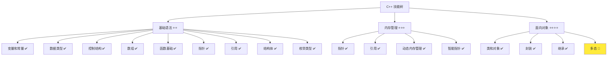
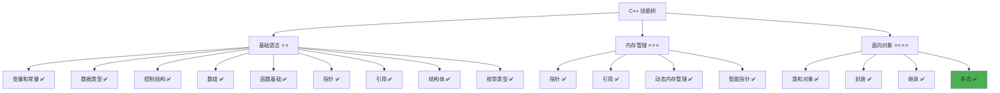

# 多态详解

> **学习目标**：掌握 C++ 多态的概念和实现，理解虚函数和动态绑定，学会使用多态实现灵活的代码设计  
> **前置知识**：C++ 类和对象、封装、继承、指针和引用  
> **预计时间**：70 分钟  
> **难度等级**：⭐⭐⭐⭐  
> **技能收获**：多态概念、虚函数、虚析构函数、纯虚函数、抽象类、动态绑定  
> **文档版本**：v1.0  
> **最后更新**：2025-11-11

📊 **难度等级说明**

| 等级           | 描述                       | 练习题数量     | 颜色码 |
| -------------- | -------------------------- | -------------- | ------ |
| **⭐**         | 入门级，零基础可学         | 5 题基础概念题 | 🟢绿   |
| **⭐⭐**       | 基础级，需要基本编程概念   | 5 题基础概念题 | 🟡黄   |
| **⭐⭐⭐**     | 中级，需要相关技术基础     | 3 题代码分析题 | 🟠橙   |
| **⭐⭐⭐⭐**   | 高级，需要扎实的技术功底   | 3 题代码分析题 | 🔴红   |
| **⭐⭐⭐⭐⭐** | 专家级，需要丰富的项目经验 | 2 题设计思考题 | 🟣紫   |

## 1. 学习目标

### 1.1 学习动机

- **实际需求**：多态是面向对象编程的核心特性之一，理解多态对编写灵活、可扩展的程序至关重要
- **应用场景**：接口设计、功能扩展、代码解耦、提高代码的灵活性和可维护性
- **技能价值**：学会后能更好地设计接口，实现灵活的代码结构，提高代码的可扩展性和可维护性
- **数据支持**：多态是面向对象编程的三大特性之一（封装、继承、多态），是构建大型软件系统的基础

### 1.2 技能树位置



> **图表说明**：C++ 技能树结构图，当前文档点亮多态技能点

### 1.3 前置知识检查

在开始学习之前，请确认你已经掌握：

- [ ] C++ 类的定义和使用
- [ ] 封装和继承的概念
- [ ] 指针和引用的基础使用
- [ ] 构造函数和析构函数的基础使用

> **未掌握处理**：若未通过，请先复习 [类和对象详解](./18-classes-objects.md)、[封装详解](./19-encapsulation.md) 和 [继承详解](./20-inheritance.md)

## 2. 核心内容

### 2.1 概念理解

**多态（Polymorphism）**：同一个接口可以有不同的实现方式，通过基类指针或引用调用派生类的函数，实现"一个接口，多种实现"。

> **类比教学**：
>
> - **多态**：像"说话"这个行为，不同的人（派生类）说话的方式不同，但都是"说话"（同一个接口）
> - **虚函数**：像"说话"这个行为的定义，告诉编译器"这个函数可能被派生类重新实现"
> - **动态绑定**：在运行时根据对象的实际类型决定调用哪个函数，就像根据说话的人决定听谁的话
> - **接口统一**：通过基类指针或引用，可以统一处理不同的派生类对象，就像通过"说话"这个接口可以处理不同的人

### 2.2 为什么需要多态

#### 2.2.1 问题：没有多态的情况

**问题**：如果不使用多态，需要为每个派生类编写不同的处理代码。

**示例（未使用多态）**：

```cpp
class Animal {
public:
    void makeSound() {
        std::cout << "动物发出声音" << std::endl;
    }
};

class Dog : public Animal {
public:
    void makeSound() {
        std::cout << "汪汪汪" << std::endl;
    }
};

class Cat : public Animal {
public:
    void makeSound() {
        std::cout << "喵喵喵" << std::endl;
    }
};

int main() {
    Animal* animal1 = new Dog();    // 基类指针指向派生类对象
    Animal* animal2 = new Cat();    // 基类指针指向派生类对象

    animal1->makeSound();           // 输出：动物发出声音（错误！）
    animal2->makeSound();           // 输出：动物发出声音（错误！）

    delete animal1;
    delete animal2;
    return 0;
}
```

> **📌 说明：为什么使用 `new` 创建对象**：
>
> - 这里使用 `new` 是为了演示问题，实际上多态也可以通过栈对象+指针实现
> - 栈对象方式：`Dog dog; Animal* animal = &dog;`（推荐，更安全）
> - 堆对象方式：`Animal* animal = new Dog();`（需要手动 delete）
> - 关于两种方式的区别，请参考 [类和对象详解](./18-classes-objects.md) 中的 `2.5.1 创建对象` 部分
>
> **📌 说明：为什么使用 `->` 而不是 `.`**：
>
> - 当使用指针访问成员时，使用 `->` 操作符（如 `animal1->makeSound()`）
> - 当使用对象访问成员时，使用 `.` 操作符（如 `dog.makeSound()`）
> - 关于指针和对象的访问方式，请参考 [类和对象详解](./18-classes-objects.md) 中的 `2.5.2 访问成员` 部分
>
> **📌 关键问题：为什么输出错误？**
>
> - **问题根源**：虽然 `animal1` 指向的是 `Dog` 对象，`animal2` 指向的是 `Cat` 对象，但是 `makeSound()` 函数**没有使用 `virtual` 关键字**
> - **静态绑定**：没有 `virtual` 时，编译器根据指针的类型（`Animal*`）来决定调用哪个函数，而不是根据对象的实际类型（`Dog` 或 `Cat`）
> - **结果**：无论指针指向什么对象，都调用 `Animal::makeSound()`，输出"动物发出声音"
> - **解决方案**：在基类的 `makeSound()` 前加上 `virtual` 关键字，实现动态绑定（见下面的示例）

**问题总结**：

- 虽然创建的是 `Dog` 和 `Cat` 对象，但通过基类指针调用时，总是调用基类 `Animal` 的函数
- 这是因为没有 `virtual` 关键字，导致静态绑定，编译器根据指针类型而不是对象实际类型来决定调用哪个函数
- 无法实现多态，需要为每个派生类编写不同的处理代码

#### 2.2.2 多态的优势

**使用多态后**：

```cpp
class Animal {
public:
    virtual void makeSound() {      // 使用 virtual 关键字
        std::cout << "动物发出声音" << std::endl;
    }

    virtual ~Animal() {}            // 虚析构函数（确保派生类析构函数被正确调用）
};

class Dog : public Animal {
public:
    void makeSound() override {     // 重写基类的虚函数
        std::cout << "汪汪汪" << std::endl;
    }
};

class Cat : public Animal {
public:
    void makeSound() override {     // 重写基类的虚函数
        std::cout << "喵喵喵" << std::endl;
    }
};

int main() {
    Animal* animal1 = new Dog();
    Animal* animal2 = new Cat();

    animal1->makeSound();           // 输出：汪汪汪（正确！）
    animal2->makeSound();           // 输出：喵喵喵（正确！）

    delete animal1;
    delete animal2;
    return 0;
}
```

> **📌 说明：多态的实现方式**：
>
> - 多态可以通过栈对象+指针实现：`Dog dog; Animal* animal = &dog;`（推荐，更安全）
> - 也可以通过堆对象实现：`Animal* animal = new Dog();`（需要手动 delete）
> - 两种方式都能实现多态，优先使用栈对象+指针的方式
>
> **📌 补充说明：函数重写（override）**：
>
> - **函数重写**：派生类重新定义基类中的虚函数，提供自己的实现。就像孩子继承父母的"说话"能力，但可以用自己的方式说话（重写），而不是只能用父母的方式
> - **前提条件**：只有基类中的**虚函数**（使用 `virtual` 关键字）才能被重写
> - **override 关键字**：C++11 引入，明确表示这是重写基类的虚函数，如果基类没有对应的虚函数，编译器会报错
> - **与函数重载的区别**：
>   - **函数重载**：同一个类中，函数名相同但参数不同（编译时多态）
>   - **函数重写**：派生类重写基类的虚函数，函数签名相同（运行时多态）
> - **示例**：`void makeSound() override` 表示重写基类 `Animal` 的虚函数 `makeSound()`
> - **详细说明**：关于 `override` 关键字的更多内容，请参考下面的 `2.3.2 override 关键字` 部分
>
> **📌 说明：为什么需要虚析构函数**：
>
> - 代码中使用了 `virtual ~Animal() {}` 虚析构函数
> - **原因**：当使用基类指针删除派生类对象时（如 `delete animal1`），如果析构函数不是虚函数，只会调用基类的析构函数，派生类的析构函数不会被调用，可能导致资源泄漏
> - **规则**：如果基类有虚函数，析构函数应该声明为虚函数
> - **详细说明**：关于虚析构函数的详细内容，请参考下面的 `2.4 虚析构函数` 部分

**优势**：

- **统一接口**：通过基类指针可以统一处理不同的派生类对象，不需要为每个派生类编写不同的处理代码
- **动态绑定**：在运行时根据对象的实际类型调用相应的函数（通过虚函数和函数重写实现）
- **代码简化**：通过函数重写，派生类可以提供自己的实现，但调用方式统一，代码更简洁
- **易于扩展**：添加新的派生类时，只需要重写虚函数，不需要修改调用代码

### 2.3 虚函数

#### 2.3.1 虚函数的概念

**虚函数（Virtual Function）**：使用 `virtual` 关键字声明的函数，允许派生类重写该函数，实现多态。

**语法**：

```cpp
class 基类 {
public:
    virtual 返回类型 函数名(参数) {
        // 函数体
    }
};
```

**示例**：

```cpp
class Animal {
public:
    virtual void makeSound() {  // 虚函数
        std::cout << "动物发出声音" << std::endl;
    }

    virtual ~Animal() {}         // 虚析构函数（确保派生类析构函数被正确调用）
};

class Dog : public Animal {
public:
    void makeSound() override {  // 重写虚函数（override 可选，但推荐使用）
        std::cout << "汪汪汪" << std::endl;
    }
};
```

#### 2.3.2 override 关键字

**override**：C++11 引入的关键字，用于明确表示重写基类的虚函数。

**作用**：

- 明确表示这是重写基类的虚函数
- 如果基类没有对应的虚函数，编译器会报错（避免拼写错误）

**示例**：

```cpp
class Animal {
public:
    virtual void makeSound() {
        std::cout << "动物发出声音" << std::endl;
    }

    virtual ~Animal() {}         // 虚析构函数（确保派生类析构函数被正确调用）
};

class Dog : public Animal {
public:
    void makeSound() override {  // 使用 override 明确表示重写
        std::cout << "汪汪汪" << std::endl;
    }
};
```

> **📌 补充说明：override 关键字**：
>
> - **override**：C++11 引入的关键字，用于明确表示重写基类的虚函数
> - **作用**：如果基类没有对应的虚函数，编译器会报错，避免拼写错误或函数签名不匹配
> - **推荐使用**：虽然 override 是可选的，但推荐使用，可以提高代码的可读性和安全性
> - **语法**：`void makeSound() override { ... }`

### 2.4 虚析构函数

#### 2.4.1 为什么需要虚析构函数

**问题**：如果基类指针指向派生类对象，删除指针时可能只调用基类的析构函数，导致派生类的析构函数不被调用。

**示例（未使用虚析构函数）**：

```cpp
class Animal {
public:
    ~Animal() {  // 非虚析构函数
        std::cout << "Animal 析构函数" << std::endl;
    }
};

class Dog : public Animal {
public:
    ~Dog() {
        std::cout << "Dog 析构函数" << std::endl;
    }
};

int main() {
    Animal* animal = new Dog();
    delete animal;  // 只调用 Animal 的析构函数，Dog 的析构函数不被调用！
    return 0;
}
```

**问题**：派生类的析构函数不被调用，可能导致资源泄漏。

#### 2.4.2 使用虚析构函数

**解决方案**：将基类的析构函数声明为虚函数。

**示例**：

```cpp
class Animal {
public:
    virtual ~Animal() {  // 虚析构函数
        std::cout << "Animal 析构函数" << std::endl;
    }
};

class Dog : public Animal {
public:
    ~Dog() {
        std::cout << "Dog 析构函数" << std::endl;
    }
};

int main() {
    Animal* animal = new Dog();
    delete animal;  // 先调用 Dog 的析构函数，再调用 Animal 的析构函数
    return 0;
}
```

**规则**：

- 如果基类有虚函数，析构函数应该声明为虚函数
- 虚析构函数确保派生类的析构函数被正确调用

### 2.5 纯虚函数和抽象类

#### 2.5.1 纯虚函数

**纯虚函数（Pure Virtual Function）**：没有实现的虚函数，用 `= 0` 表示。

**语法**：

```cpp
class 基类 {
public:
    virtual 返回类型 函数名(参数) = 0;  // 纯虚函数
};
```

**示例**：

```cpp
class Animal {
public:
    virtual void makeSound() = 0;  // 纯虚函数，没有实现
    virtual ~Animal() {}            // 虚析构函数（确保派生类析构函数被正确调用）
};
```

#### 2.5.2 抽象类

**抽象类（Abstract Class）**：包含至少一个纯虚函数的类，不能创建对象。

**特点**：

- 不能创建抽象类的对象
- 派生类必须实现所有纯虚函数，否则也是抽象类
- 用于定义接口，强制派生类实现特定功能

**作用和应用场景**：

- **定义接口规范**：抽象类定义了一组接口（纯虚函数），强制派生类必须实现这些接口，确保所有派生类都有相同的接口
- **代码设计**：在大型项目中，抽象类用于定义模块间的接口，不同的团队可以实现不同的派生类，但都遵循相同的接口规范
- **多态基础**：抽象类作为基类，通过多态可以统一处理不同的派生类对象，提高代码的灵活性和可扩展性
- **实际应用**：
  - **图形系统**：`Shape` 抽象类定义 `draw()` 接口，`Circle`、`Rectangle` 等派生类实现不同的绘制方式
  - **消息处理**：`Message` 抽象类定义 `send()` 接口，`TextMessage`、`ImageMessage` 等派生类实现不同的发送方式
  - **网络连接**：`Connection` 抽象类定义 `connect()`、`disconnect()` 接口，`TCPConnection`、`UDPConnection` 等派生类实现不同的连接方式

> **📌 类比理解**：
>
> - **抽象类**：就像"交通工具"的概念，定义了"启动"、"停止"等接口，但不能直接使用"交通工具"（不能创建对象）
> - **派生类**：像"汽车"、"自行车"等具体交通工具，必须实现"启动"、"停止"等接口，才能使用
> - **作用**：确保所有交通工具都有相同的接口，但实现方式可以不同

**示例**：

```cpp
class Animal {                      // 抽象类
public:
    virtual void makeSound() = 0;   // 纯虚函数
    virtual ~Animal() {}            // 虚析构函数（确保派生类析构函数被正确调用）
};

class Dog : public Animal {
public:
    void makeSound() override {     // 必须实现纯虚函数
        std::cout << "汪汪汪" << std::endl;
    }
};

int main() {
    // Animal animal;               // 错误！不能创建抽象类的对象
    Dog dog;                        // 正确！Dog 实现了所有纯虚函数
    dog.makeSound();
    return 0;
}
```

### 2.6 基础示例

以下代码演示了多态的基本使用：

```cpp
// 现代 C++ 示例 - 多态基础
#include <iostream>
#include <string>

// 基类：动物类（抽象类）
class Animal {
protected:
    std::string name;

public:
    Animal(const std::string& n) : name(n) {}

    virtual ~Animal() {  // 虚析构函数
        std::cout << name << " 被销毁" << std::endl;
    }

    virtual void makeSound() = 0;  // 纯虚函数

    virtual void printInfo() {  // 虚函数
        std::cout << "动物名称: " << name << std::endl;
    }
};

// 派生类：狗
class Dog : public Animal {
public:
    Dog(const std::string& n) : Animal(n) {}

    void makeSound() override {  // 实现纯虚函数
        std::cout << name << " 说: 汪汪汪" << std::endl;
    }

    void printInfo() override {  // 重写虚函数
        std::cout << "这是一只狗，名字叫: " << name << std::endl;
    }
};

// 派生类：猫
class Cat : public Animal {
public:
    Cat(const std::string& n) : Animal(n) {}

    void makeSound() override {  // 实现纯虚函数
        std::cout << name << " 说: 喵喵喵" << std::endl;
    }

    void printInfo() override {  // 重写虚函数
        std::cout << "这是一只猫，名字叫: " << name << std::endl;
    }
};

// 使用多态的函数
void playWithAnimal(Animal* animal) {
    animal->printInfo();
    animal->makeSound();
}

int main() {
    // 创建派生类对象
    Dog dog("旺财");
    Cat cat("咪咪");

    // 使用基类指针调用函数（多态）
    Animal* animal1 = &dog;
    Animal* animal2 = &cat;

    std::cout << "=== 使用多态 ===" << std::endl;
    playWithAnimal(animal1);  // 调用 Dog 的函数
    std::cout << std::endl;
    playWithAnimal(animal2);  // 调用 Cat 的函数

    return 0;
}
```

#### 2.6.1 配套代码文件

项目提供了配套的源代码文件：

- **文件位置**：`src/stage1/21-polymorphism/01-basic-polymorphism.cpp`
- **文件内容**：与上面示例完全一致的程序

> **运行提示**：具体的编译运行方法请参考 [C++ 简介和快速入门](./01-cpp-introduction.md) 中的 `2.2.3 编译运行` 部分

#### 2.6.2 运行预期结果

```
=== 使用多态 ===
这是一只狗，名字叫: 旺财
旺财 说: 汪汪汪

这是一只猫，名字叫: 咪咪
咪咪 说: 喵喵喵
旺财 被销毁
咪咪 被销毁
```

### 2.7 多态的优势总结

> **说明**：本节是对多态优势的详细总结，与 `2.2.2 多态的优势` 形成呼应，从不同角度阐述多态的价值。

#### 2.7.1 统一接口

- **代码简化**：通过基类指针可以统一处理不同的派生类对象，不需要为每个派生类编写不同的处理代码
- **接口统一**：所有派生类都遵循相同的接口规范，调用方式一致
- **易于扩展**：添加新的派生类不需要修改现有代码，只需实现接口即可

#### 2.7.2 动态绑定

- **运行时决定**：在运行时根据对象的实际类型调用相应的函数，而不是编译时决定
- **灵活性**：可以根据实际情况选择不同的实现，提高代码的适应性
- **解耦**：调用代码不需要知道具体的派生类类型，降低代码耦合度

#### 2.7.3 代码组织

- **清晰的层次**：通过抽象类定义接口，派生类实现具体功能，层次分明
- **易于维护**：修改派生类不影响其他代码，降低维护成本
- **便于测试**：可以轻松替换不同的实现进行测试，提高代码质量

### 2.8 多态的最佳实践

#### 2.8.1 使用虚析构函数

**原则**：如果基类有虚函数，析构函数应该声明为虚函数。

**示例**：

```cpp
class Animal {
public:
    virtual ~Animal() {  // 虚析构函数
        // ...
    }
};
```

#### 2.8.2 使用 override 关键字

**原则**：重写虚函数时使用 `override` 关键字，提高代码安全性。

**示例**：

```cpp
class Dog : public Animal {
public:
    void makeSound() override {  // 使用 override
        // ...
    }
};
```

#### 2.8.3 合理使用抽象类

**原则**：当需要定义接口时，使用抽象类（纯虚函数）。

**示例**：

```cpp
class Animal {
public:
    virtual void makeSound() = 0;  // 纯虚函数，定义接口
};
```

### 2.9 常见陷阱和注意事项

#### 2.9.1 常见错误

**错误 1：忘记使用 virtual 关键字**

```cpp
class Animal {
public:
    void makeSound() {              // 错误！没有 virtual
        std::cout << "动物发出声音" << std::endl;
    }
};

class Dog : public Animal {
public:
    void makeSound() {              // 不会实现多态
        std::cout << "汪汪汪" << std::endl;
    }
};
```

**正确做法**：

```cpp
class Animal {
public:
    virtual void makeSound() {      // 正确！使用 virtual
        std::cout << "动物发出声音" << std::endl;
    }
};
```

**错误 2：忘记虚析构函数**

```cpp
class Animal {
public:
    ~Animal() {                     // 错误！没有 virtual
        // ...
    }
};
```

**正确做法**：

```cpp
class Animal {
public:
    virtual ~Animal() {             // 正确！使用 virtual
        // ...
    }
};
```

**错误 3：试图创建抽象类的对象**

```cpp
class Animal {
public:
    virtual void makeSound() = 0;   // 纯虚函数
};

int main() {
    Animal animal;                  // 错误！不能创建抽象类的对象
    return 0;
}
```

**正确做法**：

```cpp
class Dog : public Animal {
public:
    void makeSound() override {
        std::cout << "汪汪汪" << std::endl;
    }
};

int main() {
    Dog dog;                        // 正确！Dog 实现了所有纯虚函数
    return 0;
}
```

**最佳实践**：

1. **使用 virtual 关键字**：需要多态的函数使用 virtual 关键字
2. **使用虚析构函数**：如果基类有虚函数，析构函数应该声明为虚函数
3. **使用 override**：重写虚函数时使用 override 关键字
4. **理解抽象类**：抽象类不能创建对象，用于定义接口

## 3. 实践应用

### 3.1 项目场景

在 QtLanChat 项目中，多态用于：

- **用户类型处理**：通过基类指针统一处理不同类型的用户（普通用户、管理员等）
- **消息类型处理**：通过基类指针统一处理不同类型的消息（文本消息、图片消息等）
- **网络连接处理**：通过基类指针统一处理不同类型的连接（TCP 连接、UDP 连接等）
- **功能模块扩展**：通过抽象类定义接口，不同的模块实现不同的功能

### 3.2 实际代码

以下代码展示了多态在 QtLanChat 项目中的实际应用：

```cpp
// 项目中的实际应用示例
#include <iostream>
#include <string>
#include <vector>

// 基类：用户类（抽象类）
class User {
protected:
    std::string name;
    int age;
    bool isOnline;

public:
    User(const std::string& userName, int userAge) {
        name = userName;
        age = userAge;
        isOnline = false;
    }

    virtual ~User() {  // 虚析构函数
        std::cout << name << " 被销毁" << std::endl;
    }

    std::string getName() const {
        return name;
    }

    int getAge() const {
        return age;
    }

    bool getIsOnline() const {
        return isOnline;
    }

    void setOnline(bool status) {
        isOnline = status;
    }

    // 虚函数：打印用户信息
    virtual void printInfo() {
        std::cout << "=== 用户信息 ===" << std::endl;
        std::cout << "姓名: " << name << std::endl;
        std::cout << "年龄: " << age << std::endl;
        std::cout << "在线状态: " << (isOnline ? "在线" : "离线") << std::endl;
    }

    // 纯虚函数：发送消息（不同用户类型有不同的实现）
    virtual void sendMessage(const std::string& message) = 0;
};

// 派生类：普通用户
class NormalUser : public User {
private:
    int messageCount;

public:
    NormalUser(const std::string& n, int a) : User(n, a), messageCount(0) {}

    void printInfo() override {  // 重写虚函数
        std::cout << "=== 普通用户信息 ===" << std::endl;
        std::cout << "姓名: " << name << std::endl;
        std::cout << "年龄: " << age << std::endl;
        std::cout << "在线状态: " << (isOnline ? "在线" : "离线") << std::endl;
        std::cout << "消息数量: " << messageCount << std::endl;
    }

    void sendMessage(const std::string& message) override {  // 实现纯虚函数
        messageCount++;
        std::cout << "[" << name << "] 发送消息: " << message << std::endl;
        std::cout << "（总计发送 " << messageCount << " 条消息）" << std::endl;
    }
};

// 派生类：管理员用户
class AdminUser : public User {
private:
    int manageCount;

public:
    AdminUser(const std::string& n, int a) : User(n, a), manageCount(0) {}

    void printInfo() override {  // 重写虚函数
        std::cout << "=== 管理员信息 ===" << std::endl;
        std::cout << "姓名: " << name << std::endl;
        std::cout << "年龄: " << age << std::endl;
        std::cout << "在线状态: " << (isOnline ? "在线" : "离线") << std::endl;
        std::cout << "管理操作次数: " << manageCount << std::endl;
    }

    void sendMessage(const std::string& message) override {  // 实现纯虚函数
        std::cout << "[管理员 " << name << "] 发送系统消息: " << message << std::endl;
    }

    void manageUser() {
        manageCount++;
        std::cout << name << " 执行了管理操作（总计: " << manageCount << " 次）" << std::endl;
    }
};

// 使用多态的函数
void processUser(User* user) {
    user->printInfo();              // 多态：根据实际类型调用相应的函数
    user->sendMessage("你好！");     // 多态：根据实际类型调用相应的函数
    std::cout << std::endl;
}

int main() {
    std::cout << "=== QtLanChat 多态应用 ===" << std::endl;

    // 创建派生类对象
    NormalUser user1("张三", 25);
    AdminUser admin1("管理员", 30);

    user1.setOnline(true);
    admin1.setOnline(true);

    // 使用基类指针调用函数（多态）
    User* userPtr1 = &user1;
    User* userPtr2 = &admin1;

    processUser(userPtr1);  // 调用 NormalUser 的函数
    processUser(userPtr2);  // 调用 AdminUser 的函数

    return 0;
}
```

> **配套代码**：实际应用示例的完整代码位于 `src/stage1/21-polymorphism/02-project-example.cpp`

### 3.3 设计思路

- **为什么选择这种设计**：使用多态实现统一接口，通过基类指针统一处理不同的派生类对象，提高代码的灵活性和可扩展性
- **解决了什么问题**：避免了为每个派生类编写不同的处理代码，实现了代码的统一管理和灵活扩展
- **有什么优势**：统一接口、动态绑定、易于扩展、代码解耦

## 4. 练习与测试

### 4.1 练习题

#### 练习 1：基础多态

**题目**：定义一个 `Shape` 抽象类和一个 `Circle` 派生类，使用多态。

**要求**：

- 定义 `Shape` 抽象类，包含 `draw()` 纯虚函数
- 定义 `Circle` 派生类，实现 `draw()` 函数
- 使用基类指针调用 `draw()` 函数，验证多态

**参考答案**：

```cpp
#include <iostream>
#include <string>

class Shape {
public:
    virtual ~Shape() {}

    virtual void draw() = 0;  // 纯虚函数
};

class Circle : public Shape {
private:
    double radius;

public:
    Circle(double r) : radius(r) {}

    void draw() override {
        std::cout << "绘制圆形，半径: " << radius << std::endl;
    }
};

int main() {
    Circle circle(5.0);
    Shape* shape = &circle;
    shape->draw();  // 多态：调用 Circle 的 draw()

    return 0;
}
```

> **配套代码**：练习 1 的完整代码位于 `src/stage1/21-polymorphism/03-exercise-shape.cpp`

#### 练习 2：多态与虚函数

**题目**：定义一个 `Vehicle` 基类和两个派生类 `Car`、`Bike`，使用多态。

**要求**：

- 定义 `Vehicle` 基类，包含 `start()` 虚函数
- 定义 `Car` 和 `Bike` 派生类，重写 `start()` 函数
- 使用基类指针数组存储不同的车辆，调用 `start()` 函数

**参考答案**：

```cpp
#include <iostream>
#include <string>

class Vehicle {
protected:
    std::string brand;

public:
    Vehicle(const std::string& b) : brand(b) {}

    virtual ~Vehicle() {}

    virtual void start() {
        std::cout << brand << " 启动" << std::endl;
    }
};

class Car : public Vehicle {
public:
    Car(const std::string& b) : Vehicle(b) {}

    void start() override {
        std::cout << brand << " 汽车启动，引擎轰鸣" << std::endl;
    }
};

class Bike : public Vehicle {
public:
    Bike(const std::string& b) : Vehicle(b) {}

    void start() override {
        std::cout << brand << " 自行车启动，开始骑行" << std::endl;
    }
};

int main() {
    Car car("大众");
    Bike bike("永久");

    Vehicle* vehicles[] = {&car, &bike};

    for (int i = 0; i < 2; i++) {
        vehicles[i]->start();  // 多态：根据实际类型调用相应的函数
    }

    return 0;
}
```

> **配套代码**：练习 2 的完整代码位于 `src/stage1/21-polymorphism/04-exercise-vehicle.cpp`

#### 练习 3：抽象类和多态

**题目**：定义一个 `Animal` 抽象类和多个派生类，使用多态处理不同的动物。

**要求**：

- 定义 `Animal` 抽象类，包含 `makeSound()` 纯虚函数
- 定义 `Dog`、`Cat`、`Bird` 派生类，实现 `makeSound()` 函数
- 使用基类指针数组存储不同的动物，调用 `makeSound()` 函数

**参考答案**：

```cpp
#include <iostream>
#include <string>

class Animal {
protected:
    std::string name;

public:
    Animal(const std::string& n) : name(n) {}

    virtual ~Animal() {}

    virtual void makeSound() = 0;  // 纯虚函数
};

class Dog : public Animal {
public:
    Dog(const std::string& n) : Animal(n) {}

    void makeSound() override {
        std::cout << name << " 说: 汪汪汪" << std::endl;
    }
};

class Cat : public Animal {
public:
    Cat(const std::string& n) : Animal(n) {}

    void makeSound() override {
        std::cout << name << " 说: 喵喵喵" << std::endl;
    }
};

class Bird : public Animal {
public:
    Bird(const std::string& n) : Animal(n) {}

    void makeSound() override {
        std::cout << name << " 说: 叽叽喳喳" << std::endl;
    }
};

int main() {
    Dog dog("旺财");
    Cat cat("咪咪");
    Bird bird("小鸟");

    Animal* animals[] = {&dog, &cat, &bird};

    for (int i = 0; i < 3; i++) {
        animals[i]->makeSound();  // 多态：根据实际类型调用相应的函数
    }

    return 0;
}
```

> **配套代码**：练习 3 的完整代码位于 `src/stage1/21-polymorphism/05-exercise-animal.cpp`

### 4.2 测试题（可选）

1. **关于多态，下列说法正确的是：**
   A. 多态只能通过指针实现

   B. 多态通过虚函数实现，允许派生类重写基类的函数

   C. 多态不需要 virtual 关键字

   D. 多态会降低代码的可维护性
   **答案**：B

   **解析**：
   - **正确答案 B**：多态通过虚函数实现，允许派生类重写基类的函数
   - **错误答案 A**：多态可以通过指针或引用实现
   - **错误答案 C**：多态需要 virtual 关键字
   - **错误答案 D**：多态提高代码的可维护性

2. **关于虚析构函数，下列说法正确的是：**
   A. 所有析构函数都应该是虚函数

   B. 如果基类有虚函数，析构函数应该声明为虚函数

   C. 虚析构函数会影响性能

   D. 虚析构函数不需要 virtual 关键字
   **答案**：B

   **解析**：
   - **正确答案 B**：如果基类有虚函数，析构函数应该声明为虚函数，确保派生类的析构函数被正确调用
   - **错误答案 A**：只有需要多态的类才需要虚析构函数
   - **错误答案 C**：虚析构函数的性能影响可以忽略不计
   - **错误答案 D**：虚析构函数需要 virtual 关键字

3. **关于抽象类，下列说法正确的是：**
   A. 抽象类可以创建对象

   B. 抽象类必须包含至少一个纯虚函数

   C. 抽象类不能有成员变量

   D. 抽象类不能有构造函数
   **答案**：B

   **解析**：
   - **正确答案 B**：抽象类必须包含至少一个纯虚函数
   - **错误答案 A**：抽象类不能创建对象
   - **错误答案 C**：抽象类可以有成员变量
   - **错误答案 D**：抽象类可以有构造函数

### 4.3 常见问题 FAQ

- Q1：多态和函数重载有什么区别？
  - **A：**函数重载是编译时多态（静态多态），根据参数类型在编译时决定调用哪个函数。虚函数是运行时多态（动态多态），在运行时根据对象的实际类型决定调用哪个函数。

- Q2：什么时候应该使用多态？
  - **A：**当需要通过基类指针或引用统一处理不同的派生类对象时使用多态。多态特别适用于需要根据对象的实际类型执行不同操作的场景。

- Q3：所有函数都应该声明为虚函数吗？
  - **A：**不是。只有需要被派生类重写并实现多态的函数才应该声明为虚函数。虚函数有轻微的性能开销，不应该滥用。

- Q4：纯虚函数和虚函数有什么区别？
  - **A：**虚函数有默认实现，派生类可以选择重写。纯虚函数没有实现，派生类必须实现，包含纯虚函数的类是抽象类，不能创建对象。

- Q5：多态会影响性能吗？
  - **A：**多态有轻微的性能开销（虚函数表查找），但在大多数情况下可以忽略不计。多态带来的灵活性和可维护性优势远大于微小的性能开销。

## 5. 资源与扩展

### 5.1 基础资源

- **官方文档**：[C++ 虚函数](https://en.cppreference.com/w/cpp/language/virtual)
- **权威书籍**：《C++ Primer》- 第 15 章
- **在线教程**：[learncpp.com](https://www.learncpp.com/) - 多态教程

### 5.2 多媒体学习

- **视频资源**：[C++ 多态详解](https://www.youtube.com/results?search_query=C%2B%2B+polymorphism+tutorial)
- **开发者资源**：[cppreference.com](https://en.cppreference.com/) - 权威参考

## 6. 课后作业及参考答案

### 6.1 学习检查清单

- [ ] 能够理解多态的概念和作用
- [ ] 能够使用 virtual 关键字声明虚函数
- [ ] 能够使用 override 关键字重写虚函数
- [ ] 能够理解虚析构函数的作用
- [ ] 能够理解纯虚函数和抽象类
- [ ] 能够使用多态实现灵活的代码设计

### 6.2 综合练习

**作业题目**：编写一个图形绘制系统，使用多态处理不同的图形

**要求**：

- 定义 `Shape` 抽象类，包含 `draw()` 和 `getArea()` 纯虚函数
- 定义 `Circle` 派生类，实现 `draw()` 和 `getArea()` 函数
- 定义 `Rectangle` 派生类，实现 `draw()` 和 `getArea()` 函数
- 使用基类指针数组存储不同的图形，调用 `draw()` 和 `getArea()` 函数

**时间估算**：60 分钟

**参考答案**：

```cpp
#include <iostream>
#include <string>
#include <cmath>

class Shape {
public:
    virtual ~Shape() {}

    virtual void draw() = 0;  // 纯虚函数
    virtual double getArea() = 0;  // 纯虚函数
};

class Circle : public Shape {
private:
    double radius;

public:
    Circle(double r) : radius(r) {}

    void draw() override {
        std::cout << "绘制圆形，半径: " << radius << std::endl;
    }

    double getArea() override {
        return 3.14159 * radius * radius;
    }
};

class Rectangle : public Shape {
private:
    double width;
    double height;

public:
    Rectangle(double w, double h) : width(w), height(h) {}

    void draw() override {
        std::cout << "绘制矩形，宽度: " << width << ", 高度: " << height << std::endl;
    }

    double getArea() override {
        return width * height;
    }
};

int main() {
    Circle circle(5.0);
    Rectangle rectangle(4.0, 6.0);

    Shape* shapes[] = {&circle, &rectangle};

    for (int i = 0; i < 2; i++) {
        shapes[i]->draw();  // 多态
        std::cout << "面积: " << shapes[i]->getArea() << std::endl;
        std::cout << std::endl;
    }

    return 0;
}
```

**评分标准**：功能实现（40%）、多态使用正确（30%）、代码质量（30%）

## 7. 下一步学习

**下一篇**：面向对象编程基础已完成，可以开始学习更高级的 C++ 特性

**学习路径**：

1. ✅ C++ 简介和快速入门 - 已完成
2. ✅ 变量和常量 - 已完成
3. ✅ 数据类型详解 - 已完成
4. ✅ 运算符详解 - 已完成
5. ✅ if 分支详解 - 已完成
6. ✅ while 循环 - 已完成
7. ✅ for 循环 - 已完成
8. ✅ switch 分支 - 已完成
9. ✅ 数组基础 - 已完成
10. ✅ std::vector - 已完成
11. ✅ 字符串进阶 - 已完成
12. ✅ 函数基础 - 已完成
13. ✅ 指针详解 - 已完成
14. ✅ 引用详解 - 已完成
15. ✅ 内存管理 - 已完成
16. ✅ 结构体 - 已完成
17. ✅ 枚举类型 - 已完成
18. ✅ 类和对象 - 已完成
19. ✅ 封装 - 已完成
20. ✅ 继承 - 已完成
21. ✅ 多态 - 已完成

**技能树更新**：



**学习成果**：

- **独立编写**：能够使用虚函数和抽象类实现多态，设计灵活的代码结构
- **解释原理**：能够解释多态的作用和优势
- **解决实际问题**：能够使用多态实现统一接口，处理不同的派生类对象
- **应用到项目**：掌握了面向对象编程的三大特性（封装、继承、多态）
- **掌握度自评**：85%

### 学习成果指导

> **自评指导**：
>
> - **<50%**：建议复习多态的基础概念，重新阅读文档核心内容
> - **50-80%**：继续学习，完成练习题巩固理解
> - **>80%**：恭喜！你已经掌握了面向对象编程的核心特性，可以开始学习更高级的 C++ 特性

---

**文档质量检查**：

- [x] 学习目标明确且可验证
- [x] 代码示例可运行
- [x] 练习题有答案
- [x] 技能收获明确
- [x] 抽象概念配有生活化比喻
- [x] 比喻体系一致，避免概念混乱
- [x] 文档长度符合难度等级要求
