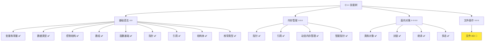
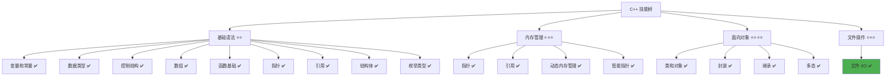

# 文件 I/O 详解

> **学习目标**：掌握 C++ 文件读写操作，理解文件流的使用，学会实现数据持久化  
> **前置知识**：C++ 字符串、类、函数、结构体  
> **预计时间**：60 分钟  
> **难度等级**：⭐⭐⭐  
> **技能收获**：文件流操作、文件读写、数据持久化、文件状态检查  
> **文档版本**：v1.0  
> **最后更新**：2025-11-11

📊 **难度等级说明**

| 等级           | 描述                       | 练习题数量     | 颜色码 |
| -------------- | -------------------------- | -------------- | ------ |
| **⭐**         | 入门级，零基础可学         | 5 题基础概念题 | 🟢绿   |
| **⭐⭐**       | 基础级，需要基本编程概念   | 5 题基础概念题 | 🟡黄   |
| **⭐⭐⭐**     | 中级，需要相关技术基础     | 3 题代码分析题 | 🟠橙   |
| **⭐⭐⭐⭐**   | 高级，需要扎实的技术功底   | 3 题代码分析题 | 🔴红   |
| **⭐⭐⭐⭐⭐** | 专家级，需要丰富的项目经验 | 2 题设计思考题 | 🟣紫   |

## 1. 学习目标

### 1.1 学习动机

- **实际需求**：文件 I/O 是程序与外部数据交互的重要方式，理解文件操作对实现数据持久化至关重要
- **应用场景**：保存用户数据、读取配置文件、记录日志、数据导入导出
- **技能价值**：学会后能实现数据的持久化存储，让程序在关闭后仍能保留数据，为后续项目开发打下基础
- **数据支持**：文件 I/O 是几乎所有应用程序的基础功能，是构建完整软件系统的重要组成部分

### 1.2 技能树位置



> **图表说明**：C++ 技能树结构图，当前文档点亮文件 I/O 技能点

### 1.3 前置知识检查

在开始学习之前，请确认你已经掌握：

- [ ] C++ 字符串（`std::string`）的基础使用
- [ ] 类和对象的基础概念
- [ ] 函数的基础使用
- [ ] 结构体的基础使用

> **未掌握处理**：若未通过，请先复习 [字符串进阶操作](./11-string-advanced.md)、[类和对象详解](./18-classes-objects.md) 和 [结构体详解](./16-struct.md)

## 2. 核心内容

### 2.1 概念理解

**文件 I/O（Input/Output）**：程序与文件之间的数据交换，包括从文件读取数据（输入）和向文件写入数据（输出）。

**数据持久化**：将程序运行时的数据保存到文件中，使数据在程序关闭后仍然保留，下次程序启动时可以重新加载。

> **类比教学**：
>
> - **文件 I/O**：像读写笔记本，可以从笔记本读取内容（读文件），也可以向笔记本写入内容（写文件）
> - **数据持久化**：像把重要信息写在纸上保存，即使电脑关机，信息仍然在纸上，下次开机还能看到
> - **文件流**：像连接程序和文件的"管道"，数据通过这个管道流动
> - **文件打开**：像打开笔记本，需要先打开才能读写
> - **文件关闭**：像合上笔记本，使用完毕后应该关闭，确保数据保存

### 2.2 为什么需要文件 I/O

#### 2.2.1 问题：数据丢失

**问题**：如果不使用文件 I/O，程序运行时的数据只存在于内存中，程序关闭后数据就会丢失。

**示例（未使用文件 I/O）**：

```cpp
#include <iostream>
#include <string>
#include <vector>

struct User {
    std::string name;
    int age;
};

int main() {
    std::vector<User> users;

    // 添加用户
    users.push_back({"张三", 25});
    users.push_back({"李四", 30});

    // 程序关闭后，所有数据丢失！
    return 0;
}
```

**问题**：

- 程序关闭后，所有数据丢失
- 每次运行程序都需要重新输入数据
- 无法保存用户设置、历史记录等重要信息

#### 2.2.2 文件 I/O 的优势

**使用文件 I/O 后**：

```cpp
#include <iostream>
#include <fstream>
#include <string>
#include <vector>

struct User {
    std::string name;
    int age;
};

// 保存用户数据到文件
void saveUsers(const std::vector<User>& users, const std::string& filename) {
    std::ofstream file(filename);
    if (file.is_open()) {
        for (const auto& user : users) {
            file << user.name << " " << user.age << std::endl;
        }
        file.close();
        std::cout << "数据已保存到文件" << std::endl;
    }
}

// 从文件加载用户数据
void loadUsers(std::vector<User>& users, const std::string& filename) {
    std::ifstream file(filename);
    if (file.is_open()) {
        std::string name;
        int age;
        while (file >> name >> age) {
            users.push_back({name, age});
        }
        file.close();
        std::cout << "数据已从文件加载" << std::endl;
    }
}

int main() {
    std::vector<User> users;

    // 从文件加载数据
    loadUsers(users, "users.txt");

    // 添加新用户
    users.push_back({"王五", 28});

    // 保存数据到文件
    saveUsers(users, "users.txt");

    // 程序关闭后，数据仍然保存在文件中！
    return 0;
}
```

**优势**：

- **数据持久化**：数据保存在文件中，程序关闭后仍然保留
- **数据共享**：多个程序可以读取同一个文件
- **数据备份**：可以复制文件进行备份
- **历史记录**：可以保存程序运行的历史数据

### 2.3 文件流类型

C++ 提供了三种文件流类型：

#### 2.3.1 ifstream（输入文件流）

**定义**：用于从文件读取数据的流。

**头文件**：`#include <fstream>`

**用途**：只读文件操作。

**示例**：

```cpp
#include <fstream>
#include <iostream>
#include <string>

int main() {
    std::ifstream file("data.txt");  // 打开文件用于读取

    if (file.is_open()) {
        std::string line;
        while (std::getline(file, line)) {  // 逐行读取
            std::cout << line << std::endl;
        }
        file.close();  // 关闭文件
    } else {
        std::cout << "无法打开文件" << std::endl;
    }

    return 0;
}
```

#### 2.3.2 ofstream（输出文件流）

**定义**：用于向文件写入数据的流。

**头文件**：`#include <fstream>`

**用途**：只写文件操作。

**示例**：

```cpp
#include <fstream>
#include <iostream>
#include <string>

int main() {
    std::ofstream file("output.txt");  // 打开文件用于写入

    if (file.is_open()) {
        file << "第一行" << std::endl;
        file << "第二行" << std::endl;
        file.close();  // 关闭文件
        std::cout << "数据已写入文件" << std::endl;
    } else {
        std::cout << "无法打开文件" << std::endl;
    }

    return 0;
}
```

#### 2.3.3 fstream（文件流）

**定义**：既可以读取也可以写入的文件流。

**头文件**：`#include <fstream>`

**用途**：读写文件操作。

**示例**：

```cpp
#include <fstream>
#include <iostream>
#include <string>

int main() {
    std::fstream file("data.txt", std::ios::in | std::ios::out);  // 打开文件用于读写

    if (file.is_open()) {
        // 读取数据
        std::string line;
        std::getline(file, line);
        std::cout << "读取: " << line << std::endl;

        // 写入数据
        file << "新数据" << std::endl;
        file.close();
    }

    return 0;
}
```

**说明**：对于初学者，通常使用 `ifstream` 读取文件，`ofstream` 写入文件，`fstream` 用于需要同时读写的场景。

### 2.4 文件打开和关闭

#### 2.4.1 打开文件

**方式 1：构造函数打开**

```cpp
std::ifstream file("data.txt");         // 创建时打开文件
```

**方式 2：open() 方法打开**

```cpp
std::ifstream file;
file.open("data.txt");                  // 使用 open() 方法打开
```

**打开模式**：

- `std::ios::in`：只读模式（ifstream 默认）
- `std::ios::out`：只写模式（ofstream 默认，会覆盖原文件）
- `std::ios::app`：追加模式（在文件末尾追加，不覆盖）
- `std::ios::ate`：打开时定位到文件末尾
- `std::ios::binary`：二进制模式

**示例**：

```cpp
// 追加模式
std::ofstream file("data.txt", std::ios::app);
file << "新数据" << std::endl;  // 追加到文件末尾，不覆盖原有内容
```

#### 2.4.2 检查文件是否打开成功

**方法 1：使用 is_open()**

```cpp
std::ifstream file("data.txt");
if (file.is_open()) {
    // 文件打开成功
} else {
    // 文件打开失败（文件不存在或权限不足）
    std::cout << "无法打开文件" << std::endl;
}
```

**方法 2：使用布尔转换**

```cpp
std::ifstream file("data.txt");
if (file) {
    // 文件打开成功
} else {
    // 文件打开失败
}
```

#### 2.4.3 关闭文件

**方法**：使用 `close()` 方法。

```cpp
file.close();  // 关闭文件
```

**说明**：

- 文件流对象销毁时会自动关闭文件
- 但建议显式调用 `close()`，确保及时释放资源
- 关闭文件后，缓冲区中的数据会被写入文件

### 2.5 文件读取操作

#### 2.5.1 逐行读取（推荐）

**方法**：使用 `std::getline()` 函数。

**语法**：`std::getline(文件流, 字符串变量)`

**示例**：

```cpp
#include <fstream>
#include <iostream>
#include <string>

int main() {
    std::ifstream file("data.txt");

    if (file.is_open()) {
        std::string line;
        while (std::getline(file, line)) {  // 逐行读取，直到文件末尾
            std::cout << line << std::endl;
        }
        file.close();
    }

    return 0;
}
```

**特点**：

- 自动处理换行符（读取时去除换行符）
- 适合读取文本文件
- 可以读取包含空格的整行内容

#### 2.5.2 按空格分隔读取

**方法**：使用 `>>` 操作符。

**示例**：

```cpp
#include <fstream>
#include <iostream>
#include <string>

int main() {
    std::ifstream file("data.txt");

    if (file.is_open()) {
        std::string word;
        while (file >> word) {  // 按空格分隔读取
            std::cout << word << std::endl;
        }
        file.close();
    }

    return 0;
}
```

**特点**：

- 自动跳过空格和换行符
- 适合读取格式化的数据（如：姓名 年龄）
- 不能读取包含空格的完整字符串

#### 2.5.3 读取单个字符

**方法**：使用 `get()` 方法。

**示例**：

```cpp
#include <fstream>
#include <iostream>

int main() {
    std::ifstream file("data.txt");

    if (file.is_open()) {
        char ch;
        while (file.get(ch)) {  // 读取单个字符
            std::cout << ch;
        }
        file.close();
    }

    return 0;
}
```

**特点**：

- 读取每个字符（包括空格和换行符）
- 适合需要精确控制读取的场景

### 2.6 文件写入操作

#### 2.6.1 使用 << 操作符写入

**方法**：使用 `<<` 操作符，类似于 `std::cout`。

**示例**：

```cpp
#include <fstream>
#include <iostream>
#include <string>

int main() {
    std::ofstream file("output.txt");

    if (file.is_open()) {
        file << "第一行" << std::endl;
        file << "第二行" << std::endl;

        std::string name = "张三";
        int age = 25;
        file << "姓名: " << name << ", 年龄: " << age << std::endl;

        file.close();
        std::cout << "数据已写入文件" << std::endl;
    }

    return 0;
}
```

**特点**：

- 语法简单，与 `std::cout` 类似
- 可以写入各种类型的数据（字符串、整数、浮点数等）
- 使用 `std::endl` 换行

#### 2.6.2 追加模式写入

**方法**：使用 `std::ios::app` 模式打开文件。

**示例**：

```cpp
#include <fstream>
#include <iostream>

int main() {
    // 追加模式：在文件末尾追加，不覆盖原有内容
    std::ofstream file("log.txt", std::ios::app);

    if (file.is_open()) {
        file << "新的日志记录" << std::endl;
        file.close();
    }

    return 0;
}
```

**特点**：

- 不会覆盖原有内容
- 适合记录日志、追加数据等场景

### 2.7 文件状态检查

#### 2.7.1 检查文件是否存在

**方法**：尝试打开文件，检查是否成功。

**示例**：

```cpp
#include <fstream>
#include <iostream>

bool fileExists(const std::string& filename) {
    std::ifstream file(filename);
    return file.good();  // 如果文件存在且可以打开，返回 true
}

int main() {
    if (fileExists("data.txt")) {
        std::cout << "文件存在" << std::endl;
    } else {
        std::cout << "文件不存在" << std::endl;
    }

    return 0;
}
```

#### 2.7.2 检查文件是否到达末尾

**方法**：使用 `eof()` 方法。

**示例**：

```cpp
#include <fstream>
#include <iostream>
#include <string>

int main() {
    std::ifstream file("data.txt");

    if (file.is_open()) {
        std::string line;
        while (!file.eof()) {  // 检查是否到达文件末尾
            std::getline(file, line);
            if (!line.empty()) {  // 避免读取空行
                std::cout << line << std::endl;
            }
        }
        file.close();
    }

    return 0;
}
```

**说明**：通常使用 `while (std::getline(file, line))` 更简洁，会自动处理文件末尾。

### 2.8 基础示例

以下代码演示了文件 I/O 的基本使用：

```cpp
// 现代 C++ 示例 - 文件 I/O 基础
#include <iostream>
#include <fstream>
#include <string>
#include <vector>

struct User {
    std::string name;
    int age;
};

// 保存用户数据到文件
void saveUsers(const std::vector<User>& users, const std::string& filename) {
    std::ofstream file(filename);

    if (file.is_open()) {
        for (const auto& user : users) {
            file << user.name << " " << user.age << std::endl;
        }
        file.close();
        std::cout << "数据已保存到文件: " << filename << std::endl;
    } else {
        std::cout << "无法打开文件: " << filename << std::endl;
    }
}

// 从文件加载用户数据
void loadUsers(std::vector<User>& users, const std::string& filename) {
    std::ifstream file(filename);

    if (file.is_open()) {
        users.clear();  // 清空现有数据
        std::string name;
        int age;

        while (file >> name >> age) {
            users.push_back({name, age});
        }

        file.close();
        std::cout << "数据已从文件加载: " << filename << std::endl;
        std::cout << "加载了 " << users.size() << " 个用户" << std::endl;
    } else {
        std::cout << "无法打开文件: " << filename << std::endl;
        std::cout << "将创建新文件" << std::endl;
    }
}

// 打印用户列表
void printUsers(const std::vector<User>& users) {
    std::cout << "\n=== 用户列表 ===" << std::endl;
    for (size_t i = 0; i < users.size(); i++) {
        std::cout << (i + 1) << ". " << users[i].name
                  << ", 年龄: " << users[i].age << std::endl;
    }
}

int main() {
    std::vector<User> users;
    const std::string filename = "users.txt";

    // 从文件加载数据
    std::cout << "=== 加载数据 ===" << std::endl;
    loadUsers(users, filename);
    printUsers(users);

    // 添加新用户
    std::cout << "\n=== 添加新用户 ===" << std::endl;
    users.push_back({"张三", 25});
    users.push_back({"李四", 30});
    users.push_back({"王五", 28});
    printUsers(users);

    // 保存数据到文件
    std::cout << "\n=== 保存数据 ===" << std::endl;
    saveUsers(users, filename);

    return 0;
}
```

#### 2.8.1 配套代码文件

项目提供了配套的源代码文件：

- **文件位置**：`src/stage1/22-file-io/01-basic-file-io.cpp`
- **文件内容**：与上面示例完全一致的程序

> **运行提示**：具体的编译运行方法请参考 [C++ 简介和快速入门](./01-cpp-introduction.md) 中的 `2.2.3 编译运行` 部分

#### 2.8.2 运行预期结果

**第一次运行**（文件不存在）：

```
=== 加载数据 ===
无法打开文件: users.txt
将创建新文件

=== 用户列表 ===

=== 添加新用户 ===

=== 用户列表 ===
1. 张三, 年龄: 25
2. 李四, 年龄: 30
3. 王五, 年龄: 28

=== 保存数据 ===
数据已保存到文件: users.txt
```

**第二次运行**（文件已存在）：

```
=== 加载数据 ===
数据已从文件加载: users.txt
加载了 3 个用户

=== 用户列表 ===
1. 张三, 年龄: 25
2. 李四, 年龄: 30
3. 王五, 年龄: 28

=== 添加新用户 ===

=== 用户列表 ===
1. 张三, 年龄: 25
2. 李四, 年龄: 30
3. 王五, 年龄: 28
4. 张三, 年龄: 25
5. 李四, 年龄: 30
6. 王五, 年龄: 28

=== 保存数据 ===
数据已保存到文件: users.txt
```

### 2.9 文件 I/O 的优势

#### 2.9.1 数据持久化

- **保存数据**：程序运行时的数据可以保存到文件中
- **持久存储**：数据在程序关闭后仍然保留
- **数据恢复**：程序重新启动时可以加载之前保存的数据

#### 2.9.2 数据共享

- **多程序共享**：多个程序可以读取同一个文件
- **数据交换**：可以通过文件在不同程序间交换数据
- **数据备份**：可以复制文件进行备份

#### 2.9.3 灵活的数据管理

- **历史记录**：可以保存程序运行的历史数据
- **配置管理**：可以保存和加载程序配置
- **日志记录**：可以记录程序运行日志

### 2.10 文件 I/O 的最佳实践

#### 2.10.1 始终检查文件是否打开成功

**原则**：打开文件后必须检查是否成功。

**示例**：

```cpp
std::ifstream file("data.txt");
if (file.is_open()) {
    // 文件操作
    file.close();
} else {
    std::cout << "错误：无法打开文件" << std::endl;
}
```

#### 2.10.2 及时关闭文件

**原则**：使用完文件后及时关闭。

**示例**：

```cpp
{
    std::ofstream file("output.txt");
    if (file.is_open()) {
        file << "数据" << std::endl;
        file.close();  // 及时关闭
    }
}  // 文件流对象销毁时也会自动关闭
```

#### 2.10.3 使用合适的文件模式

**原则**：根据需求选择合适的文件模式。

**示例**：

```cpp
// 只读：使用 ifstream
std::ifstream file("data.txt");

// 只写（覆盖）：使用 ofstream
std::ofstream file("output.txt");

// 追加：使用 ofstream + app 模式
std::ofstream file("log.txt", std::ios::app);
```

#### 2.10.4 处理文件不存在的情况

**原则**：读取文件时，如果文件不存在，应该创建新文件或给出提示。

**示例**：

```cpp
void loadData(std::vector<User>& users, const std::string& filename) {
    std::ifstream file(filename);
    if (file.is_open()) {
        // 读取数据
        file.close();
    } else {
        std::cout << "文件不存在，将创建新文件" << std::endl;
        // 可以初始化空数据或创建默认文件
    }
}
```

### 2.11 常见陷阱和注意事项

#### 2.11.1 常见错误

**错误 1：忘记检查文件是否打开成功**

```cpp
std::ifstream file("data.txt");
std::string line;
std::getline(file, line);           // 错误！如果文件不存在，会导致错误
```

**正确做法**：

```cpp
std::ifstream file("data.txt");
if (file.is_open()) {
    std::string line;
    std::getline(file, line);
    file.close();
} else {
    std::cout << "无法打开文件" << std::endl;
}
```

**错误 2：忘记关闭文件**

```cpp
std::ofstream file("output.txt");
file << "数据" << std::endl;
// 错误！忘记关闭文件，可能导致数据未完全写入
```

**正确做法**：

```cpp
std::ofstream file("output.txt");
if (file.is_open()) {
    file << "数据" << std::endl;
    file.close();                   // 正确！显式关闭文件
}
```

**错误 3：使用错误的文件模式**

```cpp
std::ofstream file("data.txt");
// 写入数据
file.close();

std::ifstream file2("data.txt");
// 错误！file2 变量名与 file 冲突
```

**正确做法**：

```cpp
{
    std::ofstream file("data.txt");
    if (file.is_open()) {
        file << "数据" << std::endl;
        file.close();
    }
}

{
    std::ifstream file("data.txt");  // 使用不同的作用域
    if (file.is_open()) {
        std::string line;
        std::getline(file, line);
        file.close();
    }
}
```

**最佳实践**：

1. **始终检查文件是否打开成功**：使用 `is_open()` 或布尔转换
2. **及时关闭文件**：使用完文件后调用 `close()`
3. **使用合适的文件模式**：根据需求选择 ifstream、ofstream 或 fstream
4. **处理文件不存在的情况**：读取文件时检查文件是否存在
5. **使用有意义的文件名**：文件名应该清楚表达文件的用途

## 3. 实践应用

### 3.1 项目场景

在 QtLanChat 项目中，文件 I/O 用于：

- **用户数据保存**：保存用户信息、好友列表、聊天记录
- **配置管理**：保存和加载程序配置（主题、字体、窗口大小等）
- **日志记录**：记录程序运行日志、错误信息
- **数据导入导出**：导入/导出用户数据、聊天记录

### 3.2 实际代码

以下代码展示了文件 I/O 在 QtLanChat 项目中的实际应用：

```cpp
// 项目中的实际应用示例
#include <iostream>
#include <fstream>
#include <string>
#include <vector>

struct User {
    std::string name;
    int age;
    bool isOnline;
};

struct Message {
    std::string sender;
    std::string content;
    std::string timestamp;
};

// 用户数据管理类
class UserManager {
private:
    std::vector<User> users;
    const std::string filename = "users.txt";

public:
    // 从文件加载用户数据
    void loadUsers() {
        std::ifstream file(filename);
        if (file.is_open()) {
            users.clear();
            std::string name;
            int age;
            bool isOnline;

            while (file >> name >> age >> isOnline) {
                users.push_back({name, age, isOnline});
            }

            file.close();
            std::cout << "加载了 " << users.size() << " 个用户" << std::endl;
        } else {
            std::cout << "用户文件不存在，将创建新文件" << std::endl;
        }
    }

    // 保存用户数据到文件
    void saveUsers() {
        std::ofstream file(filename);
        if (file.is_open()) {
            for (const auto& user : users) {
                file << user.name << " " << user.age << " "
                     << (user.isOnline ? 1 : 0) << std::endl;
            }
            file.close();
            std::cout << "用户数据已保存" << std::endl;
        } else {
            std::cout << "无法保存用户数据" << std::endl;
        }
    }

    // 添加用户
    void addUser(const std::string& name, int age) {
        users.push_back({name, age, false});
        std::cout << "添加用户: " << name << std::endl;
    }

    // 设置用户在线状态
    void setUserOnline(const std::string& name, bool isOnline) {
        for (auto& user : users) {
            if (user.name == name) {
                user.isOnline = isOnline;
                break;
            }
        }
    }

    // 打印用户列表
    void printUsers() {
        std::cout << "\n=== 用户列表 ===" << std::endl;
        for (size_t i = 0; i < users.size(); i++) {
            std::cout << (i + 1) << ". " << users[i].name
                      << ", 年龄: " << users[i].age
                      << ", 状态: " << (users[i].isOnline ? "在线" : "离线")
                      << std::endl;
        }
    }
};

// 消息记录管理类
class MessageLogger {
private:
    const std::string logFile = "messages.log";

public:
    // 记录消息到日志文件（追加模式）
    void logMessage(const std::string& sender, const std::string& content) {
        std::ofstream file(logFile, std::ios::app);
        if (file.is_open()) {
            file << "[" << sender << "] " << content << std::endl;
            file.close();
        }
    }

    // 读取所有消息记录
    void readAllMessages() {
        std::ifstream file(logFile);
        if (file.is_open()) {
            std::cout << "\n=== 消息记录 ===" << std::endl;
            std::string line;
            while (std::getline(file, line)) {
                std::cout << line << std::endl;
            }
            file.close();
        } else {
            std::cout << "没有消息记录" << std::endl;
        }
    }
};

int main() {
    std::cout << "=== QtLanChat 文件 I/O 应用 ===" << std::endl;

    // 用户管理
    UserManager userManager;

    // 加载用户数据
    std::cout << "\n=== 加载用户数据 ===" << std::endl;
    userManager.loadUsers();
    userManager.printUsers();

    // 添加新用户
    std::cout << "\n=== 添加新用户 ===" << std::endl;
    userManager.addUser("张三", 25);
    userManager.addUser("李四", 30);
    userManager.setUserOnline("张三", true);
    userManager.printUsers();

    // 保存用户数据
    std::cout << "\n=== 保存用户数据 ===" << std::endl;
    userManager.saveUsers();

    // 消息记录
    MessageLogger logger;

    std::cout << "\n=== 记录消息 ===" << std::endl;
    logger.logMessage("张三", "你好，大家好！");
    logger.logMessage("李四", "很高兴认识大家");
    logger.logMessage("张三", "今天天气不错");

    // 读取消息记录
    logger.readAllMessages();

    return 0;
}
```

> **配套代码**：实际应用示例的完整代码位于 `src/stage1/22-file-io/02-project-example.cpp`

### 3.3 设计思路

- **为什么选择这种设计**：使用文件 I/O 实现数据持久化，将用户数据和消息记录保存到文件中，程序关闭后数据仍然保留
- **解决了什么问题**：避免了数据丢失的问题，实现了数据的持久化存储，提高了程序的实用性
- **有什么优势**：数据持久化、数据共享、灵活的数据管理、历史记录保存

## 4. 练习与测试

### 4.1 练习题

#### 练习 1：基础文件读写

**题目**：编写程序，将用户输入的内容保存到文件，然后从文件读取并显示。

**要求**：

- 提示用户输入多行文本（输入 "end" 结束）
- 将输入的内容保存到文件 `input.txt`
- 从文件读取内容并显示

**参考答案**：

```cpp
#include <iostream>
#include <fstream>
#include <string>

int main() {
    std::ofstream outFile("input.txt");

    if (outFile.is_open()) {
        std::cout << "请输入内容（输入 'end' 结束）：" << std::endl;
        std::string line;

        while (std::getline(std::cin, line) && line != "end") {
            outFile << line << std::endl;
        }

        outFile.close();
        std::cout << "内容已保存到文件" << std::endl;
    }

    // 读取文件
    std::ifstream inFile("input.txt");
    if (inFile.is_open()) {
        std::cout << "\n文件内容：" << std::endl;
        std::string line;
        while (std::getline(inFile, line)) {
            std::cout << line << std::endl;
        }
        inFile.close();
    }

    return 0;
}
```

> **配套代码**：练习 1 的完整代码位于 `src/stage1/22-file-io/03-exercise-basic-io.cpp`

#### 练习 2：学生成绩管理

**题目**：编写程序，将学生成绩保存到文件，然后从文件加载并计算平均分。

**要求**：

- 定义 `Student` 结构体（姓名、成绩）
- 输入多个学生的信息
- 将学生信息保存到文件 `students.txt`
- 从文件加载学生信息并计算平均分

**参考答案**：

```cpp
#include <iostream>
#include <fstream>
#include <string>
#include <vector>

struct Student {
    std::string name;
    double score;
};

int main() {
    std::vector<Student> students;

    // 输入学生信息
    std::cout << "请输入学生信息（输入 'end' 结束）：" << std::endl;
    std::string name;
    double score;

    while (std::cin >> name && name != "end") {
        std::cin >> score;
        students.push_back({name, score});
    }

    // 保存到文件
    std::ofstream file("students.txt");
    if (file.is_open()) {
        for (const auto& student : students) {
            file << student.name << " " << student.score << std::endl;
        }
        file.close();
        std::cout << "学生信息已保存" << std::endl;
    }

    // 从文件加载并计算平均分
    std::ifstream inFile("students.txt");
    if (inFile.is_open()) {
        std::vector<Student> loadedStudents;
        std::string name;
        double score;

        while (inFile >> name >> score) {
            loadedStudents.push_back({name, score});
        }
        inFile.close();

        // 计算平均分
        double sum = 0;
        for (const auto& student : loadedStudents) {
            sum += student.score;
        }

        if (!loadedStudents.empty()) {
            double average = sum / loadedStudents.size();
            std::cout << "平均分: " << average << std::endl;
        }
    }

    return 0;
}
```

> **配套代码**：练习 2 的完整代码位于 `src/stage1/22-file-io/04-exercise-student-scores.cpp`

#### 练习 3：日志记录系统

**题目**：编写一个简单的日志记录系统，将日志追加到文件。

**要求**：

- 定义 `logMessage()` 函数，将消息追加到日志文件
- 日志格式：`[时间] 消息内容`
- 使用追加模式，不覆盖原有日志
- 提供读取所有日志的功能

**参考答案**：

```cpp
#include <iostream>
#include <fstream>
#include <string>
#include <ctime>

void logMessage(const std::string& message) {
    std::ofstream file("app.log", std::ios::app);
    if (file.is_open()) {
        // 获取当前时间（简化版）
        time_t now = time(0);
        file << "[" << now << "] " << message << std::endl;
        file.close();
        std::cout << "日志已记录" << std::endl;
    }
}

void readAllLogs() {
    std::ifstream file("app.log");
    if (file.is_open()) {
        std::cout << "\n=== 日志记录 ===" << std::endl;
        std::string line;
        while (std::getline(file, line)) {
            std::cout << line << std::endl;
        }
        file.close();
    } else {
        std::cout << "没有日志记录" << std::endl;
    }
}

int main() {
    logMessage("程序启动");
    logMessage("用户登录");
    logMessage("执行操作");
    logMessage("程序关闭");

    readAllLogs();

    return 0;
}
```

> **配套代码**：练习 3 的完整代码位于 `src/stage1/22-file-io/05-exercise-logger.cpp`

### 4.2 测试题（可选）

1. **关于文件 I/O，下列说法正确的是：**
   A. 文件 I/O 只能读取文本文件

   B. 使用文件 I/O 可以实现数据持久化

   C. 文件打开后不需要关闭

   D. 文件流只能用于读取，不能用于写入
   **答案**：B

   **解析**：
   - **正确答案 B**：使用文件 I/O 可以将数据保存到文件中，实现数据持久化
   - **错误答案 A**：文件 I/O 可以读取和写入文本文件
   - **错误答案 C**：文件使用完毕后应该关闭，确保数据保存和资源释放
   - **错误答案 D**：文件流可以用于读取（ifstream）和写入（ofstream）

2. **关于文件流类型，下列说法正确的是：**
   A. ifstream 用于写入文件

   B. ofstream 用于读取文件

   C. ifstream 用于读取文件，ofstream 用于写入文件

   D. fstream 只能用于读取文件
   **答案**：C

   **解析**：
   - **正确答案 C**：ifstream 用于读取文件，ofstream 用于写入文件
   - **错误答案 A/B/D**：ifstream 用于读取，ofstream 用于写入，fstream 可以同时读写

3. **关于文件打开模式，下列说法正确的是：**
   A. std::ios::app 模式会覆盖原有文件内容

   B. std::ios::app 模式在文件末尾追加内容

   C. 文件打开模式不影响文件操作

   D. 所有文件模式都是相同的
   **答案**：B

   **解析**：
   - **正确答案 B**：std::ios::app 模式在文件末尾追加内容，不覆盖原有内容
   - **错误答案 A/C/D**：不同的文件模式有不同的行为，app 模式是追加，不是覆盖

### 4.3 常见问题 FAQ

- Q1：文件 I/O 和标准输入输出有什么区别？
  - **A：**标准输入输出（std::cin/std::cout）是与用户交互的临时数据流，程序关闭后数据消失。文件 I/O 是将数据保存到文件中，数据可以持久保存，程序关闭后仍然存在。

- Q2：什么时候应该使用文件 I/O？
  - **A：**当需要保存数据、加载配置、记录日志、实现数据持久化时使用文件 I/O。如果只是临时处理数据，使用标准输入输出即可。

- Q3：文件打开失败怎么办？
  - **A：**应该检查文件是否存在、是否有权限访问、路径是否正确。如果文件不存在，可以创建新文件；如果权限不足，需要检查文件权限设置。

- Q4：追加模式和覆盖模式有什么区别？
  - **A：**覆盖模式（默认）会清空文件原有内容，然后写入新内容。追加模式（std::ios::app）在文件末尾追加新内容，保留原有内容。

- Q5：文件 I/O 会影响程序性能吗？
  - **A：**文件 I/O 操作比内存操作慢，但现代计算机的文件 I/O 性能已经足够好。对于大量数据，可以考虑批量读写，减少 I/O 次数。

## 5. 资源与扩展

### 5.1 基础资源

- **官方文档**：[C++ 文件流](https://en.cppreference.com/w/cpp/io/basic_fstream)
- **权威书籍**：《C++ Primer》- 第 8 章
- **在线教程**：[learncpp.com](https://www.learncpp.com/) - 文件 I/O 教程

### 5.2 多媒体学习

- **视频资源**：[C++ 文件 I/O 详解](https://www.youtube.com/results?search_query=C%2B%2B+file+I%2FO+tutorial)
- **开发者资源**：[cppreference.com](https://en.cppreference.com/) - 权威参考

## 6. 课后作业及参考答案

### 6.1 学习检查清单

- [ ] 能够理解文件 I/O 的概念和作用
- [ ] 能够使用 ifstream 读取文件
- [ ] 能够使用 ofstream 写入文件
- [ ] 能够检查文件是否打开成功
- [ ] 能够实现数据持久化
- [ ] 能够使用追加模式写入文件

### 6.2 综合练习

**作业题目**：编写一个简单的通讯录管理系统

**要求**：

- 定义 `Contact` 结构体（姓名、电话、邮箱）
- 实现添加联系人功能
- 实现保存联系人到文件功能
- 实现从文件加载联系人功能
- 实现显示所有联系人功能
- 实现搜索联系人功能（按姓名）

**时间估算**：60 分钟

**参考答案**：

```cpp
#include <iostream>
#include <fstream>
#include <string>
#include <vector>

struct Contact {
    std::string name;
    std::string phone;
    std::string email;
};

class AddressBook {
private:
    std::vector<Contact> contacts;
    const std::string filename = "contacts.txt";

public:
    // 从文件加载联系人
    void loadContacts() {
        std::ifstream file(filename);
        if (file.is_open()) {
            contacts.clear();
            std::string name, phone, email;

            while (file >> name >> phone >> email) {
                contacts.push_back({name, phone, email});
            }

            file.close();
            std::cout << "加载了 " << contacts.size() << " 个联系人" << std::endl;
        }
    }

    // 保存联系人到文件
    void saveContacts() {
        std::ofstream file(filename);
        if (file.is_open()) {
            for (const auto& contact : contacts) {
                file << contact.name << " " << contact.phone
                     << " " << contact.email << std::endl;
            }
            file.close();
            std::cout << "联系人已保存" << std::endl;
        }
    }

    // 添加联系人
    void addContact(const std::string& name, const std::string& phone,
                    const std::string& email) {
        contacts.push_back({name, phone, email});
        std::cout << "添加联系人: " << name << std::endl;
    }

    // 显示所有联系人
    void displayAll() {
        std::cout << "\n=== 通讯录 ===" << std::endl;
        if (contacts.empty()) {
            std::cout << "通讯录为空" << std::endl;
            return;
        }

        for (size_t i = 0; i < contacts.size(); i++) {
            std::cout << (i + 1) << ". " << contacts[i].name
                      << ", 电话: " << contacts[i].phone
                      << ", 邮箱: " << contacts[i].email << std::endl;
        }
    }

    // 搜索联系人
    void searchContact(const std::string& name) {
        std::cout << "\n=== 搜索结果 ===" << std::endl;
        bool found = false;

        for (const auto& contact : contacts) {
            if (contact.name == name) {
                std::cout << "姓名: " << contact.name << std::endl;
                std::cout << "电话: " << contact.phone << std::endl;
                std::cout << "邮箱: " << contact.email << std::endl;
                found = true;
                break;
            }
        }

        if (!found) {
            std::cout << "未找到联系人: " << name << std::endl;
        }
    }
};

int main() {
    AddressBook book;

    // 加载联系人
    book.loadContacts();

    // 添加联系人
    book.addContact("张三", "13800138000", "zhangsan@example.com");
    book.addContact("李四", "13900139000", "lisi@example.com");
    book.addContact("王五", "13700137000", "wangwu@example.com");

    // 显示所有联系人
    book.displayAll();

    // 搜索联系人
    book.searchContact("李四");

    // 保存联系人
    book.saveContacts();

    return 0;
}
```

**评分标准**：功能实现（40%）、文件 I/O 使用正确（30%）、代码质量（30%）

## 7. 下一步学习

**下一篇**：面向对象编程基础已完成，可以开始学习更高级的 C++ 特性或进行综合实践

**学习路径**：

1. ✅ C++ 简介和快速入门 - 已完成
2. ✅ 变量和常量 - 已完成
3. ✅ 数据类型详解 - 已完成
4. ✅ 运算符详解 - 已完成
5. ✅ if 分支详解 - 已完成
6. ✅ while 循环 - 已完成
7. ✅ for 循环 - 已完成
8. ✅ switch 分支 - 已完成
9. ✅ 数组基础 - 已完成
10. ✅ std::vector - 已完成
11. ✅ 字符串进阶 - 已完成
12. ✅ 函数基础 - 已完成
13. ✅ 指针详解 - 已完成
14. ✅ 引用详解 - 已完成
15. ✅ 内存管理 - 已完成
16. ✅ 结构体 - 已完成
17. ✅ 枚举类型 - 已完成
18. ✅ 类和对象 - 已完成
19. ✅ 封装 - 已完成
20. ✅ 继承 - 已完成
21. ✅ 多态 - 已完成
22. ✅ 文件 I/O - 已完成

**技能树更新**：



**学习成果**：

- **独立编写**：能够使用文件流进行文件读写操作，实现数据持久化
- **解释原理**：能够解释文件 I/O 的作用和优势
- **解决实际问题**：能够使用文件 I/O 保存和加载数据，实现数据持久化
- **应用到项目**：掌握了文件 I/O 的基础操作，为后续项目开发打下基础
- **掌握度自评**：85%

### 学习成果指导

> **自评指导**：
>
> - **<50%**：建议复习文件 I/O 的基础概念，重新阅读文档核心内容
> - **50-80%**：继续学习，完成练习题巩固理解
> - **>80%**：恭喜！你已经掌握了文件 I/O 的基础操作，可以开始进行综合实践

---

**文档质量检查**：

- [x] 学习目标明确且可验证
- [x] 代码示例可运行
- [x] 练习题有答案
- [x] 技能收获明确
- [x] 抽象概念配有生活化比喻
- [x] 比喻体系一致，避免概念混乱
- [x] 文档长度符合难度等级要求
