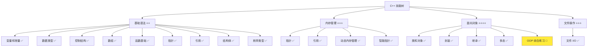
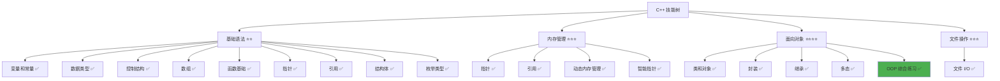

# OOP 综合练习

> **学习目标**：综合运用类和对象、封装、继承、多态等面向对象编程知识，完成实际项目案例  
> **前置知识**：C++ 类和对象、封装、继承、多态、文件 I/O  
> **预计时间**：90 分钟  
> **难度等级**：⭐⭐⭐⭐  
> **技能收获**：OOP 综合应用、类设计、继承层次、多态实现、实际项目开发  
> **文档版本**：v1.0  
> **最后更新**：2025-11-11

📊 **难度等级说明**

| 等级           | 描述                       | 练习题数量     | 颜色码 |
| -------------- | -------------------------- | -------------- | ------ |
| **⭐**         | 入门级，零基础可学         | 5 题基础概念题 | 🟢绿   |
| **⭐⭐**       | 基础级，需要基本编程概念   | 5 题基础概念题 | 🟡黄   |
| **⭐⭐⭐**     | 中级，需要相关技术基础     | 3 题代码分析题 | 🟠橙   |
| **⭐⭐⭐⭐**   | 高级，需要扎实的技术功底   | 3 题代码分析题 | 🔴红   |
| **⭐⭐⭐⭐⭐** | 专家级，需要丰富的项目经验 | 2 题设计思考题 | 🟣紫   |

## 1. 学习目标

### 1.1 学习动机

- **实际需求**：面向对象编程是构建大型软件系统的基础，综合运用 OOP 知识对实际项目开发至关重要
- **应用场景**：系统设计、类层次设计、接口设计、代码复用、功能扩展
- **技能价值**：学会后能更好地设计类结构，实现代码复用，提高代码的可维护性和可扩展性
- **数据支持**：OOP 是 C++ 的核心特性，是构建现代软件系统的基础

### 1.2 技能树位置



> **图表说明**：C++ 技能树结构图，当前文档点亮 OOP 综合练习技能点

### 1.3 前置知识检查

在开始学习之前，请确认你已经掌握：

- [ ] C++ 类的定义和使用（成员变量、成员函数、构造函数、析构函数）
- [ ] 封装的概念和实现（访问控制、getter/setter）
- [ ] 继承的概念和实现（基类、派生类、protected 成员）
- [ ] 多态的概念和实现（虚函数、虚析构函数、纯虚函数、抽象类）
- [ ] 文件 I/O 的基础使用（ifstream、ofstream）

> **未掌握处理**：若未通过，请先复习 [类和对象详解](./18-classes-objects.md)、[封装详解](./19-encapsulation.md)、[继承详解](./20-inheritance.md)、[多态详解](./21-polymorphism.md) 和 [文件 I/O 详解](./22-file-io.md)

## 2. 综合案例：图书管理系统

### 2.1 需求分析

设计一个图书管理系统，要求：

1. **图书类（Book）**：包含书名、作者、价格、库存数量
2. **图书类型**：普通图书、电子图书、有声图书（使用继承）
3. **功能要求**：
   - 添加图书
   - 显示图书信息（使用多态）
   - 借阅图书（减少库存）
   - 归还图书（增加库存）
   - 保存和加载图书数据（使用文件 I/O）

### 2.2 类设计

#### 2.2.1 基类设计（抽象类）

```cpp
// 图书基类（抽象类）
class Book {
protected:
    std::string title;      // 书名
    std::string author;     // 作者
    double price;           // 价格
    int stock;              // 库存数量

public:
    Book(const std::string& t, const std::string& a, double p, int s)
        : title(t), author(a), price(p), stock(s) {}

    virtual ~Book() {}  // 虚析构函数

    // Getter 方法
    std::string getTitle() const { return title; }
    std::string getAuthor() const { return author; }
    double getPrice() const { return price; }
    int getStock() const { return stock; }

    // Setter 方法（带验证）
    void setPrice(double p) {
        if (p >= 0) {
            price = p;
        }
    }

    void setStock(int s) {
        if (s >= 0) {
            stock = s;
        }
    }

    // 借阅图书
    bool borrow() {
        if (stock > 0) {
            stock--;
            return true;
        }
        return false;
    }

    // 归还图书
    void returnBook() {
        stock++;
    }

    // 纯虚函数：显示图书信息（不同图书类型有不同的显示方式）
    virtual void displayInfo() const = 0;

    // 纯虚函数：获取图书类型
    virtual std::string getType() const = 0;

    // 虚函数：保存到文件（可以被子类重写）
    virtual void saveToFile(std::ofstream& file) const {
        file << getType() << " " << title << " " << author
             << " " << price << " " << stock << std::endl;
    }
};
```

#### 2.2.2 派生类设计

```cpp
// 普通图书类
class RegularBook : public Book {
public:
    RegularBook(const std::string& t, const std::string& a, double p, int s)
        : Book(t, a, p, s) {}

    void displayInfo() const override {
        std::cout << "=== 普通图书 ===" << std::endl;
        std::cout << "书名: " << title << std::endl;
        std::cout << "作者: " << author << std::endl;
        std::cout << "价格: ¥" << price << std::endl;
        std::cout << "库存: " << stock << " 本" << std::endl;
    }

    std::string getType() const override {
        return "Regular";
    }
};

// 电子图书类
class EBook : public Book {
private:
    std::string format;  // 格式（PDF、EPUB 等）

public:
    EBook(const std::string& t, const std::string& a, double p, int s,
          const std::string& f)
        : Book(t, a, p, s), format(f) {}

    std::string getFormat() const { return format; }

    void displayInfo() const override {
        std::cout << "=== 电子图书 ===" << std::endl;
        std::cout << "书名: " << title << std::endl;
        std::cout << "作者: " << author << std::endl;
        std::cout << "价格: ¥" << price << std::endl;
        std::cout << "格式: " << format << std::endl;
        std::cout << "库存: " << stock << " 份" << std::endl;
    }

    std::string getType() const override {
        return "EBook";
    }

    void saveToFile(std::ofstream& file) const override {
        file << getType() << " " << title << " " << author
             << " " << price << " " << stock << " " << format << std::endl;
    }
};

// 有声图书类
class AudioBook : public Book {
private:
    int duration;  // 时长（分钟）

public:
    AudioBook(const std::string& t, const std::string& a, double p, int s,
              int d)
        : Book(t, a, p, s), duration(d) {}

    int getDuration() const { return duration; }

    void displayInfo() const override {
        std::cout << "=== 有声图书 ===" << std::endl;
        std::cout << "书名: " << title << std::endl;
        std::cout << "作者: " << author << std::endl;
        std::cout << "价格: ¥" << price << std::endl;
        std::cout << "时长: " << duration << " 分钟" << std::endl;
        std::cout << "库存: " << stock << " 份" << std::endl;
    }

    std::string getType() const override {
        return "Audio";
    }

    void saveToFile(std::ofstream& file) const override {
        file << getType() << " " << title << " " << author
             << " " << price << " " << stock << " " << duration << std::endl;
    }
};
```

### 2.3 图书管理类

```cpp
// 图书管理类
class BookManager {
private:
    std::vector<std::unique_ptr<Book>> books;  // 使用智能指针管理图书
    const std::string filename = "books.txt";

public:
    // 添加图书（使用多态）
    void addBook(std::unique_ptr<Book> book) {
        books.push_back(std::move(book));
        std::cout << "添加图书成功！" << std::endl;
    }

    // 显示所有图书（使用多态）
    void displayAllBooks() const {
        if (books.empty()) {
            std::cout << "图书库为空" << std::endl;
            return;
        }

        std::cout << "\n=== 图书列表 ===" << std::endl;
        for (size_t i = 0; i < books.size(); i++) {
            std::cout << "\n[" << (i + 1) << "] ";
            books[i]->displayInfo();  // 多态：根据实际类型调用相应的函数
        }
    }

    // 借阅图书
    bool borrowBook(int index) {
        if (index >= 0 && index < static_cast<int>(books.size())) {
            if (books[index]->borrow()) {
                std::cout << "借阅成功！" << std::endl;
                return true;
            } else {
                std::cout << "库存不足，无法借阅" << std::endl;
                return false;
            }
        } else {
            std::cout << "无效的图书编号" << std::endl;
            return false;
        }
    }

    // 归还图书
    void returnBook(int index) {
        if (index >= 0 && index < static_cast<int>(books.size())) {
            books[index]->returnBook();
            std::cout << "归还成功！" << std::endl;
        } else {
            std::cout << "无效的图书编号" << std::endl;
        }
    }

    // 保存图书到文件
    void saveToFile() const {
        std::ofstream file(filename);
        if (file.is_open()) {
            for (const auto& book : books) {
                book->saveToFile(file);  // 多态：根据实际类型调用相应的函数
            }
            file.close();
            std::cout << "图书数据已保存到文件" << std::endl;
        } else {
            std::cout << "无法保存文件" << std::endl;
        }
    }

    // 从文件加载图书
    void loadFromFile() {
        std::ifstream file(filename);
        if (file.is_open()) {
            books.clear();
            std::string type, title, author, format;
            double price;
            int stock, duration;

            while (file >> type) {
                if (type == "Regular") {
                    file >> title >> author >> price >> stock;
                    books.push_back(std::make_unique<RegularBook>(title, author, price, stock));
                } else if (type == "EBook") {
                    file >> title >> author >> price >> stock >> format;
                    books.push_back(std::make_unique<EBook>(title, author, price, stock, format));
                } else if (type == "Audio") {
                    file >> title >> author >> price >> stock >> duration;
                    books.push_back(std::make_unique<AudioBook>(title, author, price, stock, duration));
                }
            }
            file.close();
            std::cout << "图书数据已从文件加载" << std::endl;
        } else {
            std::cout << "文件不存在，将创建新文件" << std::endl;
        }
    }
};
```

### 2.4 完整示例代码

```cpp
// OOP 综合练习 - 图书管理系统
#include <iostream>
#include <string>
#include <vector>
#include <memory>
#include <fstream>

// ... 上面的类定义 ...

int main() {
    std::cout << "=== 图书管理系统 ===" << std::endl;

    BookManager manager;

    // 从文件加载数据
    std::cout << "\n=== 加载数据 ===" << std::endl;
    manager.loadFromFile();

    // 添加图书（使用多态）
    std::cout << "\n=== 添加图书 ===" << std::endl;
    manager.addBook(std::make_unique<RegularBook>("C++ Primer", "Stanley Lippman", 128.0, 5));
    manager.addBook(std::make_unique<EBook>("Effective C++", "Scott Meyers", 68.0, 10, "PDF"));
    manager.addBook(std::make_unique<AudioBook>("设计模式", "四人帮", 88.0, 3, 360));

    // 显示所有图书（使用多态）
    manager.displayAllBooks();

    // 借阅图书
    std::cout << "\n=== 借阅图书 ===" << std::endl;
    manager.borrowBook(0);  // 借阅第一本书

    // 显示更新后的信息
    manager.displayAllBooks();

    // 保存数据到文件
    std::cout << "\n=== 保存数据 ===" << std::endl;
    manager.saveToFile();

    return 0;
}
```

> **配套代码**：完整示例代码位于 `src/stage1/23-oop-practice/01-book-management.cpp`

### 2.5 设计思路

#### 2.5.1 为什么使用抽象类

- **统一接口**：`Book` 抽象类定义了所有图书类型的共同接口（`displayInfo()`、`getType()`）
- **强制实现**：派生类必须实现纯虚函数，确保每个图书类型都有自己的显示方式
- **多态基础**：通过基类指针可以统一处理不同的图书类型

#### 2.5.2 为什么使用继承

- **代码复用**：共同的属性和方法（书名、作者、价格、库存）在基类中定义一次
- **功能扩展**：派生类可以添加特有的属性（格式、时长）
- **易于维护**：修改基类，所有派生类自动继承修改

#### 2.5.3 为什么使用多态

- **统一处理**：通过基类指针可以统一处理不同的图书类型
- **灵活扩展**：添加新的图书类型时，不需要修改管理类的代码
- **代码简化**：不需要为每个图书类型编写不同的处理代码

#### 2.5.4 为什么使用封装

- **数据保护**：使用 `private`/`protected` 保护数据，防止外部直接修改
- **接口设计**：通过 `public` 方法提供清晰的接口
- **数据验证**：在 setter 方法中验证数据的合法性

#### 2.5.5 为什么使用智能指针

- **自动管理**：使用 `std::unique_ptr` 自动管理内存，避免内存泄漏
- **所有权明确**：明确表示图书管理类拥有图书对象的所有权
- **异常安全**：即使发生异常，也能正确释放内存

## 3. 练习与测试

### 3.1 练习题

#### 练习 1：员工管理系统

**题目**：设计一个员工管理系统，包含以下要求：

1. **基类（Employee）**：抽象类，包含姓名、年龄、基本工资
2. **派生类**：
   - `Manager`（经理）：有管理津贴
   - `Developer`（开发者）：有项目奖金
   - `Designer`（设计师）：有设计费
3. **功能要求**：
   - 计算总工资（使用多态，不同员工类型有不同的计算方式）
   - 显示员工信息（使用多态）
   - 添加和显示所有员工

**要求**：

- 使用封装保护数据
- 使用继承实现代码复用
- 使用多态实现统一处理
- 实现虚函数和纯虚函数

**参考答案**：

```cpp
#include <iostream>
#include <string>
#include <vector>
#include <memory>

class Employee {
protected:
    std::string name;
    int age;
    double baseSalary;

public:
    Employee(const std::string& n, int a, double s)
        : name(n), age(a), baseSalary(s) {}

    virtual ~Employee() {}

    std::string getName() const { return name; }
    int getAge() const { return age; }

    // 纯虚函数：计算总工资
    virtual double calculateSalary() const = 0;

    // 纯虚函数：显示信息
    virtual void displayInfo() const = 0;
};

class Manager : public Employee {
private:
    double managementBonus;

public:
    Manager(const std::string& n, int a, double s, double b)
        : Employee(n, a, s), managementBonus(b) {}

    double calculateSalary() const override {
        return baseSalary + managementBonus;
    }

    void displayInfo() const override {
        std::cout << "=== 经理 ===" << std::endl;
        std::cout << "姓名: " << name << std::endl;
        std::cout << "年龄: " << age << std::endl;
        std::cout << "基本工资: ¥" << baseSalary << std::endl;
        std::cout << "管理津贴: ¥" << managementBonus << std::endl;
        std::cout << "总工资: ¥" << calculateSalary() << std::endl;
    }
};

class Developer : public Employee {
private:
    double projectBonus;

public:
    Developer(const std::string& n, int a, double s, double b)
        : Employee(n, a, s), projectBonus(b) {}

    double calculateSalary() const override {
        return baseSalary + projectBonus;
    }

    void displayInfo() const override {
        std::cout << "=== 开发者 ===" << std::endl;
        std::cout << "姓名: " << name << std::endl;
        std::cout << "年龄: " << age << std::endl;
        std::cout << "基本工资: ¥" << baseSalary << std::endl;
        std::cout << "项目奖金: ¥" << projectBonus << std::endl;
        std::cout << "总工资: ¥" << calculateSalary() << std::endl;
    }
};

class EmployeeManager {
private:
    std::vector<std::unique_ptr<Employee>> employees;

public:
    void addEmployee(std::unique_ptr<Employee> emp) {
        employees.push_back(std::move(emp));
    }

    void displayAll() const {
        for (size_t i = 0; i < employees.size(); i++) {
            std::cout << "\n[" << (i + 1) << "] ";
            employees[i]->displayInfo();  // 多态
        }
    }

    double calculateTotalSalary() const {
        double total = 0;
        for (const auto& emp : employees) {
            total += emp->calculateSalary();  // 多态
        }
        return total;
    }
};

int main() {
    EmployeeManager manager;

    manager.addEmployee(std::make_unique<Manager>("张三", 35, 10000, 5000));
    manager.addEmployee(std::make_unique<Developer>("李四", 28, 8000, 3000));
    manager.addEmployee(std::make_unique<Developer>("王五", 30, 9000, 4000));

    manager.displayAll();

    std::cout << "\n总工资支出: ¥" << manager.calculateTotalSalary() << std::endl;

    return 0;
}
```

> **配套代码**：练习 1 的完整代码位于 `src/stage1/23-oop-practice/02-exercise-employee.cpp`

#### 练习 2：图形绘制系统（增强版）

**题目**：设计一个图形绘制系统，包含以下要求：

1. **基类（Shape）**：抽象类，包含颜色属性
2. **派生类**：
   - `Circle`（圆形）：有半径
   - `Rectangle`（矩形）：有宽度和高度
   - `Triangle`（三角形）：有三条边
3. **功能要求**：
   - 计算面积（使用多态）
   - 计算周长（使用多态）
   - 绘制图形（使用多态）
   - 保存和加载图形数据（使用文件 I/O）

**要求**：

- 使用封装、继承、多态
- 实现文件 I/O 功能
- 使用智能指针管理对象

**参考答案**：

```cpp
#include <iostream>
#include <string>
#include <vector>
#include <memory>
#include <fstream>
#include <cmath>

class Shape {
protected:
    std::string color;

public:
    Shape(const std::string& c) : color(c) {}
    virtual ~Shape() {}

    std::string getColor() const { return color; }
    void setColor(const std::string& c) { color = c; }

    virtual double getArea() const = 0;
    virtual double getPerimeter() const = 0;
    virtual void draw() const = 0;
    virtual std::string getType() const = 0;
};

class Circle : public Shape {
private:
    double radius;

public:
    Circle(const std::string& c, double r) : Shape(c), radius(r) {}

    double getArea() const override {
        return 3.14159 * radius * radius;
    }

    double getPerimeter() const override {
        return 2 * 3.14159 * radius;
    }

    void draw() const override {
        std::cout << "绘制 " << color << " 的圆形，半径: " << radius << std::endl;
    }

    std::string getType() const override {
        return "Circle";
    }
};

class Rectangle : public Shape {
private:
    double width;
    double height;

public:
    Rectangle(const std::string& c, double w, double h)
        : Shape(c), width(w), height(h) {}

    double getArea() const override {
        return width * height;
    }

    double getPerimeter() const override {
        return 2 * (width + height);
    }

    void draw() const override {
        std::cout << "绘制 " << color << " 的矩形，宽度: " << width
                  << ", 高度: " << height << std::endl;
    }

    std::string getType() const override {
        return "Rectangle";
    }
};

class ShapeManager {
private:
    std::vector<std::unique_ptr<Shape>> shapes;
    const std::string filename = "shapes.txt";

public:
    void addShape(std::unique_ptr<Shape> shape) {
        shapes.push_back(std::move(shape));
    }

    void displayAll() const {
        for (size_t i = 0; i < shapes.size(); i++) {
            std::cout << "\n[" << (i + 1) << "] ";
            shapes[i]->draw();
            std::cout << "面积: " << shapes[i]->getArea() << std::endl;
            std::cout << "周长: " << shapes[i]->getPerimeter() << std::endl;
        }
    }

    void saveToFile() const {
        std::ofstream file(filename);
        if (file.is_open()) {
            for (const auto& shape : shapes) {
                file << shape->getType() << " " << shape->getColor() << std::endl;
            }
            file.close();
        }
    }
};

int main() {
    ShapeManager manager;

    manager.addShape(std::make_unique<Circle>("红色", 5.0));
    manager.addShape(std::make_unique<Rectangle>("蓝色", 4.0, 6.0));

    manager.displayAll();
    manager.saveToFile();

    return 0;
}
```

> **配套代码**：练习 2 的完整代码位于 `src/stage1/23-oop-practice/03-exercise-shape.cpp`

### 3.2 测试题（可选）

1. **关于 OOP 综合应用，下列说法正确的是：**
   A. 只能使用继承，不能使用多态

   B. 封装、继承、多态应该独立使用，不能组合使用

   C. 在实际项目中，封装、继承、多态通常组合使用，实现复杂的系统设计

   D. 抽象类不能有成员变量

   **答案**：C

   **解析**：
   - **正确答案 C**：在实际项目中，封装、继承、多态通常组合使用，实现复杂的系统设计
   - **错误答案 A**：继承和多态可以一起使用，多态需要继承作为基础
   - **错误答案 B**：封装、继承、多态可以组合使用，这是 OOP 的核心优势
   - **错误答案 D**：抽象类可以有成员变量，只是不能创建对象

2. **关于智能指针在 OOP 中的应用，下列说法正确的是：**
   A. 智能指针不能用于管理继承层次中的对象

   B. 智能指针可以用于管理继承层次中的对象，支持多态

   C. 智能指针只能用于管理单个对象，不能用于容器

   D. 智能指针不支持多态

   **答案**：B

   **解析**：
   - **正确答案 B**：智能指针可以用于管理继承层次中的对象，支持多态
   - **错误答案 A/C/D**：智能指针可以用于管理继承层次中的对象，支持多态，也可以用于容器

### 3.3 常见问题 FAQ

- Q1：在实际项目中，什么时候应该使用抽象类？
  - **A：**当需要定义接口规范，强制派生类实现某些功能时使用抽象类。例如，定义"支付方式"接口，所有具体的支付方式（支付宝、微信、银行卡）都必须实现支付功能。

- Q2：继承和多态有什么区别？
  - **A：**继承是代码复用的机制，派生类继承基类的成员；多态是运行时行为，通过虚函数实现，同一个接口可以有不同的实现。继承是多态的基础。

- Q3：为什么在实际项目中要使用智能指针？
  - **A：**智能指针可以自动管理内存，避免内存泄漏，提高代码的安全性。特别是在异常情况下，智能指针能确保资源被正确释放。

- Q4：封装、继承、多态如何组合使用？
  - **A：**封装用于保护数据和设计接口；继承用于代码复用和功能扩展；多态用于统一处理和灵活扩展。三者组合使用，可以实现复杂而灵活的系统设计。

## 4. 资源与扩展

### 4.1 基础资源

- **官方文档**：[C++ 面向对象编程](https://en.cppreference.com/w/cpp/language/classes)
- **权威书籍**：《C++ Primer》- 第 15-19 章
- **在线教程**：[learncpp.com](https://www.learncpp.com/) - OOP 教程

### 4.2 多媒体学习

- **视频资源**：[C++ OOP 综合应用](https://www.youtube.com/results?search_query=C%2B%2B+OOP+tutorial)
- **开发者资源**：[cppreference.com](https://en.cppreference.com/) - 权威参考

## 5. 课后作业及参考答案

### 5.1 学习检查清单

- [ ] 能够设计合理的类层次结构
- [ ] 能够使用封装保护数据
- [ ] 能够使用继承实现代码复用
- [ ] 能够使用多态实现统一处理
- [ ] 能够综合运用 OOP 知识完成实际项目

### 5.2 综合练习

**作业题目**：设计一个简单的聊天系统

**要求**：

1. **用户类（User）**：抽象类，包含用户名、在线状态
2. **派生类**：
   - `NormalUser`（普通用户）：有消息计数
   - `AdminUser`（管理员）：有管理权限
3. **消息类（Message）**：包含发送者、内容、时间戳
4. **聊天管理器（ChatManager）**：
   - 添加用户（使用多态）
   - 发送消息
   - 显示所有消息
   - 保存和加载数据（使用文件 I/O）

**时间估算**：90 分钟

**评分标准**：功能实现（40%）、OOP 设计（30%）、代码质量（30%）

## 6. 下一步学习

**下一篇**：面向对象编程基础已完成，可以开始学习系统设计和项目实战

**学习路径**：

1. ✅ C++ 简介和快速入门 - 已完成
2. ✅ 变量和常量 - 已完成
3. ✅ 数据类型详解 - 已完成
4. ✅ 运算符详解 - 已完成
5. ✅ if 分支详解 - 已完成
6. ✅ while 循环 - 已完成
7. ✅ for 循环 - 已完成
8. ✅ switch 分支 - 已完成
9. ✅ 数组基础 - 已完成
10. ✅ std::vector - 已完成
11. ✅ 字符串进阶 - 已完成
12. ✅ 函数基础 - 已完成
13. ✅ 指针详解 - 已完成
14. ✅ 引用详解 - 已完成
15. ✅ 内存管理 - 已完成
16. ✅ 结构体 - 已完成
17. ✅ 枚举类型 - 已完成
18. ✅ 类和对象 - 已完成
19. ✅ 封装 - 已完成
20. ✅ 继承 - 已完成
21. ✅ 多态 - 已完成
22. ✅ 文件 I/O - 已完成
23. ✅ OOP 综合练习 - 已完成

**技能树更新**：



**学习成果**：

- **独立编写**：能够综合运用封装、继承、多态设计复杂的类层次结构
- **解释原理**：能够解释 OOP 三大特性的作用和组合使用方式
- **解决实际问题**：能够使用 OOP 知识完成实际项目开发
- **应用到项目**：掌握了 OOP 的综合应用，为后续项目开发打下基础
- **掌握度自评**：85%

### 学习成果指导

> **自评指导**：
>
> - **<50%**：建议复习 OOP 的基础概念，重新阅读相关文档
> - **50-80%**：继续学习，完成练习题巩固理解
> - **>80%**：恭喜！你已经掌握了 OOP 的综合应用，可以开始进行系统设计和项目实战

---

**文档质量检查**：

- [x] 学习目标明确且可验证
- [x] 代码示例可运行
- [x] 练习题有答案
- [x] 技能收获明确
- [x] 抽象概念配有生活化比喻
- [x] 比喻体系一致，避免概念混乱
- [x] 文档长度符合难度等级要求
