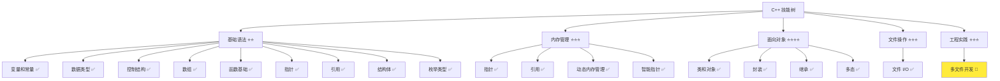
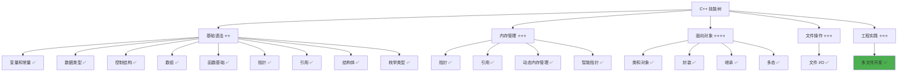

# 多文件开发基础

> **学习目标**：掌握 C++ 多文件开发的基础知识，理解头文件和源文件分离，学会编译和链接多个文件，能够在 Cursor 中配置和调试多文件项目  
> **前置知识**：C++ 类和对象、函数、基本数据类型  
> **预计时间**：90 分钟  
> **难度等级**：⭐⭐⭐  
> **技能收获**：多文件开发、头文件分离、编译链接、Cursor 项目配置  
> **文档版本**：v1.0  
> **最后更新**：2025-11-11

📊 **难度等级说明**

| 等级           | 描述                       | 练习题数量     | 颜色码 |
| -------------- | -------------------------- | -------------- | ------ |
| **⭐**         | 入门级，零基础可学         | 5 题基础概念题 | 🟢绿   |
| **⭐⭐**       | 基础级，需要基本编程概念   | 5 题基础概念题 | 🟡黄   |
| **⭐⭐⭐**     | 中级，需要相关技术基础     | 3 题代码分析题 | 🟠橙   |
| **⭐⭐⭐⭐**   | 高级，需要扎实的技术功底   | 3 题代码分析题 | 🔴红   |
| **⭐⭐⭐⭐⭐** | 专家级，需要丰富的项目经验 | 2 题设计思考题 | 🟣紫   |

## 1. 学习目标

### 1.1 学习动机

- **实际需求**：单文件开发只适合小程序，实际项目需要将代码组织到多个文件中，提高代码的可维护性和可读性
- **应用场景**：大型项目开发、团队协作、代码复用、模块化设计
- **技能价值**：学会后能开发复杂的 C++ 项目，为后续 Qt 开发打下坚实基础
- **数据支持**：所有实际 C++ 项目都采用多文件开发，这是从学习到实战的必经之路

### 1.2 技能树位置



> **图表说明**：C++ 技能树结构图，当前文档点亮多文件开发技能点

### 1.3 前置知识检查

在开始学习之前，请确认你已经掌握：

- [ ] C++ 类的定义和使用（成员变量、成员函数、构造函数）
- [ ] 函数的基础使用（定义、调用、参数传递）
- [ ] 基本数据类型（int、string、bool 等）
- [ ] 头文件包含（`#include`）的基础使用

> **未掌握处理**：若未通过，请先复习 [类和对象详解](./18-classes-objects.md)、[函数基础](./12-functions.md) 和 [数据类型详解](./03-data-types.md)

## 2. 核心内容

### 2.1 概念理解

**多文件开发**：将程序代码组织到多个文件中，每个文件负责不同的功能模块，通过头文件和源文件分离实现代码的模块化和可维护性。

> **类比教学**：多文件开发就像建造一栋大楼，不能把所有房间都放在一个楼层。我们需要将不同的功能模块（如卧室、厨房、客厅）分别放在不同的文件中，就像将不同的房间放在不同的楼层。头文件就像每层楼的"楼层说明牌"，告诉其他楼层这里有什么功能；源文件就像实际的房间，包含具体的实现。

### 2.2 为什么需要多文件开发

#### 2.2.1 单文件开发的问题

**问题 1：代码难以管理**

```cpp
// 所有代码都在一个文件中（main.cpp，假设有 1000 行）
#include <iostream>
#include <string>
#include <vector>

// 用户类定义（200 行）
class User {
    // ...
};

// 消息类定义（200 行）
class Message {
    // ...
};

// 网络类定义（200 行）
class Network {
    // ...
};

// 主函数（400 行）
int main() {
    // ...
}
```

**问题**：

- 代码太长，难以查找和修改
- 所有功能混在一起，难以理解
- 修改一个功能可能影响其他功能

**问题 2：无法复用代码**

```cpp
// 项目 A 需要 User 类
// 项目 B 也需要 User 类
// 但 User 类在项目 A 的 main.cpp 中，无法直接使用
```

**问题**：

- 无法在其他项目中复用代码
- 需要复制粘贴代码，容易出错
- 修改代码需要在多个地方同步

**问题 3：团队协作困难**

```cpp
// 多人同时修改同一个文件
// 容易产生冲突，难以合并代码
```

**问题**：

- 多人同时编辑容易产生冲突
- 难以分工协作
- 代码审查困难

#### 2.2.2 多文件开发的优势

**优势 1：代码组织清晰**

```
项目结构：
├── user.h          // 用户类声明（50 行）
├── user.cpp        // 用户类实现（150 行）
├── message.h       // 消息类声明（50 行）
├── message.cpp     // 消息类实现（150 行）
├── network.h       // 网络类声明（50 行）
├── network.cpp     // 网络类实现（150 行）
└── main.cpp        // 主函数（100 行）
```

**优势**：

- 每个文件职责单一，易于理解
- 代码结构清晰，易于查找
- 修改一个模块不影响其他模块

**优势 2：代码复用方便**

```cpp
// 项目 A 和项目 B 都可以使用
#include "user.h"  // 直接包含头文件即可
```

**优势**：

- 可以在多个项目中复用代码
- 修改代码只需修改一处
- 提高开发效率

**优势 3：团队协作顺畅**

```
开发者 A：负责 user.h 和 user.cpp
开发者 B：负责 message.h 和 message.cpp
开发者 C：负责 network.h 和 network.cpp
```

**优势**：

- 多人可以同时开发不同模块
- 减少代码冲突
- 提高开发效率

### 2.3 头文件和源文件分离

#### 2.3.1 头文件（.h 或 .hpp）

**定义**：头文件包含类的声明、函数的声明、常量的定义等，告诉编译器"有什么"，但不包含具体的实现。

> **类比教学**：头文件就像"产品说明书"，告诉你这个产品有什么功能，但不告诉你这些功能是如何实现的。就像手机说明书告诉你手机有拍照功能，但不告诉你拍照的具体技术原理。

**头文件的作用**：

- **声明接口**：告诉其他文件可以使用哪些类和函数
- **提供信息**：告诉编译器类的结构、函数的参数和返回值
- **避免重复**：多个源文件可以包含同一个头文件，避免重复声明

**头文件示例**：

```cpp
// user.h - 用户类头文件
#ifndef USER_H                      // 头文件保护（稍后讲解）
#define USER_H

#include <string>

// 用户类声明
class User {
private:
    std::string name;
    int age;

public:
    // 构造函数声明
    User(const std::string& n, int a);

    // 成员函数声明
    void printInfo() const;
    std::string getName() const;
    int getAge() const;
};

#endif  // USER_H
```

**说明**：

- 头文件只包含**声明**，不包含**实现**
- 使用 `#ifndef` 和 `#define` 进行头文件保护（稍后详细讲解）
- 包含必要的头文件（如 `#include <string>`）

#### 2.3.2 源文件（.cpp）

**定义**：源文件包含类的实现、函数的具体代码等，告诉编译器"怎么做"。

> **类比教学**：源文件就像"产品制造手册"，详细说明如何实现每个功能。就像手机制造手册详细说明如何制造拍照功能。

**源文件的作用**：

- **实现功能**：包含类和函数的具体实现代码
- **编译单元**：每个源文件是一个独立的编译单元
- **链接目标**：编译后生成目标文件，链接时合并

**源文件示例**：

```cpp
// user.cpp - 用户类源文件
#include "user.h"                   // 1. 相关头文件（当前文件对应的头文件）
#include <iostream>                 // 2. C++ 标准库头文件

// 构造函数实现
User::User(const std::string& n, int a) : name(n), age(a) {}

// 成员函数实现
void User::printInfo() const {
    std::cout << "姓名: " << name << std::endl;
    std::cout << "年龄: " << age << std::endl;
}

std::string User::getName() const {
    return name;
}

int User::getAge() const {
    return age;
}
```

> **📌 头文件包含顺序最佳实践**：
>
> 根据 Google C++ 风格指南，推荐的头文件包含顺序为：
>
> 1. **相关头文件**：首先包含与当前源文件对应的头文件（如 `user.cpp` 中的 `"user.h"`）
>    - 这样可以验证头文件的自给自足性（self-contained），确保头文件包含了它所需的所有依赖
> 2. **C 系统头文件**：如 `<cstdio>`、`<cstdlib>` 等
> 3. **C++ 标准库头文件**：如 `<iostream>`、`<vector>`、`<string>` 等
> 4. **其他库的头文件**：第三方库的头文件
> 5. **本项目内的其他头文件**：其他模块的头文件
>
> **为什么相关头文件要放在最前面？**
>
> - 验证头文件的自给自足性：如果头文件缺少必要的包含，编译时会立即发现错误
> - 避免隐藏依赖：确保头文件包含了它所需的所有依赖，不会因为源文件的包含顺序而意外工作
> - 提高代码可维护性：头文件可以独立编译，不依赖于源文件的包含顺序

**说明**：

- 源文件包含**实现**，不包含**声明**
- 必须包含对应的头文件（`#include "user.h"`）
- 使用 `类名::函数名` 的语法实现成员函数

#### 2.3.3 主文件（main.cpp）

**主文件示例**：

```cpp
// main.cpp - 主程序文件
#include <iostream>                 // 1. C++ 标准库头文件
#include "user.h"                   // 2. 项目头文件（本项目内的头文件）

int main() {
    // 使用 User 类
    User user("张三", 25);
    user.printInfo();

    return 0;
}
```

> **📌 主文件的头文件包含顺序**：
>
> 对于 `main.cpp` 这样的主文件（没有对应的头文件），根据 Google C++ 风格指南，推荐顺序为：
>
> 1. **C++ 标准库头文件**：如 `<iostream>`、`<vector>` 等
> 2. **项目头文件**：本项目内的头文件（如 `"user.h"`）
>
> **为什么标准库头文件在前？**
>
> - 符合 Google C++ 风格指南的统一规范
> - 标准库头文件通常更稳定，放在前面可以避免项目头文件的变化影响标准库的包含
> - 提高代码的可读性和一致性

**说明**：

- 主文件只需要包含需要的头文件
- 不需要知道类的具体实现
- 通过头文件了解可用的接口

### 2.4 头文件保护

#### 2.4.1 为什么需要头文件保护

**问题场景**：

```cpp
// main.cpp
#include "user.h"
#include "message.h"

// message.h
#include "user.h"  // message.h 也需要使用 User 类

// 编译时会出现错误：User 类被重复定义
```

> **📌 预处理器工作机制说明**：
>
> 在 C++ 编译过程中，**预处理器（Preprocessor）**会在编译之前处理所有的 `#include` 指令。预处理器的工作方式是：
>
> 1. **找到头文件**：根据 `#include` 指令找到对应的头文件
> 2. **完整嵌入**：将头文件的**全部内容**（逐字逐句）插入到 `#include` 指令所在的位置
> 3. **递归处理**：如果头文件中还有 `#include`，继续递归处理
> 4. **生成临时文件**：生成一个包含所有内容的临时文件，然后交给编译器编译
>
> **类比教学**：预处理器就像"复制粘贴助手"，当你写 `#include "user.h"` 时，它会找到 `user.h` 文件，把里面的所有内容完整地复制粘贴到 `#include` 的位置，就像你手动把 `user.h` 的内容全部写在那里一样。
>
> **示例说明**：
>
> ```cpp
> // user.h 的内容
> class User {
>     std::string name;
>     int age;
> };
>
> // main.cpp
> #include "user.h"  // 预处理器会把 user.h 的内容插入到这里
> int main() { ... }
>
> // 预处理后，main.cpp 实际上变成了：
> class User {       // ← 从 user.h 插入的内容
>     std::string name;
>     int age;
> };
> int main() { ... }
> ```

**错误原因**：

当 `main.cpp` 包含 `message.h` 时，预处理器会这样处理：

1. **第一步**：处理 `#include "user.h"`
   - 预处理器找到 `user.h`，将其内容插入到 `main.cpp` 中
   - 此时 `main.cpp` 中有了 `User` 类的定义

2. **第二步**：处理 `#include "message.h"`
   - 预处理器找到 `message.h`，发现它内部有 `#include "user.h"`
   - 预处理器再次找到 `user.h`，将其内容插入到 `message.h` 的位置
   - 此时 `main.cpp` 中**第二次**出现了 `User` 类的定义

3. **结果**：`User` 类被定义了两次，编译器报错：**重复定义错误**

**可视化过程**：

```cpp
// 原始文件
main.cpp:
  #include "user.h"      ← 第一次包含
  #include "message.h"   ← message.h 内部也有 #include "user.h"

// 预处理后（实际交给编译器的内容）
main.cpp:
  class User { ... };    ← 从 user.h 第一次插入
  class User { ... };    ← 从 message.h → user.h 第二次插入（重复！）
  // 其他代码...
```

**为什么会出现重复定义？**

- C++ 不允许同一个类、函数或变量被定义多次（可以声明多次，但不能定义多次）
- 预处理器只是简单地把头文件内容插入，不会检查是否重复
- 因此需要头文件保护机制来避免重复包含

#### 2.4.2 头文件保护方法

> **📌 补充说明：预处理器指令（`#ifndef`、`#define`、`#endif`）**：
>
> 在讲解头文件保护之前，需要了解几个预处理器指令：
>
> - **`#define 宏名称`**：定义一个宏（可以理解为定义一个标识符），告诉预处理器"这个名称已经存在了"
>   - 例如：`#define USER_H` 表示定义了名为 `USER_H` 的宏
> - **`#ifndef 宏名称`**：条件编译指令，表示"如果没有定义这个宏"
>   - 例如：`#ifndef USER_H` 表示"如果没有定义 `USER_H`"
>   - 如果条件为真（未定义），则执行后续代码，直到遇到 `#endif`
>   - 如果条件为假（已定义），则跳过后续代码，直到遇到 `#endif`
> - **`#endif`**：结束条件编译块
>
> **类比教学**：
>
> - `#define USER_H` 就像在门口挂一个"已登记"的牌子
> - `#ifndef USER_H` 就像检查门口是否有"已登记"的牌子
>   - 如果没有牌子（未定义），就进入房间并挂上牌子（定义宏，包含代码）
>   - 如果已经有牌子（已定义），就跳过这个房间（不包含代码）
> - `#endif` 就像房间的出口
>
> **简单示例**：
>
> ```cpp
> #ifndef FLAG        // 如果没有定义 FLAG
> #define FLAG        // 定义 FLAG
> // 这里的代码只在第一次时执行
> #endif              // 结束条件编译
> ```

**方法 1：使用 `#ifndef` 和 `#define`（传统方法）**

```cpp
// user.h
#ifndef USER_H      // 如果没有定义 USER_H
#define USER_H      // 定义 USER_H

#include <string>

class User {
    // ...
};

#endif  // USER_H
```

**工作原理**：

1. **第一次包含 `user.h` 时**：
   - 预处理器检查 `USER_H` 是否已定义 → **未定义**
   - 执行 `#define USER_H`，标记 `USER_H` 已定义
   - 继续处理后续代码（包含类定义）
   - 遇到 `#endif`，结束条件编译块

2. **第二次包含 `user.h` 时**：
   - 预处理器检查 `USER_H` 是否已定义 → **已定义**（第一次包含时定义的）
   - 跳过从 `#ifndef` 到 `#endif` 之间的所有代码
   - 不包含类定义，避免重复定义

3. **结果**：无论 `user.h` 被包含多少次，类定义只会被包含一次

**可视化过程**：

```
// 第一次包含 user.h
#ifndef USER_H          ← 检查：USER_H 未定义 → 进入
#define USER_H          ← 定义 USER_H
class User { ... };     ← 包含类定义
#endif

// 第二次包含 user.h
#ifndef USER_H          ← 检查：USER_H 已定义 → 跳过
#define USER_H          ← 跳过
class User { ... };     ← 跳过（避免重复！）
#endif
```

> **类比教学**：头文件保护就像"门禁系统"，第一次进入时登记（定义 `USER_H`），第二次进入时检查已登记（`USER_H` 已定义），直接放行，避免重复登记。

**方法 2：使用 `#pragma once`（现代方法，推荐）**

```cpp
// user.h
#pragma once                        // 告诉编译器这个文件只包含一次

#include <string>

class User {
    // ...
};
```

**工作原理**：

- `#pragma once` 是编译器指令，告诉编译器这个文件只包含一次
- 更简洁，不需要定义宏名称
- 大多数现代编译器都支持

**两种方法对比**：

| 方法           | 优点                     | 缺点                       | 推荐度   |
| -------------- | ------------------------ | -------------------------- | -------- |
| `#ifndef`      | 标准 C++，所有编译器支持 | 需要定义宏名称             | ⭐⭐⭐   |
| `#pragma once` | 简洁，易于使用           | 不是标准 C++（但广泛支持） | ⭐⭐⭐⭐ |

> **建议**：优先使用 `#pragma once`，如果遇到不支持的编译器，再使用 `#ifndef`。

### 2.5 多文件编译和链接

#### 2.5.1 编译过程

**单文件编译**：

```bash
# 编译单个文件
clang++ main.cpp -o main
```

**多文件编译**：

```bash
# 方法 1：一次性编译所有文件（简单项目）
clang++ main.cpp user.cpp message.cpp -o program

# 方法 2：分别编译后链接（推荐，适合大型项目）
clang++ -c user.cpp -o user.o               # 编译 user.cpp 生成 user.o
clang++ -c message.cpp -o message.o         # 编译 message.cpp 生成 message.o
clang++ -c main.cpp -o main.o               # 编译 main.cpp 生成 main.o
clang++ user.o message.o main.o -o program  # 链接所有目标文件
```

**编译选项说明**：

- `-c`：只编译，不链接，生成目标文件（.o）
- `-o`：指定输出文件名
- 不指定 `-c`：编译并链接，直接生成可执行文件

#### 2.5.2 链接过程

**链接的作用**：

- 将多个目标文件（.o）合并成一个可执行文件
- 解析函数调用，找到函数的实际地址
- 处理外部引用，确保所有符号都有定义

> **类比教学**：链接就像"组装零件"，将各个编译好的模块（目标文件）组装成完整的程序（可执行文件）。就像将汽车的各个部件（发动机、车轮、车身）组装成完整的汽车。

**链接示例**：

```bash
# 假设有以下文件：
# user.cpp -> user.o
# message.cpp -> message.o
# main.cpp -> main.o

# 链接所有目标文件
clang++ user.o message.o main.o -o program
```

**链接过程**：

1. 收集所有目标文件中的符号（函数、变量）
2. 解析函数调用，找到函数的定义
3. 合并所有代码，生成可执行文件

#### 2.5.3 编译错误和链接错误

**编译错误**（Compile Error）：

- 发生在编译阶段
- 通常是语法错误、类型错误、未定义的标识符
- 每个源文件独立编译，一个文件的错误不影响其他文件

```cpp
// user.cpp
#include "user.h"

void User::printInfo() const {
    std::cout << name << std::endl  // 错误：缺少分号（编译错误）
}
```

**链接错误**（Link Error）：

- 发生在链接阶段
- 通常是未定义的函数、重复定义、找不到库文件
- 需要所有源文件都编译成功才能发现

```cpp
// main.cpp
#include "user.h"

int main() {
    User user("张三", 25);
    user.printInfo();  // 链接错误：找不到 printInfo() 的实现
    return 0;
}
```

### 2.6 基础示例：简单的多文件项目

#### 2.6.1 项目结构

```
project/
├── user.h          // 用户类头文件
├── user.cpp        // 用户类源文件
└── main.cpp        // 主程序文件
```

#### 2.6.2 完整代码示例

**user.h**：

```cpp
// user.h - 用户类头文件
#pragma once

#include <string>

class User {
private:
    std::string name;
    int age;

public:
    // 构造函数
    User(const std::string& n, int a);

    // 成员函数
    void printInfo() const;
    std::string getName() const;
    int getAge() const;
};
```

**user.cpp**：

```cpp
// user.cpp - 用户类源文件
#include "user.h"
#include <iostream>

// 构造函数实现
User::User(const std::string& n, int a) : name(n), age(a) {}

// 成员函数实现
void User::printInfo() const {
    std::cout << "=== 用户信息 ===" << std::endl;
    std::cout << "姓名: " << name << std::endl;
    std::cout << "年龄: " << age << std::endl;
}

std::string User::getName() const {
    return name;
}

int User::getAge() const {
    return age;
}
```

**main.cpp**：

```cpp
// main.cpp - 主程序文件
#include <iostream>
#include "user.h"

int main() {
    // 创建用户对象
    User user1("张三", 25);
    User user2("李四", 30);

    // 使用用户对象
    user1.printInfo();
    std::cout << std::endl;
    user2.printInfo();

    return 0;
}
```

#### 2.6.3 编译和运行

**编译命令**：

```bash
# 方法 1：一次性编译（简单项目）
clang++ -std=c++17 main.cpp user.cpp -o program

# 方法 2：分别编译后链接（推荐）
clang++ -std=c++17 -c user.cpp -o user.o
clang++ -std=c++17 -c main.cpp -o main.o
clang++ user.o main.o -o program
```

**运行**：

```bash
./program
```

**预期输出**：

```
=== 用户信息 ===
姓名: 张三
年龄: 25

=== 用户信息 ===
姓名: 李四
年龄: 30
```

#### 2.6.4 配套代码文件

项目提供了配套的源代码文件：

- **文件位置**：`src/stage1/24-multi-file-basics/01-basic-example/`
- **文件内容**：与上面示例完全一致的程序

> **运行提示**：具体的编译运行方法请参考下面的 `2.7 Cursor 多文件项目配置` 部分

### 2.7 Cursor 多文件项目配置

#### 2.7.1 为什么需要配置

**问题**：

- Cursor（基于 VS Code）默认只能编译单个文件（使用 Run Code 扩展）
- 多文件项目需要手动输入多个文件的编译命令，很麻烦
- 调试多文件项目需要配置调试器，否则无法设置断点、查看变量

**解决方案**：

- 配置 `tasks.json`：定义编译任务，一键编译多文件项目
- 配置 `launch.json`：定义调试配置，支持断点调试、单步执行、查看变量

> **📌 什么是 tasks.json 和 launch.json？**
>
> - **`tasks.json`**：定义"任务"（Task），比如编译、运行、测试等。就像定义一系列自动化脚本，按快捷键就能执行。
>   - 作用：把复杂的编译命令保存起来，按 `Cmd+Shift+B` 就能执行
>   - 类比：就像把常用的命令做成快捷方式，不用每次都手动输入
> - **`launch.json`**：定义"启动配置"（Launch Configuration），告诉调试器如何启动和调试程序。
>   - 作用：配置调试器，支持断点、单步执行、查看变量等调试功能
>   - 类比：就像配置调试工具的参数，告诉它要调试哪个程序、从哪里开始

#### 2.7.2 tasks.json 详解

**什么是 tasks.json？**

`tasks.json` 是 VS Code/Cursor 的任务配置文件，用于定义可以在编辑器中执行的命令（如编译、运行、测试等）。

**为什么需要 tasks.json？**

- **手动编译麻烦**：每次都要在终端输入 `clang++ main.cpp user.cpp -o program`
- **命令容易出错**：文件名、路径容易写错
- **无法一键执行**：需要手动输入，效率低

**tasks.json 的作用**：

- 把编译命令保存为"任务"
- 按 `Cmd+Shift+B`（macOS）或 `Ctrl+Shift+B`（Windows/Linux）就能执行
- 编译错误会显示在"问题"面板中，点击可以直接跳转到错误位置

**如何创建 tasks.json？**

**步骤 1：创建 `.vscode` 目录**

在项目根目录创建 `.vscode` 目录（如果不存在）：

```bash
mkdir -p .vscode
```

**步骤 2：创建 `tasks.json` 文件**

在 `.vscode` 目录下创建 `tasks.json` 文件，内容如下：

```json
{
  "version": "2.0.0",
  "tasks": [
    {
      "label": "build-current-dir",
      "type": "shell",
      "command": "clang++",
      "args": ["-std=c++17", "-g", "-Wall", "${fileDirname}/*.cpp", "-o", "${fileDirname}/program"],
      "group": {
        "kind": "build",
        "isDefault": true
      },
      "presentation": {
        "echo": true,
        "reveal": "always",
        "focus": false,
        "panel": "shared"
      },
      "problemMatcher": ["$gcc"],
      "detail": "编译当前目录下的所有 .cpp 文件"
    }
  ]
}
```

**配置项详解**：

| 配置项                     | 说明                                           | 类比           |
| -------------------------- | ---------------------------------------------- | -------------- |
| `label`                    | 任务名称，用于在其他地方引用（如 launch.json） | 任务的"名字"   |
| `type: "shell"`            | 任务类型，`shell` 表示在终端中执行命令         | 在终端中运行   |
| `command`                  | 要执行的命令（`clang++` 或 `g++`）             | 命令本身       |
| `args`                     | 命令的参数（编译选项、源文件、输出文件）       | 命令的"参数"   |
| `group.isDefault: true`    | 设为默认构建任务，按 `Cmd+Shift+B` 直接执行    | 设为"默认任务" |
| `problemMatcher: ["$gcc"]` | 错误匹配器，用于解析编译错误并显示在"问题"面板 | 自动识别错误   |
| `presentation`             | 控制任务输出在终端中的显示方式                 | 控制显示效果   |

**变量说明**（VS Code/Cursor 提供的特殊变量）：

| 变量                         | 说明                               | 示例                             |
| ---------------------------- | ---------------------------------- | -------------------------------- |
| `${fileDirname}`             | 当前打开文件所在的目录             | `/Users/.../01-basic-example`    |
| `${fileBasename}`            | 当前打开文件的文件名               | `main.cpp`                       |
| `${fileBasenameNoExtension}` | 当前打开文件的文件名（不含扩展名） | `main`                           |
| `${workspaceFolder}`         | 工作区根目录                       | `/Users/.../QtLanChat-FeiQClone` |

**为什么使用 `${fileDirname}/*.cpp`？**

- **适应不同目录**：无论你在哪个目录（`01-basic-example`、`02-project-example` 等），都能编译当前目录下的所有 `.cpp` 文件
- **自动包含所有文件**：使用通配符 `*.cpp`，不需要手动列出每个文件
- **一个配置通用**：不需要为每个目录创建不同的配置

**如何使用 tasks.json？**

1. **执行任务**：
   - **方法 1（推荐）**：按 `Cmd+Shift+B`（macOS）或 `Ctrl+Shift+B`（Windows/Linux），直接执行默认构建任务
   - **方法 2**：`Cmd+Shift+P`（macOS）或 `Ctrl+Shift+P`（Windows/Linux）→ 输入 "Tasks: Run Task" → 选择 "build-current-dir" 任务

2. **查看输出**：
   - 编译结果会显示在终端中
   - 编译错误会显示在"问题"面板（`Cmd+Shift+M`）中，点击可以直接跳转到错误位置
   - 编译成功后，会在当前目录下生成 `program` 可执行文件

#### 2.7.3 launch.json 详解

**什么是 launch.json？**

`launch.json` 是 VS Code/Cursor 的调试配置文件，用于配置调试器如何启动和调试程序。

**为什么需要 launch.json？**

- **Run Code 扩展的限制**：只能运行单文件，不支持多文件项目的调试
- **无法设置断点**：没有调试配置，断点不会生效
- **无法查看变量**：无法在运行时查看变量的值
- **无法单步执行**：无法逐行执行代码，观察程序执行过程

**launch.json 的作用**：

- 配置调试器（LLDB 或 GDB）
- 支持断点调试：在代码中设置断点，程序会在断点处停止
- 支持单步执行：逐行执行代码，观察每一步的变化
- 支持查看变量：在调试过程中查看变量的值
- 支持调用栈：查看函数调用关系

**如何创建 launch.json？**

在 `.vscode` 目录下创建 `launch.json` 文件，内容如下：

```json
{
  "version": "0.2.0",
  "configurations": [
    {
      "name": "Debug Current Directory",
      "type": "lldb",
      "request": "launch",
      "program": "${fileDirname}/program",
      "args": [],
      "cwd": "${fileDirname}",
      "preLaunchTask": "build-current-dir",
      "stopOnEntry": false,
      "console": "integratedTerminal"
    }
  ]
}
```

**配置项详解**：

| 配置项               | 说明                                                 | 类比             |
| -------------------- | ---------------------------------------------------- | ---------------- |
| `name`               | 调试配置名称，在调试面板中显示                       | 配置的"名字"     |
| `type: "lldb"`       | 调试器类型（macOS 使用 `lldb`，Linux 使用 `cppdbg`） | 使用的调试工具   |
| `request: "launch"`  | 启动方式，`launch` 表示启动新程序                    | 启动新程序       |
| `program`            | 要调试的可执行文件路径                               | 要调试的程序     |
| `args`               | 程序启动时的命令行参数                               | 程序的"参数"     |
| `cwd`                | 程序运行的工作目录                                   | 程序的"工作目录" |
| `preLaunchTask`      | 调试前执行的任务（自动编译）                         | 调试前先编译     |
| `stopOnEntry: false` | 是否在 `main()` 函数入口处停止（`false` 表示不停止） | 是否在入口停止   |
| `console`            | 控制台类型，`integratedTerminal` 表示使用集成终端    | 输出位置         |

**为什么使用 `${fileDirname}/program`？**

- **适应不同目录**：无论你在哪个目录，都能调试当前目录下的程序
- **自动匹配**：与 `tasks.json` 中的输出文件路径一致
- **一个配置通用**：不需要为每个目录创建不同的配置

**调试功能详解**：

**1. 设置断点**：

- **方法**：在代码行号左侧点击，会出现红色圆点
- **作用**：程序运行到断点处会自动停止
- **取消断点**：再次点击红色圆点

**2. 开始调试**：

- **方法**：按 `F5` 或点击调试面板的"开始调试"按钮
- **过程**：
  1. 自动执行 `preLaunchTask`（编译程序）
  2. 如果编译成功，启动调试器
  3. 程序开始运行，遇到断点会停止

**3. 调试控制**：

| 操作         | 快捷键         | 说明                                       |
| ------------ | -------------- | ------------------------------------------ |
| **继续执行** | `F5`           | 继续运行，直到下一个断点                   |
| **单步跳过** | `F10`          | 执行当前行，不进入函数内部                 |
| **单步进入** | `F11`          | 执行当前行，如果遇到函数调用，进入函数内部 |
| **单步跳出** | `Shift+F11`    | 跳出当前函数，返回到调用处                 |
| **重启调试** | `Cmd+Shift+F5` | 重新开始调试                               |
| **停止调试** | `Shift+F5`     | 停止调试                                   |

**4. 查看变量**：

- **变量面板**：左侧"变量"面板显示当前作用域的所有变量
- **监视面板**：可以添加表达式，实时查看其值
- **悬停查看**：在代码中悬停在变量上，会显示变量的值
- **调用栈**：显示函数调用关系，可以看到程序是如何到达当前位置的

**5. 调试输出**：

- **调试控制台**：显示程序的输出（`std::cout`）
- **终端**：如果使用 `integratedTerminal`，输出会显示在终端中

**调试示例**：

假设你在 `main.cpp` 中设置了断点：

```cpp
// main.cpp
#include <iostream>
#include "user.h"

int main() {
    User user1("张三", 25);  // ← 在这里设置断点
    user1.printInfo();
    return 0;
}
```

**调试过程**：

1. **设置断点**：在第 5 行左侧点击，出现红色圆点
2. **开始调试**：按 `F5`
3. **程序停止**：程序在第 5 行停止，此时 `user1` 还未创建
4. **单步执行**：按 `F10`，执行第 5 行，`user1` 被创建
5. **查看变量**：在"变量"面板中可以看到 `user1` 的成员变量值
6. **继续执行**：按 `F5`，程序继续运行，执行 `printInfo()`
7. **观察输出**：在终端中看到程序输出

#### 2.7.4 完整配置示例

**适用于不同目录的通用配置**：

**`.vscode/tasks.json`**：

```json
{
  "version": "2.0.0",
  "tasks": [
    {
      "label": "build-current-dir",
      "type": "shell",
      "command": "clang++",
      "args": ["-std=c++17", "-g", "-Wall", "${fileDirname}/*.cpp", "-o", "${fileDirname}/program"],
      "group": {
        "kind": "build",
        "isDefault": true
      },
      "presentation": {
        "echo": true,
        "reveal": "always",
        "focus": false,
        "panel": "shared"
      },
      "problemMatcher": ["$gcc"],
      "detail": "编译当前目录下的所有 .cpp 文件"
    }
  ]
}
```

**`.vscode/launch.json`**：

```json
{
  "version": "0.2.0",
  "configurations": [
    {
      "name": "Debug Current Directory",
      "type": "lldb",
      "request": "launch",
      "program": "${fileDirname}/program",
      "args": [],
      "cwd": "${fileDirname}",
      "preLaunchTask": "build-current-dir",
      "stopOnEntry": false,
      "console": "integratedTerminal"
    }
  ]
}
```

**配置说明**：

- **`${fileDirname}/*.cpp`**：编译当前打开文件所在目录下的所有 `.cpp` 文件
- **`${fileDirname}/program`**：可执行文件输出到当前目录
- **`preLaunchTask: "build-current-dir"`**：调试前自动执行编译任务
- **一个配置通用**：无论你在 `01-basic-example`、`02-project-example` 还是其他目录，都能使用

**使用步骤**：

1. **打开任意目录下的 `.cpp` 文件**（如 `01-basic-example/main.cpp`）
2. **编译**：
   - 按 `Cmd+Shift+B`（macOS）或 `Ctrl+Shift+B`（Windows/Linux），自动编译当前目录下的所有 `.cpp` 文件
   - 或者：`Cmd+Shift+P` → "Tasks: Run Task" → 选择 "build-current-dir"
3. **设置断点**：在代码行号左侧点击，出现红色圆点
4. **开始调试**：
   - 按 `F5`，如果弹出选择配置，选择 "Debug Current Directory"
   - 程序会自动编译（如果 `preLaunchTask` 已配置）并启动调试
5. **调试操作**：
   - 使用 `F10`（单步跳过）、`F11`（单步进入）等快捷键进行单步调试
   - 在左侧"变量"面板查看变量值
   - 在终端中查看程序输出

#### 2.7.5 常见问题

**Q1：编译失败怎么办？**

- 检查终端输出的错误信息
- 检查"问题"面板（`Cmd+Shift+M`）中的错误
- 确保所有源文件都在同一目录下
- 确保头文件路径正确

**Q2：断点不生效怎么办？**

- 确保编译时使用了 `-g` 选项（生成调试信息）
- 确保 `preLaunchTask` 配置正确
- 确保可执行文件路径正确

**Q3：如何调试其他目录的项目？**

- 打开目标目录下的任意 `.cpp` 文件（如 `02-project-example/main.cpp`）
- 使用相同的快捷键（`Cmd+Shift+B` 编译，`F5` 调试）
- 配置会自动适应当前目录，无需修改配置文件
- 已验证：`01-basic-example`、`02-project-example` 等目录都能正常工作

**Q4：如何查看变量的值？**

- **变量面板**：左侧"运行和调试"面板中的"变量"部分
- **悬停查看**：在代码中悬停在变量名上
- **监视面板**：添加表达式，实时查看其值

**Q5：如何单步执行？**

- **`F10`**：单步跳过（Step Over），执行当前行，不进入函数内部
- **`F11`**：单步进入（Step Into），如果遇到函数调用，进入函数内部
- **`Shift+F11`**：单步跳出（Step Out），跳出当前函数，返回到调用处

**Q6：按 `Cmd+Shift+B` 没有执行编译任务怎么办？**

- 确保 `tasks.json` 中的 `group.isDefault` 设置为 `true`
- 如果有多个构建任务，VS Code 会弹出选择菜单，选择 "build-current-dir"
- 也可以使用 `Cmd+Shift+P` → "Tasks: Run Task" → 选择 "build-current-dir"

### 2.8 关键特性与设计原理

#### 2.8.1 关键特性

1. **模块化设计**：将代码组织到多个文件中，每个文件负责特定功能
2. **接口与实现分离**：头文件声明接口，源文件实现功能
3. **编译单元独立**：每个源文件独立编译，提高编译效率
4. **代码复用**：头文件可以在多个项目中复用

#### 2.8.2 设计原理

- **为什么这样设计**：大型项目需要模块化，单文件无法管理复杂代码
- **解决了什么问题**：代码组织、团队协作、代码复用、编译效率
- **有什么优势**：清晰的结构、易于维护、提高开发效率

### 2.9 常见陷阱和注意事项

#### 2.9.1 常见错误

**错误 1：忘记头文件保护**

```cpp
// user.h - 错误示例
#include <string>

class User {
    // ...
};
// 缺少头文件保护，可能被重复包含
```

**正确做法**：

```cpp
// user.h - 正确示例
#pragma once

#include <string>

class User {
    // ...
};
```

**错误 2：在头文件中实现函数**

```cpp
// user.h - 错误示例
class User {
public:
    void printInfo() {
        std::cout << name << std::endl;  // 错误：在头文件中实现
    }
};
```

**正确做法**：

```cpp
// user.h - 正确示例
class User {
public:
    void printInfo();  // 只声明
};

// user.cpp - 正确示例
void User::printInfo() {
    std::cout << name << std::endl;  // 在源文件中实现
}
```

**错误 3：忘记包含必要的头文件**

```cpp
// user.cpp - 错误示例
#include "user.h"
// 忘记包含 <iostream>，但使用了 std::cout

void User::printInfo() {
    std::cout << name << std::endl;  // 编译错误
}
```

**正确做法**：

```cpp
// user.cpp - 正确示例
#include "user.h"
#include <iostream>  // 包含必要的头文件

void User::printInfo() {
    std::cout << name << std::endl;
}
```

**错误 4：编译时遗漏源文件**

```bash
# 错误：只编译了 main.cpp
clang++ main.cpp -o program
# 链接错误：找不到 User 类的实现
```

**正确做法**：

```bash
# 正确：编译所有源文件
clang++ main.cpp user.cpp -o program
```

#### 2.9.2 最佳实践

1. **头文件只包含声明**：不要在头文件中实现函数（内联函数除外）
2. **使用头文件保护**：始终使用 `#pragma once` 或 `#ifndef`
3. **包含必要的头文件**：在源文件中包含所有需要的头文件
4. **合理组织文件结构**：相关功能放在同一目录下
5. **使用有意义的文件名**：文件名应该反映文件的功能

## 3. 实践应用

### 3.1 项目场景

在 QtLanChat 项目中，多文件开发用于：

- **用户管理模块**：`user.h` 和 `user.cpp` 管理用户信息
- **消息处理模块**：`message.h` 和 `message.cpp` 处理消息
- **网络通信模块**：`network.h` 和 `network.cpp` 处理网络通信
- **主程序**：`main.cpp` 整合所有模块

### 3.2 实际代码

```cpp
// user.h - 项目中的用户类头文件
#pragma once

#include <string>

class User {
private:
    std::string name;
    int age;
    bool isOnline;

public:
    User(const std::string& n, int a);
    void setOnline(bool status);
    void printInfo() const;
    std::string getName() const;
    bool getIsOnline() const;
};
```

```cpp
// user.cpp - 项目中的用户类源文件
#include "user.h"
#include <iostream>

User::User(const std::string& n, int a)
    : name(n), age(a), isOnline(false) {}

void User::setOnline(bool status) {
    isOnline = status;
}

void User::printInfo() const {
    std::cout << "用户: " << name
              << " (" << (isOnline ? "在线" : "离线") << ")"
              << std::endl;
}

std::string User::getName() const {
    return name;
}

bool User::getIsOnline() const {
    return isOnline;
}
```

```cpp
// main.cpp - 项目主程序
#include <iostream>
#include "user.h"

int main() {
    User user("张三", 25);
    user.setOnline(true);
    user.printInfo();
    return 0;
}
```

### 3.3 设计思路

- **为什么选择这种设计**：模块化设计让代码结构清晰，易于维护和扩展
- **解决了什么问题**：代码组织、团队协作、代码复用
- **有什么优势**：清晰的结构、易于理解、提高开发效率

## 4. 练习与测试

### 4.1 练习题

#### 练习 1：创建多文件项目

**题目**：创建一个简单的计算器项目，包含以下文件：

- `calculator.h`：计算器类声明
- `calculator.cpp`：计算器类实现
- `main.cpp`：主程序

**要求**：

- 计算器类包含 `add`、`subtract`、`multiply`、`divide` 四个方法
- 使用头文件保护
- 在 Cursor 中配置编译和调试

<details>
<summary>▶ 参考答案</summary>

**calculator.h**：

```cpp
// calculator.h
#pragma once

class Calculator {
public:
    double add(double a, double b);
    double subtract(double a, double b);
    double multiply(double a, double b);
    double divide(double a, double b);
};
```

**calculator.cpp**：

```cpp
// calculator.cpp
#include "calculator.h"

double Calculator::add(double a, double b) {
    return a + b;
}

double Calculator::subtract(double a, double b) {
    return a - b;
}

double Calculator::multiply(double a, double b) {
    return a * b;
}

double Calculator::divide(double a, double b) {
    if (b == 0) {
        return 0;  // 简单处理，实际应该抛出异常
    }
    return a / b;
}
```

**main.cpp**：

```cpp
// main.cpp
#include <iostream>
#include "calculator.h"

int main() {
    Calculator calc;

    std::cout << "10 + 5 = " << calc.add(10, 5) << std::endl;
    std::cout << "10 - 5 = " << calc.subtract(10, 5) << std::endl;
    std::cout << "10 * 5 = " << calc.multiply(10, 5) << std::endl;
    std::cout << "10 / 5 = " << calc.divide(10, 5) << std::endl;

    return 0;
}
```

**运行结果**：

```
10 + 5 = 15
10 - 5 = 5
10 * 5 = 50
10 / 5 = 2
```

</details>

#### 练习 2：修复多文件项目错误

**题目**：以下代码存在多个错误，请找出并修复：

```cpp
// student.h
#include <string>

class Student {
private:
    std::string name;
    int score;
public:
    Student(const std::string& n, int s);
    void printInfo() {
        std::cout << name << ": " << score << std::endl;
    }
};
```

```cpp
// student.cpp
#include "student.h"

Student::Student(const std::string& n, int s) : name(n), score(s) {}
```

```cpp
// main.cpp
#include "student.h"

int main() {
    Student s("张三", 90);
    s.printInfo();
    return 0;
}
```

<details>
<summary>▶ 参考答案</summary>

**错误 1**：`student.h` 缺少头文件保护
**错误 2**：`student.h` 中 `printInfo()` 在头文件中实现，应该只声明
**错误 3**：`student.h` 中使用了 `std::cout`，但没有包含 `<iostream>`
**错误 4**：`student.cpp` 中需要实现 `printInfo()`，但没有实现

**修复后的代码**：

**student.h**：

```cpp
// student.h
#pragma once

#include <string>

class Student {
private:
    std::string name;
    int score;
public:
    Student(const std::string& n, int s);
    void printInfo();  // 只声明，不实现
};
```

**student.cpp**：

```cpp
// student.cpp
#include "student.h"
#include <iostream>  // 包含 iostream

Student::Student(const std::string& n, int s) : name(n), score(s) {}

void Student::printInfo() {  // 在源文件中实现
    std::cout << name << ": " << score << std::endl;
}
```

**main.cpp**（无需修改）：

```cpp
// main.cpp
#include "student.h"

int main() {
    Student s("张三", 90);
    s.printInfo();
    return 0;
}
```

</details>

#### 练习 3：配置 Cursor 多文件项目

**题目**：为练习 1 的计算器项目配置 Cursor 的编译和调试任务。

**要求**：

- 创建 `tasks.json` 配置编译任务
- 创建 `launch.json` 配置调试任务
- 测试编译和调试功能

<details>
<summary>▶ 参考答案</summary>

**.vscode/tasks.json**：

```json
{
  "version": "2.0.0",
  "tasks": [
    {
      "label": "build-calculator",
      "type": "shell",
      "command": "clang++",
      "args": ["-std=c++17", "-g", "-Wall", "main.cpp", "calculator.cpp", "-o", "${workspaceFolder}/build/calculator"],
      "group": {
        "kind": "build",
        "isDefault": true
      },
      "presentation": {
        "echo": true,
        "reveal": "always",
        "focus": false,
        "panel": "shared"
      },
      "problemMatcher": ["$gcc"],
      "detail": "编译计算器项目"
    }
  ]
}
```

**.vscode/launch.json**：

```json
{
  "version": "0.2.0",
  "configurations": [
    {
      "name": "Debug Calculator",
      "type": "lldb",
      "request": "launch",
      "program": "${workspaceFolder}/build/calculator",
      "args": [],
      "cwd": "${workspaceFolder}",
      "preLaunchTask": "build-calculator",
      "stopOnEntry": false
    }
  ]
}
```

**使用步骤**：

1. 创建 `.vscode` 目录
2. 创建 `tasks.json` 和 `launch.json` 文件
3. 按 `Cmd+Shift+B` 编译项目
4. 按 `F5` 调试项目

</details>

### 4.2 测试题

1. **关于头文件和源文件，下列说法正确的是：**
   A. 头文件包含实现，源文件包含声明

   B. 头文件包含声明，源文件包含实现

   C. 头文件和源文件都可以包含声明和实现

   D. 头文件不需要包含任何内容

   **答案**：B

   **解析**：
   - **正确答案 B**：头文件包含声明（告诉编译器"有什么"），源文件包含实现（告诉编译器"怎么做"）
   - **错误答案 A**：这是反的，头文件应该包含声明，源文件应该包含实现
   - **错误答案 C**：虽然技术上可以，但不符合最佳实践
   - **错误答案 D**：头文件必须包含声明，否则无法使用

2. **头文件保护的作用是：**
   A. 防止文件被删除

   B. 防止文件被重复包含

   C. 防止文件被修改

   D. 防止文件被编译

   **答案**：B

   **解析**：
   - **正确答案 B**：头文件保护（`#pragma once` 或 `#ifndef`）防止同一个头文件被多次包含，避免重复定义错误
   - **错误答案 A/C/D**：头文件保护不涉及文件的删除、修改或编译控制

3. **编译多文件项目时，以下哪个命令是正确的：**
   A. `clang++ main.cpp -o program`

   B. `clang++ main.cpp user.cpp -o program`

   C. `clang++ main.cpp user.h -o program`

   D. `clang++ user.h -o program`

   **答案**：B

   **解析**：
   - **正确答案 B**：编译多文件项目需要包含所有源文件（.cpp），头文件（.h）会自动被包含
   - **错误答案 A**：只编译了 main.cpp，缺少 user.cpp，会导致链接错误
   - **错误答案 C**：不应该直接编译头文件，头文件会被源文件包含
   - **错误答案 D**：不能只编译头文件

### 4.3 常见问题 FAQ

- Q1：为什么需要将代码分成多个文件？
  - **A：**单文件开发只适合小程序，实际项目需要模块化设计。多文件开发让代码结构清晰，易于维护，支持团队协作，提高代码复用性。就像建造大楼不能把所有房间放在一层，需要分层组织。

- Q2：头文件和源文件有什么区别？
  - **A：**头文件包含声明（告诉编译器"有什么"），源文件包含实现（告诉编译器"怎么做"）。头文件就像"产品说明书"，源文件就像"制造手册"。头文件可以被多个源文件包含，源文件是独立的编译单元。

- Q3：什么时候需要在头文件中包含其他头文件？
  - **A：**当头文件中使用了其他类型时，需要包含相应的头文件。例如，如果类中使用了 `std::string`，就需要包含 `<string>`。如果只是使用指针或引用，可以使用前向声明（在进阶章节讲解）。

- Q4：编译多文件项目时，需要包含头文件吗？
  - **A：**不需要。编译时只需要指定源文件（.cpp），头文件会被源文件中的 `#include` 自动包含。例如：`clang++ main.cpp user.cpp -o program`，不需要写 `user.h`。

- Q5：如何知道编译错误发生在哪个文件？
  - **A：**编译器会显示错误所在的文件和行号。例如：`user.cpp:15:5: error: ...` 表示错误在 `user.cpp` 的第 15 行。查看终端输出的错误信息即可定位问题。

## 5. 资源与扩展

- **官方文档**：[C++ 编译模型](https://en.cppreference.com/w/cpp/language/translation_phases)、[cppreference.com](https://en.cppreference.com/)
- **推荐书籍**：《C++ Primer》- 第 2 章编译和链接、《Effective C++》- 条款 31
- **在线资源**：[learncpp.com](https://www.learncpp.com/) - 多文件程序教程
- **视频资源**：C++ 多文件开发教程

## 6. 课后作业及参考答案

### 6.1 学习检查清单

- [ ] 能够解释多文件开发的作用和优势
- [ ] 理解头文件和源文件的区别
- [ ] 能够创建头文件和源文件分离的项目
- [ ] 理解头文件保护的作用和使用方法
- [ ] 能够编译和链接多文件项目
- [ ] 能够在 Cursor 中配置多文件项目的编译和调试

### 6.2 综合练习

**作业题目**：创建一个学生管理系统，包含以下功能：

1. **Student 类**（`student.h` 和 `student.cpp`）：
   - 成员变量：姓名、学号、成绩
   - 成员函数：构造函数、打印信息、获取成绩

2. **StudentManager 类**（`student_manager.h` 和 `student_manager.cpp`）：
   - 管理多个学生（使用 `std::vector`）
   - 添加学生、显示所有学生、计算平均成绩

3. **主程序**（`main.cpp`）：
   - 创建学生管理器
   - 添加几个学生
   - 显示所有学生信息
   - 显示平均成绩

**要求**：

- 使用头文件保护
- 合理组织文件结构
- 在 Cursor 中配置编译和调试任务
- 代码符合 C++ 编码规范

**时间估算**：60 分钟

**参考答案**：

**student.h**：

```cpp
// student.h
#pragma once

#include <string>

class Student {
private:
    std::string name;
    std::string id;
    double score;

public:
    Student(const std::string& n, const std::string& i, double s);
    void printInfo() const;
    double getScore() const;
    std::string getName() const;
};
```

**student.cpp**：

```cpp
// student.cpp
#include "student.h"
#include <iostream>

Student::Student(const std::string& n, const std::string& i, double s)
    : name(n), id(i), score(s) {}

void Student::printInfo() const {
    std::cout << "姓名: " << name
              << ", 学号: " << id
              << ", 成绩: " << score << std::endl;
}

double Student::getScore() const {
    return score;
}

std::string Student::getName() const {
    return name;
}
```

**student_manager.h**：

```cpp
// student_manager.h
#pragma once

#include "student.h"
#include <vector>

class StudentManager {
private:
    std::vector<Student> students;

public:
    void addStudent(const Student& student);
    void displayAll() const;
    double getAverageScore() const;
};
```

**student_manager.cpp**：

```cpp
// student_manager.cpp
#include "student_manager.h"
#include <iostream>

void StudentManager::addStudent(const Student& student) {
    students.push_back(student);
}

void StudentManager::displayAll() const {
    std::cout << "=== 所有学生信息 ===" << std::endl;
    for (const auto& student : students) {
        student.printInfo();
    }
}

double StudentManager::getAverageScore() const {
    if (students.empty()) {
        return 0.0;
    }

    double sum = 0.0;
    for (const auto& student : students) {
        sum += student.getScore();
    }
    return sum / students.size();
}
```

**main.cpp**：

```cpp
// main.cpp
#include <iostream>
#include "student_manager.h"

int main() {
    StudentManager manager;

    // 添加学生
    manager.addStudent(Student("张三", "001", 85.5));
    manager.addStudent(Student("李四", "002", 92.0));
    manager.addStudent(Student("王五", "003", 78.5));

    // 显示所有学生
    manager.displayAll();

    // 显示平均成绩
    std::cout << "\n平均成绩: " << manager.getAverageScore() << std::endl;

    return 0;
}
```

**运行结果**：

```
=== 所有学生信息 ===
姓名: 张三, 学号: 001, 成绩: 85.5
姓名: 李四, 学号: 002, 成绩: 92
姓名: 王五, 学号: 003, 成绩: 78.5

平均成绩: 85.3333
```

**评分标准**：功能实现（40%）、代码质量（30%）、文件组织（30%）

## 7. 下一步学习

**下一篇**：[STL 容器进阶](./25-stl-containers-advanced.md)

**学习路径**：

1. ✅ 多文件开发基础 - 已完成
2. 🔄 STL 容器进阶 - 下一步（在多文件环境中学习）
3. ⏳ Lambda 表达式 - 待学习（在多文件环境中学习）
4. ⏳ 异常处理 - 待学习（在多文件环境中学习）
5. ⏳ 多文件开发进阶 - 待学习（命名空间、静态成员、友元函数）

**技能树更新**：



**学习成果**：

- **独立编写**：能够创建多文件 C++ 项目，合理组织头文件和源文件
- **解释原理**：能够解释多文件开发的作用、头文件和源文件的区别、编译链接过程
- **解决实际问题**：能够在 Cursor 中配置多文件项目的编译和调试
- **应用到项目**：能够在实际项目中使用多文件开发，为后续 Qt 开发打下基础
- **掌握度自评**：85%

> **指导建议**：<50% 建议复习多文件开发的基础概念，50-80% 继续学习，>80% 可以进入下一阶段学习（STL 容器进阶）

---

**文档质量检查**：

- [x] 学习目标明确且可验证
- [x] 代码示例可运行
- [x] 练习题有答案
- [x] 技能收获明确
- [x] 抽象概念配有生活化比喻
- [x] 比喻体系一致，避免概念混乱
- [x] 文档长度符合难度等级要求
