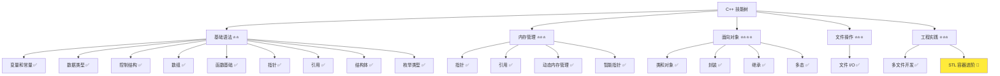
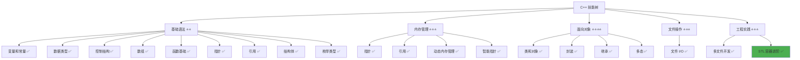

# STL 容器进阶

> **学习目标**：掌握 C++ STL 进阶容器（map、set、unordered_map）的使用，理解键值对存储、集合操作和哈希表，能够在多文件项目中应用这些容器  
> **前置知识**：C++ std::vector、类和对象、多文件开发基础  
> **预计时间**：120 分钟  
> **难度等级**：⭐⭐⭐⭐  
> **技能收获**：map、set、unordered_map、键值对、集合操作、哈希表、多文件应用  
> **文档版本**：v1.0  
> **最后更新**：2025-11-12

📊 **难度等级说明**

| 等级           | 描述                       | 练习题数量     | 颜色码 |
| -------------- | -------------------------- | -------------- | ------ |
| **⭐**         | 入门级，零基础可学         | 5 题基础概念题 | 🟢绿   |
| **⭐⭐**       | 基础级，需要基本编程概念   | 5 题基础概念题 | 🟡黄   |
| **⭐⭐⭐**     | 中级，需要相关技术基础     | 3 题代码分析题 | 🟠橙   |
| **⭐⭐⭐⭐**   | 高级，需要扎实的技术功底   | 3 题代码分析题 | 🔴红   |
| **⭐⭐⭐⭐⭐** | 专家级，需要丰富的项目经验 | 2 题设计思考题 | 🟣紫   |

## 1. 学习目标

### 1.1 学习动机

- **实际需求**：`std::vector` 适合存储有序数据，但实际开发中经常需要根据"键"快速查找"值"（如根据用户名查找用户信息），或者需要存储不重复的元素集合
- **应用场景**：用户信息管理（用户名→用户信息）、配置管理（配置项→配置值）、去重操作、快速查找
- **技能价值**：学会后能高效处理键值对数据、集合操作，提高程序性能和代码可读性
- **数据支持**：`std::map` 和 `std::unordered_map` 是现代 C++ 中使用频率第二高的容器，在需要快速查找的场景中必不可少

### 1.2 技能树位置



> **图表说明**：C++ 技能树结构图，当前文档点亮 STL 容器进阶技能点

### 1.3 前置知识检查

在开始学习之前，请确认你已经掌握：

- [ ] `std::vector` 的基本使用（声明、添加元素、遍历）
- [ ] C++ 类和对象的基础概念
- [ ] 多文件开发基础（头文件、源文件分离）
- [ ] 基本数据类型（int、std::string）

> **未掌握处理**：若未通过，请先复习 [std::vector 详解](./10-vector-stl.md)、[类和对象详解](./18-classes-objects.md) 和 [多文件开发基础](./24-multi-file-basics.md)

## 2. 核心内容

### 2.1 概念理解

**STL 容器进阶**：除了 `std::vector`（顺序容器）之外，C++ 标准库还提供了关联容器（如 `std::map`、`std::set`）和哈希容器（如 `std::unordered_map`、`std::unordered_set`），用于不同的数据组织需求。

> **类比教学**：
>
> - **vector**：像一排按顺序排列的座位，通过位置（索引）访问
> - **map**：像一本字典，通过"键"（如单词）查找"值"（如释义），键值对一一对应
> - **set**：像一个不允许重复的集合，只关心"有哪些元素"，不关心顺序
> - **unordered_map**：像一本没有目录的字典，但查找速度更快（使用哈希表）

### 2.2 为什么需要进阶容器

#### 2.2.1 vector 的局限性

**问题场景**：使用 vector 存储用户信息

```cpp
// 使用 vector 存储用户信息
std::vector<User> users;
// 问题：如何根据用户名快速找到用户？
// 需要遍历整个 vector，时间复杂度 O(n)
```

**问题**：

- 查找效率低：需要遍历整个容器
- 无法直接通过"键"访问：只能通过索引访问
- 不适合键值对场景：需要手动维护键和值的对应关系

#### 2.2.2 进阶容器的优势

**优势 1：快速查找**

- `std::map`：通过键查找值，时间复杂度 O(log n)
- `std::unordered_map`：通过键查找值，平均时间复杂度 O(1)

> **📌 补充说明：时间复杂度是什么？**
>
> **时间复杂度**：衡量算法执行时间随数据量增长的快慢程度，用大 O 表示法表示。
>
> - **O(1)**：无论数据有多少，查找时间都是固定的，就像直接翻到字典的某一页（哈希表）
> - **O(log n)**：数据量翻倍，查找时间只增加一点，就像在有序字典中二分查找（每次排除一半）
> - **O(n)**：数据量翻倍，查找时间也翻倍，就像从字典第一页开始逐页查找（需要遍历所有元素）
>
> **类比**：
>
> - **O(1)**：就像知道门牌号，直接找到对应的房子
> - **O(log n)**：就像在有序的电话簿中查找，每次排除一半
> - **O(n)**：就像从第一页开始，一页一页地查找
>
> **实际意义**：数据量越大，O(1) 和 O(log n) 的优势越明显。对于 1000 个元素，O(n) 可能需要查找 1000 次，O(log n) 只需要查找约 10 次，O(1) 只需要查找 1 次。

**优势 2：键值对存储**

- 直接存储键值对，无需手动维护对应关系
- 键唯一，自动去重

**优势 3：集合操作**

- `std::set`：自动去重，自动排序
- 支持集合运算（交集、并集等）

### 2.3 std::map（有序映射）

#### 2.3.1 map 的概念

**std::map**：C++ 标准库中的有序关联容器，存储键值对（key-value pairs），键唯一，按键自动排序。

> **类比教学**：`std::map` 就像一本字典，每个词条（键）对应一个解释（值）。字典按照字母顺序排列（自动排序），每个词条只出现一次（键唯一）。

**特点**：

- **键值对存储**：每个元素是一个键值对 `std::pair<Key, Value>`
- **键唯一**：同一个键只能出现一次
- **自动排序**：按照键的大小自动排序（默认从小到大）
- **快速查找**：通过键查找值，时间复杂度 O(log n)

#### 2.3.2 map 的基本语法

**头文件**：

```cpp
#include <map>                                  // map 头文件
```

**声明**：

```cpp
std::map<键类型, 值类型> 变量名;
```

**示例**：

```cpp
std::map<std::string, int> scores;              // 字符串键，整数值
std::map<int, std::string> idToName;            // 整数键，字符串值
std::map<std::string, std::string> config;      // 字符串键，字符串值
```

#### 2.3.3 map 的初始化

```cpp
// 方式 1：声明空 map（推荐）
std::map<std::string, int> scores;

// 方式 2：列表初始化（C++11，推荐）
std::map<std::string, int> scores = {
    {"小美", 95},
    {"小丽", 87},
    {"阿伟", 92}
};

// 方式 3：使用 insert 方法初始化
std::map<std::string, int> scores;
scores.insert({"小美", 95});
scores.insert({"小丽", 87});
```

#### 2.3.4 map 的基本操作

**1. 添加元素**

```cpp
std::map<std::string, int> scores;

// 方法 1：使用 [] 操作符（推荐，最简洁）
scores["小美"] = 95;                    // 如果键不存在，自动创建
scores["小丽"] = 87;

// 方法 2：使用 insert 方法
scores.insert({"阿伟", 92});
scores.insert(std::make_pair("小明", 88));

// 方法 3：使用 emplace 方法（C++11，推荐，更高效）
scores.emplace("小华", 90);
```

**2. 访问元素**

```cpp
// 使用 [] 操作符访问
int xiaomeiScore = scores["小美"];      // 如果键不存在，会创建并返回默认值

// 使用 at 方法访问（推荐，更安全）
int xiaoliScore = scores.at("小丽");    // 如果键不存在，会抛出异常

// 检查键是否存在
if (scores.find("小美") != scores.end()) {
    // 键存在
    int score = scores["小美"];
}
```

> **📌 补充说明：异常是什么？**
>
> **异常（Exception）**：程序运行时发生的错误情况，比如访问不存在的键、除以零等。
>
> - **抛出异常**：当程序遇到错误时，会"抛出"一个异常，表示出现了问题
> - **处理异常**：可以使用 `try-catch` 语句捕获并处理异常，避免程序崩溃
>
> **类比**：
>
> - 就像你打开一个不存在的文件，系统会"抛出"一个"文件不存在"的错误
> - 使用 `at()` 方法访问不存在的键时，C++ 会抛出 `std::out_of_range` 异常
>
> **当前阶段**：
>
> - 如果使用 `at()` 方法访问不存在的键，程序会崩溃（异常未处理）
> - 建议先使用 `find()` 方法检查键是否存在，避免异常
> - 异常处理的详细内容将在后续章节（`27-exception-handling.md`）中学习

**3. 修改元素**

```cpp
// 直接赋值修改
scores["小美"] = 98;                    // 如果键存在，修改值；如果不存在，创建新元素
```

**4. 删除元素**

```cpp
// 方法 1：使用 erase 方法（通过键）
scores.erase("小美");

// 方法 2：使用 erase 方法（通过迭代器）
auto it = scores.find("小丽");
if (it != scores.end()) {
    scores.erase(it);
}

// 方法 3：清空所有元素
scores.clear();
```

**5. 查找元素**

```cpp
// 使用 find 方法查找
auto it = scores.find("小美");
if (it != scores.end()) {
    // 找到了，it->first 是键，it->second 是值
    std::cout << "小美: " << it->second << std::endl;
} else {
    // 没找到
    std::cout << "小美 not found" << std::endl;
}

// 使用 count 方法检查键是否存在（返回 0 或 1）
if (scores.count("小美") > 0) {
    std::cout << "小美 exists" << std::endl;
}
```

**6. 遍历 map**

```cpp
// 方法 1：使用范围 for 循环（推荐，C++11）
for (const auto& pair : scores) {
    std::cout << pair.first << ": " << pair.second << std::endl;
}

// 方法 2：使用迭代器
for (auto it = scores.begin(); it != scores.end(); ++it) {
    std::cout << it->first << ": " << it->second << std::endl;
}
```

> **📌 说明**：`pair.first` 是键（key），`pair.second` 是值（value）。`std::pair` 是 C++ 标准库中的模板类，用于存储两个值。
>
> **📌 为什么推荐使用范围 for 循环？**
>
> - **代码简洁**：语法更简洁，代码量更少，易于阅读
> - **性能相同**：编译器会将范围 for 循环转换为迭代器形式，性能与迭代器方式相同
> - **不易出错**：不需要手动管理迭代器，避免越界、忘记递增等错误
> - **现代 C++ 风格**：C++11 引入的现代语法，符合最佳实践
>
> **对比**：
>
> - 范围 for 循环：`for (const auto& pair : scores)` - 简洁明了
> - 迭代器方式：`for (auto it = scores.begin(); it != scores.end(); ++it)` - 更繁琐，但功能相同

**7. 获取大小和检查是否为空**

```cpp
size_t size = scores.size();         // 获取元素个数
bool isEmpty = scores.empty();       // 检查是否为空
```

#### 2.3.5 map 的完整示例

```cpp
// 01-basic-map.cpp
#include <iostream>
#include <map>
#include <string>

int main() {
    // 创建并初始化 map
    std::map<std::string, int> scores = {
        {"小美", 95},
        {"小丽", 87},
        {"阿伟", 92}
    };

    // 添加元素
    scores["小明"] = 88;
    scores.emplace("小华", 90);

    // 访问元素
    std::cout << "小美的成绩: " << scores["小美"] << std::endl;
    std::cout << "小丽的成绩: " << scores.at("小丽") << std::endl;

    // 修改元素
    scores["小美"] = 98;
    std::cout << "小美的新成绩: " << scores["小美"] << std::endl;

    // 遍历 map（自动按键排序）
    std::cout << "\n=== 所有成绩（按姓名排序） ===" << std::endl;
    for (const auto& pair : scores) {
        std::cout << pair.first << ": " << pair.second << std::endl;
    }

    // 查找元素
    auto it = scores.find("阿伟");
    if (it != scores.end()) {
        std::cout << "\n找到阿伟: " << it->second << std::endl;
    }

    // 删除元素
    scores.erase("小丽");
    std::cout << "\n删除小丽后，人数: " << scores.size() << std::endl;

    return 0;
}
```

**预期输出**：

```
小美的成绩: 95
小丽的成绩: 87
小美的新成绩: 98

=== 所有成绩（按姓名排序） ===
小丽: 87
小华: 90
小美: 98
小明: 88
阿伟: 92

找到阿伟: 92

删除小丽后，人数: 4
```

> **📌 注意**：map 中的元素按照键自动排序。对于中文字符串，排序规则取决于系统的字符编码和排序规则（通常是按 Unicode 编码或拼音排序）。

### 2.4 std::set（有序集合）

#### 2.4.1 set 的概念

**std::set**：C++ 标准库中的有序关联容器，存储唯一元素，自动去重，自动排序。

> **类比教学**：`std::set` 就像一个不允许重复的集合，比如一个班级的学生名单。每个学生只能出现一次（自动去重），名单按照学号或姓名自动排序。

**特点**：

- **唯一元素**：每个元素只能出现一次，自动去重
- **自动排序**：按照元素的大小自动排序（默认从小到大）
- **快速查找**：查找元素，时间复杂度 O(log n)
- **无键值对**：只存储值，不存储键值对

#### 2.4.2 set 的基本语法

**头文件**：

```cpp
#include <set>        // set 头文件
```

**声明**：

```cpp
std::set<元素类型> 变量名;
```

**示例**：

```cpp
std::set<int> numbers;                // 整数集合
std::set<std::string> names;          // 字符串集合
std::set<char> characters;            // 字符集合
```

#### 2.4.3 set 的初始化

```cpp
// 方式 1：声明空 set（推荐）
std::set<int> numbers;

// 方式 2：列表初始化（C++11，推荐）
std::set<int> numbers = {3, 1, 4, 1, 5, 9, 2, 6};   // 自动去重和排序

// 方式 3：从 vector 初始化
std::vector<int> vec = {3, 1, 4, 1, 5};
std::set<int> numbers(vec.begin(), vec.end());      // 自动去重和排序
```

#### 2.4.4 set 的基本操作

**1. 添加元素**

```cpp
std::set<int> numbers;

// 方法 1：使用 insert 方法
numbers.insert(5);
numbers.insert(3);
numbers.insert(5);                  // 重复元素，不会添加

// 方法 2：使用 emplace 方法（C++11，推荐）
numbers.emplace(7);
```

> **📌 补充说明：重复元素不会报错**
>
> **重要**：向 `set` 中插入重复元素**不会报错**，这是正常行为。
>
> - **不会报错**：`insert()` 方法遇到重复元素时，会静默忽略，不会抛出异常或产生错误
> - **不会添加**：重复元素不会被添加到 `set` 中，`set` 的大小不会改变
> - **返回值**：`insert()` 方法会返回一个 `std::pair<iterator, bool>`，其中 `bool` 表示是否成功插入（`true` 表示插入成功，`false` 表示元素已存在）
>
> **示例**：
>
> ```cpp
> std::set<int> numbers;
> auto result = numbers.insert(5);  // 第一次插入，result.second = true
> auto result2 = numbers.insert(5); // 重复元素，result2.second = false，不会报错
> ```
>
> **类比**：就像往一个不允许重复的名单中添加名字，如果名字已经存在，系统会忽略这次添加，但不会报错。

**2. 查找元素**

```cpp
// 使用 find 方法查找
auto it = numbers.find(5);
if (it != numbers.end()) {
    std::cout << "Found: " << *it << std::endl;
} else {
    std::cout << "Not found" << std::endl;
}

// 使用 count 方法检查元素是否存在（返回 0 或 1）
if (numbers.count(5) > 0) {
    std::cout << "5 exists" << std::endl;
}
```

> **📌 对比：find() vs count()**
>
> **效率对比**：
>
> - **时间复杂度相同**：两者都是 O(log n)，效率相同
> - **实际性能**：`find()` 略快，因为只需要找到元素位置；`count()` 需要统计数量（虽然对于 set 只有 0 或 1）
>
> **功能对比**：
>
> - **`find()`**：返回迭代器，可以访问元素值，也可以用于后续操作（如删除、修改）
> - **`count()`**：只返回 0 或 1，只能判断是否存在，无法访问元素值
>
> **推荐使用**：
>
> - **推荐使用 `find()`**：更通用，功能更强大
> - **使用 `count()` 的场景**：只需要判断元素是否存在，且不需要使用元素值
>
> **应用场景**：
>
> - **使用 `find()`**：
>   - 需要访问找到的元素值
>   - 需要基于查找结果进行后续操作（如删除、修改）
>   - 需要获取元素的迭代器
> - **使用 `count()`**：
>   - 只需要判断元素是否存在（布尔判断）
>   - 代码更简洁（一行代码即可）
>
> **示例对比**：
>
> ```cpp
> // 场景 1：只需要判断是否存在
> if (numbers.count(5) > 0) {       // 简洁
>     std::cout << "5 exists" << std::endl;
> }
>
> // 场景 2：需要访问元素值
> auto it = numbers.find(5);        // 推荐：可以访问 *it
> if (it != numbers.end()) {
>     std::cout << "Found: " << *it << std::endl;
>     numbers.erase(it);            // 还可以直接删除
> }
> ```

**3. 删除元素**

```cpp
// 方法 1：使用 erase 方法（通过值）
numbers.erase(5);

// 方法 2：使用 erase 方法（通过迭代器）
auto it = numbers.find(3);
if (it != numbers.end()) {
    numbers.erase(it);
}

// 方法 3：清空所有元素
numbers.clear();
```

**4. 遍历 set**

```cpp
// 方法 1：使用范围 for 循环（推荐，C++11）
for (const auto& value : numbers) {
    std::cout << value << " ";
}

// 方法 2：使用迭代器
for (auto it = numbers.begin(); it != numbers.end(); ++it) {
    std::cout << *it << " ";
}
```

**5. 获取大小和检查是否为空**

```cpp
size_t size = numbers.size();         // 获取元素个数
bool isEmpty = numbers.empty();       // 检查是否为空
```

#### 2.4.5 set 的完整示例

```cpp
// 02-basic-set.cpp
#include <iostream>
#include <set>
#include <vector>

int main() {
    // 创建并初始化 set（自动去重和排序）
    std::set<int> numbers = {3, 1, 4, 1, 5, 9, 2, 6, 5, 3};

    std::cout << "=== Original numbers (with duplicates) ===" << std::endl;
    std::vector<int> original = {3, 1, 4, 1, 5, 9, 2, 6, 5, 3};
    for (int num : original) {
        std::cout << num << " ";
    }
    std::cout << std::endl;

    std::cout << "\n=== Set (unique and sorted) ===" << std::endl;
    for (const auto& num : numbers) {
        std::cout << num << " ";
    }
    std::cout << std::endl;

    // 添加元素
    numbers.insert(7);
    numbers.insert(1);              // 重复元素，不会添加

    std::cout << "\n=== After inserting 7 and 1 ===" << std::endl;
    for (const auto& num : numbers) {
        std::cout << num << " ";
    }
    std::cout << std::endl;

    // 查找元素
    if (numbers.find(5) != numbers.end()) {
        std::cout << "\n5 is in the set" << std::endl;
    }

    // 删除元素
    numbers.erase(3);
    std::cout << "\n=== After removing 3 ===" << std::endl;
    for (const auto& num : numbers) {
        std::cout << num << " ";
    }
    std::cout << std::endl;

    return 0;
}
```

**预期输出**：

```
=== Original numbers (with duplicates) ===
3 1 4 1 5 9 2 6 5 3

=== Set (unique and sorted) ===
1 2 3 4 5 6 9

=== After inserting 7 and 1 ===
1 2 3 4 5 6 7 9

5 is in the set

=== After removing 3 ===
1 2 4 5 6 7 9
```

> **📌 注意**：set 自动去重（1、3、5 只出现一次）并自动排序（从小到大）。

### 2.5 std::unordered_map（无序映射/哈希表）

#### 2.5.1 unordered_map 的概念

**std::unordered_map**：C++ 标准库中的无序关联容器，使用哈希表实现，存储键值对，键唯一，不排序。

> **类比教学**：`std::unordered_map` 就像一本没有目录的字典，但查找速度更快。它使用哈希表（hash table）来快速定位元素，就像通过"哈希函数"直接找到元素的位置，而不需要像 map 那样按顺序查找。

**特点**：

- **键值对存储**：每个元素是一个键值对
- **键唯一**：同一个键只能出现一次
- **不排序**：元素不按顺序存储，顺序不确定
- **快速查找**：通过键查找值，平均时间复杂度 O(1)（比 map 更快）

> **📌 选择建议**：
>
> - **推荐使用 `unordered_map`**：大多数情况下，`unordered_map` 是更好的选择，因为查找速度更快（O(1) 平均 vs O(log n)）
> - **需要有序时使用 `map`**：只有在需要有序遍历或范围查询时，才使用 `map`
> - **详细对比**：具体区别和应用场景见 `2.6.1 map vs unordered_map`

#### 2.5.2 unordered_map 的基本语法

**头文件**：

```cpp
#include <unordered_map>        // unordered_map 头文件
```

**声明**：

```cpp
std::unordered_map<键类型, 值类型> 变量名;
```

**示例**：

```cpp
std::unordered_map<std::string, int> scores;           // 字符串键，整数值
std::unordered_map<int, std::string> idToName;         // 整数键，字符串值
```

#### 2.5.3 unordered_map 的初始化

```cpp
// 方式 1：声明空 unordered_map（推荐）
std::unordered_map<std::string, int> scores;

// 方式 2：列表初始化（C++11，推荐）
std::unordered_map<std::string, int> scores = {
    {"小美", 95},
    {"小丽", 87},
    {"阿伟", 92}
};
```

#### 2.5.4 unordered_map 的基本操作

**基本操作与 map 相同**：

```cpp
std::unordered_map<std::string, int> scores;

// 添加元素
scores["小美"] = 95;
scores.emplace("小丽", 87);

// 访问元素
int xiaomeiScore = scores["小美"];
int xiaoliScore = scores.at("小丽");

// 查找元素
auto it = scores.find("小美");
if (it != scores.end()) {
    std::cout << it->first << ": " << it->second << std::endl;
}

// 删除元素
scores.erase("小美");

// 遍历（顺序不确定）
for (const auto& pair : scores) {
    std::cout << pair.first << ": " << pair.second << std::endl;
}
```

#### 2.5.5 unordered_map 的完整示例

```cpp
// 03-basic-unordered-map.cpp
#include <iostream>
#include <unordered_map>
#include <string>

int main() {
    // 创建并初始化 unordered_map
    std::unordered_map<std::string, int> scores = {
        {"小美", 95},
        {"小丽", 87},
        {"阿伟", 92}
    };

    // 添加元素
    scores["小明"] = 88;
    scores.emplace("小华", 90);

    // 访问元素
    std::cout << "小美的成绩: " << scores["小美"] << std::endl;

    // 遍历（顺序不确定，可能每次运行顺序不同）
    std::cout << "\n=== 所有成绩（无序） ===" << std::endl;
    for (const auto& pair : scores) {
        std::cout << pair.first << ": " << pair.second << std::endl;
    }

    // 查找元素
    if (scores.find("阿伟") != scores.end()) {
        std::cout << "\n找到阿伟" << std::endl;
    }

    return 0;
}
```

**预期输出**（顺序可能不同）：

```
小美的成绩: 95

=== 所有成绩（无序） ===
小华: 90
小明: 88
阿伟: 92
小丽: 87
小美: 95

找到阿伟
```

> **📌 注意**：unordered_map 中的元素顺序不确定，可能每次运行顺序都不同。如果需要有序，使用 `std::map`。

### 2.6 容器对比

#### 2.6.1 map vs unordered_map

| 特性           | std::map               | std::unordered_map     |
| -------------- | ---------------------- | ---------------------- |
| **排序**       | 按键自动排序           | 不排序                 |
| **查找速度**   | O(log n)               | O(1) 平均              |
| **内存开销**   | 较小                   | 较大（哈希表）         |
| **适用场景**   | 需要有序、少量数据     | 需要快速查找、大量数据 |
| **键类型要求** | 必须可比较（< 操作符） | 必须可哈希             |

**选择建议**：

- **需要有序**：使用 `std::map`
- **需要快速查找**：使用 `std::unordered_map`
- **数据量小**：两者性能差异不大，优先使用 `std::map`（更简单）
- **数据量大**：优先使用 `std::unordered_map`（更快）

**应用场景**：

**使用 `std::map` 的场景**：

- **成绩排名系统**：需要按分数从高到低排序显示
- **时间序列数据**：需要按时间顺序处理日志、事件等
- **有序配置管理**：需要按配置名排序显示所有配置项
- **范围查询**：需要查找某个范围内的键（如查找分数在 80-90 之间的学生）
- **有序遍历**：需要按顺序遍历所有元素（如按字母顺序显示用户列表）

**使用 `std::unordered_map` 的场景**（推荐，大多数情况）：

- **用户信息管理**：根据用户名快速查找用户信息（不需要排序）
- **缓存系统**：快速查找缓存数据，性能优先
- **词频统计**：统计单词出现次数，只需要快速查找和更新
- **配置查找**：根据配置名快速查找配置值（不需要排序）
- **数据索引**：为大量数据建立索引，快速定位（如数据库索引）

#### 2.6.2 set vs unordered_set

**std::unordered_set**：与 `std::set` 类似，但使用哈希表实现，不排序，查找速度更快（平均 O(1)）。

**对比**：

| 特性         | std::set       | std::unordered_set |
| ------------ | -------------- | ------------------ |
| **排序**     | 自动排序       | 不排序             |
| **查找速度** | O(log n)       | O(1) 平均          |
| **适用场景** | 需要有序、去重 | 需要快速查找、去重 |

**应用场景**：

**使用 `std::set` 的场景**：

- **有序去重**：需要去重且保持元素有序（如按学号排序的学生名单）
- **有序遍历**：需要按顺序遍历所有元素（如按字母顺序显示标签列表）
- **范围查询**：需要查找某个范围内的元素（如查找分数在 80-90 之间的学生）
- **有序输出**：需要按顺序输出或显示数据（如按时间顺序显示访问记录）

**使用 `std::unordered_set` 的场景**（推荐，大多数情况）：

- **快速去重**：只需要去重，不需要排序（如统计访问过的 IP 地址）
- **快速查找**：需要快速判断元素是否存在（如检查用户名是否已注册）
- **在线用户列表**：维护在线用户集合，只需要快速查找和去重
- **黑名单/白名单**：快速判断某个元素是否在列表中（如 URL 黑名单）
- **数据去重**：对大量数据进行去重，性能优先（如日志去重）

#### 2.6.3 vector vs map vs set

| 特性         | std::vector        | std::map             | std::set           |
| ------------ | ------------------ | -------------------- | ------------------ |
| **存储方式** | 顺序存储           | 键值对               | 唯一值             |
| **访问方式** | 索引（位置）       | 键                   | 值                 |
| **排序**     | 保持插入顺序       | 按键自动排序         | 按值自动排序       |
| **去重**     | 不去重             | 键唯一               | 值唯一             |
| **查找速度** | O(n)               | O(log n)             | O(log n)           |
| **适用场景** | 需要顺序、允许重复 | 需要键值对、快速查找 | 需要去重、快速查找 |

**应用场景**：

**使用 `std::vector` 的场景**：

- **顺序存储**：需要保持元素的插入顺序（如消息列表、历史记录）
- **允许重复**：同一个元素可以出现多次（如购物车中的商品）
- **按索引访问**：需要通过位置（索引）访问元素（如数组操作）
- **动态数组**：需要动态大小的数组（如学生成绩列表）
- **频繁尾部操作**：需要频繁在尾部添加或删除元素（如日志记录）

**使用 `std::map` / `std::unordered_map` 的场景**：

- **键值对映射**：需要建立键和值的对应关系（如用户名到用户信息的映射）
- **快速查找**：需要通过键快速查找值（如根据 ID 查找用户）
- **键唯一**：每个键只能出现一次（如用户 ID 到用户名的映射）
- **关联数据**：需要存储关联数据（如配置名到配置值的映射）

**使用 `std::set` / `std::unordered_set` 的场景**：

- **去重**：需要自动去除重复元素（如访问过的 URL 列表）
- **快速判断存在性**：需要快速判断元素是否存在（如检查用户名是否已存在）
- **唯一值集合**：只需要存储唯一的值，不需要键值对（如标签集合）
- **集合运算**：需要进行集合运算（如交集、并集、差集）

### 2.7 多文件应用示例

#### 2.7.1 项目场景：用户管理系统

在 QtLanChat 项目中，我们需要：

- 根据用户名快速查找用户信息（使用 `std::map` 或 `std::unordered_map`）
- 维护在线用户列表（使用 `std::set` 去重）

#### 2.7.2 多文件项目结构

```
user_manager/
├── user.h              // 用户类头文件
├── user.cpp            // 用户类源文件
├── user_manager.h      // 用户管理器头文件
├── user_manager.cpp    // 用户管理器源文件
└── main.cpp            // 主程序文件
```

**user.h**：

```cpp
// user.h
#pragma once

#include <string>

class User {
private:
    std::string name;
    int age;
    bool isOnline;

public:
    User(const std::string& n, int a);
    void setOnline(bool status);
    std::string getName() const;
    int getAge() const;
    bool getIsOnline() const;
    void printInfo() const;
};
```

**user.cpp**：

```cpp
// user.cpp
#include "user.h"
#include <iostream>

User::User(const std::string& n, int a)
    : name(n), age(a), isOnline(false) {}

void User::setOnline(bool status) {
    isOnline = status;
}

std::string User::getName() const {
    return name;
}

int User::getAge() const {
    return age;
}

bool User::getIsOnline() const {
    return isOnline;
}

void User::printInfo() const {
    std::cout << "Name: " << name
              << ", Age: " << age
              << ", Status: " << (isOnline ? "Online" : "Offline")
              << std::endl;
}
```

**user_manager.h**：

```cpp
// user_manager.h
#pragma once

#include "user.h"
#include <map>
#include <set>
#include <string>

class UserManager {
private:
    // 使用 map 存储用户名到用户对象的映射
    std::map<std::string, User> users;
    // 使用 set 存储在线用户名（自动去重）
    std::set<std::string> onlineUsers;

public:
    void addUser(const std::string& name, int age);
    User* findUser(const std::string& name);
    const User* findUser(const std::string& name) const;
    void setUserOnline(const std::string& name, bool status);
    void printAllUsers() const;
    void printOnlineUsers() const;
    size_t getTotalUsers() const;
    size_t getOnlineUsersCount() const;
};
```

**user_manager.cpp**：

```cpp
// user_manager.cpp
#include "user_manager.h"
#include <iostream>

void UserManager::addUser(const std::string& name, int age) {
    // 使用 emplace 方法添加用户（如果已存在，不会覆盖）
    users.emplace(name, User(name, age));
}

User* UserManager::findUser(const std::string& name) {
    auto it = users.find(name);
    if (it != users.end()) {
        return &(it->second);  // 返回用户对象的引用
    }
    return nullptr;  // 未找到
}

const User* UserManager::findUser(const std::string& name) const {
    auto it = users.find(name);
    if (it != users.end()) {
        return &(it->second);  // 返回用户对象的引用
    }
    return nullptr;  // 未找到
}

void UserManager::setUserOnline(const std::string& name, bool status) {
    User* user = findUser(name);
    if (user != nullptr) {
        user->setOnline(status);
        if (status) {
            onlineUsers.insert(name);  // 添加到在线用户集合
        } else {
            onlineUsers.erase(name);   // 从在线用户集合中移除
        }
    }
}

void UserManager::printAllUsers() const {
    std::cout << "=== All Users ===" << std::endl;
    for (const auto& pair : users) {
        pair.second.printInfo();
    }
}

void UserManager::printOnlineUsers() const {
    std::cout << "\n=== Online Users ===" << std::endl;
    for (const auto& name : onlineUsers) {
        const User* user = findUser(name);
        if (user != nullptr) {
            user->printInfo();
        }
    }
}

size_t UserManager::getTotalUsers() const {
    return users.size();
}

size_t UserManager::getOnlineUsersCount() const {
    return onlineUsers.size();
}
```

**main.cpp**：

```cpp
// main.cpp
#include <iostream>
#include "user_manager.h"

int main() {
    UserManager manager;

    // 添加用户
    manager.addUser("小美", 25);
    manager.addUser("小丽", 30);
    manager.addUser("阿伟", 28);
    manager.addUser("小明", 22);

    // 设置用户在线状态
    manager.setUserOnline("小美", true);
    manager.setUserOnline("小丽", true);
    manager.setUserOnline("阿伟", false);

    // 显示所有用户
    manager.printAllUsers();

    // 显示在线用户
    manager.printOnlineUsers();

    // 查找用户
    User* user = manager.findUser("小美");
    if (user != nullptr) {
        std::cout << "\n找到用户: ";
        user->printInfo();
    }

    // 统计信息
    std::cout << "\n总用户数: " << manager.getTotalUsers() << std::endl;
    std::cout << "在线用户数: " << manager.getOnlineUsersCount() << std::endl;

    return 0;
}
```

**预期输出**：

```
=== All Users ===
Name: 小丽, Age: 30, Status: Online
Name: 小明, Age: 22, Status: Offline
Name: 小美, Age: 25, Status: Online
Name: 阿伟, Age: 28, Status: Offline

=== Online Users ===
Name: 小丽, Age: 30, Status: Online
Name: 小美, Age: 25, Status: Online

找到用户: Name: 小美, Age: 25, Status: Online

总用户数: 4
在线用户数: 2
```

> **📌 注意**：由于 map 按键自动排序，用户列表会按照姓名排序显示。中文字符串的排序规则取决于系统的字符编码。
>
> **📌 说明**：这个示例展示了如何在多文件项目中使用 `std::map` 和 `std::set`。`std::map` 用于快速根据用户名查找用户，`std::set` 用于维护在线用户列表（自动去重）。

### 2.8 关键特性与设计原理

#### 2.8.1 关键特性

1. **键值对存储**：map 和 unordered_map 存储键值对，键唯一，值可以重复
2. **自动去重**：set 和 map 自动去重，同一个键/值只能出现一次
3. **自动排序**：map 和 set 自动排序（unordered 版本不排序）
4. **快速查找**：通过键查找值，时间复杂度 O(log n) 或 O(1)
5. **类型安全**：模板类型检查，确保类型安全

#### 2.8.2 设计原理

- **为什么这样设计**：不同的数据结构适合不同的场景，map 适合键值对查找，set 适合去重和集合操作
- **解决了什么问题**：快速查找、自动去重、键值对管理
- **有什么优势**：高效、类型安全、易于使用

### 2.9 常见陷阱和注意事项

#### 2.9.1 常见错误

**错误 1：使用 [] 操作符访问不存在的键**

```cpp
std::map<std::string, int> scores;
int value = scores["小美"];             // 如果键不存在，会创建并返回默认值（0）
// 问题：可能意外创建了不想要的元素
```

**正确做法**：

```cpp
// 方法 1：使用 find 方法检查
auto it = scores.find("小美");
if (it != scores.end()) {
    int value = it->second;
}

// 方法 2：使用 at 方法（会抛出异常）
try {
    int value = scores.at("小美");
} catch (const std::out_of_range& e) {
    // 键不存在
}
```

**错误 2：误认为 map 的 [] 操作符会返回 nullptr**

```cpp
std::map<std::string, int> scores;
if (scores["小美"] == 0) {              // 错误：无法区分"键不存在"和"值为 0"
    // ...
}
```

**正确做法**：

```cpp
// 使用 find 方法检查键是否存在
if (scores.find("小美") != scores.end() && scores["小美"] == 0) {
    // 键存在且值为 0
}
```

**错误 3：在循环中修改 map 的键**

```cpp
std::map<std::string, int> scores = {{"小美", 95}};
for (auto& pair : scores) {
    pair.first = "小丽";                // 错误：不能修改键
}
```

**正确做法**：

```cpp
// 如果需要修改键，先删除旧元素，再添加新元素
std::map<std::string, int> scores = {{"小美", 95}};
int value = scores["小美"];
scores.erase("小美");
scores["小丽"] = value;
```

**错误 4：unordered_map 的键类型不支持哈希**

```cpp
// 错误：自定义类型需要定义哈希函数
struct Point {
    int x, y;
};
std::unordered_map<Point, int> points;  // 编译错误
```

**正确做法**：

```cpp
// 使用 map（需要定义比较操作符）或为自定义类型定义哈希函数
struct Point {
    int x, y;
    bool operator<(const Point& other) const {
        return x < other.x || (x == other.x && y < other.y);
    }
};
std::map<Point, int> points;            // 可以工作
```

> **📌 补充说明：自定义比较运算符是什么？**
>
> **比较运算符（operator<）**：用于定义两个对象之间的大小关系，`std::map` 需要它来对键进行排序。
>
> **为什么需要？**
>
> - `std::map` 需要按键排序，对于基本类型（如 `int`、`std::string`），C++ 已经定义了比较规则
> - 对于自定义类型（如 `Point`），C++ 不知道如何比较，需要我们自己定义
>
> **语法说明**：
>
> - `bool operator<(const Point& other) const`：定义 `<` 运算符
> - `const`：表示这个函数不会修改对象本身
> - 返回值：`true` 表示当前对象小于 `other`，`false` 表示大于或等于
>
> **类比**：
>
> - 就像给两个学生排名，需要知道如何比较他们的成绩
> - 对于 `Point`，我们定义：先比较 x 坐标，x 相同再比较 y 坐标
>
> **注意**：这是高级主题，当前阶段只需要知道基本类型可以直接使用，自定义类型需要额外定义。详细内容将在后续章节学习。

#### 2.9.2 最佳实践

1. **优先使用 find 方法检查键是否存在**：避免使用 [] 操作符意外创建元素
2. **需要有序时使用 map，需要快速查找时使用 unordered_map**：根据需求选择合适的容器
3. **使用 emplace 方法添加元素**：比 insert 更高效
4. **使用 const 引用遍历**：`for (const auto& pair : map)` 避免不必要的复制
5. **理解容器的特性**：map 有序但查找较慢，unordered_map 无序但查找更快

## 3. 实践应用

### 3.1 项目场景

在 QtLanChat 项目中，STL 进阶容器用于：

- **用户信息管理**：使用 `std::map` 或 `std::unordered_map` 根据用户名快速查找用户信息
- **在线用户列表**：使用 `std::set` 维护在线用户名列表（自动去重）
- **配置管理**：使用 `std::map` 存储配置项和配置值
- **消息去重**：使用 `std::set` 或 `std::unordered_set` 对消息进行去重

### 3.2 实际代码

（已在 2.7 节提供完整的多文件应用示例）

### 3.3 设计思路

- **为什么选择这种设计**：map 提供快速查找，set 提供自动去重，适合用户管理和在线状态管理
- **解决了什么问题**：快速查找用户、维护在线用户列表、自动去重
- **有什么优势**：高效、代码简洁、易于维护

## 4. 练习与测试

### 4.1 练习题

#### 练习 1：成绩管理系统

**题目**：创建一个成绩管理系统，使用 `std::map` 存储学生姓名和成绩。

**要求**：

- 添加学生成绩
- 根据姓名查找成绩
- 显示所有学生成绩（按姓名排序）
- 计算平均成绩

<details>
<summary>▶ 参考答案</summary>

```cpp
// 04-exercise-grade-manager.cpp
#include <iostream>
#include <map>
#include <string>

class GradeManager {
private:
    std::map<std::string, int> grades;

public:
    void addGrade(const std::string& name, int score) {
        grades[name] = score;
    }

    int getGrade(const std::string& name) const {
        auto it = grades.find(name);
        if (it != grades.end()) {
            return it->second;
        }
        return -1;  // 未找到
    }

    void printAllGrades() const {
        std::cout << "=== All Grades ===" << std::endl;
        for (const auto& pair : grades) {
            std::cout << pair.first << ": " << pair.second << std::endl;
        }
    }

    double getAverage() const {
        if (grades.empty()) {
            return 0.0;
        }
        int sum = 0;
        for (const auto& pair : grades) {
            sum += pair.second;
        }
        return static_cast<double>(sum) / grades.size();
    }
};

int main() {
    GradeManager manager;

    manager.addGrade("小美", 95);
    manager.addGrade("小丽", 87);
    manager.addGrade("阿伟", 92);

    manager.printAllGrades();

    std::cout << "\n小美的成绩: " << manager.getGrade("小美") << std::endl;
    std::cout << "Average grade: " << manager.getAverage() << std::endl;

    return 0;
}
```

</details>

#### 练习 2：去重操作

**题目**：使用 `std::set` 对一个整数数组进行去重和排序。

**要求**：

- 从 vector 中读取数据
- 使用 set 去重和排序
- 显示去重后的结果

<details>
<summary>▶ 参考答案</summary>

```cpp
// 05-exercise-deduplicate.cpp
#include <iostream>
#include <vector>
#include <set>

int main() {
    std::vector<int> numbers = {3, 1, 4, 1, 5, 9, 2, 6, 5, 3, 5};

    std::cout << "Original numbers: ";
    for (int num : numbers) {
        std::cout << num << " ";
    }
    std::cout << std::endl;

    // 使用 set 去重和排序
    std::set<int> uniqueNumbers(numbers.begin(), numbers.end());

    std::cout << "Unique and sorted: ";
    for (int num : uniqueNumbers) {
        std::cout << num << " ";
    }
    std::cout << std::endl;

    return 0;
}
```

</details>

#### 练习 3：单词统计

**题目**：使用 `std::map` 统计一段文本中每个单词出现的次数。

**要求**：

- 读取文本（简化版，假设单词用空格分隔）
- 统计每个单词的出现次数
- 显示统计结果

<details>
<summary>▶ 参考答案</summary>

```cpp
// 06-exercise-word-count.cpp
#include <iostream>
#include <map>
#include <string>
#include <sstream>

int main() {
    std::string text = "hello world hello cpp world cpp";
    std::map<std::string, int> wordCount;

    // 使用 stringstream 分割单词
    std::istringstream iss(text);
    std::string word;
    while (iss >> word) {
        wordCount[word]++;  // 如果键不存在，自动创建并初始化为 0，然后自增
    }

    // 显示统计结果
    std::cout << "=== Word Count ===" << std::endl;
    for (const auto& pair : wordCount) {
        std::cout << pair.first << ": " << pair.second << std::endl;
    }

    return 0;
}
```

</details>

### 4.2 测试题

1. **关于 std::map，下列说法正确的是：**
   A. map 中的元素按照值自动排序

   B. map 中的元素按照键自动排序

   C. map 中的元素不排序

   D. map 中的元素按照插入顺序排序

   **答案**：B

   **解析**：
   - **正确答案 B**：map 中的元素按照键自动排序
   - **错误答案 A**：map 按照键排序，不是值
   - **错误答案 C**：map 是有序的，unordered_map 才不排序
   - **错误答案 D**：map 不保持插入顺序，而是按键排序

2. **std::set 的主要特点是：**
   A. 允许重复元素

   B. 自动去重和排序

   C. 只存储键值对

   D. 不排序

   **答案**：B

   **解析**：
   - **正确答案 B**：set 自动去重和排序
   - **错误答案 A**：set 不允许重复元素
   - **错误答案 C**：set 只存储值，不存储键值对
   - **错误答案 D**：set 自动排序，unordered_set 才不排序

3. **std::map 和 std::unordered_map 的主要区别是：**
   A. map 有序，unordered_map 无序

   B. map 无序，unordered_map 有序

   C. 两者都有序

   D. 两者都无序

   **答案**：A

   **解析**：
   - **正确答案 A**：map 按键自动排序，unordered_map 不排序
   - **错误答案 B/C/D**：与实际情况相反

### 4.3 常见问题 FAQ

- Q1：什么时候使用 map，什么时候使用 unordered_map？
  - **A：**如果需要有序（如按字母顺序显示），使用 `std::map`。如果只需要快速查找，不需要有序，使用 `std::unordered_map`（更快）。数据量小时两者性能差异不大，数据量大时 unordered_map 明显更快。

- Q2：map 的 [] 操作符和 at 方法有什么区别？
  - **A：**`[]` 操作符：如果键不存在，会创建新元素并返回默认值。`at` 方法：如果键不存在，会抛出异常。推荐使用 `find` 方法检查键是否存在，更安全。

- Q3：set 和 vector 有什么区别？
  - **A：**vector 允许重复元素，保持插入顺序，通过索引访问。set 不允许重复元素，自动排序，通过值查找。如果需要去重和排序，使用 set；如果需要保持插入顺序和允许重复，使用 vector。

- Q4：如何遍历 map 中的键值对？
  - **A：**使用范围 for 循环：`for (const auto& pair : map)`，`pair.first` 是键，`pair.second` 是值。或者使用迭代器：`for (auto it = map.begin(); it != map.end(); ++it)`，`it->first` 是键，`it->second` 是值。

- Q5：unordered_map 的键类型有什么要求？
  - **A：**键类型必须支持哈希函数。基本类型（int、string 等）都支持。自定义类型需要定义哈希函数，或者使用 map（需要定义比较操作符）。

## 5. 资源与扩展

- **官方文档**：[std::map](https://en.cppreference.com/w/cpp/container/map)、[std::set](https://en.cppreference.com/w/cpp/container/set)、[std::unordered_map](https://en.cppreference.com/w/cpp/container/unordered_map)
- **推荐书籍**：《C++ Primer》- 第 11 章关联容器、《Effective STL》- 条款 23-25
- **在线资源**：[learncpp.com](https://www.learncpp.com/) - STL 容器教程
- **视频资源**：C++ STL 容器进阶教程

## 6. 课后作业及参考答案

### 6.1 学习检查清单

- [ ] 能够解释 map、set、unordered_map 的区别和特点
- [ ] 能够使用 map 存储和查找键值对
- [ ] 能够使用 set 进行去重和排序
- [ ] 能够选择合适的容器解决实际问题
- [ ] 能够在多文件项目中使用这些容器

### 6.2 综合练习

**作业题目**：创建一个图书管理系统，使用 `std::map` 存储图书信息（ISBN → 图书信息），使用 `std::set` 存储已借出的 ISBN。

**要求**：

1. **Book 类**（`book.h` 和 `book.cpp`）：
   - 成员变量：ISBN、书名、作者、价格
   - 成员函数：构造函数、打印信息、获取 ISBN

2. **Library 类**（`library.h` 和 `library.cpp`）：
   - 使用 `std::map<std::string, Book>` 存储图书（ISBN → Book）
   - 使用 `std::set<std::string>` 存储已借出的 ISBN
   - 方法：添加图书、查找图书、借出图书、归还图书、显示所有图书、显示已借出图书

3. **主程序**（`main.cpp`）：
   - 创建图书馆对象
   - 添加几本图书
   - 借出和归还图书
   - 显示所有图书和已借出图书

**时间估算**：90 分钟

**参考答案**：

**book.h**：

```cpp
// book.h
#pragma once

#include <string>

class Book {
private:
    std::string isbn;
    std::string title;
    std::string author;
    double price;

public:
    Book(const std::string& i, const std::string& t, const std::string& a, double p);
    std::string getIsbn() const;
    void printInfo() const;
};
```

**book.cpp**：

```cpp
// book.cpp
#include "book.h"
#include <iostream>

Book::Book(const std::string& i, const std::string& t, const std::string& a, double p)
    : isbn(i), title(t), author(a), price(p) {}

std::string Book::getIsbn() const {
    return isbn;
}

void Book::printInfo() const {
    std::cout << "ISBN: " << isbn
              << ", Title: " << title
              << ", Author: " << author
              << ", Price: " << price << std::endl;
}
```

**library.h**：

```cpp
// library.h
#pragma once

#include "book.h"
#include <map>
#include <set>
#include <string>

class Library {
private:
    std::map<std::string, Book> books;           // ISBN -> Book
    std::set<std::string> borrowedBooks;         // 已借出的 ISBN

public:
    void addBook(const Book& book);
    Book* findBook(const std::string& isbn);
    const Book* findBook(const std::string& isbn) const;
    bool borrowBook(const std::string& isbn);
    bool returnBook(const std::string& isbn);
    void printAllBooks() const;
    void printBorrowedBooks() const;
};
```

**library.cpp**：

```cpp
// library.cpp
#include "library.h"
#include <iostream>

void Library::addBook(const Book& book) {
    books.emplace(book.getIsbn(), book);
}

Book* Library::findBook(const std::string& isbn) {
    auto it = books.find(isbn);
    if (it != books.end()) {
        return &(it->second);
    }
    return nullptr;
}

const Book* Library::findBook(const std::string& isbn) const {
    auto it = books.find(isbn);
    if (it != books.end()) {
        return &(it->second);
    }
    return nullptr;
}

bool Library::borrowBook(const std::string& isbn) {
    Book* book = findBook(isbn);
    if (book != nullptr && borrowedBooks.find(isbn) == borrowedBooks.end()) {
        borrowedBooks.insert(isbn);
        return true;
    }
    return false;
}

bool Library::returnBook(const std::string& isbn) {
    if (borrowedBooks.find(isbn) != borrowedBooks.end()) {
        borrowedBooks.erase(isbn);
        return true;
    }
    return false;
}

void Library::printAllBooks() const {
    std::cout << "=== All Books ===" << std::endl;
    for (const auto& pair : books) {
        pair.second.printInfo();
    }
}

void Library::printBorrowedBooks() const {
    std::cout << "\n=== Borrowed Books ===" << std::endl;
    for (const auto& isbn : borrowedBooks) {
        const Book* book = findBook(isbn);
        if (book != nullptr) {
            book->printInfo();
        }
    }
}
```

**main.cpp**：

```cpp
// main.cpp
#include <iostream>
#include "library.h"

int main() {
    Library library;

    // 添加图书
    library.addBook(Book("978-0-123456-78-9", "C++ Primer", "Stanley Lippman", 59.99));
    library.addBook(Book("978-0-987654-32-1", "Effective C++", "Scott Meyers", 49.99));
    library.addBook(Book("978-0-111111-11-1", "The C++ Programming Language", "Bjarne Stroustrup", 69.99));

    // 显示所有图书
    library.printAllBooks();

    // 借出图书
    library.borrowBook("978-0-123456-78-9");
    library.borrowBook("978-0-987654-32-1");

    // 显示已借出图书
    library.printBorrowedBooks();

    // 归还图书
    library.returnBook("978-0-123456-78-9");

    // 再次显示已借出图书
    std::cout << "\n=== After returning a book ===" << std::endl;
    library.printBorrowedBooks();

    return 0;
}
```

**运行结果**：

```
=== All Books ===
ISBN: 978-0-111111-11-1, Title: The C++ Programming Language, Author: Bjarne Stroustrup, Price: 69.99
ISBN: 978-0-123456-78-9, Title: C++ Primer, Author: Stanley Lippman, Price: 59.99
ISBN: 978-0-987654-32-1, Title: Effective C++, Author: Scott Meyers, Price: 49.99

=== Borrowed Books ===
ISBN: 978-0-123456-78-9, Title: C++ Primer, Author: Stanley Lippman, Price: 59.99
ISBN: 978-0-987654-32-1, Title: Effective C++, Author: Scott Meyers, Price: 49.99

=== After returning a book ===
=== Borrowed Books ===
ISBN: 978-0-987654-32-1, Title: Effective C++, Author: Scott Meyers, Price: 49.99
```

**评分标准**：功能实现（40%）、代码质量（30%）、多文件组织（30%）

## 7. 下一步学习

**下一篇**：[Lambda 表达式](./26-lambda-expressions.md)

**学习路径**：

1. ✅ STL 容器进阶 - 已完成
2. 🔄 Lambda 表达式 - 下一步
3. ⏳ 异常处理 - 待学习
4. ⏳ 多文件开发进阶 - 待学习

**技能树更新**：



**学习成果**：

- **独立编写**：能够使用 map、set、unordered_map 解决实际问题
- **解释原理**：能够解释不同容器的特点和适用场景
- **解决实际问题**：能够在多文件项目中使用这些容器
- **应用到项目**：能够在实际项目中选择合适的容器
- **掌握度自评**：85%

> **指导建议**：<50% 建议复习 vector 和容器基础概念，50-80% 继续学习，>80% 可以进入下一阶段学习（Lambda 表达式）

---

**文档质量检查**：

- [x] 学习目标明确且可验证
- [x] 代码示例可运行
- [x] 练习题有答案
- [x] 技能收获明确
- [x] 抽象概念配有生活化比喻
- [x] 比喻体系一致，避免概念混乱
- [x] 文档长度符合难度等级要求
- [x] 多文件应用示例完整
