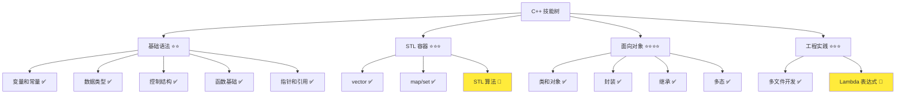
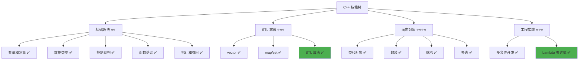

# Lambda 表达式

> **学习目标**：掌握 C++ Lambda 表达式的语法和使用，理解捕获列表、参数传递，能够在 STL 算法和多文件项目中应用 Lambda 表达式  
> **前置知识**：C++ 函数基础、STL 容器（vector、map）、多文件开发基础  
> **预计时间**：60 分钟  
> **难度等级**：⭐⭐⭐  
> **技能收获**：Lambda 表达式、捕获列表、STL 算法、函数式编程、多文件应用  
> **文档版本**：v1.0  
> **最后更新**：2025-11-13

📊 **难度等级说明**

| 等级           | 描述                       | 练习题数量     | 颜色码 |
| -------------- | -------------------------- | -------------- | ------ |
| **⭐**         | 入门级，零基础可学         | 5 题基础概念题 | 🟢绿   |
| **⭐⭐**       | 基础级，需要基本编程概念   | 5 题基础概念题 | 🟡黄   |
| **⭐⭐⭐**     | 中级，需要相关技术基础     | 3 题代码分析题 | 🟠橙   |
| **⭐⭐⭐⭐**   | 高级，需要扎实的技术功底   | 3 题代码分析题 | 🔴红   |
| **⭐⭐⭐⭐⭐** | 专家级，需要丰富的项目经验 | 2 题设计思考题 | 🟣紫   |

## 1. 学习目标

### 1.1 学习动机

- **实际需求**：在 STL 算法（如 `std::for_each`、`std::sort`）中，经常需要传递一个简单的函数作为参数。传统方式需要先定义函数，代码冗长。Lambda 表达式允许在需要的地方直接定义匿名函数，代码更简洁
- **应用场景**：STL 算法、事件处理、回调函数、条件过滤、数据转换
- **技能价值**：学会后能编写更简洁、更现代的 C++ 代码，提高开发效率和代码可读性
- **数据支持**：Lambda 表达式是 C++11 引入的重要特性，在现代 C++ 开发中使用频率很高，掌握 Lambda 能提高 2-3 倍的代码编写效率

### 1.2 技能树位置



> **图表说明**：C++ 技能树结构图，当前文档点亮 Lambda 表达式技能点

### 1.3 前置知识检查

在开始学习之前，请确认你已经掌握：

- [ ] C++ 函数的基础概念（函数定义、调用、参数传递）
- [ ] `std::vector` 的基本使用（声明、添加元素、遍历）
- [ ] 多文件开发基础（头文件、源文件分离）
- [ ] 基本数据类型（int、std::string）

> **未掌握处理**：若未通过，请先复习 [函数基础详解](./12-functions.md)、[std::vector 详解](./10-vector-stl.md) 和 [多文件开发基础](./24-multi-file-basics.md)

## 2. 核心内容

### 2.1 概念理解

**Lambda 表达式（Lambda Expression）**：C++11 引入的一种匿名函数语法，允许在需要的地方直接定义函数，无需单独声明函数。Lambda 表达式就像一个"临时工具"，需要时立即创建，用完就丢弃。

> **类比教学**：
>
> - **普通函数**：像一台固定的机器，需要先制造（定义），然后才能使用（调用）
> - **Lambda 表达式**：像一个"临时工具"，需要时立即制作（定义），用完就丢弃，不需要提前准备
> - **使用场景**：就像临时需要一个"筛选器"来过滤数据，不需要专门制造一台机器，直接用 Lambda 表达式做一个临时工具即可

### 2.2 为什么需要 Lambda 表达式

#### 2.2.1 传统方式的局限性

**问题场景**：使用 `std::for_each` 遍历 vector 并打印每个元素

**传统方式**：需要先定义一个函数

```cpp
#include <iostream>
#include <vector>
#include <algorithm>

// 需要先定义一个函数
void printNumber(int num) {
    std::cout << num << " ";
}

int main() {
    std::vector<int> numbers = {1, 2, 3, 4, 5};

    // 使用传统函数
    std::for_each(numbers.begin(), numbers.end(), printNumber);

    return 0;
}
```

**问题**：

- 需要单独定义函数，代码冗长
- 函数可能只使用一次，但需要命名和定义
- 代码分散，可读性较差

> **📌 新知识点：`std::for_each`**
>
> `std::for_each` 是 C++ 标准库中的算法函数（需要 `#include <algorithm>`），用于遍历容器中的每个元素并对每个元素执行指定的操作。
>
> **语法**：`std::for_each(起始迭代器, 结束迭代器, 函数)`
>
> - **起始迭代器**：容器的开始位置（如 `numbers.begin()`）
> - **结束迭代器**：容器的结束位置（如 `numbers.end()`）
> - **函数**：对每个元素执行的函数，这个函数会接收容器中的每个元素作为参数
>
> **工作原理**：`std::for_each` 会从起始迭代器开始，依次将每个元素传递给函数，直到结束迭代器。
>
> 例如，`std::for_each(numbers.begin(), numbers.end(), printNumber)` 会依次将 `numbers` 中的每个元素（1, 2, 3, 4, 5）传递给 `printNumber` 函数，所以 `printNumber` 函数需要接收一个 `int` 类型的参数。
>
> **类比**：就像让一个工人（函数）依次处理流水线上的每个产品（容器元素），`std::for_each` 负责把每个产品送到工人面前。

**Lambda 方式**：直接在需要的地方定义

```cpp
#include <iostream>
#include <vector>
#include <algorithm>

int main() {
    std::vector<int> numbers = {1, 2, 3, 4, 5};

    // 使用 Lambda 表达式，直接在需要的地方定义
    std::for_each(numbers.begin(), numbers.end(),
        [](int num) { std::cout << num << " "; });

    return 0;
}
```

**优势**：

- 代码更简洁，不需要单独定义函数
- 逻辑集中，可读性更好
- 适合只使用一次的简单函数

### 2.3 Lambda 表达式语法

Lambda 表达式的基本语法：

```cpp
[捕获列表](参数列表) -> 返回类型 { 函数体 }
```

**语法说明**：

- **`[捕获列表]`**：指定 Lambda 表达式可以访问的外部变量（可选）
- **`(参数列表)`**：Lambda 表达式的参数，与普通函数参数相同（可选）
- **`-> 返回类型`**：Lambda 表达式的返回类型（可选，可以自动推断）
- **`{ 函数体 }`**：Lambda 表达式的具体代码

> **📌 捕获列表详解**：
>
> **为什么需要捕获列表？**
>
> Lambda 表达式默认情况下无法访问外部作用域的变量（就像普通函数无法直接访问函数外部的变量一样）。如果 Lambda 表达式需要使用外部变量，就必须通过捕获列表来"声明"要使用哪些外部变量。
>
> **类比**：就像 Lambda 表达式是一个"封闭的房间"，默认情况下看不到外面的东西（外部变量）。如果想看到外面的东西，需要在"窗户"（捕获列表）中声明要看到什么。
>
> **示例**：
>
> ```cpp
> int x = 10;
>
> // 错误：Lambda 无法访问外部变量 x
> auto lambda1 = []() {
>     std::cout << x << std::endl;          // 编译错误：x 未定义
> };
>
> // 正确：通过捕获列表声明要使用 x
> auto lambda2 = [x]() {                    // 捕获 x
>     std::cout << x << std::endl;          // 可以访问 x
> };
> ```
>
> 捕获列表的详细用法将在下一节（2.4）中详细介绍。

**类比**：Lambda 表达式就像一个"临时函数"，语法结构类似于普通函数，但更简洁。

#### 2.3.1 最简单的 Lambda 表达式

```cpp
// 最简单的 Lambda：无参数、无返回值
[]() { std::cout << "Hello Lambda!" << std::endl; }

// 调用 Lambda（需要先赋值给变量）
auto lambda = []() { std::cout << "Hello Lambda!" << std::endl; };
lambda();                           // 输出：Hello Lambda!
```

**说明**：

- `[]`：空捕获列表，不捕获任何外部变量
- `()`：无参数
- `{ ... }`：函数体

#### 2.3.2 带参数的 Lambda 表达式

```cpp
// Lambda 表达式：接收一个 int 参数
auto add = [](int a, int b) { return a + b; };

int result = add(3, 5);             // result = 8
std::cout << "3 + 5 = " << result << std::endl;
```

**说明**：

- `(int a, int b)`：参数列表，与普通函数相同
- `return a + b;`：返回两个参数的和

#### 2.3.3 指定返回类型的 Lambda 表达式

```cpp
// Lambda 表达式：显式指定返回类型为 double
auto divide = [](int a, int b) -> double {
    if (b == 0) {
        return 0.0;
    }
    return static_cast<double>(a) / b;
};

double result = divide(10, 3);  // result = 3.33333
std::cout << "10 / 3 = " << result << std::endl;
```

**说明**：

- `-> double`：显式指定返回类型为 `double`
- 如果不指定返回类型，编译器会自动推断

> **📌 提示**：大多数情况下，编译器可以自动推断返回类型，不需要显式指定。只有在返回类型不明确或需要强制转换时，才需要显式指定。

### 2.4 捕获列表详解

**捕获列表（Capture List）**：Lambda 表达式可以访问外部作用域的变量，但需要通过捕获列表指定要访问哪些变量。

**类比**：就像 Lambda 表达式是一个"封闭的房间"，默认情况下看不到外面的东西（外部变量）。如果想看到外面的东西，需要在"窗户"（捕获列表）中声明要看到什么。

#### 2.4.1 值捕获（Capture by Value）

**语法**：`[变量名]` 或 `[=]`

```cpp
#include <iostream>

int main() {
    int x = 10;
    int y = 20;

    // 值捕获：捕获 x 和 y 的副本
    auto lambda = [x, y]() {
        std::cout << "x = " << x << ", y = " << y << std::endl;
        // 注意：不能修改 x 和 y（它们是副本）
    };

    lambda();  // 输出：x = 10, y = 20

    // 修改外部变量不影响 Lambda 中的副本
    x = 100;
    y = 200;
    lambda();  // 仍然输出：x = 10, y = 20

    return 0;
}
```

**说明**：

- `[x, y]`：值捕获 `x` 和 `y`，创建它们的副本
- Lambda 内部使用的是副本，修改外部变量不影响 Lambda 中的值
- Lambda 内部不能修改捕获的变量（除非使用 `mutable` 关键字）

**捕获所有变量（值捕获）**：`[=]`

```cpp
int x = 10;
int y = 20;

// 捕获所有外部变量（值捕获）
auto lambda = [=]() {
    std::cout << "x = " << x << ", y = " << y << std::endl;
};
```

#### 2.4.2 引用捕获（Capture by Reference）

**语法**：`[&变量名]` 或 `[&]`

```cpp
#include <iostream>

int main() {
    int x = 10;
    int y = 20;

    // 引用捕获：捕获 x 和 y 的引用
    auto lambda = [&x, &y]() {
        std::cout << "x = " << x << ", y = " << y << std::endl;
        x = 100;  // 可以修改外部变量
        y = 200;
    };

    lambda();  // 输出：x = 10, y = 20，并修改 x 和 y

    std::cout << "修改后: x = " << x << ", y = " << y << std::endl;
    // 输出：修改后: x = 100, y = 200

    return 0;
}
```

**说明**：

- `[&x, &y]`：引用捕获 `x` 和 `y`，直接访问原变量
- Lambda 内部可以修改外部变量
- 修改会影响到外部变量

**捕获所有变量（引用捕获）**：`[&]`

```cpp
int x = 10;
int y = 20;

// 捕获所有外部变量（引用捕获）
auto lambda = [&]() {
    x = 100;  // 可以修改外部变量
    y = 200;
};
```

#### 2.4.3 混合捕获（Mixed Capture）

**语法**：可以同时使用值捕获和引用捕获

```cpp
#include <iostream>

int main() {
    int x = 10;
    int y = 20;
    int z = 30;

    // 混合捕获：x 值捕获，y 和 z 引用捕获
    auto lambda = [x, &y, &z]() {
        std::cout << "x = " << x << std::endl;  // x 是副本，不能修改
        y = 200;  // y 是引用，可以修改
        z = 300;  // z 是引用，可以修改
    };

    lambda();
    std::cout << "修改后: x = " << x << ", y = " << y << ", z = " << z << std::endl;
    // 输出：修改后: x = 10, y = 200, z = 300

    return 0;
}
```

**说明**：

- `[x, &y, &z]`：`x` 值捕获，`y` 和 `z` 引用捕获
- 可以根据需要选择捕获方式

#### 2.4.4 捕获列表总结

| 捕获方式         | 语法      | 说明                     | 是否可以修改外部变量        |
| ---------------- | --------- | ------------------------ | --------------------------- |
| 值捕获单个变量   | `[x]`     | 创建变量的副本           | ❌ 否（除非使用 `mutable`） |
| 值捕获所有变量   | `[=]`     | 创建所有外部变量的副本   | ❌ 否（除非使用 `mutable`） |
| 引用捕获单个变量 | `[&x]`    | 直接访问原变量           | ✅ 是                       |
| 引用捕获所有变量 | `[&]`     | 直接访问所有外部变量     | ✅ 是                       |
| 混合捕获         | `[x, &y]` | 部分值捕获，部分引用捕获 | 取决于捕获方式              |
| 不捕获           | `[]`      | 不访问外部变量           | ❌ 否                       |

> **📌 最佳实践**：
>
> - **优先使用值捕获**：如果不需要修改外部变量，使用值捕获更安全
> - **谨慎使用引用捕获**：引用捕获可能导致意外的副作用，只有在确实需要修改外部变量时才使用
> - **避免捕获所有变量**：`[=]` 和 `[&]` 会捕获所有变量，可能导致性能问题，建议明确指定要捕获的变量

### 2.5 Lambda 表达式与 STL 算法

Lambda 表达式最常见的应用场景是与 STL 算法配合使用。

#### 2.5.1 std::for_each：遍历并处理每个元素

```cpp
#include <iostream>
#include <vector>
#include <algorithm>

int main() {
    std::vector<int> numbers = {1, 2, 3, 4, 5};

    // 使用 Lambda 表达式打印每个元素
    std::for_each(numbers.begin(), numbers.end(),
        [](int num) {
            std::cout << num << " ";
        });
    std::cout << std::endl;

    // 使用 Lambda 表达式计算平方
    std::for_each(numbers.begin(), numbers.end(),
        [](int& num) {          // 注意：使用引用才能修改元素
            num = num * num;
        });

    // 打印修改后的结果
    std::cout << "平方后: ";
    std::for_each(numbers.begin(), numbers.end(),
        [](int num) { std::cout << num << " "; });
    std::cout << std::endl;

    return 0;
}
```

**输出**：

```
1 2 3 4 5
平方后: 1 4 9 16 25
```

**说明**：

- `std::for_each`：遍历容器中的每个元素，并对每个元素执行 Lambda 表达式
- `[](int num)`：值捕获，接收每个元素的值
- `[](int& num)`：如果要修改元素，需要使用引用

#### 2.5.2 std::sort：自定义排序规则

> **📌 新知识点：`std::sort`**
>
> `std::sort` 是 C++ 标准库中的算法函数（需要 `#include <algorithm>`），用于对容器中的元素进行排序。
>
> **语法**：`std::sort(起始迭代器, 结束迭代器, 比较函数)`
>
> - **起始迭代器**：容器的开始位置（如 `numbers.begin()`）
> - **结束迭代器**：容器的结束位置（如 `numbers.end()`）
> - **比较函数**：用于比较两个元素的函数，返回 `true` 表示第一个元素应该排在第二个元素前面
>
> **工作原理**：`std::sort` 会根据比较函数的规则对容器中的元素进行排序。比较函数接收两个元素作为参数，返回 `true` 表示第一个元素应该排在第二个元素前面。
>
> **类比**：就像给一组学生按成绩排名，比较函数决定排名规则（从高到低还是从低到高）。

```cpp
#include <iostream>
#include <vector>
#include <algorithm>
#include <string>

int main() {
    // 示例 1：按数字大小排序
    std::vector<int> numbers = {5, 2, 8, 1, 9};

    // 从小到大排序
    std::sort(numbers.begin(), numbers.end(),
        [](int a, int b) { return a < b; });

    std::cout << "从小到大: ";
    for (int num : numbers) {
        std::cout << num << " ";
    }
    std::cout << std::endl;

    // 从大到小排序
    std::sort(numbers.begin(), numbers.end(),
        [](int a, int b) { return a > b; });

    std::cout << "从大到小: ";
    for (int num : numbers) {
        std::cout << num << " ";
    }
    std::cout << std::endl;

    // 示例 2：按字符串长度排序
    std::vector<std::string> words = {"apple", "cat", "banana", "dog"};

    std::sort(words.begin(), words.end(),
        [](const std::string& a, const std::string& b) {
            return a.length() < b.length();
        });

    std::cout << "按长度排序: ";
    for (const std::string& word : words) {
        std::cout << word << " ";
    }
    std::cout << std::endl;

    return 0;
}
```

**输出**：

```
从小到大: 1 2 5 8 9
从大到小: 9 8 5 2 1
按长度排序: cat dog apple banana
```

**说明**：

- `std::sort`：对容器中的元素进行排序
- Lambda 表达式作为比较函数：`[](int a, int b) { return a < b; }`
- `return a < b;`：如果 `a < b` 返回 `true`，则 `a` 排在 `b` 前面

#### 2.5.3 std::find_if：查找满足条件的元素

> **📌 新知识点：`std::find_if`**
>
> `std::find_if` 是 C++ 标准库中的算法函数（需要 `#include <algorithm>`），用于查找容器中第一个满足条件的元素。
>
> **语法**：`std::find_if(起始迭代器, 结束迭代器, 条件函数)`
>
> - **起始迭代器**：容器的开始位置（如 `numbers.begin()`）
> - **结束迭代器**：容器的结束位置（如 `numbers.end()`）
> - **条件函数**：用于判断元素是否满足条件的函数，返回 `true` 表示满足条件
>
> **返回值**：返回指向第一个满足条件的元素的迭代器，如果未找到则返回结束迭代器（`end()`）
>
> **工作原理**：`std::find_if` 会从起始迭代器开始，依次检查每个元素是否满足条件，找到第一个满足条件的元素后立即返回。
>
> **类比**：就像在一堆物品中找第一个符合要求的物品，找到后立即停止搜索。

```cpp
#include <iostream>
#include <vector>
#include <algorithm>

int main() {
    std::vector<int> numbers = {1, 2, 3, 4, 5, 6, 7, 8, 9, 10};

    // 查找第一个大于 5 的元素
    auto it = std::find_if(numbers.begin(), numbers.end(),
        [](int num) { return num > 5; });

    if (it != numbers.end()) {
        std::cout << "第一个大于 5 的元素: " << *it << std::endl;
    } else {
        std::cout << "未找到" << std::endl;
    }

    // 查找第一个偶数
    auto it2 = std::find_if(numbers.begin(), numbers.end(),
        [](int num) { return num % 2 == 0; });

    if (it2 != numbers.end()) {
        std::cout << "第一个偶数: " << *it2 << std::endl;
    }

    return 0;
}
```

**输出**：

```
第一个大于 5 的元素: 6
第一个偶数: 2
```

**说明**：

- `std::find_if`：查找第一个满足条件的元素
- Lambda 表达式作为条件函数：`[](int num) { return num > 5; }`
- 返回迭代器，如果未找到则返回 `end()`

#### 2.5.4 std::count_if：统计满足条件的元素个数

> **📌 新知识点：`std::count_if`**
>
> `std::count_if` 是 C++ 标准库中的算法函数（需要 `#include <algorithm>`），用于统计容器中满足条件的元素个数。
>
> **语法**：`std::count_if(起始迭代器, 结束迭代器, 条件函数)`
>
> - **起始迭代器**：容器的开始位置（如 `numbers.begin()`）
> - **结束迭代器**：容器的结束位置（如 `numbers.end()`）
> - **条件函数**：用于判断元素是否满足条件的函数，返回 `true` 表示满足条件
>
> **返回值**：返回满足条件的元素个数（整数）
>
> **工作原理**：`std::count_if` 会遍历容器中的所有元素，统计满足条件的元素个数。
>
> **类比**：就像统计一堆物品中有多少个符合要求的物品，需要检查所有物品。

```cpp
#include <iostream>
#include <vector>
#include <algorithm>

int main() {
    std::vector<int> numbers = {1, 2, 3, 4, 5, 6, 7, 8, 9, 10};

    // 统计偶数的个数
    int evenCount = std::count_if(numbers.begin(), numbers.end(),
        [](int num) { return num % 2 == 0; });

    std::cout << "偶数的个数: " << evenCount << std::endl;

    // 统计大于 5 的数的个数
    int greaterThan5 = std::count_if(numbers.begin(), numbers.end(),
        [](int num) { return num > 5; });

    std::cout << "大于 5 的数的个数: " << greaterThan5 << std::endl;

    return 0;
}
```

**输出**：

```
偶数的个数: 5
大于 5 的数的个数: 5
```

**说明**：

- `std::count_if`：统计满足条件的元素个数
- Lambda 表达式作为条件函数
- 返回满足条件的元素个数

### 2.6 Lambda 表达式完整示例

#### 2.6.1 基础示例：使用 Lambda 处理 vector

```cpp
// 01-basic-lambda.cpp
#include <iostream>
#include <vector>
#include <algorithm>

int main() {
    std::vector<int> numbers = {1, 2, 3, 4, 5};

    // 示例 1：打印每个元素
    std::cout << "原始数据: ";
    std::for_each(numbers.begin(), numbers.end(),
        [](int num) { std::cout << num << " "; });
    std::cout << std::endl;

    // 示例 2：将每个元素乘以 2
    std::for_each(numbers.begin(), numbers.end(),
        [](int& num) { num *= 2; });

    std::cout << "乘以 2 后: ";
    std::for_each(numbers.begin(), numbers.end(),
        [](int num) { std::cout << num << " "; });
    std::cout << std::endl;

    // 示例 3：使用外部变量（值捕获）
    int multiplier = 3;
    std::for_each(numbers.begin(), numbers.end(),
        [multiplier](int& num) { num *= multiplier; });

    std::cout << "乘以 " << multiplier << " 后: ";
    std::for_each(numbers.begin(), numbers.end(),
        [](int num) { std::cout << num << " "; });
    std::cout << std::endl;

    return 0;
}
```

**输出**：

```
原始数据: 1 2 3 4 5
乘以 2 后: 2 4 6 8 10
乘以 3 后: 6 12 18 24 30
```

#### 2.6.2 进阶示例：使用 Lambda 进行复杂操作

```cpp
// 02-advanced-lambda.cpp
#include <iostream>
#include <vector>
#include <algorithm>
#include <string>

struct Student {
    std::string name;
    int score;
};

int main() {
    std::vector<Student> students = {
        {"小美", 95},
        {"小丽", 87},
        {"阿伟", 92},
        {"小明", 78}
    };

    // 示例 1：按分数从高到低排序
    std::sort(students.begin(), students.end(),
        [](const Student& a, const Student& b) {
            return a.score > b.score;
        });

    std::cout << "=== 按分数排序 ===" << std::endl;
    std::for_each(students.begin(), students.end(),
        [](const Student& s) {
            std::cout << s.name << ": " << s.score << std::endl;
        });

    // 示例 2：查找分数大于 90 的学生
    std::cout << "\n=== 分数大于 90 的学生 ===" << std::endl;
    std::for_each(students.begin(), students.end(),
        [](const Student& s) {
            if (s.score > 90) {
                std::cout << s.name << ": " << s.score << std::endl;
            }
        });

    // 示例 3：统计平均分
    int sum = 0;
    std::for_each(students.begin(), students.end(),
        [&sum](const Student& s) {  // 引用捕获 sum
            sum += s.score;
        });

    double average = static_cast<double>(sum) / students.size();
    std::cout << "\n平均分: " << average << std::endl;

    return 0;
}
```

**输出**：

```
=== 按分数排序 ===
小美: 95
阿伟: 92
小丽: 87
小明: 78

=== 分数大于 90 的学生 ===
小美: 95
阿伟: 92

平均分: 88
```

### 2.7 Lambda 表达式在多文件项目中的应用

在实际项目中，Lambda 表达式经常在类的成员函数中使用，特别是在处理容器数据时。

#### 2.7.1 项目示例：用户管理系统

**项目结构**：

```ini
02-project-example/
├── user.h              # 用户类声明
├── user.cpp            # 用户类实现
├── user_manager.h      # 用户管理类声明
├── user_manager.cpp    # 用户管理类实现
└── main.cpp            # 主程序
```

> **配套代码**：多文件项目示例位于 `src/stage1/26-lambda-expressions/02-project-example/` 目录

**user.h**：

```cpp
#pragma once

#include <string>

class User {
public:
    User(const std::string& name, int age);

    std::string getName() const;
    int getAge() const;

private:
    std::string name;
    int age;
};
```

**user.cpp**：

```cpp
#include "user.h"

User::User(const std::string& name, int age)
    : name(name), age(age) {
}

std::string User::getName() const {
    return name;
}

int User::getAge() const {
    return age;
}
```

**user_manager.h**：

```cpp
#pragma once

#include <vector>
#include <string>
#include "user.h"

class UserManager {
public:
    void addUser(const User& user);
    void printAllUsers() const;
    void printUsersByAge(int minAge) const;
    void sortUsersByAge();
    int countUsersByAge(int minAge) const;

private:
    std::vector<User> users;
};
```

**user_manager.cpp**：

```cpp
#include "user_manager.h"
#include <algorithm>
#include <iostream>

void UserManager::addUser(const User& user) {
    users.push_back(user);
}

void UserManager::printAllUsers() const {
    std::cout << "=== 所有用户 ===" << std::endl;
    std::for_each(users.begin(), users.end(),
        [](const User& user) {
            std::cout << user.getName() << " (" << user.getAge() << " 岁)" << std::endl;
        });
}

void UserManager::printUsersByAge(int minAge) const {
    std::cout << "\n=== 年龄 >= " << minAge << " 的用户 ===" << std::endl;
    std::for_each(users.begin(), users.end(),
        [minAge](const User& user) {  // 值捕获 minAge
            if (user.getAge() >= minAge) {
                std::cout << user.getName() << " (" << user.getAge() << " 岁)" << std::endl;
            }
        });
}

void UserManager::sortUsersByAge() {
    std::sort(users.begin(), users.end(),
        [](const User& a, const User& b) {
            return a.getAge() < b.getAge();
        });
}

int UserManager::countUsersByAge(int minAge) const {
    return std::count_if(users.begin(), users.end(),
        [minAge](const User& user) {  // 值捕获 minAge
            return user.getAge() >= minAge;
        });
}
```

**main.cpp**：

```cpp
#include <iostream>
#include "user_manager.h"

int main() {
    UserManager manager;

    // 添加用户
    manager.addUser(User("小美", 25));
    manager.addUser(User("小丽", 22));
    manager.addUser(User("阿伟", 28));
    manager.addUser(User("小明", 20));

    // 打印所有用户
    manager.printAllUsers();

    // 打印年龄 >= 25 的用户
    manager.printUsersByAge(25);

    // 按年龄排序
    manager.sortUsersByAge();
    std::cout << "\n=== 按年龄排序后 ===" << std::endl;
    manager.printAllUsers();

    // 统计年龄 >= 25 的用户数量
    int count = manager.countUsersByAge(25);
    std::cout << "\n年龄 >= 25 的用户数量: " << count << std::endl;

    return 0;
}
```

**输出**：

```
=== 所有用户 ===
小美 (25 岁)
小丽 (22 岁)
阿伟 (28 岁)
小明 (20 岁)

=== 年龄 >= 25 的用户 ===
小美 (25 岁)
阿伟 (28 岁)

=== 按年龄排序后 ===
=== 所有用户 ===
小明 (20 岁)
小丽 (22 岁)
小美 (25 岁)
阿伟 (28 岁)

年龄 >= 25 的用户数量: 2
```

**说明**：

- Lambda 表达式在类的成员函数中使用
- 值捕获外部变量（如 `minAge`）
- 与 STL 算法配合使用（`std::for_each`、`std::sort`、`std::count_if`）
- 代码简洁，逻辑清晰

## 3. 练习与测试

### 3.1 练习题

#### 练习 1：使用 Lambda 表达式过滤元素

**题目**：编写程序，使用 Lambda 表达式打印整数 vector 中所有大于 10 的元素

**要求**：

- 创建一个包含以下元素的整数 vector：`{5, 12, 8, 15, 3, 20, 7}`
- 使用 `std::for_each` 和 Lambda 表达式遍历 vector
- Lambda 表达式需要判断元素是否大于 10
- 如果元素大于 10，则打印该元素
- 输出格式：元素之间用空格分隔，最后换行

**参考答案**：

```cpp
#include <iostream>
#include <vector>
#include <algorithm>

int main() {
    std::vector<int> numbers = {5, 12, 8, 15, 3, 20, 7};

    std::for_each(numbers.begin(), numbers.end(),
        [](int num) {
            if (num > 10) {
                std::cout << num << " ";
            }
        });
    std::cout << std::endl;

    return 0;
}
```

**输出**：

```
12 15 20
```

> **配套代码**：练习 1 的完整代码位于 `src/stage1/26-lambda-expressions/03-exercise-filter.cpp`

#### 练习 2：使用 Lambda 表达式自定义排序

**题目**：编写程序，使用 Lambda 表达式对字符串 vector 按字符串长度从短到长排序

**要求**：

- 创建一个包含以下元素的字符串 vector：`{"apple", "cat", "banana", "dog", "elephant"}`
- 使用 `std::sort` 和 Lambda 表达式对 vector 进行排序
- Lambda 表达式需要比较两个字符串的长度
- 排序规则：长度短的排在前面
- 排序后，遍历并打印所有字符串，元素之间用空格分隔

**参考答案**：

```cpp
#include <iostream>
#include <vector>
#include <algorithm>
#include <string>

int main() {
    std::vector<std::string> words = {"apple", "cat", "banana", "dog", "elephant"};

    std::sort(words.begin(), words.end(),
        [](const std::string& a, const std::string& b) {
            return a.length() < b.length();
        });

    for (const std::string& word : words) {
        std::cout << word << " ";
    }
    std::cout << std::endl;

    return 0;
}
```

**输出**：

```
cat dog apple banana elephant
```

> **配套代码**：练习 2 的完整代码位于 `src/stage1/26-lambda-expressions/04-exercise-sort.cpp`

#### 练习 3：使用 Lambda 表达式统计元素

**题目**：编写程序，使用 Lambda 表达式统计整数 vector 中所有偶数的和

**要求**：

- 创建一个包含以下元素的整数 vector：`{1, 2, 3, 4, 5, 6, 7, 8, 9, 10}`
- 创建一个整型变量 `sum` 用于存储偶数的和，初始值为 0
- 使用 `std::for_each` 和 Lambda 表达式遍历 vector
- Lambda 表达式需要使用引用捕获 `sum`（因为需要修改 `sum` 的值）
- Lambda 表达式需要判断元素是否为偶数（使用取模运算 `num % 2 == 0`）
- 如果元素是偶数，则将其加到 `sum` 中
- 最后输出偶数的和

**参考答案**：

```cpp
#include <iostream>
#include <vector>
#include <algorithm>

int main() {
    std::vector<int> numbers = {1, 2, 3, 4, 5, 6, 7, 8, 9, 10};

    int sum = 0;
    std::for_each(numbers.begin(), numbers.end(),
        [&sum](int num) {  // 引用捕获 sum
            if (num % 2 == 0) {
                sum += num;
            }
        });

    std::cout << "偶数的和: " << sum << std::endl;

    return 0;
}
```

**输出**：

```
偶数的和: 30
```

> **配套代码**：练习 3 的完整代码位于 `src/stage1/26-lambda-expressions/05-exercise-sum.cpp`

### 3.2 测试题（可选）

1. **Lambda 表达式的语法结构中，捕获列表的作用是什么？**

   A. 指定 Lambda 表达式的参数类型

   B. 指定 Lambda 表达式可以访问的外部变量

   C. 指定 Lambda 表达式的返回类型

   D. 指定 Lambda 表达式的函数体

   **答案**：B

   **解析**：
   - **正确答案 B**：捕获列表 `[]` 用于指定 Lambda 表达式可以访问的外部作用域的变量。例如 `[x, &y]` 表示值捕获 `x`，引用捕获 `y`。
   - **错误答案 A**：参数类型在参数列表中指定，不在捕获列表中
   - **错误答案 C**：返回类型在 `->` 后指定，或在函数体中自动推断
   - **错误答案 D**：函数体在 `{}` 中指定，不在捕获列表中

2. **以下哪个 Lambda 表达式可以修改外部变量 `x`？**

   A. `[x]() { x = 10; }`

   B. `[&x]() { x = 10; }`

   C. `[=]() { x = 10; }`

   D. `[]() { x = 10; }`

   **答案**：B

   **解析**：
   - **正确答案 B**：`[&x]` 是引用捕获，Lambda 表达式可以直接访问并修改外部变量 `x`
   - **错误答案 A**：`[x]` 是值捕获，创建了 `x` 的副本，Lambda 内部无法修改外部的 `x`（除非使用 `mutable` 关键字）
   - **错误答案 C**：`[=]` 是值捕获所有外部变量，同样无法修改外部变量
   - **错误答案 D**：`[]` 不捕获任何变量，Lambda 表达式无法访问外部变量 `x`

3. **使用 `std::sort` 对 vector 进行从大到小排序，应该使用哪个 Lambda 表达式？**

   A. `[](int a, int b) { return a < b; }`

   B. `[](int a, int b) { return a > b; }`

   C. `[](int a, int b) { return a == b; }`

   D. `[](int a, int b) { return a != b; }`

   **答案**：B

   **解析**：
   - **正确答案 B**：`std::sort` 的比较函数应该返回 `true` 表示 `a` 应该排在 `b` 前面。`return a > b;` 表示如果 `a > b`，则 `a` 排在前面，即从大到小排序
   - **错误答案 A**：`return a < b;` 表示如果 `a < b`，则 `a` 排在前面，即从小到大排序
   - **错误答案 C**：`return a == b;` 不能用于排序，因为相等时无法确定顺序
   - **错误答案 D**：`return a != b;` 不能用于排序，因为不等于时无法确定大小关系

### 3.3 编程测试题

#### 编程题 1：使用 Lambda 表达式查找和统计

**题目**：编写程序，使用 Lambda 表达式完成以下操作：

1. 给定一个整数 vector：`{3, 7, 2, 9, 5, 8, 1, 6, 4, 10}`
2. 使用 `std::find_if` 查找第一个大于 7 的元素，并输出该元素
3. 使用 `std::count_if` 统计所有小于等于 5 的元素个数
4. 使用 `std::for_each` 将所有奇数乘以 2（使用引用捕获修改元素）

**要求**：

- 使用 Lambda 表达式完成所有操作
- 输出格式清晰，每个操作的结果单独一行
- 代码包含必要的头文件

**参考答案**：

```cpp
#include <iostream>
#include <vector>
#include <algorithm>

int main() {
    std::vector<int> numbers = {3, 7, 2, 9, 5, 8, 1, 6, 4, 10};

    std::cout << "原始数据: ";
    for (int num : numbers) {
        std::cout << num << " ";
    }
    std::cout << std::endl;

    // 1. 查找第一个大于 7 的元素
    auto it = std::find_if(numbers.begin(), numbers.end(),
        [](int num) { return num > 7; });

    if (it != numbers.end()) {
        std::cout << "第一个大于 7 的元素: " << *it << std::endl;
    } else {
        std::cout << "未找到大于 7 的元素" << std::endl;
    }

    // 2. 统计所有小于等于 5 的元素个数
    int count = std::count_if(numbers.begin(), numbers.end(),
        [](int num) { return num <= 5; });
    std::cout << "小于等于 5 的元素个数: " << count << std::endl;

    // 3. 将所有奇数乘以 2
    std::for_each(numbers.begin(), numbers.end(),
        [](int& num) {  // 引用捕获才能修改元素
            if (num % 2 != 0) {  // 判断是否为奇数
                num *= 2;
            }
        });

    std::cout << "奇数乘以 2 后: ";
    for (int num : numbers) {
        std::cout << num << " ";
    }
    std::cout << std::endl;

    return 0;
}
```

**输出**：

```
原始数据: 3 7 2 9 5 8 1 6 4 10
第一个大于 7 的元素: 9
小于等于 5 的元素个数: 5
奇数乘以 2 后: 6 14 2 18 10 8 2 6 4 10
```

> **配套代码**：编程题 1 的完整代码位于 `src/stage1/26-lambda-expressions/06-test-find-count.cpp`

#### 编程题 2：使用 Lambda 表达式实现复杂排序和过滤

**题目**：编写程序，使用 Lambda 表达式实现以下功能：

1. 创建一个 `Product` 结构体，包含名称（`std::string`）和价格（`double`）
2. 创建一个包含以下产品的 vector：
   - {"苹果", 5.5}
   - {"香蕉", 3.2}
   - {"橙子", 4.8}
   - {"葡萄", 12.0}
   - {"西瓜", 8.5}
3. 使用 `std::sort` 和 Lambda 表达式按价格从低到高排序
4. 使用 `std::for_each` 和 Lambda 表达式打印所有价格大于等于 5.0 的产品
5. 使用 `std::count_if` 和 Lambda 表达式统计价格小于 5.0 的产品数量

**要求**：

- 使用 Lambda 表达式完成所有操作
- 输出格式清晰，包含标题和分隔
- 价格保留一位小数

**参考答案**：

```cpp
#include <iostream>
#include <vector>
#include <algorithm>
#include <string>
#include <iomanip>

struct Product {
    std::string name;
    double price;
};

int main() {
    std::vector<Product> products = {
        {"苹果", 5.5},
        {"香蕉", 3.2},
        {"橙子", 4.8},
        {"葡萄", 12.0},
        {"西瓜", 8.5}
    };

    std::cout << "=== 产品管理系统 ===" << std::endl;

    // 1. 按价格从低到高排序
    std::sort(products.begin(), products.end(),
        [](const Product& a, const Product& b) {
            return a.price < b.price;
        });

    std::cout << "\n=== 按价格排序（从低到高） ===" << std::endl;
    std::for_each(products.begin(), products.end(),
        [](const Product& p) {
            std::cout << p.name << ": " << std::fixed << std::setprecision(1)
                      << p.price << " 元" << std::endl;
        });

    // 2. 打印所有价格 >= 5.0 的产品
    std::cout << "\n=== 价格 >= 5.0 的产品 ===" << std::endl;
    std::for_each(products.begin(), products.end(),
        [](const Product& p) {
            if (p.price >= 5.0) {
                std::cout << p.name << ": " << std::fixed << std::setprecision(1)
                          << p.price << " 元" << std::endl;
            }
        });

    // 3. 统计价格 < 5.0 的产品数量
    int cheapCount = std::count_if(products.begin(), products.end(),
        [](const Product& p) {
            return p.price < 5.0;
        });
    std::cout << "\n价格 < 5.0 的产品数量: " << cheapCount << std::endl;

    return 0;
}
```

**输出**：

```
=== 产品管理系统 ===

=== 按价格排序（从低到高） ===
香蕉: 3.2 元
橙子: 4.8 元
苹果: 5.5 元
西瓜: 8.5 元
葡萄: 12.0 元

=== 价格 >= 5.0 的产品 ===
苹果: 5.5 元
西瓜: 8.5 元
葡萄: 12.0 元

价格 < 5.0 的产品数量: 2
```

> **配套代码**：编程题 2 的完整代码位于 `src/stage1/26-lambda-expressions/07-test-sort-filter.cpp`

## 4. 总结

### 4.1 核心知识点回顾

- **Lambda 表达式语法**：`[捕获列表](参数列表) -> 返回类型 { 函数体 }`
- **捕获列表**：
  - 值捕获：`[x]` 或 `[=]`（创建副本）
  - 引用捕获：`[&x]` 或 `[&]`（直接访问）
  - 混合捕获：`[x, &y]`
- **Lambda 与 STL 算法**：
  - `std::for_each`：遍历并处理每个元素
  - `std::sort`：自定义排序规则
  - `std::find_if`：查找满足条件的元素
  - `std::count_if`：统计满足条件的元素个数
- **多文件应用**：在类的成员函数中使用 Lambda 表达式处理容器数据

### 4.2 最佳实践

- **优先使用值捕获**：如果不需要修改外部变量，使用值捕获更安全
- **谨慎使用引用捕获**：只有在确实需要修改外部变量时才使用引用捕获
- **明确指定捕获变量**：避免使用 `[=]` 和 `[&]`，明确指定要捕获的变量
- **与 STL 算法配合**：Lambda 表达式最适合与 STL 算法配合使用，代码简洁高效

### 4.3 常见问题 FAQ

- **Q1：Lambda 表达式和普通函数有什么区别？**
  - **A：**Lambda 表达式是匿名函数，可以在需要的地方直接定义，不需要单独声明。普通函数需要先定义再使用。Lambda 表达式适合只使用一次的简单函数，代码更简洁。**类比**：普通函数像一台固定的机器，需要先制造（定义）才能使用；Lambda 表达式像一个"临时工具"，需要时立即制作，用完就丢弃。

- **Q2：什么时候使用值捕获，什么时候使用引用捕获？**
  - **A：**如果 Lambda 表达式只需要读取外部变量的值，使用值捕获 `[x]`；如果需要修改外部变量，使用引用捕获 `[&x]`。**类比**：值捕获就像复制一份文件，修改副本不影响原件；引用捕获就像直接操作原件，修改会影响原变量。**最佳实践**：优先使用值捕获，只有在确实需要修改外部变量时才使用引用捕获。

- **Q3：捕获列表中的 `[=]` 和 `[&]` 是什么意思？**
  - **A：**`[=]` 表示值捕获所有外部变量（创建副本），`[&]` 表示引用捕获所有外部变量（直接访问）。**注意**：不推荐使用这两种方式，因为它们会捕获所有变量，可能导致性能问题和意外的副作用。**最佳实践**：明确指定要捕获的变量，如 `[x, &y]`。

- **Q4：Lambda 表达式可以返回多个值吗？**
  - **A：**Lambda 表达式只能返回一个值，但可以通过引用捕获修改多个外部变量，或者返回一个包含多个值的结构体/元组。**类比**：就像普通函数只能返回一个值，但可以通过指针或引用参数修改多个变量。

- **Q5：Lambda 表达式可以在类成员函数中使用吗？**
  - **A：**可以。Lambda 表达式可以在任何函数中使用，包括类的成员函数。在类的成员函数中使用 Lambda 表达式时，可以捕获外部变量，也可以捕获类的成员变量（需要捕获 `this` 指针）。**示例**：在 `UserManager::printUsersByAge()` 中使用 Lambda 表达式处理用户数据。

## 5. 资源与扩展

### 5.1 基础资源

- **官方文档**：[C++ Lambda 表达式](https://en.cppreference.com/w/cpp/language/lambda)、[cppreference.com](https://en.cppreference.com/)
- **权威书籍**：《C++ Primer》- 第 10.3 节 Lambda 表达式、《Effective Modern C++》- Item 31-34
- **在线教程**：[learncpp.com](https://www.learncpp.com/) - Lambda 表达式教程

### 5.2 多媒体学习

- **视频资源**：[C++ Lambda 表达式详解](https://www.youtube.com/results?search_query=C%2B%2B+lambda+expression+tutorial)
- **开发者资源**：[cppreference.com](https://en.cppreference.com/) - 权威参考

### 5.3 扩展阅读

- **STL 算法**：Lambda 表达式与 STL 算法配合使用，可以学习更多 STL 算法（如 `std::transform`、`std::remove_if` 等）
- **函数式编程**：Lambda 表达式是函数式编程的基础，可以学习函数式编程思想
- **C++14/17/20 新特性**：C++14 引入了泛型 Lambda，C++17 引入了 `constexpr` Lambda，C++20 引入了模板 Lambda

## 6. 课后作业及参考答案

### 6.1 学习检查清单

在完成本章学习后，请确认你已经掌握：

- [ ] 能够解释 Lambda 表达式的定义和作用
- [ ] 理解捕获列表的作用和用法（值捕获、引用捕获、混合捕获）
- [ ] 能够独立编写使用 Lambda 表达式的代码
- [ ] 能够在 STL 算法中使用 Lambda 表达式（`std::for_each`、`std::sort`、`std::find_if`、`std::count_if`）
- [ ] 能够在多文件项目中使用 Lambda 表达式
- [ ] 理解 Lambda 表达式与普通函数的区别和适用场景

### 6.2 综合练习

**作业题目**：编写一个学生成绩管理系统

**要求**：

- 创建一个 `Student` 结构体，包含姓名（`std::string`）和分数（`int`）
- 创建一个 `std::vector<Student>` 存储多个学生
- 使用 Lambda 表达式实现以下功能：
  1. 按分数从高到低排序
  2. 打印所有分数大于等于 80 的学生
  3. 统计分数大于等于 60 的学生数量
  4. 计算所有学生的平均分（使用引用捕获累加分数）
- 在 `main()` 中测试所有功能

**时间估算**：30 分钟

**参考答案**：

```cpp
#include <iostream>
#include <vector>
#include <algorithm>
#include <string>

struct Student {
    std::string name;
    int score;
};

int main() {
    std::vector<Student> students = {
        {"小美", 95},
        {"小丽", 87},
        {"阿伟", 92},
        {"小明", 78},
        {"小华", 65}
    };

    std::cout << "=== 学生成绩管理系统 ===" << std::endl;

    // 1. 按分数从高到低排序
    std::sort(students.begin(), students.end(),
        [](const Student& a, const Student& b) {
            return a.score > b.score;
        });

    std::cout << "\n=== 按分数排序 ===" << std::endl;
    std::for_each(students.begin(), students.end(),
        [](const Student& s) {
            std::cout << s.name << ": " << s.score << std::endl;
        });

    // 2. 打印所有分数大于等于 80 的学生
    std::cout << "\n=== 分数 >= 80 的学生 ===" << std::endl;
    std::for_each(students.begin(), students.end(),
        [](const Student& s) {
            if (s.score >= 80) {
                std::cout << s.name << ": " << s.score << std::endl;
            }
        });

    // 3. 统计分数大于等于 60 的学生数量
    int passCount = std::count_if(students.begin(), students.end(),
        [](const Student& s) {
            return s.score >= 60;
        });
    std::cout << "\n分数 >= 60 的学生数量: " << passCount << std::endl;

    // 4. 计算所有学生的平均分
    int sum = 0;
    std::for_each(students.begin(), students.end(),
        [&sum](const Student& s) {  // 引用捕获 sum
            sum += s.score;
        });
    double average = static_cast<double>(sum) / students.size();
    std::cout << "平均分: " << average << std::endl;

    return 0;
}
```

**输出**：

```
=== 学生成绩管理系统 ===

=== 按分数排序 ===
小美: 95
阿伟: 92
小丽: 87
小明: 78
小华: 65

=== 分数 >= 80 的学生 ===
小美: 95
阿伟: 92
小丽: 87

分数 >= 60 的学生数量: 5
平均分: 83.4
```

> **配套代码**：综合练习的完整代码位于 `src/stage1/26-lambda-expressions/06-homework-student-system.cpp`

**评分标准**：功能实现（40%）、Lambda 表达式使用正确（30%）、代码质量（30%）

## 7. 下一步学习

**下一篇**：[27-异常处理详解](./27-exception-handling.md)

**学习路径**：

1. ✅ C++ 简介和快速入门 - 已完成
2. ✅ 变量和常量 - 已完成
3. ✅ 数据类型详解 - 已完成
4. ✅ 运算符详解 - 已完成
5. ✅ if 分支详解 - 已完成
6. ✅ while 循环 - 已完成
7. ✅ for 循环 - 已完成
8. ✅ switch 分支 - 已完成
9. ✅ 数组基础 - 已完成
10. ✅ std::vector - 已完成
11. ✅ 字符串进阶 - 已完成
12. ✅ 函数基础 - 已完成
13. ✅ 指针详解 - 已完成
14. ✅ 引用详解 - 已完成
15. ✅ 结构体详解 - 已完成
16. ✅ 类和对象 - 已完成
17. ✅ 封装 - 已完成
18. ✅ 继承 - 已完成
19. ✅ 多态 - 已完成
20. ✅ STL 容器基础 - 已完成
21. ✅ STL 容器进阶 - 已完成
22. ✅ 多文件开发基础 - 已完成
23. ✅ Lambda 表达式 - 已完成
24. 🔄 异常处理 - 下一步
25. ⏳ 多文件开发进阶 - 待学习

**技能树更新**：



**学习成果**：

- **独立编写**：能够编写使用 Lambda 表达式的代码，包括捕获列表、参数传递、与 STL 算法配合使用
- **解释原理**：能够解释 Lambda 表达式的概念、捕获列表的作用和用法
- **解决实际问题**：能够在实际项目中使用 Lambda 表达式简化代码，提高开发效率
- **应用到项目**：能够在多文件项目中使用 Lambda 表达式处理容器数据
- **掌握度自评**：80%

> **自评指导**：
>
> - **<50%**：建议复习 Lambda 表达式的基础概念，重新阅读文档核心内容，完成练习题
> - **50-80%**：继续学习，完成综合练习巩固理解，尝试在实际项目中使用 Lambda 表达式
> - **>80%**：可以进入下一阶段学习，开始异常处理详解

---

**文档质量检查**：

- [x] 学习目标明确且可验证
- [x] 代码示例可运行
- [x] 练习题有答案
- [x] 技能收获明确
- [x] 抽象概念配有生活化比喻
- [x] 比喻体系一致，避免概念混乱
- [x] 文档长度符合难度等级要求
- [x] 包含常见问题 FAQ
- [x] 包含资源与扩展
- [x] 包含课后作业及参考答案
- [x] 包含完整的学习路径和技能树更新
