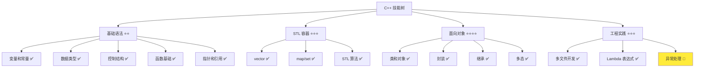
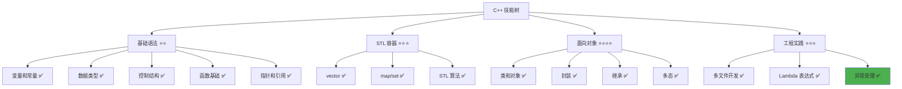

# 异常处理

> **学习目标**：掌握 C++ 异常处理机制，理解 try-catch 语句、throw 抛出异常、标准异常类型，能够在多文件项目中正确使用异常处理，提高程序的健壮性和错误恢复能力  
> **前置知识**：C++ 函数基础、STL 容器（vector、map）、多文件开发基础  
> **预计时间**：90 分钟  
> **难度等级**：⭐⭐⭐  
> **技能收获**：异常处理、try-catch、throw、标准异常类型、异常安全、错误恢复、多文件应用  
> **文档版本**：v1.0  
> **最后更新**：2025-11-14

📊 **难度等级说明**

| 等级           | 描述                       | 练习题数量     | 颜色码 |
| -------------- | -------------------------- | -------------- | ------ |
| **⭐**         | 入门级，零基础可学         | 5 题基础概念题 | 🟢绿   |
| **⭐⭐**       | 基础级，需要基本编程概念   | 5 题基础概念题 | 🟡黄   |
| **⭐⭐⭐**     | 中级，需要相关技术基础     | 3 题代码分析题 | 🟠橙   |
| **⭐⭐⭐⭐**   | 高级，需要扎实的技术功底   | 3 题代码分析题 | 🔴红   |
| **⭐⭐⭐⭐⭐** | 专家级，需要丰富的项目经验 | 2 题设计思考题 | 🟣紫   |

## 1. 学习目标

### 1.1 学习动机

- **实际需求**：程序运行时可能遇到各种错误情况（如访问不存在的键、除以零、文件不存在等）。传统方式使用返回值判断错误，代码冗长且容易遗漏。异常处理提供了一种统一的错误处理机制，让代码更清晰、更安全
- **应用场景**：容器访问越界、文件操作失败、网络请求失败、数据验证失败、资源分配失败
- **技能价值**：学会后能编写更健壮的程序，正确处理错误情况，避免程序崩溃，提高用户体验
- **数据支持**：异常处理是现代 C++ 中重要的错误处理机制，掌握异常处理能显著提高程序的可靠性和可维护性

### 1.2 技能树位置



> **图表说明**：C++ 技能树结构图，当前文档点亮异常处理技能点

### 1.3 前置知识检查

在开始学习之前，请确认你已经掌握：

- [ ] C++ 函数的基础概念（函数定义、调用、参数传递）
- [ ] `std::vector` 和 `std::map` 的基本使用（声明、添加元素、访问元素）
- [ ] 多文件开发基础（头文件、源文件分离）
- [ ] 基本数据类型（int、std::string）

> **未掌握处理**：若未通过，请先复习 [函数基础详解](./12-functions.md)、[STL 容器进阶](./25-stl-containers-advanced.md) 和 [多文件开发基础](./24-multi-file-basics.md)

## 2. 核心内容

### 2.1 概念理解

**异常处理（Exception Handling）**：C++ 提供的一种错误处理机制，允许程序在遇到错误时"抛出"异常，然后在合适的地方"捕获"并处理异常，避免程序崩溃。

> **类比教学**：
>
> - **传统错误处理**：就像遇到问题时，只能通过返回值告诉调用者"出错了"，调用者需要检查每个返回值，容易遗漏
> - **异常处理**：就像遇到问题时，可以"抛出"一个异常信号，这个信号会自动传播到能够处理它的地方，就像"紧急情况"会自动通知相关部门
> - **try-catch**：`try` 就像"监控区域"，`catch` 就像"应急处理部门"，当监控区域发生异常时，应急处理部门会自动响应

### 2.2 为什么需要异常处理

#### 2.2.1 传统方式的局限性

**问题场景**：访问 map 中不存在的键

**传统方式**：使用返回值判断错误

```cpp
#include <iostream>
#include <map>
#include <string>

// 传统方式：使用返回值判断错误
int getScore(const std::map<std::string, int>& scores, const std::string& name) {
    auto it = scores.find(name);
    if (it != scores.end()) {
        return it->second;  // 返回成绩
    }
    return -1;  // 返回 -1 表示未找到（问题：无法区分"未找到"和"成绩为 -1"）
}

int main() {
    std::map<std::string, int> scores = {{"小美", 95}, {"小丽", 87}};

    int score = getScore(scores, "小明");
    if (score == -1) {  // 需要检查返回值
        std::cout << "未找到小明" << std::endl;
    } else {
        std::cout << "小明的成绩: " << score << std::endl;
    }

    return 0;
}
```

**问题**：

- 需要检查每个返回值，代码冗长
- 返回值可能被忽略，导致错误未被处理
- 无法区分"错误"和"正常值"（如 -1 可能是错误，也可能是有效成绩）
- 错误处理代码分散，难以维护

**异常处理方式**：使用异常统一处理错误

```cpp
#include <iostream>
#include <map>
#include <string>
#include <stdexcept>

// 异常处理方式：抛出异常
int getScore(const std::map<std::string, int>& scores, const std::string& name) {
    auto it = scores.find(name);
    if (it != scores.end()) {
        return it->second;
    }
    throw std::runtime_error("未找到学生: " + name);  // 抛出异常
}

int main() {
    std::map<std::string, int> scores = {{"小美", 95}, {"小丽", 87}};

    try {
        int score = getScore(scores, "小明");
        std::cout << "小明的成绩: " << score << std::endl;
    } catch (const std::runtime_error& e) {  // 捕获异常
        std::cout << "错误: " << e.what() << std::endl;
    }

    return 0;
}
```

**优势**：

- 错误处理集中，代码更清晰
- 异常无法被忽略，必须处理
- 可以区分"错误"和"正常值"
- 异常会自动传播，不需要逐层检查返回值

### 2.3 异常处理基本语法

#### 2.3.1 try-catch 语句

**语法结构**：

```cpp
try {
    // 可能抛出异常的代码
    代码块;
} catch (异常类型1& e) {
    // 处理异常类型1
    处理代码1;
} catch (异常类型2& e) {
    // 处理异常类型2
    处理代码2;
} catch (...) {
    // 处理所有其他异常（可选）
    处理代码3;
}
```

**说明**：

- **`try`**：标记可能抛出异常的代码块
- **`catch`**：捕获并处理特定类型的异常
- **`catch (...)`**：捕获所有类型的异常（不推荐，除非确实需要）
- **异常对象**：`catch` 中的参数 `e` 是异常对象，可以通过 `e.what()` 获取错误信息

**类比**：`try` 就像"监控区域"，`catch` 就像"应急处理部门"，当监控区域发生异常时，应急处理部门会自动响应并处理。

#### 2.3.2 throw 抛出异常

**语法结构**：

```cpp
throw 异常对象;
```

**说明**：

- **`throw`**：抛出异常，表示发生了错误
- **异常对象**：可以是任何类型的对象，但通常使用标准异常类型（如 `std::runtime_error`）
- **异常传播**：异常会从抛出点向上传播，直到被 `catch` 捕获

**类比**：`throw` 就像"发出紧急信号"，这个信号会自动传播到能够处理它的地方。

#### 2.3.3 基本示例

```cpp
// 01-basic-exception.cpp
#include <iostream>
#include <stdexcept>

int divide(int a, int b) {
    if (b == 0) {
        throw std::runtime_error("除数不能为零！");
    }
    return a / b;
}

int main() {
    try {
        int result = divide(10, 2);
        std::cout << "10 / 2 = " << result << std::endl;

        result = divide(10, 0);  // 会抛出异常
        std::cout << "10 / 0 = " << result << std::endl;  // 不会执行
    } catch (const std::runtime_error& e) {
        std::cout << "捕获到异常: " << e.what() << std::endl;
    }

    std::cout << "程序继续执行" << std::endl;

    return 0;
}
```

**输出**：

```
10 / 2 = 5
捕获到异常: 除数不能为零！
程序继续执行
```

**说明**：

- `divide(10, 2)` 正常执行，返回结果
- `divide(10, 0)` 抛出异常，后续代码不会执行
- `catch` 捕获异常并处理，打印错误信息
- 异常处理后，程序继续执行 `catch` 块之后的代码

> **配套代码**：基础示例的完整代码位于 `src/stage1/27-exception-handling/01-basic-exception.cpp`

### 2.4 标准异常类型

C++ 标准库提供了多种异常类型，用于表示不同类型的错误。

#### 2.4.1 异常类型层次结构

```
std::exception（基类）
├── std::runtime_error（运行时错误）
│   ├── std::overflow_error（溢出错误）
│   └── std::underflow_error（下溢错误）
├── std::logic_error（逻辑错误）
│   ├── std::invalid_argument（无效参数）
│   ├── std::out_of_range（越界错误）
│   └── std::length_error（长度错误）
└── 其他异常类型...
```

**说明**：

- **`std::exception`**：所有标准异常的基类
- **`std::runtime_error`**：运行时错误（如文件不存在、网络错误）
- **`std::logic_error`**：逻辑错误（如参数无效、越界访问）
- **`std::out_of_range`**：越界错误（如访问 vector 越界、map 中不存在的键）

#### 2.4.2 常用异常类型

**1. std::runtime_error（运行时错误）**

```cpp
#include <stdexcept>

// 抛出运行时错误
throw std::runtime_error("文件打开失败");
throw std::runtime_error("网络连接超时");
```

**2. std::out_of_range（越界错误）**

```cpp
#include <stdexcept>
#include <vector>

std::vector<int> numbers = {1, 2, 3};

try {
    int value = numbers.at(10);  // 越界访问，会抛出 std::out_of_range
} catch (const std::out_of_range& e) {
    std::cout << "越界错误: " << e.what() << std::endl;
}
```

**3. std::invalid_argument（无效参数）**

```cpp
#include <stdexcept>

void setAge(int age) {
    if (age < 0 || age > 150) {
        throw std::invalid_argument("年龄必须在 0-150 之间");
    }
    // ...
}
```

#### 2.4.3 创建自定义异常

```cpp
#include <stdexcept>
#include <string>

// 自定义异常类
class StudentNotFoundException : public std::runtime_error {
public:
    StudentNotFoundException(const std::string& name)
        : std::runtime_error("未找到学生: " + name) {}
};

// 使用自定义异常
void findStudent(const std::string& name) {
    // 假设查找失败
    throw StudentNotFoundException(name);
}

int main() {
    try {
        findStudent("小明");
    } catch (const StudentNotFoundException& e) {
        std::cout << "自定义异常: " << e.what() << std::endl;
    }

    return 0;
}
```

**说明**：

- 自定义异常类继承自 `std::runtime_error` 或 `std::exception`
- 可以在构造函数中设置错误信息
- 使用方式与标准异常相同

### 2.5 异常处理完整示例

#### 2.5.1 容器访问异常处理

```cpp
// 02-container-exception.cpp
#include <iostream>
#include <map>
#include <vector>
#include <stdexcept>
#include <string>

int main() {
    // 示例 1：map 访问异常
    std::map<std::string, int> scores = {{"小美", 95}, {"小丽", 87}};

    try {
        int score = scores.at("小明");  // 使用 at() 访问，键不存在会抛出异常
        std::cout << "小明的成绩: " << score << std::endl;
    } catch (const std::out_of_range& e) {
        std::cout << "错误: " << e.what() << std::endl;
        std::cout << "未找到学生: 小明" << std::endl;
    }

    // 示例 2：vector 访问异常
    std::vector<int> numbers = {1, 2, 3, 4, 5};

    try {
        int value = numbers.at(10);  // 越界访问，会抛出异常
        std::cout << "值: " << value << std::endl;
    } catch (const std::out_of_range& e) {
        std::cout << "错误: " << e.what() << std::endl;
        std::cout << "索引越界" << std::endl;
    }

    return 0;
}
```

**输出**：

```
错误: map::at:  key not found
未找到学生: 小明
错误: vector
索引越界
```

> **注意**：`e.what()` 的具体输出可能因编译器/标准库版本而异，但异常类型和程序行为是一致的。  
> **配套代码**：容器异常处理的完整代码位于 `src/stage1/27-exception-handling/02-container-exception.cpp`

#### 2.5.2 多个 catch 块

```cpp
// 03-multiple-catch.cpp
#include <iostream>
#include <stdexcept>
#include <string>

void processNumber(int num) {
    if (num < 0) {
        throw std::invalid_argument("数字不能为负数");
    }
    if (num > 100) {
        throw std::out_of_range("数字不能大于 100");
    }
    if (num == 0) {
        throw std::runtime_error("数字不能为零");
    }
    std::cout << "处理数字: " << num << std::endl;
}

int main() {
    int numbers[] = {-5, 150, 0, 50};

    for (int num : numbers) {
        try {
            processNumber(num);
        } catch (const std::invalid_argument& e) {
            std::cout << "无效参数错误: " << e.what() << std::endl;
        } catch (const std::out_of_range& e) {
            std::cout << "越界错误: " << e.what() << std::endl;
        } catch (const std::runtime_error& e) {
            std::cout << "运行时错误: " << e.what() << std::endl;
        } catch (...) {
            std::cout << "未知错误" << std::endl;
        }
    }

    return 0;
}
```

**输出**：

```
无效参数错误: 数字不能为负数
越界错误: 数字不能大于 100
运行时错误: 数字不能为零
处理数字: 50
```

**说明**：

- 多个 `catch` 块按顺序匹配异常类型
- 匹配到第一个合适的 `catch` 块后，后续 `catch` 块不会执行
- `catch (...)` 放在最后，捕获所有其他异常

> **配套代码**：多个 catch 块的完整代码位于 `src/stage1/27-exception-handling/03-multiple-catch.cpp`

### 2.6 异常处理在多文件项目中的应用

在实际项目中，异常处理经常在类的成员函数中使用，特别是在处理容器数据或文件操作时。

#### 2.6.1 项目示例：学生成绩管理系统

**项目结构**：

```ini
02-project-example/
├── student.h              # 学生类声明
├── student.cpp            # 学生类实现
├── grade_manager.h        # 成绩管理类声明
├── grade_manager.cpp      # 成绩管理类实现
└── main.cpp               # 主程序
```

> **配套代码**：多文件项目示例位于 `src/stage1/27-exception-handling/02-project-example/` 目录

**student.h**：

```cpp
#pragma once

#include <string>

class Student {
public:
    Student(const std::string& name, int score);

    std::string getName() const;
    int getScore() const;
    void setScore(int score);

private:
    std::string name;
    int score;
};
```

**student.cpp**：

```cpp
#include "student.h"
#include <stdexcept>

Student::Student(const std::string& name, int score)
    : name(name), score(score) {
    if (score < 0 || score > 100) {
        throw std::invalid_argument("成绩必须在 0-100 之间");
    }
}

std::string Student::getName() const {
    return name;
}

int Student::getScore() const {
    return score;
}

void Student::setScore(int score) {
    if (score < 0 || score > 100) {
        throw std::invalid_argument("成绩必须在 0-100 之间");
    }
    this->score = score;
}
```

**grade_manager.h**：

```cpp
#pragma once

#include <map>
#include <string>
#include "student.h"

class GradeManager {
public:
    void addStudent(const std::string& name, int score);
    int getScore(const std::string& name) const;
    void updateScore(const std::string& name, int score);
    void printAllStudents() const;

private:
    std::map<std::string, Student> students;
};
```

**grade_manager.cpp**：

```cpp
#include "grade_manager.h"
#include <iostream>
#include <stdexcept>

void GradeManager::addStudent(const std::string& name, int score) {
    try {
        students.emplace(name, Student(name, score));
        std::cout << "添加学生成功: " << name << std::endl;
    } catch (const std::invalid_argument& e) {
        std::cout << "添加学生失败: " << e.what() << std::endl;
        throw;  // 重新抛出异常，让调用者处理
    }
}

int GradeManager::getScore(const std::string& name) const {
    try {
        return students.at(name).getScore();
    } catch (const std::out_of_range& e) {
        throw std::runtime_error("未找到学生: " + name);
    }
}

void GradeManager::updateScore(const std::string& name, int score) {
    try {
        Student& student = students.at(name);
        student.setScore(score);
        std::cout << "更新成绩成功: " << name << " -> " << score << std::endl;
    } catch (const std::out_of_range& e) {
        throw std::runtime_error("未找到学生: " + name);
    } catch (const std::invalid_argument& e) {
        std::cout << "更新成绩失败: " << e.what() << std::endl;
        throw;
    }
}

void GradeManager::printAllStudents() const {
    std::cout << "=== 所有学生成绩 ===" << std::endl;
    for (const auto& pair : students) {
        std::cout << pair.first << ": " << pair.second.getScore() << std::endl;
    }
}
```

**main.cpp**：

```cpp
#include <iostream>
#include "grade_manager.h"

int main() {
    GradeManager manager;

    // 添加学生（可能抛出异常）
    try {
        manager.addStudent("小美", 95);
        manager.addStudent("小丽", 87);
        manager.addStudent("阿伟", 150);  // 无效成绩，会抛出异常
    } catch (const std::invalid_argument& e) {
        std::cout << "添加学生时发生错误: " << e.what() << std::endl;
    }

    // 查询成绩（可能抛出异常）
    try {
        int score = manager.getScore("小美");
        std::cout << "小美的成绩: " << score << std::endl;

        score = manager.getScore("小明");  // 不存在的学生，会抛出异常
        std::cout << "小明的成绩: " << score << std::endl;
    } catch (const std::runtime_error& e) {
        std::cout << "查询成绩时发生错误: " << e.what() << std::endl;
    }

    // 更新成绩（可能抛出异常）
    try {
        manager.updateScore("小丽", 92);
        manager.updateScore("小明", 88);  // 不存在的学生，会抛出异常
    } catch (const std::runtime_error& e) {
        std::cout << "更新成绩时发生错误: " << e.what() << std::endl;
    }

    // 显示所有学生
    manager.printAllStudents();

    return 0;
}
```

**输出**：

```
添加学生成功: 小美
添加学生成功: 小丽
添加学生失败: 成绩必须在 0-100 之间
添加学生时发生错误: 成绩必须在 0-100 之间
小美的成绩: 95
查询成绩时发生错误: 未找到学生: 小明
更新成绩成功: 小丽 -> 92
更新成绩时发生错误: 未找到学生: 小明
=== 所有学生成绩 ===
小丽: 92
小美: 95
```

**说明**：

- 在类的构造函数和成员函数中使用异常处理
- 异常可以在不同文件之间传播
- 可以在 `catch` 块中重新抛出异常（`throw;`）
- 异常处理让错误处理更集中、更清晰

### 2.7 异常安全

**异常安全（Exception Safety）**：确保程序在发生异常时仍能保持正确状态，不会出现资源泄漏或数据不一致。

#### 2.7.1 异常安全级别

1. **基本保证（Basic Guarantee）**：发生异常后，程序处于有效状态，但可能不是预期状态
2. **强保证（Strong Guarantee）**：发生异常后，程序状态与异常发生前完全相同（事务性操作）
3. **不抛出保证（No-throw Guarantee）**：函数保证不会抛出异常

#### 2.7.2 RAII 与异常安全

**RAII（Resource Acquisition Is Initialization）**：资源获取即初始化，是 C++ 中实现异常安全的重要技术。

```cpp
#include <memory>
#include <stdexcept>

// 使用智能指针实现异常安全
void processData() {
    auto ptr = std::make_unique<int>(10);  // RAII：资源自动管理

    // 即使这里抛出异常，ptr 也会自动释放内存
    if (someCondition) {
        throw std::runtime_error("发生错误");
    }

    // 正常情况下的代码
    // ptr 在函数结束时自动释放
}
```

**说明**：

- 使用智能指针（`std::unique_ptr`、`std::shared_ptr`）自动管理资源
- 即使发生异常，资源也会自动释放
- 这是实现异常安全的最佳实践

### 2.8 常见陷阱和注意事项

#### 2.8.1 常见错误

**错误 1：忘记捕获异常**

```cpp
int divide(int a, int b) {
    if (b == 0) {
        throw std::runtime_error("除数不能为零");
    }
    return a / b;
}

int main() {
    int result = divide(10, 0);  // 错误：未捕获异常，程序会崩溃
    return 0;
}
```

**正确做法**：

```cpp
int main() {
    try {
        int result = divide(10, 0);
    } catch (const std::runtime_error& e) {
        std::cout << "错误: " << e.what() << std::endl;
    }
    return 0;
}
```

**错误 2：捕获异常后不处理**

```cpp
try {
    // 可能抛出异常的代码
} catch (...) {
    // 错误：捕获了异常但不处理，隐藏了错误
}
```

**正确做法**：

```cpp
try {
    // 可能抛出异常的代码
} catch (const std::exception& e) {
    std::cout << "错误: " << e.what() << std::endl;
    // 进行适当的错误处理（记录日志、恢复状态等）
}
```

**错误 3：在析构函数中抛出异常**

```cpp
class MyClass {
public:
    ~MyClass() {
        // 错误：析构函数中不应该抛出异常
        throw std::runtime_error("错误");
    }
};
```

**正确做法**：

```cpp
class MyClass {
public:
    ~MyClass() {
        // 正确：析构函数中不抛出异常，只记录错误
        try {
            // 清理资源
        } catch (...) {
            // 只记录错误，不抛出异常
        }
    }
};
```

#### 2.8.2 最佳实践

1. **优先使用标准异常类型**：使用 `std::runtime_error`、`std::invalid_argument` 等标准异常类型
2. **提供有意义的错误信息**：在异常中包含足够的上下文信息
3. **在合适的地方捕获异常**：在能够处理异常的地方捕获，不要过早捕获
4. **使用 RAII 实现异常安全**：使用智能指针等 RAII 技术管理资源
5. **避免在析构函数中抛出异常**：析构函数中不应该抛出异常
6. **不要忽略异常**：捕获异常后要进行适当的处理

## 3. 练习与测试

### 3.1 练习题

#### 练习 1：使用异常处理验证输入

**题目**：编写程序，使用异常处理验证用户输入的年龄是否在有效范围内（0-150）。

**要求**：

- 创建一个函数 `validateAge(int age)`，如果年龄无效则抛出 `std::invalid_argument` 异常
- 在 `main()` 函数中使用 `try-catch` 捕获异常
- 测试多个年龄值（包括有效和无效的）
- 输出清晰的错误信息

**参考答案**：

```cpp
#include <iostream>
#include <stdexcept>

void validateAge(int age) {
    if (age < 0) {
        throw std::invalid_argument("年龄不能为负数");
    }
    if (age > 150) {
        throw std::invalid_argument("年龄不能大于 150");
    }
    std::cout << "年龄验证通过: " << age << std::endl;
}

int main() {
    int ages[] = {25, -5, 200, 30};

    for (int age : ages) {
        try {
            validateAge(age);
        } catch (const std::invalid_argument& e) {
            std::cout << "验证失败: " << e.what() << std::endl;
        }
    }

    return 0;
}
```

**输出**：

```
年龄验证通过: 25
验证失败: 年龄不能为负数
验证失败: 年龄不能大于 150
年龄验证通过: 30
```

> **配套代码**：练习 1 的完整代码位于 `src/stage1/27-exception-handling/04-exercise-validate.cpp`

#### 练习 2：使用异常处理访问容器

**题目**：编写程序，使用异常处理安全地访问 `std::map` 和 `std::vector` 中的元素。

**要求**：

- 创建一个 `std::map<std::string, int>` 存储学生成绩
- 创建一个 `std::vector<int>` 存储数字
- 使用 `at()` 方法访问元素，捕获 `std::out_of_range` 异常
- 输出清晰的错误信息

**参考答案**：

```cpp
#include <iostream>
#include <map>
#include <vector>
#include <stdexcept>
#include <string>

int main() {
    // map 访问
    std::map<std::string, int> scores = {{"小美", 95}, {"小丽", 87}};

    std::string names[] = {"小美", "小明"};
    for (const std::string& name : names) {
        try {
            int score = scores.at(name);
            std::cout << name << " 的成绩: " << score << std::endl;
        } catch (const std::out_of_range& e) {
            std::cout << "错误: 未找到学生 " << name << std::endl;
        }
    }

    // vector 访问
    std::vector<int> numbers = {1, 2, 3, 4, 5};
    int indices[] = {2, 10};

    for (int index : indices) {
        try {
            int value = numbers.at(index);
            std::cout << "索引 " << index << " 的值: " << value << std::endl;
        } catch (const std::out_of_range& e) {
            std::cout << "错误: 索引 " << index << " 越界" << std::endl;
        }
    }

    return 0;
}
```

**输出**：

```
小美 的成绩: 95
错误: 未找到学生 小明
索引 2 的值: 3
错误: 索引 10 越界
```

> **配套代码**：练习 2 的完整代码位于 `src/stage1/27-exception-handling/05-exercise-container.cpp`

#### 练习 3：创建自定义异常

**题目**：编写程序，创建一个自定义异常类 `DivisionByZeroException`，用于处理除以零的错误。

**要求**：

- 创建 `DivisionByZeroException` 类，继承自 `std::runtime_error`
- 创建一个 `divide(int a, int b)` 函数，如果除数为零则抛出自定义异常
- 在 `main()` 函数中使用 `try-catch` 捕获自定义异常
- 测试多个除法运算（包括除数为零的情况）

**参考答案**：

```cpp
#include <iostream>
#include <stdexcept>
#include <string>

// 自定义异常类
class DivisionByZeroException : public std::runtime_error {
public:
    DivisionByZeroException()
        : std::runtime_error("除数不能为零") {}
};

int divide(int a, int b) {
    if (b == 0) {
        throw DivisionByZeroException();
    }
    return a / b;
}

int main() {
    int testCases[][2] = {{10, 2}, {10, 0}, {15, 3}, {20, 0}};

    for (auto& testCase : testCases) {
        int a = testCase[0];
        int b = testCase[1];

        try {
            int result = divide(a, b);
            std::cout << a << " / " << b << " = " << result << std::endl;
        } catch (const DivisionByZeroException& e) {
            std::cout << "错误: " << e.what() << std::endl;
        }
    }

    return 0;
}
```

**输出**：

```
10 / 2 = 5
错误: 除数不能为零
15 / 3 = 5
错误: 除数不能为零
```

> **配套代码**：练习 3 的完整代码位于 `src/stage1/27-exception-handling/06-exercise-custom-exception.cpp`

### 3.2 测试题（可选）

1. **关于异常处理，下列说法正确的是：**

   A. 异常处理只能处理运行时错误

   B. `try` 块中的代码如果抛出异常，后续代码不会执行

   C. `catch` 块必须放在 `try` 块之前

   D. 异常处理会阻止程序继续执行

   **答案**：B

   **解析**：
   - **正确答案 B**：`try` 块中的代码如果抛出异常，异常之后的代码不会执行，程序会跳转到对应的 `catch` 块
   - **错误答案 A**：异常处理可以处理各种类型的错误，包括运行时错误和逻辑错误
   - **错误答案 C**：`catch` 块必须放在 `try` 块之后
   - **错误答案 D**：异常处理不会阻止程序继续执行，异常被捕获后，程序会继续执行 `catch` 块之后的代码

2. **以下哪个异常类型用于表示越界错误？**

   A. `std::runtime_error`

   B. `std::invalid_argument`

   C. `std::out_of_range`

   D. `std::logic_error`

   **答案**：C

   **解析**：
   - **正确答案 C**：`std::out_of_range` 用于表示越界错误，如访问 vector 越界、map 中不存在的键
   - **错误答案 A**：`std::runtime_error` 用于表示运行时错误，如文件不存在、网络错误
   - **错误答案 B**：`std::invalid_argument` 用于表示无效参数错误
   - **错误答案 D**：`std::logic_error` 是逻辑错误的基类，`std::out_of_range` 继承自它

3. **关于 `catch (...)`，下列说法正确的是：**

   A. `catch (...)` 可以捕获所有类型的异常

   B. `catch (...)` 应该放在最前面

   C. `catch (...)` 可以获取异常对象

   D. `catch (...)` 是推荐的做法

   **答案**：A

   **解析**：
   - **正确答案 A**：`catch (...)` 可以捕获所有类型的异常，包括标准异常和自定义异常
   - **错误答案 B**：`catch (...)` 应该放在最后，因为异常匹配是按顺序进行的
   - **错误答案 C**：`catch (...)` 不能获取异常对象，因为它不知道异常类型
   - **错误答案 D**：`catch (...)` 不推荐使用，除非确实需要捕获所有异常，因为它会隐藏具体的错误信息

## 4. 总结

### 4.1 核心知识点回顾

- **异常处理语法**：
  - `try-catch` 语句：`try { ... } catch (异常类型& e) { ... }`
  - `throw` 抛出异常：`throw 异常对象;`
- **标准异常类型**：
  - `std::runtime_error`：运行时错误
  - `std::out_of_range`：越界错误
  - `std::invalid_argument`：无效参数错误
  - `std::exception`：所有标准异常的基类
- **异常安全**：使用 RAII（智能指针）实现异常安全
- **多文件应用**：在类的成员函数中使用异常处理，异常可以在不同文件之间传播

### 4.2 最佳实践

- **优先使用标准异常类型**：使用标准库提供的异常类型，保持代码一致性
- **提供有意义的错误信息**：在异常中包含足够的上下文信息，便于调试
- **在合适的地方捕获异常**：在能够处理异常的地方捕获，不要过早捕获
- **使用 RAII 实现异常安全**：使用智能指针等 RAII 技术管理资源
- **避免在析构函数中抛出异常**：析构函数中不应该抛出异常

### 4.3 常见问题 FAQ

- **Q1：异常处理和返回值判断有什么区别？**
  - **A：**异常处理提供了一种统一的错误处理机制，异常无法被忽略，必须处理。返回值判断需要检查每个返回值，容易遗漏。**类比**：返回值判断就像"需要主动询问"，异常处理就像"自动通知"。**最佳实践**：对于严重错误使用异常处理，对于正常流程使用返回值。

- **Q2：什么时候应该抛出异常？**
  - **A：**当遇到无法恢复的错误时应该抛出异常，如：参数无效、资源分配失败、越界访问等。**类比**：就像遇到"紧急情况"需要通知相关部门。**最佳实践**：不要对正常流程使用异常（如查找失败），异常应该用于真正的错误情况。

- **Q3：`catch (...)` 是什么意思？**
  - **A：**`catch (...)` 可以捕获所有类型的异常，但无法获取异常对象。**注意**：不推荐使用，除非确实需要捕获所有异常。**最佳实践**：明确指定要捕获的异常类型，如 `catch (const std::exception& e)`。

- **Q4：异常会影响程序性能吗？**
  - **A：**异常处理会有一定的性能开销，但通常可以忽略。只有在性能关键路径上才需要考虑。**最佳实践**：优先考虑代码的可读性和可维护性，性能问题通过性能测试来发现和解决。

- **Q5：可以在构造函数中抛出异常吗？**
  - **A：**可以。构造函数中抛出异常是正常的做法，表示对象构造失败。**注意**：如果构造函数抛出异常，对象不会被创建，析构函数不会被调用。**最佳实践**：在构造函数中使用异常处理验证参数和初始化资源。

## 5. 资源与扩展

### 5.1 基础资源

- **官方文档**：[C++ 异常处理](https://en.cppreference.com/w/cpp/language/exceptions)、[cppreference.com](https://en.cppreference.com/)
- **权威书籍**：《C++ Primer》- 第 5.6 节异常处理、《Effective C++》- Item 29-31
- **在线教程**：[learncpp.com](https://www.learncpp.com/) - 异常处理教程

### 5.2 多媒体学习

- **视频资源**：[C++ 异常处理详解](https://www.youtube.com/results?search_query=C%2B%2B+exception+handling+tutorial)
- **开发者资源**：[cppreference.com](https://en.cppreference.com/) - 权威参考

### 5.3 扩展阅读

- **异常规范**：C++11 引入了 `noexcept` 关键字，用于指定函数不会抛出异常
- **异常安全保证**：学习不同级别的异常安全保证（基本保证、强保证、不抛出保证）
- **RAII 模式**：深入学习 RAII 模式，实现异常安全的资源管理

## 6. 课后作业及参考答案

### 6.1 学习检查清单

在完成本章学习后，请确认你已经掌握：

- [ ] 能够解释异常处理的概念和作用
- [ ] 理解 `try-catch` 语句的语法和使用方法
- [ ] 能够使用 `throw` 抛出异常
- [ ] 了解常用的标准异常类型（`std::runtime_error`、`std::out_of_range` 等）
- [ ] 能够在多文件项目中使用异常处理
- [ ] 理解异常安全的概念和 RAII 的作用

### 6.2 综合练习

**作业题目**：编写一个文件读取器类，使用异常处理处理文件操作错误。

**要求**：

- 创建一个 `FileReader` 类（`file_reader.h` 和 `file_reader.cpp`）
- 实现 `readFile(const std::string& filename)` 方法，读取文件内容
- 如果文件不存在，抛出 `std::runtime_error` 异常
- 如果文件打开失败，抛出 `std::runtime_error` 异常
- 在 `main.cpp` 中使用 `try-catch` 处理异常
- 测试多个文件（包括存在和不存在的文件）

**时间估算**：45 分钟

**参考答案**：

**file_reader.h**：

```cpp
#pragma once

#include <string>
#include <vector>

class FileReader {
public:
    std::vector<std::string> readFile(const std::string& filename);
};
```

**file_reader.cpp**：

```cpp
#include "file_reader.h"
#include <fstream>
#include <stdexcept>

std::vector<std::string> FileReader::readFile(const std::string& filename) {
    std::ifstream file(filename);

    if (!file.is_open()) {
        throw std::runtime_error("无法打开文件: " + filename);
    }

    std::vector<std::string> lines;
    std::string line;

    while (std::getline(file, line)) {
        lines.push_back(line);
    }

    if (file.bad()) {
        throw std::runtime_error("读取文件时发生错误: " + filename);
    }

    return lines;
}
```

**main.cpp**：

```cpp
#include <iostream>
#include <vector>
#include <string>
#include "file_reader.h"

int main() {
    FileReader reader;
    std::string filenames[] = {"test.txt", "nonexistent.txt"};

    for (const std::string& filename : filenames) {
        try {
            std::vector<std::string> lines = reader.readFile(filename);
            std::cout << "文件 " << filename << " 读取成功，共 " << lines.size() << " 行" << std::endl;
            for (const std::string& line : lines) {
                std::cout << line << std::endl;
            }
        } catch (const std::runtime_error& e) {
            std::cout << "错误: " << e.what() << std::endl;
        }
    }

    return 0;
}
```

**评分标准**：功能实现（40%）、异常处理正确（30%）、代码质量（30%）

> **配套代码**：综合练习的完整代码位于 `src/stage1/27-exception-handling/06-homework-file-reader/` 目录

## 7. 下一步学习

**下一篇**：[28-多文件开发进阶](./28-multi-file-advanced.md)

**学习路径**：

1. ✅ C++ 简介和快速入门 - 已完成
2. ✅ 变量和常量 - 已完成
3. ✅ 数据类型详解 - 已完成
4. ✅ 运算符详解 - 已完成
5. ✅ if 分支详解 - 已完成
6. ✅ while 循环 - 已完成
7. ✅ for 循环 - 已完成
8. ✅ switch 分支 - 已完成
9. ✅ 数组基础 - 已完成
10. ✅ std::vector - 已完成
11. ✅ 字符串进阶 - 已完成
12. ✅ 函数基础 - 已完成
13. ✅ 指针详解 - 已完成
14. ✅ 引用详解 - 已完成
15. ✅ 结构体详解 - 已完成
16. ✅ 类和对象 - 已完成
17. ✅ 封装 - 已完成
18. ✅ 继承 - 已完成
19. ✅ 多态 - 已完成
20. ✅ STL 容器基础 - 已完成
21. ✅ STL 容器进阶 - 已完成
22. ✅ 多文件开发基础 - 已完成
23. ✅ Lambda 表达式 - 已完成
24. ✅ 异常处理 - 已完成
25. 🔄 多文件开发进阶 - 下一步
26. ⏳ 系统设计 - 待学习
27. ⏳ 项目实战 - 待学习

**技能树更新**：



**学习成果**：

- **独立编写**：能够编写使用异常处理的代码，包括 `try-catch` 语句、`throw` 抛出异常、标准异常类型
- **解释原理**：能够解释异常处理的概念、`try-catch` 的工作原理、异常传播机制
- **解决实际问题**：能够在实际项目中使用异常处理处理错误情况，提高程序的健壮性
- **应用到项目**：能够在多文件项目中使用异常处理，实现异常安全的资源管理
- **掌握度自评**：80%

> **自评指导**：
>
> - **<50%**：建议复习异常处理的基础概念，重新阅读文档核心内容，完成练习题
> - **50-80%**：继续学习，完成综合练习巩固理解，尝试在实际项目中使用异常处理
> - **>80%**：可以进入下一阶段学习，开始多文件开发进阶

---

**文档质量检查**：

- [x] 学习目标明确且可验证
- [x] 代码示例可运行
- [x] 练习题有答案
- [x] 技能收获明确
- [x] 抽象概念配有生活化比喻
- [x] 比喻体系一致，避免概念混乱
- [x] 文档长度符合难度等级要求
- [x] 包含常见问题 FAQ
- [x] 包含资源与扩展
- [x] 包含课后作业及参考答案
- [x] 包含完整的学习路径和技能树更新
