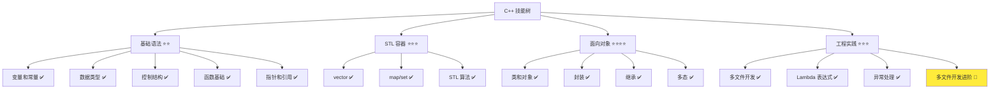
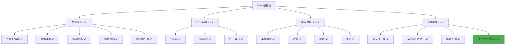

# 多文件开发进阶

> **学习目标**：掌握 C++ 多文件开发的进阶知识，理解命名空间、静态成员、友元函数、前向声明等高级特性，能够在复杂多文件项目中正确组织代码，提高编译效率和代码可维护性  
> **前置知识**：C++ 多文件开发基础、类和对象、封装、继承  
> **预计时间**：90 分钟  
> **难度等级**：⭐⭐⭐⭐  
> **技能收获**：命名空间、静态成员、友元函数、前向声明、依赖管理、复杂多文件项目组织  
> **文档版本**：v1.0  
> **最后更新**：2025-11-17

📊 **难度等级说明**

| 等级           | 描述                       | 练习题数量     | 颜色码 |
| -------------- | -------------------------- | -------------- | ------ |
| **⭐**         | 入门级，零基础可学         | 5 题基础概念题 | 🟢绿   |
| **⭐⭐**       | 基础级，需要基本编程概念   | 5 题基础概念题 | 🟡黄   |
| **⭐⭐⭐**     | 中级，需要相关技术基础     | 3 题代码分析题 | 🟠橙   |
| **⭐⭐⭐⭐**   | 高级，需要扎实的技术功底   | 3 题代码分析题 | 🔴红   |
| **⭐⭐⭐⭐⭐** | 专家级，需要丰富的项目经验 | 2 题设计思考题 | 🟣紫   |

## 1. 学习目标

### 1.1 学习动机

- **实际需求**：在多文件项目中，随着代码规模增大，会遇到命名冲突、类级别数据共享、访问私有成员、编译依赖等问题。多文件开发进阶特性提供了解决这些问题的工具，让代码组织更清晰、编译更快、维护更容易
- **应用场景**：大型项目开发、团队协作、库开发、模块化设计、性能优化
- **技能价值**：学会后能开发更复杂的 C++ 项目，优化编译时间，提高代码质量和可维护性
- **数据支持**：命名空间、静态成员、前向声明等特性在实际 C++ 项目中广泛使用，掌握这些特性是进阶开发的必备技能

### 1.2 技能树位置



> **图表说明**：C++ 技能树结构图，当前文档点亮多文件开发进阶技能点

### 1.3 前置知识检查

在开始学习之前，请确认你已经掌握：

- [ ] 多文件开发基础（头文件和源文件分离、头文件保护、编译链接）
- [ ] C++ 类的定义和使用（成员变量、成员函数、构造函数、访问控制）
- [ ] 封装的概念（public、private、protected）
- [ ] 继承的基础概念（基类和派生类）

> **未掌握处理**：若未通过，请先复习 [多文件开发基础](./24-multi-file-basics.md)、[类和对象详解](./18-classes-objects.md) 和 [封装详解](./19-encapsulation.md)

## 2. 核心内容

### 2.1 概念理解

**多文件开发进阶**：在多文件开发基础之上，使用命名空间、静态成员、友元函数、前向声明等高级特性，解决大型项目中的命名冲突、数据共享、访问控制和编译依赖等问题，提高代码质量和开发效率。

> **类比教学**：
>
> - **命名空间**：就像给不同的工具箱贴上标签，避免工具名称冲突。`std::cout` 中的 `std` 就是命名空间，表示这是标准库的工具
> - **静态成员**：就像班级的公共设施（如教室的时钟），所有学生（对象）共享同一个设施，而不是每人一个
> - **友元函数**：就像给朋友一把钥匙，允许他访问你的私人房间（私有成员），但只有你信任的朋友才能获得这把钥匙
> - **前向声明**：就像提前告诉别人"我有一个朋友叫张三"，而不需要立即介绍张三的详细信息，这样可以减少不必要的依赖

### 2.2 命名空间（namespace）

#### 2.2.1 为什么需要命名空间

**问题场景**：多个文件或库中定义了相同名称的函数或类

```cpp
// math_utils.h
int add(int a, int b) {
    return a + b;
}

// string_utils.h
std::string add(const std::string& a, const std::string& b) {
    return a + b;
}

// main.cpp
#include "math_utils.h"
#include "string_utils.h"

int main() {
    // 错误：add 函数名冲突！
    int result = add(1, 2);
    return 0;
}
```

**问题**：两个头文件都定义了 `add` 函数，导致命名冲突，编译错误。

**解决方案**：使用命名空间

```cpp
// math_utils.h
namespace MathUtils {
    int add(int a, int b) {
        return a + b;
    }
}

// string_utils.h
namespace StringUtils {
    std::string add(const std::string& a, const std::string& b) {
        return a + b;
    }
}

// main.cpp
#include "math_utils.h"
#include "string_utils.h"

int main() {
    // 使用命名空间限定，避免冲突
    int result = MathUtils::add(1, 2);
    std::string str = StringUtils::add("Hello", "World");
    return 0;
}
```

**优势**：命名空间将代码组织到不同的"命名空间"中，避免命名冲突。

#### 2.2.2 命名空间基本语法

**定义命名空间**：

```cpp
namespace 命名空间名称 {
    // 函数、类、变量等
}
```

**使用命名空间中的内容**：

```cpp
// 方式 1：使用命名空间限定符 ::
命名空间名称::函数名();
命名空间名称::类名 对象名;

// 方式 2：使用 using 声明（推荐用于特定函数/类）
using 命名空间名称::函数名;
函数名();  // 可以直接使用

// 方式 3：使用 using namespace（不推荐，容易造成命名冲突）
using namespace 命名空间名称;
函数名();  // 可以直接使用
```

**类比**：命名空间就像给工具箱贴上标签，`命名空间名称::工具名` 就像"从标签为 X 的工具箱中取出工具 Y"。

#### 2.2.3 命名空间示例

```cpp
// 01-namespace-basic.cpp
#include <iostream>
#include <string>

// 定义命名空间
namespace MathUtils {
    int add(int a, int b) {
        return a + b;
    }

    int multiply(int a, int b) {
        return a * b;
    }
}

namespace StringUtils {
    std::string add(const std::string& a, const std::string& b) {
        return a + b;
    }
}

int main() {
    // 使用命名空间限定符
    int sum = MathUtils::add(5, 3);
    std::cout << "5 + 3 = " << sum << std::endl;

    std::string result = StringUtils::add("Hello", " World");
    std::cout << result << std::endl;

    // 使用 using 声明
    using MathUtils::multiply;
    int product = multiply(4, 5);
    std::cout << "4 * 5 = " << product << std::endl;

    return 0;
}
```

**输出**：

```
5 + 3 = 8
Hello World
4 * 5 = 20
```

> **配套代码**：命名空间基础示例的完整代码位于 `src/stage1/28-multi-file-advanced/01-namespace-basic.cpp`

#### 2.2.4 命名空间在多文件项目中的应用

**项目结构**：

```ini
02-project-namespace/
├── math_utils.h
├── math_utils.cpp
├── string_utils.h
├── string_utils.cpp
└── main.cpp
```

**math_utils.h**：

```cpp
#pragma once

namespace MathUtils {
    int add(int a, int b);
    int multiply(int a, int b);
}
```

**math_utils.cpp**：

```cpp
#include "math_utils.h"

namespace MathUtils {
    int add(int a, int b) {
        return a + b;
    }

    int multiply(int a, int b) {
        return a * b;
    }
}
```

**string_utils.h**：

```cpp
#pragma once

#include <string>

namespace StringUtils {
    std::string add(const std::string& a, const std::string& b);
    std::string toUpper(const std::string& str);
}
```

**string_utils.cpp**：

```cpp
#include "string_utils.h"
#include <algorithm>
#include <cctype>

namespace StringUtils {
    std::string add(const std::string& a, const std::string& b) {
        return a + b;
    }

    std::string toUpper(const std::string& str) {
        std::string result = str;
        std::transform(result.begin(), result.end(), result.begin(), ::toupper);
        return result;
    }
}
```

**main.cpp**：

```cpp
#include <iostream>
#include "math_utils.h"
#include "string_utils.h"

int main() {
    // 使用命名空间限定符，避免冲突
    int sum = MathUtils::add(10, 20);
    std::cout << "10 + 20 = " << sum << std::endl;

    std::string result = StringUtils::add("Hello", " World");
    std::cout << result << std::endl;

    std::string upper = StringUtils::toUpper("hello");
    std::cout << upper << std::endl;

    return 0;
}
```

**输出**：

```
10 + 20 = 30
Hello World
HELLO
```

> **配套代码**：命名空间多文件项目示例位于 `src/stage1/28-multi-file-advanced/02-project-namespace/` 目录

**说明**：

- 命名空间可以在头文件中声明，在源文件中实现
- 使用命名空间限定符 `::` 访问命名空间中的内容
- 避免命名冲突，提高代码可读性

### 2.3 静态成员（static member）

#### 2.3.1 为什么需要静态成员

**问题场景**：需要统计创建了多少个对象，或者需要所有对象共享同一个数据

**传统方式**：使用全局变量（不推荐）

```cpp
int objectCount = 0;            // 全局变量

class User {
public:
    User() {
        objectCount++;          // 每次创建对象时增加计数
    }
};

int main() {
    User u1, u2, u3;
    std::cout << "创建了 " << objectCount << " 个对象" << std::endl;
    return 0;
}
```

**问题**：全局变量破坏了封装性，容易被误用。

**解决方案**：使用静态成员

```cpp
class User {
private:
    static int objectCount;     // 静态成员变量（类级别的数据）

public:
    User() {
        objectCount++;          // 所有对象共享同一个计数器
    }

    static int getCount() {     // 静态成员函数
        return objectCount;
    }
};

int User::objectCount = 0;      // 静态成员变量必须在类外定义

int main() {
    User u1, u2, u3;
    std::cout << "创建了 " << User::getCount() << " 个对象" << std::endl;
    return 0;
}
```

**优势**：静态成员属于类本身，不属于任何对象，所有对象共享同一个静态成员。

#### 2.3.2 静态成员变量

**定义**：使用 `static` 关键字声明的成员变量，属于类本身，不属于任何对象。

**特点**：

- 所有对象共享同一个静态成员变量
- 静态成员变量必须在类外定义（分配内存）
- 可以通过类名访问，也可以通过对象访问
- 类比：就像班级的公共设施（如教室的时钟），所有学生共享同一个设施

**语法**：

```cpp
class 类名 {
private:
    static 数据类型 变量名;             // 声明
};

数据类型 类名::变量名 = 初始值;          // 定义（必须在类外）
```

**示例**：

```cpp
// 03-static-member-variable.cpp
#include <iostream>
#include <string>

class Counter {
private:
    static int count;               // 静态成员变量声明

public:
    Counter() {
        count++;                    // 每次创建对象时增加计数
    }

    static int getCount() {
        return count;
    }
};

int Counter::count = 0;             // 静态成员变量定义（必须在类外）

int main() {
    std::cout << "初始计数: " << Counter::getCount() << std::endl;

    Counter c1;
    std::cout << "创建 1 个对象后: " << Counter::getCount() << std::endl;

    Counter c2, c3;
    std::cout << "创建 3 个对象后: " << Counter::getCount() << std::endl;

    return 0;
}
```

**输出**：

```
初始计数: 0
创建 1 个对象后: 1
创建 3 个对象后: 3
```

> **配套代码**：静态成员变量示例的完整代码位于 `src/stage1/28-multi-file-advanced/03-static-member-variable.cpp`

**重要规则**：

1. **静态成员变量必须在类外定义**：类内只是声明，类外才是定义（分配内存）
2. **所有对象共享同一个静态成员变量**：修改一个对象的静态成员，所有对象都能看到变化
3. **可以通过类名访问**：`类名::静态成员变量`（如果访问权限允许）

#### 2.3.3 静态成员函数

**定义**：使用 `static` 关键字声明的成员函数，属于类本身，不属于任何对象。

**特点**：

- 不能访问非静态成员变量（因为没有 `this` 指针）
- 可以通过类名直接调用，不需要对象
- 常用于访问静态成员变量或提供工具函数
- 类比：就像班级的公共工具（如计算器），不需要创建学生对象就能使用

**语法**：

```cpp
class 类名 {
public:
    static 返回类型 函数名(参数列表) {
        // 函数体
    }
};

// 调用方式
类名::函数名(参数);
```

**示例**：

```cpp
// 04-static-member-function.cpp
#include <iostream>
#include <cmath>

class MathHelper {
public:
    // 静态成员函数：计算平方
    static double square(double x) {
        return x * x;
    }

    // 静态成员函数：计算平方根
    static double sqrt(double x) {
        return std::sqrt(x);
    }

    // 静态成员函数：计算两点之间的距离
    static double distance(double x1, double y1, double x2, double y2) {
        double dx = x2 - x1;
        double dy = y2 - y1;
        return std::sqrt(dx * dx + dy * dy);
    }
};

int main() {
    // 通过类名直接调用，不需要创建对象
    double result1 = MathHelper::square(5.0);
    std::cout << "5.0 的平方: " << result1 << std::endl;

    double result2 = MathHelper::sqrt(16.0);
    std::cout << "16.0 的平方根: " << result2 << std::endl;

    double dist = MathHelper::distance(0, 0, 3, 4);
    std::cout << "点 (0,0) 到 (3,4) 的距离: " << dist << std::endl;

    return 0;
}
```

**输出**：

```
5.0 的平方: 25
16.0 的平方根: 4
点 (0,0) 到 (3,4) 的距离: 5
```

> **配套代码**：静态成员函数示例的完整代码位于 `src/stage1/28-multi-file-advanced/04-static-member-function.cpp`

**重要规则**：

1. **静态成员函数不能访问非静态成员**：因为没有 `this` 指针，无法访问对象的成员变量
2. **可以通过类名直接调用**：不需要创建对象
3. **常用于工具函数**：提供与类相关但不依赖对象状态的函数

### 2.4 友元函数（friend function）

#### 2.4.1 为什么需要友元函数

**问题场景**：需要让外部函数访问类的私有成员

**传统方式**：使用公开的 getter/setter（可能不够高效或不够灵活）

```cpp
class Point {
private:
    int x, y;

public:
    Point(int x, int y) : x(x), y(y) {}
    int getX() const { return x; }
    int getY() const { return y; }
};

// 计算两点之间的距离
double distance(const Point& p1, const Point& p2) {
    // 需要通过 getter 访问私有成员
    int dx = p1.getX() - p2.getX();
    int dy = p1.getY() - p2.getY();
    return std::sqrt(dx * dx + dy * dy);
}
```

**问题**：如果 `distance` 函数需要频繁访问私有成员，每次都调用 getter 可能不够高效。

**解决方案**：使用友元函数

```cpp
class Point {
private:
    int x, y;

    // 声明友元函数
    friend double distance(const Point& p1, const Point& p2);

public:
    Point(int x, int y) : x(x), y(y) {}
};

// 友元函数定义：可以直接访问 Point 的私有成员
double distance(const Point& p1, const Point& p2) {
    int dx = p1.x - p2.x;  // 直接访问私有成员
    int dy = p1.y - p2.y;
    return std::sqrt(dx * dx + dy * dy);
}
```

**优势**：友元函数可以直接访问类的私有成员，提高效率，同时保持封装性（只有被声明为友元的函数才能访问）。

#### 2.4.2 友元函数基本语法

**声明友元函数**：

```cpp
class 类名 {
private:
    // 私有成员

    // 在类内声明友元函数
    friend 返回类型 函数名(参数列表);

public:
    // 公开成员
};

// 在类外定义友元函数
返回类型 函数名(参数列表) {
    // 可以直接访问类的私有成员
}
```

**说明**：

- 友元函数不是类的成员函数，但可以访问类的私有成员
- 友元函数在类内声明，在类外定义
- 类比：就像给朋友一把钥匙，允许他访问你的私人房间（私有成员），但只有你信任的朋友才能获得这把钥匙

#### 2.4.3 友元函数示例

```cpp
// 05-friend-function.cpp
#include <iostream>
#include <cmath>

class Point {
private:
    int x, y;

    // 声明友元函数
    friend double distance(const Point& p1, const Point& p2);
    friend void printPoint(const Point& p);

public:
    Point(int x, int y) : x(x), y(y) {}
};

// 友元函数：计算两点之间的距离
double distance(const Point& p1, const Point& p2) {
    int dx = p1.x - p2.x;  // 直接访问私有成员
    int dy = p1.y - p2.y;
    return std::sqrt(dx * dx + dy * dy);
}

// 友元函数：打印点的坐标
void printPoint(const Point& p) {
    std::cout << "(" << p.x << ", " << p.y << ")";  // 直接访问私有成员
}

int main() {
    Point p1(0, 0);
    Point p2(3, 4);

    printPoint(p1);
    std::cout << " 到 ";
    printPoint(p2);
    std::cout << " 的距离: " << distance(p1, p2) << std::endl;

    return 0;
}
```

**输出**：

```
(0, 0) 到 (3, 4) 的距离: 5
```

> **配套代码**：友元函数示例的完整代码位于 `src/stage1/28-multi-file-advanced/05-friend-function.cpp`

**重要规则**：

1. **友元函数不是成员函数**：不能通过对象调用（如 `p1.distance()`），只能作为普通函数调用
2. **友元函数可以访问私有成员**：这是友元函数的主要作用
3. **友元关系是单向的**：如果 A 是 B 的友元，B 不一定是 A 的友元
4. **谨慎使用友元函数**：破坏封装性，只在确实需要时使用

### 2.5 前向声明（forward declaration）

#### 2.5.1 为什么需要前向声明

**问题场景**：头文件之间的循环依赖或减少不必要的依赖

**问题示例**：头文件 A 需要知道 B 的存在，但不需要 B 的完整定义

```cpp
// user.h
#include "message.h"            // 需要包含整个头文件

class User {
private:
    std::string name;
    Message* message;           // 只需要指针，不需要完整定义
};
```

**问题**：如果 `message.h` 很大，包含它会增加编译时间。如果 `message.h` 也包含 `user.h`，还会造成循环依赖。

**解决方案**：使用前向声明

```cpp
// user.h
class Message;                  // 前向声明：告诉编译器 Message 是一个类

class User {
private:
    std::string name;
    Message* message;           // 只需要指针，前向声明足够
};
```

**优势**：减少头文件依赖，加快编译速度，避免循环依赖。

#### 2.5.2 前向声明基本语法

**语法**：

```cpp
class 类名;                      // 前向声明：告诉编译器这是一个类
```

**使用场景**：

- 只需要指针或引用时，可以使用前向声明
- 不需要类的完整定义时，可以使用前向声明
- 类比：就像提前告诉别人"我有一个朋友叫张三"，而不需要立即介绍张三的详细信息

**限制**：

- 前向声明只能用于指针、引用、函数参数和返回类型
- 不能用于创建对象、访问成员、调用成员函数
- 如果需要使用类的成员，必须包含完整的头文件

#### 2.5.3 前向声明示例

```cpp
// 06-forward-declaration.cpp
#include <iostream>
#include <string>

// 前向声明
class Point;

// 函数声明：使用前向声明的类
void printPoint(const Point& p);

class Point {
private:
    int x, y;

    friend void printPoint(const Point& p);  // 友元函数

public:
    Point(int x, int y) : x(x), y(y) {}
};

// 函数定义：需要 Point 的完整定义
void printPoint(const Point& p) {
    std::cout << "(" << p.x << ", " << p.y << ")" << std::endl;
}

int main() {
    Point p(3, 4);
    printPoint(p);
    return 0;
}
```

**输出**：

```
(3, 4)
```

> **配套代码**：前向声明示例的完整代码位于 `src/stage1/28-multi-file-advanced/06-forward-declaration.cpp`

#### 2.5.4 前向声明在多文件项目中的应用

**项目结构**：

```ini
03-project-forward-declaration/
├── user.h
├── user.cpp
├── message.h
├── message.cpp
└── main.cpp
```

**user.h**：

```cpp
#pragma once

#include <string>

class Message;  // 前向声明：只需要指针，不需要完整定义

class User {
private:
    std::string name;
    Message* message;  // 使用指针，前向声明足够

public:
    User(const std::string& name);
    void setMessage(Message* msg);
    void printInfo() const;
};
```

**user.cpp**：

```cpp
#include "user.h"
#include "message.h"  // 实现时需要完整定义
#include <iostream>

User::User(const std::string& name) : name(name), message(nullptr) {}

void User::setMessage(Message* msg) {
    message = msg;
}

void User::printInfo() const {
    std::cout << "用户: " << name;
    if (message) {
        std::cout << "，有消息";
    }
    std::cout << std::endl;
}
```

**message.h**：

```cpp
#pragma once

#include <string>

class User;  // 前向声明

class Message {
private:
    std::string content;
    User* sender;  // 使用指针，前向声明足够

public:
    Message(const std::string& content);
    void setSender(User* user);
    void printInfo() const;
};
```

**message.cpp**：

```cpp
#include "message.h"
#include "user.h"  // 实现时需要完整定义
#include <iostream>

Message::Message(const std::string& content) : content(content), sender(nullptr) {}

void Message::setSender(User* user) {
    sender = user;
}

void Message::printInfo() const {
    std::cout << "消息内容: " << content;
    if (sender) {
        std::cout << "，来自用户";
    }
    std::cout << std::endl;
}
```

**main.cpp**：

```cpp
#include "user.h"
#include "message.h"

int main() {
    User user("张三");
    Message msg("Hello");

    user.setMessage(&msg);
    msg.setSender(&user);

    user.printInfo();
    msg.printInfo();

    return 0;
}
```

**输出**：

```
用户: 张三，有消息
消息内容: Hello，来自用户
```

> **配套代码**：前向声明多文件项目示例位于 `src/stage1/28-multi-file-advanced/03-project-forward-declaration/` 目录

**说明**：

- 头文件中使用前向声明，减少头文件依赖
- 源文件中包含完整的头文件，实现功能
- 避免循环依赖，加快编译速度

### 2.6 依赖管理最佳实践

#### 2.6.1 头文件包含顺序

**推荐顺序**（源文件 .cpp）：

1. 相关头文件（当前文件对应的头文件）
2. C 系统头文件
3. C++ 标准库头文件
4. 其他库的头文件
5. 本项目内的其他头文件

**示例**：

```cpp
// user.cpp
#include "user.h"              // 1. 相关头文件
#include <cstring>             // 2. C 系统头文件
#include <iostream>            // 3. C++ 标准库头文件
#include <vector>              // 3. C++ 标准库头文件
#include "message.h"           // 5. 本项目内的其他头文件
```

**推荐顺序**（主文件 main.cpp）：

1. C++ 标准库头文件
2. 项目头文件

**示例**：

```cpp
// main.cpp
#include <iostream>            // 1. C++ 标准库头文件
#include <vector>              // 1. C++ 标准库头文件
#include "user.h"              // 2. 项目头文件
#include "message.h"           // 2. 项目头文件
```

#### 2.6.2 减少头文件依赖

**原则**：

1. **优先使用前向声明**：如果只需要指针或引用，使用前向声明而不是包含头文件
2. **避免不必要的包含**：只包含实际需要的头文件
3. **使用前向声明打破循环依赖**：如果两个类互相引用，使用前向声明

**示例对比**：

**不推荐**（包含完整头文件）：

```cpp
// user.h
#include "message.h"            // 不必要：只需要指针

class User {
private:
    Message* message;           // 只需要指针
};
```

**推荐**（使用前向声明）：

```cpp
// user.h
class Message;                  // 前向声明：只需要指针

class User {
private:
    Message* message;           // 只需要指针
};
```

#### 2.6.3 避免循环依赖

**问题场景**：两个头文件互相包含

```cpp
// user.h
#include "message.h"            // 包含 message.h

// message.h
#include "user.h"               // 包含 user.h（循环依赖！）
```

**解决方案**：使用前向声明

```cpp
// user.h
class Message;                  // 前向声明

class User {
private:
    Message* message;
};

// message.h
class User;                     // 前向声明

class Message {
private:
    User* sender;
};
```

### 2.7 综合示例：复杂多文件项目

#### 2.7.1 项目示例：图书管理系统（进阶版）

**项目结构**：

```ini
04-project-library-system/
├── book.h
├── book.cpp
├── library.h
├── library.cpp
├── utils.h
├── utils.cpp
└── main.cpp
```

**项目特点**：

- 使用命名空间组织代码
- 使用静态成员统计图书数量
- 使用友元函数访问私有成员
- 使用前向声明减少依赖

> **配套代码**：复杂多文件项目示例位于 `src/stage1/28-multi-file-advanced/04-project-library-system/` 目录

**book.h**：

```cpp
#pragma once

#include <string>

namespace LibrarySystem {
    class Library;              // 前向声明

    class Book {
    private:
        std::string title;
        std::string author;
        bool isBorrowed;

        // 静态成员变量：统计图书总数
        static int totalBooks;

        // 友元函数：允许 Library 访问私有成员
        friend class Library;

    public:
        Book(const std::string& title, const std::string& author);

        // 静态成员函数：获取图书总数
        static int getTotalBooks();

        std::string getTitle() const;
        std::string getAuthor() const;
        bool getIsBorrowed() const;
    };
}
```

**book.cpp**：

```cpp
#include "book.h"

namespace LibrarySystem {
    // 静态成员变量定义
    int Book::totalBooks = 0;

    Book::Book(const std::string& title, const std::string& author)
        : title(title), author(author), isBorrowed(false) {
        totalBooks++;           // 每创建一个 Book 对象，总数加 1
    }

    int Book::getTotalBooks() {
        return totalBooks;
    }

    std::string Book::getTitle() const {
        return title;
    }

    std::string Book::getAuthor() const {
        return author;
    }

    bool Book::getIsBorrowed() const {
        return isBorrowed;
    }
}
```

**library.h**：

```cpp
#pragma once

#include <vector>
#include <string>

namespace LibrarySystem {
    class Book;                 // 前向声明

    class Library {
    private:
        std::vector<Book*> books;   // 使用指针，前向声明足够

    public:
        void addBook(Book* book);
        void borrowBook(const std::string& title);
        void returnBook(const std::string& title);
        void printAllBooks() const;
        int getBookCount() const;
    };
}
```

**library.cpp**：

```cpp
#include "library.h"
#include "book.h"               // 实现时需要完整定义
#include <iostream>
#include <algorithm>

namespace LibrarySystem {
    void Library::addBook(Book* book) {
        books.push_back(book);
    }

    void Library::borrowBook(const std::string& title) {
        for (Book* book : books) {
            if (book->title == title && !book->isBorrowed) {  // 友元类可以访问私有成员
                book->isBorrowed = true;
                std::cout << "借出图书: " << title << std::endl;
                return;
            }
        }
        std::cout << "未找到可借阅的图书: " << title << std::endl;
    }

    void Library::returnBook(const std::string& title) {
        for (Book* book : books) {
            if (book->title == title && book->isBorrowed) {
                book->isBorrowed = false;
                std::cout << "归还图书: " << title << std::endl;
                return;
            }
        }
        std::cout << "未找到需要归还的图书: " << title << std::endl;
    }

    void Library::printAllBooks() const {
        std::cout << "=== 所有图书 ===" << std::endl;
        for (const Book* book : books) {
            std::cout << book->title << " - " << book->author;
            if (book->isBorrowed) {
                std::cout << " [已借出]";
            }
            std::cout << std::endl;
        }
    }

    int Library::getBookCount() const {
        return static_cast<int>(books.size());
    }
}
```

**utils.h**：

```cpp
#pragma once

#include <string>

namespace LibrarySystem {
    namespace Utils {
        // 工具函数：格式化字符串
        std::string formatBookInfo(const std::string& title, const std::string& author);
    }
}
```

**utils.cpp**：

```cpp
#include "utils.h"

namespace LibrarySystem {
    namespace Utils {
        std::string formatBookInfo(const std::string& title, const std::string& author) {
            return title + " by " + author;
        }
    }
}
```

**main.cpp**：

```cpp
#include <iostream>
#include "book.h"
#include "library.h"
#include "utils.h"

int main() {
    using namespace LibrarySystem;

    // 创建图书
    Book book1("C++ Primer", "Stanley Lippman");
    Book book2("Effective C++", "Scott Meyers");
    Book book3("The C++ Programming Language", "Bjarne Stroustrup");

    std::cout << "图书总数: " << Book::getTotalBooks() << std::endl;

    // 创建图书馆
    Library library;
    library.addBook(&book1);
    library.addBook(&book2);
    library.addBook(&book3);

    // 显示所有图书
    library.printAllBooks();

    // 借阅图书
    library.borrowBook("C++ Primer");
    library.borrowBook("Effective C++");

    // 显示所有图书
    library.printAllBooks();

    // 归还图书
    library.returnBook("C++ Primer");

    // 显示所有图书
    library.printAllBooks();

    return 0;
}
```

**输出**：

```
图书总数: 3
=== 所有图书 ===
C++ Primer - Stanley Lippman
Effective C++ - Scott Meyers
The C++ Programming Language - Bjarne Stroustrup
借出图书: C++ Primer
借出图书: Effective C++
=== 所有图书 ===
C++ Primer - Stanley Lippman [已借出]
Effective C++ - Scott Meyers [已借出]
The C++ Programming Language - Bjarne Stroustrup
归还图书: C++ Primer
=== 所有图书 ===
C++ Primer - Stanley Lippman
Effective C++ - Scott Meyers [已借出]
The C++ Programming Language - Bjarne Stroustrup
```

**说明**：

- **命名空间**：使用 `LibrarySystem` 命名空间组织所有类，使用嵌套命名空间 `Utils` 组织工具函数
- **静态成员**：使用 `Book::totalBooks` 统计图书总数，所有 Book 对象共享同一个计数器
- **友元类**：`Library` 是 `Book` 的友元类，可以直接访问 `Book` 的私有成员（如 `isBorrowed`）
- **前向声明**：在头文件中使用前向声明减少依赖，在源文件中包含完整定义

### 2.8 常见陷阱和注意事项

#### 2.8.1 命名空间常见错误

**错误 1：忘记使用命名空间限定符**

```cpp
namespace Math {
    int add(int a, int b);
}

int main() {
    int result = add(1, 2);         // 错误：找不到 add 函数
    return 0;
}
```

**正确做法**：

```cpp
int main() {
    int result = Math::add(1, 2);   // 使用命名空间限定符
    return 0;
}
```

**错误 2：在头文件中使用 `using namespace`**

```cpp
// utils.h
using namespace std;                // 错误：污染全局命名空间

class Utils {
    // ...
};
```

**正确做法**：

```cpp
// utils.h
namespace Utils {
    class Helper {
        // ...
    };
}
```

#### 2.8.2 静态成员常见错误

**错误 1：忘记在类外定义静态成员变量**

```cpp
class Counter {
private:
    static int count;               // 只是声明
};

// 错误：忘记定义
int Counter::count = 0;             // 必须定义！
```

**错误 2：在静态成员函数中访问非静态成员**

```cpp
class User {
private:
    std::string name;               // 非静态成员

public:
    static void printName() {
        std::cout << name;          // 错误：静态成员函数不能访问非静态成员
    }
};
```

**正确做法**：

```cpp
class User {
private:
    std::string name;

public:
    void printName() const {        // 非静态成员函数
        std::cout << name;
    }
};
```

#### 2.8.3 友元函数常见错误

**错误 1：在类外定义友元函数时使用 `类名::`**

```cpp
class Point {
    friend void printPoint(const Point& p);
};

void Point::printPoint(const Point& p) {  // 错误：友元函数不是成员函数
    // ...
}
```

**正确做法**：

```cpp
void printPoint(const Point& p) {   // 友元函数是普通函数
    // ...
}
```

**错误 2：过度使用友元函数**

```cpp
class User {
private:
    std::string name;

    friend void getName();          // 错误：不需要友元，使用 getter 即可
    friend void setName();          // 错误：不需要友元，使用 setter 即可
    friend void printInfo();        // 错误：不需要友元，使用成员函数即可
};
```

**正确做法**：优先使用公开的成员函数（getter/setter），只在确实需要时才使用友元函数。

#### 2.8.4 前向声明常见错误

**错误 1：使用前向声明的类创建对象**

```cpp
class Point;                        // 前向声明

int main() {
    Point p(1, 2);                  // 错误：前向声明不能创建对象
    return 0;
}
```

**正确做法**：

```cpp
class Point;                        // 前向声明

int main() {
    Point* p = nullptr;             // 可以使用指针
    return 0;
}
```

**错误 2：使用前向声明的类访问成员**

```cpp
class Point;                        // 前向声明

void printX(const Point& p) {
    std::cout << p.x;               // 错误：前向声明不能访问成员
}
```

**正确做法**：

```cpp
class Point;                        // 前向声明

void printX(const Point& p);        // 函数声明

// 在源文件中包含完整定义
#include "point.h"

void printX(const Point& p) {
    std::cout << p.x;               // 现在可以访问成员
}
```

#### 2.8.5 最佳实践

1. **命名空间**：
   - 使用命名空间组织代码，避免命名冲突
   - 在头文件中避免使用 `using namespace`，使用命名空间限定符
   - 在源文件中可以使用 `using namespace` 简化代码

2. **静态成员**：
   - 静态成员变量必须在类外定义
   - 静态成员函数不能访问非静态成员
   - 使用静态成员实现类级别的数据和功能

3. **友元函数**：
   - 谨慎使用友元函数，优先使用公开的成员函数
   - 友元函数不是成员函数，不能使用 `类名::` 调用
   - 只在确实需要访问私有成员时才使用友元函数

4. **前向声明**：
   - 优先使用前向声明减少头文件依赖
   - 前向声明只能用于指针、引用、函数参数和返回类型
   - 在源文件中包含完整的头文件定义

5. **依赖管理**：
   - 遵循头文件包含顺序最佳实践
   - 使用前向声明打破循环依赖
   - 避免不必要的头文件包含

## 3. 练习与测试

### 3.1 练习题

#### 练习 1：使用命名空间组织代码

**题目**：创建一个数学工具库，使用命名空间组织不同的数学函数。

**要求**：

- 创建 `math_utils.h` 和 `math_utils.cpp`
- 定义 `MathUtils` 命名空间
- 在命名空间中定义 `add()`、`subtract()`、`multiply()`、`divide()` 函数
- 在 `main.cpp` 中使用命名空间限定符调用这些函数
- 测试多个数学运算

**参考答案**：

```cpp
// math_utils.h
#pragma once

namespace MathUtils {
    int add(int a, int b);
    int subtract(int a, int b);
    int multiply(int a, int b);
    int divide(int a, int b);
}
```

```cpp
// math_utils.cpp
#include "math_utils.h"

namespace MathUtils {
    int add(int a, int b) {
        return a + b;
    }

    int subtract(int a, int b) {
        return a - b;
    }

    int multiply(int a, int b) {
        return a * b;
    }

    int divide(int a, int b) {
        return a / b;
    }
}
```

```cpp
// main.cpp
#include <iostream>
#include "math_utils.h"

int main() {
    int a = 10, b = 3;

    std::cout << a << " + " << b << " = " << MathUtils::add(a, b) << std::endl;
    std::cout << a << " - " << b << " = " << MathUtils::subtract(a, b) << std::endl;
    std::cout << a << " * " << b << " = " << MathUtils::multiply(a, b) << std::endl;
    std::cout << a << " / " << b << " = " << MathUtils::divide(a, b) << std::endl;

    return 0;
}
```

**输出**：

```
10 + 3 = 13
10 - 3 = 7
10 * 3 = 30
10 / 3 = 3
```

> **配套代码**：练习 1 的完整代码位于 `src/stage1/28-multi-file-advanced/07-exercise-namespace/` 目录

#### 练习 2：使用静态成员统计对象数量

**题目**：创建一个 `Student` 类，使用静态成员变量统计创建的学生总数。

**要求**：

- 创建 `student.h` 和 `student.cpp`
- 定义 `Student` 类，包含姓名和年龄
- 使用静态成员变量 `totalStudents` 统计学生总数
- 使用静态成员函数 `getTotalStudents()` 获取总数
- 在 `main.cpp` 中创建多个学生对象，验证统计功能

**参考答案**：

```cpp
// student.h
#pragma once

#include <string>

class Student {
private:
    std::string name;
    int age;
    static int totalStudents;  // 静态成员变量声明

public:
    Student(const std::string& name, int age);
    ~Student();

    static int getTotalStudents();  // 静态成员函数
    std::string getName() const;
    int getAge() const;
};
```

```cpp
// student.cpp
#include "student.h"

int Student::totalStudents = 0;  // 静态成员变量定义

Student::Student(const std::string& name, int age)
    : name(name), age(age) {
    totalStudents++;
}

Student::~Student() {
    totalStudents--;
}

int Student::getTotalStudents() {
    return totalStudents;
}

std::string Student::getName() const {
    return name;
}

int Student::getAge() const {
    return age;
}
```

```cpp
// main.cpp
#include <iostream>
#include "student.h"

int main() {
    std::cout << "初始学生数: " << Student::getTotalStudents() << std::endl;

    {
        Student s1("张三", 20);
        Student s2("李四", 21);
        std::cout << "创建 2 个学生后: " << Student::getTotalStudents() << std::endl;
    }

    std::cout << "学生对象销毁后: " << Student::getTotalStudents() << std::endl;

    return 0;
}
```

**输出**：

```
初始学生数: 0
创建 2 个学生后: 2
学生对象销毁后: 0
```

> **配套代码**：练习 2 的完整代码位于 `src/stage1/28-multi-file-advanced/08-exercise-static-member/` 目录

#### 练习 3：使用友元函数访问私有成员

**题目**：创建一个 `Rectangle` 类，使用友元函数计算两个矩形的面积之和。

**要求**：

- 创建 `rectangle.h` 和 `rectangle.cpp`
- 定义 `Rectangle` 类，包含宽度和高度（私有成员）
- 定义友元函数 `calculateTotalArea()` 计算两个矩形的面积之和
- 在 `main.cpp` 中测试友元函数

**参考答案**：

```cpp
// rectangle.h
#pragma once

class Rectangle {
private:
    double width;
    double height;

    friend double calculateTotalArea(const Rectangle& r1, const Rectangle& r2);

public:
    Rectangle(double width, double height);
    double getArea() const;
};
```

```cpp
// rectangle.cpp
#include "rectangle.h"

Rectangle::Rectangle(double width, double height)
    : width(width), height(height) {}

double Rectangle::getArea() const {
    return width * height;
}

// 友元函数定义
double calculateTotalArea(const Rectangle& r1, const Rectangle& r2) {
    return r1.width * r1.height + r2.width * r2.height;  // 直接访问私有成员
}
```

```cpp
// main.cpp
#include <iostream>
#include "rectangle.h"

int main() {
    Rectangle r1(3.0, 4.0);
    Rectangle r2(5.0, 6.0);

    std::cout << "矩形 1 面积: " << r1.getArea() << std::endl;
    std::cout << "矩形 2 面积: " << r2.getArea() << std::endl;
    std::cout << "总面积: " << calculateTotalArea(r1, r2) << std::endl;

    return 0;
}
```

**输出**：

```
矩形 1 面积: 12
矩形 2 面积: 30
总面积: 42
```

> **配套代码**：练习 3 的完整代码位于 `src/stage1/28-multi-file-advanced/09-exercise-friend-function/` 目录

### 3.2 测试题（可选）

1. **关于命名空间，下列说法正确的是：**

   A. 命名空间中的函数必须通过对象调用

   B. 使用 `using namespace` 后，可以直接使用命名空间中的内容

   C. 命名空间只能在头文件中定义

   D. 命名空间不能嵌套

   **答案**：B

   **解析**：
   - **正确答案 B**：使用 `using namespace` 后，可以直接使用命名空间中的内容，无需使用命名空间限定符
   - **错误答案 A**：命名空间中的函数是普通函数，不是成员函数，不需要通过对象调用
   - **错误答案 C**：命名空间可以在头文件和源文件中定义
   - **错误答案 D**：命名空间可以嵌套，如 `namespace A { namespace B { ... } }`

2. **关于静态成员变量，下列说法正确的是：**

   A. 静态成员变量必须在类内定义

   B. 每个对象都有自己独立的静态成员变量副本

   C. 静态成员变量必须在类外定义

   D. 静态成员变量不能有初始值

   **答案**：C

   **解析**：
   - **正确答案 C**：静态成员变量必须在类外定义（分配内存），类内只是声明
   - **错误答案 A**：静态成员变量必须在类外定义，不能在类内定义
   - **错误答案 B**：所有对象共享同一个静态成员变量，不是每个对象都有副本
   - **错误答案 D**：静态成员变量可以有初始值，在类外定义时指定

3. **关于友元函数，下列说法正确的是：**

   A. 友元函数是类的成员函数

   B. 友元函数可以通过对象调用（如 `obj.friendFunc()`）

   C. 友元函数可以直接访问类的私有成员

   D. 友元函数必须在类内定义

   **答案**：C

   **解析**：
   - **正确答案 C**：友元函数可以直接访问类的私有成员，这是友元函数的主要作用
   - **错误答案 A**：友元函数不是类的成员函数，是普通函数
   - **错误答案 B**：友元函数不能通过对象调用，只能作为普通函数调用
   - **错误答案 D**：友元函数在类内声明，在类外定义

## 4. 总结

### 4.1 核心知识点回顾

- **命名空间（namespace）**：
  - 定义：`namespace 名称 { ... }`
  - 使用：`命名空间名称::函数名()` 或 `using namespace 名称;`
  - 作用：避免命名冲突，组织代码
- **静态成员（static member）**：
  - 静态成员变量：所有对象共享，必须在类外定义
  - 静态成员函数：属于类本身，不能访问非静态成员
  - 作用：实现类级别的数据和功能
- **友元函数（friend function）**：
  - 声明：`friend 返回类型 函数名(参数);`
  - 特点：不是成员函数，可以访问私有成员
  - 作用：允许外部函数访问类的私有成员
- **前向声明（forward declaration）**：
  - 语法：`class 类名;`
  - 使用场景：只需要指针或引用时
  - 作用：减少头文件依赖，加快编译速度
- **依赖管理**：
  - 遵循头文件包含顺序最佳实践
  - 使用前向声明减少依赖
  - 避免循环依赖

### 4.2 最佳实践

- **命名空间**：使用命名空间组织代码，在头文件中避免 `using namespace`
- **静态成员**：静态成员变量必须在类外定义，静态成员函数不能访问非静态成员
- **友元函数**：谨慎使用，优先使用公开的成员函数
- **前向声明**：优先使用前向声明减少头文件依赖
- **依赖管理**：遵循头文件包含顺序，避免循环依赖

### 4.3 常见问题 FAQ

- **Q1：什么时候应该使用命名空间？**
  - **A：**当代码规模较大，可能出现命名冲突时应该使用命名空间。特别是在多文件项目中，使用命名空间可以避免不同模块之间的命名冲突。**类比**：就像给不同的工具箱贴上标签，避免工具名称冲突。**最佳实践**：在头文件中使用命名空间限定符，在源文件中可以使用 `using namespace` 简化代码。

- **Q2：静态成员变量和普通成员变量有什么区别？**
  - **A：**静态成员变量属于类本身，所有对象共享同一个变量；普通成员变量属于对象，每个对象都有自己独立的副本。**类比**：静态成员变量就像班级的公共设施（如教室的时钟），所有学生共享；普通成员变量就像每个学生的个人物品，每人都有独立的。**最佳实践**：需要类级别的数据时使用静态成员变量，需要对象级别的数据时使用普通成员变量。

- **Q3：友元函数和成员函数有什么区别？**
  - **A：**友元函数不是类的成员函数，是普通函数，但可以访问类的私有成员；成员函数是类的成员，需要通过对象调用。**类比**：友元函数就像给朋友一把钥匙，允许他访问你的私人房间；成员函数就像你自己的功能，可以直接使用。**最佳实践**：优先使用成员函数，只在确实需要外部函数访问私有成员时才使用友元函数。

- **Q4：前向声明和包含头文件有什么区别？**
  - **A：**前向声明只是告诉编译器"这是一个类"，不包含类的完整定义；包含头文件会包含类的完整定义。**类比**：前向声明就像提前告诉别人"我有一个朋友叫张三"，而不需要立即介绍张三的详细信息；包含头文件就像详细介绍张三的所有信息。**最佳实践**：如果只需要指针或引用，使用前向声明；如果需要使用类的成员，包含完整的头文件。

- **Q5：如何避免头文件循环依赖？**
  - **A：**使用前向声明打破循环依赖。如果两个类互相引用，在头文件中使用前向声明，在源文件中包含完整的头文件。**最佳实践**：优先使用前向声明，只在实现文件中包含完整的头文件。

## 5. 资源与扩展

### 5.1 基础资源

- **官方文档**：[C++ 命名空间](https://en.cppreference.com/w/cpp/language/namespace)、[C++ 静态成员](https://en.cppreference.com/w/cpp/language/static)、[C++ 友元](https://en.cppreference.com/w/cpp/language/friend)、[cppreference.com](https://en.cppreference.com/)
- **权威书籍**：《C++ Primer》- 第 7.4 节命名空间、第 7.6 节静态成员、《Effective C++》- Item 23-24
- **在线教程**：[learncpp.com](https://www.learncpp.com/) - 多文件开发进阶教程

### 5.2 多媒体学习

- **视频资源**：[C++ 命名空间详解](https://www.youtube.com/results?search_query=C%2B%2B+namespace+tutorial)、[C++ 静态成员详解](https://www.youtube.com/results?search_query=C%2B%2B+static+member+tutorial)
- **开发者资源**：[cppreference.com](https://en.cppreference.com/) - 权威参考

### 5.3 扩展阅读

- **命名空间嵌套**：可以嵌套定义命名空间，如 `namespace A { namespace B { ... } }`
- **匿名命名空间**：使用 `namespace { ... }` 定义匿名命名空间，用于内部链接
- **友元类**：可以声明整个类为友元，如 `friend class FriendClass;`
- **编译优化**：前向声明可以减少编译时间，特别是在大型项目中

## 6. 课后作业及参考答案

### 6.1 学习检查清单

在完成本章学习后，请确认你已经掌握：

- [ ] 能够解释命名空间的概念和作用
- [ ] 理解静态成员变量和静态成员函数的区别
- [ ] 能够使用友元函数访问类的私有成员
- [ ] 理解前向声明的作用和使用场景
- [ ] 能够在多文件项目中正确组织代码
- [ ] 理解依赖管理的最佳实践

### 6.2 综合练习

**作业题目**：创建一个学生管理系统，综合运用命名空间、静态成员、友元函数和前向声明。

**要求**：

- 创建 `student.h`、`student.cpp`、`student_manager.h`、`student_manager.cpp`、`utils.h`、`utils.cpp`、`main.cpp`
- 使用 `StudentSystem` 命名空间组织所有类
- 使用静态成员变量统计学生总数
- 使用友元函数访问私有成员（如计算平均年龄）
- 使用前向声明减少头文件依赖
- 实现添加学生、显示所有学生、统计学生数量等功能

**时间估算**：60 分钟

**参考答案**：

**student.h**：

```cpp
#pragma once

#include <string>

namespace StudentSystem {
    class StudentManager;               // 前向声明

    // 前向声明友元函数
    double calculateAverageAge(const StudentManager& manager);

    class Student {
    private:
        std::string name;
        int age;
        static int totalStudents;       // 静态成员变量

        friend class StudentManager;    // 友元类
        friend double calculateAverageAge(const StudentManager& manager);  // 友元函数

    public:
        Student(const std::string& name, int age);
        ~Student();

        static int getTotalStudents();  // 静态成员函数
        std::string getName() const;
        int getAge() const;
    };
}
```

**student.cpp**：

```cpp
#include "student.h"

namespace StudentSystem {
    int Student::totalStudents = 0;

    Student::Student(const std::string& name, int age)
        : name(name), age(age) {
        totalStudents++;
    }

    Student::~Student() {
        totalStudents--;
    }

    int Student::getTotalStudents() {
        return totalStudents;
    }

    std::string Student::getName() const {
        return name;
    }

    int Student::getAge() const {
        return age;
    }
}
```

**student_manager.h**：

```cpp
#pragma once

#include <vector>

namespace StudentSystem {
    class Student;                      // 前向声明
    class StudentManager;               // 前向声明

    // 友元函数声明
    double calculateAverageAge(const StudentManager& manager);

    class StudentManager {
    private:
        std::vector<Student*> students; // 使用指针，前向声明足够

        friend double calculateAverageAge(const StudentManager& manager);  // 友元函数

    public:
        void addStudent(Student* student);
        void printAllStudents() const;
        int getStudentCount() const;
    };
}
```

**student_manager.cpp**：

```cpp
#include "student_manager.h"
#include "student.h"                    // 实现时需要完整定义
#include <iostream>

namespace StudentSystem {
    void StudentManager::addStudent(Student* student) {
        students.push_back(student);
    }

    void StudentManager::printAllStudents() const {
        std::cout << "=== 所有学生 ===" << std::endl;
        for (const Student* student : students) {
            std::cout << student->getName() << " - " << student->getAge() << " 岁" << std::endl;
        }
    }

    int StudentManager::getStudentCount() const {
        return static_cast<int>(students.size());
    }

    // 友元函数定义：计算平均年龄
    double calculateAverageAge(const StudentManager& manager) {
        if (manager.students.empty()) {
            return 0.0;
        }

        int totalAge = 0;
        for (const Student* student : manager.students) {
            totalAge += student->age;   // 友元函数可以访问私有成员
        }

        return static_cast<double>(totalAge) / manager.students.size();
    }
}
```

**utils.h**：

```cpp
#pragma once

#include <string>

namespace StudentSystem {
    namespace Utils {
        std::string formatStudentInfo(const std::string& name, int age);
    }
}
```

**utils.cpp**：

```cpp
#include "utils.h"

namespace StudentSystem {
    namespace Utils {
        std::string formatStudentInfo(const std::string& name, int age) {
            return name + " (" + std::to_string(age) + " 岁)";
        }
    }
}
```

**main.cpp**：

```cpp
#include <iostream>
#include "student.h"
#include "student_manager.h"
#include "utils.h"

int main() {
    using namespace StudentSystem;

    // 创建学生
    Student s1("张三", 20);
    Student s2("李四", 21);
    Student s3("王五", 19);

    std::cout << "学生总数: " << Student::getTotalStudents() << std::endl;

    // 创建管理器
    StudentManager manager;
    manager.addStudent(&s1);
    manager.addStudent(&s2);
    manager.addStudent(&s3);

    // 显示所有学生
    manager.printAllStudents();

    // 计算平均年龄
    double avgAge = calculateAverageAge(manager);
    std::cout << "平均年龄: " << avgAge << " 岁" << std::endl;

    return 0;
}
```

**输出**：

```
学生总数: 3
=== 所有学生 ===
张三 - 20 岁
李四 - 21 岁
王五 - 19 岁
平均年龄: 20 岁
```

**评分标准**：功能实现（40%）、命名空间使用（20%）、静态成员使用（15%）、友元函数使用（15%）、前向声明使用（10%）

> **配套代码**：综合练习的完整代码位于 `src/stage1/28-multi-file-advanced/06-homework-student-system/` 目录

## 7. 下一步学习

**下一篇**：[29-系统设计](./29-chat-system-design.md)

**学习路径**：

1. ✅ C++ 简介和快速入门 - 已完成
2. ✅ 变量和常量 - 已完成
3. ✅ 数据类型详解 - 已完成
4. ✅ 运算符详解 - 已完成
5. ✅ if 分支详解 - 已完成
6. ✅ while 循环 - 已完成
7. ✅ for 循环 - 已完成
8. ✅ switch 分支 - 已完成
9. ✅ 数组基础 - 已完成
10. ✅ std::vector - 已完成
11. ✅ 字符串进阶 - 已完成
12. ✅ 函数基础 - 已完成
13. ✅ 指针详解 - 已完成
14. ✅ 引用详解 - 已完成
15. ✅ 结构体详解 - 已完成
16. ✅ 类和对象 - 已完成
17. ✅ 封装 - 已完成
18. ✅ 继承 - 已完成
19. ✅ 多态 - 已完成
20. ✅ STL 容器基础 - 已完成
21. ✅ STL 容器进阶 - 已完成
22. ✅ 多文件开发基础 - 已完成
23. ✅ Lambda 表达式 - 已完成
24. ✅ 异常处理 - 已完成
25. ✅ 多文件开发进阶 - 已完成
26. 🔄 系统设计 - 下一步
27. ⏳ 项目实战 - 待学习

**技能树更新**：



**学习成果**：

- **独立编写**：能够编写使用命名空间、静态成员、友元函数、前向声明的多文件项目
- **解释原理**：能够解释命名空间、静态成员、友元函数、前向声明的概念和作用
- **解决实际问题**：能够在实际项目中使用这些特性组织代码，优化编译时间
- **应用到项目**：能够在复杂多文件项目中正确使用这些特性，提高代码质量
- **掌握度自评**：85%

> **自评指导**：
>
> - **<50%**：建议复习多文件开发基础，重新阅读文档核心内容，完成练习题
> - **50-80%**：继续学习，完成综合练习巩固理解，尝试在实际项目中使用这些特性
> - **>80%**：可以进入下一阶段学习，开始系统设计

---

**文档质量检查**：

- [x] 学习目标明确且可验证
- [x] 代码示例可运行
- [x] 练习题有答案
- [x] 技能收获明确
- [x] 抽象概念配有生活化比喻
- [x] 比喻体系一致，避免概念混乱
- [x] 文档长度符合难度等级要求
- [x] 包含常见问题 FAQ
- [x] 包含资源与扩展
- [x] 包含课后作业及参考答案
- [x] 包含完整的学习路径和技能树更新
