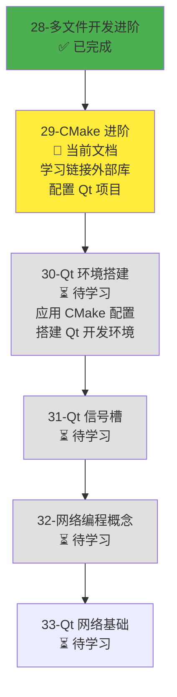
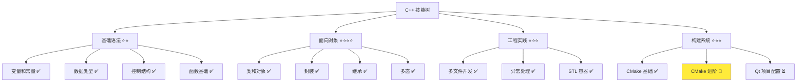
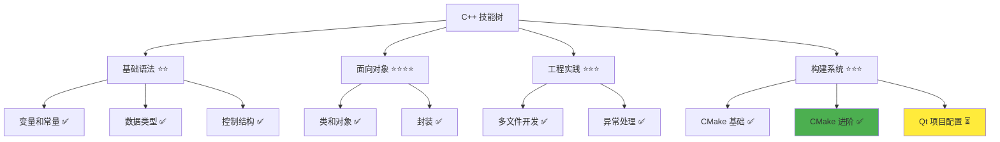

# CMake 进阶

> **学习目标**：掌握 CMake 链接外部库的方法，学会配置 Qt 项目，理解跨平台构建配置和依赖管理最佳实践，为后续 Qt 开发打下基础  
> **前置知识**：C++ 多文件开发基础、CMake 基础（项目配置、编译选项）  
> **预计时间**：90 分钟  
> **难度等级**：⭐⭐⭐  
> **技能收获**：CMake 链接外部库、find_package、Qt 项目配置、跨平台构建、依赖管理  
> **文档版本**：v1.0  
> **最后更新**：2025-11-17

📊 **难度等级说明**

| 等级           | 描述                       | 练习题数量     | 颜色码 |
| -------------- | -------------------------- | -------------- | ------ |
| **⭐**         | 入门级，零基础可学         | 5 题基础概念题 | 🟢绿   |
| **⭐⭐**       | 基础级，需要基本编程概念   | 5 题基础概念题 | 🟡黄   |
| **⭐⭐⭐**     | 中级，需要相关技术基础     | 3 题代码分析题 | 🟠橙   |
| **⭐⭐⭐⭐**   | 高级，需要扎实的技术功底   | 3 题代码分析题 | 🔴红   |
| **⭐⭐⭐⭐⭐** | 专家级，需要丰富的项目经验 | 2 题设计思考题 | 🟣紫   |

## 1. 学习目标

### 1.1 学习动机

- **实际需求**：开发 Qt 应用程序需要使用 Qt 库，但 Qt 库不是 C++ 标准库的一部分，需要通过 CMake 链接外部库。理解 CMake 链接外部库的方法是使用 Qt 开发的前提
- **应用场景**：Qt 项目开发、链接第三方库、跨平台构建、大型项目管理
- **技能价值**：学会后能配置 Qt 项目，链接外部库，实现跨平台构建，提高开发效率
- **数据支持**：CMake 是现代 C++ 项目的主流构建工具，掌握 CMake 链接外部库是开发 Qt 应用的必备技能

### 1.1.1 为什么先学 CMake 进阶？

**学习路径设计**：

在学习 Qt 开发之前，我们先学习 CMake 链接外部库的方法。这样做的原因：

1. **配置 Qt 项目**：Qt 项目需要通过 CMake 链接 Qt 库，必须先掌握 CMake 链接外部库的方法
2. **理解依赖管理**：理解如何查找和链接外部库，才能正确配置 Qt 项目
3. **跨平台构建**：CMake 支持跨平台构建，学会后可以在不同平台上构建 Qt 项目
4. **项目实践**：实际项目中经常需要链接外部库，掌握 CMake 链接方法是必备技能

**学习路径安排**：



**为什么不在本章直接学习 Qt 开发？**

- ❌ **缺少前置知识**：Qt 开发需要 Qt 环境搭建和 Qt 信号槽机制
- ❌ **理解困难**：没有 CMake 链接外部库的基础，无法理解 Qt 项目配置
- ✅ **循序渐进**：先学习 CMake 链接外部库，再学习 Qt 环境搭建，最后学习 Qt 开发

**本章的学习重点**：

- ✅ **链接外部库**：使用 `find_package` 查找外部库
- ✅ **Qt 项目配置**：配置 Qt6::Core、Qt6::Network 等模块
- ✅ **跨平台构建**：理解跨平台构建配置
- ✅ **依赖管理**：理解依赖管理最佳实践

> **类比**：就像建房子，先学会如何连接水电（CMake 链接外部库），再学会如何安装电器（Qt 环境搭建），最后学会如何使用电器（Qt 开发）。如果直接学使用电器，不知道如何连接水电，无法正常工作。

### 1.2 技能树位置



> **图表说明**：C++ 技能树结构图，当前文档点亮 CMake 进阶技能点，为后续 Qt 项目配置做准备

### 1.3 前置知识检查

在开始学习之前，请确认你已经掌握：

- [ ] C++ 多文件开发基础（头文件、源文件分离、编译链接）
- [ ] CMake 基础（CMakeLists.txt 基本语法、项目配置、编译选项）
- [ ] 基本的命令行操作（mkdir、cd、cmake、make）

> **未掌握处理**：若未通过，请先复习 [多文件开发基础](./24-multi-file-basics.md)

## 2. 核心内容

### 2.1 快速体验：为什么要用 CMake 链接外部库？

#### 2.1.1 实际问题场景（全局视野）

**场景**：开发 Qt 聊天软件，需要使用 Qt 库的网络功能

**问题 1：Qt 库不是 C++ 标准库**

- C++ 标准库没有网络编程功能
- Qt 库提供了 `QUdpSocket`、`QTcpSocket` 等网络类
- 但 Qt 库需要单独安装和链接

**问题 2：不同平台路径不同**

- Windows：`C:\Qt\6.12.0\msvc2019_64\lib\cmake\Qt6`
- macOS：`/opt/homebrew/lib/cmake/Qt6` 或 `/usr/local/Qt6/lib/cmake/Qt6`
- Linux：`/usr/lib/x86_64-linux-gnu/cmake/Qt6`

**问题 3：手动配置困难**

- 需要手动查找库的位置
- 需要手动指定头文件路径和库文件路径
- 库更新后需要修改配置
- 跨平台需要为每个平台编写不同的配置

**解决方案：使用 CMake 的 `find_package`**

- ✅ 自动查找库的位置（不需要手动指定路径）
- ✅ 跨平台支持（一套配置，多平台使用）
- ✅ 自动处理头文件路径和库文件路径
- ✅ 维护简单（库更新后不需要修改配置）

> **全局视野**：CMake 链接外部库就像"自动连接水电"，告诉 CMake"我需要 Qt 库"，CMake 会自动找到并连接，不需要知道具体位置。这样一套配置可以在 Windows、macOS、Linux 上使用，大大简化了项目配置。

#### 2.1.2 传统方式 vs 现代方式对比

**传统方式（手动配置）**：

```cmake
# ❌ 不推荐：手动指定路径
include_directories(/usr/local/Qt6/include)
link_directories(/usr/local/Qt6/lib)
target_link_libraries(myapp Qt6Core Qt6Network)
```

**问题**：

- ❌ 路径硬编码，不同平台路径不同
- ❌ 需要手动查找库的位置
- ❌ 跨平台困难，Windows/macOS/Linux 路径不同
- ❌ 维护困难，库更新后需要修改路径

**现代方式（使用 find_package）**：

```cmake
# ✅ 推荐：自动查找和配置
find_package(Qt6 REQUIRED COMPONENTS Core Network)
target_link_libraries(myapp Qt6::Core Qt6::Network)
```

**优势**：

- ✅ 自动查找库的位置，不需要手动指定路径
- ✅ 跨平台支持，CMake 自动处理不同平台的路径
- ✅ 维护简单，库更新后不需要修改配置
- ✅ 依赖检查，如果找不到库会报错

> **类比**：传统方式就像手动找水电接口，需要知道具体位置；现代方式就像告诉物业"我需要水电"，物业会自动帮你连接。一套配置可以在不同地方（平台）使用。

### 2.2 快速体验：配置一个简单的 Qt 项目

让我们先快速体验一下，看看 CMake 如何配置 Qt 项目。这样你就能快速建立全貌，理解 CMake 的作用。

#### 2.2.1 项目结构

**创建项目目录**：

```bash
mkdir my-qt-app
cd my-qt-app
mkdir src
```

**项目目录结构**：

```
my-qt-app/
├── CMakeLists.txt
└── src/
    └── main.cpp
```

#### 2.2.2 编写 CMakeLists.txt

**创建 `CMakeLists.txt`**：

```cmake
cmake_minimum_required(VERSION 3.20)

project(MyQtApp VERSION 1.0.0 LANGUAGES CXX)

# 基本配置
set(CMAKE_CXX_STANDARD 17)
set(CMAKE_CXX_STANDARD_REQUIRED ON)

# 生成 compile_commands.json（用于 IntelliSense/clangd）
set(CMAKE_EXPORT_COMPILE_COMMANDS ON)

# 查找 Qt6（自动查找库的位置）
# 注意：如果系统安装的 Qt6 版本低于 6.12，可以移除版本要求或降低版本要求
# 例如：find_package(Qt6 REQUIRED COMPONENTS Core Network)  # 使用任何可用版本
# 或者：find_package(Qt6 6.9 REQUIRED COMPONENTS Core Network)  # 要求最低 6.9
find_package(Qt6 REQUIRED COMPONENTS Core Network)

# Qt 自动处理（自动处理 MOC、UIC、RCC 工具）
set(CMAKE_AUTOMOC ON)
set(CMAKE_AUTOUIC ON)
set(CMAKE_AUTORCC ON)

# 源文件
set(SOURCES
    src/main.cpp
)

# 创建可执行文件
add_executable(${PROJECT_NAME} ${SOURCES})

# 链接 Qt6 模块（自动处理头文件路径和库文件路径）
target_link_libraries(${PROJECT_NAME}
    Qt6::Core
    Qt6::Network
)
```

**关键点说明**（先理解整体，细节后面展开）：

1. **`CMAKE_EXPORT_COMPILE_COMMANDS ON`**：生成 `compile_commands.json` 文件，用于 `IntelliSense/clangd` 代码补全和错误检查
2. **`find_package(Qt6 ...)`**：告诉 CMake"我需要 Qt6 库"，CMake 会自动查找。注意：如果系统 Qt6 版本较低，可以移除版本要求（如示例中的注释说明）
3. **`target_link_libraries(... Qt6::Core Qt6::Network)`**：告诉 CMake"把这些库连接到我的项目"
4. **`CMAKE_AUTOMOC ON`**：自动处理 Qt 的特殊文件（信号槽等）

#### 2.2.3 编写简单的 Qt 程序

**创建 `src/main.cpp`**：

```cpp
#include <QtCore/QCoreApplication>
#include <QtCore/QDebug>

int main(int argc, char *argv[]) {
    QCoreApplication app(argc, argv);

    qDebug() << "Hello from Qt6!";
    qDebug() << "Qt Version:" << QT_VERSION_STR;

    return 0;
}
```

**说明**：

- 这是一个最简单的 Qt 控制台程序
- 使用 `QCoreApplication`（不需要 GUI）
- 使用 `qDebug()` 输出信息
- 实际 Qt 开发会在后续文档中学习

#### 2.2.4 构建和运行

**构建步骤**：

```bash
# 1. 创建构建目录
mkdir build
cd build

# 2. 配置项目（CMake 会自动查找 Qt6）
cmake ..

# 3. 编译项目
cmake --build .

# 4. 运行程序（macOS/Linux）
./MyQtApp

# Windows
.\MyQtApp.exe
```

**预期输出**：

```
Hello from Qt6!
Qt Version: 6.12.0
```

**如果找不到 Qt6**：

```
CMake Error at CMakeLists.txt:16 (find_package):
  Could not find a package configuration file provided by "Qt6" with any of
  the following names:
    Qt6Config.cmake
    qt6-config.cmake
```

**解决方法**：Qt6 的安装将在后续文档（30-qt-environment-setup.md）中学习。现在先理解 CMake 的配置方法。

> **快速体验总结**：通过这个简单的例子，你应该理解了：
>
> - CMake 如何查找外部库（`find_package`）
> - CMake 如何链接外部库（`target_link_libraries`）
> - CMake 如何自动处理 Qt 的特殊文件（`CMAKE_AUTOMOC`）
> - 一套配置可以在不同平台上使用（跨平台）

### 2.3 在 Cursor 中调试 CMake 项目

#### 2.3.1 为什么需要配置 Cursor 调试？

**问题**：CMake 项目需要先配置和编译，然后才能调试

**传统方式**：

- 手动运行 `cmake ..` 配置项目
- 手动运行 `cmake --build .` 编译项目
- 手动运行程序调试

**问题**：

- ❌ 步骤繁琐，需要多次手动操作
- ❌ 无法使用断点调试
- ❌ 无法查看变量值
- ❌ 调试效率低

**解决方案**：配置 Cursor 的 `tasks.json` 和 `launch.json`，实现一键编译和调试

#### 2.3.2 配置智能构建任务（推荐方式）

**智能构建的优势**：

- ✅ **自动检测**：自动检测当前目录是否有 CMakeLists.txt
- ✅ **统一配置**：CMake 项目和普通项目使用同一套配置
- ✅ **动态路径**：自动查找 CMake 项目根目录，不需要硬编码路径
- ✅ **跨项目支持**：适用于项目中的任何 CMake 项目

**创建 `.vscode/build-smart.sh`**（智能构建脚本）：

```bash
#!/bin/bash
# 智能构建脚本：自动检测 CMakeLists.txt 并使用 CMake 或普通编译

set +f

# 获取工作区根目录（假设脚本在 .vscode 目录下）
SCRIPT_DIR="$(cd "$(dirname "${BASH_SOURCE[0]}")" && pwd)"
WORKSPACE_ROOT="$(cd "$SCRIPT_DIR/.." && pwd)"

FILE_DIR="$1"
if [ -z "$FILE_DIR" ]; then
    echo "[ERROR] File directory not provided"
    exit 1
fi

# 向上查找 CMakeLists.txt
CMAKEDIR="$FILE_DIR"
while [ ! -f "$CMAKEDIR/CMakeLists.txt" ] && [ "$CMAKEDIR" != "/" ]; do
    CMAKEDIR="$(dirname "$CMAKEDIR")"
done

if [ -f "$CMAKEDIR/CMakeLists.txt" ]; then
    echo "[CMake] Found CMakeLists.txt: $CMAKEDIR/CMakeLists.txt"
    echo "[CMake] Configuring..."

    if ! cmake -S "$CMAKEDIR" -B "$CMAKEDIR/build" -DCMAKE_BUILD_TYPE=Debug; then
        echo "[ERROR] CMake configuration failed"
        exit 1
    fi

    echo "[CMake] Building..."
    if ! cmake --build "$CMAKEDIR/build"; then
        echo "[ERROR] CMake build failed"
        exit 1
    fi

    # 提取项目名称（支持带引号和不带引号的项目名）
    PROJNAME=$(grep -E '^project\(' "$CMAKEDIR/CMakeLists.txt" | head -1 | sed -E 's/^project\([[:space:]]*["'\'']?([^"'\'' ]+).*/\1/')

    if [ -z "$PROJNAME" ]; then
        echo "[ERROR] Cannot extract project name from CMakeLists.txt"
        exit 1
    fi

    # 创建符号链接（支持 Unix 和 Windows 可执行文件）
    EXECUTABLE=""
    SYMLINK=""
    if [ -f "$CMAKEDIR/build/$PROJNAME" ]; then
        EXECUTABLE="$PROJNAME"
        SYMLINK="cmake-app"
    elif [ -f "$CMAKEDIR/build/$PROJNAME.exe" ]; then
        EXECUTABLE="$PROJNAME.exe"
        SYMLINK="cmake-app.exe"
    else
        echo "[ERROR] Executable not found: $CMAKEDIR/build/$PROJNAME (or $PROJNAME.exe)"
        exit 1
    fi

    # 保存可执行文件名并创建符号链接
    echo "$EXECUTABLE" > "$CMAKEDIR/build/.executable_name"
    ln -sf "$EXECUTABLE" "$CMAKEDIR/build/$SYMLINK"
    # 创建符号链接到工作区根目录，供 launch.json 使用
    # 使用绝对路径确保符号链接正确
    CMAKE_BUILD_DIR_ABS="$(cd "$CMAKEDIR/build" && pwd)"
    mkdir -p "$WORKSPACE_ROOT/.vscode"
    ln -sfn "$CMAKE_BUILD_DIR_ABS" "$WORKSPACE_ROOT/.vscode/.cmake_build_dir"
    echo "[SUCCESS] Executable: $EXECUTABLE"
    echo "[SUCCESS] Build directory: $CMAKE_BUILD_DIR_ABS"
else
    echo "[INFO] CMakeLists.txt not found (searched up to: $CMAKEDIR), using direct compilation..."
    if ! clang++ -std=c++17 -g -Wall "$FILE_DIR"/*.cpp -o "$FILE_DIR/program"; then
        echo "[ERROR] Compilation failed"
        exit 1
    fi
    echo "[SUCCESS] Compiled: $FILE_DIR/program"
fi
```

**关键改进**：

- **符号链接机制**：脚本会在 CMake 项目的 `build` 目录创建 `cmake-app` 符号链接，同时在工作区根目录的 `.vscode/.cmake_build_dir` 创建指向实际构建目录的符号链接
- **动态路径解析**：使用绝对路径创建符号链接，确保在不同工作目录下都能正确工作
- **统一调试入口**：所有 CMake 项目的调试都通过 `.vscode/.cmake_build_dir/cmake-app` 统一入口，简化 `launch.json` 配置

**创建 `.vscode/tasks.json`**（在项目根目录）：

```json
{
  "version": "2.0.0",
  "tasks": [
    {
      "label": "build-smart",
      "type": "shell",
      "command": "${workspaceFolder}/.vscode/build-smart.sh",
      "args": ["${fileDirname}"],
      "group": {
        "kind": "build",
        "isDefault": true
      },
      "presentation": {
        "echo": true,
        "reveal": "always",
        "focus": false,
        "panel": "shared"
      },
      "problemMatcher": ["$gcc"],
      "detail": "智能构建：自动向上查找 CMakeLists.txt，有则用 CMake，无则用普通编译（默认任务）"
    }
  ]
}
```

**说明**：

- **build-smart**：智能构建任务，自动检测 CMake 项目或普通项目
- **自动检测**：向上查找 CMakeLists.txt，找到则使用 CMake，否则使用普通编译
- **符号链接**：CMake 项目会自动创建 `cmake-app` 符号链接，方便调试
- **isDefault**：按 `Cmd+Shift+B` 时执行这个任务

**使用方法**：

- 按 `Cmd+Shift+B`：自动检测项目类型并构建
  - 如果是 CMake 项目：自动配置并编译
  - 如果是普通项目：直接编译所有 .cpp 文件

#### 2.3.3 配置 launch.json（调试任务）

**创建 `.vscode/launch.json`**（在项目根目录）：

```json
{
  "version": "0.2.0",
  "configurations": [
    {
      "name": "Debug CMake Project (Current Dir)",
      "type": "lldb",
      "request": "launch",
      "program": "${workspaceFolder}/.vscode/.cmake_build_dir/cmake-app",
      "args": [],
      "cwd": "${workspaceFolder}/.vscode/.cmake_build_dir",
      "preLaunchTask": "build-smart",
      "stopOnEntry": false,
      "console": "integratedTerminal"
    }
  ]
}
```

**说明**：

- **program**：使用 `build-smart` 创建的符号链接 `${workspaceFolder}/.vscode/.cmake_build_dir/cmake-app`，统一指向当前构建的 CMake 项目可执行文件
- **cwd**：工作目录设置为 `${workspaceFolder}/.vscode/.cmake_build_dir`，确保程序在正确的目录下运行
- **preLaunchTask**：调试前自动执行 `build-smart` 任务（自动检测并构建）
- **stopOnEntry**：是否在程序入口处停止（false 表示不停止）
- **console**：使用集成终端运行程序（输出显示在 Cursor 内部）
- **统一入口**：所有 CMake 项目都通过 `.vscode/.cmake_build_dir/cmake-app` 统一入口，`build-smart.sh` 会自动更新这个符号链接指向当前构建的项目

**优势**：

- ✅ **通用配置**：适用于项目中的任何 CMake 项目，不需要为每个项目单独配置
- ✅ **自动检测**：自动检测 CMake 项目并构建
- ✅ **统一体验**：所有调试配置使用相同的终端类型

**使用方法**：

- 按 `F5`：自动检测项目类型、构建并启动调试
- 设置断点：在代码行号左侧点击，出现红色圆点
- 调试控制：`F5`（继续）、`F10`（单步跳过）、`F11`（单步进入）

#### 2.3.4 完整工作流程

**开发流程**：

1. **编写代码**：在 `src/main.cpp` 中编写代码
2. **设置断点**：在需要调试的行设置断点
3. **启动调试**：按 `F5`，Cursor 会自动：
   - 运行 `build-smart`（自动检测 CMake 项目并构建）
   - 启动调试器
   - 程序在断点处停止
4. **调试**：使用 `F5`、`F10`、`F11` 控制程序执行，查看变量值

**优势**：

- ✅ **一键编译和调试**：不需要手动操作，自动检测项目类型
- ✅ **通用配置**：适用于所有 CMake 项目，不需要为每个项目单独配置
- ✅ **支持断点调试**：可以查看变量值
- ✅ **支持单步执行**：可以跟踪程序执行流程
- ✅ **提高开发效率**：减少配置时间，专注于开发

**配置位置**：

- **项目根目录**：`.vscode/tasks.json` 和 `.vscode/launch.json`（推荐）
- **项目子目录**：也可以在每个项目子目录创建 `.vscode/` 配置（不推荐，维护成本高）

#### 2.3.5 配置 IntelliSense 支持（可选但推荐）

**问题**：删除 `build` 目录后，`compile_commands.json` 也会被删除，IntelliSense/clangd 可能无法正确解析 Qt 代码

**解决方案**：创建 `.clangd` 配置文件，提供 Qt 框架的编译标志

**创建 `.clangd`**（在项目根目录）：

```yaml
CompileFlags:
  Add:
    - -std=c++17
    - -I/usr/local/lib/QtCore.framework/Headers
    - -I/usr/local/lib/QtNetwork.framework/Headers
    - -I/usr/local/lib/QtGui.framework/Headers
    - -I/usr/local/lib/QtWidgets.framework/Headers
    - -I/usr/local/opt/qt/lib/QtCore.framework/Headers
    - -I/usr/local/opt/qt/lib/QtNetwork.framework/Headers
    - -I/usr/local/opt/qt/lib/QtGui.framework/Headers
    - -I/usr/local/opt/qt/lib/QtWidgets.framework/Headers
    - -iframework
    - /usr/local/lib
    - -iframework
    - /usr/local/opt/qt/lib
    - -DQT_CORE_LIB
    - -DQT_NETWORK_LIB
    - -DQT_VERSION=0x060900
    - -DQT_VERSION_STR="6.9.0"
    - -D__APPLE__
  Remove:
    - -W*

Diagnostics:
  UnusedIncludes: None
  MissingIncludes: None

Index:
  Background: Build
```

**说明**：

- **作用**：当 `compile_commands.json` 不存在时，clangd 会使用 `.clangd` 中的编译标志来解析代码
- **Qt 路径**：配置了常见的 Qt 安装路径（macOS），确保 IntelliSense 能找到 Qt 头文件
- **宏定义**：定义了 Qt 相关的宏，确保代码补全和错误检查正常工作
- **诊断配置**：禁用了一些不必要的警告（未使用的头文件、缺失的头文件），减少干扰

**注意**：`.clangd` 中的路径是 macOS 的常见路径。如果 Qt 安装在其他位置，需要相应调整路径。CMake 生成的 `compile_commands.json` 优先级更高，如果存在会优先使用。

> **类比**：配置 Cursor 调试就像给房子安装智能控制系统，一键启动所有功能（自动检测、配置、编译、调试），不需要手动操作每个步骤，而且适用于所有房间（项目）。`.clangd` 就像备用电源，即使主电源（`compile_commands.json`）断开，也能保证基本功能（代码补全）正常工作。

#### 2.3.6 配套代码文件和配置

**项目位置**：`src/stage1/29-cmake-advanced/01-quick-start/`

**文件结构**：

```ini
项目根目录/
├── .clangd                         # clangd 配置（IntelliSense 支持）
├── .vscode/                        # 统一配置（推荐）
│   ├── build-smart.sh              # 智能构建脚本
│   ├── tasks.json                  # 构建任务配置
│   ├── launch.json                 # 调试配置
│   └── .cmake_build_dir/           # 符号链接（自动创建，指向当前构建目录）
│       └── cmake-app               # 符号链接（指向实际可执行文件）
└── src/stage1/29-cmake-advanced/01-quick-start/
    ├── CMakeLists.txt
    ├── build/                       # CMake 构建目录（自动创建）
    │   └── cmake-app               # 符号链接（指向实际可执行文件）
    └── src/
        └── main.cpp
```

**配置说明**：

- **统一配置**：`.vscode/` 配置放在项目根目录，所有子项目共享
- **智能构建**：`build-smart.sh` 自动检测 CMake 项目或普通项目
- **通用调试**：`Debug CMake Project (Current Dir)` 适用于所有 CMake 项目
- **符号链接机制**：`build-smart.sh` 会在 `.vscode/.cmake_build_dir` 创建指向当前构建目录的符号链接，`launch.json` 通过这个统一入口调试
- **IntelliSense 支持**：`.clangd` 提供 Qt 框架的编译标志，确保即使没有 `compile_commands.json` 也能正确解析代码

**使用方法**：

1. **构建项目**：打开 `src/main.cpp`，按 `Cmd+Shift+B` 构建
2. **调试项目**：打开 `src/main.cpp`，按 `F5` 启动调试
3. **设置断点**：在代码行号左侧点击设置断点

> **运行提示**：具体的编译运行方法请参考上面的"构建和运行"部分，或使用 Cursor 的调试功能（按 `F5`）。配置已优化为智能检测，适用于项目中的所有 CMake 项目。

### 2.4 深入理解：find_package 详解

现在你已经快速体验了 CMake 配置 Qt 项目的过程，理解了整体流程。接下来我们深入理解每个部分的细节。

#### 2.4.1 find_package 基本语法

**find_package 语法**：

```cmake
find_package(包名 [REQUIRED] [COMPONENTS 组件1 组件2 ...])
```

**参数说明**：

- **包名**：要查找的库名称（如 `Qt6`、`Boost`、`OpenCV`）
- **REQUIRED**：可选，如果找不到库，CMake 会报错并停止配置
- **COMPONENTS**：可选，指定需要的库组件（如 `Core`、`Network`）

**示例**：

```cmake
# 查找 Qt6，需要 Core 和 Network 模块
find_package(Qt6 REQUIRED COMPONENTS Core Network)

# 查找 Boost，需要 filesystem 和 system 组件
find_package(Boost REQUIRED COMPONENTS filesystem system)
```

> **类比**：`find_package` 就像告诉 CMake"我需要 Qt6 库的 Core 和 Network 模块"，CMake 会自动查找并配置。

#### 2.4.2 find_package 工作原理

**find_package 的工作流程**：

1. **查找配置文件**：CMake 会在系统路径中查找 `<包名>Config.cmake` 或 `Find<包名>.cmake` 文件
2. **加载配置**：找到配置文件后，加载库的配置信息（头文件路径、库文件路径、编译选项等）
3. **设置变量**：设置 `<包名>_FOUND`、`<包名>_INCLUDE_DIRS`、`<包名>_LIBRARIES` 等变量
4. **创建目标**：现代 CMake（3.0+）会创建 `<包名>::<组件>` 目标，可以直接链接

**Qt6 的 find_package**：

```cmake
find_package(Qt6 REQUIRED COMPONENTS Core Network)
```

**执行后**：

- ✅ 设置 `Qt6_FOUND = TRUE`
- ✅ 创建 `Qt6::Core` 和 `Qt6::Network` 目标
- ✅ 自动设置头文件路径和库文件路径
- ✅ 自动处理编译选项和链接选项

> **类比**：`find_package` 就像自动查找水电接口，找到后自动连接，不需要手动操作。

#### 2.4.3 检查库是否找到

**检查方法**：

```cmake
find_package(Qt6 REQUIRED COMPONENTS Core Network)

if(Qt6_FOUND)
    message(STATUS "Qt6 found: ${Qt6_VERSION}")
    message(STATUS "Qt6 Core: ${Qt6Core_VERSION}")
    message(STATUS "Qt6 Network: ${Qt6Network_VERSION}")
else()
    message(FATAL_ERROR "Qt6 not found!")
endif()
```

**使用 REQUIRED**：

```cmake
# 如果找不到库，CMake 会报错并停止配置
find_package(Qt6 REQUIRED COMPONENTS Core Network)
```

> **类比**：检查库是否找到就像检查水电是否连接成功，如果连接失败（REQUIRED），就不能继续建房子（配置失败）。

### 2.5 深入理解：Qt 项目配置详解

#### 2.5.1 Qt6 模块介绍

**Qt6 模块**：Qt6 库分为多个模块，每个模块提供不同的功能

**常用 Qt6 模块**：

| 模块名称         | 功能说明                            | 使用场景           |
| ---------------- | ----------------------------------- | ------------------ |
| **Qt6::Core**    | Qt 核心功能（字符串、容器、信号槽） | 所有 Qt 项目都需要 |
| **Qt6::Network** | 网络编程（QUdpSocket、QTcpSocket）  | 网络通信、聊天软件 |
| **Qt6::Widgets** | GUI 界面（窗口、按钮、文本框）      | 桌面应用程序       |
| **Qt6::Gui**     | 图形界面基础（绘图、字体）          | GUI 应用程序       |
| **Qt6::Test**    | 单元测试框架                        | 测试代码           |

> **类比**：Qt6 模块就像房子的不同功能模块，Core 像基础设施（水电），Network 像网络功能（WiFi），Widgets 像装修（门窗）。

#### 2.5.2 配置 Qt6 项目

**基本配置**：

```cmake
cmake_minimum_required(VERSION 3.20)

project(MyQtApp VERSION 1.0.0 LANGUAGES CXX)

# 设置 C++ 标准
set(CMAKE_CXX_STANDARD 17)
set(CMAKE_CXX_STANDARD_REQUIRED ON)

# 查找 Qt6（需要 Core 和 Network 模块）
find_package(Qt6 REQUIRED COMPONENTS Core Network)

# 启用自动处理 Qt 的 MOC、UIC、RCC 工具
set(CMAKE_AUTOMOC ON)
set(CMAKE_AUTOUIC ON)
set(CMAKE_AUTORCC ON)

# 源文件
set(SOURCES
    src/main.cpp
    src/network_manager.cpp
)

# 创建可执行文件
add_executable(${PROJECT_NAME} ${SOURCES})

# 链接 Qt6 模块
target_link_libraries(${PROJECT_NAME}
    Qt6::Core
    Qt6::Network
)
```

**关键配置说明**：

1. **find_package(Qt6 REQUIRED COMPONENTS Core Network)**：
   - 查找 Qt6 库，需要 Core 和 Network 模块
   - `REQUIRED` 表示如果找不到库，CMake 会报错

2. **CMAKE_AUTOMOC ON**：
   - 自动处理 Qt 的 MOC（Meta-Object Compiler）工具
   - 用于处理信号槽、属性等 Qt 特性

3. **CMAKE_AUTOUIC ON**：
   - 自动处理 Qt 的 UIC（User Interface Compiler）工具
   - 用于处理 .ui 文件（界面设计文件）

4. **CMAKE_AUTORCC ON**：
   - 自动处理 Qt 的 RCC（Resource Compiler）工具
   - 用于处理 .qrc 文件（资源文件）

5. **target_link_libraries**：
   - 链接 Qt6::Core 和 Qt6::Network 模块
   - 使用 `Qt6::Core` 格式（现代 CMake 推荐）

> **类比**：配置 Qt6 项目就像配置房子的功能模块，需要哪个功能就连接哪个模块，CMake 会自动处理连接细节。

#### 2.5.3 Qt6 模块的链接方式

**现代 CMake 方式（推荐）**：

```cmake
target_link_libraries(${PROJECT_NAME}
    Qt6::Core
    Qt6::Network
)
```

**优势**：

- ✅ 自动处理头文件路径
- ✅ 自动处理库文件路径
- ✅ 自动处理编译选项
- ✅ 跨平台支持

**传统方式（不推荐）**：

```cmake
# 不推荐：手动指定路径
include_directories(${Qt6_INCLUDE_DIRS})
link_directories(${Qt6_LIBRARY_DIRS})
target_link_libraries(${PROJECT_NAME} ${Qt6_LIBRARIES})
```

**问题**：

- ❌ 需要手动处理路径
- ❌ 跨平台困难
- ❌ 维护困难

> **类比**：现代方式就像自动连接水电，传统方式就像手动连接，需要知道每个接口的位置。

### 2.6 深入理解：跨平台构建配置

#### 2.6.1 平台检测

**检测平台**：

```cmake
# 检测操作系统
if(WIN32)
    message(STATUS "Platform: Windows")
elseif(APPLE)
    message(STATUS "Platform: macOS")
elseif(UNIX)
    message(STATUS "Platform: Linux")
endif()
```

**平台特定配置**：

```cmake
# Windows 特定配置
if(WIN32)
    set(CMAKE_CXX_FLAGS "${CMAKE_CXX_FLAGS} /W4")
endif()

# macOS 特定配置
if(APPLE)
    set(CMAKE_CXX_FLAGS "${CMAKE_CXX_FLAGS} -Wall -Wextra")
endif()

# Linux 特定配置
if(UNIX AND NOT APPLE)
    set(CMAKE_CXX_FLAGS "${CMAKE_CXX_FLAGS} -Wall -Wextra -pedantic")
endif()
```

> **类比**：平台检测就像检测房子的类型（公寓、别墅、平房），不同类型的房子需要不同的配置。

#### 2.6.2 Qt6 路径配置

**设置 Qt6 路径（可选）**：

```cmake
# 方法 1：通过环境变量（推荐）
# 设置环境变量：export Qt6_DIR=/path/to/Qt6/lib/cmake/Qt6

# 方法 2：通过 CMake 变量
set(Qt6_DIR "/path/to/Qt6/lib/cmake/Qt6")

# 方法 3：通过命令行参数
# cmake -DQt6_DIR=/path/to/Qt6/lib/cmake/Qt6 ..
```

**自动查找（推荐）**：

```cmake
# CMake 会自动在系统路径中查找 Qt6
find_package(Qt6 REQUIRED COMPONENTS Core Network)
```

> **类比**：设置 Qt6 路径就像告诉物业"水电接口在哪里"，如果不告诉，物业会自动查找。

#### 2.6.3 跨平台构建最佳实践

**最佳实践**：

1. **使用 find_package**：让 CMake 自动查找库，不要手动指定路径
2. **使用现代 CMake 语法**：使用 `Qt6::Core` 格式，不要使用变量
3. **避免硬编码路径**：不要硬编码库路径，使用环境变量或 CMake 变量
4. **测试不同平台**：在不同平台上测试构建配置

**示例**：

```cmake
cmake_minimum_required(VERSION 3.20)

project(MyQtApp VERSION 1.0.0 LANGUAGES CXX)

set(CMAKE_CXX_STANDARD 17)
set(CMAKE_CXX_STANDARD_REQUIRED ON)

# 跨平台：自动查找 Qt6
find_package(Qt6 REQUIRED COMPONENTS Core Network)

# 跨平台：自动处理 Qt 工具
set(CMAKE_AUTOMOC ON)
set(CMAKE_AUTOUIC ON)
set(CMAKE_AUTORCC ON)

add_executable(${PROJECT_NAME} src/main.cpp)

# 跨平台：使用现代 CMake 语法
target_link_libraries(${PROJECT_NAME}
    Qt6::Core
    Qt6::Network
)
```

> **类比**：跨平台构建就像建房子的通用设计，可以在不同地方（平台）使用相同的设计（配置）。

### 2.7 深入理解：依赖管理最佳实践

#### 2.7.1 依赖管理原则

**原则 1：明确依赖**：

```cmake
# ✅ 明确指定需要的模块
find_package(Qt6 REQUIRED COMPONENTS Core Network)

# ❌ 不推荐：链接所有模块
find_package(Qt6 REQUIRED)
target_link_libraries(${PROJECT_NAME} Qt6::Core Qt6::Network Qt6::Widgets Qt6::Gui)
```

**原则 2：版本控制**：

```cmake
# 方式 1：指定最低版本（适合需要特定版本的项目）
find_package(Qt6 6.12 REQUIRED COMPONENTS Core Network)

# 方式 2：不指定版本（更灵活，适合兼容不同版本）
# 如果系统安装的 Qt6 版本较低，可以移除版本要求或降低版本要求
find_package(Qt6 REQUIRED COMPONENTS Core Network)

# 方式 3：指定较低的最低版本（平衡灵活性和版本要求）
find_package(Qt6 6.9 REQUIRED COMPONENTS Core Network)
```

**选择建议**：

- **指定版本**：适合需要特定功能或确保版本一致性的项目
- **不指定版本**：适合需要兼容不同版本的项目（如示例项目）
- **指定最低版本**：平衡灵活性和版本要求

**原则 3：错误处理**：

```cmake
# ✅ 使用 REQUIRED 确保依赖存在
find_package(Qt6 REQUIRED COMPONENTS Core Network)

# ❌ 不推荐：不检查依赖是否存在
find_package(Qt6 COMPONENTS Core Network)
```

> **类比**：依赖管理就像管理房子的设备清单，需要明确列出需要的设备（模块），检查设备是否齐全（REQUIRED），记录设备版本（版本控制）。

#### 2.7.2 CMakeLists.txt 组织结构

**推荐结构**：

```cmake
cmake_minimum_required(VERSION 3.20)

project(MyQtApp VERSION 1.0.0 LANGUAGES CXX)

# ============================================
# 1. 基本配置
# ============================================
set(CMAKE_CXX_STANDARD 17)
set(CMAKE_CXX_STANDARD_REQUIRED ON)

# ============================================
# 2. 查找依赖
# ============================================
# 注意：示例中使用版本要求，实际项目可根据需要选择是否指定版本
find_package(Qt6 6.12 REQUIRED COMPONENTS Core Network)

# ============================================
# 3. Qt 配置
# ============================================
set(CMAKE_AUTOMOC ON)
set(CMAKE_AUTOUIC ON)
set(CMAKE_AUTORCC ON)

# ============================================
# 4. 源文件
# ============================================
set(SOURCES
    src/main.cpp
    src/network_manager.cpp
)

# ============================================
# 5. 创建目标
# ============================================
add_executable(${PROJECT_NAME} ${SOURCES})

# ============================================
# 6. 链接库
# ============================================
target_link_libraries(${PROJECT_NAME}
    Qt6::Core
    Qt6::Network
)
```

**优势**：

- ✅ 结构清晰，易于理解
- ✅ 易于维护，修改方便
- ✅ 易于扩展，添加新功能方便

> **类比**：CMakeLists.txt 组织结构就像房子的设计图纸，分区域标注（基本配置、依赖、源文件等），清晰明了。

## 3. 实践应用

### 3.1 项目场景

在 QtLanChat 项目中，CMake 进阶知识用于：

- **配置 Qt 项目**：使用 `find_package(Qt6)` 查找 Qt6 库
- **链接 Qt 模块**：链接 `Qt6::Core` 和 `Qt6::Network` 模块
- **跨平台构建**：在不同平台上构建项目（Windows/macOS/Linux）
- **依赖管理**：管理项目依赖，确保依赖正确配置

### 3.2 实际应用示例

**QtLanChat 项目的 CMakeLists.txt**：

```cmake
cmake_minimum_required(VERSION 3.20)

project(QtLanChat-FeiQClone VERSION 1.0.0 LANGUAGES CXX)

# 基本配置
set(CMAKE_CXX_STANDARD 17)
set(CMAKE_CXX_STANDARD_REQUIRED ON)

# 生成 compile_commands.json（用于 IntelliSense/clangd）
set(CMAKE_EXPORT_COMPILE_COMMANDS ON)

# 查找 Qt6（需要 Core 和 Network 模块）
# 注意：不指定版本要求，兼容不同版本的 Qt6
find_package(Qt6 REQUIRED COMPONENTS Core Network)

# Qt 自动处理
set(CMAKE_AUTOMOC ON)
set(CMAKE_AUTOUIC ON)
set(CMAKE_AUTORCC ON)

# 源文件
set(SOURCES
    src/main.cpp
    src/network_manager.cpp
    src/chat_client.cpp
)

# 创建可执行文件
add_executable(${PROJECT_NAME} ${SOURCES})

# 链接 Qt6 模块
target_link_libraries(${PROJECT_NAME}
    Qt6::Core
    Qt6::Network
)
```

### 3.3 设计思路

**为什么这样配置**：

- **使用 find_package**：自动查找 Qt6，不需要手动指定路径
- **不指定版本**：更灵活，兼容不同版本的 Qt6（如果系统版本较低，不需要修改配置）
- **明确模块**：只链接需要的模块（Core、Network），减少依赖
- **跨平台支持**：CMake 自动处理不同平台的差异
- **生成 compile_commands.json**：便于 IntelliSense/clangd 代码补全和错误检查

## 4. 练习与测试

### 4.1 练习题

#### 练习 1：理解 find_package

**题目**：解释 `find_package(Qt6 REQUIRED COMPONENTS Core Network)` 的作用，并说明每个参数的含义。

**要求**：

- 解释 `find_package` 的作用
- 说明 `Qt6`、`REQUIRED`、`COMPONENTS`、`Core`、`Network` 的含义
- 说明为什么需要这个配置

**参考答案**：

`find_package(Qt6 REQUIRED COMPONENTS Core Network)` 的作用是查找并配置 Qt6 库。

**参数说明**：

- **Qt6**：要查找的库名称（Qt6 库）
- **REQUIRED**：如果找不到库，CMake 会报错并停止配置
- **COMPONENTS**：指定需要的库组件
- **Core**：Qt6 核心模块（所有 Qt 项目都需要）
- **Network**：Qt6 网络模块（用于网络编程）

**为什么需要**：Qt6 库不是 C++ 标准库的一部分，需要通过 CMake 查找和链接。`find_package` 会自动查找 Qt6 的安装位置，并配置头文件路径和库文件路径。

#### 练习 2：配置 Qt 项目

**题目**：编写一个 CMakeLists.txt，配置一个使用 Qt6::Core 和 Qt6::Network 的 Qt 项目。

**要求**：

- 设置 CMake 最低版本为 3.20
- 设置项目名称为 `MyQtApp`，版本为 1.0.0
- 设置 C++ 标准为 17
- 查找 Qt6，需要 Core 和 Network 模块
- 启用 Qt 自动处理（AUTOMOC、AUTOUIC、AUTORCC）
- 创建可执行文件，链接 Qt6::Core 和 Qt6::Network

**参考答案**：

```cmake
cmake_minimum_required(VERSION 3.20)

project(MyQtApp VERSION 1.0.0 LANGUAGES CXX)

# 基本配置
set(CMAKE_CXX_STANDARD 17)
set(CMAKE_CXX_STANDARD_REQUIRED ON)

# 查找 Qt6
find_package(Qt6 6.12 REQUIRED COMPONENTS Core Network)

# Qt 自动处理
set(CMAKE_AUTOMOC ON)
set(CMAKE_AUTOUIC ON)
set(CMAKE_AUTORCC ON)

# 源文件
set(SOURCES
    src/main.cpp
)

# 创建可执行文件
add_executable(${PROJECT_NAME} ${SOURCES})

# 链接 Qt6 模块
target_link_libraries(${PROJECT_NAME}
    Qt6::Core
    Qt6::Network
)
```

#### 练习 3：跨平台构建配置

**题目**：在 CMakeLists.txt 中添加平台检测代码，在不同平台上输出不同的信息。

**要求**：

- 检测 Windows、macOS、Linux 平台
- 在不同平台上输出不同的信息
- 说明跨平台构建的优势

**参考答案**：

```cmake
cmake_minimum_required(VERSION 3.20)

project(MyQtApp VERSION 1.0.0 LANGUAGES CXX)

# 平台检测
if(WIN32)
    message(STATUS "Platform: Windows")
    set(PLATFORM_NAME "Windows")
elseif(APPLE)
    message(STATUS "Platform: macOS")
    set(PLATFORM_NAME "macOS")
elseif(UNIX)
    message(STATUS "Platform: Linux")
    set(PLATFORM_NAME "Linux")
endif()

message(STATUS "Building for: ${PLATFORM_NAME}")

# 基本配置
set(CMAKE_CXX_STANDARD 17)
set(CMAKE_CXX_STANDARD_REQUIRED ON)

# 查找 Qt6（跨平台：自动查找）
find_package(Qt6 6.12 REQUIRED COMPONENTS Core Network)

# Qt 自动处理
set(CMAKE_AUTOMOC ON)
set(CMAKE_AUTOUIC ON)
set(CMAKE_AUTORCC ON)

# 源文件
set(SOURCES
    src/main.cpp
)

# 创建可执行文件
add_executable(${PROJECT_NAME} ${SOURCES})

# 链接 Qt6 模块（跨平台：使用现代 CMake 语法）
target_link_libraries(${PROJECT_NAME}
    Qt6::Core
    Qt6::Network
)
```

**跨平台构建的优势**：

- ✅ 一套配置，多平台使用
- ✅ 自动处理平台差异
- ✅ 减少维护成本
- ✅ 提高开发效率

### 4.2 测试题

1. **关于 find_package，下列说法正确的是：**
   A. find_package 用于查找 C++ 标准库

   B. find_package 用于查找外部库（如 Qt6），自动配置头文件路径和库文件路径

   C. find_package 只能查找 Qt6 库

   D. find_package 不需要 REQUIRED 参数

   **答案**：B

   **解析**：
   - A 错误：find_package 用于查找外部库，C++ 标准库不需要 find_package
   - B 正确：find_package 用于查找外部库，自动配置路径
   - C 错误：find_package 可以查找任何支持 CMake 的库（Qt6、Boost、OpenCV 等）
   - D 错误：REQUIRED 参数确保依赖存在，如果找不到库会报错

2. **关于 Qt6 模块，下列说法正确的是：**
   A. Qt6::Core 是可选模块，不是所有 Qt 项目都需要

   B. Qt6::Network 用于网络编程，提供 QUdpSocket 和 QTcpSocket

   C. 所有 Qt6 模块都必须链接，不能只链接需要的模块

   D. Qt6::Widgets 用于网络编程

   **答案**：B

   **解析**：
   - A 错误：Qt6::Core 是所有 Qt 项目的基础模块，必须链接
   - B 正确：Qt6::Network 提供网络编程功能，包括 QUdpSocket 和 QTcpSocket
   - C 错误：只需要链接需要的模块，不需要链接所有模块
   - D 错误：Qt6::Widgets 用于 GUI 界面，不是网络编程

3. **关于跨平台构建，下列说法正确的是：**
   A. 跨平台构建需要为每个平台编写不同的 CMakeLists.txt

   B. 使用 find_package 和现代 CMake 语法可以实现跨平台构建

   C. 跨平台构建需要手动指定每个平台的库路径

   D. CMake 不支持跨平台构建

   **答案**：B

   **解析**：
   - A 错误：使用现代 CMake 语法，一套配置可以用于多个平台
   - B 正确：find_package 和现代 CMake 语法（如 `Qt6::Core`）支持跨平台构建
   - C 错误：find_package 自动查找库路径，不需要手动指定
   - D 错误：CMake 是跨平台构建工具，支持 Windows、macOS、Linux

### 4.3 常见问题 FAQ

- **Q1：find_package 找不到 Qt6 怎么办？**
  - **A：**检查 Qt6 是否已安装，设置 `Qt6_DIR` 环境变量指向 Qt6 的 CMake 配置文件路径（如 `/path/to/Qt6/lib/cmake/Qt6`），或通过命令行参数指定：`cmake -DQt6_DIR=/path/to/Qt6/lib/cmake/Qt6 ..`。Qt6 的安装将在后续文档（30-qt-environment-setup.md）中学习。

- **Q2：为什么使用 `Qt6::Core` 而不是 `Qt6Core`？**
  - **A：**`Qt6::Core` 是现代 CMake（3.0+）的推荐语法，是 CMake 目标（target），自动处理头文件路径、库文件路径、编译选项等。`Qt6Core` 是传统方式，需要手动处理路径。现代方式更简洁、更安全、更跨平台。

- **Q3：CMAKE_AUTOMOC、CMAKE_AUTOUIC、CMAKE_AUTORCC 是什么？**
  - **A：**这些是 Qt 的自动处理工具：
    - **AUTOMOC**：自动处理 MOC（Meta-Object Compiler），用于信号槽、属性等
    - **AUTOUIC**：自动处理 UIC（User Interface Compiler），用于 .ui 文件
    - **AUTORCC**：自动处理 RCC（Resource Compiler），用于 .qrc 文件
  - 启用这些选项后，CMake 会自动处理 Qt 的特殊文件，不需要手动调用工具。

- **Q4：如何添加更多的 Qt6 模块？**
  - **A：**在 `find_package` 的 `COMPONENTS` 中添加模块名称，然后在 `target_link_libraries` 中链接：

    ```cmake
    find_package(Qt6 REQUIRED COMPONENTS Core Network Widgets)
    target_link_libraries(${PROJECT_NAME} Qt6::Core Qt6::Network Qt6::Widgets)
    ```

## 5. 资源与扩展

### 5.1 基础资源

- **CMake 官方文档**：[CMake Documentation](https://cmake.org/documentation/) - CMake 官方文档
- **Qt6 CMake 文档**：[Qt6 CMake Manual](https://doc.qt.io/qt-6/cmake-manual.html) - Qt6 CMake 配置文档
- **find_package 文档**：[CMake find_package](https://cmake.org/cmake/help/latest/command/find_package.html) - find_package 命令文档

### 5.2 扩展阅读

- **CMake 最佳实践**：《Modern CMake for C++》- 现代 CMake 最佳实践
- **Qt6 开发指南**：[Qt6 Documentation](https://doc.qt.io/qt-6/) - Qt6 官方文档
- **跨平台构建**：[CMake Cross-Platform Guide](https://cmake.org/cmake/help/latest/manual/cmake-toolchains.7.html) - CMake 跨平台构建指南

### 5.3 下一步学习

完成本文档后，建议学习：

- **30-qt-environment-setup.md**：Qt 环境搭建，学习如何安装和配置 Qt6
- **31-qt-signals-slots.md**：Qt 信号槽机制，学习 Qt 的核心特性
- **32-network-programming-concepts.md**：网络编程概念，理解 Socket、TCP/UDP、客户端/服务器模型
- **33-qt-network-basics.md**：Qt 网络基础，应用前面学到的 CMake 和网络编程概念

## 6. 课后作业及参考答案

### 6.1 学习检查清单

- [ ] 能够解释 `find_package` 的作用和工作原理
- [ ] 能够配置 Qt6 项目（查找 Qt6、链接模块）
- [ ] 理解跨平台构建配置
- [ ] 理解依赖管理最佳实践
- [ ] 能够编写完整的 CMakeLists.txt 配置 Qt 项目

### 6.2 综合练习

**作业题目**：配置一个使用 Qt6::Core 和 Qt6::Network 的 Qt 项目

**要求**：

1. 编写完整的 CMakeLists.txt
2. 设置项目名称为 `ChatApp`，版本为 1.0.0
3. 设置 C++ 标准为 17
4. 查找 Qt6，需要 Core 和 Network 模块
5. 启用 Qt 自动处理
6. 创建可执行文件，链接 Qt6::Core 和 Qt6::Network
7. 添加平台检测代码，输出当前平台信息

**时间估算**：30 分钟

**参考答案**：

```cmake
cmake_minimum_required(VERSION 3.20)

project(ChatApp VERSION 1.0.0 LANGUAGES CXX)

# 平台检测
if(WIN32)
    message(STATUS "Platform: Windows")
elseif(APPLE)
    message(STATUS "Platform: macOS")
elseif(UNIX)
    message(STATUS "Platform: Linux")
endif()

# 基本配置
set(CMAKE_CXX_STANDARD 17)
set(CMAKE_CXX_STANDARD_REQUIRED ON)

# 查找 Qt6
find_package(Qt6 6.12 REQUIRED COMPONENTS Core Network)

# Qt 自动处理
set(CMAKE_AUTOMOC ON)
set(CMAKE_AUTOUIC ON)
set(CMAKE_AUTORCC ON)

# 源文件
set(SOURCES
    src/main.cpp
)

# 创建可执行文件
add_executable(${PROJECT_NAME} ${SOURCES})

# 链接 Qt6 模块
target_link_libraries(${PROJECT_NAME}
    Qt6::Core
    Qt6::Network
)

# 打印配置信息
message(STATUS "Project: ${PROJECT_NAME}")
message(STATUS "Version: ${PROJECT_VERSION}")
message(STATUS "Qt6 Version: ${Qt6_VERSION}")
```

**评分标准**：配置完整性（40%）、语法正确性（30%）、最佳实践（30%）

## 7. 下一步学习

### 7.1 学习路径说明

**完整学习路径**：


**为什么这样安排学习路径？**

1. **28-multi-file-advanced.md（已完成）**：
   - ✅ 多文件开发进阶（命名空间、静态成员、友元函数、前向声明）

2. **29-cmake-advanced.md（当前文档，已完成）**：
   - ✅ 学习 CMake 链接外部库（find_package）
   - ✅ 学习 Qt 项目配置（Qt6::Core、Qt6::Network）
   - ✅ 为后续 Qt 开发做准备

3. **30-qt-environment-setup.md（下一步）**：
   - 🔄 搭建 Qt 开发环境（安装 Qt6、配置 CMake）
   - 🔄 应用本文学到的 CMake 配置知识

4. **31-qt-signals-slots.md**：
   - ⏳ 学习 Qt 信号槽机制（Qt Network 基于信号槽）

5. **32-network-programming-concepts.md**：
   - ⏳ 理解网络编程概念（Socket、TCP/UDP、客户端/服务器模型）

6. **33-qt-network-basics.md**：
   - ⏳ 学习 Qt Network 模块基础，应用前面学到的概念

**学习时间规划**：

| 文档                               | 预计时间 | 累计时间 | 状态      |
| ---------------------------------- | -------- | -------- | --------- |
| 28-multi-file-advanced.md          | 1.5h     | 1.5h     | ✅ 已完成 |
| 29-cmake-advanced.md               | 1.5h     | 3h       | ✅ 已完成 |
| 30-qt-environment-setup.md         | 1h       | 4h       | 🔄 下一步 |
| 31-qt-signals-slots.md             | 1.5h     | 5.5h     | ⏳ 待学习 |
| 32-network-programming-concepts.md | 1h       | 6.5h     | ⏳ 待学习 |
| 33-qt-network-basics.md            | 1.5h     | 8h       | ⏳ 待学习 |

**下一篇**：[Qt 环境搭建](./30-qt-environment-setup.md)

**学习路径**：

1. ✅ 28-multi-file-advanced.md - 已完成（多文件开发进阶）
2. ✅ 29-cmake-advanced.md - 已完成（学习 CMake 链接外部库、配置 Qt 项目）
3. 🔄 30-qt-environment-setup.md - 下一步（搭建 Qt 开发环境，应用 CMake 配置）
4. ⏳ 31-qt-signals-slots.md - 待学习（学习 Qt 信号槽机制）
5. ⏳ 32-network-programming-concepts.md - 待学习（理解网络编程概念）
6. ⏳ 33-qt-network-basics.md - 待学习（学习 Qt Network 模块基础，应用网络编程概念）

**技能树更新**：



**学习成果**：

- **理解概念**：能够解释 `find_package`、Qt6 模块、跨平台构建等核心概念
- **配置项目**：能够编写 CMakeLists.txt 配置 Qt 项目
- **链接库**：能够使用 `find_package` 查找和链接外部库
- **跨平台构建**：能够配置跨平台构建
- **掌握度自评**：80%

> **指导建议**：<50% 建议复习，50-80% 继续学习，>80% 可进入下一阶段

---

**文档质量检查**：

- [x] 学习目标明确且可验证
- [x] 概念解释清晰，配有生活化比喻
- [x] 代码示例完整可运行
- [x] 练习题有答案
- [x] 技能收获明确
- [x] 抽象概念配有生活化比喻
- [x] 比喻体系一致，避免概念混乱
- [x] 文档长度适中，聚焦核心概念

---

> **特别说明**：
>
> 1. **本文档的定位**：专注于 CMake 链接外部库和 Qt 项目配置，不涉及 Qt 的具体使用（将在后续文档中学习）。
> 2. **为什么先学 CMake 进阶**：Qt 项目需要通过 CMake 链接 Qt 库，必须先掌握 CMake 链接外部库的方法。就像建房子，先学会连接水电（CMake 链接外部库），再学会使用电器（Qt 开发）。
> 3. **后续学习路径**：学完 CMake 配置后，将学习 Qt 环境搭建（应用 CMake 配置）、Qt 信号槽机制，最后学习 Qt Network 模块。
> 4. **Qt6 安装**：如果系统没有安装 Qt6，`find_package` 会报错。Qt6 的安装将在后续文档（30-qt-environment-setup.md）中学习。
> 5. **实践导向**：本文档提供了完整的 Qt 项目配置示例，可以直接应用到实际项目中。
