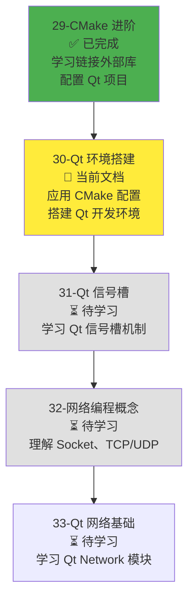
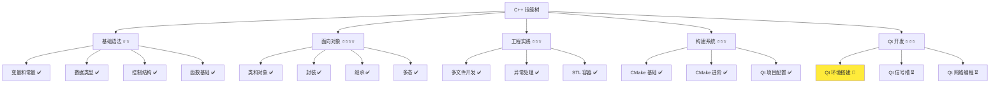
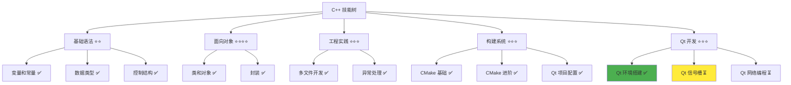

# Qt 环境搭建

> **学习目标**：掌握 Qt 6.9+（推荐 6.12+）的安装和配置方法，学会使用 CMake 配置 Qt 项目，了解 Qt Creator 的基本使用，能够创建和运行第一个 Qt 项目  
> **前置知识**：C++ 多文件开发基础、CMake 进阶（find_package、Qt 项目配置）  
> **预计时间**：60 分钟  
> **难度等级**：⭐⭐⭐  
> **技能收获**：Qt 安装配置、CMake 配置 Qt 项目、Qt Creator 使用、Qt 项目创建  
> **文档版本**：v1.0  
> **最后更新**：2025-11-19

📊 **难度等级说明**

| 等级           | 描述                       | 练习题数量     | 颜色码 |
| -------------- | -------------------------- | -------------- | ------ |
| **⭐**         | 入门级，零基础可学         | 5 题基础概念题 | 🟢绿   |
| **⭐⭐**       | 基础级，需要基本编程概念   | 5 题基础概念题 | 🟡黄   |
| **⭐⭐⭐**     | 中级，需要相关技术基础     | 3 题代码分析题 | 🟠橙   |
| **⭐⭐⭐⭐**   | 高级，需要扎实的技术功底   | 3 题代码分析题 | 🔴红   |
| **⭐⭐⭐⭐⭐** | 专家级，需要丰富的项目经验 | 2 题设计思考题 | 🟣紫   |

## 1. 学习目标

### 1.1 学习动机

- **实际需求**：开发 Qt 应用程序需要先搭建 Qt 开发环境。Qt 环境搭建是使用 Qt 开发的前提，只有正确安装和配置 Qt（Qt 6.9+ 即可），才能开始 Qt 项目开发
- **应用场景**：Qt 桌面应用开发、Qt 网络编程、Qt GUI 开发、跨平台应用开发
- **技能价值**：学会后能搭建 Qt 开发环境，配置 Qt 项目，使用 Qt Creator 开发，为后续 Qt 开发打下基础
- **数据支持**：Qt 是跨平台 C++ 应用程序开发框架，掌握 Qt 环境搭建是开发 Qt 应用的必备技能

### 1.1.1 为什么需要学习 Qt 环境搭建？

**学习路径设计**：

在学习了 CMake 进阶（链接外部库、配置 Qt 项目）之后，我们需要实际搭建 Qt 开发环境。这样做的原因：

1. **实际应用**：之前学习的 CMake 配置 Qt 项目是理论知识，现在需要实际安装 Qt 并验证配置
2. **开发工具**：Qt Creator 是 Qt 官方 IDE，了解其基本使用能提高开发效率
3. **项目实践**：创建第一个 Qt 项目，验证环境配置是否正确
4. **问题排查**：学会排查 Qt 环境配置问题，为后续开发做准备

**学习路径安排**：



**为什么不在本章直接学习 Qt 开发？**

- ❌ **缺少前置知识**：Qt 开发需要 Qt 信号槽机制和 Qt Network 模块
- ❌ **理解困难**：没有 Qt 环境搭建的基础，无法运行 Qt 项目
- ✅ **循序渐进**：先搭建 Qt 环境，再学习 Qt 信号槽，最后学习 Qt Network

**本章的学习重点**：

- ✅ **Qt 安装配置**：安装 Qt 6.9+（推荐 6.12+，但 6.9+ 也可满足需求），配置环境变量
- ✅ **CMake 配置验证**：验证之前学习的 CMake 配置是否正确
- ✅ **Qt Creator 使用**：了解 Qt Creator 的基本功能
- ✅ **项目创建**：创建第一个 Qt 项目并运行

> **类比**：就像建房子，之前学会了如何连接水电（CMake 配置），现在需要实际安装水电设备（Qt 环境搭建），然后才能使用电器（Qt 开发）。如果直接学使用电器，没有安装水电设备，无法正常工作。

### 1.2 技能树位置



> **图表说明**：C++ 技能树结构图，当前文档点亮 Qt 环境搭建技能点，为后续 Qt 信号槽和 Qt 网络编程做准备

### 1.3 前置知识检查

在开始学习之前，请确认你已经掌握：

- [ ] C++ 多文件开发基础（头文件、源文件分离、编译链接）
- [ ] CMake 进阶（find_package、Qt 项目配置、跨平台构建）
- [ ] 基本的命令行操作（mkdir、cd、cmake、make）

> **未掌握处理**：若未通过，请先复习 [CMake 进阶](./29-cmake-advanced.md)

## 2. 核心内容

### 2.1 快速体验：安装 Qt 6.9+（推荐 6.12+）

让我们先快速体验一下，看看如何安装和配置 Qt 6.9+（推荐 6.12+）。

#### 2.1.1 Qt 版本选择

**Qt 版本说明**：

- **Qt 6.12+**：推荐版本，支持最新的 C++ 标准，性能更好
- **Qt 6.9+**：最低版本，如果系统版本较低，可以使用此版本
- **Qt 5.x**：旧版本，不推荐新项目使用

**选择建议**：

- 新项目推荐使用 Qt 6.12+（从 Qt 官网下载安装器）
- 如果使用包管理器（如 Homebrew）安装，可能是 6.9.3 版本，完全可以满足学习需求
- 如果系统已安装 Qt 6.9+，也可以使用（CMake 配置中不指定版本要求即可兼容）

#### 2.1.2 macOS 安装 Qt（推荐方式：Homebrew）

**安装步骤**：

```bash
# 1. 使用 Homebrew 安装 Qt6
brew install qt@6

# 2. 查看 Qt6 安装路径
brew --prefix qt@6
# 输出示例：/opt/homebrew/opt/qt@6

# 3. 设置环境变量（可选，CMake 会自动查找）
export Qt6_DIR=$(brew --prefix qt@6)/lib/cmake/Qt6
```

**验证安装**：

```bash
# 检查 Qt6 版本
qmake6 --version
# 或者
$(brew --prefix qt@6)/bin/qmake --version
```

**预期输出**（Homebrew 安装的版本可能是 6.9.3 或更高版本）：

```
QMake version 3.1
Using Qt version 6.9.3 in /opt/homebrew/opt/qt@6/lib
```

> **注意**：Homebrew 的 `qt@6` 公式当前提供的版本可能是 6.9.3，而不是最新的 6.12+。这个版本完全可以满足学习需求，因为：
>
> - Qt 6.9+ 已经支持我们需要的所有功能（Core、Network 模块）
> - CMake 配置中不指定版本要求，可以兼容 6.9+ 版本
> - 如果需要最新版本，可以从 Qt 官网下载安装器安装

#### 2.1.3 Windows 安装 Qt

**安装步骤**：

1. **下载 Qt 安装程序**：
   - 访问 [Qt 官网](https://www.qt.io/download)
   - 下载 Qt Online Installer（在线安装器）

2. **运行安装程序**：
   - 选择安装路径（如 `C:\Qt`）
   - 选择 Qt 版本（推荐 Qt 6.12.0 或更高版本）
   - 选择组件：
     - ✅ Qt 6.12.0（或更高版本）
     - ✅ MSVC 2019 64-bit（如果使用 Visual Studio）
     - ✅ MinGW 64-bit（如果使用 MinGW）
     - ✅ Qt Creator（可选，但推荐）

3. **设置环境变量（可选）**：

   ```cmd
   set Qt6_DIR=C:\Qt\6.12.0\msvc2019_64\lib\cmake\Qt6
   ```

**验证安装**：

```cmd
qmake --version
```

#### 2.1.4 Linux 安装 Qt

**Ubuntu/Debian 安装**：

```bash
# 1. 使用 apt 安装 Qt6
sudo apt update
sudo apt install qt6-base-dev qt6-tools-dev qt6-tools-dev-tools

# 2. 验证安装
qmake6 --version
```

**其他 Linux 发行版**：

- 参考 Qt 官方文档或使用包管理器安装
- 或者从 Qt 官网下载安装包

#### 2.1.5 验证 Qt 安装

**检查 Qt6 CMake 配置文件**：

```bash
# macOS（Homebrew）
ls $(brew --prefix qt@6)/lib/cmake/Qt6/

# Windows
dir C:\Qt\6.12.0\msvc2019_64\lib\cmake\Qt6\

# Linux
ls /usr/lib/x86_64-linux-gnu/cmake/Qt6/
```

**预期输出**（应该包含以下文件）：

```
Qt6Config.cmake
Qt6Core/
Qt6Network/
Qt6Widgets/
...
```

> **快速体验总结**：通过这个简单的安装过程，你应该理解了：
>
> - Qt 6.9+ 的安装方法（不同平台不同方式，Homebrew 可能安装 6.9.3 版本）
> - Qt 安装路径的位置
> - 如何验证 Qt 安装是否成功
> - Qt 6.9+ 版本完全可以满足学习需求，不需要强制使用 6.12+

### 2.2 快速体验：验证 CMake 配置 Qt 项目

现在我们已经安装了 Qt，让我们验证之前学习的 CMake 配置是否正确。

#### 2.2.1 使用之前的示例项目

**项目位置**：`src/stage1/29-cmake-advanced/01-quick-start/`

**项目结构**：

```
01-quick-start/
├── CMakeLists.txt
└── src/
    └── main.cpp
```

#### 2.2.2 配置和构建项目

**步骤 1：进入项目目录**：

```bash
cd src/stage1/29-cmake-advanced/01-quick-start
```

**步骤 2：创建构建目录**：

```bash
mkdir build
cd build
```

**步骤 3：配置项目**：

```bash
cmake ..
```

**预期输出**（如果 Qt6 安装正确，CMake 会自动找到 Qt6 并配置项目）：

```
-- The CXX compiler identification is AppleClang 17.0.0.17000404
-- Detecting CXX compiler ABI info
-- Detecting CXX compiler ABI info - done
-- Check for working CXX compiler: /usr/bin/c++ - skipped
-- Detecting CXX compile features
-- Detecting CXX compile features - done
-- Performing Test CMAKE_HAVE_LIBC_PTHREAD
-- Performing Test CMAKE_HAVE_LIBC_PTHREAD - Success
-- Found Threads: TRUE
-- Performing Test HAVE_STDATOMIC
-- Performing Test HAVE_STDATOMIC - Success
-- Found WrapAtomic: TRUE
-- Configuring done (2.7s)
-- Generating done (0.1s)
-- Build files have been written to: /path/to/build
```

> **注意**：CMake 输出中可能不会明确显示 `-- Found Qt6: TRUE` 这一行，但如果配置成功（看到 `Configuring done` 和 `Generating done`），说明 Qt6 已经被正确找到。如果找不到 Qt6，CMake 会报错并停止配置。

**如果找不到 Qt6**：

```
CMake Error at CMakeLists.txt:16 (find_package):
  Could not find a package configuration file provided by "Qt6" with any of
  the following names:
    Qt6Config.cmake
    qt6-config.cmake
```

**解决方法**：

1. **检查 Qt6 是否已安装**：使用上面的验证方法
2. **设置 Qt6_DIR 环境变量**：

   ```bash
   # macOS（Homebrew）
   export Qt6_DIR=$(brew --prefix qt@6)/lib/cmake/Qt6

   # Windows
   set Qt6_DIR=C:\Qt\6.12.0\msvc2019_64\lib\cmake\Qt6

   # Linux
   export Qt6_DIR=/usr/lib/x86_64-linux-gnu/cmake/Qt6
   ```

3. **重新运行 cmake**：

   ```bash
   cmake ..
   ```

**步骤 4：构建项目**：

```bash
cmake --build .
```

**预期输出**：

```
[  0%] Built target MyQtApp_autogen_timestamp_deps
[ 25%] Automatic MOC and UIC for target MyQtApp
[ 25%] Built target MyQtApp_autogen
[ 50%] Building CXX object CMakeFiles/MyQtApp.dir/MyQtApp_autogen/mocs_compilation.cpp.o
[ 75%] Building CXX object CMakeFiles/MyQtApp.dir/src/main.cpp.o
[100%] Linking CXX executable MyQtApp
[100%] Built target MyQtApp
```

**步骤 5：运行程序**：

```bash
# macOS/Linux
./MyQtApp

# Windows
.\MyQtApp.exe
```

**预期输出**（版本号取决于安装的 Qt 版本）：

```
Hello from Qt6!
Qt Version: 6.9.3  # 或 6.12.0，取决于安装的版本
```

> **快速体验总结**：通过这个验证过程，你应该理解了：
>
> - CMake 如何查找 Qt6（find_package）
> - 如何配置和构建 Qt 项目
> - 如何运行 Qt 程序
> - 如何排查 Qt 环境配置问题

### 2.3 Qt Creator 简介

Qt Creator 是 Qt 官方提供的集成开发环境（IDE），提供了代码编辑、调试、项目管理等功能。

#### 2.3.1 Qt Creator 的安装

**安装方式**：

Qt Creator 通常与 Qt 一起安装，也可以通过以下方式单独安装：

**方式 1：通过 Qt 安装器安装（推荐）**

1. **访问 Qt 官网**：
   - 访问 [Qt 下载页面](https://www.qt.io/download-dev)
   - 选择合适的版本下载

2. **选择版本类型**：
   - **Community Edition（社区版）**：推荐用于学习和开源项目
     - ✅ 免费使用
     - ✅ 适用于开源项目（GPL/LGPL 许可证）
     - ✅ 包含 Qt Creator 和所有核心功能
     - ✅ 适合学习和个人项目
   - **Business Evaluation（商业评估版）**：用于商业评估
     - ✅ 功能完整，包含所有商业功能
     - ⚠️ 仅用于评估目的，有时间限制
     - ⚠️ 商业使用需要购买许可证
   - **Education（教育版）**：用于教育用途
     - ✅ 免费用于课堂学习和学术项目
     - ✅ 需要教育邮箱验证

3. **下载并运行安装器**：
   - 下载 Qt Online Installer（在线安装器）
   - 运行安装器，选择安装路径
   - 选择组件时，确保勾选 **Qt Creator**
   - 选择 Qt 版本（推荐 Qt 6.9+ 或更高版本）

**方式 2：通过包管理器安装（macOS）**

```bash
# 使用 Homebrew 安装 Qt Creator
brew install --cask qt-creator
```

> **注意**：
>
> - **版本类型**：通过 Homebrew 安装的 Qt Creator 是**社区版（Community Edition）**，即开源版本。Qt Creator IDE 本身是开源的，可以免费使用。
> - **版本信息**：当前 Homebrew 提供的 Qt Creator 版本是 **18.0.0**（版本会随 Homebrew 更新而变化）。
> - **Qt 框架**：Qt Creator 是独立的应用，不包含 Qt 框架本身。安装后需要单独安装 Qt6（如 `brew install qt@6`），并在 Qt Creator 中配置 Qt 版本路径。
> - **许可证说明**：Qt Creator IDE 本身是开源的，但使用 Qt Creator 开发时，还需要配合 Qt 框架。Qt 框架有社区版（GPL/LGPL）和商业版的区别，需要根据项目需求选择合适的 Qt 框架版本。

**方式 3：单独下载 Qt Creator**

- 访问 [Qt Creator 下载页面](https://www.qt.io/download-dev)
- 下载对应平台的 Qt Creator 安装包
- 安装后需要配置 Qt 版本路径

**版本选择建议**：

- **学习和个人项目**：选择 **Community Edition（社区版）**
  - 完全免费，功能完整
  - 适合学习 Qt 开发
  - 适用于开源项目（GPL/LGPL 许可证）
  - 对于商业闭源项目，需要遵守 LGPL 许可证条款（动态链接等）
- **商业项目评估**：选择 **Business Evaluation（商业评估版）**
  - 用于评估商业功能
  - 评估期结束后需要购买许可证
- **教育用途**：选择 **Education（教育版）**
  - 需要教育邮箱验证
  - 适合学生和教师

> **许可证说明**：Qt 社区版采用 LGPL v3 许可证，可以用于开发商业应用，但需要遵守许可证条款（如动态链接、提供重新链接的可能性等）。如果无法满足这些条件或需要静态链接，建议考虑商业版。详细说明请参考 [Qt 许可证页面](https://www.qt.io/licensing)。

#### 2.3.2 Qt Creator 的主要功能

**核心功能**：

- **代码编辑**：语法高亮、代码补全、错误检查
- **项目管理**：创建、打开、管理 Qt 项目
- **构建系统**：支持 CMake、qmake 等构建系统
- **调试功能**：断点调试、变量查看、调用栈
- **UI 设计**：Qt Designer 集成，可视化设计界面

**优势**：

- ✅ Qt 官方 IDE，与 Qt 框架深度集成
- ✅ 跨平台支持（Windows、macOS、Linux）
- ✅ 自动处理 Qt 的特殊文件（MOC、UIC、RCC）
- ✅ 提供丰富的 Qt 示例和文档

#### 2.3.3 Qt Creator 基本使用

**打开项目**：

1. 启动 Qt Creator
2. 选择 `File` → `Open File or Project...`
3. 选择项目的 `CMakeLists.txt` 文件
4. 点击 `Open`

**配置项目**：

1. Qt Creator 会自动检测 CMake 配置
2. 选择构建目录（通常选择 `build` 目录）
3. 选择构建类型（Debug 或 Release）
4. 点击 `Configure Project`

**构建项目**：

- 按 `Cmd+B`（macOS）或 `Ctrl+B`（Windows/Linux）
- 或点击左下角的构建按钮

**运行项目**：

- 按 `Cmd+R`（macOS）或 `Ctrl+R`（Windows/Linux）
- 或点击左下角的运行按钮

**调试项目**：

- 在代码行号左侧点击设置断点
- 按 `F5` 启动调试
- 使用 `F10`（单步跳过）、`F11`（单步进入）控制执行

> **说明**：Qt Creator 是可选工具，如果你已经熟悉 Cursor/VSCode，可以继续使用 Cursor/VSCode 开发 Qt 项目。本文档主要介绍 Qt 环境搭建，Qt Creator 的使用不是必须的。

### 2.4 深入理解：Qt 环境配置详解

#### 2.4.1 Qt6_DIR 环境变量

**作用**：告诉 CMake Qt6 的安装位置

**设置方法**：

**macOS（Homebrew）**：

```bash
# 临时设置（当前终端会话有效）
export Qt6_DIR=$(brew --prefix qt@6)/lib/cmake/Qt6

# 永久设置（添加到 ~/.zshrc 或 ~/.bash_profile）
echo 'export Qt6_DIR=$(brew --prefix qt@6)/lib/cmake/Qt6' >> ~/.zshrc
source ~/.zshrc
```

**Windows**：

```cmd
# 临时设置（当前命令提示符有效）
set Qt6_DIR=C:\Qt\6.12.0\msvc2019_64\lib\cmake\Qt6

# 永久设置（系统环境变量）
# 1. 右键"此电脑" → "属性" → "高级系统设置" → "环境变量"
# 2. 在"系统变量"中添加 Qt6_DIR，值为 C:\Qt\6.12.0\msvc2019_64\lib\cmake\Qt6
```

**Linux**：

```bash
# 临时设置
export Qt6_DIR=/usr/lib/x86_64-linux-gnu/cmake/Qt6

# 永久设置（添加到 ~/.bashrc）
echo 'export Qt6_DIR=/usr/lib/x86_64-linux-gnu/cmake/Qt6' >> ~/.bashrc
source ~/.bashrc
```

**验证设置**：

```bash
echo $Qt6_DIR  # macOS/Linux
echo %Qt6_DIR%  # Windows
```

#### 2.4.2 CMake 自动查找 Qt6

**工作原理**：

1. CMake 会在系统路径中查找 `Qt6Config.cmake` 文件
2. 查找顺序：
   - `Qt6_DIR` 环境变量指定的路径
   - CMake 缓存变量 `Qt6_DIR`
   - 系统默认路径（如 `/usr/lib/cmake/Qt6`、`/opt/homebrew/lib/cmake/Qt6`）

**如果找不到 Qt6**：

- 检查 Qt6 是否已安装
- 设置 `Qt6_DIR` 环境变量
- 或在 CMakeLists.txt 中设置：

  ```cmake
  set(Qt6_DIR "/path/to/Qt6/lib/cmake/Qt6")
  ```

#### 2.4.3 Qt 版本兼容性

**版本要求**：

- **推荐**：Qt 6.12+（最新稳定版）
- **最低**：Qt 6.9+（如果系统版本较低）

**CMakeLists.txt 配置**：

```cmake
# 方式 1：不指定版本（推荐，兼容不同版本）
find_package(Qt6 REQUIRED COMPONENTS Core Network)

# 方式 2：指定最低版本（如果需要特定功能）
find_package(Qt6 6.9 REQUIRED COMPONENTS Core Network)

# 方式 3：指定精确版本（不推荐，限制灵活性）
find_package(Qt6 6.12 REQUIRED COMPONENTS Core Network)
```

**选择建议**：

- 新项目：使用方式 1（不指定版本），兼容性最好
- 需要特定功能：使用方式 2（指定最低版本）
- 确保版本一致：使用方式 3（指定精确版本）

### 2.5 深入理解：Qt 项目结构

#### 2.5.1 基本项目结构

**最小 Qt 项目结构**：

```ini
my-qt-app/
├── CMakeLists.txt          # CMake 配置文件
└── src/
    └── main.cpp            # 主程序文件
```

**完整 Qt 项目结构**：

```ini
my-qt-app/
├── CMakeLists.txt          # CMake 配置文件
├── src/
│   ├── main.cpp           # 主程序文件
│   ├── mainwindow.h       # 主窗口头文件
│   └── mainwindow.cpp     # 主窗口源文件
├── ui/
│   └── mainwindow.ui      # UI 设计文件（可选）
├── resources/
│   └── resources.qrc      # 资源文件（可选）
└── build/                 # 构建目录（生成的文件）
    ├── CMakeCache.txt
    ├── CMakeFiles/
    └── my-qt-app          # 可执行文件
```

#### 2.5.2 CMakeLists.txt 结构

**基本配置**：

```cmake
cmake_minimum_required(VERSION 3.20)

project(MyQtApp VERSION 1.0.0 LANGUAGES CXX)

# 基本配置
set(CMAKE_CXX_STANDARD 17)
set(CMAKE_CXX_STANDARD_REQUIRED ON)

# 生成 compile_commands.json（用于 IntelliSense/clangd）
set(CMAKE_EXPORT_COMPILE_COMMANDS ON)

# 查找 Qt6
find_package(Qt6 REQUIRED COMPONENTS Core Network)

# Qt 自动处理
set(CMAKE_AUTOMOC ON)
set(CMAKE_AUTOUIC ON)
set(CMAKE_AUTORCC ON)

# 源文件
set(SOURCES
    src/main.cpp
)

# 创建可执行文件
add_executable(${PROJECT_NAME} ${SOURCES})

# 链接 Qt6 模块
target_link_libraries(${PROJECT_NAME}
    Qt6::Core
    Qt6::Network
)
```

**关键配置说明**：

1. **CMAKE_EXPORT_COMPILE_COMMANDS ON**：生成 `compile_commands.json`，用于代码补全和错误检查
2. **find_package(Qt6 ...)**：查找 Qt6 库
3. **CMAKE_AUTOMOC ON**：自动处理 Qt 的 MOC 工具（信号槽等）
4. **target_link_libraries**：链接 Qt6 模块

### 2.6 常见问题排查

#### 2.6.1 找不到 Qt6

**问题**：

```
CMake Error: Could not find a package configuration file provided by "Qt6"
```

**解决方法**：

1. **检查 Qt6 是否已安装**：

   ```bash
   # macOS
   brew list qt@6

   # Windows
   dir C:\Qt\6.12.0\

   # Linux
   dpkg -l | grep qt6
   ```

2. **设置 Qt6_DIR 环境变量**：

   ```bash
   export Qt6_DIR=/path/to/Qt6/lib/cmake/Qt6
   ```

3. **重新运行 CMake**：

   ```bash
   rm -rf build
   mkdir build
   cd build
   cmake ..
   ```

#### 2.6.2 Qt 版本不匹配

**问题**：

如果 CMakeLists.txt 中指定了版本要求，但系统安装的 Qt 版本不满足要求，会出现以下错误：

```
CMake Error at CMakeLists.txt:16 (find_package):
  Could not find a package configuration file provided by "Qt6" with version
  >= 6.12.0 (requested version: 6.12.0).
```

**解决方法**：

1. **检查 Qt 版本**：

   ```bash
   qmake6 --version
   ```

2. **调整 CMakeLists.txt**：

   ```cmake
   # 移除版本要求或降低版本要求
   find_package(Qt6 REQUIRED COMPONENTS Core Network)       # 不指定版本（推荐）
   # 或
   find_package(Qt6 6.9 REQUIRED COMPONENTS Core Network)   # 指定最低版本
   ```

#### 2.6.3 编译错误

**问题**：

```
error: 'QCoreApplication' was not declared in this scope
```

**解决方法**：

1. **检查头文件包含**：

   ```cpp
   #include <QtCore/QCoreApplication>
   #include <QtCore/QDebug>
   ```

2. **检查 CMakeLists.txt**：

   ```cmake
   # 确保链接了 Qt6::Core
   target_link_libraries(${PROJECT_NAME}
       Qt6::Core
   )
   ```

3. **重新配置和构建**：

   ```bash
   rm -rf build
   mkdir build
   cd build
   cmake ..
   cmake --build .
   ```

## 3. 实践应用

### 3.1 项目场景

在 QtLanChat 项目中，Qt 环境搭建用于：

- **配置 Qt 项目**：使用 CMake 配置 Qt 项目，链接 Qt6::Core 和 Qt6::Network 模块
- **开发环境**：搭建 Qt 开发环境，使用 Cursor/VSCode 或 Qt Creator 开发
- **项目构建**：使用 CMake 构建 Qt 项目，生成可执行文件

### 3.2 实际应用示例

**QtLanChat 项目的环境配置**：

1. **安装 Qt6**：

   ```bash
   # macOS
   brew install qt@6
   ```

2. **设置环境变量**（可选）：

   ```bash
   export Qt6_DIR=$(brew --prefix qt@6)/lib/cmake/Qt6
   ```

3. **验证配置**：

   ```bash
   cd src/stage1/29-cmake-advanced/01-quick-start
   mkdir build && cd build
   cmake ..
   cmake --build .
   ./MyQtApp
   ```

### 3.3 设计思路

**为什么这样配置**：

- **使用 CMake**：跨平台构建，一套配置多平台使用
- **不指定版本**：兼容不同版本的 Qt6，灵活性更好
- **自动处理**：CMAKE_AUTOMOC 等自动处理 Qt 特殊文件
- **统一配置**：项目根目录的 `.vscode/` 配置适用于所有子项目

## 4. 练习与测试

### 4.1 练习题

#### 练习 1：理解 Qt 环境配置

**题目**：解释 `Qt6_DIR` 环境变量的作用，并说明如何设置（macOS、Windows、Linux）。

**要求**：

- 解释 `Qt6_DIR` 的作用
- 说明不同平台的设置方法
- 说明如何验证设置是否成功

**参考答案**：

`Qt6_DIR` 环境变量用于告诉 CMake Qt6 的安装位置。

**作用**：CMake 的 `find_package(Qt6)` 会首先查找 `Qt6_DIR` 环境变量指定的路径，如果找到 `Qt6Config.cmake` 文件，就使用该路径。

**设置方法**：

- **macOS（Homebrew）**：

  ```bash
  export Qt6_DIR=$(brew --prefix qt@6)/lib/cmake/Qt6
  ```

- **Windows**：

  ```cmd
  set Qt6_DIR=C:\Qt\6.12.0\msvc2019_64\lib\cmake\Qt6
  ```

- **Linux**：

  ```bash
  export Qt6_DIR=/usr/lib/x86_64-linux-gnu/cmake/Qt6
  ```

**验证方法**：

```bash
echo $Qt6_DIR  # macOS/Linux
echo %Qt6_DIR%  # Windows
```

#### 练习 2：配置 Qt 项目

**题目**：创建一个新的 Qt 项目，配置 CMakeLists.txt，并成功构建和运行。

**要求**：

1. 创建项目目录结构
2. 编写 CMakeLists.txt（使用之前学习的配置）
3. 编写简单的 main.cpp（输出 "Hello Qt!"）
4. 配置、构建、运行项目

**参考答案**：

**项目结构**：

```ini
my-first-qt-app/
├── CMakeLists.txt
└── src/
    └── main.cpp
```

**CMakeLists.txt**：

```cmake
cmake_minimum_required(VERSION 3.20)

project(MyFirstQtApp VERSION 1.0.0 LANGUAGES CXX)

set(CMAKE_CXX_STANDARD 17)
set(CMAKE_CXX_STANDARD_REQUIRED ON)
set(CMAKE_EXPORT_COMPILE_COMMANDS ON)

find_package(Qt6 REQUIRED COMPONENTS Core)

set(CMAKE_AUTOMOC ON)
set(CMAKE_AUTOUIC ON)
set(CMAKE_AUTORCC ON)

set(SOURCES
    src/main.cpp
)

add_executable(${PROJECT_NAME} ${SOURCES})

target_link_libraries(${PROJECT_NAME}
    Qt6::Core
)
```

**src/main.cpp**：

```cpp
#include <QtCore/QCoreApplication>
#include <QtCore/QDebug>

int main(int argc, char *argv[]) {
    QCoreApplication app(argc, argv);

    qDebug() << "Hello Qt!";
    qDebug() << "Qt Version:" << QT_VERSION_STR;

    return 0;
}
```

**构建和运行**：

```bash
mkdir build
cd build
cmake ..
cmake --build .
./MyFirstQtApp  # macOS/Linux
```

#### 练习 3：排查 Qt 环境问题

**题目**：如果 CMake 找不到 Qt6，列出排查步骤。

**要求**：

- 列出排查步骤
- 说明每个步骤的作用
- 提供解决方法

**参考答案**：

**排查步骤**：

1. **检查 Qt6 是否已安装**：

   ```bash
   # macOS
   brew list qt@6

   # Windows
   dir C:\Qt\6.12.0\

   # Linux
   dpkg -l | grep qt6
   ```

2. **检查 Qt6 CMake 配置文件是否存在**：

   ```bash
   # macOS
   ls $(brew --prefix qt@6)/lib/cmake/Qt6/Qt6Config.cmake

   # Windows
   dir C:\Qt\6.12.0\msvc2019_64\lib\cmake\Qt6\Qt6Config.cmake

   # Linux
   ls /usr/lib/x86_64-linux-gnu/cmake/Qt6/Qt6Config.cmake
   ```

3. **检查 Qt6_DIR 环境变量**：

   ```bash
   echo $Qt6_DIR  # macOS/Linux
   echo %Qt6_DIR%  # Windows
   ```

4. **设置 Qt6_DIR 环境变量**（如果未设置）：

   ```bash
   # macOS
   export Qt6_DIR=$(brew --prefix qt@6)/lib/cmake/Qt6

   # Windows
   set Qt6_DIR=C:\Qt\6.12.0\msvc2019_64\lib\cmake\Qt6

   # Linux
   export Qt6_DIR=/usr/lib/x86_64-linux-gnu/cmake/Qt6
   ```

5. **重新运行 CMake**：

   ```bash
   rm -rf build
   mkdir build
   cd build
   cmake ..
   ```

### 4.2 测试题

1. **关于 Qt6_DIR 环境变量，下列说法正确的是：**
   A. Qt6_DIR 是必须设置的，否则 CMake 找不到 Qt6

   B. Qt6_DIR 是可选的，CMake 会自动在系统路径中查找 Qt6

   C. Qt6_DIR 只能通过环境变量设置

   D. Qt6_DIR 必须指向 Qt6 的安装根目录

   **答案**：B

   **解析**：
   - A 错误：Qt6_DIR 是可选的，CMake 会自动查找
   - B 正确：Qt6_DIR 是可选的，CMake 会自动在系统路径中查找
   - C 错误：Qt6_DIR 可以通过环境变量、CMake 变量或命令行参数设置
   - D 错误：Qt6_DIR 必须指向 `Qt6/lib/cmake/Qt6` 目录，不是安装根目录

2. **关于 Qt 版本选择，下列说法正确的是：**
   A. 必须使用 Qt 6.12+，其他版本不支持

   B. 推荐使用 Qt 6.12+，但 Qt 6.9+ 也可以使用

   C. 只能使用 Qt 6.12，不能使用其他版本

   D. Qt 版本不影响项目配置

   **答案**：B

   **解析**：
   - A 错误：Qt 6.9+ 也可以使用，只需要调整 CMake 配置
   - B 正确：推荐 Qt 6.12+，但 Qt 6.9+ 也可以使用
   - C 错误：可以使用不同版本的 Qt，只需要调整 CMake 配置
   - D 错误：Qt 版本会影响项目配置，需要相应调整

3. **关于 Qt Creator，下列说法正确的是：**
   A. Qt Creator 是必须使用的 IDE

   B. Qt Creator 是可选的，可以使用 Cursor/VSCode 开发

   C. Qt Creator 只能在 Windows 上使用

   D. Qt Creator 不支持 CMake 项目

   **答案**：B

   **解析**：
   - A 错误：Qt Creator 是可选的，可以使用其他 IDE
   - B 正确：Qt Creator 是可选的，可以使用 Cursor/VSCode 开发
   - C 错误：Qt Creator 支持跨平台（Windows、macOS、Linux）
   - D 错误：Qt Creator 支持 CMake 项目

### 4.3 常见问题 FAQ

- **Q1：CMake 找不到 Qt6 怎么办？**
  - **A：**检查 Qt6 是否已安装，设置 `Qt6_DIR` 环境变量指向 Qt6 的 CMake 配置文件路径，或通过命令行参数指定：`cmake -DQt6_DIR=/path/to/Qt6/lib/cmake/Qt6 ..`

- **Q2：Qt 版本不匹配怎么办？**
  - **A：**检查系统安装的 Qt 版本，调整 CMakeLists.txt 中的版本要求，或移除版本要求使用 `find_package(Qt6 REQUIRED COMPONENTS Core Network)`

- **Q3：Qt Creator 是必须的吗？**
  - **A：**不是必须的。如果你已经熟悉 Cursor/VSCode，可以继续使用 Cursor/VSCode 开发 Qt 项目。Qt Creator 是可选的 IDE。

- **Q4：如何验证 Qt 环境配置是否正确？**
  - **A：**使用之前的示例项目（`src/stage1/29-cmake-advanced/01-quick-start/`），运行 `cmake ..` 和 `cmake --build .`，如果成功构建并运行，说明环境配置正确。

## 5. 资源与扩展

### 5.1 基础资源

- **Qt 官方文档**：[Qt Documentation](https://doc.qt.io/) - Qt 官方文档
- **Qt 下载页面**：[Qt Download](https://www.qt.io/download) - Qt 官方下载页面
- **CMake Qt 文档**：[Qt6 CMake Manual](https://doc.qt.io/qt-6/cmake-manual.html) - Qt6 CMake 配置文档

### 5.2 扩展阅读

- **Qt Creator 使用指南**：[Qt Creator Manual](https://doc.qt.io/qtcreator/) - Qt Creator 官方文档
- **Qt 安装指南**：[Qt Installation Guide](https://doc.qt.io/qt-6/gettingstarted.html) - Qt 安装和配置指南
- **跨平台开发**：[Qt Cross-Platform Development](https://doc.qt.io/qt-6/qtglobal.html) - Qt 跨平台开发指南

### 5.3 下一步学习

完成本文档后，建议学习：

- **31-qt-signals-slots.md**：Qt 信号槽机制，学习 Qt 的核心特性
- **32-network-programming-concepts.md**：网络编程概念，理解 Socket、TCP/UDP、客户端/服务器模型
- **33-qt-network-basics.md**：Qt 网络基础，应用前面学到的网络编程概念和 Qt 环境配置

## 6. 课后作业及参考答案

### 6.1 学习检查清单

- [ ] 能够安装和配置 Qt 6.9+（推荐 6.12+，但 6.9+ 也可满足需求）
- [ ] 能够设置 Qt6_DIR 环境变量
- [ ] 能够验证 Qt 环境配置是否正确
- [ ] 能够创建和运行第一个 Qt 项目
- [ ] 能够排查 Qt 环境配置问题

### 6.2 综合练习

**作业题目**：搭建 Qt 开发环境并创建第一个 Qt 项目

**要求**：

1. 安装 Qt 6.9+（推荐 6.12+，但 Homebrew 安装的 6.9.3 版本也可以）
2. 设置 Qt6_DIR 环境变量（可选）
3. 创建一个新的 Qt 项目（项目名：`MyFirstQtApp`）
4. 编写 CMakeLists.txt 配置 Qt 项目
5. 编写 main.cpp，输出 "Hello Qt!" 和 Qt 版本
6. 配置、构建、运行项目
7. 验证项目能够正常运行

**时间估算**：30 分钟

**参考答案**：

参考"练习 2：配置 Qt 项目"的答案。

**评分标准**：环境配置（30%）、项目创建（30%）、代码正确性（30%）、问题排查（10%）

## 7. 下一步学习

### 7.1 学习路径说明

**完整学习路径**：


**为什么这样安排学习路径？**

1. **29-cmake-advanced.md（已完成）**：
   - ✅ 学习 CMake 链接外部库（find_package）
   - ✅ 学习 Qt 项目配置（Qt6::Core、Qt6::Network）

2. **30-qt-environment-setup.md（当前文档，已完成）**：
   - ✅ 搭建 Qt 开发环境（安装 Qt6、配置环境变量）
   - ✅ 应用本文学到的 CMake 配置知识
   - ✅ 验证 Qt 环境配置是否正确

3. **31-qt-signals-slots.md（下一步）**：
   - 🔄 学习 Qt 信号槽机制（Qt Network 基于信号槽）

4. **32-network-programming-concepts.md**：
   - ⏳ 理解网络编程概念（Socket、TCP/UDP、客户端/服务器模型）

5. **33-qt-network-basics.md**：
   - ⏳ 学习 Qt Network 模块基础，应用前面学到的概念

**学习时间规划**：

| 文档                               | 预计时间 | 累计时间 | 状态      |
| ---------------------------------- | -------- | -------- | --------- |
| 29-cmake-advanced.md               | 1.5h     | 1.5h     | ✅ 已完成 |
| 30-qt-environment-setup.md         | 1h       | 2.5h     | ✅ 已完成 |
| 31-qt-signals-slots.md             | 1.5h     | 4h       | 🔄 下一步 |
| 32-network-programming-concepts.md | 1h       | 5h       | ⏳ 待学习 |
| 33-qt-network-basics.md            | 1.5h     | 6.5h     | ⏳ 待学习 |

**下一篇**：[Qt 信号槽机制](./31-qt-signals-slots.md)

**学习路径**：

1. ✅ 29-cmake-advanced.md - 已完成（学习 CMake 链接外部库、配置 Qt 项目）
2. ✅ 30-qt-environment-setup.md - 已完成（搭建 Qt 开发环境，应用 CMake 配置）
3. 🔄 31-qt-signals-slots.md - 下一步（学习 Qt 信号槽机制）
4. ⏳ 32-network-programming-concepts.md - 待学习（理解网络编程概念）
5. ⏳ 33-qt-network-basics.md - 待学习（学习 Qt Network 模块基础，应用网络编程概念）

**技能树更新**：



**学习成果**：

- **理解概念**：能够解释 Qt 环境搭建的步骤和配置方法
- **实际操作**：能够安装 Qt6、配置环境变量、创建和运行 Qt 项目
- **问题排查**：能够排查 Qt 环境配置问题
- **掌握度自评**：80%

> **指导建议**：<50% 建议复习，50-80% 继续学习，>80% 可进入下一阶段

---

**文档质量检查**：

- [x] 学习目标明确且可验证
- [x] 概念解释清晰，配有生活化比喻
- [x] 代码示例完整可运行
- [x] 练习题有答案
- [x] 技能收获明确
- [x] 抽象概念配有生活化比喻
- [x] 比喻体系一致，避免概念混乱
- [x] 文档长度适中，聚焦核心概念

---

> **特别说明**：
>
> 1. **本文档的定位**：专注于 Qt 环境搭建，包括 Qt 安装、环境配置、CMake 配置验证、Qt Creator 简介。不涉及 Qt 的具体使用（将在后续文档中学习）。
> 2. **为什么先学 Qt 环境搭建**：Qt 开发需要先搭建 Qt 开发环境，只有正确安装和配置 Qt，才能开始 Qt 项目开发。就像建房子，先安装水电设备（Qt 环境搭建），再使用电器（Qt 开发）。
> 3. **后续学习路径**：学完 Qt 环境搭建后，将学习 Qt 信号槽机制，最后学习 Qt Network 模块。
> 4. **Qt Creator**：Qt Creator 是可选工具，如果你已经熟悉 Cursor/VSCode，可以继续使用 Cursor/VSCode 开发 Qt 项目。
> 5. **实践导向**：本文档提供了完整的 Qt 环境搭建步骤和验证方法，可以直接应用到实际项目中。
