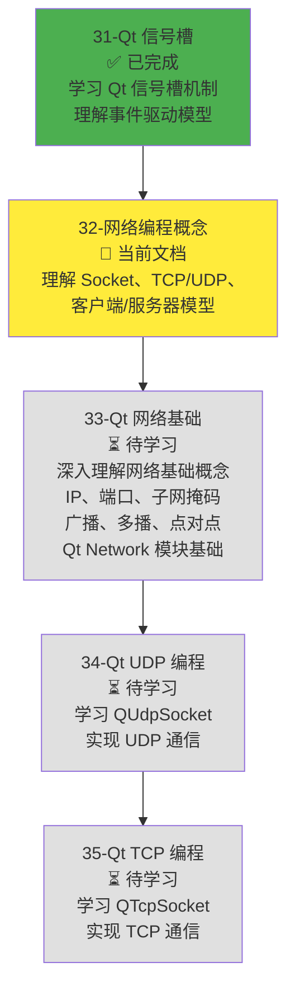
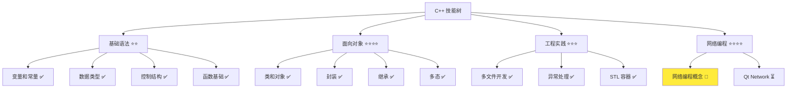
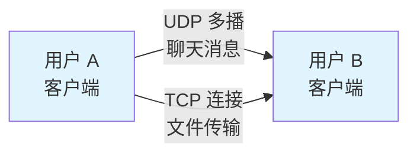
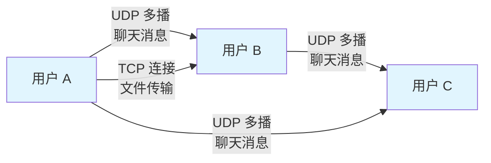
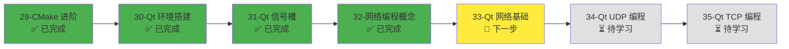
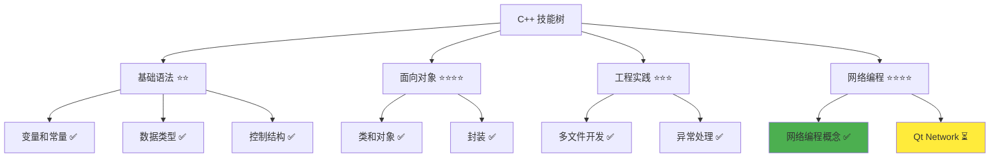

# 网络编程概念

> **学习目标**：理解网络编程的基本概念，掌握 Socket、TCP/UDP 协议、客户端/服务器模型等核心知识，为后续 Qt Network 学习打下坚实基础  
> **前置知识**：C++ 基础语法、函数、多文件开发基础  
> **预计时间**：60 分钟  
> **难度等级**：⭐⭐⭐  
> **技能收获**：网络编程概念、Socket、TCP/UDP 协议、客户端/服务器模型、网络编程基本流程  
> **文档版本**：v1.0  
> **最后更新**：2025-11-17

📊 **难度等级说明**

| 等级           | 描述                       | 练习题数量     | 颜色码 |
| -------------- | -------------------------- | -------------- | ------ |
| **⭐**         | 入门级，零基础可学         | 5 题基础概念题 | 🟢绿   |
| **⭐⭐**       | 基础级，需要基本编程概念   | 5 题基础概念题 | 🟡黄   |
| **⭐⭐⭐**     | 中级，需要相关技术基础     | 3 题代码分析题 | 🟠橙   |
| **⭐⭐⭐⭐**   | 高级，需要扎实的技术功底   | 3 题代码分析题 | 🔴红   |
| **⭐⭐⭐⭐⭐** | 专家级，需要丰富的项目经验 | 2 题设计思考题 | 🟣紫   |

## 1. 学习目标

### 1.1 学习动机

- **实际需求**：开发局域网聊天软件需要网络编程知识。网络编程是程序通过网络进行通信的基础，理解网络编程概念是使用 Qt Network 模块的前提
- **应用场景**：局域网聊天、文件传输、在线游戏、远程控制、物联网设备通信
- **技能价值**：学会后能理解网络通信原理，为后续学习 Qt Network 模块打下基础，能够开发网络应用程序
- **数据支持**：网络编程是现代软件开发的重要技能，掌握网络编程概念是开发聊天软件、文件传输等应用的必备知识

### 1.1.1 为什么先学网络编程概念？

**学习路径设计**：

在学习了 Qt 信号槽机制之后，我们需要学习网络编程的基本概念（Socket、TCP/UDP、客户端/服务器模型等），然后才能学习 Qt Network 模块。这样做的原因：

1. **理解原理**：理解网络编程的基本原理，才能更好地使用 Qt Network 模块
2. **选择协议**：理解 TCP 和 UDP 的区别，才能为不同场景选择合适的协议
3. **设计架构**：理解客户端/服务器模型和 P2P 模型，才能设计合理的网络架构
4. **调试能力**：理解底层概念，遇到网络问题时能快速定位和解决

**学习路径安排**：

**为什么不在本章直接学习 Qt Network？**

- ❌ **缺少前置知识**：Qt Network 需要深入理解网络基础概念（IP、端口、广播、多播等）
- ❌ **理解困难**：没有网络编程概念基础，直接学习 Qt Network API 会感到困惑
- ✅ **循序渐进**：先理解概念，再学习具体实现，学习效果更好

**本章的学习重点**：

- ✅ **理解概念**：Socket、TCP/UDP、客户端/服务器模型等核心概念
- ✅ **选择协议**：理解不同协议的特点，能够选择合适的协议
- ✅ **设计架构**：理解不同网络架构模式，能够设计合理的架构
- ❌ **不涉及具体 API**：不学习系统级 Socket API（POSIX Socket、Winsock），这些由 Qt Network 封装

> **类比**：就像学开车，先学交通规则（概念），再学如何操作方向盘（Qt Network）。如果直接学操作，不知道为什么要这样做，学习效果不好。

### 1.2 技能树位置

> **图表说明**：C++ 技能树结构图，当前文档点亮网络编程概念技能点，为后续 Qt Network 学习做准备

### 1.3 前置知识检查

在开始学习之前，请确认你已经掌握：

- [ ] C++ 基础语法（变量、函数、类）
- [ ] 函数调用和参数传递
- [ ] 多文件开发基础（头文件、源文件分离）
- [ ] 基本的数据类型（int、std::string）

> **未掌握处理**：若未通过，请先复习 [C++ 简介和快速入门](./01-cpp-introduction.md)、[函数基础详解](./12-functions.md) 和 [多文件开发基础](./24-multi-file-basics.md)

## 2. 核心内容

### 2.1 概念理解

**网络编程**：编写程序通过网络进行通信的技术。就像两个人通过电话通话，网络编程让程序之间可以通过网络发送和接收数据。

> **类比教学**：
>
> - **网络编程**：就像两个人通过电话通话，程序通过网络发送和接收数据
> - **Socket（套接字）**：就像电话插座，是程序与网络之间的接口，程序通过 Socket 发送和接收数据
> - **IP 地址**：就像电话号码，标识网络中的每台计算机
> - **端口号**：就像分机号，标识计算机上的不同程序
> - **TCP 协议**：就像打电话，需要先建立连接，确保对方收到消息（可靠传输）
> - **UDP 协议**：就像发短信，直接发送，不保证对方一定收到（快速传输）

### 2.2 Socket（套接字）概念

#### 2.2.1 什么是 Socket

**Socket（套接字）**：网络编程中的核心概念，是程序与网络之间的接口，程序通过 Socket 发送和接收数据。

> **类比**：Socket 就像电话插座，是程序与网络之间的连接点。就像电话需要插到插座才能通话，程序需要通过 Socket 才能与网络通信。

#### 2.2.2 Socket 的作用

**Socket 的作用**：

1. **建立连接**：程序通过 Socket 建立与网络的连接
2. **发送数据**：程序通过 Socket 发送数据到网络
3. **接收数据**：程序通过 Socket 从网络接收数据
4. **关闭连接**：程序通过 Socket 关闭网络连接

> **类比**：Socket 就像电话插座，程序就像电话机：
>
> - **建立连接**：就像把电话插到插座，建立与电话网络的连接
> - **发送数据**：就像通过电话说话，数据通过网络发送
> - **接收数据**：就像通过电话听声音，从网络接收数据
> - **关闭连接**：就像拔掉电话插头，断开网络连接

#### 2.2.3 Socket 的类型

**Socket 的类型**：

1. **TCP Socket**：使用 TCP 协议的 Socket，提供可靠的数据传输
2. **UDP Socket**：使用 UDP 协议的 Socket，提供快速的数据传输

> **类比**：
>
> - **TCP Socket**：就像打电话，需要先建立连接，确保对方收到消息
> - **UDP Socket**：就像发短信，直接发送，不保证对方一定收到

### 2.3 TCP vs UDP 协议对比

#### 2.3.1 TCP 协议（传输控制协议）

**TCP（Transmission Control Protocol）**：面向连接的、可靠的传输协议。

**TCP 的特点**：

1. **面向连接**：通信前需要先建立连接（三次握手）
2. **可靠传输**：保证数据按顺序、完整地到达目的地
3. **流量控制**：控制发送速度，避免接收方处理不过来
4. **拥塞控制**：网络拥堵时自动降低发送速度

> **类比**：TCP 就像打电话：
>
> - **面向连接**：打电话前需要先拨号，建立连接
> - **可靠传输**：对方能听到你说的话，不会丢失或乱序
> - **流量控制**：如果对方说话太快，你可以说"慢一点"
> - **拥塞控制**：如果电话线路繁忙，会自动降低通话质量

**TCP 的应用场景**：

- 文件传输（需要保证数据完整）
- 网页浏览（需要保证页面完整加载）
- 邮件发送（需要保证邮件完整送达）
- 远程登录（需要保证命令完整执行）

#### 2.3.2 UDP 协议（用户数据报协议）

**UDP（User Datagram Protocol）**：无连接的、快速的传输协议。

**UDP 的特点**：

1. **无连接**：通信前不需要建立连接，直接发送数据
2. **快速传输**：不需要建立连接，传输速度快
3. **不保证可靠**：不保证数据一定到达，可能丢失或乱序
4. **简单高效**：协议简单，开销小

> **类比**：UDP 就像发短信：
>
> - **无连接**：发短信不需要先打电话建立连接，直接发送
> - **快速传输**：发短信比打电话快，不需要等待对方接听
> - **不保证可靠**：短信可能丢失或延迟，不保证对方一定收到
> - **简单高效**：发短信比打电话简单，不需要建立连接

**UDP 的应用场景**：

- 实时聊天（消息丢失影响不大，速度更重要）
- 在线游戏（位置更新需要快速，偶尔丢失可以接受）
- 视频直播（画面偶尔丢失可以接受，速度更重要）
- DNS 查询（查询速度快，偶尔失败可以重试）

#### 2.3.3 TCP vs UDP 对比

| 特性         | TCP（传输控制协议）      | UDP（用户数据报协议） |
| ------------ | ------------------------ | --------------------- |
| **连接方式** | 面向连接（需要建立连接） | 无连接（直接发送）    |
| **可靠性**   | 可靠（保证数据到达）     | 不可靠（可能丢失）    |
| **传输速度** | 较慢（需要建立连接）     | 较快（直接发送）      |
| **数据顺序** | 保证顺序                 | 不保证顺序            |
| **开销**     | 较大（需要维护连接）     | 较小（无需维护连接）  |
| **应用场景** | 文件传输、网页浏览       | 实时聊天、在线游戏    |

> **类比总结**：
>
> - **TCP**：就像打电话，需要先建立连接，保证对方听到你说的话，但速度较慢
> - **UDP**：就像发短信，直接发送，速度快，但不保证对方一定收到

**选择原则**：

- **需要可靠传输**：使用 TCP（如文件传输、网页浏览）
- **需要快速传输**：使用 UDP（如实时聊天、在线游戏）
- **数据丢失影响大**：使用 TCP（如文件传输）
- **数据丢失影响小**：使用 UDP（如实时聊天）

### 2.4 客户端/服务器模型

#### 2.4.1 什么是客户端/服务器模型

**客户端/服务器模型（Client/Server Model）**：网络通信中的一种架构模式，客户端向服务器发送请求，服务器处理请求并返回响应。

> **类比**：客户端/服务器模型就像餐厅：
>
> - **客户端**：就像顾客，向服务员（服务器）点菜（发送请求）
> - **服务器**：就像服务员，接收点菜（接收请求），告诉厨房（处理请求），上菜（返回响应）

#### 2.4.2 客户端和服务器的作用

**客户端（Client）**：

- **发送请求**：向服务器发送请求（如请求数据、发送消息）
- **接收响应**：接收服务器返回的响应（如接收数据、确认消息）
- **用户界面**：提供用户界面，让用户与服务器交互

> **类比**：客户端就像顾客，向服务员点菜，等待上菜

**服务器（Server）**：

- **接收请求**：接收客户端发送的请求
- **处理请求**：处理客户端的请求（如查询数据、存储消息）
- **返回响应**：向客户端返回处理结果

> **类比**：服务器就像服务员，接收点菜，告诉厨房，上菜

#### 2.4.3 客户端/服务器通信流程

**通信流程**：

1. **服务器启动**：服务器启动，监听端口，等待客户端连接
2. **客户端连接**：客户端向服务器发送连接请求
3. **建立连接**：服务器接受连接，建立通信通道
4. **发送请求**：客户端向服务器发送请求
5. **处理请求**：服务器处理请求
6. **返回响应**：服务器向客户端返回响应
7. **关闭连接**：通信结束，关闭连接

> **类比**：就像餐厅用餐流程：
>
> 1. **餐厅开门**：服务器启动，等待顾客
> 2. **顾客进店**：客户端连接服务器
> 3. **安排座位**：服务器接受连接，建立通信
> 4. **点菜**：客户端发送请求
> 5. **做菜**：服务器处理请求
> 6. **上菜**：服务器返回响应
> 7. **结账离开**：关闭连接

#### 2.4.4 P2P（点对点）模型

**P2P（Peer-to-Peer）模型**：网络通信中的另一种架构模式，每个节点既是客户端又是服务器，可以直接通信。

> **类比**：P2P 模型就像朋友之间直接打电话：
>
> - **传统客户端/服务器**：就像通过客服电话，需要先打给客服，客服再转接
> - **P2P 模型**：就像朋友之间直接打电话，不需要中间人

**P2P 的特点**：

- **直接通信**：节点之间直接通信，不需要服务器中转
- **去中心化**：没有中心服务器，每个节点都是平等的
- **适合场景**：局域网聊天、文件共享、视频通话

**聊天软件中的应用**：

- **局域网聊天**：使用 P2P 模型，每个用户既是客户端又是服务器
- **消息广播**：使用 UDP 多播，直接向局域网内所有用户发送消息
- **文件传输**：使用 TCP 连接，直接在两台计算机之间传输文件

### 2.5 网络编程基本流程

#### 2.5.1 TCP 网络编程流程

**TCP 服务器流程**：

1. **创建 Socket**：创建 TCP Socket
2. **绑定地址**：绑定 IP 地址和端口号
3. **监听连接**：监听客户端连接请求
4. **接受连接**：接受客户端连接，建立通信通道
5. **接收数据**：接收客户端发送的数据
6. **处理数据**：处理接收到的数据
7. **发送响应**：向客户端发送响应数据
8. **关闭连接**：关闭 Socket，结束通信

> **类比**：就像餐厅服务流程：
>
> 1. **准备餐厅**：创建 Socket
> 2. **确定地址**：绑定地址和端口
> 3. **开门营业**：监听连接
> 4. **迎接顾客**：接受连接
> 5. **接收点菜**：接收数据
> 6. **处理点菜**：处理数据
> 7. **上菜**：发送响应
> 8. **送客**：关闭连接

**TCP 客户端流程**：

1. **创建 Socket**：创建 TCP Socket
2. **连接服务器**：向服务器发送连接请求
3. **发送数据**：向服务器发送数据
4. **接收响应**：接收服务器返回的响应
5. **关闭连接**：关闭 Socket，结束通信

> **类比**：就像顾客用餐流程：
>
> 1. **准备电话**：创建 Socket
> 2. **打电话订座**：连接服务器
> 3. **点菜**：发送数据
> 4. **等待上菜**：接收响应
> 5. **结账离开**：关闭连接

#### 2.5.2 UDP 网络编程流程

**UDP 服务器流程**：

1. **创建 Socket**：创建 UDP Socket
2. **绑定地址**：绑定 IP 地址和端口号
3. **接收数据**：接收客户端发送的数据
4. **处理数据**：处理接收到的数据
5. **发送响应**：向客户端发送响应数据（可选）
6. **关闭 Socket**：关闭 Socket，结束通信

> **类比**：就像接收短信：
>
> 1. **准备手机**：创建 Socket
> 2. **确定号码**：绑定地址和端口
> 3. **接收短信**：接收数据
> 4. **阅读短信**：处理数据
> 5. **回复短信**：发送响应（可选）
> 6. **关机**：关闭 Socket

**UDP 客户端流程**：

1. **创建 Socket**：创建 UDP Socket
2. **发送数据**：向服务器发送数据（不需要建立连接）
3. **接收响应**：接收服务器返回的响应（可选）
4. **关闭 Socket**：关闭 Socket，结束通信

> **类比**：就像发送短信：
>
> 1. **准备手机**：创建 Socket
> 2. **发送短信**：发送数据
> 3. **等待回复**：接收响应（可选）
> 4. **关机**：关闭 Socket

#### 2.5.3 TCP vs UDP 流程对比

| 步骤        | TCP                      | UDP                      |
| ----------- | ------------------------ | ------------------------ |
| **1. 创建** | 创建 TCP Socket          | 创建 UDP Socket          |
| **2. 绑定** | 绑定地址和端口（服务器） | 绑定地址和端口（服务器） |
| **3. 连接** | 建立连接（TCP 特有）     | 无连接（UDP 特点）       |
| **4. 通信** | 发送/接收数据（可靠）    | 发送/接收数据（不可靠）  |
| **5. 关闭** | 关闭连接                 | 关闭 Socket              |

> **类比总结**：
>
> - **TCP**：就像打电话，需要先建立连接，然后通话，最后挂断
> - **UDP**：就像发短信，直接发送，不需要建立连接

### 2.6 IP 地址和端口号

#### 2.6.1 IP 地址

**IP 地址（Internet Protocol Address）**：网络中每台计算机的唯一标识，就像电话号码。

**IP 地址的格式**：

- **IPv4**：32 位数字，用点分十进制表示，如 `192.168.1.100`
- **IPv6**：128 位数字，用冒号分隔的十六进制表示，如 `2001:0db8:85a3:0000:0000:8a2e:0370:7334`

> **类比**：IP 地址就像电话号码，标识网络中的每台计算机

**特殊 IP 地址**：

- **127.0.0.1（localhost）**：本机地址，用于本地测试
- **192.168.x.x**：局域网地址，用于局域网通信
- **255.255.255.255（广播地址）**：向局域网内所有计算机发送消息

#### 2.6.2 端口号

**端口号（Port）**：标识计算机上的不同程序，就像分机号。

**端口号的范围**：

- **0-1023**：系统保留端口，如 80（HTTP）、443（HTTPS）
- **1024-65535**：用户可用端口，如 12345（自定义端口）

> **类比**：端口号就像分机号，标识计算机上的不同程序：
>
> - **IP 地址**：就像总机号码（192.168.1.100）
> - **端口号**：就像分机号（12345）
> - **完整地址**：`192.168.1.100:12345` 就像 `总机号-分机号`

**常见端口号**：

- **80**：HTTP（网页浏览）
- **443**：HTTPS（安全网页浏览）
- **21**：FTP（文件传输）
- **22**：SSH（远程登录）
- **12345**：自定义端口（聊天软件常用）

## 3. 实践应用

### 3.1 项目场景

在 QtLanChat 项目中，网络编程概念用于：

- **局域网设备发现**：使用 UDP 广播，发现局域网内的其他用户
- **实时文字聊天**：使用 UDP 多播，快速发送聊天消息
- **文件传输**：使用 TCP 连接，可靠传输文件
- **群组聊天**：使用 UDP 多播，向多个用户发送消息
- **用户管理**：使用 UDP 心跳包，维护在线用户列表

### 3.2 实际应用示例

**聊天软件的网络架构**：

**说明**：

- **UDP 多播**：用于实时聊天，速度快，适合发送文本消息
- **TCP 连接**：用于文件传输，可靠，保证文件完整传输

### 3.3 设计思路

**为什么选择这种设计**：

- **UDP 用于聊天**：聊天消息丢失影响不大，速度更重要
- **TCP 用于文件传输**：文件必须完整传输，可靠性更重要
- **P2P 架构**：局域网内直接通信，不需要服务器中转

### 3.4 这些概念如何应用到 Qt Network？

**概念到实现的映射**：

| 网络编程概念          | Qt Network 实现                                | 说明                                         |
| --------------------- | ---------------------------------------------- | -------------------------------------------- |
| **Socket（套接字）**  | `QUdpSocket`、`QTcpSocket`                     | Qt Network 封装了 Socket，提供了更简洁的 API |
| **TCP 协议**          | `QTcpSocket`、`QTcpServer`                     | Qt Network 提供了 TCP 通信的类               |
| **UDP 协议**          | `QUdpSocket`                                   | Qt Network 提供了 UDP 通信的类               |
| **客户端/服务器模型** | `QTcpServer`（服务器）、`QTcpSocket`（客户端） | Qt Network 区分了服务器和客户端              |
| **网络事件处理**      | Qt 信号槽机制                                  | 网络事件通过信号槽通知，不需要轮询           |

**学习路径说明**：

1. **当前文档（32-network-programming-concepts.md）**：
   - ✅ 理解 Socket、TCP/UDP、客户端/服务器模型等概念
   - ✅ 知道什么时候用 TCP，什么时候用 UDP
   - ✅ 理解网络编程的基本流程

2. **后续文档（33-36）**：
   - **33-qt-network-basics.md**：深入学习网络基础概念（IP、端口、子网掩码、广播、多播、点对点），理解 Qt Network 模块基础
   - **34-qt-udp-programming.md**：学习 QUdpSocket，实现 UDP 通信
   - **35-qt-tcp-programming.md**：学习 QTcpSocket 和 QTcpServer，实现 TCP 通信

**为什么这样安排学习路径？**

- ✅ **循序渐进**：先理解概念，再学习具体实现
- ✅ **知识连贯**：Qt 信号槽 → 网络概念 → Qt Network 基础 → UDP/TCP 编程，知识体系完整
- ✅ **实践导向**：学完概念后，立即学习如何用 Qt Network 实现

> **类比**：就像学做菜，先学食材知识（概念），再学如何使用厨具（CMake、Qt 环境），最后学如何做菜（Qt Network）。如果直接学做菜，不知道为什么要这样做，学习效果不好。

## 4. 练习与测试

### 4.1 练习题

#### 练习 1：理解 Socket 概念

**题目**：用自己的话解释什么是 Socket，并给出一个生活化的比喻。

**要求**：

- 解释 Socket 的定义和作用
- 给出一个生活化的比喻
- 说明 Socket 在网络编程中的重要性

**参考答案**：

Socket（套接字）是网络编程中的核心概念，是程序与网络之间的接口，程序通过 Socket 发送和接收数据。

**生活化比喻**：Socket 就像电话插座，是程序与网络之间的连接点。就像电话需要插到插座才能通话，程序需要通过 Socket 才能与网络通信。

**重要性**：Socket 是网络编程的基础，所有网络通信都需要通过 Socket 进行。理解 Socket 概念是学习网络编程的第一步。

#### 练习 2：TCP vs UDP 对比

**题目**：对比 TCP 和 UDP 协议，说明它们的特点和应用场景。

**要求**：

- 列出 TCP 和 UDP 的主要特点
- 说明它们各自的应用场景
- 解释为什么聊天软件使用 UDP，文件传输使用 TCP

**参考答案**：

**TCP 特点**：

- 面向连接，需要建立连接
- 可靠传输，保证数据到达
- 速度较慢，开销较大
- 适合文件传输、网页浏览

**UDP 特点**：

- 无连接，直接发送
- 快速传输，速度快
- 不保证可靠，可能丢失
- 适合实时聊天、在线游戏

**为什么聊天用 UDP，文件传输用 TCP**：

- **聊天用 UDP**：消息丢失影响不大，速度更重要
- **文件传输用 TCP**：文件必须完整传输，可靠性更重要

#### 练习 3：客户端/服务器模型

**题目**：解释客户端/服务器模型，并说明在聊天软件中的应用。

**要求**：

- 解释客户端和服务器的作用
- 说明客户端/服务器通信流程
- 说明 P2P 模型的特点

**参考答案**：

**客户端/服务器模型**：

- **客户端**：发送请求，接收响应，提供用户界面
- **服务器**：接收请求，处理请求，返回响应

**通信流程**：

1. 服务器启动，监听端口
2. 客户端连接服务器
3. 建立连接
4. 客户端发送请求
5. 服务器处理请求
6. 服务器返回响应
7. 关闭连接

**P2P 模型**：

- 每个节点既是客户端又是服务器
- 直接通信，不需要服务器中转
- 适合局域网聊天、文件共享

### 4.2 测试题

1. **关于 Socket，下列说法正确的是：**
   A. Socket 是网络编程中的核心概念，是程序与网络之间的接口

   B. Socket 就像电话号码，标识网络中的每台计算机

   C. Socket 只用于 TCP 协议，不用于 UDP 协议

   D. Socket 不需要绑定 IP 地址和端口号

   **答案**：A

   **解析**：
   - A 正确：Socket 是网络编程中的核心概念，是程序与网络之间的接口
   - B 错误：IP 地址就像电话号码，Socket 就像电话插座
   - C 错误：Socket 可以用于 TCP 和 UDP 协议
   - D 错误：Socket 需要绑定 IP 地址和端口号

2. **TCP 和 UDP 的主要区别是：**
   A. TCP 速度快，UDP 速度慢

   B. TCP 需要建立连接，UDP 不需要建立连接

   C. TCP 不可靠，UDP 可靠

   D. TCP 只用于文件传输，UDP 只用于聊天

   **答案**：B

   **解析**：
   - A 错误：TCP 速度较慢，UDP 速度较快
   - B 正确：TCP 需要建立连接，UDP 不需要建立连接
   - C 错误：TCP 可靠，UDP 不可靠
   - D 错误：TCP 和 UDP 都可以用于多种场景

3. **在聊天软件中，为什么使用 UDP 发送聊天消息，使用 TCP 传输文件？**
   A. UDP 速度快，适合实时聊天；TCP 可靠，适合文件传输

   B. UDP 可靠，适合文件传输；TCP 速度快，适合实时聊天

   C. UDP 和 TCP 没有区别，可以互换使用

   D. UDP 只用于聊天，TCP 只用于文件传输

   **答案**：A

   **解析**：
   - A 正确：UDP 速度快，适合实时聊天；TCP 可靠，适合文件传输
   - B 错误：UDP 不可靠，TCP 可靠
   - C 错误：UDP 和 TCP 有本质区别
   - D 错误：UDP 和 TCP 都可以用于多种场景

### 4.3 常见问题 FAQ

- **Q1：Socket 和端口号有什么区别？**
  - **A：**Socket 是程序与网络之间的接口，端口号是标识计算机上不同程序的数字。Socket 需要绑定 IP 地址和端口号才能使用。就像电话插座（Socket）需要连接到总机号码（IP 地址）和分机号（端口号）才能通话。

- **Q2：TCP 和 UDP 哪个更好？**
  - **A：**TCP 和 UDP 各有优缺点，没有绝对的好坏。TCP 可靠但速度慢，适合文件传输；UDP 快速但不可靠，适合实时聊天。选择哪个取决于应用场景的需求。

- **Q3：客户端和服务器有什么区别？**
  - **A：**客户端发送请求，服务器处理请求并返回响应。在聊天软件中，每个用户既是客户端（发送消息）又是服务器（接收消息），这就是 P2P 模型。

- **Q4：为什么聊天软件使用 P2P 模型而不是客户端/服务器模型？**
  - **A：**P2P 模型适合局域网通信，不需要中心服务器，每个用户可以直接通信。客户端/服务器模型需要中心服务器，适合互联网通信。

## 5. 资源与扩展

### 5.1 基础资源

- **网络编程基础**：[TCP/IP 协议详解](https://www.rfc-editor.org/rfc/rfc793) - TCP 协议标准文档
- **Socket 编程**：[Berkeley Sockets](https://en.wikipedia.org/wiki/Berkeley_sockets) - Socket 编程历史
- **网络协议**：[OSI 模型](https://en.wikipedia.org/wiki/OSI_model) - 网络协议分层模型

### 5.2 扩展阅读

- **TCP/IP 详解**：《TCP/IP 详解 卷 1：协议》- 深入理解 TCP/IP 协议
- **网络编程实践**：《Unix 网络编程》- Socket 编程实践
- **Qt Network 文档**：[Qt Network 模块](https://doc.qt.io/qt-6/qtnetwork-index.html) - Qt 网络编程官方文档

### 5.3 下一步学习

完成本文档后，建议学习：

- **33-qt-network-basics.md**：Qt 网络基础，深入学习网络基础概念和 Qt Network 模块
- **34-qt-udp-programming.md**：Qt UDP 编程，学习 QUdpSocket 实现 UDP 通信
- **35-qt-tcp-programming.md**：Qt TCP 编程，学习 QTcpSocket 和 QTcpServer 实现 TCP 通信

## 6. 课后作业及参考答案

### 6.1 学习检查清单

- [ ] 能够解释 Socket 的定义和作用
- [ ] 理解 TCP 和 UDP 协议的区别
- [ ] 能够说明客户端/服务器模型和 P2P 模型
- [ ] 理解网络编程的基本流程
- [ ] 能够选择合适的协议（TCP 或 UDP）用于不同场景

### 6.2 综合练习

**作业题目**：设计一个简单的聊天软件网络架构

**要求**：

1. 说明使用 TCP 还是 UDP 发送聊天消息，为什么？
2. 说明使用 TCP 还是 UDP 传输文件，为什么？
3. 说明使用客户端/服务器模型还是 P2P 模型，为什么？
4. 画出网络架构图（可以用文字描述）

**时间估算**：30 分钟

**参考答案**：

**1. 聊天消息使用 UDP**：

- 原因：消息丢失影响不大，速度更重要
- 优势：实时性好，延迟低
- 缺点：可能丢失消息，需要应用层处理

**2. 文件传输使用 TCP**：

- 原因：文件必须完整传输，可靠性更重要
- 优势：保证文件完整，不会丢失数据
- 缺点：速度较慢，需要建立连接

**3. 使用 P2P 模型**：

- 原因：局域网内直接通信，不需要服务器中转
- 优势：去中心化，不需要中心服务器
- 缺点：需要处理网络发现和连接管理

**4. 网络架构图**：

**评分标准**：协议选择合理性（40%）、架构设计合理性（30%）、解释清晰度（30%）

## 7. 下一步学习

### 7.1 学习路径说明

**完整学习路径**：

**为什么这样安排学习路径？**

1. **31-qt-signals-slots.md（已完成）**：
   - ✅ **已完成**：学习 Qt 信号槽机制，理解事件驱动模型
   - ✅ **作用**：Qt Network 基于信号槽机制，必须先理解信号槽
   - ✅ **重点**：信号槽概念、连接、事件循环

2. **32-network-programming-concepts.md（当前文档）**：
   - ✅ **已完成**：理解网络编程概念（Socket、TCP/UDP、客户端/服务器模型）
   - ✅ **作用**：为后续学习 Qt Network 打下概念基础
   - ✅ **重点**：理解概念，不涉及具体 API

3. **33-qt-network-basics.md（下一步）**：
   - 🔄 **下一步**：深入学习网络基础概念和 Qt Network 模块基础
   - 🔄 **作用**：深入理解 IP、端口、广播、多播等概念，理解 Qt Network 模块
   - 🔄 **重点**：网络基础概念、QHostAddress、QNetworkInterface、网络事件处理

4. **34-qt-udp-programming.md**：
   - ⏳ **待学习**：学习 QUdpSocket，实现 UDP 通信
   - ⏳ **作用**：应用网络概念和 Qt Network 基础，实现 UDP 通信
   - ⏳ **重点**：QUdpSocket、UDP 通信流程、广播和多播

5. **35-qt-tcp-programming.md**：
   - ⏳ **待学习**：学习 QTcpSocket 和 QTcpServer，实现 TCP 通信
   - ⏳ **作用**：应用网络概念和 Qt Network 基础，实现 TCP 通信
   - ⏳ **重点**：QTcpSocket、QTcpServer、TCP 连接管理、网络事件处理

**学习时间规划**：

| 文档                               | 预计时间 | 累计时间 | 状态      |
| ---------------------------------- | -------- | -------- | --------- |
| 31-qt-signals-slots.md             | 1.5h     | 1.5h     | ✅ 已完成 |
| 32-network-programming-concepts.md | 1h       | 2.5h     | ✅ 已完成 |
| 33-qt-network-basics.md            | 1.5h     | 4h       | 🔄 下一步 |
| 34-qt-udp-programming.md           | 2h       | 6h       | ⏳ 待学习 |
| 35-qt-tcp-programming.md           | 2h       | 8h       | ⏳ 待学习 |

**下一篇**：[Qt 网络基础](./33-qt-network-basics.md)

**学习路径**：

1. ✅ 31-qt-signals-slots.md - 已完成（学习 Qt 信号槽机制，理解事件驱动模型）
2. ✅ 32-network-programming-concepts.md - 已完成（理解网络编程概念）
3. 🔄 33-qt-network-basics.md - 下一步（深入学习网络基础概念和 Qt Network 模块基础）
4. ⏳ 34-qt-udp-programming.md - 待学习（学习 QUdpSocket，实现 UDP 通信）
5. ⏳ 35-qt-tcp-programming.md - 待学习（学习 QTcpSocket，实现 TCP 通信）

**技能树更新**：

**学习成果**：

- **理解概念**：能够解释 Socket、TCP/UDP、客户端/服务器模型等核心概念
- **对比分析**：能够对比 TCP 和 UDP 的特点和应用场景
- **选择协议**：能够根据应用场景选择合适的协议（TCP 或 UDP）
- **设计架构**：能够设计简单的网络架构
- **掌握度自评**：80%

> **指导建议**：<50% 建议复习，50-80% 继续学习，>80% 可进入下一阶段

---

**文档质量检查**：

- [x] 学习目标明确且可验证
- [x] 概念解释清晰，配有生活化比喻
- [x] 练习题有答案
- [x] 技能收获明确
- [x] 抽象概念配有生活化比喻
- [x] 比喻体系一致，避免概念混乱
- [x] 文档长度适中，聚焦核心概念
