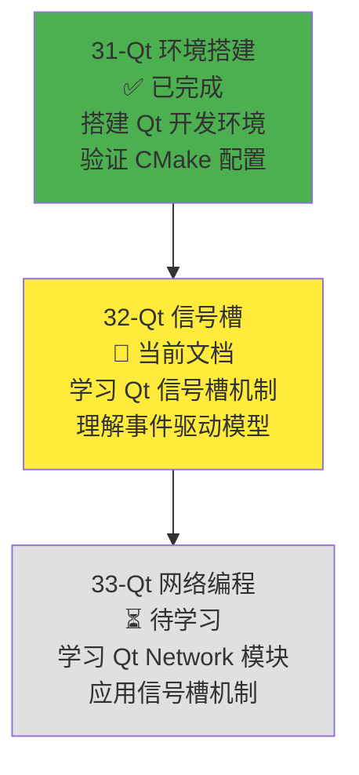
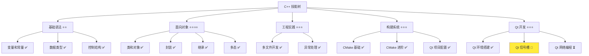
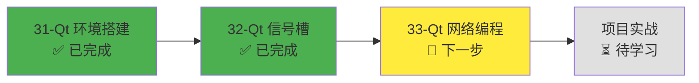
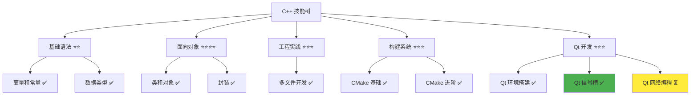

# Qt 信号槽机制

> **学习目标**：理解 Qt 信号槽机制的核心概念，掌握信号槽的连接方法，了解 Qt 对象模型和事件循环，能够使用信号槽实现对象间的通信  
> **前置知识**：C++ 面向对象基础（类、对象、继承）、Qt 环境搭建（Qt 6.9+ 安装、CMake 配置）  
> **预计时间**：90 分钟  
> **难度等级**：⭐⭐⭐  
> **技能收获**：信号槽概念、信号槽连接、Qt 对象模型、事件循环、对象间通信  
> **文档版本**：v1.0  
> **最后更新**：2025-11-20

📊 **难度等级说明**

| 等级           | 描述                       | 练习题数量     | 颜色码 |
| -------------- | -------------------------- | -------------- | ------ |
| **⭐**         | 入门级，零基础可学         | 5 题基础概念题 | 🟢绿   |
| **⭐⭐**       | 基础级，需要基本编程概念   | 5 题基础概念题 | 🟡黄   |
| **⭐⭐⭐**     | 中级，需要相关技术基础     | 3 题代码分析题 | 🟠橙   |
| **⭐⭐⭐⭐**   | 高级，需要扎实的技术功底   | 3 题代码分析题 | 🔴红   |
| **⭐⭐⭐⭐⭐** | 专家级，需要丰富的项目经验 | 2 题设计思考题 | 🟣紫   |

## 1. 学习目标

### 1.1 学习动机

- **实际需求**：Qt 应用程序中，不同对象之间需要通信和协作。信号槽机制是 Qt 的核心特性，用于实现对象间的松耦合通信，是 Qt 网络编程和 GUI 开发的基础
- **应用场景**：Qt 网络编程（网络事件通知）、Qt GUI 开发（按钮点击、窗口关闭）、对象间通信、事件驱动编程
- **技能价值**：学会后能理解 Qt 的事件驱动模型，使用信号槽实现对象间通信，为后续 Qt Network 和 Qt GUI 开发打下基础
- **数据支持**：信号槽机制是 Qt 框架的核心特性，Qt Network 模块（QUdpSocket、QTcpSocket）完全基于信号槽机制，掌握信号槽是使用 Qt 开发的必备技能

### 1.1.1 为什么需要学习 Qt 信号槽机制？

**学习路径设计**：

在学习了 Qt 环境搭建之后，我们需要学习 Qt 信号槽机制。这样做的原因：

1. **Qt Network 的基础**：Qt Network 模块（QUdpSocket、QTcpSocket）完全基于信号槽机制，网络事件通过信号槽通知
2. **Qt 的核心特性**：信号槽是 Qt 框架的核心特性，理解信号槽才能理解 Qt 的事件驱动模型
3. **对象间通信**：信号槽提供了对象间松耦合的通信方式，比传统的回调函数更灵活
4. **事件驱动编程**：Qt 应用程序是事件驱动的，信号槽是实现事件处理的核心机制

**学习路径安排**：



**为什么不在本章直接学习 Qt Network？**

- ❌ **缺少前置知识**：Qt Network 模块完全基于信号槽机制，不理解信号槽无法理解网络事件处理
- ❌ **理解困难**：没有信号槽的基础，无法理解 `readyRead`、`connected`、`disconnected` 等信号的作用
- ✅ **循序渐进**：先学习信号槽机制，理解 Qt 的事件驱动模型，再学习 Qt Network 模块

**本章的学习重点**：

- ✅ **信号槽概念**：理解信号和槽的定义、作用、关系
- ✅ **信号槽连接**：掌握 `QObject::connect()` 的使用方法
- ✅ **Qt 对象模型**：理解 QObject 基类、MOC 工具、对象树
- ✅ **事件循环**：理解 Qt 事件循环的工作原理
- ✅ **实际应用**：使用信号槽实现对象间通信

> **类比**：信号槽就像广播系统，信号像广播站发出的信号，槽像收音机接收信号。当广播站发出信号（触发信号），所有调频到该频率的收音机（连接的槽）都会收到并执行相应的操作。这种机制让对象之间可以松耦合地通信，不需要直接调用对方的函数。

### 1.2 技能树位置



> **图表说明**：C++ 技能树结构图，当前文档点亮 Qt 信号槽技能点，为后续 Qt 网络编程做准备

### 1.3 前置知识检查

在开始学习之前，请确认你已经掌握：

- [ ] C++ 面向对象基础（类、对象、继承、多态）
- [ ] Qt 环境搭建（Qt 6.9+ 安装、CMake 配置 Qt 项目）
- [ ] 基本的 C++ 语法（函数、指针、引用）
- [ ] Lambda 表达式基础（可选，文档中会使用 Lambda 表达式作为槽函数）

> **未掌握处理**：若未通过，请先复习 [Qt 环境搭建](./31-qt-environment-setup.md)、[C++ 面向对象基础](./18-classes-objects.md) 和 [Lambda 表达式](./26-lambda-expressions.md)（可选）

## 2. 核心内容

### 2.1 快速体验：理解信号槽概念

让我们先通过一个简单的例子，快速理解信号槽是什么。

#### 2.1.1 信号槽的类比

**信号槽就像广播系统**：

- **信号（Signal）**：像广播站发出的信号，表示"发生了某件事"
  - 例如：按钮被点击了、数据接收完成了、连接断开了
  - 类比：广播站发出"新闻时间到了"的信号

- **槽（Slot）**：像收音机接收信号，表示"当收到信号时执行什么操作"
  - 例如：显示消息、保存数据、关闭窗口
  - 类比：收音机收到"新闻时间到了"的信号后，播放新闻

- **连接（Connect）**：像调频，将信号和槽连接起来
  - 例如：`connect(button, &QPushButton::clicked, this, &MainWindow::onButtonClicked)`
  - 类比：将收音机调频到广播站的频率

**关键特点**：

- ✅ **松耦合**：信号发送者不需要知道谁在接收信号
- ✅ **一对多**：一个信号可以连接多个槽
- ✅ **类型安全**：编译时检查信号和槽的参数类型
- ✅ **自动断开**：对象销毁时自动断开连接

#### 2.1.2 一个简单的信号槽示例

**场景**：创建一个计数器，每次点击按钮时，计数器加一并显示当前值。

**代码示例**：

```cpp
// Counter.h
#ifndef COUNTER_H
#define COUNTER_H

#include <QtCore/QObject>
#include <QtCore/QDebug>

class Counter : public QObject {
    Q_OBJECT                            // 必须添加，用于 MOC 处理信号槽

public:
    // explicit 关键字：防止隐式类型转换
    // 例如：如果没有 explicit，可以写 Counter c = nullptr;（隐式转换）
    //       有了 explicit，必须写 Counter c(nullptr);（显式调用）
    //       这样可以避免意外的类型转换，提高代码安全性
    explicit Counter(QObject* parent = nullptr) : QObject(parent), m_value(0) {}

    int value() const { return m_value; }

public slots:
    void increment() {
        m_value++;
        qDebug() << "Counter value:" << m_value;
        emit valueChanged(m_value);     // 发出信号
    }

signals:
    void valueChanged(int newValue);    // 声明信号

private:
    int m_value;
};

#endif // COUNTER_H
```

```cpp
// main.cpp
#include <QtCore/QCoreApplication>
#include <QtCore/QDebug>
#include "Counter.h"

int main(int argc, char *argv[]) {
    QCoreApplication app(argc, argv);

    Counter counter;

    // 连接信号和槽：当 valueChanged 信号发出时，执行 lambda 表达式
    // 注意：Lambda 表达式是 C++11 的特性，已在 26-lambda-expressions.md 中学习过
    // qDebug() 是 Qt 的调试输出函数，类似于 std::cout，用于输出调试信息
    QObject::connect(&counter, &Counter::valueChanged,
                     [](int value) {
                         qDebug() << "Value changed to:" << value;
                     });

    // 调用槽函数，触发信号
    counter.increment();                // 输出：Counter value: 1
                                        //       Value changed to: 1
    counter.increment();                // 输出：Counter value: 2
                                        //       Value changed to: 2

    return 0;
}
```

**CMakeLists.txt**：

```cmake
cmake_minimum_required(VERSION 3.20)

project(SignalSlotDemo VERSION 1.0.0 LANGUAGES CXX)

set(CMAKE_CXX_STANDARD 17)
set(CMAKE_CXX_STANDARD_REQUIRED ON)
set(CMAKE_EXPORT_COMPILE_COMMANDS ON)

find_package(Qt6 REQUIRED COMPONENTS Core)

set(CMAKE_AUTOMOC ON)
set(CMAKE_AUTOUIC ON)
set(CMAKE_AUTORCC ON)

set(SOURCES
    main.cpp
    Counter.cpp
)

add_executable(${PROJECT_NAME} ${SOURCES})

target_link_libraries(${PROJECT_NAME}
    Qt6::Core
)
```

**运行结果**：

```
Counter value: 1
Value changed to: 1
Counter value: 2
Value changed to: 2
```

**代码解析**：

1. **Q_OBJECT 宏**：必须添加，告诉 MOC（Meta-Object Compiler）这个类有信号槽
2. **signals 关键字**：声明信号，信号不需要实现（只有声明）
3. **public slots 关键字**：声明槽函数，槽函数需要实现
4. **emit 关键字**：发出信号，触发所有连接的槽函数
5. **QObject::connect()**：连接信号和槽，当信号发出时，槽函数会被调用
6. **Lambda 表达式**：`[](int value) { ... }` 是 Lambda 表达式（C++11 特性），已在 [26-lambda-expressions.md](./26-lambda-expressions.md) 中学习过
7. **qDebug()**：Qt 的调试输出函数，类似于 `std::cout`，用于输出调试信息

> **快速体验总结**：通过这个简单的例子，你应该理解了：
>
> - 信号是什么（valueChanged）：表示"发生了某件事"
> - 槽是什么（increment、lambda）：表示"当收到信号时执行什么操作"
> - 如何连接信号和槽（QObject::connect）：将信号和槽关联起来
> - 信号槽的工作流程：调用槽函数 → 发出信号 → 触发连接的槽函数

### 2.2 深入理解：信号槽详解

#### 2.2.1 explicit 关键字说明

在代码示例中，我们看到了 `explicit Counter(QObject* parent = nullptr)` 这样的构造函数声明。`explicit` 关键字的作用是**防止隐式类型转换**。

**为什么需要 explicit？**

- **防止意外转换**：没有 `explicit` 时，编译器可能进行隐式类型转换，导致意外的行为
- **提高代码安全性**：强制显式调用构造函数，让代码意图更清晰
- **Qt 最佳实践**：Qt 框架中，所有接受 `QObject* parent` 参数的构造函数都使用 `explicit`

**示例对比**：

```cpp
// 没有 explicit（不推荐）
class Counter {
public:
    Counter(QObject* parent = nullptr) {}           // 没有 explicit
};

// 可以这样写（隐式转换，可能不是我们想要的）
Counter c = nullptr;                                // 编译器会隐式调用构造函数

// 有 explicit（推荐）
class Counter {
public:
    explicit Counter(QObject* parent = nullptr) {}  // 有 explicit
};

// 必须这样写（显式调用）
Counter c(nullptr);                                 // 必须显式调用构造函数
// Counter c = nullptr;                             // 错误！不能隐式转换
```

**在 Qt 中的使用**：

Qt 框架中，所有接受 `QObject* parent` 参数的构造函数都使用 `explicit`，这是 Qt 的最佳实践。这样可以避免意外的类型转换，提高代码安全性。

#### 2.2.2 信号（Signal）

**信号的定义**：

- 信号是类中声明的特殊函数，只有声明，没有实现
- 信号使用 `signals:` 关键字声明
- 信号可以带参数，参数类型会被检查
- 信号不能有返回值（void）

**信号的声明**：

```cpp
class MyClass : public QObject {
    Q_OBJECT

signals:
    void signal1();                     // 无参数信号
    void signal2(int value);            // 带一个参数
    void signal3(const QString& text);  // 带字符串参数
    // QString 是 Qt 的字符串类，类似于 std::string，但提供了更多 Qt 特有的功能
};
```

**信号的发出**：

```cpp
void MyClass::someFunction() {
    emit signal1();                     // 发出无参数信号
    emit signal2(42);                   // 发出带参数信号
    emit signal3("Hello");              // 发出字符串信号
}
```

**信号的特点**：

- ✅ **只有声明**：信号不需要实现，MOC（Meta-Object Compiler，Qt 的元对象编译器）会自动生成代码
- ✅ **自动生成**：MOC 工具会自动生成信号的实现代码
- ✅ **类型安全**：信号和槽的参数类型必须匹配（或兼容）
- ✅ **一对多**：一个信号可以连接多个槽

**类比**：信号就像广播站发出的信号，告诉所有接收者"发生了某件事"。

#### 2.2.3 槽（Slot）

**槽的定义**：

- 槽是普通的成员函数，可以被信号触发
- 槽使用 `public slots:`、`protected slots:` 或 `private slots:` 关键字声明
- 槽函数需要实现（有函数体）
- 槽函数可以有返回值，但通常不使用返回值

**槽的声明**：

```cpp
class MyClass : public QObject {
    Q_OBJECT

public slots:
    void slot1();                       // 公共槽
    void slot2(int value);              // 带参数的槽

protected slots:
    void slot3();                       // 保护槽

private slots:
    void slot4();                       // 私有槽
};
```

**槽的实现**：

```cpp
void MyClass::slot1() {
    qDebug() << "Slot1 called";
}

void MyClass::slot2(int value) {
    qDebug() << "Slot2 called with value:" << value;
}
```

**槽的特点**：

- ✅ **普通函数**：槽函数就是普通的成员函数，可以正常调用
- ✅ **可以被信号触发**：当连接的信号发出时，槽函数会被自动调用
- ✅ **可以有返回值**：虽然可以有返回值，但通常不使用
- ✅ **访问控制**：可以使用 public、protected、private 控制访问权限

**类比**：槽就像收音机，当收到信号时，执行相应的操作。

#### 2.2.4 信号槽连接（Connect）

**connect 函数语法**：

```cpp
QObject::connect(发送者, 信号, 接收者, 槽);
```

**现代 C++ 语法（推荐）**：

```cpp
// 语法：connect(发送者对象指针, &类名::信号名, 接收者对象指针, &类名::槽名)
QObject::connect(&sender, &SenderClass::signalName, &receiver, &ReceiverClass::slotName);
```

**连接示例**：

```cpp
// 示例 1：连接对象信号到对象槽
Counter counter;
QObject::connect(&counter, &Counter::valueChanged, &receiver, &Receiver::onValueChanged);

// 示例 2：连接对象信号到 Lambda 表达式
QObject::connect(&counter, &Counter::valueChanged, [](int value) {
    qDebug() << "Value changed:" << value;
});

// 示例 3：连接对象信号到普通函数（全局函数）
void globalFunction(int value) {
    qDebug() << "Global function called:" << value;
}
QObject::connect(&counter, &Counter::valueChanged, globalFunction);
```

**连接的特点**：

- ✅ **类型安全**：编译时检查信号和槽的参数类型
- ✅ **自动断开**：当发送者或接收者对象被销毁时，连接自动断开
- ✅ **一对多**：一个信号可以连接多个槽
- ✅ **多对一**：多个信号可以连接到同一个槽

**断开连接**：

```cpp
// 断开特定连接
QObject::disconnect(&sender, &SenderClass::signalName, &receiver, &ReceiverClass::slotName);

// 断开对象的所有连接
QObject::disconnect(&sender);
```

**类比**：connect 就像调频，将收音机（槽）调频到广播站（信号）的频率，当广播站发出信号时，收音机就会收到并执行操作。

#### 2.2.5 Qt 对象模型

**QObject 基类**：

- 所有使用信号槽的类都必须继承自 `QObject`
- `QObject` 提供了信号槽的基础设施
- `QObject` 支持对象树管理（父子关系）

**Q_OBJECT 宏**：

- 必须在类定义中添加 `Q_OBJECT` 宏
- `Q_OBJECT` 宏告诉 MOC 工具这个类有信号槽
- MOC 工具会生成元对象代码（moc\_\*.cpp 文件）

**MOC（Meta-Object Compiler）**：

- MOC 是 Qt 的元对象编译器
- MOC 处理包含 `Q_OBJECT` 宏的类，生成元对象代码
- 元对象代码实现了信号槽的运行时机制
- CMake 的 `CMAKE_AUTOMOC ON` 会自动调用 MOC

**对象树（Object Tree）**：

- Qt 对象可以组织成树形结构（父子关系）
- 父对象销毁时，子对象会自动销毁
- 使用 `setParent()` 设置父对象，或在构造函数中传入 parent 参数

**示例**：

```cpp
class MyClass : public QObject {
    Q_OBJECT                            // 必须添加

public:
    explicit MyClass(QObject* parent = nullptr) : QObject(parent) {
        // parent 参数用于设置父对象
    }
};
```

**类比**：QObject 就像所有 Qt 对象的"身份证"，Q_OBJECT 宏告诉 MOC"这个对象有信号槽功能"，MOC 就像"制证机器"，为对象生成信号槽的"功能代码"。

#### 2.2.6 事件循环（Event Loop）

**事件循环的概念**：

- Qt 应用程序是事件驱动的，所有操作都在事件循环中处理
- 事件循环不断检查是否有事件发生（如信号发出、用户输入、定时器到期）
- 当事件发生时，事件循环会调用相应的处理函数（如槽函数）

**QCoreApplication::exec()**：

- `QCoreApplication::exec()` 启动事件循环
- 事件循环会一直运行，直到调用 `QCoreApplication::quit()` 或程序退出
- 在事件循环中，信号槽的连接默认是异步的（信号发出后，槽函数会在事件循环的下一次迭代中调用）
  - **异步**：信号发出后，不会立即执行槽函数，而是将槽函数放入事件队列，等待事件循环处理
  - **同步**：如果使用 `Qt::DirectConnection`，槽函数会立即执行（同步）

**事件循环的工作流程**：

```
1. 启动事件循环：QCoreApplication::exec()
2. 等待事件：检查是否有信号发出、用户输入等
3. 处理事件：调用相应的槽函数
4. 返回步骤 2：继续等待下一个事件
```

**示例**：

```cpp
int main(int argc, char *argv[]) {
    QCoreApplication app(argc, argv);

    // 创建对象，连接信号槽
    Counter counter;
    QObject::connect(&counter, &Counter::valueChanged, [](int value) {
        qDebug() << "Value:" << value;
    });

    // 启动事件循环
    return app.exec();                  // 事件循环开始运行
}
```

**类比**：事件循环就像"总调度中心"，不断检查是否有事件发生，当信号发出时，事件循环会"调度"相应的槽函数执行。

### 2.3 实践应用：信号槽示例项目

#### 2.3.1 项目场景

创建一个简单的消息通知系统，使用信号槽实现对象间的通信。

**需求**：

- 创建一个 `MessageSender` 类，可以发送消息
- 创建一个 `MessageReceiver` 类，可以接收消息
- 使用信号槽连接发送者和接收者
- 当发送者发送消息时，接收者自动收到并处理

#### 2.3.2 项目实现

**项目结构**：

```ini
signal-slot-demo/
├── CMakeLists.txt
├── MessageSender.h
├── MessageSender.cpp
├── MessageReceiver.h
├── MessageReceiver.cpp
└── main.cpp
```

**MessageSender.h**：

```cpp
#ifndef MESSAGESENDER_H
#define MESSAGESENDER_H

#include <QtCore/QObject>
#include <QtCore/QString>

class MessageSender : public QObject {
    Q_OBJECT

public:
    explicit MessageSender(QObject* parent = nullptr) : QObject(parent) {}

    void sendMessage(const QString& message) {
        qDebug() << "[Sender] Sending message:" << message;
        emit messageSent(message);              // 发出信号
    }

signals:
    void messageSent(const QString& message);   // 声明信号

private:
    QString m_name;
};

#endif // MESSAGESENDER_H
```

**MessageReceiver.h**：

```cpp
#ifndef MESSAGERECEIVER_H
#define MESSAGERECEIVER_H

#include <QtCore/QObject>
#include <QtCore/QString>
#include <QtCore/QDebug>

class MessageReceiver : public QObject {
    Q_OBJECT

public:
    explicit MessageReceiver(const QString& name, QObject* parent = nullptr)
        : QObject(parent), m_name(name) {}

public slots:
    void onMessageReceived(const QString& message) {
        qDebug() << "[Receiver:" << m_name << "] Received:" << message;
    }

private:
    QString m_name;
};

#endif // MESSAGERECEIVER_H
```

**main.cpp**：

```cpp
#include <QtCore/QCoreApplication>
#include <QtCore/QDebug>
#include "MessageSender.h"
#include "MessageReceiver.h"

int main(int argc, char *argv[]) {
    QCoreApplication app(argc, argv);

    // 创建发送者和接收者
    MessageSender sender;
    MessageReceiver receiver1("Receiver1");
    MessageReceiver receiver2("Receiver2");

    // 连接信号和槽：一个信号连接多个槽（一对多）
    QObject::connect(&sender, &MessageSender::messageSent,
                     &receiver1, &MessageReceiver::onMessageReceived);
    QObject::connect(&sender, &MessageSender::messageSent,
                     &receiver2, &MessageReceiver::onMessageReceived);

    // 发送消息，触发信号，所有连接的槽函数都会被调用
    sender.sendMessage("Hello, Qt!");
    sender.sendMessage("This is a signal-slot demo");

    return 0;
}
```

**CMakeLists.txt**：

```cmake
cmake_minimum_required(VERSION 3.20)

project(SignalSlotDemo VERSION 1.0.0 LANGUAGES CXX)

set(CMAKE_CXX_STANDARD 17)
set(CMAKE_CXX_STANDARD_REQUIRED ON)
set(CMAKE_EXPORT_COMPILE_COMMANDS ON)

find_package(Qt6 REQUIRED COMPONENTS Core)

set(CMAKE_AUTOMOC ON)
set(CMAKE_AUTOUIC ON)
set(CMAKE_AUTORCC ON)

set(SOURCES
    main.cpp
    MessageSender.cpp
    MessageReceiver.cpp
)

add_executable(${PROJECT_NAME} ${SOURCES})

target_link_libraries(${PROJECT_NAME}
    Qt6::Core
)
```

**运行结果**：

```
[Sender] Sending message: "Hello, Qt!"
[Receiver: Receiver1] Received: "Hello, Qt!"
[Receiver: Receiver2] Received: "Hello, Qt!"
[Sender] Sending message: "This is a signal-slot demo"
[Receiver: Receiver1] Received: "This is a signal-slot demo"
[Receiver: Receiver2] Received: "This is a signal-slot demo"
```

**代码解析**：

1. **信号声明**：`MessageSender` 类声明了 `messageSent` 信号
2. **槽函数**：`MessageReceiver` 类实现了 `onMessageReceived` 槽函数
3. **连接信号槽**：使用 `QObject::connect()` 连接信号和槽
4. **一对多连接**：一个信号连接了两个槽函数（receiver1 和 receiver2）
5. **触发信号**：调用 `sendMessage()` 时，发出 `messageSent` 信号，所有连接的槽函数都会被调用

**设计思路**：

- ✅ **松耦合**：`MessageSender` 不需要知道谁在接收消息
- ✅ **一对多**：一个信号可以连接多个接收者
- ✅ **类型安全**：信号和槽的参数类型必须匹配
- ✅ **自动管理**：对象销毁时，连接自动断开

### 2.4 深入理解：信号槽的高级特性

#### 2.4.1 Lambda 表达式作为槽

**使用 Lambda 表达式**：

> **前置知识**：Lambda 表达式是 C++11 的特性，已在 [26-lambda-expressions.md](./26-lambda-expressions.md) 中详细学习过。如果还不熟悉，建议先复习该文档。

```cpp
Counter counter;

// Lambda 表达式作为槽函数
// Lambda 表达式语法：[捕获列表](参数列表) { 函数体 }
QObject::connect(&counter, &Counter::valueChanged, [](int value) {
    qDebug() << "Lambda received:" << value;
});

counter.increment();
```

**捕获外部变量**：

```cpp
int count = 0;

QObject::connect(&counter, &Counter::valueChanged, [&count](int value) {
    count++;
    qDebug() << "Count:" << count << ", Value:" << value;
});
```

**优势**：

- ✅ **简洁**：不需要定义单独的槽函数
- ✅ **灵活**：可以捕获外部变量
- ✅ **适合简单操作**：适合简单的响应逻辑

#### 2.4.2 信号槽的参数类型转换

**自动类型转换**：

- Qt 支持一些自动类型转换（如 `int` 和 `double` 之间的转换）
- 但为了类型安全，建议信号和槽的参数类型完全匹配

**示例**：

```cpp
// 信号：void signal1(int value);
// 槽：void slot1(double value);        // 可以自动转换，但不推荐

// 推荐：参数类型完全匹配
// 信号：void signal1(int value);
// 槽：void slot1(int value);           // 类型匹配
```

#### 2.4.3 信号槽的连接方式

**Qt::ConnectionType**：

```cpp
// 默认连接方式：Qt::AutoConnection（自动选择）
QObject::connect(&sender, &SenderClass::signalName, &receiver, &ReceiverClass::slotName);

// 直接连接：Qt::DirectConnection（立即执行，在同一线程）
QObject::connect(&sender, &SenderClass::signalName, &receiver, &ReceiverClass::slotName,
                 Qt::DirectConnection);

// 队列连接：Qt::QueuedConnection（放入事件队列，异步执行）
QObject::connect(&sender, &SenderClass::signalName, &receiver, &ReceiverClass::slotName,
                 Qt::QueuedConnection);
```

**连接方式说明**：

- **Qt::AutoConnection**（默认）：自动选择连接方式
  - 如果发送者和接收者在同一线程，使用直接连接
  - 如果发送者和接收者在不同线程，使用队列连接
- **Qt::DirectConnection**：直接连接，立即执行槽函数
- **Qt::QueuedConnection**：队列连接，将槽函数放入事件队列，异步执行

**使用建议**：

- 大多数情况下使用默认连接（Qt::AutoConnection）
- 跨线程通信时使用队列连接（Qt::QueuedConnection）
- 需要立即执行时使用直接连接（Qt::DirectConnection）

### 2.5 常见问题排查

#### 2.5.1 信号槽连接失败

**问题**：

信号槽连接后，槽函数没有被调用。

**可能原因**：

1. **忘记添加 Q_OBJECT 宏**：类定义中必须添加 `Q_OBJECT` 宏
2. **MOC 没有运行**：确保 `CMAKE_AUTOMOC ON` 已设置
3. **信号没有发出**：检查是否调用了 `emit` 关键字
4. **连接失败**：检查 `connect()` 的返回值（应该返回 true）

**解决方法**：

```cpp
// 检查连接是否成功
bool success = QObject::connect(&sender, &SenderClass::signalName,
                                &receiver, &ReceiverClass::slotName);
if (!success) {
    qDebug() << "Connection failed!";
}
```

#### 2.5.2 MOC 编译错误

**问题**：

编译时出现 MOC 相关错误。

**错误信息**：

```
error: undefined reference to `vtable for MyClass'
```

**解决方法**：

1. **检查 Q_OBJECT 宏**：确保类定义中有 `Q_OBJECT` 宏
2. **检查 CMAKE_AUTOMOC**：确保 `CMAKE_AUTOMOC ON` 已设置
3. **清理构建目录**：删除 `build` 目录，重新构建

#### 2.5.3 信号槽参数类型不匹配

**问题**：

信号和槽的参数类型不匹配。

**错误信息**：

```
error: no matching function for call to 'QObject::connect'
```

**解决方法**：

- 确保信号和槽的参数类型完全匹配
- 或者使用兼容的类型（如 `int` 和 `double`）

## 3. 实践应用

### 3.1 项目场景

在 QtLanChat 项目中，信号槽机制用于：

- **网络事件处理**：QUdpSocket、QTcpSocket 的网络事件通过信号槽通知
- **对象间通信**：不同对象之间通过信号槽进行通信
- **事件驱动编程**：Qt 应用程序是事件驱动的，信号槽是实现事件处理的核心机制

### 3.2 实际应用示例

**Qt Network 中的信号槽**（预览，将在 33-qt-network-programming.md 详细学习）：

```cpp
QUdpSocket* socket = new QUdpSocket(this);

// 连接网络事件信号到槽函数
QObject::connect(socket, &QUdpSocket::readyRead, this, [socket]() {
    // 当有数据可读时，这个槽函数会被调用
    // QByteArray 是 Qt 的字节数组类，用于存储二进制数据（类似于 std::vector<char>）
    QByteArray data = socket->readAll();
    qDebug() << "Received data:" << data;
});

QObject::connect(socket, &QUdpSocket::connected, this, []() {
    qDebug() << "Socket connected";
});

QObject::connect(socket, &QUdpSocket::disconnected, this, []() {
    qDebug() << "Socket disconnected";
});
```

**说明**：

- `readyRead`：当有数据可读时发出信号
- `connected`：当连接建立时发出信号
- `disconnected`：当连接断开时发出信号
- 这些信号都是 Qt Network 模块提供的，通过信号槽机制实现事件驱动编程

### 3.3 设计思路

**为什么使用信号槽**：

- **松耦合**：发送者不需要知道谁在接收信号
- **一对多**：一个信号可以连接多个槽函数
- **类型安全**：编译时检查参数类型
- **自动管理**：对象销毁时自动断开连接
- **事件驱动**：适合事件驱动的编程模型

## 4. 练习与测试

### 4.1 练习题

#### 练习 1：理解信号槽概念

**题目**：解释信号槽的概念，并说明信号和槽的关系。

**要求**：

- 解释信号是什么
- 解释槽是什么
- 说明信号和槽如何连接
- 说明信号槽的优势

**参考答案**：

**信号（Signal）**：

- 信号是类中声明的特殊函数，只有声明，没有实现
- 信号表示"发生了某件事"，如按钮被点击、数据接收完成
- 信号使用 `signals:` 关键字声明
- 信号使用 `emit` 关键字发出

**槽（Slot）**：

- 槽是普通的成员函数，可以被信号触发
- 槽表示"当收到信号时执行什么操作"，如显示消息、保存数据
- 槽使用 `public slots:`、`protected slots:` 或 `private slots:` 关键字声明
- 槽函数需要实现（有函数体）

**连接（Connect）**：

- 使用 `QObject::connect()` 连接信号和槽
- 语法：`QObject::connect(发送者, &类名::信号名, 接收者, &类名::槽名)`
- 当信号发出时，所有连接的槽函数都会被调用

**优势**：

- 松耦合：发送者不需要知道谁在接收信号
- 一对多：一个信号可以连接多个槽函数
- 类型安全：编译时检查参数类型
- 自动管理：对象销毁时自动断开连接

#### 练习 2：实现信号槽连接

**题目**：创建一个 `Timer` 类，每秒发出一次 `timeout` 信号，连接到一个槽函数打印当前时间。

**要求**：

1. 创建 `Timer` 类，继承自 `QObject`
2. 声明 `timeout` 信号
3. 实现 `start()` 方法，每秒发出一次 `timeout` 信号
4. 在 `main.cpp` 中连接信号和槽，打印时间

**参考答案**：

**Timer.h**：

```cpp
#ifndef TIMER_H
#define TIMER_H

#include <QtCore/QObject>
#include <QtCore/QTimer>
// QTimer 是 Qt 的定时器类，用于定时触发事件（将在后续文档中详细学习）

class Timer : public QObject {
    Q_OBJECT

public:
    explicit Timer(QObject* parent = nullptr) : QObject(parent) {
        m_timer = new QTimer(this);
        QObject::connect(m_timer, &QTimer::timeout, this, &Timer::onTimeout);
    }

    void start(int intervalMs = 1000) {
        m_timer->start(intervalMs);
    }

    void stop() {
        m_timer->stop();
    }

signals:
    void timeout();                     // 声明信号

private slots:
    void onTimeout() {
        emit timeout();                 // 发出信号
    }

private:
    QTimer* m_timer;
};

#endif // TIMER_H
```

**main.cpp**：

```cpp
#include <QtCore/QCoreApplication>
#include <QtCore/QDebug>
#include <QtCore/QDateTime>
// QDateTime 是 Qt 的日期时间类，用于处理日期和时间
#include "Timer.h"

int main(int argc, char *argv[]) {
    QCoreApplication app(argc, argv);
    // QCoreApplication 是 Qt 应用程序的核心类，提供事件循环和应用程序管理功能

    Timer timer;

    // 连接信号和槽
    QObject::connect(&timer, &Timer::timeout, []() {
        qDebug() << "Current time:" << QDateTime::currentDateTime().toString();
    });

    timer.start(1000);                  // 每秒触发一次

    return app.exec();
}
```

#### 练习 3：理解 Qt 对象模型

**题目**：解释 QObject、Q_OBJECT 宏和 MOC 的作用。

**要求**：

- 解释 QObject 基类的作用
- 解释 Q_OBJECT 宏的作用
- 解释 MOC 工具的作用
- 说明它们之间的关系

**参考答案**：

**QObject 基类**：

- 所有使用信号槽的类都必须继承自 `QObject`
- `QObject` 提供了信号槽的基础设施
- `QObject` 支持对象树管理（父子关系）

**Q_OBJECT 宏**：

- 必须在类定义中添加 `Q_OBJECT` 宏
- `Q_OBJECT` 宏告诉 MOC 工具这个类有信号槽
- MOC 工具会处理包含 `Q_OBJECT` 宏的类

**MOC（Meta-Object Compiler）**：

- MOC 是 Qt 的元对象编译器
- MOC 处理包含 `Q_OBJECT` 宏的类，生成元对象代码（moc\_\*.cpp 文件）
- 元对象代码实现了信号槽的运行时机制
- CMake 的 `CMAKE_AUTOMOC ON` 会自动调用 MOC

**关系**：

- QObject 提供基础功能
- Q_OBJECT 宏标记类需要 MOC 处理
- MOC 生成信号槽的实现代码
- 三者配合实现信号槽机制

### 4.2 测试题

1. **关于信号槽，下列说法正确的是：**
   A. 信号必须有实现代码

   B. 信号只有声明，没有实现，MOC 会自动生成代码

   C. 槽函数不能有参数

   D. 信号和槽必须在同一个类中

   **答案**：B

   **解析**：
   - A 错误：信号只有声明，没有实现
   - B 正确：信号只有声明，MOC 会自动生成实现代码
   - C 错误：槽函数可以有参数，参数类型必须与信号匹配
   - D 错误：信号和槽可以在不同的类中

2. **关于 Q_OBJECT 宏，下列说法正确的是：**
   A. Q_OBJECT 宏是可选的，不添加也能使用信号槽

   B. Q_OBJECT 宏必须添加，告诉 MOC 这个类有信号槽

   C. Q_OBJECT 宏只需要在头文件中添加

   D. Q_OBJECT 宏会自动实现信号槽函数

   **答案**：B

   **解析**：
   - A 错误：Q_OBJECT 宏必须添加，否则 MOC 不会处理这个类
   - B 正确：Q_OBJECT 宏必须添加，告诉 MOC 这个类有信号槽
   - C 正确：Q_OBJECT 宏只需要在头文件中添加（类定义中）
   - D 错误：Q_OBJECT 宏不会实现槽函数，只生成信号槽的基础代码

3. **关于信号槽连接，下列说法正确的是：**
   A. 一个信号只能连接一个槽

   B. 一个信号可以连接多个槽（一对多）

   C. 信号和槽必须在同一线程

   D. 连接后不能断开

   **答案**：B

   **解析**：
   - A 错误：一个信号可以连接多个槽
   - B 正确：一个信号可以连接多个槽，实现一对多通信
   - C 错误：信号和槽可以在不同线程，使用队列连接
   - D 错误：可以使用 `disconnect()` 断开连接

### 4.3 常见问题 FAQ

- **Q1：为什么信号槽连接后，槽函数没有被调用？**
  - **A：**检查以下几点：1) 是否添加了 `Q_OBJECT` 宏；2) 是否设置了 `CMAKE_AUTOMOC ON`；3) 是否调用了 `emit` 关键字发出信号；4) 检查 `connect()` 的返回值是否成功

- **Q2：MOC 编译错误怎么办？**
  - **A：**检查类定义中是否有 `Q_OBJECT` 宏，确保 `CMAKE_AUTOMOC ON` 已设置，清理构建目录重新构建

- **Q3：信号和槽的参数类型必须完全匹配吗？**
  - **A：**建议完全匹配，Qt 支持一些自动类型转换（如 `int` 和 `double`），但为了类型安全，建议参数类型完全匹配

- **Q4：信号槽和回调函数有什么区别？**
  - **A：**信号槽是类型安全的（编译时检查），支持一对多连接，自动管理连接生命周期；回调函数需要手动管理，类型安全性较差

## 5. 资源与扩展

### 5.1 基础资源

- **Qt 官方文档**：[Qt Signals & Slots](https://doc.qt.io/qt-6/signalsandslots.html) - Qt 信号槽官方文档
- **Qt 对象模型**：[Qt Object Model](https://doc.qt.io/qt-6/object.html) - Qt 对象模型文档
- **MOC 文档**：[Qt MOC](https://doc.qt.io/qt-6/moc.html) - MOC 工具文档

### 5.2 扩展阅读

- **Qt 事件系统**：[Qt Event System](https://doc.qt.io/qt-6/eventsandfilters.html) - Qt 事件系统文档
- **Qt 线程和信号槽**：[Threads and QObjects](https://doc.qt.io/qt-6/threads-qobject.html) - 线程中的信号槽使用
- **Qt 元对象系统**：[Qt Meta-Object System](https://doc.qt.io/qt-6/metaobjects.html) - Qt 元对象系统文档

### 5.3 下一步学习

完成本文档后，建议学习：

- **33-qt-network-programming.md**：Qt 网络编程，学习如何使用信号槽处理网络事件（QUdpSocket、QTcpSocket）

## 6. 课后作业及参考答案

### 6.1 学习检查清单

- [ ] 能够解释信号槽的概念和作用
- [ ] 能够声明信号和槽函数
- [ ] 能够使用 `QObject::connect()` 连接信号和槽
- [ ] 能够理解 QObject、Q_OBJECT 宏和 MOC 的作用
- [ ] 能够理解事件循环的工作原理
- [ ] 能够使用信号槽实现对象间通信

### 6.2 综合练习

**作业题目**：创建一个简单的温度监控系统

**要求**：

1. 创建 `TemperatureSensor` 类，继承自 `QObject`
2. 声明 `temperatureChanged(double temperature)` 信号
3. 实现 `setTemperature(double temp)` 方法，设置温度并发出信号
4. 创建 `TemperatureDisplay` 类，实现 `onTemperatureChanged(double temp)` 槽函数，显示温度
5. 在 `main.cpp` 中连接信号和槽
6. 测试：设置不同的温度值，验证信号槽是否正常工作

**时间估算**：45 分钟

**参考答案**：

**TemperatureSensor.h**：

```cpp
#ifndef TEMPERATURESENSOR_H
#define TEMPERATURESENSOR_H

#include <QtCore/QObject>

class TemperatureSensor : public QObject {
    Q_OBJECT

public:
    explicit TemperatureSensor(QObject* parent = nullptr) : QObject(parent), m_temperature(0.0) {}

    void setTemperature(double temp) {
        if (m_temperature != temp) {
            m_temperature = temp;
            emit temperatureChanged(m_temperature);
        }
    }

    double temperature() const { return m_temperature; }

signals:
    void temperatureChanged(double temperature);

private:
    double m_temperature;
};

#endif // TEMPERATURESENSOR_H
```

**TemperatureDisplay.h**：

```cpp
#ifndef TEMPERATUREDISPLAY_H
#define TEMPERATUREDISPLAY_H

#include <QtCore/QObject>
#include <QtCore/QDebug>

class TemperatureDisplay : public QObject {
    Q_OBJECT

public:
    explicit TemperatureDisplay(QObject* parent = nullptr) : QObject(parent) {}

public slots:
    void onTemperatureChanged(double temperature) {
        qDebug() << "Temperature:" << temperature << "°C";
        if (temperature > 30.0) {
            qDebug() << "Warning: Temperature too high!";
        }
    }
};

#endif // TEMPERATUREDISPLAY_H
```

**main.cpp**：

```cpp
#include <QtCore/QCoreApplication>
#include "TemperatureSensor.h"
#include "TemperatureDisplay.h"

int main(int argc, char *argv[]) {
    QCoreApplication app(argc, argv);

    TemperatureSensor sensor;
    TemperatureDisplay display;

    QObject::connect(&sensor, &TemperatureSensor::temperatureChanged,
                     &display, &TemperatureDisplay::onTemperatureChanged);

    sensor.setTemperature(25.0);
    sensor.setTemperature(30.5);
    sensor.setTemperature(35.0);

    return 0;
}
```

**评分标准**：类设计（30%）、信号槽连接（30%）、代码正确性（30%）、问题排查（10%）

## 7. 下一步学习

### 7.1 学习路径说明

**完整学习路径**：



**为什么这样安排学习路径？**

1. **31-qt-environment-setup.md（已完成）**：
   - ✅ 搭建 Qt 开发环境（安装 Qt6、配置环境变量）
   - ✅ 验证 CMake 配置是否正确

2. **32-qt-signals-slots.md（当前文档，已完成）**：
   - ✅ 学习 Qt 信号槽机制（Qt Network 的基础）
   - ✅ 理解 Qt 对象模型和事件循环
   - ✅ 掌握信号槽的连接方法

3. **33-qt-network-programming.md（下一步）**：
   - 🔄 学习 Qt Network 模块，应用信号槽机制处理网络事件

**学习时间规划**：

| 文档                         | 预计时间 | 累计时间 | 状态      |
| ---------------------------- | -------- | -------- | --------- |
| 31-qt-environment-setup.md   | 1h       | 1h       | ✅ 已完成 |
| 32-qt-signals-slots.md       | 1.5h     | 2.5h     | ✅ 已完成 |
| 33-qt-network-programming.md | 2.5h     | 5h       | 🔄 下一步 |

**下一篇**：[Qt 网络编程](./33-qt-network-programming.md)

**学习路径**：

1. ✅ 31-qt-environment-setup.md - 已完成（搭建 Qt 开发环境，验证 CMake 配置）
2. ✅ 32-qt-signals-slots.md - 已完成（学习 Qt 信号槽机制，理解事件驱动模型）
3. 🔄 33-qt-network-programming.md - 下一步（学习 Qt Network 模块，应用信号槽机制）

**技能树更新**：



**学习成果**：

- **理解概念**：能够解释信号槽的概念、作用和工作原理
- **实际操作**：能够声明信号和槽、连接信号槽、使用信号槽实现对象间通信
- **问题排查**：能够排查信号槽连接失败、MOC 编译错误等问题
- **掌握度自评**：80%

> **指导建议**：<50% 建议复习，50-80% 继续学习，>80% 可进入下一阶段

---

**文档质量检查**：

- [x] 学习目标明确且可验证
- [x] 概念解释清晰，配有生活化比喻
- [x] 代码示例完整可运行
- [x] 练习题有答案
- [x] 技能收获明确
- [x] 抽象概念配有生活化比喻
- [x] 比喻体系一致，避免概念混乱
- [x] 文档长度适中，聚焦核心概念

---

> **特别说明**：
>
> 1. **本文档的定位**：专注于 Qt 信号槽机制，包括信号槽概念、连接方法、Qt 对象模型、事件循环。不涉及 Qt Network 的具体使用（将在后续文档中学习）。
> 2. **为什么先学信号槽**：Qt Network 模块完全基于信号槽机制，网络事件通过信号槽通知。不理解信号槽，无法理解 `readyRead`、`connected`、`disconnected` 等信号的作用。
> 3. **后续学习路径**：学完信号槽后，将学习 Qt Network 模块，应用信号槽机制处理网络事件。
> 4. **实践导向**：本文档提供了完整的信号槽示例项目，可以直接应用到实际项目中。
