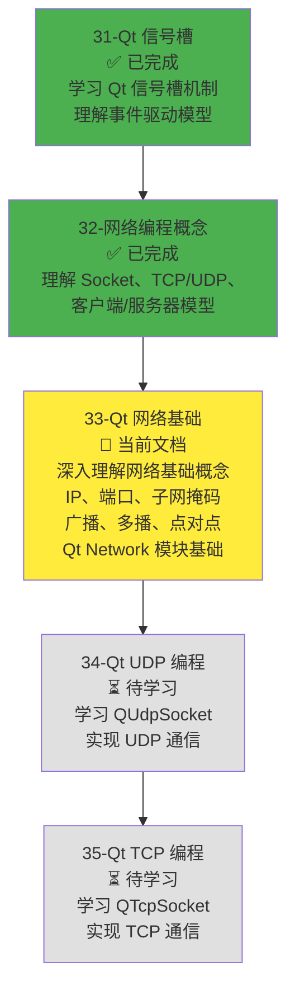
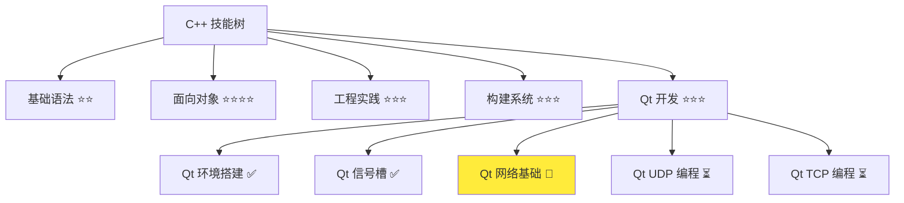
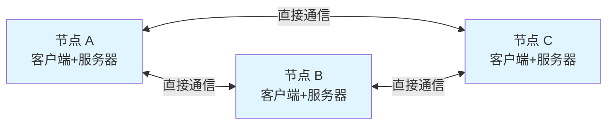
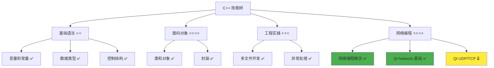

# Qt 网络编程基础

> **学习目标**：深入理解网络编程的核心概念（IP、端口、子网掩码、广播、多播、点对点通讯），掌握 Qt Network 模块的基础知识，理解网络事件处理机制，为后续 UDP/TCP 编程打下坚实基础  
> **前置知识**：C++ 面向对象基础、Qt 信号槽机制、网络编程概念（Socket、TCP/UDP、客户端/服务器模型）  
> **预计时间**：90 分钟  
> **难度等级**：⭐⭐⭐  
> **技能收获**：网络基础概念、IP 地址、端口号、子网掩码、广播/多播/点对点、Qt Network 模块、QHostAddress、QNetworkInterface、网络事件处理  
> **文档版本**：v1.1  
> **最后更新**：2025-11-23  
> **配套代码**：`src/stage1/33-qt-network-basics/`（4 个示例程序，详见文档中的代码位置标注）

📊 **难度等级说明**

| 等级           | 描述                       | 练习题数量     | 颜色码 |
| -------------- | -------------------------- | -------------- | ------ |
| **⭐**         | 入门级，零基础可学         | 5 题基础概念题 | 🟢绿   |
| **⭐⭐**       | 基础级，需要基本编程概念   | 5 题基础概念题 | 🟡黄   |
| **⭐⭐⭐**     | 中级，需要相关技术基础     | 3 题代码分析题 | 🟠橙   |
| **⭐⭐⭐⭐**   | 高级，需要扎实的技术功底   | 3 题代码分析题 | 🔴红   |
| **⭐⭐⭐⭐⭐** | 专家级，需要丰富的项目经验 | 2 题设计思考题 | 🟣紫   |

## 1. 学习目标

### 1.1 学习动机

- **实际需求**：开发局域网聊天软件和屏幕共享软件需要深入理解网络基础概念。IP、端口、子网掩码、广播、多播等概念是网络编程的基石，理解这些概念才能正确使用 Qt Network 模块
- **应用场景**：局域网设备发现、1v1 聊天、群组聊天、文件传输、屏幕共享、在线游戏、物联网设备通信
- **技能价值**：学会后能深入理解网络通信原理，正确使用 Qt Network 模块，为后续 UDP/TCP 编程打下坚实基础
- **数据支持**：网络基础概念是网络编程的核心，掌握这些概念是开发高质量网络应用程序的必备知识

### 1.1.1 为什么需要深入学习网络基础？

**学习路径设计**：

在学习了网络编程概念（32-network-programming-concepts.md）之后，我们需要深入学习网络基础概念，然后才能学习 Qt Network 的具体实现。这样做的原因：

1. **理解原理**：深入理解 IP、端口、子网掩码等概念，才能正确配置网络参数
2. **选择方案**：理解广播、多播、点对点的区别，才能为不同场景选择合适的通信方式
3. **调试能力**：理解底层概念，遇到网络问题时能快速定位和解决
4. **应用实践**：理解 Qt Network 模块的基础类，才能正确使用 QUdpSocket 和 QTcpSocket

**学习路径安排**：



**为什么不在本章直接学习 QUdpSocket 和 QTcpSocket？**

- ❌ **基础不牢**：没有深入理解 IP、端口、广播、多播等概念，直接学习 API 会感到困惑
- ❌ **理解困难**：不理解网络基础，无法正确配置网络参数，容易出错
- ✅ **循序渐进**：先深入理解基础概念，再学习具体 API，学习效果更好

**本章的学习重点**：

- ✅ **网络基础概念**：IP 地址、端口号、子网掩码、广播、多播、点对点通讯
- ✅ **Qt Network 模块**：理解 Qt Network 模块的作用和特点
- ✅ **基础类**：QHostAddress、QNetworkInterface 等基础类的使用
- ✅ **网络事件处理**：理解网络事件处理机制（信号槽、事件循环）
- ❌ **不涉及具体通信**：不学习 QUdpSocket 和 QTcpSocket 的具体使用（这些在后续文档中学习）

> **类比**：就像学做菜，先学食材知识（网络基础概念），再学如何使用厨具（Qt Network 基础类），最后学如何做菜（UDP/TCP 编程）。如果直接学做菜，不知道为什么要这样做，学习效果不好。

### 1.2 技能树位置



> **图表说明**：C++ 技能树结构图，当前文档点亮 Qt 网络基础技能点，为后续 UDP/TCP 编程做准备

### 1.3 前置知识检查

在开始学习之前，请确认你已经掌握：

- [ ] C++ 面向对象基础（类、对象、继承）
- [ ] Qt 信号槽机制（信号槽概念、QObject::connect、事件循环）
- [ ] 网络编程概念（Socket、TCP/UDP 协议、客户端/服务器模型）
- [ ] Qt 环境搭建（Qt 6.9+ 安装、CMake 配置 Qt 项目）
- [ ] Lambda 表达式基础（可选，文档中会使用 Lambda 表达式作为槽函数）

> **未掌握处理**：若未通过，请先复习 [Qt 信号槽机制](./31-qt-signals-slots.md)、[网络编程概念](./32-network-programming-concepts.md)、[Qt 环境搭建](./30-qt-environment-setup.md) 和 [Lambda 表达式](./26-lambda-expressions.md)（可选）

## 2. 核心内容

### 2.1 Qt Network 模块概述

#### 2.1.1 Qt Network 模块是什么？

**Qt Network 模块**：Qt 框架提供的网络编程模块，封装了底层网络操作，提供了简单易用的网络编程接口。

**Qt Network 模块的类比**：

Qt Network 模块就像**网络通信的封装工具**：

- **系统 Socket API**：就像原始的邮局操作，需要自己处理所有细节（填写地址、贴邮票、投递）
- **Qt Network**：就像快递服务，封装了所有细节，只需要告诉它"发送到哪里"和"发送什么"，它会自动处理
- **信号槽机制**：就像快递通知，当包裹到达时（数据到达），自动通知你（触发信号），你执行相应操作（槽函数）

**Qt Network 模块的主要类**：

| 类名                  | 作用                 | 使用场景                   |
| --------------------- | -------------------- | -------------------------- |
| **QUdpSocket**        | UDP 通信类           | 无连接的数据传输（快速）   |
| **QTcpSocket**        | TCP 通信类（客户端） | 面向连接的数据传输（可靠） |
| **QTcpServer**        | TCP 服务器类         | 创建 TCP 服务器            |
| **QHostAddress**      | IP 地址类            | 表示和操作 IP 地址         |
| **QNetworkInterface** | 网络接口类           | 获取网络接口信息           |

**Qt Network 模块的特点**：

1. **基于信号槽**：网络事件通过信号槽通知，符合 Qt 的事件驱动模型
2. **异步操作**：网络操作是异步的，不会阻塞程序执行
3. **跨平台**：一套代码可以在不同平台运行
4. **类型安全**：使用 Qt 类型（QString、QByteArray），类型安全
5. **自动管理**：自动处理连接、错误、超时等

**CMake 配置**：

使用 Qt Network 模块需要在 CMakeLists.txt 中链接 `Qt6::Network`：

```cmake
find_package(Qt6 REQUIRED COMPONENTS Core Network)

target_link_libraries(${PROJECT_NAME} Qt6::Core Qt6::Network)
```

#### 2.1.2 网络事件处理机制

**Qt Network 完全基于信号槽机制**：网络事件通过信号槽通知，这是 Qt Network 的核心特点。

**主要网络事件信号**：

| 信号              | 触发时机              | 使用场景         |
| ----------------- | --------------------- | ---------------- |
| **readyRead**     | 当有数据到达时发出    | UDP/TCP 数据接收 |
| **connected**     | 连接成功时发出（TCP） | TCP 客户端连接   |
| **disconnected**  | 断开连接时发出（TCP） | TCP 连接断开     |
| **errorOccurred** | 发生错误时发出        | 网络错误处理     |

**为什么使用信号槽处理网络事件？**

- ✅ **异步操作**：网络操作是异步的，不会阻塞程序执行
- ✅ **事件驱动**：符合 Qt 的事件驱动模型，代码更清晰
- ✅ **松耦合**：网络操作和业务逻辑分离，代码更易维护
- ✅ **自动触发**：当事件发生时自动触发，不需要轮询检查

> **类比**：网络事件处理就像**快递通知**：
>
> - **readyRead 信号**：就像"包裹已到达"的通知，当数据到达时自动通知你
> - **connected 信号**：就像"已连接到快递公司"的通知，连接成功时通知你
> - **disconnected 信号**：就像"已断开连接"的通知，断开连接时通知你
> - **槽函数**：就像你收到通知后执行的操作，如查看包裹、保存数据

### 2.2 IP 地址详解

#### 2.2.1 IP 地址基础

**IP 地址（Internet Protocol Address）**：网络中每台计算机的唯一标识，就像电话号码。

**IP 地址的格式**：

- **IPv4**：32 位数字，用点分十进制表示，如 `192.168.1.100`
- **IPv6**：128 位数字，用冒号分隔的十六进制表示，如 `2001:0db8:85a3:0000:0000:8a2e:0370:7334`

> **类比**：IP 地址就像电话号码，标识网络中的每台计算机

**IPv4 地址结构**：

IPv4 地址由 4 个字节（32 位）组成，每个字节用 0-255 的十进制数表示，用点分隔：

> **📌 说明**：以下示例以子网掩码 `/24`（255.255.255.0）为例，说明网络地址和主机地址的划分。不同的子网掩码会划分不同的网络地址和主机地址范围。

```
192.168.1.100
│   │   │   │
│   │   │   └─ 主机地址（0-255）
│   │   └───── 网络地址（0-255）
│   └───────── 网络地址（0-255）
└───────────── 网络地址（0-255）
```

**说明**：

- **网络地址部分**：`192.168.1`（前 24 位），标识网络
- **主机地址部分**：`100`（后 8 位），标识网络中的具体设备
- **完整网络地址**：`192.168.1.0`（主机地址为 0 表示网络本身）

**特殊 IP 地址**：

| IP 地址                   | 名称      | 用途                       |
| ------------------------- | --------- | -------------------------- |
| **127.0.0.1**             | localhost | 本机地址，用于本地测试     |
| **192.168.x.x**           | 私有地址  | 局域网地址，用于局域网通信 |
| **10.x.x.x**              | 私有地址  | 大型局域网地址             |
| **172.16.x.x-172.31.x.x** | 私有地址  | 中型局域网地址             |
| **255.255.255.255**       | 广播地址  | 向局域网内所有设备发送消息 |

#### 2.2.2 子网掩码（Subnet Mask）

**子网掩码（Subnet Mask）**：用于区分 IP 地址中的网络部分和主机部分。

**子网掩码的作用**：

- **网络地址**：标识网络（如 `192.168.1.0`）
- **主机地址**：标识网络中的具体设备（如 `192.168.1.100`）
- **子网掩码**：告诉计算机哪些位是网络地址，哪些位是主机地址

**子网掩码的表示**：

子网掩码也用点分十进制表示，常见的有：

| 子网掩码            | CIDR 表示 | 说明                                              |
| ------------------- | --------- | ------------------------------------------------- |
| **255.255.255.0**   | /24       | 前 24 位是网络地址                                |
| **255.255.0.0**     | /16       | 前 16 位是网络地址                                |
| **255.0.0.0**       | /8        | 前 8 位是网络地址                                 |
| **255.255.255.252** | /30       | 前 30 位是网络地址（点对点连接，仅支持 2 个主机） |

> **📌 补充说明：点对点子网掩码（/30）**：
>
> - **点对点连接**：通常用于路由器之间的直接连接，只需要两个 IP 地址（一个用于路由器 A，一个用于路由器 B）
> - **/30 子网掩码**：前 30 位是网络地址，后 2 位是主机地址，只能容纳 2^2 = 4 个地址
> - **地址分配**：
>   - 网络地址：如 `192.168.1.0`（主机地址为 0）
>   - 第一个主机：`192.168.1.1`（路由器 A）
>   - 第二个主机：`192.168.1.2`（路由器 B）
>   - 广播地址：`192.168.1.3`（主机地址全为 1）
> - **应用场景**：路由器之间的点对点连接、VPN 隧道等

**子网掩码示例**：

假设 IP 地址是 `192.168.1.100`，子网掩码是 `255.255.255.0`（/24）：

```
IP 地址：   192.168.1.100
子网掩码：  255.255.255.0
─────────────────────────
网络地址：  192.168.1.0    （前 24 位是网络地址）
主机地址：  0.0.0.100      （后 8 位是主机地址）
```

**子网掩码的作用场景**：

1. **局域网划分**：将一个大网络划分成多个小网络
2. **路由选择**：路由器根据子网掩码判断数据包应该发送到哪个网络
3. **广播范围**：确定广播消息的传播范围

> **类比**：子网掩码就像**邮政编码**：
>
> - **IP 地址**：就像完整的地址（省市区街道门牌号）
> - **子网掩码**：就像邮政编码，告诉邮局哪些部分是地区代码，哪些部分是具体地址
> - **网络地址**：就像地区代码（省市区）
> - **主机地址**：就像具体地址（街道门牌号）

#### 2.2.3 QHostAddress：Qt 中的 IP 地址类

**QHostAddress**：Qt 提供的 IP 地址类，用于表示和操作 IP 地址。

**QHostAddress 的常用方法**：

| 方法                      | 作用                            | 示例                            |
| ------------------------- | ------------------------------- | ------------------------------- |
| **QHostAddress()**        | 构造空地址                      | `QHostAddress addr;`            |
| **QHostAddress(QString)** | 从字符串构造地址                | `QHostAddress("192.168.1.100")` |
| **toString()**            | 转换为字符串                    | `addr.toString()`               |
| **isNull()**              | 判断是否为空地址                | `addr.isNull()`                 |
| **isLoopback()**          | 判断是否为回环地址（127.0.0.1） | `addr.isLoopback()`             |
| **isMulticast()**         | 判断是否为多播地址              | `addr.isMulticast()`            |

**QHostAddress 的常用常量**：

| 常量                        | 值              | 说明                     |
| --------------------------- | --------------- | ------------------------ |
| **QHostAddress::Null**      | 0.0.0.0         | 空地址                   |
| **QHostAddress::LocalHost** | 127.0.0.1       | 本机回环地址             |
| **QHostAddress::Broadcast** | 255.255.255.255 | 广播地址                 |
| **QHostAddress::AnyIPv4**   | 0.0.0.0         | 任意 IPv4 地址（绑定用） |
| **QHostAddress::AnyIPv6**   | ::              | 任意 IPv6 地址（绑定用） |

**QHostAddress 使用示例**：

> **📁 代码位置**：`src/stage1/33-qt-network-basics/01-qhostaddress-demo/main.cpp`

```cpp
#include <QtCore/QCoreApplication>
#include <QtNetwork/QHostAddress>
#include <QtCore/QDebug>

int main(int argc, char *argv[]) {
    QCoreApplication app(argc, argv);

    // 创建 IP 地址对象
    QHostAddress addr1("192.168.1.100");
    QHostAddress addr2 = QHostAddress::LocalHost;   // 127.0.0.1
    QHostAddress addr3 = QHostAddress::Broadcast;   // 255.255.255.255
    QHostAddress addr4("224.0.0.1");                // 多播地址

    // 转换为字符串
    qDebug() << addr1.toString();                   // 输出: "192.168.1.100"
    qDebug() << addr3.toString();                   // 输出: "255.255.255.255"

    // 判断地址类型
    if (addr2.isLoopback()) {
        qDebug() << "addr2 is a loopback address";
    }

    if (addr4.isMulticast()) {
        qDebug() << "addr4 is a multicast address";
    }

    return 0;
}
```

### 2.3 端口号详解

#### 2.3.1 端口号基础

**端口号（Port）**：标识计算机上的不同程序，就像分机号。

**端口号的作用**：

- **区分程序**：一台计算机可以运行多个网络程序，端口号用于区分不同的程序
- **端口绑定**：服务器程序需要绑定端口，等待客户端连接
- **端口通信**：客户端通过 IP 地址和端口号连接到服务器

> **类比**：端口号就像分机号，标识计算机上的不同程序：
>
> - **IP 地址**：就像总机号码（192.168.1.100）
> - **端口号**：就像分机号（12345）
> - **完整地址**：`192.168.1.100:12345` 就像 `总机号-分机号`

**端口号的范围**：

| 范围           | 说明                     | 示例                     |
| -------------- | ------------------------ | ------------------------ |
| **0-1023**     | 系统保留端口（需要权限） | 80（HTTP）、443（HTTPS） |
| **1024-65535** | 用户可用端口             | 12345（自定义端口）      |

**常见端口号**：

| 端口号    | 协议   | 说明         |
| --------- | ------ | ------------ |
| **80**    | HTTP   | 网页浏览     |
| **443**   | HTTPS  | 安全网页浏览 |
| **21**    | FTP    | 文件传输     |
| **22**    | SSH    | 远程登录     |
| **12345** | 自定义 | 聊天软件常用 |

#### 2.3.2 端口绑定和端口复用

**端口绑定（Bind）**：

服务器程序需要绑定端口，才能接收客户端连接：

> **📌 说明**：以下代码示例仅用于说明端口绑定的概念，`QUdpSocket` 和 `QTcpServer` 的详细使用方法将在 [34-Qt UDP 编程](./34-qt-udp-programming.md) 和 [35-Qt TCP 编程](./35-qt-tcp-programming.md) 中学习。

```cpp
// UDP 服务器绑定端口
QUdpSocket* socket = new QUdpSocket(this);      // this 指向当前对象，作为父对象
socket->bind(QHostAddress::AnyIPv4, 12345);

// TCP 服务器绑定端口
QTcpServer* server = new QTcpServer(this);      // this 指向当前对象，作为父对象
server->listen(QHostAddress::AnyIPv4, 12345);
```

> **📌 补充说明：this 指针和 Qt 对象树**：
>
> - **this 指针**：在成员函数中，`this` 是一个指向当前对象的指针
> - **Qt 对象树机制**：`new QUdpSocket(this)` 中的 `this` 表示将当前对象作为 `QUdpSocket` 的**父对象**，建立父子关系
> - **不是继承关系**：这不是继承关系（`QUdpSocket` 不继承自 `this`），而是**父子关系**（对象树）
> - **自动内存管理**：当父对象（`this` 指向的对象）被销毁时，Qt 会自动销毁所有子对象（`QUdpSocket`），**不需要手动 `delete`**
> - **类比**：就像家庭关系，父对象是"家长"，子对象是"孩子"。当"家长"离开（销毁）时，"孩子"也会自动离开（销毁）
> - **详细说明**：
>   - 关于 `this` 指针的详细讲解，请参考 [类和对象详解](./18-classes-objects.md) 中的 `2.4.3 this 指针` 部分
>   - 关于 Qt 对象树的详细讲解，请参考 [Qt 信号槽机制](./31-qt-signals-slots.md) 中的 `2.2.5 Qt 对象模型` 部分

**端口复用（Reuse Address）**：

多个程序可以绑定同一个端口（需要特殊设置），常用于多播：

> **📌 说明**：以下代码示例仅用于说明端口复用的概念，`QUdpSocket` 的详细使用方法将在 [34-Qt UDP 编程](./34-qt-udp-programming.md) 中学习。

```cpp
// UDP 多播需要端口复用
QUdpSocket* socket = new QUdpSocket(this);
socket->bind(QHostAddress::AnyIPv4, 12345,
             QUdpSocket::ShareAddress | QUdpSocket::ReuseAddressHint);
```

**端口绑定的注意事项**：

1. **一个端口只能被一个程序绑定**（除非使用端口复用）
2. **绑定失败**：如果端口已被占用，绑定会失败
3. **权限要求**：绑定 0-1023 端口需要管理员权限
4. **端口选择**：建议使用 1024-65535 范围内的端口

### 2.4 广播、多播、点对点通讯

#### 2.4.1 单播（Unicast）

**单播（Unicast）**：一对一通信，数据包从源地址发送到目标地址。

**单播的特点**：

- **一对一**：一个发送者，一个接收者
- **直接通信**：数据包直接发送到目标地址
- **最常用**：最常见的网络通信方式

**单播示例**：

> **📌 说明**：以下代码示例仅用于说明单播的概念，`QUdpSocket` 的详细使用方法将在 [34-Qt UDP 编程](./34-qt-udp-programming.md) 中学习。

```cpp
// UDP 单播：发送到指定地址
QUdpSocket* socket = new QUdpSocket(this);
QHostAddress targetAddr("192.168.1.100");
socket->writeDatagram(data, targetAddr, 12345);
```

> **类比**：单播就像**打电话**，直接打给指定的人

#### 2.4.2 广播（Broadcast）

**广播（Broadcast）**：一对多通信，向局域网内所有设备发送消息。

**广播的特点**：

- **一对多**：一个发送者，局域网内所有设备都能收到
- **广播地址**：使用 `255.255.255.255` 作为目标地址
- **网络负载高**：所有设备都会收到消息，即使不需要
- **应用场景**：局域网设备发现、简单消息广播

**广播地址**：

- **IPv4 广播地址**：`255.255.255.255`
- **子网广播地址**：如 `192.168.1.255`（向 `192.168.1.0/24` 子网广播）

**广播示例**：

> **📌 说明**：以下代码示例仅用于说明广播的概念，`QUdpSocket` 的详细使用方法将在 [34-Qt UDP 编程](./34-qt-udp-programming.md) 中学习。

```cpp
// UDP 广播：向局域网内所有设备发送
QUdpSocket* socket = new QUdpSocket(this);
QHostAddress broadcastAddr = QHostAddress::Broadcast;  // 255.255.255.255
socket->writeDatagram(data, broadcastAddr, 12345);
```

**广播的限制**：

- **只能在局域网内广播**：路由器不会转发广播消息
- **网络负载高**：所有设备都会收到消息
- **安全性低**：所有设备都能收到消息

> **类比**：广播就像**大喇叭广播**，所有人都能听到，但可能很多人不需要听

#### 2.4.3 多播（Multicast）

**多播（Multicast）**：一对多通信，向加入特定多播组的设备发送消息。

**多播的特点**：

- **一对多**：一个发送者，多个接收者（只有加入多播组的设备能收到）
- **多播地址**：使用 `224.0.0.0` 到 `239.255.255.255` 范围内的地址
- **网络负载低**：只有加入组的设备收到消息
- **应用场景**：群组聊天、视频会议、在线游戏

**多播地址范围**：

| 地址范围                        | 说明                   |
| ------------------------------- | ---------------------- |
| **224.0.0.0 - 224.0.0.255**     | 本地网络控制（保留）   |
| **224.0.1.0 - 224.0.1.255**     | 互联网控制（保留）     |
| **224.0.2.0 - 224.255.255.255** | 临时多播组（可用）     |
| **239.0.0.0 - 239.255.255.255** | 本地管理多播组（推荐） |

**多播示例**：

> **📌 说明**：以下代码示例仅用于说明多播的概念，`QUdpSocket` 的详细使用方法将在 [34-Qt UDP 编程](./34-qt-udp-programming.md) 中学习。

```cpp
// UDP 多播：加入多播组并接收消息
QUdpSocket* socket = new QUdpSocket(this);

// 绑定端口（需要端口复用）
socket->bind(QHostAddress::AnyIPv4, 12345,
             QUdpSocket::ShareAddress | QUdpSocket::ReuseAddressHint);

// 加入多播组
QHostAddress multicastAddr("224.0.0.1");
socket->joinMulticastGroup(multicastAddr);

// 发送多播消息
socket->writeDatagram(data, multicastAddr, 12345);
```

**多播的优势**：

- **网络负载低**：只有加入组的设备收到消息
- **可扩展性好**：支持大量接收者
- **适合群组通信**：适合群组聊天、视频会议等场景

> **类比**：多播就像**微信群聊**，只有加入群的人才能收到消息，比广播更高效

#### 2.4.4 点对点通讯（P2P）

**点对点通讯（Peer-to-Peer，P2P）**：每个节点既是客户端又是服务器，可以直接通信。

**P2P 的特点**：

- **去中心化**：没有中心服务器，每个节点都是平等的
- **直接通信**：节点之间直接通信，不需要服务器中转
- **适合场景**：局域网聊天、文件共享、视频通话、屏幕共享

**P2P 架构图**：



**P2P vs 客户端/服务器模型**：

| 特性         | P2P 模型             | 客户端/服务器模型    |
| ------------ | -------------------- | -------------------- |
| **架构**     | 去中心化，节点平等   | 中心化，有服务器     |
| **通信方式** | 节点之间直接通信     | 通过服务器中转       |
| **适用场景** | 局域网聊天、文件共享 | 互联网服务、在线游戏 |
| **优势**     | 不需要服务器，成本低 | 易于管理，安全性高   |
| **劣势**     | 难以管理，安全性低   | 需要服务器，成本高   |

**P2P 在聊天软件中的应用**：

- **局域网设备发现**：使用 UDP 广播，发现局域网内的其他用户
- **1v1 实时文字聊天**：使用 UDP 单播，快速发送聊天消息给指定用户
- **群组聊天**：使用 UDP 多播，向多个用户发送消息
- **文件传输**：使用 TCP 连接，直接在两台计算机之间传输文件
- **屏幕共享**：使用 UDP 多播或 P2P 分发，向多个客户端传输屏幕数据

> **类比**：P2P 模型就像**朋友之间直接打电话**，不需要通过客服转接

#### 2.4.5 广播 vs 多播 vs 点对点对比

| 特性         | 广播（Broadcast）            | 多播（Multicast）                      | 点对点（P2P）                  |
| ------------ | ---------------------------- | -------------------------------------- | ------------------------------ |
| **地址范围** | 255.255.255.255（广播地址）  | 224.0.0.0 - 239.255.255.255（多播）    | 普通 IP 地址                   |
| **接收方式** | 所有设备都能收到             | 只有加入多播组的设备能收到             | 直接通信                       |
| **网络负载** | 高（所有设备都收到）         | 低（只有加入组的设备收到）             | 中等（直接通信）               |
| **应用场景** | 局域网设备发现、简单消息广播 | 群组聊天、视频会议、在线游戏、屏幕共享 | 局域网聊天、文件共享、屏幕共享 |
| **选择原则** | 需要所有设备收到时使用广播   | 只需要部分设备收到时使用多播           | 需要直接通信时使用点对点       |

### 2.5 QNetworkInterface：网络接口类

**QNetworkInterface**：Qt 提供的网络接口类，用于获取网络接口信息。

**QNetworkInterface 的常用方法**：

| 方法                    | 作用                   | 示例                                                                        |
| ----------------------- | ---------------------- | --------------------------------------------------------------------------- |
| **allInterfaces()**     | 获取所有网络接口       | `QList<QNetworkInterface> interfaces = QNetworkInterface::allInterfaces();` |
| **interfaceFromName()** | 根据名称获取网络接口   | `QNetworkInterface eth0 = QNetworkInterface::interfaceFromName("eth0");`    |
| **name()**              | 获取接口名称           | `QString name = interface.name();`                                          |
| **addressEntries()**    | 获取接口的 IP 地址列表 | `QList<QNetworkAddressEntry> entries = interface.addressEntries();`         |
| **isValid()**           | 判断接口是否有效       | `if (interface.isValid()) { ... }`                                          |

**QNetworkInterface 使用示例**：

> **📁 代码位置**：`src/stage1/33-qt-network-basics/02-network-info/NetworkInfo.cpp`

```cpp
#include <QtNetwork/QNetworkInterface>
#include <QtCore/QDebug>

// 获取所有网络接口
QList<QNetworkInterface> interfaces = QNetworkInterface::allInterfaces();

for (const QNetworkInterface& interface : interfaces) {
    qDebug() << "Interface:" << interface.name();
    qDebug() << "  Valid:" << interface.isValid();

    // 获取接口的 IP 地址
    QList<QNetworkAddressEntry> entries = interface.addressEntries();
    for (const QNetworkAddressEntry& entry : entries) {
        QHostAddress addr = entry.ip();
        if (addr.protocol() == QAbstractSocket::IPv4Protocol) {
            qDebug() << "  IPv4:" << addr.toString();
            qDebug() << "  Netmask:" << entry.netmask().toString();
        }
    }
}
```

**获取本机 IP 地址示例**：

```cpp
QString getLocalIpAddress() {
    QList<QNetworkInterface> interfaces = QNetworkInterface::allInterfaces();

    for (const QNetworkInterface& interface : interfaces) {
        // 跳过回环接口和非活动接口
        if (interface.flags().testFlag(QNetworkInterface::IsLoopBack) ||
            !interface.flags().testFlag(QNetworkInterface::IsUp)) {
            continue;
        }

        QList<QNetworkAddressEntry> entries = interface.addressEntries();
        for (const QNetworkAddressEntry& entry : entries) {
            QHostAddress addr = entry.ip();
            // 返回第一个 IPv4 地址
            if (addr.protocol() == QAbstractSocket::IPv4Protocol &&
                !addr.isLoopback()) {
                return addr.toString();
            }
        }
    }

    return QString();  // 未找到
}
```

## 3. 实践应用

### 3.1 项目场景

在 QtLanChat 项目中，网络基础概念用于：

- **局域网设备发现**：使用 UDP 广播，发现局域网内的其他用户
- **1v1 实时文字聊天**：使用 UDP 单播，快速发送聊天消息给指定用户
- **群组聊天**：使用 UDP 多播，向多个用户发送消息
- **文件传输**：使用 TCP 连接，可靠传输文件
- **屏幕共享**：使用 UDP 多播或 P2P 分发策略，向多个客户端传输屏幕数据
  - **P2P 分发策略**：当客户端数量较多时，利用中间节点做 P2P 分发，降低主机的数据传输压力（具体实现细节将在后续文档中学习）

**网络基础概念的应用**：

| 概念         | 应用场景               | 实现方式                   |
| ------------ | ---------------------- | -------------------------- |
| **IP 地址**  | 标识网络中的每台计算机 | 使用 QHostAddress 表示地址 |
| **端口号**   | 区分不同的网络程序     | 绑定端口，监听连接         |
| **子网掩码** | 确定广播范围           | 计算网络地址和广播地址     |
| **广播**     | 局域网设备发现         | UDP 广播到 255.255.255.255 |
| **多播**     | 群组聊天、屏幕共享     | UDP 多播到多播组地址       |
| **点对点**   | 1v1 聊天、文件传输     | UDP 单播或 TCP 直接连接    |

> **📌 说明**：关于屏幕共享的 P2P 分发策略（树形分发架构、节点选择策略、数据分片和冗余）的详细讲解，请参考 [32-网络编程概念](./32-network-programming-concepts.md) 中的 `3.4.3 局域网屏幕共享的 P2P 分发策略` 部分。

### 3.2 获取本机网络信息

**场景**：创建一个程序，获取本机的网络接口信息。

> **📁 代码位置**：`src/stage1/33-qt-network-basics/02-network-info/`

**代码示例**：

```cpp
// NetworkInfo.h
#ifndef NETWORKINFO_H
#define NETWORKINFO_H

#include <QtCore/QObject>
#include <QtNetwork/QNetworkInterface>
#include <QtCore/QDebug>

class NetworkInfo : public QObject {
    Q_OBJECT

public:
    explicit NetworkInfo(QObject* parent = nullptr);

private:
    void printNetworkInfo();
};

#endif // NETWORKINFO_H
```

```cpp
// NetworkInfo.cpp
#include "NetworkInfo.h"

NetworkInfo::NetworkInfo(QObject* parent) : QObject(parent) {
    printNetworkInfo();
}

void NetworkInfo::printNetworkInfo() {
    QList<QNetworkInterface> interfaces = QNetworkInterface::allInterfaces();

    qDebug() << "=== Network Interfaces ===";

    for (const QNetworkInterface& interface : interfaces) {
        // 跳过非活动接口
        if (!interface.flags().testFlag(QNetworkInterface::IsUp)) {
            continue;
        }

        qDebug() << "\nInterface:" << interface.name();
        qDebug() << "  Hardware Address:" << interface.hardwareAddress();
        qDebug() << "  Is Loopback:" << interface.flags().testFlag(QNetworkInterface::IsLoopBack);
        qDebug() << "  Is Up:" << interface.flags().testFlag(QNetworkInterface::IsUp);

        // 获取 IP 地址
        QList<QNetworkAddressEntry> entries = interface.addressEntries();
        for (const QNetworkAddressEntry& entry : entries) {
            QHostAddress addr = entry.ip();
            if (addr.protocol() == QAbstractSocket::IPv4Protocol) {
                qDebug() << "  IPv4 Address:" << addr.toString();
                qDebug() << "  Netmask:" << entry.netmask().toString();
                qDebug() << "  Broadcast:" << entry.broadcast().toString();
            }
        }
    }
}
```

```cpp
// main.cpp
#include <QtCore/QCoreApplication>
#include "NetworkInfo.h"

int main(int argc, char *argv[]) {
    QCoreApplication app(argc, argv);

    NetworkInfo info;

    return 0;
}
```

**运行结果**：

```
=== Network Interfaces ===

Interface: en0
  Hardware Address: 00:11:22:33:44:55
  Is Loopback: false
  Is Up: true
  IPv4 Address: 192.168.1.100
  Netmask: 255.255.255.0
  Broadcast: 192.168.1.255

Interface: lo0
  Hardware Address: 00:00:00:00:00:00
  Is Loopback: true
  Is Up: true
  IPv4 Address: 127.0.0.1
  Netmask: 255.0.0.0
  Broadcast: 127.255.255.255
```

### 3.3 验证 IP 地址和端口

**场景**：创建一个程序，验证 IP 地址和端口的有效性。

> **📁 代码位置**：`src/stage1/33-qt-network-basics/03-network-validator/`

**代码示例**：

```cpp
// NetworkValidator.h
#ifndef NETWORKVALIDATOR_H
#define NETWORKVALIDATOR_H

#include <QtCore/QObject>
#include <QtNetwork/QHostAddress>
#include <QtCore/QDebug>

class NetworkValidator : public QObject {
    Q_OBJECT

public:
    explicit NetworkValidator(QObject* parent = nullptr);

private:
    void validateAddresses();
    void validatePorts();
};

#endif // NETWORKVALIDATOR_H
```

```cpp
// NetworkValidator.cpp
#include "NetworkValidator.h"

NetworkValidator::NetworkValidator(QObject* parent) : QObject(parent) {
    validateAddresses();
    validatePorts();
}

void NetworkValidator::validateAddresses() {
    qDebug() << "=== IP Address Validation ===";

    // 验证 IPv4 地址
    QHostAddress addr1("192.168.1.100");
    qDebug() << "192.168.1.100 is valid:" << !addr1.isNull();
    qDebug() << "Is loopback:" << addr1.isLoopback();
    qDebug() << "Is multicast:" << addr1.isMulticast();

    // 验证多播地址
    QHostAddress addr2("224.0.0.1");
    qDebug() << "\n224.0.0.1 is multicast:" << addr2.isMulticast();

    // 验证广播地址
    QHostAddress addr3 = QHostAddress::Broadcast;
    qDebug() << "Broadcast address:" << addr3.toString();

    // 验证无效地址
    QHostAddress addr4("999.999.999.999");
    qDebug() << "\n999.999.999.999 is valid:" << !addr4.isNull();
}

void NetworkValidator::validatePorts() {
    qDebug() << "\n=== Port Validation ===";

    quint16 port1 = 80;      // HTTP
    quint16 port2 = 443;     // HTTPS
    quint16 port3 = 12345;   // 自定义端口

    qDebug() << "Port 80 (HTTP):" << port1;
    qDebug() << "Port 443 (HTTPS):" << port2;
    qDebug() << "Port 12345 (Custom):" << port3;

    // 端口范围检查
    if (port1 < 1024) {
        qDebug() << "Port 80 requires administrator privileges";
    }
    if (port3 >= 1024 && port3 <= 65535) {
        qDebug() << "Port 12345 is in user range (1024-65535)";
    }
}
```

```cpp
// main.cpp
#include <QtCore/QCoreApplication>
#include "NetworkValidator.h"

int main(int argc, char *argv[]) {
    QCoreApplication app(argc, argv);

    NetworkValidator validator;

    return 0;
}
```

## 4. 常见问题与解决方案

### 4.1 网络基础常见问题

#### 问题 1：如何获取本机的 IP 地址？

**问题描述**：需要获取本机的 IP 地址，用于网络通信。

**解决方案**：

使用 `QNetworkInterface` 获取本机的 IP 地址：

> **📁 代码位置**：`src/stage1/33-qt-network-basics/04-get-local-ip/NetworkUtils.cpp`

```cpp
// NetworkUtils.h
class NetworkUtils {
public:
    // 获取本机的第一个 IPv4 地址（非回环）
    static QString getLocalIpAddress();

    // 获取所有 IPv4 地址
    static QStringList getAllLocalIpAddresses();
};

// NetworkUtils.cpp
QString NetworkUtils::getLocalIpAddress() {
    QList<QNetworkInterface> interfaces = QNetworkInterface::allInterfaces();

    for (const QNetworkInterface& interface : interfaces) {
        // 跳过回环接口和非活动接口
        if (interface.flags().testFlag(QNetworkInterface::IsLoopBack) ||
            !interface.flags().testFlag(QNetworkInterface::IsUp)) {
            continue;
        }

        QList<QNetworkAddressEntry> entries = interface.addressEntries();
        for (const QNetworkAddressEntry& entry : entries) {
            QHostAddress addr = entry.ip();
            // 返回第一个 IPv4 地址
            if (addr.protocol() == QAbstractSocket::IPv4Protocol &&
                !addr.isLoopback()) {
                return addr.toString();
            }
        }
    }

    return QString();  // 未找到
}
```

#### 问题 2：广播和多播有什么区别？

**问题描述**：不理解广播和多播的区别，不知道什么时候用哪个。

**解决方案**：

| 特性         | 广播（Broadcast）            | 多播（Multicast）                      |
| ------------ | ---------------------------- | -------------------------------------- |
| **地址范围** | 255.255.255.255（广播地址）  | 224.0.0.0 - 239.255.255.255（多播）    |
| **接收方式** | 所有设备都能收到             | 只有加入多播组的设备能收到             |
| **网络负载** | 高（所有设备都收到）         | 低（只有加入组的设备收到）             |
| **应用场景** | 局域网设备发现、简单消息广播 | 群组聊天、视频会议、在线游戏、屏幕共享 |
| **选择原则** | 需要所有设备收到时使用广播   | 只需要部分设备收到时使用多播           |

**选择建议**：

- **使用广播**：需要所有设备收到消息时（如设备发现）
- **使用多播**：只需要部分设备收到消息时（如群组聊天、屏幕共享）

#### 问题 3：端口绑定失败怎么办？

**问题描述**：绑定端口时失败，提示端口已被占用。

**解决方案**：

1. **检查端口是否被占用**：

   ```bash
   # Linux/macOS
   lsof -i :12345
   netstat -an | grep 12345

   # Windows
   netstat -ano | findstr :12345
   ```

2. **使用其他端口**：选择一个未被占用的端口

3. **端口复用**：如果需要多个程序绑定同一端口（如多播），使用端口复用：

   ```cpp
   socket->bind(QHostAddress::AnyIPv4, 12345,
                QUdpSocket::ShareAddress | QUdpSocket::ReuseAddressHint);
   ```

4. **错误处理**：检查绑定返回值，处理错误：

   ```cpp
   if (!socket->bind(QHostAddress::AnyIPv4, 12345)) {
       qDebug() << "Bind failed:" << socket->errorString();
   }
   ```

## 5. 课后作业

### 5.1 学习检查清单

- [ ] 能够解释 IP 地址的结构和作用
- [ ] 理解子网掩码的作用和表示方法
- [ ] 能够区分广播、多播、点对点通讯
- [ ] 理解端口号的作用和范围
- [ ] 能够使用 QHostAddress 和 QNetworkInterface
- [ ] 理解网络事件处理机制（信号槽、事件循环）

### 5.2 综合练习

**作业题目**：创建一个网络信息工具

**要求**：

1. 获取并显示本机所有网络接口的信息（名称、IP 地址、子网掩码、广播地址）
2. 验证给定的 IP 地址是否有效（IPv4、多播、广播）
3. 验证给定的端口号是否在有效范围内
4. 计算给定 IP 地址和子网掩码的网络地址和主机地址

**时间估算**：60 分钟

### 5.3 测试题

1. **IPv4 地址 `192.168.1.100` 和子网掩码 `255.255.255.0`，网络地址和主机地址分别是什么？**
   - A. 网络地址：192.168.1.0，主机地址：0.0.0.100
   - B. 网络地址：192.168.0.0，主机地址：0.0.1.100
   - C. 网络地址：192.0.0.0，主机地址：0.168.1.100
   - D. 网络地址：0.0.0.0，主机地址：192.168.1.100

   **答案**：A

2. **广播地址 `255.255.255.255` 和多播地址 `224.0.0.1` 的主要区别是什么？**
   - A. 广播地址只能用于局域网，多播地址可以用于互联网
   - B. 广播地址所有设备都能收到，多播地址只有加入组的设备能收到
   - C. 广播地址速度慢，多播地址速度快
   - D. 没有区别

   **答案**：B

3. **端口号 12345 属于哪个范围？**
   - A. 系统保留端口（0-1023）
   - B. 用户可用端口（1024-65535）
   - C. 无效端口
   - D. 特殊端口

   **答案**：B

## 6. 配套代码说明

### 6.1 代码位置

本文档的所有配套代码位于 `src/stage1/33-qt-network-basics/` 目录，包含 4 个示例程序：

| 示例程序                 | 代码位置                                                | 说明                         |
| ------------------------ | ------------------------------------------------------- | ---------------------------- |
| **01-qhostaddress-demo** | `src/stage1/33-qt-network-basics/01-qhostaddress-demo/` | QHostAddress 基础使用示例    |
| **02-network-info**      | `src/stage1/33-qt-network-basics/02-network-info/`      | 获取本机网络信息示例         |
| **03-network-validator** | `src/stage1/33-qt-network-basics/03-network-validator/` | IP 地址和端口验证示例        |
| **04-get-local-ip**      | `src/stage1/33-qt-network-basics/04-get-local-ip/`      | 获取本机 IP 地址实用函数示例 |

### 6.2 编译和运行

每个示例程序都包含完整的 CMakeLists.txt 配置，可以独立编译运行：

```bash
# 进入示例目录
cd src/stage1/33-qt-network-basics/01-qhostaddress-demo

# 创建构建目录
mkdir build && cd build

# 配置和编译
cmake ..
cmake --build .

# 运行
./QHostAddressDemo
```

详细说明请参考 `src/stage1/33-qt-network-basics/README.md`。

## 7. 下一步学习

### 7.1 学习路径说明

**完整学习路径**：


**为什么这样安排学习路径？**

1. **31-qt-signals-slots.md（已完成）**：
   - ✅ **已完成**：学习 Qt 信号槽机制，理解事件驱动模型
   - ✅ **作用**：Qt Network 基于信号槽机制，必须先理解信号槽
   - ✅ **重点**：信号槽概念、连接、事件循环

2. **32-network-programming-concepts.md（已完成）**：
   - ✅ **已完成**：理解网络编程概念（Socket、TCP/UDP、客户端/服务器模型）
   - ✅ **作用**：为后续学习 Qt Network 打下概念基础
   - ✅ **重点**：理解概念，不涉及具体 API

3. **33-qt-network-basics.md（当前文档）**：
   - ✅ **已完成**：深入学习网络基础概念和 Qt Network 模块基础
   - ✅ **作用**：深入理解 IP、端口、广播、多播等概念，理解 Qt Network 模块
   - ✅ **重点**：网络基础概念、QHostAddress、QNetworkInterface、网络事件处理

4. **34-qt-udp-programming.md（下一步）**：
   - 🔄 **下一步**：学习 QUdpSocket，实现 UDP 通信
   - 🔄 **作用**：应用网络概念和 Qt Network 基础，实现 UDP 通信
   - 🔄 **重点**：QUdpSocket、UDP 通信流程、广播和多播

5. **35-qt-tcp-programming.md**：
   - ⏳ **待学习**：学习 QTcpSocket 和 QTcpServer，实现 TCP 通信
   - ⏳ **作用**：应用网络概念和 Qt Network 基础，实现 TCP 通信
   - ⏳ **重点**：QTcpSocket、QTcpServer、TCP 连接管理、网络事件处理

**学习时间规划**：

| 文档                               | 预计时间 | 累计时间 | 状态      |
| ---------------------------------- | -------- | -------- | --------- |
| 31-qt-signals-slots.md             | 1.5h     | 1.5h     | ✅ 已完成 |
| 32-network-programming-concepts.md | 1h       | 2.5h     | ✅ 已完成 |
| 33-qt-network-basics.md            | 1.5h     | 4h       | ✅ 已完成 |
| 34-qt-udp-programming.md           | 2h       | 6h       | 🔄 下一步 |
| 35-qt-tcp-programming.md           | 2h       | 8h       | ⏳ 待学习 |

**下一篇**：[Qt UDP 编程](./34-qt-udp-programming.md)

**学习路径**：

1. ✅ 31-qt-signals-slots.md - 已完成（学习 Qt 信号槽机制，理解事件驱动模型）
2. ✅ 32-network-programming-concepts.md - 已完成（理解网络编程概念）
3. ✅ 33-qt-network-basics.md - 已完成（深入学习网络基础概念和 Qt Network 模块基础）
4. 🔄 34-qt-udp-programming.md - 下一步（学习 QUdpSocket，实现 UDP 通信）
5. ⏳ 35-qt-tcp-programming.md - 待学习（学习 QTcpSocket，实现 TCP 通信）

**技能树更新**：



**学习成果**：

- **理解概念**：能够深入理解 IP、端口、子网掩码、广播、多播、点对点等网络基础概念
- **使用 API**：能够使用 QHostAddress 和 QNetworkInterface 操作网络地址和接口
- **事件处理**：理解网络事件处理机制（信号槽、事件循环）
- **实践能力**：能够获取本机网络信息、验证 IP 地址和端口
- **掌握度自评**：80%

> **指导建议**：<50% 建议复习，50-80% 继续学习，>80% 可进入下一阶段
