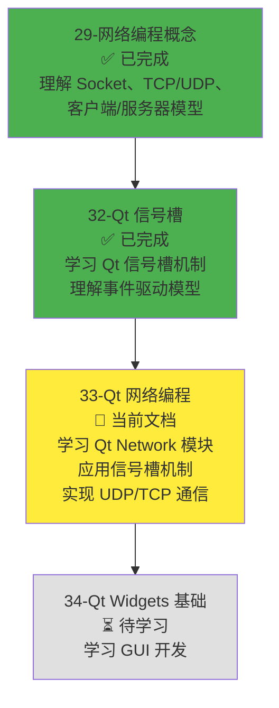
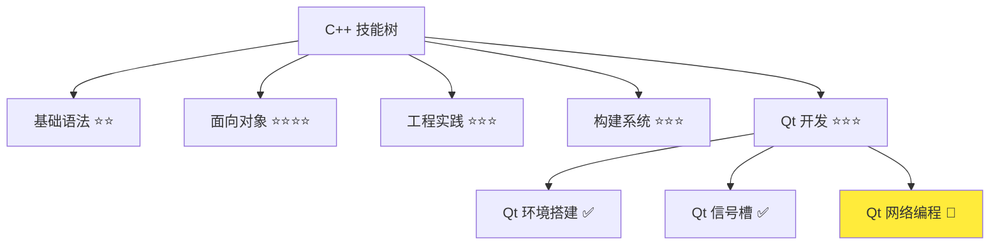

# Qt 网络编程

> **学习目标**：掌握 Qt Network 模块的使用方法，学会使用 QUdpSocket 和 QTcpSocket 实现 UDP 和 TCP 通信，理解网络事件处理机制，能够开发简单的网络应用程序  
> **前置知识**：C++ 面向对象基础、Qt 信号槽机制、网络编程概念（Socket、TCP/UDP、客户端/服务器模型）  
> **预计时间**：150 分钟  
> **难度等级**：⭐⭐⭐  
> **技能收获**：Qt Network 模块、QUdpSocket、QTcpSocket、网络事件处理、UDP/TCP 通信  
> **文档版本**：v1.0  
> **最后更新**：2025-11-21

📊 **难度等级说明**

| 等级           | 描述                       | 练习题数量     | 颜色码 |
| -------------- | -------------------------- | -------------- | ------ |
| **⭐**         | 入门级，零基础可学         | 5 题基础概念题 | 🟢绿   |
| **⭐⭐**       | 基础级，需要基本编程概念   | 5 题基础概念题 | 🟡黄   |
| **⭐⭐⭐**     | 中级，需要相关技术基础     | 3 题代码分析题 | 🟠橙   |
| **⭐⭐⭐⭐**   | 高级，需要扎实的技术功底   | 3 题代码分析题 | 🔴红   |
| **⭐⭐⭐⭐⭐** | 专家级，需要丰富的项目经验 | 2 题设计思考题 | 🟣紫   |

## 1. 学习目标

### 1.1 学习动机

- **实际需求**：开发局域网聊天软件需要网络编程能力。Qt Network 模块提供了 QUdpSocket 和 QTcpSocket 类，封装了底层网络操作，简化了网络编程
- **应用场景**：局域网聊天、文件传输、在线游戏、远程控制、物联网设备通信
- **技能价值**：学会后能使用 Qt Network 模块开发网络应用程序，实现 UDP/TCP 通信，为后续开发聊天软件打下基础
- **数据支持**：网络编程是现代软件开发的重要技能，Qt Network 模块是 Qt 框架的核心模块之一，掌握 Qt 网络编程是开发聊天软件、文件传输等应用的必备技能

### 1.1.1 为什么需要学习 Qt 网络编程？

**学习路径设计**：

在学习了 Qt 信号槽机制和网络编程概念之后，我们需要学习 Qt Network 模块。这样做的原因：

1. **应用概念**：将之前学习的网络编程概念（Socket、TCP/UDP、客户端/服务器模型）应用到实际开发中
2. **信号槽机制**：Qt Network 模块完全基于信号槽机制，网络事件通过信号槽通知，需要理解信号槽才能使用
3. **简化开发**：Qt Network 封装了底层网络操作，比直接使用系统 Socket API 更简单、更安全
4. **跨平台支持**：Qt Network 提供跨平台的网络编程接口，一套代码可以在不同平台运行

**学习路径安排**：



**为什么不在本章直接学习系统 Socket API？**

- ❌ **时间成本高**：系统 Socket API 需要学习 2-3 天，项目用不上
- ❌ **跨平台复杂**：不同平台的 Socket API 不同，需要大量条件编译
- ❌ **错误处理复杂**：底层 API 错误处理复杂，容易出错
- ✅ **Qt Network 封装**：Qt Network 已经封装了底层操作，使用简单、跨平台、错误处理完善

**本章的学习重点**：

- ✅ **Qt Network 模块**：理解 Qt Network 模块的作用和特点
- ✅ **QUdpSocket**：掌握 UDP 通信的使用方法（发送、接收、广播、多播）
- ✅ **QTcpSocket**：掌握 TCP 通信的使用方法（连接、发送、接收、文件传输）
- ✅ **网络事件处理**：理解如何使用信号槽处理网络事件（readyRead、connected、disconnected）
- ✅ **实际应用**：实现简单的 UDP/TCP 通信示例

> **类比**：Qt Network 就像**网络通信的封装工具**：
>
> - **系统 Socket API**：就像原始的邮局操作，需要自己处理所有细节（填写地址、贴邮票、投递）
> - **Qt Network**：就像快递服务，封装了所有细节，只需要告诉它"发送到哪里"和"发送什么"，它会自动处理
> - **信号槽机制**：就像快递通知，当包裹到达时（数据到达），自动通知你（触发信号），你执行相应操作（槽函数）

### 1.2 技能树位置



> **图表说明**：C++ 技能树结构图，当前文档点亮 Qt 网络编程技能点，为后续 GUI 开发做准备

### 1.3 前置知识检查

在开始学习之前，请确认你已经掌握：

- [ ] C++ 面向对象基础（类、对象、继承）
- [ ] Qt 信号槽机制（信号槽概念、QObject::connect、事件循环）
- [ ] 网络编程概念（Socket、TCP/UDP 协议、客户端/服务器模型）
- [ ] Qt 环境搭建（Qt 6.9+ 安装、CMake 配置 Qt 项目）
- [ ] Lambda 表达式基础（可选，文档中会使用 Lambda 表达式作为槽函数）

> **未掌握处理**：若未通过，请先复习 [Qt 信号槽机制](./32-qt-signals-slots.md)、[网络编程概念](./29-network-programming-concepts.md)、[Qt 环境搭建](./31-qt-environment-setup.md) 和 [Lambda 表达式](./26-lambda-expressions.md)（可选）

## 2. 核心内容

### 2.1 快速体验：理解 Qt Network 模块

让我们先通过一个简单的例子，快速理解 Qt Network 模块是什么。

#### 2.1.1 Qt Network 模块的类比

**Qt Network 模块就像网络通信的封装工具**：

Qt Network 模块封装了底层网络操作，提供了简单易用的网络编程接口。如果你没有学习过系统 Socket API，可以这样理解：

**类比：快递服务**

想象一个快递服务系统：

- **系统 Socket API**：就像原始的邮局操作，需要自己处理所有细节
  - 需要自己填写地址、贴邮票、投递
  - 需要自己处理错误、重试、超时
  - 不同地区（平台）的操作方式不同

- **Qt Network**：就像快递服务，封装了所有细节
  - 只需要告诉它"发送到哪里"和"发送什么"
  - 自动处理错误、重试、超时
  - 跨平台统一接口，一套代码到处运行

- **信号槽机制**：就像快递通知
  - 当包裹到达时（数据到达），自动通知你（触发信号）
  - 你执行相应操作（槽函数），如显示消息、保存数据

**关键特点**：

- ✅ **简单易用**：比系统 Socket API 更简单，不需要处理底层细节
- ✅ **跨平台**：一套代码可以在 Windows、macOS、Linux 上运行
- ✅ **信号槽驱动**：网络事件通过信号槽通知，符合 Qt 的事件驱动模型
- ✅ **类型安全**：使用 Qt 类型（QString、QByteArray），类型安全
- ✅ **自动管理**：自动处理连接、错误、超时等

**为什么需要 Qt Network？**

传统的系统 Socket API：需要处理底层细节，不同平台 API 不同，错误处理复杂，代码冗长。

Qt Network 方式：封装了底层操作，跨平台统一接口，错误处理完善，代码简洁。这样开发网络应用程序更简单、更安全、更易维护。

#### 2.1.2 Qt Network 模块介绍

**Qt Network 模块**：Qt 框架提供的网络编程模块，封装了底层网络操作，提供了简单易用的网络编程接口。

**主要类**：

- **QUdpSocket**：UDP 通信类，用于无连接的数据传输（快速、不保证可靠）
- **QTcpSocket**：TCP 通信类，用于面向连接的数据传输（可靠、保证顺序）
- **QTcpServer**：TCP 服务器类，用于创建 TCP 服务器
- **QHostAddress**：IP 地址类，用于表示 IP 地址
- **QNetworkInterface**：网络接口类，用于获取网络接口信息

**Qt Network 模块的特点**：

1. **基于信号槽**：网络事件通过信号槽通知，符合 Qt 的事件驱动模型
2. **异步操作**：网络操作是异步的，不会阻塞程序执行
3. **跨平台**：一套代码可以在不同平台运行
4. **类型安全**：使用 Qt 类型（QString、QByteArray），类型安全
5. **自动管理**：自动处理连接、错误、超时等

**CMake 配置**：

使用 Qt Network 模块需要在 CMakeLists.txt 中链接 `Qt6::Network`：

```cmake
find_package(Qt6 REQUIRED COMPONENTS Core Network)

target_link_libraries(${PROJECT_NAME} Qt6::Core Qt6::Network)
```

#### 2.1.3 一个简单的 UDP 通信示例

**场景**：创建一个简单的 UDP 发送和接收程序，演示 Qt Network 的基本用法。

**代码示例**：

```cpp
// UdpSender.h
#ifndef UDPSENDER_H
#define UDPSENDER_H

#include <QtCore/QObject>
#include <QtNetwork/QUdpSocket>
#include <QtCore/QDebug>

class UdpSender : public QObject {
    Q_OBJECT

public:
    explicit UdpSender(QObject* parent = nullptr) : QObject(parent) {
        m_socket = new QUdpSocket(this);        // 创建 UDP Socket，this 作为父对象，自动管理内存
    }

    void sendMessage(const QString& message, const QHostAddress& address, quint16 port) {
        QByteArray data = message.toUtf8();     // QString 转换为 QByteArray
        qint64 bytesWritten = m_socket->writeDatagram(data, address, port);

        if (bytesWritten == -1) {
            qDebug() << "Failed to send message:" << m_socket->errorString();
        } else {
            qDebug() << "Sent" << bytesWritten << "bytes to" << address.toString() << ":" << port;
        }
    }

private:
    QUdpSocket* m_socket;
};

#endif // UDPSENDER_H
```

```cpp
// UdpReceiver.h
#ifndef UDPRECEIVER_H
#define UDPRECEIVER_H

#include <QtCore/QObject>
#include <QtNetwork/QUdpSocket>
#include <QtNetwork/QHostAddress>
#include <QtCore/QDebug>

class UdpReceiver : public QObject {
    Q_OBJECT

public:
    explicit UdpReceiver(QObject* parent = nullptr) : QObject(parent) {
        m_socket = new QUdpSocket(this);

        // 绑定端口，监听 UDP 数据
        if (!m_socket->bind(QHostAddress::AnyIPv4, 12345)) {
            qDebug() << "Failed to bind port 12345:" << m_socket->errorString();
            return;
        }

        // 连接 readyRead 信号到槽函数：当有数据到达时，自动调用 onReadyRead
        // readyRead 信号：当 Socket 有数据可读时发出
        connect(m_socket, &QUdpSocket::readyRead, this, &UdpReceiver::onReadyRead);

        qDebug() << "UDP Receiver listening on port 12345";
    }

private slots:
    void onReadyRead() {
        // 读取数据
        while (m_socket->hasPendingDatagrams()) {
            QByteArray datagram;
            datagram.resize(m_socket->pendingDatagramSize());

            QHostAddress senderAddress;
            quint16 senderPort;

            // 接收数据，获取发送者地址和端口
            qint64 bytesRead = m_socket->readDatagram(datagram.data(), datagram.size(),
                                                      &senderAddress, &senderPort);

            if (bytesRead > 0) {
                QString message = QString::fromUtf8(datagram);
                qDebug() << "Received from" << senderAddress.toString() << ":" << senderPort
                         << "Message:" << message;
            }
        }
    }

private:
    QUdpSocket* m_socket;
};

#endif // UDPRECEIVER_H
```

```cpp
// main.cpp
#include <QtCore/QCoreApplication>
#include <QtCore/QDebug>
#include <QtNetwork/QHostAddress>
#include "UdpSender.h"
#include "UdpReceiver.h"

int main(int argc, char *argv[]) {
    QCoreApplication app(argc, argv);

    // 创建接收者
    UdpReceiver receiver;

    // 等待一下，确保接收者已经绑定端口
    QThread::msleep(100);

    // 创建发送者
    UdpSender sender;

    // 发送消息到本地回环地址（127.0.0.1）的 12345 端口
    sender.sendMessage("Hello, UDP!", QHostAddress::LocalHost, 12345);

    // 启动事件循环，等待信号触发
    return app.exec();
}
```

**CMakeLists.txt**：

```cmake
cmake_minimum_required(VERSION 3.20)

project(UdpDemo VERSION 1.0.0 LANGUAGES CXX)

set(CMAKE_CXX_STANDARD 17)
set(CMAKE_CXX_STANDARD_REQUIRED ON)
set(CMAKE_EXPORT_COMPILE_COMMANDS ON)

# 查找 Qt6
find_package(Qt6 REQUIRED COMPONENTS Core Network)

# 启用 Qt 自动处理
set(CMAKE_AUTOMOC ON)

# 源文件
set(SOURCES
    main.cpp
    UdpSender.h
    UdpReceiver.h
)

# 创建可执行文件
add_executable(${PROJECT_NAME} ${SOURCES})

# 链接 Qt 库
target_link_libraries(${PROJECT_NAME} Qt6::Core Qt6::Network)
```

**运行结果**：

```
UDP Receiver listening on port 12345
Sent 11 bytes to 127.0.0.1:12345
Received from 127.0.0.1:54321 Message: Hello, UDP!
```

**代码说明**：

1. **QUdpSocket**：创建 UDP Socket 对象，用于 UDP 通信
2. **bind()**：绑定端口，监听 UDP 数据（接收者需要绑定端口）
3. **writeDatagram()**：发送 UDP 数据（发送者不需要绑定端口）
4. **readyRead 信号**：当有数据到达时发出，通过信号槽机制自动调用槽函数
5. **readDatagram()**：读取 UDP 数据，获取发送者地址和端口
6. **QHostAddress**：IP 地址类，`QHostAddress::LocalHost` 表示本地回环地址（127.0.0.1）
7. **QByteArray**：字节数组类，用于存储二进制数据（网络传输的数据是字节流）

**关键点**：

- ✅ **信号槽机制**：`readyRead` 信号在数据到达时自动发出，通过 `connect()` 连接到槽函数
- ✅ **异步操作**：网络操作是异步的，不会阻塞程序执行
- ✅ **自动管理**：`QUdpSocket` 对象使用 `this` 作为父对象，自动管理内存
- ✅ **事件循环**：`app.exec()` 启动事件循环，等待信号触发

> **类比**：UDP 通信就像**发短信**：
>
> - **发送者**：不需要先建立连接，直接发送消息
> - **接收者**：绑定端口，等待消息到达
> - **readyRead 信号**：就像短信通知，当收到短信时自动通知你
> - **readDatagram()**：就像查看短信内容，读取消息

### 2.2 深入理解：Qt Network 模块详解

#### 2.2.1 QUdpSocket：UDP 通信

**QUdpSocket**：Qt 提供的 UDP 通信类，用于无连接的数据传输。

**UDP 的特点**（已在 29-network-programming-concepts.md 中学习过）：

- **无连接**：不需要先建立连接，直接发送数据
- **快速传输**：速度快，适合实时通信
- **不保证可靠**：数据可能丢失或乱序
- **简单高效**：协议简单，开销小

**QUdpSocket 的主要方法**：

- **bind()**：绑定端口，监听 UDP 数据（接收者需要绑定）
- **writeDatagram()**：发送 UDP 数据
- **readDatagram()**：读取 UDP 数据
- **hasPendingDatagrams()**：检查是否有待读取的数据
- **pendingDatagramSize()**：获取待读取数据的大小

**QUdpSocket 的主要信号**：

- **readyRead**：当有数据到达时发出（最重要的信号）

**UDP 广播示例**：

UDP 广播：向局域网内所有设备发送消息。

```cpp
// BroadcastSender.h
#ifndef BROADCASTSENDER_H
#define BROADCASTSENDER_H

#include <QtCore/QObject>
#include <QtNetwork/QUdpSocket>
#include <QtCore/QDebug>

class BroadcastSender : public QObject {
    Q_OBJECT

public:
    explicit BroadcastSender(QObject* parent = nullptr) : QObject(parent) {
        m_socket = new QUdpSocket(this);
    }

    void broadcastMessage(const QString& message, quint16 port) {
        QByteArray data = message.toUtf8();

        // QHostAddress::Broadcast 表示广播地址（255.255.255.255）
        // 向局域网内所有设备发送消息
        qint64 bytesWritten = m_socket->writeDatagram(data, QHostAddress::Broadcast, port);

        if (bytesWritten == -1) {
            qDebug() << "Failed to broadcast message:" << m_socket->errorString();
        } else {
            qDebug() << "Broadcasted" << bytesWritten << "bytes to port" << port;
        }
    }

private:
    QUdpSocket* m_socket;
};

#endif // BROADCASTSENDER_H
```

**UDP 多播示例**：

UDP 多播：向加入特定多播组的设备发送消息。

```cpp
// MulticastSender.h
#ifndef MULTICASTSENDER_H
#define MULTICASTSENDER_H

#include <QtCore/QObject>
#include <QtNetwork/QUdpSocket>
#include <QtNetwork/QHostAddress>
#include <QtCore/QDebug>

class MulticastSender : public QObject {
    Q_OBJECT

public:
    explicit MulticastSender(QObject* parent = nullptr) : QObject(parent) {
        m_socket = new QUdpSocket(this);
    }

    void sendMulticastMessage(const QString& message, const QHostAddress& multicastAddress, quint16 port) {
        QByteArray data = message.toUtf8();

        // 多播地址范围：224.0.0.0 到 239.255.255.255
        qint64 bytesWritten = m_socket->writeDatagram(data, multicastAddress, port);

        if (bytesWritten == -1) {
            qDebug() << "Failed to send multicast message:" << m_socket->errorString();
        } else {
            qDebug() << "Sent multicast message to" << multicastAddress.toString() << ":" << port;
        }
    }

private:
    QUdpSocket* m_socket;
};

#endif // MULTICASTSENDER_H
```

```cpp
// MulticastReceiver.h
#ifndef MULTICASTRECEIVER_H
#define MULTICASTRECEIVER_H

#include <QtCore/QObject>
#include <QtNetwork/QUdpSocket>
#include <QtNetwork/QHostAddress>
#include <QtCore/QDebug>

class MulticastReceiver : public QObject {
    Q_OBJECT

public:
    explicit MulticastReceiver(QObject* parent = nullptr) : QObject(parent) {
        m_socket = new QUdpSocket(this);

        // 绑定端口
        if (!m_socket->bind(QHostAddress::AnyIPv4, 12345, QUdpSocket::ShareAddress | QUdpSocket::ReuseAddressHint)) {
            qDebug() << "Failed to bind port 12345:" << m_socket->errorString();
            return;
        }

        // 加入多播组（多播地址：224.0.0.1）
        QHostAddress multicastAddress("224.0.0.1");
        if (m_socket->joinMulticastGroup(multicastAddress)) {
            qDebug() << "Joined multicast group" << multicastAddress.toString();
        } else {
            qDebug() << "Failed to join multicast group:" << m_socket->errorString();
            return;
        }

        // 连接 readyRead 信号
        connect(m_socket, &QUdpSocket::readyRead, this, &MulticastReceiver::onReadyRead);

        qDebug() << "Multicast Receiver listening on port 12345";
    }

    ~MulticastReceiver() {
        // 离开多播组
        QHostAddress multicastAddress("224.0.0.1");
        m_socket->leaveMulticastGroup(multicastAddress);
    }

private slots:
    void onReadyRead() {
        while (m_socket->hasPendingDatagrams()) {
            QByteArray datagram;
            datagram.resize(m_socket->pendingDatagramSize());

            QHostAddress senderAddress;
            quint16 senderPort;

            qint64 bytesRead = m_socket->readDatagram(datagram.data(), datagram.size(),
                                                      &senderAddress, &senderPort);

            if (bytesRead > 0) {
                QString message = QString::fromUtf8(datagram);
                qDebug() << "Received multicast message from" << senderAddress.toString() << ":" << senderPort
                         << "Message:" << message;
            }
        }
    }

private:
    QUdpSocket* m_socket;
};

#endif // MULTICASTRECEIVER_H
```

**UDP 广播 vs 多播**：

| 特性         | 广播（Broadcast）            | 多播（Multicast）                   |
| ------------ | ---------------------------- | ----------------------------------- |
| **地址范围** | 255.255.255.255（广播地址）  | 224.0.0.0 - 239.255.255.255（多播） |
| **接收方式** | 所有设备都能收到             | 只有加入多播组的设备能收到          |
| **网络负载** | 高（所有设备都收到）         | 低（只有加入组的设备收到）          |
| **应用场景** | 局域网设备发现、简单消息广播 | 群组聊天、视频会议、在线游戏        |
| **选择原则** | 需要所有设备收到时使用广播   | 只需要部分设备收到时使用多播        |

#### 2.2.2 QTcpSocket：TCP 通信

**QTcpSocket**：Qt 提供的 TCP 通信类，用于面向连接的数据传输。

**TCP 的特点**（已在 29-network-programming-concepts.md 中学习过）：

- **面向连接**：需要先建立连接，然后才能传输数据
- **可靠传输**：保证数据到达，不丢失、不重复、有序
- **速度较慢**：需要建立连接，速度比 UDP 慢
- **开销较大**：需要维护连接状态，开销比 UDP 大

**QTcpSocket 的主要方法**：

- **connectToHost()**：连接到服务器（客户端使用）
- **write()**：发送数据
- **read()** / **readAll()**：读取数据
- **bytesAvailable()**：获取可读数据的字节数
- **disconnectFromHost()**：断开连接
- **state()**：获取连接状态

**QTcpSocket 的主要信号**：

- **connected**：连接成功时发出
- **disconnected**：断开连接时发出
- **readyRead**：当有数据到达时发出（最重要的信号）
- **errorOccurred**：发生错误时发出

**TCP 客户端示例**：

```cpp
// TcpClient.h
#ifndef TCPCLIENT_H
#define TCPCLIENT_H

#include <QtCore/QObject>
#include <QtNetwork/QTcpSocket>
#include <QtNetwork/QHostAddress>
#include <QtCore/QDebug>

class TcpClient : public QObject {
    Q_OBJECT

public:
    explicit TcpClient(QObject* parent = nullptr) : QObject(parent) {
        m_socket = new QTcpSocket(this);

        // 连接信号
        connect(m_socket, &QTcpSocket::connected, this, &TcpClient::onConnected);
        connect(m_socket, &QTcpSocket::disconnected, this, &TcpClient::onDisconnected);
        connect(m_socket, &QTcpSocket::readyRead, this, &TcpClient::onReadyRead);
        connect(m_socket, &QTcpSocket::errorOccurred, this, &TcpClient::onError);
    }

    void connectToServer(const QString& host, quint16 port) {
        qDebug() << "Connecting to" << host << ":" << port;
        m_socket->connectToHost(host, port);
    }

    void sendMessage(const QString& message) {
        if (m_socket->state() == QAbstractSocket::ConnectedState) {
            QByteArray data = message.toUtf8();
            qint64 bytesWritten = m_socket->write(data);

            if (bytesWritten == -1) {
                qDebug() << "Failed to send message:" << m_socket->errorString();
            } else {
                qDebug() << "Sent" << bytesWritten << "bytes";
            }
        } else {
            qDebug() << "Socket is not connected";
        }
    }

    void disconnectFromServer() {
        m_socket->disconnectFromHost();
    }

private slots:
    void onConnected() {
        qDebug() << "Connected to server";
    }

    void onDisconnected() {
        qDebug() << "Disconnected from server";
    }

    void onReadyRead() {
        // 读取所有可用数据
        QByteArray data = m_socket->readAll();
        QString message = QString::fromUtf8(data);
        qDebug() << "Received:" << message;
    }

    void onError(QAbstractSocket::SocketError error) {
        qDebug() << "Socket error:" << m_socket->errorString();
    }

private:
    QTcpSocket* m_socket;
};

#endif // TCPCLIENT_H
```

**TCP 服务器示例**：

TCP 服务器需要使用 `QTcpServer` 类来监听连接。

```cpp
// TcpServer.h
#ifndef TCPSERVER_H
#define TCPSERVER_H

#include <QtCore/QObject>
#include <QtNetwork/QTcpServer>
#include <QtNetwork/QTcpSocket>
#include <QtCore/QDebug>

class TcpServer : public QObject {
    Q_OBJECT

public:
    explicit TcpServer(QObject* parent = nullptr) : QObject(parent) {
        m_server = new QTcpServer(this);

        // 连接 newConnection 信号：当有新客户端连接时发出
        connect(m_server, &QTcpServer::newConnection, this, &TcpServer::onNewConnection);

        // 监听端口
        if (m_server->listen(QHostAddress::AnyIPv4, 12345)) {
            qDebug() << "TCP Server listening on port 12345";
        } else {
            qDebug() << "Failed to start server:" << m_server->errorString();
        }
    }

    void sendToClient(QTcpSocket* client, const QString& message) {
        if (client && client->state() == QAbstractSocket::ConnectedState) {
            QByteArray data = message.toUtf8();
            qint64 bytesWritten = client->write(data);

            if (bytesWritten == -1) {
                qDebug() << "Failed to send message to client:" << client->errorString();
            } else {
                qDebug() << "Sent" << bytesWritten << "bytes to client";
            }
        }
    }

private slots:
    void onNewConnection() {
        // 接受新连接
        QTcpSocket* client = m_server->nextPendingConnection();

        if (client) {
            qDebug() << "New client connected:" << client->peerAddress().toString() << ":" << client->peerPort();

            // 连接客户端的信号
            connect(client, &QTcpSocket::readyRead, this, [this, client]() {
                this->onClientReadyRead(client);
            });
            connect(client, &QTcpSocket::disconnected, this, [this, client]() {
                this->onClientDisconnected(client);
            });

            // 发送欢迎消息
            sendToClient(client, "Welcome to TCP Server!");
        }
    }

    void onClientReadyRead(QTcpSocket* client) {
        // 读取客户端数据
        QByteArray data = client->readAll();
        QString message = QString::fromUtf8(data);
        qDebug() << "Received from client:" << message;

        // 回显消息
        sendToClient(client, "Echo: " + message);
    }

    void onClientDisconnected(QTcpSocket* client) {
        qDebug() << "Client disconnected:" << client->peerAddress().toString();
        client->deleteLater();  // 延迟删除，确保信号处理完成
    }

private:
    QTcpServer* m_server;
};

#endif // TCPSERVER_H
```

**TCP 连接状态**：

`QTcpSocket::state()` 返回连接状态，常用状态：

- **QAbstractSocket::UnconnectedState**：未连接
- **QAbstractSocket::ConnectingState**：正在连接
- **QAbstractSocket::ConnectedState**：已连接
- **QAbstractSocket::ClosingState**：正在关闭
- **QAbstractSocket::BoundState**：已绑定（服务器）

**TCP vs UDP 选择原则**：

| 场景         | 推荐协议 | 原因                           |
| ------------ | -------- | ------------------------------ |
| **实时聊天** | UDP      | 速度快，偶尔丢失可以接受       |
| **文件传输** | TCP      | 需要可靠传输，不能丢失         |
| **在线游戏** | UDP      | 位置更新需要快速，偶尔丢失可以 |
| **网页浏览** | TCP      | 需要可靠传输，保证数据完整     |
| **视频直播** | UDP      | 画面偶尔丢失可以，速度更重要   |
| **远程登录** | TCP      | 需要可靠传输，命令不能丢失     |

#### 2.2.3 网络事件处理：信号槽机制

**Qt Network 完全基于信号槽机制**：网络事件通过信号槽通知，这是 Qt Network 的核心特点。

**主要网络事件信号**：

1. **readyRead**：当有数据到达时发出（最重要的信号）
   - **QUdpSocket**：UDP 数据到达时发出
   - **QTcpSocket**：TCP 数据到达时发出

2. **connected**：连接成功时发出（TCP）
   - **QTcpSocket**：连接到服务器成功时发出

3. **disconnected**：断开连接时发出（TCP）
   - **QTcpSocket**：断开连接时发出

4. **errorOccurred**：发生错误时发出
   - **QUdpSocket** / **QTcpSocket**：发生错误时发出

**事件处理示例**：

```cpp
// 连接 readyRead 信号到槽函数
connect(m_socket, &QUdpSocket::readyRead, this, &Receiver::onReadyRead);

// 连接 connected 信号到槽函数
connect(m_socket, &QTcpSocket::connected, this, &Client::onConnected);

// 连接 disconnected 信号到槽函数
connect(m_socket, &QTcpSocket::disconnected, this, &Client::onDisconnected);

// 连接 errorOccurred 信号到槽函数
connect(m_socket, &QTcpSocket::errorOccurred, this, &Client::onError);
```

**为什么使用信号槽处理网络事件？**

- ✅ **异步操作**：网络操作是异步的，不会阻塞程序执行
- ✅ **事件驱动**：符合 Qt 的事件驱动模型，代码更清晰
- ✅ **松耦合**：网络操作和业务逻辑分离，代码更易维护
- ✅ **自动触发**：当事件发生时自动触发，不需要轮询检查

> **类比**：网络事件处理就像**快递通知**：
>
> - **readyRead 信号**：就像"包裹已到达"的通知，当数据到达时自动通知你
> - **connected 信号**：就像"已连接到快递公司"的通知，连接成功时通知你
> - **disconnected 信号**：就像"已断开连接"的通知，断开连接时通知你
> - **槽函数**：就像你收到通知后执行的操作，如查看包裹、保存数据

### 2.3 实践应用：完整的 UDP/TCP 通信示例

#### 2.3.1 UDP 聊天程序示例

**场景**：创建一个简单的 UDP 聊天程序，支持发送和接收消息。

**代码结构**：

```
udp-chat/
├── CMakeLists.txt
├── ChatWindow.h
├── ChatWindow.cpp
└── main.cpp
```

**ChatWindow.h**：

```cpp
#ifndef CHATWINDOW_H
#define CHATWINDOW_H

#include <QtCore/QObject>
#include <QtNetwork/QUdpSocket>
#include <QtNetwork/QHostAddress>
#include <QtCore/QString>
#include <QtCore/QDebug>

class ChatWindow : public QObject {
    Q_OBJECT

public:
    explicit ChatWindow(QObject* parent = nullptr);

    void sendMessage(const QString& message, const QHostAddress& address, quint16 port);
    void startListening(quint16 port);

signals:
    void messageReceived(const QString& message, const QHostAddress& senderAddress, quint16 senderPort);

private slots:
    void onReadyRead();

private:
    QUdpSocket* m_socket;
    quint16 m_listenPort;
};

#endif // CHATWINDOW_H
```

**ChatWindow.cpp**：

```cpp
#include "ChatWindow.h"

ChatWindow::ChatWindow(QObject* parent) : QObject(parent), m_listenPort(0) {
    m_socket = new QUdpSocket(this);
    connect(m_socket, &QUdpSocket::readyRead, this, &ChatWindow::onReadyRead);
}

void ChatWindow::startListening(quint16 port) {
    if (m_socket->bind(QHostAddress::AnyIPv4, port)) {
        m_listenPort = port;
        qDebug() << "Chat window listening on port" << port;
    } else {
        qDebug() << "Failed to bind port" << port << ":" << m_socket->errorString();
    }
}

void ChatWindow::sendMessage(const QString& message, const QHostAddress& address, quint16 port) {
    QByteArray data = message.toUtf8();
    qint64 bytesWritten = m_socket->writeDatagram(data, address, port);

    if (bytesWritten == -1) {
        qDebug() << "Failed to send message:" << m_socket->errorString();
    } else {
        qDebug() << "Sent:" << message << "to" << address.toString() << ":" << port;
    }
}

void ChatWindow::onReadyRead() {
    while (m_socket->hasPendingDatagrams()) {
        QByteArray datagram;
        datagram.resize(m_socket->pendingDatagramSize());

        QHostAddress senderAddress;
        quint16 senderPort;

        qint64 bytesRead = m_socket->readDatagram(datagram.data(), datagram.size(),
                                                  &senderAddress, &senderPort);

        if (bytesRead > 0) {
            QString message = QString::fromUtf8(datagram);
            emit messageReceived(message, senderAddress, senderPort);
        }
    }
}
```

**main.cpp**：

```cpp
#include <QtCore/QCoreApplication>
#include <QtCore/QDebug>
#include <QtNetwork/QHostAddress>
#include "ChatWindow.h"

int main(int argc, char *argv[]) {
    QCoreApplication app(argc, argv);

    // 创建两个聊天窗口（模拟两个用户）
    ChatWindow user1;
    ChatWindow user2;

    // 用户1监听 12345 端口
    user1.startListening(12345);

    // 用户2监听 12346 端口
    user2.startListening(12346);

    // 连接信号：当收到消息时打印
    QObject::connect(&user1, &ChatWindow::messageReceived,
                     [](const QString& msg, const QHostAddress& addr, quint16 port) {
                         qDebug() << "[User1] Received from" << addr.toString() << ":" << port << ":" << msg;
                     });

    QObject::connect(&user2, &ChatWindow::messageReceived,
                     [](const QString& msg, const QHostAddress& addr, quint16 port) {
                         qDebug() << "[User2] Received from" << addr.toString() << ":" << port << ":" << msg;
                     });

    // 等待一下，确保端口绑定完成
    QThread::msleep(100);

    // 用户1向用户2发送消息
    user1.sendMessage("Hello from User1!", QHostAddress::LocalHost, 12346);

    // 用户2向用户1发送消息
    user2.sendMessage("Hello from User2!", QHostAddress::LocalHost, 12345);

    // 启动事件循环
    return app.exec();
}
```

**CMakeLists.txt**：

```cmake
cmake_minimum_required(VERSION 3.20)

project(UdpChat VERSION 1.0.0 LANGUAGES CXX)

set(CMAKE_CXX_STANDARD 17)
set(CMAKE_CXX_STANDARD_REQUIRED ON)
set(CMAKE_EXPORT_COMPILE_COMMANDS ON)

find_package(Qt6 REQUIRED COMPONENTS Core Network)

set(CMAKE_AUTOMOC ON)

set(SOURCES
    main.cpp
    ChatWindow.h
    ChatWindow.cpp
)

add_executable(${PROJECT_NAME} ${SOURCES})

target_link_libraries(${PROJECT_NAME} Qt6::Core Qt6::Network)
```

#### 2.3.2 TCP 文件传输示例

**场景**：创建一个简单的 TCP 文件传输程序，客户端发送文件，服务器接收文件。

**代码结构**：

```
tcp-file-transfer/
├── CMakeLists.txt
├── FileSender.h
├── FileSender.cpp
├── FileReceiver.h
├── FileReceiver.cpp
└── main.cpp
```

**FileSender.h**：

```cpp
#ifndef FILESENDER_H
#define FILESENDER_H

#include <QtCore/QObject>
#include <QtNetwork/QTcpSocket>
#include <QtCore/QFile>
#include <QtCore/QDebug>

class FileSender : public QObject {
    Q_OBJECT

public:
    explicit FileSender(QObject* parent = nullptr);

    void connectToServer(const QString& host, quint16 port);
    void sendFile(const QString& filePath);

signals:
    void fileSent();
    void errorOccurred(const QString& error);

private slots:
    void onConnected();
    void onBytesWritten(qint64 bytes);
    void onError(QAbstractSocket::SocketError error);

private:
    QTcpSocket* m_socket;
    QFile* m_file;
    qint64 m_fileSize;
    qint64 m_bytesWritten;
};

#endif // FILESENDER_H
```

**FileSender.cpp**：

```cpp
#include "FileSender.h"

FileSender::FileSender(QObject* parent) : QObject(parent), m_fileSize(0), m_bytesWritten(0) {
    m_socket = new QTcpSocket(this);
    m_file = nullptr;

    connect(m_socket, &QTcpSocket::connected, this, &FileSender::onConnected);
    connect(m_socket, &QTcpSocket::bytesWritten, this, &FileSender::onBytesWritten);
    connect(m_socket, &QTcpSocket::errorOccurred, this, &FileSender::onError);
}

void FileSender::connectToServer(const QString& host, quint16 port) {
    qDebug() << "Connecting to" << host << ":" << port;
    m_socket->connectToHost(host, port);
}

void FileSender::sendFile(const QString& filePath) {
    m_file = new QFile(filePath, this);

    if (!m_file->open(QIODevice::ReadOnly)) {
        emit errorOccurred("Failed to open file: " + filePath);
        return;
    }

    m_fileSize = m_file->size();
    m_bytesWritten = 0;

    qDebug() << "File size:" << m_fileSize << "bytes";

    // 如果已连接，立即开始发送
    if (m_socket->state() == QAbstractSocket::ConnectedState) {
        onConnected();
    }
}

void FileSender::onConnected() {
    qDebug() << "Connected to server, starting file transfer";

    // 发送文件大小（8字节）
    QByteArray sizeData;
    sizeData.append(reinterpret_cast<const char*>(&m_fileSize), sizeof(qint64));
    m_socket->write(sizeData);

    // 发送文件数据
    sendFileData();
}

void FileSender::sendFileData() {
    // 每次发送 64KB
    const qint64 chunkSize = 64 * 1024;
    QByteArray buffer = m_file->read(chunkSize);

    if (buffer.isEmpty()) {
        // 文件发送完成
        m_file->close();
        m_file->deleteLater();
        m_file = nullptr;
        emit fileSent();
        qDebug() << "File sent successfully";
        return;
    }

    qint64 bytesWritten = m_socket->write(buffer);
    m_bytesWritten += bytesWritten;

    qDebug() << "Sent" << m_bytesWritten << "/" << m_fileSize << "bytes";
}

void FileSender::onBytesWritten(qint64 bytes) {
    Q_UNUSED(bytes);

    // 继续发送文件数据
    if (m_file && m_file->isOpen()) {
        sendFileData();
    }
}

void FileSender::onError(QAbstractSocket::SocketError error) {
    Q_UNUSED(error);
    emit errorOccurred("Socket error: " + m_socket->errorString());
}
```

**FileReceiver.h**：

```cpp
#ifndef FILERECEIVER_H
#define FILERECEIVER_H

#include <QtCore/QObject>
#include <QtNetwork/QTcpServer>
#include <QtNetwork/QTcpSocket>
#include <QtCore/QFile>
#include <QtCore/QDebug>

class FileReceiver : public QObject {
    Q_OBJECT

public:
    explicit FileReceiver(QObject* parent = nullptr);

    void startListening(quint16 port);

signals:
    void fileReceived(const QString& filePath);
    void errorOccurred(const QString& error);

private slots:
    void onNewConnection();
    void onReadyRead();
    void onClientDisconnected();

private:
    QTcpServer* m_server;
    QTcpSocket* m_clientSocket;
    QFile* m_file;
    qint64 m_fileSize;
    qint64 m_bytesReceived;
    bool m_receivingFileSize;
};

#endif // FILERECEIVER_H
```

**FileReceiver.cpp**：

```cpp
#include "FileReceiver.h"

FileReceiver::FileReceiver(QObject* parent)
    : QObject(parent), m_fileSize(0), m_bytesReceived(0), m_receivingFileSize(true) {
    m_server = new QTcpServer(this);
    m_clientSocket = nullptr;
    m_file = nullptr;

    connect(m_server, &QTcpServer::newConnection, this, &FileReceiver::onNewConnection);
}

void FileReceiver::startListening(quint16 port) {
    if (m_server->listen(QHostAddress::AnyIPv4, port)) {
        qDebug() << "File receiver listening on port" << port;
    } else {
        emit errorOccurred("Failed to start server: " + m_server->errorString());
    }
}

void FileReceiver::onNewConnection() {
    m_clientSocket = m_server->nextPendingConnection();

    if (m_clientSocket) {
        qDebug() << "New client connected";

        connect(m_clientSocket, &QTcpSocket::readyRead, this, &FileReceiver::onReadyRead);
        connect(m_clientSocket, &QTcpSocket::disconnected, this, &FileReceiver::onClientDisconnected);

        m_receivingFileSize = true;
        m_bytesReceived = 0;
    }
}

void FileReceiver::onReadyRead() {
    if (m_receivingFileSize) {
        // 接收文件大小（8字节）
        if (m_clientSocket->bytesAvailable() >= sizeof(qint64)) {
            QByteArray sizeData = m_clientSocket->read(sizeof(qint64));
            m_fileSize = *reinterpret_cast<qint64*>(sizeData.data());

            qDebug() << "File size:" << m_fileSize << "bytes";

            // 创建文件
            QString fileName = "received_file_" + QDateTime::currentDateTime().toString("yyyyMMdd_hhmmss");
            m_file = new QFile(fileName, this);

            if (!m_file->open(QIODevice::WriteOnly)) {
                emit errorOccurred("Failed to create file: " + fileName);
                return;
            }

            m_receivingFileSize = false;
            m_bytesReceived = 0;
        }
    } else {
        // 接收文件数据
        QByteArray data = m_clientSocket->readAll();
        qint64 bytesWritten = m_file->write(data);
        m_bytesReceived += bytesWritten;

        qDebug() << "Received" << m_bytesReceived << "/" << m_fileSize << "bytes";

        if (m_bytesReceived >= m_fileSize) {
            // 文件接收完成
            m_file->close();
            emit fileReceived(m_file->fileName());
            m_file->deleteLater();
            m_file = nullptr;
        }
    }
}

void FileReceiver::onClientDisconnected() {
    qDebug() << "Client disconnected";

    if (m_file && m_file->isOpen()) {
        m_file->close();
        m_file->deleteLater();
        m_file = nullptr;
    }

    m_clientSocket->deleteLater();
    m_clientSocket = nullptr;
}
```

**main.cpp**：

```cpp
#include <QtCore/QCoreApplication>
#include <QtCore/QDebug>
#include "FileSender.h"
#include "FileReceiver.h"

int main(int argc, char *argv[]) {
    QCoreApplication app(argc, argv);

    // 创建文件接收者（服务器）
    FileReceiver receiver;
    receiver.startListening(12345);

    // 等待服务器启动
    QThread::msleep(100);

    // 创建文件发送者（客户端）
    FileSender sender;
    sender.connectToServer("127.0.0.1", 12345);

    // 连接信号
    QObject::connect(&sender, &FileSender::fileSent, []() {
        qDebug() << "File sent successfully";
        QCoreApplication::quit();
    });

    QObject::connect(&sender, &FileSender::errorOccurred, [](const QString& error) {
        qDebug() << "Error:" << error;
        QCoreApplication::quit();
    });

    QObject::connect(&receiver, &FileReceiver::fileReceived, [](const QString& filePath) {
        qDebug() << "File received:" << filePath;
    });

    // 等待连接建立
    QThread::msleep(500);

    // 发送文件（需要提供一个实际的文件路径）
    // sender.sendFile("/path/to/file.txt");

    return app.exec();
}
```

## 3. 常见问题与解决方案

### 3.1 网络编程常见问题

#### 问题 1：UDP 数据丢失

**问题描述**：UDP 数据可能丢失，接收不到消息。

**原因分析**：

- UDP 协议本身不保证可靠传输，数据可能丢失
- 网络拥塞导致数据包丢失
- 接收缓冲区满，无法接收新数据

**解决方案**：

1. **应用层确认机制**：发送方等待接收方确认，超时重发
2. **增大缓冲区**：使用 `setSocketOption()` 增大接收缓冲区
3. **使用 TCP**：如果数据不能丢失，使用 TCP 协议

**代码示例**：

```cpp
// 增大接收缓冲区
m_socket->setSocketOption(QAbstractSocket::ReceiveBufferSizeSocketOption, 1024 * 1024);  // 1MB
```

#### 问题 2：TCP 连接失败

**问题描述**：TCP 连接失败，无法连接到服务器。

**原因分析**：

- 服务器未启动或端口错误
- 防火墙阻止连接
- 网络不通

**解决方案**：

1. **检查服务器状态**：确认服务器已启动并监听正确端口
2. **检查防火墙**：确认防火墙允许连接
3. **错误处理**：连接 `errorOccurred` 信号，处理连接错误

**代码示例**：

```cpp
connect(m_socket, &QTcpSocket::errorOccurred, this, [](QAbstractSocket::SocketError error) {
    qDebug() << "Connection error:" << error;
    // 处理错误，如重试连接
});
```

#### 问题 3：数据接收不完整

**问题描述**：TCP 数据接收不完整，一次 `readAll()` 只读取部分数据。

**原因分析**：

- TCP 是流协议，数据可能分多次到达
- 一次 `readAll()` 只能读取当前缓冲区中的数据

**解决方案**：

1. **循环读取**：在 `readyRead` 槽函数中循环读取，直到所有数据接收完成
2. **协议设计**：设计应用层协议，如先发送数据长度，再发送数据
3. **缓冲区管理**：使用缓冲区累积数据，直到接收完整

**代码示例**：

```cpp
void onReadyRead() {
    // 方法1：循环读取所有可用数据
    while (m_socket->bytesAvailable() > 0) {
        QByteArray data = m_socket->readAll();
        m_buffer.append(data);
    }

    // 方法2：根据协议解析数据
    // 先读取数据长度，再读取数据内容
}
```

### 3.2 Qt Network 使用技巧

#### 技巧 1：使用 Lambda 表达式简化代码

**代码示例**：

```cpp
// 传统方式
connect(m_socket, &QTcpSocket::connected, this, &Client::onConnected);

// Lambda 方式（更简洁）
connect(m_socket, &QTcpSocket::connected, [this]() {
    qDebug() << "Connected";
});
```

#### 技巧 2：错误处理

**代码示例**：

```cpp
connect(m_socket, &QTcpSocket::errorOccurred, this, [this](QAbstractSocket::SocketError error) {
    switch (error) {
        case QAbstractSocket::ConnectionRefusedError:
            qDebug() << "Connection refused";
            break;
        case QAbstractSocket::RemoteHostClosedError:
            qDebug() << "Remote host closed";
            break;
        default:
            qDebug() << "Socket error:" << m_socket->errorString();
    }
});
```

#### 技巧 3：超时处理

**代码示例**：

```cpp
// 使用 QTimer 实现超时
QTimer* timeoutTimer = new QTimer(this);
timeoutTimer->setSingleShot(true);
timeoutTimer->setInterval(5000);  // 5秒超时

connect(timeoutTimer, &QTimer::timeout, [this]() {
    if (m_socket->state() != QAbstractSocket::ConnectedState) {
        qDebug() << "Connection timeout";
        m_socket->abort();
    }
});

connect(m_socket, &QTcpSocket::connected, timeoutTimer, &QTimer::stop);

m_socket->connectToHost("example.com", 80);
timeoutTimer->start();
```

## 4. 课后作业

### 4.1 学习检查清单

- [ ] 能够解释 Qt Network 模块的作用和特点
- [ ] 能够使用 QUdpSocket 实现 UDP 通信（发送、接收、广播）
- [ ] 能够使用 QTcpSocket 实现 TCP 通信（连接、发送、接收）
- [ ] 能够理解网络事件处理机制（readyRead、connected、disconnected 信号）
- [ ] 能够选择合适的协议（UDP vs TCP）用于不同场景

### 4.2 综合练习

**作业题目**：创建一个简单的局域网聊天程序

**要求**：

1. 使用 UDP 实现消息发送和接收
2. 支持广播消息（向局域网内所有设备发送）
3. 显示发送者和接收时间
4. 使用信号槽机制处理网络事件
5. 实现错误处理和超时处理

**扩展功能**（可选）：

- 支持多播消息（加入多播组）
- 实现用户列表（发现局域网内的其他用户）
- 添加消息历史记录

### 4.3 测试题

**题目 1**：以下代码有什么问题？如何修复？

```cpp
QTcpSocket* socket = new QTcpSocket();
socket->connectToHost("example.com", 80);
QByteArray data = socket->readAll();  // 问题在这里
```

**题目 2**：UDP 和 TCP 的主要区别是什么？在什么场景下应该使用 UDP？在什么场景下应该使用 TCP？

**题目 3**：如何实现一个简单的文件传输程序？需要考虑哪些问题？

## 5. 下一步学习

完成本文档后，建议学习：

- **34-qt-widgets-basics.md**：Qt Widgets 基础控件，学习如何创建 GUI 界面，为聊天程序添加图形界面

## 6. 总结

### 6.1 核心知识点回顾

- **Qt Network 模块**：Qt 提供的网络编程模块，封装了底层网络操作
- **QUdpSocket**：UDP 通信类，用于无连接的数据传输（快速、不保证可靠）
- **QTcpSocket**：TCP 通信类，用于面向连接的数据传输（可靠、保证顺序）
- **网络事件处理**：通过信号槽机制处理网络事件（readyRead、connected、disconnected）
- **UDP vs TCP**：根据场景选择合适的协议（实时聊天用 UDP，文件传输用 TCP）

### 6.2 学习成果

完成本文档后，你应该能够：

- ✅ 理解 Qt Network 模块的作用和特点
- ✅ 使用 QUdpSocket 实现 UDP 通信
- ✅ 使用 QTcpSocket 实现 TCP 通信
- ✅ 使用信号槽机制处理网络事件
- ✅ 选择合适的协议用于不同场景
- ✅ 开发简单的网络应用程序

### 6.3 实践建议

- **多实践**：多写代码，熟悉 QUdpSocket 和 QTcpSocket 的使用
- **理解原理**：理解 UDP 和 TCP 的区别，选择合适的协议
- **错误处理**：注意错误处理，网络操作可能失败
- **事件驱动**：理解 Qt 的事件驱动模型，使用信号槽处理网络事件
