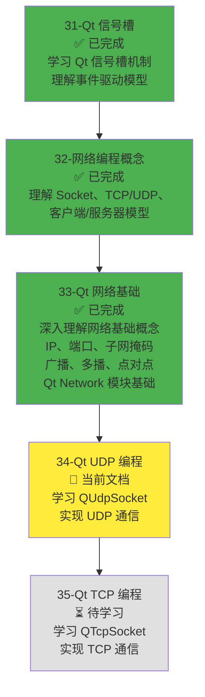
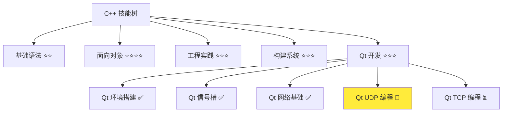
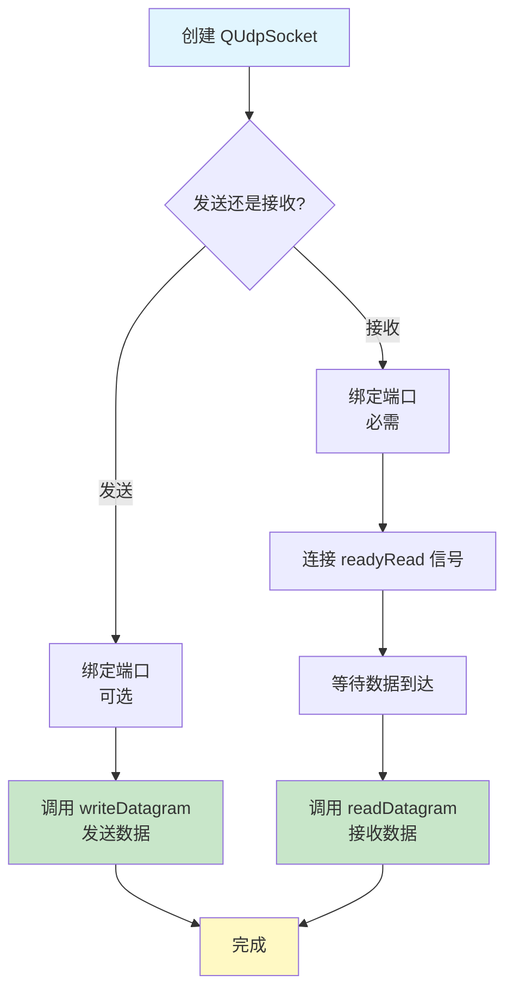
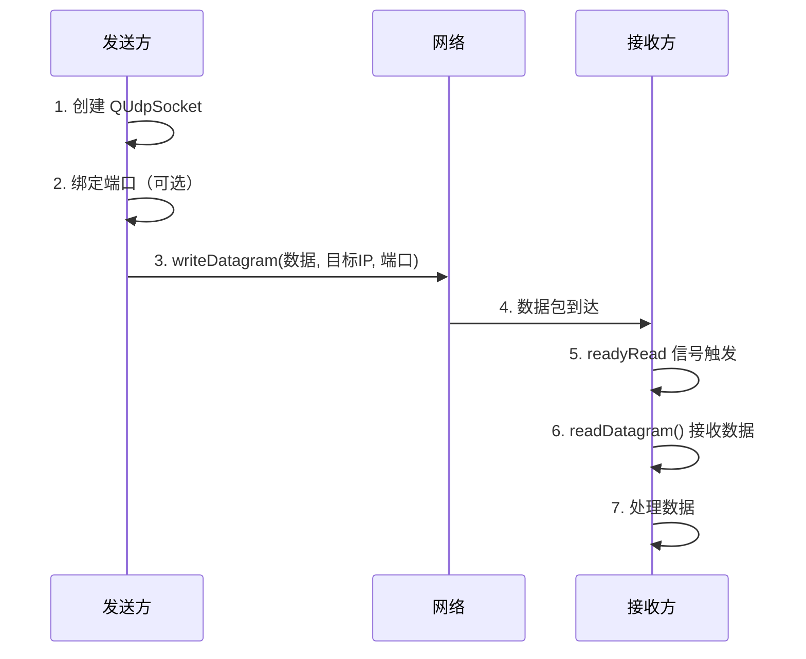
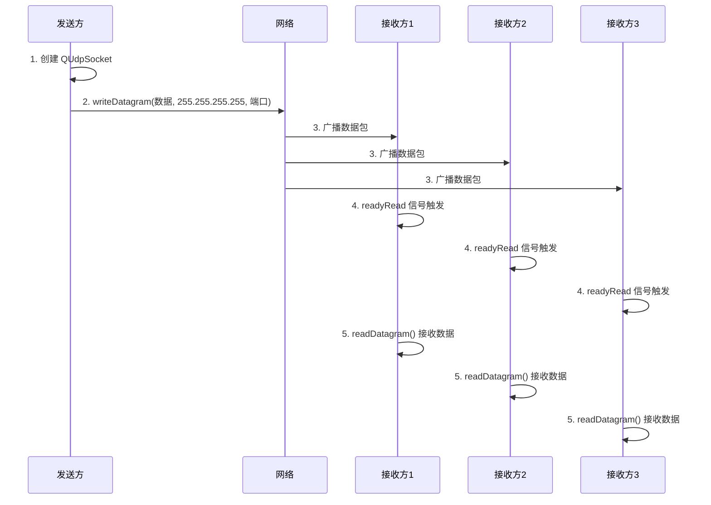
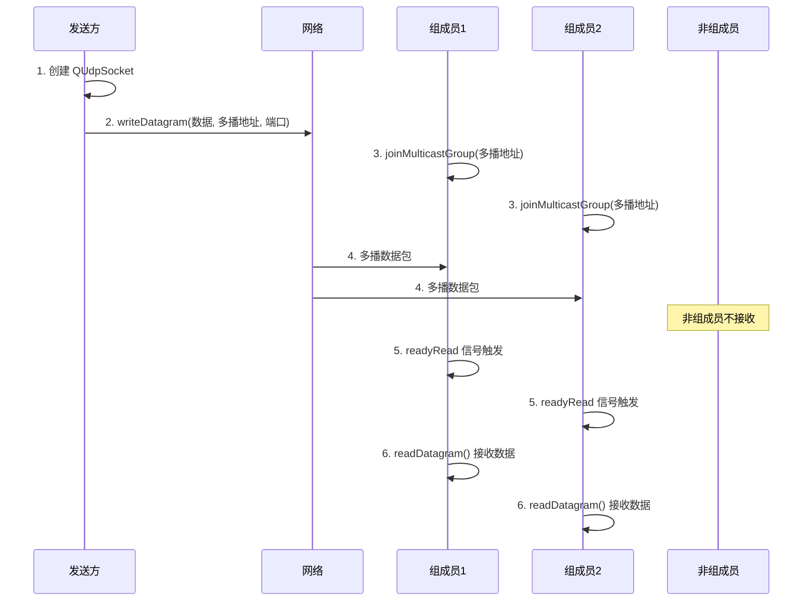
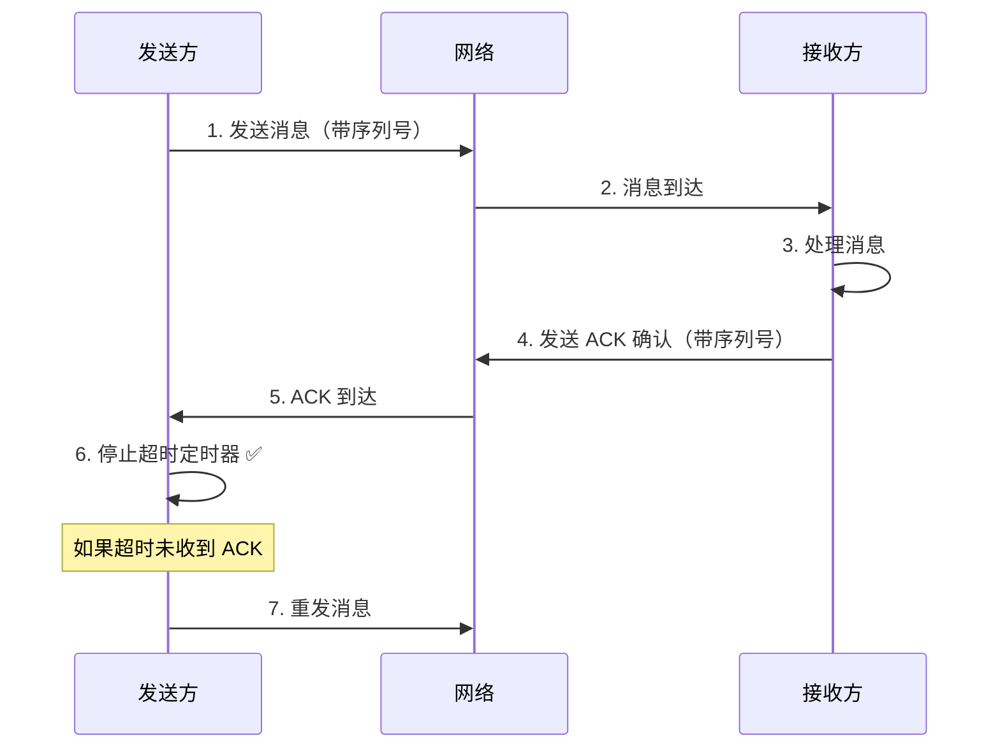
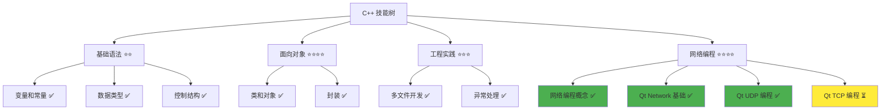

# Qt UDP 编程

> **学习目标**：掌握 QUdpSocket 的使用方法，理解 UDP 通信流程，能够实现 UDP 单播、广播和多播通信，为开发局域网聊天软件和屏幕共享软件打下基础  
> **前置知识**：C++ 面向对象基础、Qt 信号槽机制、网络编程概念（Socket、UDP、客户端/服务器模型）、Qt 网络基础（IP、端口、广播、多播）  
> **预计时间**：120 分钟  
> **难度等级**：⭐⭐⭐  
> **技能收获**：QUdpSocket、UDP 通信流程、UDP 单播/广播/多播、网络事件处理、UDP 应用场景  
> **文档版本**：v1.1  
> **最后更新**：2025-11-23

📊 **难度等级说明**

| 等级           | 描述                       | 练习题数量     | 颜色码 |
| -------------- | -------------------------- | -------------- | ------ |
| **⭐**         | 入门级，零基础可学         | 5 题基础概念题 | 🟢绿   |
| **⭐⭐**       | 基础级，需要基本编程概念   | 5 题基础概念题 | 🟡黄   |
| **⭐⭐⭐**     | 中级，需要相关技术基础     | 3 题代码分析题 | 🟠橙   |
| **⭐⭐⭐⭐**   | 高级，需要扎实的技术功底   | 3 题代码分析题 | 🔴红   |
| **⭐⭐⭐⭐⭐** | 专家级，需要丰富的项目经验 | 2 题设计思考题 | 🟣紫   |

## 1. 学习目标

### 1.1 学习动机

- **实际需求**：开发局域网聊天软件和屏幕共享软件需要使用 UDP 协议进行快速消息传输。UDP 协议无连接、速度快，适合实时聊天和屏幕共享场景
- **应用场景**：局域网聊天（1v1 聊天、群组聊天）、屏幕共享、在线游戏、视频直播、设备发现
- **技能价值**：学会后能使用 QUdpSocket 实现 UDP 通信，理解 UDP 单播、广播、多播的区别和应用场景，为开发聊天软件和屏幕共享软件打下基础
- **数据支持**：UDP 协议是网络编程的重要组成部分，掌握 UDP 编程是开发实时通信应用的必备技能

### 1.1.1 为什么需要学习 Qt UDP 编程？

**学习路径设计**：

在学习了 Qt 网络基础（33-qt-network-basics.md）之后，我们需要学习 QUdpSocket 的具体使用。这样做的原因：

1. **应用实践**：理解网络基础概念后，需要学习如何使用 QUdpSocket 实现 UDP 通信
2. **聊天软件需求**：局域网聊天软件需要使用 UDP 进行快速消息传输（1v1 聊天用单播，群组聊天用多播）
3. **屏幕共享需求**：屏幕共享软件需要使用 UDP 多播或 P2P 分发策略，向多个客户端传输屏幕数据
4. **理解通信流程**：理解 UDP 通信流程，才能正确使用 QUdpSocket
5. **掌握多种通信方式**：理解单播、广播、多播的区别，才能为不同场景选择合适的通信方式

**学习路径安排**：



**为什么不在本章直接学习 TCP 编程？**

- ❌ **知识顺序**：UDP 比 TCP 简单，先学 UDP 更容易理解网络编程的基本流程
- ❌ **应用场景**：聊天软件主要使用 UDP 进行消息传输（1v1 聊天用单播，群组聊天用多播），屏幕共享使用 UDP 多播，TCP 用于文件传输
- ✅ **循序渐进**：先学习 UDP，理解无连接通信，再学习 TCP，理解面向连接通信

**本章的学习重点**：

- ✅ **QUdpSocket 详解**：理解 QUdpSocket 的主要方法、信号、事件处理
- ✅ **UDP 通信流程**：理解 UDP 发送和接收的完整流程（流程图、时序图）
- ✅ **UDP 单播**：实现一对一通信
- ✅ **UDP 广播**：实现一对多通信（向局域网内所有设备发送）
- ✅ **UDP 多播**：实现一对多通信（向加入多播组的设备发送）
- ✅ **实际应用**：实现完整的 UDP 聊天程序示例

> **类比**：就像学做菜，已经学会了食材知识（网络基础概念）和如何使用厨具（Qt Network 基础类），现在要学习如何做第一道菜（UDP 编程）。UDP 就像简单的凉菜，不需要复杂的步骤，直接做好就能吃。

### 1.2 技能树位置



> **图表说明**：C++ 技能树结构图，当前文档点亮 Qt UDP 编程技能点，为后续 TCP 编程和聊天软件开发做准备

### 1.3 前置知识检查

在开始学习之前，请确认你已经掌握：

- [ ] C++ 面向对象基础（类、对象、继承）
- [ ] Qt 信号槽机制（信号槽概念、QObject::connect、事件循环）
- [ ] 网络编程概念（Socket、UDP 协议、客户端/服务器模型）
- [ ] Qt 网络基础（IP 地址、端口号、广播、多播、QHostAddress、QNetworkInterface）
- [ ] Lambda 表达式基础（可选，文档中会使用 Lambda 表达式作为槽函数）

> **未掌握处理**：若未通过，请先复习 [Qt 信号槽机制](./31-qt-signals-slots.md)、[网络编程概念](./32-network-programming-concepts.md)、[Qt 网络基础](./33-qt-network-basics.md) 和 [Lambda 表达式](./26-lambda-expressions.md)（可选）

## 2. 核心内容

### 2.1 UDP 通信流程

#### 2.1.1 UDP 通信流程图

**UDP 通信的基本流程**：



**UDP 发送流程**：

1. **创建 QUdpSocket**：创建 UDP Socket 对象
2. **绑定端口（可选）**：如果需要接收响应，需要绑定端口
3. **发送数据**：调用 `writeDatagram()` 发送数据
4. **完成**：发送完成（UDP 是无连接的，发送后不需要等待确认）

**UDP 接收流程**：

1. **创建 QUdpSocket**：创建 UDP Socket 对象
2. **绑定端口（必需）**：必须绑定端口才能接收数据
3. **连接信号**：连接 `readyRead` 信号到槽函数
4. **等待数据**：等待数据到达（通过事件循环）
5. **接收数据**：在槽函数中调用 `readDatagram()` 接收数据
6. **处理数据**：处理接收到的数据

> **类比**：UDP 通信就像**发短信**：
>
> - **发送**：写好短信，输入对方号码，点击发送，完成（不需要等待对方回复）
> - **接收**：手机开机，等待短信到达，收到短信通知，查看短信内容
> - **无连接**：发短信不需要先打电话建立连接，直接发送即可

#### 2.1.2 UDP 通信时序图

**UDP 单播通信时序图**：



**UDP 广播通信时序图**：



**UDP 多播通信时序图**：



### 2.2 QUdpSocket 详解

#### 2.2.1 QUdpSocket 类概述

**QUdpSocket**：Qt 提供的 UDP 通信类，封装了 UDP Socket 操作，提供了简单易用的 UDP 通信接口。

**QUdpSocket 的特点**：

1. **基于信号槽**：网络事件通过信号槽通知（`readyRead`、`errorOccurred`）
2. **异步操作**：网络操作是异步的，不会阻塞程序执行
3. **无连接**：UDP 是无连接的，不需要建立连接即可发送数据
4. **支持单播/广播/多播**：支持多种通信方式

> **类比**：QUdpSocket 就像**短信服务**：
>
> - **发送短信**：调用 `writeDatagram()`，就像发送短信，不需要等待对方回复
> - **接收短信**：连接 `readyRead` 信号，就像收到短信通知，然后查看短信内容
> - **无连接**：发短信不需要先打电话建立连接，直接发送即可

#### 2.2.2 QUdpSocket 主要方法

**QUdpSocket 的主要方法**：

| 方法                      | 作用                     | 返回值                       | 示例                                               |
| ------------------------- | ------------------------ | ---------------------------- | -------------------------------------------------- |
| **bind()**                | 绑定 IP 地址和端口号     | bool                         | `socket->bind(QHostAddress::AnyIPv4, 12345)`       |
| **writeDatagram()**       | 发送 UDP 数据报          | qint64                       | `socket->writeDatagram(data, addr, port)`          |
| **readDatagram()**        | 读取 UDP 数据报          | qint64                       | `socket->readDatagram(buffer, size, &addr, &port)` |
| **hasPendingDatagrams()** | 检查是否有待读取的数据报 | bool                         | `if (socket->hasPendingDatagrams()) { ... }`       |
| **pendingDatagramSize()** | 获取待读取数据报的大小   | qint64                       | `qint64 size = socket->pendingDatagramSize()`      |
| **joinMulticastGroup()**  | 加入多播组               | bool                         | `socket->joinMulticastGroup(multicastAddr)`        |
| **leaveMulticastGroup()** | 离开多播组               | bool                         | `socket->leaveMulticastGroup(multicastAddr)`       |
| **state()**               | 获取 Socket 状态         | QAbstractSocket::SocketState | `QAbstractSocket::BoundState`                      |
| **error()**               | 获取错误类型             | QAbstractSocket::SocketError | `QAbstractSocket::NetworkError`                    |
| **errorString()**         | 获取错误描述             | QString                      | `QString error = socket->errorString()`            |

**QUdpSocket 的主要信号**：

| 信号              | 触发时机              | 使用场景         |
| ----------------- | --------------------- | ---------------- |
| **readyRead**     | 当有数据到达时发出    | UDP 数据接收     |
| **errorOccurred** | 发生错误时发出        | 网络错误处理     |
| **stateChanged**  | Socket 状态改变时发出 | 状态监控（可选） |

#### 2.2.3 QUdpSocket 使用示例

**基本使用示例**：

> **📁 代码位置**：`src/stage1/34-qt-udp-programming/01-basic-udp/`

```cpp
// UdpSender.h
#ifndef UDPSENDER_H
#define UDPSENDER_H

#include <QtCore/QObject>
#include <QtNetwork/QUdpSocket>
#include <QtNetwork/QHostAddress>

class UdpSender : public QObject {
    Q_OBJECT

public:
    explicit UdpSender(QObject* parent = nullptr);
    void sendMessage(const QString& message, const QHostAddress& targetAddr, quint16 port);

private:
    QUdpSocket* m_socket;
};

#endif // UDPSENDER_H
```

```cpp
// UdpSender.cpp
#include "UdpSender.h"
#include <QtCore/QDebug>

UdpSender::UdpSender(QObject* parent) : QObject(parent) {
    m_socket = new QUdpSocket(this);
}

void UdpSender::sendMessage(const QString& message, const QHostAddress& targetAddr, quint16 port) {
    QByteArray data = message.toUtf8();
    qint64 bytesWritten = m_socket->writeDatagram(data, targetAddr, port);

    if (bytesWritten == -1) {
        qDebug() << "Send failed:" << m_socket->errorString();
    } else {
        qDebug() << "Sent" << bytesWritten << "bytes to" << targetAddr.toString() << ":" << port;
    }
}
```

```cpp
// UdpReceiver.h
#ifndef UDPRECEIVER_H
#define UDPRECEIVER_H

#include <QtCore/QObject>
#include <QtNetwork/QUdpSocket>
#include <QtNetwork/QHostAddress>

class UdpReceiver : public QObject {
    Q_OBJECT

public:
    explicit UdpReceiver(QObject* parent = nullptr);
    bool bind(quint16 port);

private slots:
    void onReadyRead();

private:
    QUdpSocket* m_socket;
};

#endif // UDPRECEIVER_H
```

```cpp
// UdpReceiver.cpp
#include "UdpReceiver.h"
#include <QtCore/QDebug>

UdpReceiver::UdpReceiver(QObject* parent) : QObject(parent) {
    m_socket = new QUdpSocket(this);

    // 连接 readyRead 信号到槽函数
    connect(m_socket, &QUdpSocket::readyRead, this, &UdpReceiver::onReadyRead);
}

bool UdpReceiver::bind(quint16 port) {
    if (m_socket->bind(QHostAddress::AnyIPv4, port)) {
        qDebug() << "Bound to port" << port;
        return true;
    } else {
        qDebug() << "Bind failed:" << m_socket->errorString();
        return false;
    }
}

void UdpReceiver::onReadyRead() {
    while (m_socket->hasPendingDatagrams()) {
        QByteArray buffer;
        buffer.resize(m_socket->pendingDatagramSize());

        QHostAddress senderAddr;
        quint16 senderPort;

        qint64 bytesRead = m_socket->readDatagram(buffer.data(), buffer.size(),
                                                   &senderAddr, &senderPort);

        if (bytesRead > 0) {
            QString message = QString::fromUtf8(buffer);
            qDebug() << "Received from" << senderAddr.toString() << ":" << senderPort
                     << "Message:" << message;
        }
    }
}
```

```cpp
// main.cpp
#include <QtCore/QCoreApplication>
#include <QtCore/QDebug>
#include "UdpSender.h"
#include "UdpReceiver.h"

int main(int argc, char *argv[]) {
    QCoreApplication app(argc, argv);

    // 创建接收方
    UdpReceiver receiver;
    if (!receiver.bind(12345)) {
        return 1;
    }

    // 创建发送方
    UdpSender sender;

    // 发送消息到本机
    QHostAddress targetAddr("127.0.0.1");
    sender.sendMessage("Hello, UDP!", targetAddr, 12345);

    // 运行事件循环，等待接收数据
    return app.exec();
}
```

### 2.3 UDP 单播实现

#### 2.3.1 什么是 UDP 单播

**UDP 单播（Unicast）**：一对一通信，数据包从源地址发送到指定的目标地址。

**单播的特点**：

- **一对一**：一个发送者，一个接收者
- **直接通信**：数据包直接发送到目标地址
- **最常用**：最常见的网络通信方式
- **应用场景**：1v1 实时聊天、文件传输请求、状态同步

> **类比**：单播就像**发短信给指定的人**，直接发送到对方的手机号码

#### 2.3.2 UDP 单播实现示例

> **📁 代码位置**：`src/stage1/34-qt-udp-programming/02-unicast-demo/`

```cpp
// 发送单播消息
QUdpSocket* socket = new QUdpSocket(this);
QHostAddress targetAddr("192.168.1.100");       // 目标 IP 地址
quint16 targetPort = 12345;                     // 目标端口

QByteArray data = "Hello, Unicast!";
socket->writeDatagram(data, targetAddr, targetPort);
```

```cpp
// 接收单播消息
QUdpSocket* socket = new QUdpSocket(this);

// 绑定端口（必需）
if (!socket->bind(QHostAddress::AnyIPv4, 12345)) {
    qDebug() << "Bind failed:" << socket->errorString();
    return;
}

// 连接 readyRead 信号
connect(socket, &QUdpSocket::readyRead, [socket]() {
    while (socket->hasPendingDatagrams()) {
        QByteArray buffer;
        buffer.resize(socket->pendingDatagramSize());

        QHostAddress senderAddr;
        quint16 senderPort;

        socket->readDatagram(buffer.data(), buffer.size(), &senderAddr, &senderPort);

        qDebug() << "Received from" << senderAddr.toString() << ":" << senderPort
                 << "Data:" << buffer;
    }
});
```

### 2.4 UDP 广播实现

#### 2.4.1 什么是 UDP 广播

**UDP 广播（Broadcast）**：一对多通信，向局域网内所有设备发送消息。

**广播的特点**：

- **一对多**：一个发送者，局域网内所有设备都能收到
- **广播地址**：使用 `255.255.255.255` 或子网广播地址（如 `192.168.1.255`）
- **网络负载高**：所有设备都会收到消息，即使不需要
- **应用场景**：局域网设备发现、简单消息广播

> **类比**：广播就像**大喇叭广播**，所有人都能听到，但可能很多人不需要听

#### 2.4.2 UDP 广播实现示例

> **📁 代码位置**：`src/stage1/34-qt-udp-programming/03-broadcast-demo/`

```cpp
// 发送广播消息
QUdpSocket* socket = new QUdpSocket(this);

// 使用广播地址
QHostAddress broadcastAddr = QHostAddress::Broadcast;  // 255.255.255.255
quint16 port = 12345;

QByteArray data = "Hello, Broadcast!";
socket->writeDatagram(data, broadcastAddr, port);
```

```cpp
// 接收广播消息
QUdpSocket* socket = new QUdpSocket(this);

// 绑定端口（必需）
if (!socket->bind(QHostAddress::AnyIPv4, 12345)) {
    qDebug() << "Bind failed:" << socket->errorString();
    return;
}

// 连接 readyRead 信号
connect(socket, &QUdpSocket::readyRead, [socket]() {
    while (socket->hasPendingDatagrams()) {
        QByteArray buffer;
        buffer.resize(socket->pendingDatagramSize());

        QHostAddress senderAddr;
        quint16 senderPort;

        socket->readDatagram(buffer.data(), buffer.size(), &senderAddr, &senderPort);

        qDebug() << "Received broadcast from" << senderAddr.toString() << ":" << senderPort
                 << "Data:" << buffer;
    }
});
```

**广播的限制**：

- **只能在局域网内广播**：路由器不会转发广播消息
- **网络负载高**：所有设备都会收到消息
- **安全性低**：所有设备都能收到消息

### 2.5 UDP 多播实现

#### 2.5.1 什么是 UDP 多播

**UDP 多播（Multicast）**：一对多通信，向加入特定多播组的设备发送消息。

**多播的特点**：

- **一对多**：一个发送者，多个接收者（只有加入多播组的设备能收到）
- **多播地址**：使用 `224.0.0.0` 到 `239.255.255.255` 范围内的地址
- **网络负载低**：只有加入组的设备收到消息
- **应用场景**：群组聊天、屏幕共享、视频会议、在线游戏

> **类比**：多播就像**微信群聊**，只有加入群的人才能收到消息，比广播更高效

#### 2.5.2 UDP 多播实现示例

> **📁 代码位置**：`src/stage1/34-qt-udp-programming/04-multicast-demo/`

```cpp
// 发送多播消息
QUdpSocket* socket = new QUdpSocket(this);

QHostAddress multicastAddr("224.0.0.1");  // 多播地址
quint16 port = 12345;

QByteArray data = "Hello, Multicast!";
socket->writeDatagram(data, multicastAddr, port);
```

```cpp
// 接收多播消息
QUdpSocket* socket = new QUdpSocket(this);

// 绑定端口（需要端口复用）
if (!socket->bind(QHostAddress::AnyIPv4, 12345,
                  QUdpSocket::ShareAddress | QUdpSocket::ReuseAddressHint)) {
    qDebug() << "Bind failed:" << socket->errorString();
    return;
}

// 加入多播组
QHostAddress multicastAddr("224.0.0.1");
if (!socket->joinMulticastGroup(multicastAddr)) {
    qDebug() << "Join multicast group failed:" << socket->errorString();
    return;
}

qDebug() << "Joined multicast group:" << multicastAddr.toString();

// 连接 readyRead 信号
connect(socket, &QUdpSocket::readyRead, [socket]() {
    while (socket->hasPendingDatagrams()) {
        QByteArray buffer;
        buffer.resize(socket->pendingDatagramSize());

        QHostAddress senderAddr;
        quint16 senderPort;

        socket->readDatagram(buffer.data(), buffer.size(), &senderAddr, &senderPort);

        qDebug() << "Received multicast from" << senderAddr.toString() << ":" << senderPort
                 << "Data:" << buffer;
    }
});

// 离开多播组（可选）
// socket->leaveMulticastGroup(multicastAddr);
```

**多播的关键点**：

1. **端口复用**：绑定端口时必须使用 `QUdpSocket::ShareAddress | QUdpSocket::ReuseAddressHint`
2. **加入多播组**：接收方必须调用 `joinMulticastGroup()` 加入多播组
3. **多播地址范围**：使用 `224.0.0.0` 到 `239.255.255.255` 范围内的地址

### 2.6 UDP 应用场景和最佳实践

#### 2.6.1 UDP 应用场景

**适合使用 UDP 的场景**：

1. **实时聊天**：
   - **1v1 聊天**：使用 UDP 单播，消息丢失影响不大，速度更重要
   - **群组聊天**：使用 UDP 多播，向多个用户发送消息，速度快
2. **屏幕共享**：使用 UDP 多播或 P2P 分发策略，向多个客户端传输屏幕数据，画面偶尔丢失可以接受，速度更重要
3. **在线游戏**：位置更新需要快速，偶尔丢失可以接受
4. **视频直播**：画面偶尔丢失可以接受，速度更重要
5. **设备发现**：使用广播发现局域网内的设备
6. **DNS 查询**：查询速度快，偶尔失败可以重试

**不适合使用 UDP 的场景**：

1. **文件传输**：文件必须完整传输，需要使用 TCP
2. **网页浏览**：页面必须完整加载，需要使用 TCP
3. **邮件发送**：邮件必须完整送达，需要使用 TCP

#### 2.6.2 UDP 最佳实践

**1. 错误处理**：

```cpp
if (socket->writeDatagram(data, addr, port) == -1) {
    qDebug() << "Send failed:" << socket->errorString();
    // 处理错误
}
```

**2. 数据包大小限制**：

- UDP 数据包最大大小约为 65507 字节（65535 - 8 字节 UDP 头 - 20 字节 IP 头）
- 建议单个数据包不超过 1400 字节（避免 IP 分片）
- 大数据需要分片发送

**3. 超时处理**：

> **📌 说明**：以下代码示例使用 Qt 的 `QTimer` 类（定时器）实现超时机制。`QTimer` 是 Qt 提供的定时器类，用于在指定时间后执行操作。关于 `QTimer` 的详细说明，请参考 [31-Qt 信号槽机制](./31-qt-signals-slots.md) 中的相关示例。

```cpp
// UDP 不保证可靠传输，需要应用层实现超时和重传机制
QTimer* timeoutTimer = new QTimer(this);
timeoutTimer->setSingleShot(true);
timeoutTimer->setInterval(5000);  // 5 秒超时

connect(timeoutTimer, &QTimer::timeout, [this]() {
    qDebug() << "Timeout: No response received";
    // 处理超时
});
```

**4. 数据包顺序**：

- UDP 不保证数据包顺序，需要应用层实现序列号机制
- 接收方需要根据序列号重新排序数据包

**5. 端口选择**：

- 使用 1024-65535 范围内的端口（避免需要管理员权限）
- 避免使用系统保留端口（0-1023）

## 3. 实践应用

### 3.1 UDP 应用层确认机制（ACK）实现

#### 3.1.1 为什么需要 ACK 确认机制？

**问题场景**：UDP 是无连接的、不可靠的协议，数据包可能丢失。在 1v1 聊天时，如何确保对方收到消息？

**问题分析**：

- UDP 不保证数据包一定到达
- UDP 不保证数据包按顺序到达
- 直接使用 UDP 发送消息，无法知道对方是否收到

**解决方案**：应用层确认机制（ACK）

> **📌 说明**：关于 ACK 确认机制的概念和原理，请参考 [32-网络编程概念](./32-network-programming-concepts.md) 中的 `3.4.1 UDP 通讯如何确保对方收到消息？` 部分。本节将提供基于 `QUdpSocket` 的具体实现示例。

#### 3.1.2 ACK 确认机制实现原理

**ACK 确认机制流程**：



**关键点**：

1. **消息序列号**：为每个消息分配唯一的序列号
2. **ACK 确认**：接收方收到消息后，发送 ACK 确认（包含序列号）
3. **超时重传**：发送方等待 ACK，如果超时未收到，重发消息
4. **去重处理**：接收方检查序列号，避免重复处理

#### 3.1.3 ACK 确认机制实现示例

> **📁 代码位置**：`src/stage1/34-qt-udp-programming/06-ack-demo/`

**消息格式定义**：

> **📌 说明**：
>
> - **序列化和反序列化**：序列化是将数据转换为字节数组的过程（用于网络传输），反序列化是从字节数组恢复数据的过程（用于接收数据）
> - **QDataStream**：Qt 提供的数据流类，用于将数据序列化为字节数组或从字节数组反序列化
> - **QTimer**：Qt 提供的定时器类，用于在指定时间后执行操作（已在 [31-Qt 信号槽机制](./31-qt-signals-slots.md) 中学习）
> - **QMap**：Qt 提供的映射容器，类似 C++ 标准库的 `std::map`，用于存储键值对
> - **QSet**：Qt 提供的集合容器，类似 C++ 标准库的 `std::set`，用于存储不重复的元素

```cpp
// Message.h
#ifndef MESSAGE_H
#define MESSAGE_H

#include <QtCore/QByteArray>
#include <QtCore/QDataStream>

enum MessageType {
    MSG_DATA = 0x01,        // 数据消息
    MSG_ACK  = 0x02         // ACK 确认消息
};

struct Message {
    quint8  type;           // 消息类型（MSG_DATA 或 MSG_ACK）
    quint32 seqNum;         // 序列号
    QByteArray data;        // 消息数据

    // 序列化
    QByteArray toByteArray() const {
        QByteArray buffer;
        QDataStream stream(&buffer, QIODevice::WriteOnly);
        stream << type << seqNum << data;
        return buffer;
    }

    // 反序列化
    static Message fromByteArray(const QByteArray& buffer) {
        Message msg;
        QDataStream stream(buffer);
        stream >> msg.type >> msg.seqNum >> msg.data;
        return msg;
    }
};

#endif // MESSAGE_H
```

**带 ACK 确认的 UDP 发送方**：

```cpp
// ReliableUdpSender.h
#ifndef RELIABLEUDPSENDER_H
#define RELIABLEUDPSENDER_H

#include <QtCore/QObject>
#include <QtNetwork/QUdpSocket>
#include <QtNetwork/QHostAddress>
#include <QtCore/QTimer>
#include <QtCore/QMap>
#include "Message.h"

class ReliableUdpSender : public QObject {
    Q_OBJECT

public:
    explicit ReliableUdpSender(QObject* parent = nullptr);
    void sendMessage(const QString& message, const QHostAddress& targetAddr, quint16 port);

private slots:
    void onReadyRead();
    void onAckTimeout(quint32 seqNum);

private:
    QUdpSocket* m_socket;
    quint32 m_nextSeqNum;
    QMap<quint32, QTimer*> m_ackTimers;  // 序列号 -> 超时定时器（QMap 是 Qt 提供的映射容器，类似 std::map）
    QMap<quint32, Message> m_pendingMessages;  // 序列号 -> 待确认消息
    QHostAddress m_targetAddr;
    quint16 m_targetPort;
};

#endif // RELIABLEUDPSENDER_H
```

```cpp
// ReliableUdpSender.cpp
#include "ReliableUdpSender.h"
#include <QtCore/QDebug>

ReliableUdpSender::ReliableUdpSender(QObject* parent) : QObject(parent),
    m_socket(nullptr),
    m_nextSeqNum(1) {
    m_socket = new QUdpSocket(this);
    connect(m_socket, &QUdpSocket::readyRead, this, &ReliableUdpSender::onReadyRead);
}

void ReliableUdpSender::sendMessage(const QString& message, const QHostAddress& targetAddr, quint16 port) {
    m_targetAddr = targetAddr;
    m_targetPort = port;

    // 创建消息
    Message msg;
    msg.type = MSG_DATA;
    msg.seqNum = m_nextSeqNum++;
    msg.data = message.toUtf8();

    // 保存待确认消息
    m_pendingMessages[msg.seqNum] = msg;

    // 发送消息
    QByteArray buffer = msg.toByteArray();
    qint64 bytesWritten = m_socket->writeDatagram(buffer, targetAddr, port);

    if (bytesWritten == -1) {
        qDebug() << "Send failed:" << m_socket->errorString();
        m_pendingMessages.remove(msg.seqNum);
        return;
    }

    qDebug() << "Sent message seqNum:" << msg.seqNum << "to" << targetAddr.toString() << ":" << port;

    // 创建超时定时器（3秒）
    QTimer* ackTimer = new QTimer(this);
    ackTimer->setSingleShot(true);
    ackTimer->setInterval(3000);

    // 连接超时信号
    connect(ackTimer, &QTimer::timeout, [this, seqNum = msg.seqNum]() {
        onAckTimeout(seqNum);
    });

    m_ackTimers[msg.seqNum] = ackTimer;
    ackTimer->start();
}

void ReliableUdpSender::onReadyRead() {
    while (m_socket->hasPendingDatagrams()) {
        QByteArray buffer;
        buffer.resize(m_socket->pendingDatagramSize());

        QHostAddress senderAddr;
        quint16 senderPort;
        m_socket->readDatagram(buffer.data(), buffer.size(), &senderAddr, &senderPort);

        // 解析 ACK 消息
        Message msg = Message::fromByteArray(buffer);
        if (msg.type == MSG_ACK) {
            qDebug() << "Received ACK for seqNum:" << msg.seqNum;

            // 停止超时定时器
            if (m_ackTimers.contains(msg.seqNum)) {
                m_ackTimers[msg.seqNum]->stop();
                m_ackTimers[msg.seqNum]->deleteLater();
                m_ackTimers.remove(msg.seqNum);
            }

            // 移除待确认消息
            m_pendingMessages.remove(msg.seqNum);
        }
    }
}

void ReliableUdpSender::onAckTimeout(quint32 seqNum) {
    qDebug() << "ACK timeout for seqNum:" << seqNum << ", resending...";

    // 重发消息
    if (m_pendingMessages.contains(seqNum)) {
        Message msg = m_pendingMessages[seqNum];
        QByteArray buffer = msg.toByteArray();
        m_socket->writeDatagram(buffer, m_targetAddr, m_targetPort);

        // 重启定时器
        QTimer* ackTimer = new QTimer(this);
        ackTimer->setSingleShot(true);
        ackTimer->setInterval(3000);
        connect(ackTimer, &QTimer::timeout, [this, seqNum]() {
            onAckTimeout(seqNum);
        });
        m_ackTimers[seqNum] = ackTimer;
        ackTimer->start();
    }
}
```

**带 ACK 确认的 UDP 接收方**：

```cpp
// ReliableUdpReceiver.h
#ifndef RELIABLEUDPRECEIVER_H
#define RELIABLEUDPRECEIVER_H

#include <QtCore/QObject>
#include <QtNetwork/QUdpSocket>
#include <QtCore/QSet>
#include "Message.h"

class ReliableUdpReceiver : public QObject {
    Q_OBJECT

public:
    explicit ReliableUdpReceiver(QObject* parent = nullptr);
    bool bind(quint16 port);

signals:
    void messageReceived(const QString& message, const QHostAddress& senderAddr, quint16 senderPort);

private slots:
    void onReadyRead();

private:
    QUdpSocket* m_socket;
    QSet<quint32> m_receivedSeqNums;  // 已接收的序列号（用于去重，QSet 是 Qt 提供的集合容器，类似 std::set）
};

#endif // RELIABLEUDPRECEIVER_H
```

```cpp
// ReliableUdpReceiver.cpp
#include "ReliableUdpReceiver.h"
#include <QtCore/QDebug>

ReliableUdpReceiver::ReliableUdpReceiver(QObject* parent) : QObject(parent),
    m_socket(nullptr) {
    m_socket = new QUdpSocket(this);
    connect(m_socket, &QUdpSocket::readyRead, this, &ReliableUdpReceiver::onReadyRead);
}

bool ReliableUdpReceiver::bind(quint16 port) {
    if (m_socket->bind(QHostAddress::AnyIPv4, port)) {
        qDebug() << "Bound to port" << port;
        return true;
    } else {
        qDebug() << "Bind failed:" << m_socket->errorString();
        return false;
    }
}

void ReliableUdpReceiver::onReadyRead() {
    while (m_socket->hasPendingDatagrams()) {
        QByteArray buffer;
        buffer.resize(m_socket->pendingDatagramSize());

        QHostAddress senderAddr;
        quint16 senderPort;
        m_socket->readDatagram(buffer.data(), buffer.size(), &senderAddr, &senderPort);

        // 解析消息
        Message msg = Message::fromByteArray(buffer);

        if (msg.type == MSG_DATA) {
            // 检查是否已接收过（去重）
            if (m_receivedSeqNums.contains(msg.seqNum)) {
                qDebug() << "Duplicate message seqNum:" << msg.seqNum << ", ignoring";
            } else {
                // 记录已接收的序列号
                m_receivedSeqNums.insert(msg.seqNum);

                // 处理消息
                QString message = QString::fromUtf8(msg.data);
                qDebug() << "Received message seqNum:" << msg.seqNum << "from" << senderAddr.toString() << ":" << senderPort;
                qDebug() << "Message:" << message;

                // 发送信号
                emit messageReceived(message, senderAddr, senderPort);
            }

            // 发送 ACK 确认
            Message ackMsg;
            ackMsg.type = MSG_ACK;
            ackMsg.seqNum = msg.seqNum;
            ackMsg.data = QByteArray();  // ACK 不需要数据

            QByteArray ackBuffer = ackMsg.toByteArray();
            m_socket->writeDatagram(ackBuffer, senderAddr, senderPort);
            qDebug() << "Sent ACK for seqNum:" << msg.seqNum;
        }
    }
}
```

**使用示例**：

```cpp
// main.cpp
#include <QtCore/QCoreApplication>
#include <QtCore/QDebug>
#include <QtCore/QTimer>
#include "ReliableUdpSender.h"
#include "ReliableUdpReceiver.h"

int main(int argc, char *argv[]) {
    QCoreApplication app(argc, argv);

    // 创建接收方
    ReliableUdpReceiver receiver;
    if (!receiver.bind(12345)) {
        return 1;
    }

    // 连接消息接收信号
    QObject::connect(&receiver, &ReliableUdpReceiver::messageReceived,
                     [](const QString& message, const QHostAddress& senderAddr, quint16 senderPort) {
        qDebug() << "\n=== Message Received ===";
        qDebug() << "From:" << senderAddr.toString() << ":" << senderPort;
        qDebug() << "Message:" << message;
        qDebug() << "========================";
    });

    // 创建发送方
    ReliableUdpSender sender;

    // 1秒后发送消息
    QTimer::singleShot(1000, [&sender]() {
        QHostAddress targetAddr("127.0.0.1");
        sender.sendMessage("Hello, Reliable UDP!", targetAddr, 12345);
    });

    // 5秒后退出
    QTimer::singleShot(5000, &app, &QCoreApplication::quit);

    return app.exec();
}
```

**关键点总结**：

1. **消息序列号**：为每个消息分配唯一的序列号，用于识别和去重
2. **ACK 确认**：接收方收到消息后，立即发送 ACK 确认（包含序列号）
3. **超时重传**：发送方等待 ACK，如果 3 秒内未收到，自动重发消息
4. **去重处理**：接收方检查序列号，避免重复处理相同的消息
5. **定时器管理**：使用 `QTimer` 实现超时机制，收到 ACK 后停止定时器

> **📌 说明**：这是一个简化的 ACK 确认机制实现示例。在实际应用中，还需要考虑：
>
> - 序列号溢出处理（使用循环序列号）
> - 最大重传次数限制（避免无限重传）
> - 乱序消息的处理（缓存乱序消息，等待前面的消息到达）
> - 网络拥塞控制（动态调整超时时间和重传间隔）

### 3.2 项目场景

在 QtLanChat 项目中，UDP 编程用于：

- **局域网设备发现**：使用 UDP 广播，发现局域网内的其他用户
- **1v1 实时文字聊天**：使用 UDP 单播，快速发送聊天消息给指定用户
- **群组聊天**：使用 UDP 多播，向多个用户发送消息
- **屏幕共享**：使用 UDP 多播或 P2P 分发策略，向多个客户端传输屏幕数据
  - **P2P 分发策略**：当客户端数量较多时，利用中间节点做 P2P 分发，降低主机的数据传输压力（具体实现细节请参考 [32-网络编程概念](./32-network-programming-concepts.md) 中的 `3.4.3 局域网屏幕共享的 P2P 分发策略` 部分）

**UDP 通信方式的应用**：

| 通信方式     | 应用场景           | 实现方式                                                       |
| ------------ | ------------------ | -------------------------------------------------------------- |
| **UDP 单播** | 1v1 聊天           | `writeDatagram(data, 目标IP, 端口)`                            |
| **UDP 广播** | 局域网设备发现     | `writeDatagram(data, Broadcast, 端口)`                         |
| **UDP 多播** | 群组聊天、屏幕共享 | `joinMulticastGroup()` + `writeDatagram(data, 多播地址, 端口)` |

> **📌 说明**：关于屏幕共享的 P2P 分发策略（树形分发架构、节点选择策略、数据分片和冗余）的详细讲解，请参考 [32-网络编程概念](./32-network-programming-concepts.md) 中的 `3.4.3 局域网屏幕共享的 P2P 分发策略` 部分。

### 3.3 完整的 UDP 聊天程序示例

**场景**：创建一个简单的 UDP 聊天程序，支持单播、广播和多播通信。

> **📁 代码位置**：`src/stage1/34-qt-udp-programming/05-chat-demo/`

**功能需求**：

1. 支持单播消息（发送给指定用户）
2. 支持广播消息（发送给局域网内所有用户）
3. 支持多播消息（发送给加入多播组的用户）
4. 显示接收到的消息和发送者信息
5. 错误处理和状态显示

**代码结构**：

```
05-chat-demo/
├── CMakeLists.txt
├── ChatClient.h
├── ChatClient.cpp
└── main.cpp
```

**ChatClient.h**：

```cpp
#ifndef CHATCLIENT_H
#define CHATCLIENT_H

#include <QtCore/QObject>
#include <QtNetwork/QUdpSocket>
#include <QtNetwork/QHostAddress>
#include <QtCore/QString>

class ChatClient : public QObject {
    Q_OBJECT

public:
    enum MessageType {
        Unicast,    // 单播
        Broadcast,  // 广播
        Multicast   // 多播
    };

    explicit ChatClient(QObject* parent = nullptr);
    ~ChatClient();

    bool start(quint16 port);
    void stop();

    void sendMessage(const QString& message, MessageType type,
                     const QHostAddress& targetAddr = QHostAddress());

signals:
    void messageReceived(const QString& message, const QHostAddress& senderAddr, quint16 senderPort);

private slots:
    void onReadyRead();

private:
    QUdpSocket* m_socket;
    QHostAddress m_multicastAddr;
    quint16 m_port;
    bool m_isMulticastJoined;
};

#endif // CHATCLIENT_H
```

**ChatClient.cpp**：

```cpp
#include "ChatClient.h"
#include <QtCore/QDebug>

ChatClient::ChatClient(QObject* parent) : QObject(parent),
    m_socket(nullptr),
    m_multicastAddr("224.0.0.1"),
    m_port(0),
    m_isMulticastJoined(false) {
}

ChatClient::~ChatClient() {
    stop();
}

bool ChatClient::start(quint16 port) {
    if (m_socket) {
        qDebug() << "Socket already started";
        return false;
    }

    m_socket = new QUdpSocket(this);
    m_port = port;

    // 绑定端口（需要端口复用以支持多播）
    if (!m_socket->bind(QHostAddress::AnyIPv4, port,
                        QUdpSocket::ShareAddress | QUdpSocket::ReuseAddressHint)) {
        qDebug() << "Bind failed:" << m_socket->errorString();
        delete m_socket;
        m_socket = nullptr;
        return false;
    }

    // 加入多播组
    if (m_socket->joinMulticastGroup(m_multicastAddr)) {
        m_isMulticastJoined = true;
        qDebug() << "Joined multicast group:" << m_multicastAddr.toString();
    } else {
        qDebug() << "Join multicast group failed:" << m_socket->errorString();
    }

    // 连接 readyRead 信号
    connect(m_socket, &QUdpSocket::readyRead, this, &ChatClient::onReadyRead);

    qDebug() << "Chat client started on port" << port;
    return true;
}

void ChatClient::stop() {
    if (m_socket) {
        // 离开多播组
        if (m_isMulticastJoined) {
            m_socket->leaveMulticastGroup(m_multicastAddr);
            m_isMulticastJoined = false;
        }

        m_socket->close();
        delete m_socket;
        m_socket = nullptr;
    }
}

void ChatClient::sendMessage(const QString& message, MessageType type,
                             const QHostAddress& targetAddr) {
    if (!m_socket) {
        qDebug() << "Socket not started";
        return;
    }

    QByteArray data = message.toUtf8();
    QHostAddress addr;
    quint16 port = m_port;

    switch (type) {
    case Unicast:
        if (targetAddr.isNull()) {
            qDebug() << "Target address required for unicast";
            return;
        }
        addr = targetAddr;
        break;
    case Broadcast:
        addr = QHostAddress::Broadcast;
        break;
    case Multicast:
        addr = m_multicastAddr;
        break;
    }

    qint64 bytesWritten = m_socket->writeDatagram(data, addr, port);
    if (bytesWritten == -1) {
        qDebug() << "Send failed:" << m_socket->errorString();
    } else {
        qDebug() << "Sent" << bytesWritten << "bytes to" << addr.toString() << ":" << port;
    }
}

void ChatClient::onReadyRead() {
    if (!m_socket) {
        return;
    }

    while (m_socket->hasPendingDatagrams()) {
        QByteArray buffer;
        buffer.resize(m_socket->pendingDatagramSize());

        QHostAddress senderAddr;
        quint16 senderPort;

        qint64 bytesRead = m_socket->readDatagram(buffer.data(), buffer.size(),
                                                   &senderAddr, &senderPort);

        if (bytesRead > 0) {
            QString message = QString::fromUtf8(buffer);
            emit messageReceived(message, senderAddr, senderPort);
        }
    }
}
```

**main.cpp**：

```cpp
#include <QtCore/QCoreApplication>
#include <QtCore/QDebug>
#include <QtCore/QTimer>
#include "ChatClient.h"

int main(int argc, char *argv[]) {
    QCoreApplication app(argc, argv);

    ChatClient client;

    // 启动聊天客户端
    if (!client.start(12345)) {
        return 1;
    }

    // 连接消息接收信号
    QObject::connect(&client, &ChatClient::messageReceived,
                     [](const QString& message, const QHostAddress& senderAddr, quint16 senderPort) {
        qDebug() << "\n=== Message Received ===";
        qDebug() << "From:" << senderAddr.toString() << ":" << senderPort;
        qDebug() << "Message:" << message;
        qDebug() << "========================";
    });

    // 发送测试消息
    QTimer::singleShot(1000, [&client]() {
        qDebug() << "\nSending unicast message...";
        QHostAddress targetAddr("127.0.0.1");
        client.sendMessage("Hello, Unicast!", ChatClient::Unicast, targetAddr);
    });

    QTimer::singleShot(2000, [&client]() {
        qDebug() << "\nSending broadcast message...";
        client.sendMessage("Hello, Broadcast!", ChatClient::Broadcast);
    });

    QTimer::singleShot(3000, [&client]() {
        qDebug() << "\nSending multicast message...";
        client.sendMessage("Hello, Multicast!", ChatClient::Multicast);
    });

    // 5 秒后退出
    QTimer::singleShot(5000, &app, &QCoreApplication::quit);

    return app.exec();
}
```

## 4. 常见问题与解决方案

### 4.1 UDP 编程常见问题

#### 问题 1：UDP 数据包丢失怎么办？

**问题描述**：UDP 不保证可靠传输，数据包可能丢失。

**解决方案**：

1. **应用层实现确认机制**：
   - 发送方发送数据后，等待接收方的确认消息
   - 如果超时未收到确认，重发数据包

2. **使用序列号**：
   - 为每个数据包分配序列号
   - 接收方检查序列号，发现丢失时请求重发

3. **使用 TCP**：
   - 如果数据完整性很重要，使用 TCP 而不是 UDP

#### 问题 2：如何判断 UDP 数据包是否发送成功？

**问题描述**：`writeDatagram()` 返回写入的字节数，但不保证数据包已发送到网络。

**解决方案**：

- `writeDatagram()` 返回 `-1` 表示发送失败（可以检查 `errorString()`）
- 返回正数表示数据已写入 Socket 缓冲区，但不保证已发送到网络
- UDP 是无连接的，无法确认对方是否收到
- 需要应用层实现确认机制

#### 问题 3：多播消息收不到怎么办？

**问题描述**：加入多播组后，收不到多播消息。

**解决方案**：

1. **检查端口绑定**：
   - 必须使用 `QUdpSocket::ShareAddress | QUdpSocket::ReuseAddressHint` 绑定端口

2. **检查多播地址**：
   - 使用 `224.0.0.0` 到 `239.255.255.255` 范围内的地址
   - 确保发送方和接收方使用相同的多播地址

3. **检查网络接口**：
   - 某些系统需要指定网络接口才能接收多播消息
   - 使用 `joinMulticastGroup(multicastAddr, interface)` 指定接口

4. **检查防火墙**：
   - 确保防火墙允许 UDP 数据包通过

#### 问题 4：UDP 数据包大小限制是多少？

**问题描述**：UDP 数据包最大可以多大？

**解决方案**：

- **理论最大值**：65507 字节（65535 - 8 字节 UDP 头 - 20 字节 IP 头）
- **实际建议**：单个数据包不超过 1400 字节（避免 IP 分片）
- **大数据处理**：如果数据很大，需要分片发送，接收方重新组装

## 5. 课后作业

### 5.1 学习检查清单

- [ ] 能够解释 UDP 通信流程
- [ ] 理解 QUdpSocket 的主要方法和信号
- [ ] 能够实现 UDP 单播通信（1v1 聊天）
- [ ] 能够实现 UDP 广播通信（设备发现）
- [ ] 能够实现 UDP 多播通信（群组聊天、屏幕共享）
- [ ] 理解 UDP 应用层确认机制（ACK）的实现原理
- [ ] 理解 UDP 应用场景和最佳实践

### 5.2 综合练习

**作业题目**：实现一个 UDP 聊天程序

**要求**：

1. 支持单播消息（发送给指定 IP 地址）
2. 支持广播消息（发送给局域网内所有用户）
3. 支持多播消息（发送给加入多播组的用户）
4. 显示接收到的消息和发送者信息
5. 实现错误处理和状态显示
6. 支持命令行参数指定端口号

**时间估算**：90 分钟

### 5.3 测试题

1. **关于 UDP 通信，下列说法正确的是：**
   - A. UDP 需要先建立连接才能发送数据
   - B. UDP 保证数据包按顺序到达
   - C. UDP 是无连接的，直接发送数据
   - D. UDP 保证数据包一定到达

   **答案**：C

   **解析**：
   - A 错误：UDP 是无连接的，不需要建立连接
   - B 错误：UDP 不保证数据包顺序
   - C 正确：UDP 是无连接的，直接发送数据
   - D 错误：UDP 不保证数据包一定到达

2. **UDP 广播和多播的主要区别是：**
   - A. 广播速度慢，多播速度快
   - B. 广播所有设备都能收到，多播只有加入组的设备能收到
   - C. 广播使用 TCP，多播使用 UDP
   - D. 没有区别

   **答案**：B

   **解析**：
   - A 错误：广播和多播速度相近
   - B 正确：广播所有设备都能收到，多播只有加入组的设备能收到
   - C 错误：广播和多播都使用 UDP
   - D 错误：广播和多播有本质区别

3. **使用 QUdpSocket 接收多播消息时，必须：**
   - A. 先建立连接
   - B. 绑定端口时使用端口复用
   - C. 使用 TCP 协议
   - D. 不需要绑定端口

   **答案**：B

   **解析**：
   - A 错误：UDP 不需要建立连接
   - B 正确：接收多播消息必须使用端口复用
   - C 错误：多播使用 UDP 协议
   - D 错误：接收消息必须绑定端口

## 6. 配套代码说明

### 6.1 代码位置

本文档的所有配套代码位于 `src/stage1/34-qt-udp-programming/` 目录，包含 6 个示例程序：

| 示例程序              | 代码位置                                              | 说明                    |
| --------------------- | ----------------------------------------------------- | ----------------------- |
| **01-basic-udp**      | `src/stage1/34-qt-udp-programming/01-basic-udp/`      | QUdpSocket 基础使用示例 |
| **02-unicast-demo**   | `src/stage1/34-qt-udp-programming/02-unicast-demo/`   | UDP 单播通信示例        |
| **03-broadcast-demo** | `src/stage1/34-qt-udp-programming/03-broadcast-demo/` | UDP 广播通信示例        |
| **04-multicast-demo** | `src/stage1/34-qt-udp-programming/04-multicast-demo/` | UDP 多播通信示例        |
| **05-chat-demo**      | `src/stage1/34-qt-udp-programming/05-chat-demo/`      | 完整的 UDP 聊天程序示例 |
| **06-ack-demo**       | `src/stage1/34-qt-udp-programming/06-ack-demo/`       | UDP ACK 确认机制示例    |

### 6.2 编译和运行

每个示例程序都包含完整的 CMakeLists.txt 配置，可以独立编译运行：

```bash
# 进入示例目录
cd src/stage1/34-qt-udp-programming/01-basic-udp

# 创建构建目录
mkdir build && cd build

# 配置和编译
cmake ..
cmake --build .

# 运行
./BasicUdpDemo
```

详细说明请参考 `src/stage1/34-qt-udp-programming/README.md`。

## 7. 下一步学习

### 7.1 学习路径说明

**完整学习路径**：


**为什么这样安排学习路径？**

1. **31-qt-signals-slots.md（已完成）**：
   - ✅ **已完成**：学习 Qt 信号槽机制，理解事件驱动模型
   - ✅ **作用**：Qt Network 基于信号槽机制，必须先理解信号槽
   - ✅ **重点**：信号槽概念、连接、事件循环

2. **32-network-programming-concepts.md（已完成）**：
   - ✅ **已完成**：理解网络编程概念（Socket、TCP/UDP、客户端/服务器模型）
   - ✅ **作用**：为后续学习 Qt Network 打下概念基础
   - ✅ **重点**：理解概念，不涉及具体 API

3. **33-qt-network-basics.md（已完成）**：
   - ✅ **已完成**：深入学习网络基础概念和 Qt Network 模块基础
   - ✅ **作用**：深入理解 IP、端口、广播、多播等概念，理解 Qt Network 模块
   - ✅ **重点**：网络基础概念、QHostAddress、QNetworkInterface、网络事件处理

4. **34-qt-udp-programming.md（当前文档）**：
   - ✅ **已完成**：学习 QUdpSocket，实现 UDP 通信
   - ✅ **作用**：应用网络概念和 Qt Network 基础，实现 UDP 通信
   - ✅ **重点**：QUdpSocket、UDP 通信流程、广播和多播

5. **35-qt-tcp-programming.md（下一步）**：
   - 🔄 **下一步**：学习 QTcpSocket 和 QTcpServer，实现 TCP 通信
   - 🔄 **作用**：应用网络概念和 Qt Network 基础，实现 TCP 通信
   - 🔄 **重点**：QTcpSocket、QTcpServer、TCP 连接管理、网络事件处理

**学习时间规划**：

| 文档                               | 预计时间 | 累计时间 | 状态      |
| ---------------------------------- | -------- | -------- | --------- |
| 31-qt-signals-slots.md             | 1.5h     | 1.5h     | ✅ 已完成 |
| 32-network-programming-concepts.md | 1h       | 2.5h     | ✅ 已完成 |
| 33-qt-network-basics.md            | 1.5h     | 4h       | ✅ 已完成 |
| 34-qt-udp-programming.md           | 2h       | 6h       | ✅ 已完成 |
| 35-qt-tcp-programming.md           | 2h       | 8h       | 🔄 下一步 |

**下一篇**：[Qt TCP 编程](./35-qt-tcp-programming.md)

**学习路径**：

1. ✅ 31-qt-signals-slots.md - 已完成（学习 Qt 信号槽机制，理解事件驱动模型）
2. ✅ 32-network-programming-concepts.md - 已完成（理解网络编程概念）
3. ✅ 33-qt-network-basics.md - 已完成（深入学习网络基础概念和 Qt Network 模块基础）
4. ✅ 34-qt-udp-programming.md - 已完成（学习 QUdpSocket，实现 UDP 通信）
5. 🔄 35-qt-tcp-programming.md - 下一步（学习 QTcpSocket，实现 TCP 通信）

**技能树更新**：



**学习成果**：

- **理解概念**：能够理解 UDP 通信流程，区分单播、广播、多播，理解 ACK 确认机制的原理
- **使用 API**：能够使用 QUdpSocket 实现 UDP 通信（单播、广播、多播）
- **事件处理**：理解 UDP 网络事件处理机制（信号槽、事件循环）
- **实践能力**：能够实现 UDP 单播、广播、多播通信，能够实现应用层 ACK 确认机制
- **应用场景**：能够为不同场景选择合适的 UDP 通信方式（1v1 聊天用单播，群组聊天和屏幕共享用多播）
- **掌握度自评**：80%

> **指导建议**：<50% 建议复习，50-80% 继续学习，>80% 可进入下一阶段
