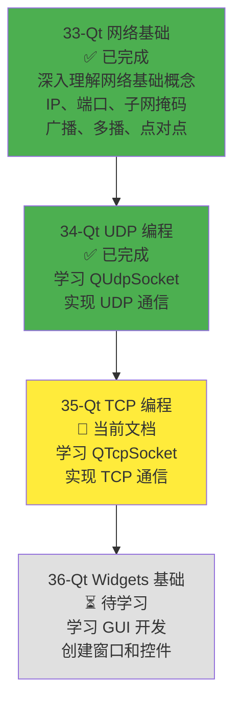
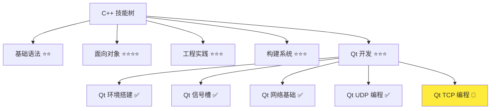
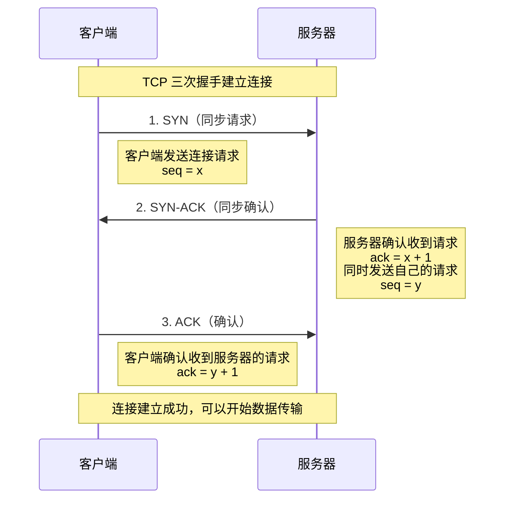
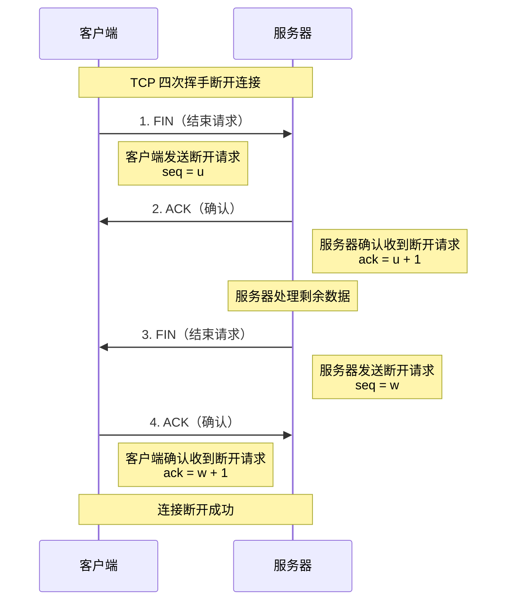
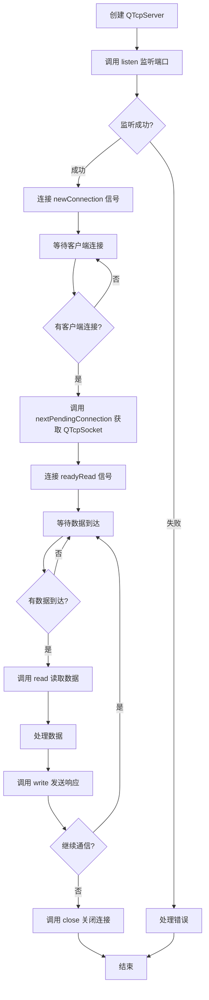
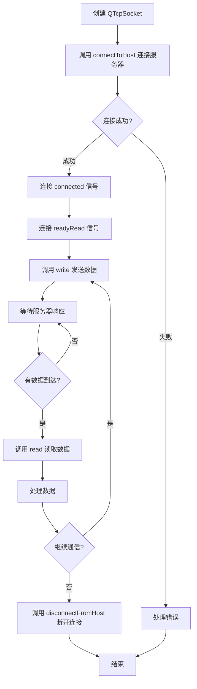
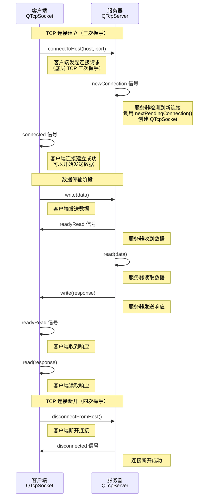
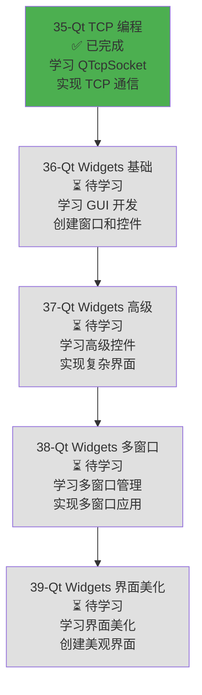

# Qt TCP 编程

> **学习目标**：掌握 QTcpSocket 和 QTcpServer 的使用方法，理解 TCP 连接建立流程和客户端/服务器通信流程，能够实现 TCP 文件传输，为开发局域网聊天软件和屏幕共享软件打下基础  
> **前置知识**：C++ 面向对象基础、Qt 信号槽机制、网络编程概念（Socket、TCP、客户端/服务器模型）、Qt 网络基础（IP、端口）、Qt UDP 编程（QUdpSocket）  
> **预计时间**：120 分钟  
> **难度等级**：⭐⭐⭐  
> **技能收获**：QTcpSocket、QTcpServer、TCP 连接流程、TCP 客户端/服务器通信、文件传输、TCP 应用场景  
> **文档版本**：v1.0  
> **最后更新**：2025-11-23

📊 **难度等级说明**

| 等级           | 描述                       | 练习题数量     | 颜色码 |
| -------------- | -------------------------- | -------------- | ------ |
| **⭐**         | 入门级，零基础可学         | 5 题基础概念题 | 🟢绿   |
| **⭐⭐**       | 基础级，需要基本编程概念   | 5 题基础概念题 | 🟡黄   |
| **⭐⭐⭐**     | 中级，需要相关技术基础     | 3 题代码分析题 | 🟠橙   |
| **⭐⭐⭐⭐**   | 高级，需要扎实的技术功底   | 3 题代码分析题 | 🔴红   |
| **⭐⭐⭐⭐⭐** | 专家级，需要丰富的项目经验 | 2 题设计思考题 | 🟣紫   |

## 1. 学习目标

### 1.1 学习动机

- **实际需求**：开发局域网聊天软件和屏幕共享软件需要使用 TCP 协议进行可靠的文件传输。TCP 协议面向连接、可靠传输，适合文件传输、大文件传输等场景
- **应用场景**：文件传输、大文件传输、可靠数据传输、聊天软件文件传输、屏幕共享文件传输
- **技能价值**：学会后能使用 QTcpSocket 和 QTcpServer 实现 TCP 通信，理解 TCP 连接建立流程和客户端/服务器通信流程，为开发聊天软件和屏幕共享软件打下基础
- **数据支持**：TCP 协议是网络编程的重要组成部分，掌握 TCP 编程是开发可靠通信应用的必备技能

### 1.1.1 为什么需要学习 Qt TCP 编程？

**学习路径设计**：

在学习了 Qt UDP 编程（34-qt-udp-programming.md）之后，我们需要学习 QTcpSocket 和 QTcpServer 的具体使用。这样做的原因：

1. **应用实践**：理解 UDP 通信后，需要学习如何使用 TCP 实现可靠的数据传输
2. **聊天软件需求**：局域网聊天软件需要使用 TCP 进行文件传输（UDP 用于快速消息传输，TCP 用于可靠文件传输）
3. **屏幕共享需求**：屏幕共享软件需要使用 TCP 传输关键数据（如配置文件、元数据），UDP 用于传输屏幕画面数据
4. **理解连接流程**：理解 TCP 连接建立流程（三次握手），才能正确使用 QTcpSocket 和 QTcpServer
5. **掌握可靠传输**：理解 TCP 的可靠传输机制，才能为不同场景选择合适的协议

**学习路径安排**：



**为什么先学 UDP 再学 TCP？**

- ✅ **知识顺序**：UDP 比 TCP 简单，先学 UDP 更容易理解网络编程的基本流程
- ✅ **应用场景**：聊天软件主要使用 UDP 进行消息传输（1v1 聊天用单播，群组聊天用多播），TCP 用于文件传输
- ✅ **循序渐进**：先学习 UDP，理解无连接通信，再学习 TCP，理解面向连接通信

**本章的学习重点**：

- ✅ **TCP 连接建立流程**：理解三次握手的过程（时序图）
- ✅ **TCP 客户端/服务器通信流程**：理解客户端和服务器通信的完整流程（时序图）
- ✅ **QTcpSocket 详解**：理解 QTcpSocket 的主要方法、信号、事件处理
- ✅ **QTcpServer 详解**：理解 QTcpServer 的主要方法、信号、事件处理
- ✅ **TCP 文件传输**：实现完整的 TCP 文件传输示例
- ✅ **实际应用**：理解 TCP 在聊天软件和屏幕共享软件中的应用场景

> **类比**：就像学做菜，已经学会了做凉菜（UDP 编程），现在要学习做热菜（TCP 编程）。TCP 就像需要先热锅再炒菜的热菜，步骤更复杂，但做出来的菜更稳定可靠。

### 1.2 技能树位置



> **图表说明**：C++ 技能树结构图，当前文档点亮 Qt TCP 编程技能点，为后续 GUI 开发和聊天软件开发做准备

### 1.3 前置知识检查

在开始学习之前，请确认你已经掌握：

- [ ] C++ 面向对象基础（类、对象、继承）
- [ ] Qt 信号槽机制（QObject::connect、信号和槽的定义）
- [ ] 网络编程概念（Socket、TCP、客户端/服务器模型）
- [ ] Qt 网络基础（IP、端口、QHostAddress）
- [ ] Qt UDP 编程（QUdpSocket、UDP 通信流程）

> **未掌握处理**：若未通过，请先复习 [Qt 信号槽机制](./31-qt-signals-slots.md)、[网络编程概念](./32-network-programming-concepts.md)、[Qt 网络基础](./33-qt-network-basics.md) 和 [Qt UDP 编程](./34-qt-udp-programming.md)

## 2. 核心内容

### 2.1 TCP 连接建立流程

#### 2.1.1 什么是三次握手？

**三次握手（Three-Way Handshake）**：TCP 协议建立连接的过程，需要客户端和服务器之间进行三次数据交换，才能建立可靠的连接。

> **类比**：三次握手就像打电话：
>
> 1. **第一次握手**：客户端说"你好，我想和你通话"（SYN）
> 2. **第二次握手**：服务器说"好的，我听到了，我也想和你通话"（SYN-ACK）
> 3. **第三次握手**：客户端说"好的，那我们开始通话吧"（ACK）
>
> 只有完成这三次握手，双方才能确认连接建立成功，可以开始通信。

**三次握手的时序图**：



**三次握手的详细过程**：

1. **第一次握手（SYN）**：
   - 客户端向服务器发送 SYN（同步）数据包
   - 客户端进入 `SYN_SENT` 状态
   - 告诉服务器："我想和你建立连接"

2. **第二次握手（SYN-ACK）**：
   - 服务器收到客户端的 SYN 后，向客户端发送 SYN-ACK（同步确认）数据包
   - 服务器进入 `SYN_RCVD` 状态
   - 告诉客户端："我收到了你的请求，我也想和你建立连接"

3. **第三次握手（ACK）**：
   - 客户端收到服务器的 SYN-ACK 后，向服务器发送 ACK（确认）数据包
   - 客户端和服务器都进入 `ESTABLISHED` 状态
   - 告诉服务器："我收到了你的确认，连接建立成功"

**为什么需要三次握手？**

- ✅ **确认双方都能通信**：三次握手确保客户端和服务器都能发送和接收数据
- ✅ **防止重复连接**：如果只有两次握手，服务器无法确认客户端是否收到了自己的确认
- ✅ **同步序列号**：三次握手过程中，双方交换初始序列号，用于后续数据传输

> **类比**：就像两个人约定见面：
>
> - **两次握手**：A 说"我们明天见面吧"，B 说"好的"，但 A 不知道 B 是否真的听到了
> - **三次握手**：A 说"我们明天见面吧"，B 说"好的"，A 再说"好的，那我们明天见"，双方都确认了约定

#### 2.1.2 TCP 连接断开流程（四次挥手）

**四次挥手（Four-Way Handshake）**：TCP 协议断开连接的过程，需要客户端和服务器之间进行四次数据交换，才能安全地断开连接。

> **类比**：四次挥手就像挂电话：
>
> 1. **第一次挥手**：客户端说"我说完了，准备挂电话"（FIN）
> 2. **第二次挥手**：服务器说"好的，我收到了"（ACK）
> 3. **第三次挥手**：服务器说"我也说完了，准备挂电话"（FIN）
> 4. **第四次挥手**：客户端说"好的，那我们挂电话吧"（ACK）

**四次挥手的时序图**：



**为什么需要四次挥手？**

- ✅ **双向关闭**：TCP 连接是全双工的，客户端和服务器都可以发送数据，需要分别关闭两个方向的数据传输
- ✅ **确保数据完整**：服务器收到客户端的 FIN 后，可能还有数据要发送，需要等待数据发送完毕后再发送 FIN

> **类比**：就像两个人通电话，A 说完了，但 B 还有话要说，所以需要分别挂断两个方向的通话

### 2.2 TCP 客户端/服务器通信流程

#### 2.2.1 TCP 服务器通信流程

**TCP 服务器通信流程**：

1. **创建服务器**：创建 `QTcpServer` 对象
2. **监听端口**：调用 `listen()` 方法，监听指定端口
3. **等待连接**：连接 `newConnection` 信号，等待客户端连接
4. **接受连接**：当有客户端连接时，调用 `nextPendingConnection()` 获取 `QTcpSocket` 对象
5. **接收数据**：连接 `readyRead` 信号，接收客户端发送的数据
6. **发送数据**：调用 `write()` 方法，向客户端发送数据
7. **关闭连接**：调用 `close()` 方法，关闭连接

**TCP 服务器通信流程图**：



#### 2.2.2 TCP 客户端通信流程

**TCP 客户端通信流程**：

1. **创建客户端**：创建 `QTcpSocket` 对象
2. **连接服务器**：调用 `connectToHost()` 方法，连接到服务器
3. **等待连接**：连接 `connected` 信号，确认连接成功
4. **发送数据**：调用 `write()` 方法，向服务器发送数据
5. **接收数据**：连接 `readyRead` 信号，接收服务器返回的数据
6. **关闭连接**：调用 `disconnectFromHost()` 方法，断开连接

**TCP 客户端通信流程图**：



#### 2.2.3 TCP 客户端/服务器通信时序图

**TCP 客户端/服务器通信时序图**：



### 2.3 QTcpSocket 类详解

#### 2.3.1 QTcpSocket 类概述

**QTcpSocket**：Qt 提供的 TCP 客户端通信类，封装了 TCP Socket 操作，用于与服务器建立连接并进行数据传输。

**QTcpSocket 的特点**：

1. **基于信号槽**：网络事件通过信号槽通知（connected、disconnected、readyRead、errorOccurred）
2. **异步操作**：网络操作是异步的，不会阻塞程序执行
3. **面向连接**：TCP 是面向连接的协议，需要先建立连接才能传输数据
4. **可靠传输**：TCP 保证数据可靠传输，不会丢失或乱序

> **类比**：QTcpSocket 就像电话，需要先拨号（connectToHost）建立连接，然后才能通话（数据传输），通话结束后挂断（disconnectFromHost）。

#### 2.3.2 QTcpSocket 主要方法

**连接相关方法**：

| 方法                    | 说明                           | 返回值 |
| ----------------------- | ------------------------------ | ------ |
| `connectToHost()`       | 连接到指定的主机和端口         | void   |
| `disconnectFromHost()`  | 断开与服务器的连接             | void   |
| `abort()`               | 立即断开连接（不等待数据发送） | void   |
| `state()`               | 获取 Socket 状态               | State  |
| `waitForConnected()`    | 等待连接建立（阻塞）           | bool   |
| `waitForDisconnected()` | 等待连接断开（阻塞）           | bool   |

**数据传输方法**：

| 方法               | 说明                     | 返回值     |
| ------------------ | ------------------------ | ---------- |
| `write()`          | 发送数据                 | qint64     |
| `read()`           | 读取数据                 | QByteArray |
| `readAll()`        | 读取所有可用数据         | QByteArray |
| `readLine()`       | 读取一行数据（直到换行） | QByteArray |
| `bytesAvailable()` | 获取可读字节数           | qint64     |
| `bytesToWrite()`   | 获取待写字节数           | qint64     |
| `flush()`          | 刷新缓冲区，确保数据发送 | void       |

**状态和错误方法**：

| 方法            | 说明                 | 返回值       |
| --------------- | -------------------- | ------------ |
| `state()`       | 获取 Socket 状态     | State        |
| `error()`       | 获取错误类型         | SocketError  |
| `errorString()` | 获取错误描述         | QString      |
| `isValid()`     | 判断 Socket 是否有效 | bool         |
| `peerAddress()` | 获取对端 IP 地址     | QHostAddress |
| `peerPort()`    | 获取对端端口号       | quint16      |

**QTcpSocket 状态枚举**：

| 状态               | 说明                     |
| ------------------ | ------------------------ |
| `UnconnectedState` | 未连接状态               |
| `HostLookupState`  | 正在查找主机             |
| `ConnectingState`  | 正在连接                 |
| `ConnectedState`   | 已连接状态               |
| `BoundState`       | 已绑定状态（服务器端）   |
| `ListeningState`   | 正在监听状态（服务器端） |
| `ClosingState`     | 正在关闭状态             |

> **📌 说明**：这些状态枚举定义在 `QAbstractSocket` 类中，`QTcpSocket` 继承自 `QAbstractSocket`，所以可以直接使用这些状态。在代码中使用时，需要加上 `QAbstractSocket::` 前缀，如 `QAbstractSocket::ConnectedState`。

#### 2.3.3 QTcpSocket 主要信号

**连接相关信号**：

| 信号           | 说明                  | 参数        |
| -------------- | --------------------- | ----------- |
| `connected`    | 连接成功时发出        | void        |
| `disconnected` | 断开连接时发出        | void        |
| `stateChanged` | Socket 状态改变时发出 | State state |

**数据传输信号**：

| 信号           | 说明                 | 参数         |
| -------------- | -------------------- | ------------ |
| `readyRead`    | 当有数据到达时发出   | void         |
| `bytesWritten` | 当数据写入完成时发出 | qint64 bytes |

**错误信号**：

| 信号            | 说明           | 参数              |
| --------------- | -------------- | ----------------- |
| `errorOccurred` | 发生错误时发出 | SocketError error |

#### 2.3.4 QTcpSocket 使用示例

**基本使用示例**：

```cpp
#include <QTcpSocket>
#include <QHostAddress>
#include <QDebug>

class TcpClient : public QObject
{
    Q_OBJECT

public:
    explicit TcpClient(QObject *parent = nullptr)
        : QObject(parent)
    {
        m_socket = new QTcpSocket(this);

        // 连接信号
        connect(m_socket, &QTcpSocket::connected, this, &TcpClient::onConnected);
        connect(m_socket, &QTcpSocket::disconnected, this, &TcpClient::onDisconnected);
        connect(m_socket, &QTcpSocket::readyRead, this, &TcpClient::onReadyRead);
        connect(m_socket, &QTcpSocket::errorOccurred, this, &TcpClient::onError);
    }

    void connectToServer(const QString &host, quint16 port)
    {
        m_socket->connectToHost(host, port);
        qDebug() << "正在连接到服务器：" << host << ":" << port;
    }

    void sendData(const QByteArray &data)
    {
        // 检查 Socket 状态，只有在已连接状态下才能发送数据
        // QAbstractSocket::ConnectedState 表示 Socket 已连接
        if (m_socket->state() == QAbstractSocket::ConnectedState) {
            m_socket->write(data);
            m_socket->flush(); // 确保数据立即发送
            qDebug() << "发送数据：" << data;
        } else {
            qDebug() << "未连接到服务器，无法发送数据";
        }
    }

    void disconnectFromServer()
    {
        m_socket->disconnectFromHost();
    }

private slots:
    void onConnected()
    {
        qDebug() << "连接成功！";
    }

    void onDisconnected()
    {
        qDebug() << "连接已断开";
    }

    void onReadyRead()
    {
        QByteArray data = m_socket->readAll();
        qDebug() << "收到数据：" << data;
        // 处理接收到的数据
    }

    void onError(QAbstractSocket::SocketError error)
    {
        // QAbstractSocket::SocketError 是错误类型枚举
        // errorString() 返回错误的文字描述
        qDebug() << "发生错误：" << m_socket->errorString();
    }

private:
    QTcpSocket *m_socket;
};
```

**关键点说明**：

1. **创建 QTcpSocket**：使用 `new QTcpSocket(this)` 创建 Socket 对象，`this` 作为父对象，实现自动内存管理
2. **连接信号**：连接 `connected`、`disconnected`、`readyRead`、`errorOccurred` 信号，处理网络事件
3. **连接服务器**：调用 `connectToHost()` 连接到服务器，这是异步操作，不会阻塞程序
4. **发送数据**：调用 `write()` 发送数据，调用 `flush()` 确保数据立即发送
5. **接收数据**：在 `readyRead` 信号槽中调用 `readAll()` 读取所有可用数据
6. **断开连接**：调用 `disconnectFromHost()` 断开连接

> **类比**：就像使用电话：
>
> - **connectToHost()**：就像拨号，拨通后 `connected` 信号会发出
> - **write()**：就像说话，数据会发送到对方
> - **readyRead**：就像听到对方说话，可以读取数据
> - **disconnectFromHost()**：就像挂断电话

### 2.4 QTcpServer 类详解

#### 2.4.1 QTcpServer 类概述

**QTcpServer**：Qt 提供的 TCP 服务器类，用于创建 TCP 服务器，监听客户端连接请求。

**QTcpServer 的特点**：

1. **监听连接**：监听指定端口，等待客户端连接
2. **接受连接**：当有客户端连接时，创建 `QTcpSocket` 对象用于通信
3. **多客户端支持**：可以同时接受多个客户端连接，每个客户端使用独立的 `QTcpSocket` 对象
4. **基于信号槽**：连接事件通过 `newConnection` 信号通知

> **类比**：QTcpServer 就像电话总机，监听来电（listen），当有电话打进来时（newConnection），分配一个分机（QTcpSocket）处理通话。

#### 2.4.2 QTcpServer 主要方法

**服务器管理方法**：

| 方法                     | 说明                     | 返回值       |
| ------------------------ | ------------------------ | ------------ |
| `listen()`               | 监听指定地址和端口       | bool         |
| `close()`                | 关闭服务器，停止监听     | void         |
| `isListening()`          | 判断服务器是否正在监听   | bool         |
| `serverAddress()`        | 获取服务器监听的 IP 地址 | QHostAddress |
| `serverPort()`           | 获取服务器监听的端口号   | quint16      |
| `waitForNewConnection()` | 等待新连接（阻塞）       | bool         |

**连接处理方法**：

| 方法                         | 说明                   | 返回值       |
| ---------------------------- | ---------------------- | ------------ |
| `nextPendingConnection()`    | 获取下一个待处理的连接 | QTcpSocket\* |
| `hasPendingConnections()`    | 判断是否有待处理的连接 | bool         |
| `maxPendingConnections()`    | 获取最大待处理连接数   | int          |
| `setMaxPendingConnections()` | 设置最大待处理连接数   | void         |

#### 2.4.3 QTcpServer 主要信号

| 信号            | 说明                   | 参数                               |
| --------------- | ---------------------- | ---------------------------------- |
| `newConnection` | 当有新客户端连接时发出 | void                               |
| `acceptError`   | 当接受连接出错时发出   | QAbstractSocket::SocketError error |

#### 2.4.4 QTcpServer 使用示例

**基本使用示例**：

```cpp
#include <QTcpServer>
#include <QTcpSocket>
#include <QHostAddress>
#include <QDebug>

class TcpServer : public QObject
{
    Q_OBJECT

public:
    explicit TcpServer(QObject *parent = nullptr)
        : QObject(parent)
    {
        m_server = new QTcpServer(this);

        // 连接信号
        connect(m_server, &QTcpServer::newConnection, this, &TcpServer::onNewConnection);
    }

    bool startServer(quint16 port)
    {
        if (m_server->listen(QHostAddress::AnyIPv4, port)) {
            qDebug() << "服务器启动成功，监听端口：" << port;
            return true;
        } else {
            qDebug() << "服务器启动失败：" << m_server->errorString();
            return false;
        }
    }

    void stopServer()
    {
        m_server->close();
        qDebug() << "服务器已停止";
    }

private slots:
    void onNewConnection()
    {
        // 获取新连接的 Socket
        QTcpSocket *clientSocket = m_server->nextPendingConnection();
        if (!clientSocket) {
            return;
        }

        qDebug() << "新客户端连接："
                 << clientSocket->peerAddress().toString()
                 << ":" << clientSocket->peerPort();

        // 连接客户端的信号
        connect(clientSocket, &QTcpSocket::readyRead, this, [this, clientSocket]() {
            onClientReadyRead(clientSocket);
        });
        connect(clientSocket, &QTcpSocket::disconnected, this, [this, clientSocket]() {
            onClientDisconnected(clientSocket);
        });
    }

    void onClientReadyRead(QTcpSocket *clientSocket)
    {
        QByteArray data = clientSocket->readAll();
        qDebug() << "收到客户端数据：" << data;

        // 处理数据并发送响应
        QByteArray response = "服务器收到：" + data;
        clientSocket->write(response);
        clientSocket->flush();
    }

    void onClientDisconnected(QTcpSocket *clientSocket)
    {
        qDebug() << "客户端断开连接："
                 << clientSocket->peerAddress().toString();
        clientSocket->deleteLater(); // 延迟删除，确保信号处理完成
    }

private:
    QTcpServer *m_server;
};
```

**关键点说明**：

1. **创建 QTcpServer**：使用 `new QTcpServer(this)` 创建服务器对象
2. **监听端口**：调用 `listen()` 监听指定端口，`QHostAddress::AnyIPv4` 表示监听所有网络接口
3. **接受连接**：连接 `newConnection` 信号，当有客户端连接时，调用 `nextPendingConnection()` 获取 `QTcpSocket` 对象
4. **处理客户端**：为每个客户端连接 `readyRead` 和 `disconnected` 信号，处理数据接收和连接断开
5. **内存管理**：客户端断开连接时，调用 `deleteLater()` 延迟删除 Socket 对象，确保信号处理完成

> **类比**：就像餐厅：
>
> - **listen()**：就像餐厅开门，等待顾客
> - **newConnection**：就像有顾客进店，分配一个服务员（QTcpSocket）服务
> - **readyRead**：就像顾客点菜，服务员接收订单
> - **disconnected**：就像顾客离开，服务员完成服务

### 2.5 TCP 文件传输实现

#### 2.5.1 文件传输协议设计

**文件传输协议**：

1. **客户端发送文件信息**：文件名、文件大小
2. **服务器确认接收**：确认可以接收文件
3. **客户端发送文件数据**：分块发送文件数据
4. **服务器确认接收**：每接收一块数据，发送确认
5. **传输完成**：客户端发送完成标志，服务器确认

**文件传输协议格式**：

```
客户端 -> 服务器：
1. 文件信息：FILE_INFO:filename:filesize
2. 文件数据：FILE_DATA:data
3. 传输完成：FILE_END

服务器 -> 客户端：
1. 确认接收：OK
2. 确认接收：OK
3. 确认完成：FILE_RECEIVED
```

#### 2.5.2 文件传输客户端实现

**文件传输客户端示例**：

```cpp
#include <QTcpSocket>
#include <QFile>
#include <QFileInfo>
#include <QDebug>

// QFile：Qt 提供的文件操作类，用于读写文件
// QFileInfo：Qt 提供的文件信息类，用于获取文件信息（文件名、大小等）

class FileTransferClient : public QObject
{
    Q_OBJECT

public:
    explicit FileTransferClient(QObject *parent = nullptr)
        : QObject(parent)
    {
        m_socket = new QTcpSocket(this);
        connect(m_socket, &QTcpSocket::connected, this, &FileTransferClient::onConnected);
        connect(m_socket, &QTcpSocket::readyRead, this, &FileTransferClient::onReadyRead);
        connect(m_socket, &QTcpSocket::errorOccurred, this, &FileTransferClient::onError);
    }

    void sendFile(const QString &filePath, const QString &host, quint16 port)
    {
        m_filePath = filePath;
        m_socket->connectToHost(host, port);
    }

private slots:
    void onConnected()
    {
        qDebug() << "连接成功，开始发送文件：" << m_filePath;

        QFile file(m_filePath);
        if (!file.open(QIODevice::ReadOnly)) {
            qDebug() << "无法打开文件：" << m_filePath;
            m_socket->disconnectFromHost();
            return;
        }

        QFileInfo fileInfo(file);
        QString fileName = fileInfo.fileName(); // 获取文件名（不包含路径）
        qint64 fileSize = file.size();          // 获取文件大小（字节数）

        // 发送文件信息：FILE_INFO:文件名:文件大小
        // arg() 方法用于格式化字符串，%1 和 %2 是占位符
        QByteArray fileInfoData = QString("FILE_INFO:%1:%2").arg(fileName).arg(fileSize).toUtf8();
        m_socket->write(fileInfoData);
        m_socket->flush();

        m_file = &file;
        m_bytesSent = 0;
        m_fileSize = fileSize;
    }

    void onReadyRead()
    {
        QByteArray response = m_socket->readAll();
        QString responseStr = QString::fromUtf8(response);

        if (responseStr == "OK") {
            // 服务器确认接收，发送文件数据
            sendFileData();
        } else if (responseStr == "FILE_RECEIVED") {
            qDebug() << "文件传输完成！";
            m_file->close();
            m_socket->disconnectFromHost();
        } else {
            // 处理其他响应（如错误信息）
            qDebug() << "收到未知响应：" << responseStr;
        }
    }

    void sendFileData()
    {
        const qint64 chunkSize = 4096; // 每次发送 4KB
        QByteArray buffer = m_file->read(chunkSize);

        if (!buffer.isEmpty()) {
            // 将文件数据包装成协议格式：FILE_DATA:数据内容
            QByteArray dataPacket = "FILE_DATA:" + buffer;
            m_socket->write(dataPacket);
            m_socket->flush();

            m_bytesSent += buffer.size();
            qDebug() << "已发送：" << m_bytesSent << "/" << m_fileSize;

            // 如果文件发送完成，发送结束标志
            if (m_bytesSent >= m_fileSize) {
                m_socket->write("FILE_END");
                m_socket->flush();
            }
        } else {
            // 文件读取完成，但可能还有数据未发送（这种情况不应该发生）
            // 为了安全起见，仍然发送结束标志
            if (m_bytesSent >= m_fileSize) {
                m_socket->write("FILE_END");
                m_socket->flush();
            }
        }
    }

    void onError(QAbstractSocket::SocketError error)
    {
        qDebug() << "发生错误：" << m_socket->errorString();
    }

private:
    QTcpSocket *m_socket;
    QString m_filePath;
    QFile *m_file;
    qint64 m_bytesSent;
    qint64 m_fileSize;
};
```

#### 2.5.3 文件传输服务器实现

**文件传输服务器示例**：

```cpp
#include <QTcpServer>
#include <QTcpSocket>
#include <QFile>
#include <QDebug>

// QFile：Qt 提供的文件操作类，用于读写文件
// QStringList：Qt 提供的字符串列表类，用于存储多个字符串（类似 std::vector<QString>）

// QFile：Qt 提供的文件操作类，用于读写文件
// QStringList：Qt 提供的字符串列表类，用于存储多个字符串（类似 std::vector<QString>）

// QFile：Qt 提供的文件操作类，用于读写文件
// QStringList：Qt 提供的字符串列表类，用于存储多个字符串（类似 std::vector<QString>）

class FileTransferServer : public QObject
{
    Q_OBJECT

public:
    explicit FileTransferServer(QObject *parent = nullptr)
        : QObject(parent)
    {
        m_server = new QTcpServer(this);
        connect(m_server, &QTcpServer::newConnection, this, &FileTransferServer::onNewConnection);
    }

    bool startServer(quint16 port)
    {
        return m_server->listen(QHostAddress::AnyIPv4, port);
    }

private slots:
    void onNewConnection()
    {
        QTcpSocket *clientSocket = m_server->nextPendingConnection();
        if (!clientSocket) {
            return;
        }

        qDebug() << "新客户端连接：" << clientSocket->peerAddress().toString();

        // 为每个客户端创建文件接收器
        FileReceiver *receiver = new FileReceiver(clientSocket, this);
        connect(clientSocket, &QTcpSocket::disconnected, receiver, &FileReceiver::deleteLater);
    }

private:
    QTcpServer *m_server;
};

class FileReceiver : public QObject
{
    Q_OBJECT

public:
    explicit FileReceiver(QTcpSocket *socket, QObject *parent = nullptr)
        : QObject(parent), m_socket(socket)
    {
        connect(m_socket, &QTcpSocket::readyRead, this, &FileReceiver::onReadyRead);
    }

private slots:
    void onReadyRead()
    {
        QByteArray data = m_socket->readAll();
        QString dataStr = QString::fromUtf8(data);

        if (dataStr.startsWith("FILE_INFO:")) {
            // 解析文件信息
            // split(":") 将字符串按 ":" 分割成多个部分
            // 例如 "FILE_INFO:test.txt:1024" 分割后得到 ["FILE_INFO", "test.txt", "1024"]
            QStringList parts = dataStr.split(":");
            if (parts.size() >= 3) {
                m_fileName = parts[1];              // 文件名：parts[1]
                m_fileSize = parts[2].toLongLong(); // 文件大小：parts[2]，转换为整数
                m_bytesReceived = 0;

                // 创建文件
                m_file = new QFile("received_" + m_fileName, this);
                if (m_file->open(QIODevice::WriteOnly)) {
                    qDebug() << "开始接收文件：" << m_fileName << "，大小：" << m_fileSize;
                    m_socket->write("OK");
                    m_socket->flush();
                } else {
                    qDebug() << "无法创建文件：" << m_fileName;
                    m_socket->disconnectFromHost();
                }
            }
        } else if (dataStr.startsWith("FILE_DATA:")) {
            // 接收文件数据
            // mid(10) 表示从第 10 个字符开始提取（跳过 "FILE_DATA:" 前缀）
            // toUtf8() 将 QString 转换为 QByteArray（二进制数据）
            QByteArray fileData = dataStr.mid(10).toUtf8();
            m_file->write(fileData);
            m_bytesReceived += fileData.size();
            qDebug() << "已接收：" << m_bytesReceived << "/" << m_fileSize;

            m_socket->write("OK");
            m_socket->flush();
        } else if (dataStr == "FILE_END") {
            // 文件传输完成
            m_file->close();
            qDebug() << "文件接收完成：" << m_fileName;
            m_socket->write("FILE_RECEIVED");
            m_socket->flush();
        }
    }

private:
    QTcpSocket *m_socket;
    QFile *m_file;
    QString m_fileName;
    qint64 m_fileSize;
    qint64 m_bytesReceived;
};
```

**关键点说明**：

1. **文件信息传输**：客户端先发送文件名和文件大小，服务器确认后开始传输
2. **分块传输**：文件数据分块发送，每次发送 4KB，避免一次性发送大文件导致内存问题
3. **确认机制**：每接收一块数据，服务器发送确认，客户端收到确认后再发送下一块
4. **传输完成**：客户端发送 `FILE_END` 标志，服务器确认后关闭文件

> **类比**：就像快递：
>
> - **FILE_INFO**：就像告诉快递员"我有一个包裹要寄，大小是多少"
> - **FILE_DATA**：就像把包裹分成多个小包，一个一个寄
> - **OK**：就像快递员确认"我收到了这个包"
> - **FILE_END**：就像告诉快递员"包裹都寄完了"

### 2.6 TCP 应用场景和最佳实践

#### 2.6.1 TCP 应用场景

**TCP 适合的场景**：

1. **文件传输**：需要可靠传输，数据丢失影响大
2. **网页浏览**：HTTP/HTTPS 协议基于 TCP
3. **邮件发送**：SMTP 协议基于 TCP
4. **远程登录**：SSH 协议基于 TCP
5. **数据库连接**：数据库客户端连接基于 TCP
6. **聊天软件文件传输**：需要可靠传输文件，不能丢失

**TCP 不适合的场景**：

1. **实时聊天消息**：速度更重要，偶尔丢失可以接受（使用 UDP）
2. **在线游戏位置更新**：需要快速更新，偶尔丢失可以接受（使用 UDP）
3. **视频直播**：速度更重要，画面偶尔丢失可以接受（使用 UDP）
4. **DNS 查询**：查询速度快，偶尔失败可以重试（使用 UDP）

#### 2.6.2 TCP 最佳实践

**1. 错误处理**：

```cpp
// QAbstractSocket::SocketError 是错误类型枚举，定义在 QAbstractSocket 类中
connect(m_socket, &QTcpSocket::errorOccurred, this, [](QAbstractSocket::SocketError error) {
    qDebug() << "Socket 错误：" << error;
    // 处理错误，如重连、提示用户等
});
```

**2. 连接超时处理**：

```cpp
QTimer *timeoutTimer = new QTimer(this);
timeoutTimer->setSingleShot(true);
timeoutTimer->setInterval(5000); // 5 秒超时

connect(timeoutTimer, &QTimer::timeout, this, [this]() {
    // 检查 Socket 状态，如果未连接则超时
    if (m_socket->state() != QAbstractSocket::ConnectedState) {
        qDebug() << "连接超时";
        m_socket->abort(); // 立即断开连接
    }
});

m_socket->connectToHost(host, port);
timeoutTimer->start();
```

> **📌 说明**：`QTimer` 是 Qt 提供的定时器类，用于在指定时间后执行操作。`setSingleShot(true)` 表示定时器只触发一次，`setInterval(5000)` 表示 5 秒后触发。关于 `QTimer` 的详细说明，请参考 [Qt 信号槽机制](./31-qt-signals-slots.md)。

**3. 数据发送确认**：

```cpp
// 发送数据后，等待 bytesWritten 信号确认数据已发送
connect(m_socket, &QTcpSocket::bytesWritten, this, [](qint64 bytes) {
    qDebug() << "已发送字节数：" << bytes;
});
```

**4. 大文件传输**：

- 分块传输：大文件分块发送，避免内存问题
- 进度显示：显示传输进度，提升用户体验
- 断点续传：支持断点续传，传输中断后可以继续

**5. 多客户端管理**：

```cpp
// 使用 QList 管理多个客户端连接
QList<QTcpSocket*> m_clients;

void onNewConnection()
{
    QTcpSocket *client = m_server->nextPendingConnection();
    m_clients.append(client);

    connect(client, &QTcpSocket::disconnected, this, [this, client]() {
        m_clients.removeAll(client);
        client->deleteLater();
    });
}
```

### 2.7 项目场景

#### 2.7.1 QtLanChat 项目中的 TCP 应用

在 QtLanChat 项目中，TCP 编程用于：

1. **文件传输**：使用 TCP 传输文件，确保文件完整传输
   - **应用场景**：用户在聊天中发送文件（图片、文档、视频等），需要确保文件完整传输，不能丢失或损坏
   - **实现方式**：使用 TCP 连接，分块传输文件，每块数据都有确认机制
   - **优势**：TCP 保证数据可靠传输，文件不会丢失或损坏

2. **可靠数据传输**：传输重要数据（如用户信息、配置信息），需要可靠传输
   - **应用场景**：用户登录时同步用户信息、修改配置后同步配置信息、用户状态更新等
   - **实现方式**：使用 TCP 连接，确保重要数据完整传输
   - **优势**：TCP 保证数据可靠传输，重要信息不会丢失

3. **大文件传输**：传输大文件（如视频文件、图片文件），使用 TCP 分块传输
   - **应用场景**：传输大文件（如视频文件、高清图片），需要分块传输，显示传输进度
   - **实现方式**：使用 TCP 连接，分块传输文件，每块数据都有确认机制，支持断点续传
   - **优势**：TCP 保证数据可靠传输，支持大文件传输和断点续传

4. **屏幕共享配置传输**：传输屏幕共享的配置信息（如分辨率、帧率、编码格式等）
   - **应用场景**：开始屏幕共享前，需要传输配置信息，确保接收方正确配置
   - **实现方式**：使用 TCP 连接，传输配置信息，确保配置信息完整传输
   - **优势**：TCP 保证配置信息可靠传输，屏幕共享配置不能丢失

**TCP vs UDP 在 QtLanChat 中的应用对照表**：

| 功能         | 协议选择 | 原因                         | 具体应用场景                             |
| ------------ | -------- | ---------------------------- | ---------------------------------------- |
| 1v1 聊天消息 | UDP 单播 | 速度快，偶尔丢失可以接受     | 用户 A 向用户 B 发送文本消息             |
| 群组聊天消息 | UDP 多播 | 速度快，网络负载低           | 群组中发送消息给所有成员                 |
| 文件传输     | TCP      | 需要可靠传输，不能丢失       | 发送图片、文档、视频等文件               |
| 屏幕共享画面 | UDP 多播 | 速度快，画面偶尔丢失可以接受 | 实时传输屏幕画面数据（帧数据）           |
| 屏幕共享配置 | TCP      | 需要可靠传输，配置不能丢失   | 传输分辨率、帧率、编码格式等配置信息     |
| 用户信息同步 | TCP      | 需要可靠传输，信息不能丢失   | 同步用户昵称、头像、在线状态等信息       |
| 聊天记录同步 | TCP      | 需要可靠传输，记录不能丢失   | 同步聊天记录、消息历史等数据（可选功能） |

## 3. 完整的 TCP 聊天程序示例

### 3.1 功能需求

**TCP 聊天服务器功能**：

1. 监听指定端口，等待客户端连接
2. 支持多个客户端同时连接
3. 接收客户端发送的消息
4. 将消息广播给所有连接的客户端
5. 处理客户端断开连接

**TCP 聊天客户端功能**：

1. 连接到服务器
2. 发送消息到服务器
3. 接收服务器广播的消息
4. 显示连接状态和消息

> **📌 说明**：这个示例展示了 TCP 在聊天软件中的应用。在实际的局域网聊天软件中，通常使用 UDP 进行消息传输（速度快），使用 TCP 进行文件传输（可靠）。这个示例主要用于演示 TCP 的多客户端通信能力。

### 3.2 实现要点

**服务器实现要点**：

1. 使用 `QTcpServer` 监听端口
2. 使用 `QList<QTcpSocket*>` 管理多个客户端连接
3. 接收客户端消息后，广播给所有客户端
4. 客户端断开连接时，从列表中移除

**客户端实现要点**：

1. 使用 `QTcpSocket` 连接服务器
2. 连接 `readyRead` 信号接收消息
3. 调用 `write()` 发送消息

### 3.3 项目场景应用

**在 QtLanChat 项目中的应用**：

虽然实际的局域网聊天软件主要使用 UDP 进行消息传输，但 TCP 聊天程序示例可以帮助理解：

1. **多客户端管理**：理解如何管理多个客户端连接，这在文件传输服务器中也会用到
2. **消息广播**：理解如何向多个客户端发送消息，这在文件传输通知中也会用到
3. **连接管理**：理解如何管理客户端连接和断开，这在文件传输中也会用到

**实际应用场景**：

- **文件传输服务器**：当用户发送文件时，使用 TCP 服务器接收文件，确保文件完整传输
- **文件传输客户端**：当用户接收文件时，使用 TCP 客户端连接发送方，接收文件
- **用户信息同步**：当用户信息更新时，使用 TCP 连接同步信息，确保信息完整传输

## 4. 常见问题与解决方案

### 4.1 TCP 常见问题

#### Q1：为什么 TCP 连接建立需要三次握手？

**问题**：为什么不能只用两次握手？

**解答**：

- **确认双方都能通信**：三次握手确保客户端和服务器都能发送和接收数据
- **防止重复连接**：如果只有两次握手，服务器无法确认客户端是否收到了自己的确认
- **同步序列号**：三次握手过程中，双方交换初始序列号，用于后续数据传输

**类比**：就像两个人约定见面，需要三次确认才能确保双方都知道了约定。

#### Q2：TCP 连接断开为什么需要四次挥手？

**问题**：为什么不能只用两次挥手？

**解答**：

- **双向关闭**：TCP 连接是全双工的，客户端和服务器都可以发送数据，需要分别关闭两个方向的数据传输
- **确保数据完整**：服务器收到客户端的 FIN 后，可能还有数据要发送，需要等待数据发送完毕后再发送 FIN

**类比**：就像两个人通电话，A 说完了，但 B 还有话要说，所以需要分别挂断两个方向的通话。

#### Q3：TCP 和 UDP 的区别是什么？

**问题**：什么时候用 TCP，什么时候用 UDP？

**解答**：

| 特性         | TCP（传输控制协议）      | UDP（用户数据报协议） |
| ------------ | ------------------------ | --------------------- |
| **连接方式** | 面向连接（需要建立连接） | 无连接（直接发送）    |
| **可靠性**   | 可靠（保证数据到达）     | 不可靠（可能丢失）    |
| **传输速度** | 较慢（需要建立连接）     | 较快（直接发送）      |
| **数据顺序** | 保证顺序                 | 不保证顺序            |
| **开销**     | 较大（需要维护连接）     | 较小（无需维护连接）  |
| **应用场景** | 文件传输、网页浏览       | 实时聊天、在线游戏    |

**选择原则**：

- **需要可靠传输**：使用 TCP（如文件传输、网页浏览）
- **需要快速传输**：使用 UDP（如实时聊天、在线游戏）
- **数据丢失影响大**：使用 TCP（如文件传输）
- **数据丢失影响小**：使用 UDP（如实时聊天）

#### Q4：如何实现 TCP 文件传输的断点续传？

**问题**：文件传输中断后，如何继续传输？

**解答**：

1. **记录传输进度**：客户端记录已传输的字节数
2. **服务器支持续传**：服务器支持从指定位置开始接收
3. **续传协议**：客户端发送续传请求，包含文件名和起始位置
4. **服务器确认**：服务器确认可以续传，客户端从指定位置开始发送

**实现要点**：

```cpp
// 客户端续传请求
QString resumeRequest = QString("RESUME:%1:%2").arg(fileName).arg(bytesSent);
m_socket->write(resumeRequest.toUtf8());

// 服务器处理续传请求
if (dataStr.startsWith("RESUME:")) {
    QStringList parts = dataStr.split(":");
    QString fileName = parts[1];
    qint64 startPos = parts[2].toLongLong();
    m_file->seek(startPos); // 从指定位置开始写入
    m_bytesReceived = startPos;
}
```

#### Q5：如何处理 TCP 粘包问题？

**问题**：TCP 是流式协议，数据可能粘在一起，如何区分不同的数据包？

**解答**：

1. **固定长度协议**：每个数据包固定长度，读取固定长度数据
2. **长度前缀协议**：数据包前加上长度信息，先读取长度，再读取数据
3. **分隔符协议**：使用特殊字符（如换行符）分隔数据包
4. **自定义协议**：定义自己的协议格式，包含类型、长度等信息

**实现示例（长度前缀协议）**：

```cpp
// 发送数据
QByteArray data = "Hello, World!";
QByteArray length = QByteArray::number(data.size());
QByteArray packet = length + ":" + data; // "13:Hello, World!"
m_socket->write(packet);

// 接收数据
void onReadyRead()
{
    static QByteArray buffer; // 静态变量，用于保存未处理完的数据
    buffer += m_socket->readAll(); // 将新数据追加到缓冲区

    while (true) {
        int colonPos = buffer.indexOf(':'); // 查找分隔符 ":"
        if (colonPos == -1) {
            break; // 没有找到分隔符，等待更多数据
        }

        // 解析长度：buffer.left(colonPos) 获取长度部分，toInt() 转换为整数
        int length = buffer.left(colonPos).toInt();

        // 检查数据是否完整：需要的数据长度 = 分隔符位置 + 1（分隔符本身）+ 数据长度
        if (buffer.size() < colonPos + 1 + length) {
            break; // 数据不完整，等待更多数据
        }

        // 提取完整的数据包：从分隔符后开始，提取指定长度的数据
        QByteArray data = buffer.mid(colonPos + 1, length);

        // 从缓冲区中移除已处理的数据
        buffer.remove(0, colonPos + 1 + length);

        // 处理数据
        processData(data);
    }
}
```

## 5. 练习与测试

### 5.1 练习题

#### 练习 1：理解 TCP 连接建立流程

**题目**：用自己的话解释 TCP 三次握手的过程，并说明为什么需要三次握手。

**要求**：

- 解释三次握手的详细过程
- 说明为什么需要三次握手
- 给出一个生活化的比喻

**参考答案**：

TCP 三次握手是建立可靠连接的过程：

1. **第一次握手**：客户端发送 SYN（同步请求），告诉服务器"我想和你建立连接"
2. **第二次握手**：服务器发送 SYN-ACK（同步确认），告诉客户端"我收到了你的请求，我也想和你建立连接"
3. **第三次握手**：客户端发送 ACK（确认），告诉服务器"我收到了你的确认，连接建立成功"

**为什么需要三次握手**：

- **确认双方都能通信**：三次握手确保客户端和服务器都能发送和接收数据
- **防止重复连接**：如果只有两次握手，服务器无法确认客户端是否收到了自己的确认
- **同步序列号**：三次握手过程中，双方交换初始序列号，用于后续数据传输

**生活化比喻**：就像两个人约定见面，A 说"我们明天见面吧"，B 说"好的"，A 再说"好的，那我们明天见"，双方都确认了约定。

#### 练习 2：实现 TCP 客户端

**题目**：编写一个 TCP 客户端程序，连接到服务器，发送消息，接收响应。

**要求**：

- 使用 `QTcpSocket` 连接到服务器
- 发送消息到服务器
- 接收服务器返回的响应
- 处理连接错误

**参考答案**：

```cpp
#include <QTcpSocket>
#include <QHostAddress>
#include <QDebug>

class TcpClient : public QObject
{
    Q_OBJECT

public:
    explicit TcpClient(QObject *parent = nullptr)
        : QObject(parent)
    {
        m_socket = new QTcpSocket(this);
        connect(m_socket, &QTcpSocket::connected, this, &TcpClient::onConnected);
        connect(m_socket, &QTcpSocket::readyRead, this, &TcpClient::onReadyRead);
        connect(m_socket, &QTcpSocket::errorOccurred, this, &TcpClient::onError);
    }

    void connectToServer(const QString &host, quint16 port)
    {
        m_socket->connectToHost(host, port);
    }

    void sendMessage(const QString &message)
    {
        // 检查 Socket 状态，只有在已连接状态下才能发送数据
        if (m_socket->state() == QAbstractSocket::ConnectedState) {
            m_socket->write(message.toUtf8());
            m_socket->flush();
        }
    }

private slots:
    void onConnected()
    {
        qDebug() << "连接成功！";
    }

    void onReadyRead()
    {
        QByteArray data = m_socket->readAll();
        qDebug() << "收到响应：" << QString::fromUtf8(data);
    }

    void onError(QAbstractSocket::SocketError error)
    {
        // QAbstractSocket::SocketError 是错误类型枚举
        // errorString() 返回错误的文字描述
        qDebug() << "发生错误：" << m_socket->errorString();
    }

private:
    QTcpSocket *m_socket;
};
```

#### 练习 3：实现 TCP 服务器

**题目**：编写一个 TCP 服务器程序，监听端口，接受客户端连接，接收消息并返回响应。

**要求**：

- 使用 `QTcpServer` 监听端口
- 接受客户端连接
- 接收客户端消息
- 向客户端发送响应
- 支持多个客户端同时连接

**参考答案**：

```cpp
#include <QTcpServer>
#include <QTcpSocket>
#include <QDebug>

class TcpServer : public QObject
{
    Q_OBJECT

public:
    explicit TcpServer(QObject *parent = nullptr)
        : QObject(parent)
    {
        m_server = new QTcpServer(this);
        connect(m_server, &QTcpServer::newConnection, this, &TcpServer::onNewConnection);
    }

    bool startServer(quint16 port)
    {
        return m_server->listen(QHostAddress::AnyIPv4, port);
    }

private slots:
    void onNewConnection()
    {
        QTcpSocket *clientSocket = m_server->nextPendingConnection();
        if (!clientSocket) {
            return;
        }

        qDebug() << "新客户端连接：" << clientSocket->peerAddress().toString();

        connect(clientSocket, &QTcpSocket::readyRead, this, [this, clientSocket]() {
            QByteArray data = clientSocket->readAll();
            qDebug() << "收到消息：" << QString::fromUtf8(data);

            // 发送响应
            QByteArray response = "服务器收到：" + data;
            clientSocket->write(response);
            clientSocket->flush();
        });

        connect(clientSocket, &QTcpSocket::disconnected, clientSocket, &QTcpSocket::deleteLater);
    }

private:
    QTcpServer *m_server;
};
```

### 5.2 测试题

#### 测试题 1：TCP vs UDP 选择

**题目**：以下场景应该使用 TCP 还是 UDP？请说明理由。

1. 实时聊天消息传输
2. 文件传输
3. 在线游戏位置更新
4. 网页浏览
5. 视频直播

**参考答案**：

1. **实时聊天消息传输**：UDP。速度更重要，偶尔丢失可以接受，用户可以通过重发解决。
2. **文件传输**：TCP。需要可靠传输，文件丢失影响大，必须保证文件完整。
3. **在线游戏位置更新**：UDP。需要快速更新，偶尔丢失可以接受，下一帧会更新。
4. **网页浏览**：TCP。HTTP/HTTPS 协议基于 TCP，需要可靠传输。
5. **视频直播**：UDP。速度更重要，画面偶尔丢失可以接受，用户几乎感觉不到。

#### 测试题 2：TCP 连接建立流程

**题目**：TCP 三次握手中，客户端和服务器分别处于什么状态？

**参考答案**：

1. **第一次握手**：
   - 客户端：`SYN_SENT`（已发送 SYN）
   - 服务器：`LISTEN`（监听状态）

2. **第二次握手**：
   - 客户端：`SYN_SENT`（等待服务器响应）
   - 服务器：`SYN_RCVD`（已收到 SYN，已发送 SYN-ACK）

3. **第三次握手**：
   - 客户端：`ESTABLISHED`（连接已建立）
   - 服务器：`ESTABLISHED`（连接已建立）

#### 测试题 3：TCP 文件传输实现

**题目**：实现 TCP 文件传输时，为什么要分块传输？如何实现分块传输？

**参考答案**：

**为什么分块传输**：

1. **内存限制**：大文件一次性读取会占用大量内存
2. **网络效率**：分块传输可以更好地利用网络带宽
3. **进度显示**：分块传输可以显示传输进度
4. **错误恢复**：分块传输可以更好地处理传输错误

**如何实现分块传输**：

```cpp
void sendFileData()
{
    const qint64 chunkSize = 4096; // 每次发送 4KB
    QByteArray buffer = m_file->read(chunkSize);

    if (!buffer.isEmpty()) {
        m_socket->write(buffer);
        m_socket->flush();
        m_bytesSent += buffer.size();
    }
}
```

## 6. 配套代码说明

### 6.1 代码位置

配套代码位于 `src/stage1/35-qt-tcp-programming/` 目录下，包含以下示例：

- `01-basic-tcp-client/`：TCP 客户端基础示例
- `02-basic-tcp-server/`：TCP 服务器基础示例
- `03-chat-server/`：TCP 聊天服务器示例
- `04-chat-client/`：TCP 聊天客户端示例
- `05-file-transfer-client/`：TCP 文件传输客户端示例
- `06-file-transfer-server/`：TCP 文件传输服务器示例

### 6.2 编译和运行

**编译**：

```bash
cd src/stage1/35-qt-tcp-programming/01-basic-tcp-client
mkdir build && cd build
cmake ..
cmake --build .
```

**运行**：

1. **先运行服务器**：

   ```bash
   ./tcp-server
   ```

2. **再运行客户端**：

   ```bash
   ./tcp-client
   ```

### 6.3 代码说明

每个示例都包含：

- `CMakeLists.txt`：CMake 配置文件
- `*.h` 和 `*.cpp`：源代码文件
- `README.md`：示例说明文档

## 7. 学习检查清单

完成本章学习后，请检查你是否能够：

- [ ] 理解 TCP 三次握手的过程和原因
- [ ] 理解 TCP 四次挥手的过程和原因
- [ ] 使用 `QTcpSocket` 实现 TCP 客户端
- [ ] 使用 `QTcpServer` 实现 TCP 服务器
- [ ] 理解 TCP 客户端/服务器通信流程
- [ ] 实现 TCP 文件传输
- [ ] 处理 TCP 连接错误和超时
- [ ] 理解 TCP 和 UDP 的区别和应用场景
- [ ] 为不同场景选择合适的协议（TCP 或 UDP）

## 8. 学习成果

完成本章学习后，你将能够：

- ✅ 理解 TCP 连接建立流程（三次握手）和断开流程（四次挥手）
- ✅ 使用 `QTcpSocket` 实现 TCP 客户端通信
- ✅ 使用 `QTcpServer` 实现 TCP 服务器通信
- ✅ 理解 TCP 客户端/服务器通信流程
- ✅ 实现 TCP 文件传输
- ✅ 处理 TCP 连接错误和超时
- ✅ 理解 TCP 和 UDP 的区别，为不同场景选择合适的协议
- ✅ 为 QtLanChat 项目选择合适的网络协议（UDP 用于消息传输，TCP 用于文件传输）

## 9. 下一步学习

完成本章学习后，建议继续学习：

- **36-qt-widgets-basics.md**：Qt Widgets 基础控件，学习 GUI 开发
- **37-qt-widgets-advanced.md**：Qt Widgets 高级控件，学习更复杂的 GUI 组件
- **38-qt-widgets-multi-window.md**：Qt Widgets 多窗口管理，学习多窗口应用开发
- **39-qt-widgets-styling.md**：Qt Widgets 界面美化，学习界面美化技巧

**学习路径图**：


