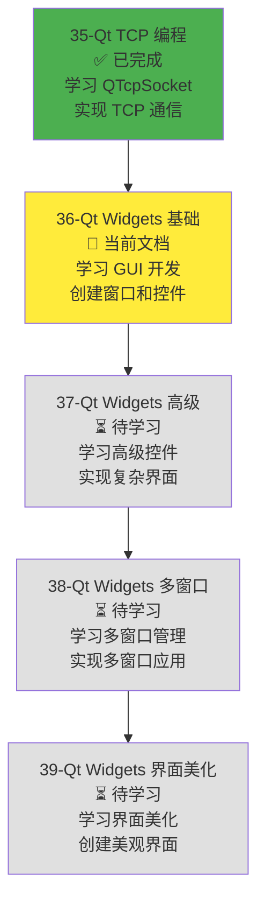
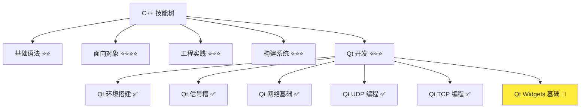
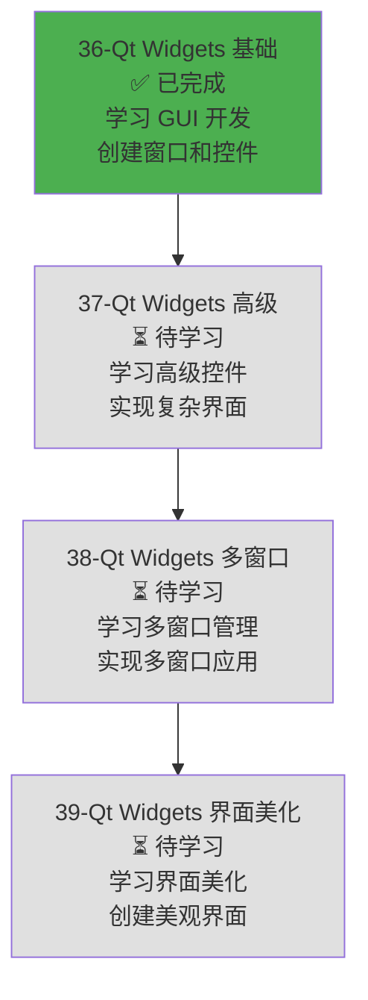

# Qt Widgets 基础控件

> **学习目标**：掌握 Qt Widgets 模块的基础控件和布局管理，理解窗口创建和事件处理，能够创建简单的 GUI 应用程序，为开发局域网聊天软件界面打下基础  
> **前置知识**：C++ 面向对象基础、Qt 信号槽机制（QObject::connect、信号和槽的定义）、Qt 环境搭建（Qt 6.9+ 安装、CMake 配置）  
> **预计时间**：90 分钟  
> **难度等级**：⭐⭐⭐  
> **技能收获**：QApplication、QWidget、QMainWindow、基础控件、布局管理、事件处理、GUI 应用开发  
> **文档版本**：v1.1  
> **最后更新**：2025-11-23

📊 **难度等级说明**

| 等级           | 描述                       | 练习题数量     | 颜色码 |
| -------------- | -------------------------- | -------------- | ------ |
| **⭐**         | 入门级，零基础可学         | 5 题基础概念题 | 🟢绿   |
| **⭐⭐**       | 基础级，需要基本编程概念   | 5 题基础概念题 | 🟡黄   |
| **⭐⭐⭐**     | 中级，需要相关技术基础     | 3 题代码分析题 | 🟠橙   |
| **⭐⭐⭐⭐**   | 高级，需要扎实的技术功底   | 3 题代码分析题 | 🔴红   |
| **⭐⭐⭐⭐⭐** | 专家级，需要丰富的项目经验 | 2 题设计思考题 | 🟣紫   |

## 1. 学习目标

### 1.1 学习动机

- **实际需求**：开发局域网聊天软件和屏幕共享软件需要创建图形用户界面（GUI）。Qt Widgets 模块提供了丰富的 GUI 控件，是开发桌面应用的基础
- **应用场景**：聊天软件界面（消息显示、输入框、按钮）、屏幕共享软件界面（控制面板、设置窗口）、桌面应用开发、GUI 应用开发
- **技能价值**：学会后能使用 Qt Widgets 创建 GUI 应用，理解窗口、控件和布局的使用方法，为开发聊天软件和屏幕共享软件界面打下基础
- **数据支持**：Qt Widgets 是 Qt 框架的核心模块，提供了完整的桌面应用开发工具集，掌握 Widgets 是开发 Qt GUI 应用的必备技能

### 1.1.1 为什么需要学习 Qt Widgets 基础控件？

**学习路径设计**：

在学习了 Qt 网络编程（UDP 和 TCP）之后，我们需要学习 Qt Widgets 来创建图形用户界面。这样做的原因：

1. **聊天软件需求**：局域网聊天软件需要 GUI 界面来显示消息、输入文本、点击按钮等
2. **屏幕共享需求**：屏幕共享软件需要 GUI 界面来控制共享、设置参数、显示状态等
3. **用户体验**：GUI 应用比命令行应用更友好，用户可以通过图形界面交互
4. **基础控件**：基础控件（按钮、输入框、标签等）是 GUI 应用的基础，必须先掌握
5. **布局管理**：布局管理是 GUI 应用的关键，合理的布局能让界面美观易用

**学习路径安排**：



**为什么先学网络编程再学 GUI？**

- ✅ **功能分离**：网络编程负责数据传输，GUI 负责用户交互，先实现功能再设计界面更合理
- ✅ **理解深入**：理解了网络编程后，知道如何将网络功能集成到 GUI 应用中
- ✅ **循序渐进**：先学习核心功能（网络通信），再学习用户界面（GUI），符合软件开发流程

**本章的学习重点**：

- ✅ **Qt Widgets 模块**：理解 QApplication、QWidget、QMainWindow 的作用
- ✅ **基础控件**：掌握 QPushButton、QLineEdit、QTextEdit、QLabel、QCheckBox、QRadioButton 的使用
- ✅ **布局管理**：理解 QVBoxLayout、QHBoxLayout、QGridLayout、QFormLayout 的使用
- ✅ **窗口基础**：理解窗口创建、属性设置、显示和关闭
- ✅ **事件处理**：理解鼠标事件和键盘事件的处理方法
- ✅ **实际应用**：创建一个简单的 GUI 应用（计算器或登录窗口）

> **类比**：Qt Widgets 就像**搭积木**：
>
> - **QWidget** 就像积木的基座，所有控件都基于它
> - **QPushButton**、**QLineEdit** 等就像不同形状的积木块
> - **布局管理**就像积木的排列规则，决定积木如何摆放
> - **QMainWindow** 就像积木的框架，提供主窗口结构
> - 通过组合这些"积木"，可以搭建出各种 GUI 应用

### 1.2 技能树位置



> **图表说明**：C++ 技能树结构图，当前文档点亮 Qt Widgets 基础技能点，为后续高级控件和多窗口管理做准备

### 1.3 前置知识检查

在开始学习之前，请确认你已经掌握：

- [ ] C++ 面向对象基础（类、对象、继承）
- [ ] Qt 信号槽机制（QObject::connect、信号和槽的定义）
- [ ] Qt 环境搭建（Qt 6.9+ 安装、CMake 配置）

> **未掌握处理**：若未通过，请先复习 [Qt 信号槽机制](./31-qt-signals-slots.md) 和 [Qt 环境搭建](./30-qt-environment-setup.md)

## 2. 核心内容

### 2.1 Qt Widgets 模块概述

#### 2.1.1 什么是 Qt Widgets？

**Qt Widgets**：Qt 提供的桌面应用 GUI 框架，提供了丰富的控件和窗口类，用于创建图形用户界面。

**Qt Widgets 的特点**：

1. **丰富的控件**：提供了按钮、输入框、标签、列表、表格等常用控件
2. **布局管理**：提供了灵活的布局管理器，自动调整控件位置和大小
3. **事件处理**：基于信号槽机制，支持鼠标、键盘等事件处理
4. **跨平台**：支持 Windows、macOS、Linux 等主流操作系统
5. **样式定制**：支持样式表（QSS），可以自定义控件外观

> **类比**：Qt Widgets 就像**工具箱**，里面装满了各种工具（控件），可以用来搭建 GUI 应用。

#### 2.1.2 Qt Widgets 核心类

**QApplication**：Qt 应用程序类，管理应用程序的生命周期和事件循环。

- **作用**：每个 Qt GUI 应用必须有一个 QApplication 对象，用于初始化 Qt 系统、处理事件循环
- **特点**：单例模式，整个应用只有一个 QApplication 实例
- **生命周期**：从 `main()` 函数开始创建，到 `exec()` 返回时结束

**QWidget**：所有控件的基类，提供了窗口和控件的基础功能。

- **作用**：所有 GUI 控件都继承自 QWidget，提供了显示、事件处理、样式等基础功能
- **特点**：可以独立显示（作为窗口），也可以作为其他控件的子控件
- **用途**：创建自定义控件、作为容器放置其他控件

**QMainWindow**：主窗口类，提供了应用程序主窗口的标准结构。

- **作用**：提供了菜单栏、工具栏、状态栏、中央区域等标准窗口结构
- **特点**：适合创建主窗口，提供了窗口管理功能（最小化、最大化、关闭等）
- **用途**：创建应用程序的主窗口

> **类比**：
>
> - **QApplication** 就像**应用程序的管家**，管理整个应用的生命周期
> - **QWidget** 就像**积木的基座**，所有控件都基于它
> - **QMainWindow** 就像**房子的框架**，提供了主窗口的标准结构

#### 2.1.3 Qt Widgets 应用基本结构

**Qt Widgets 应用的基本结构**：

```cpp
#include <QtWidgets/QApplication>
#include <QtWidgets/QMainWindow>
#include <QtWidgets/QPushButton>
#include <QtWidgets/QVBoxLayout>
#include <QtWidgets/QWidget>

int main(int argc, char *argv[])
{
    // 1. 创建 QApplication 对象（必须）
    QApplication app(argc, argv);

    // 2. 创建主窗口
    QMainWindow window;
    window.setWindowTitle("Qt Widgets 示例");
    window.resize(400, 300);

    // 3. 创建中央控件（用于放置其他控件）
    QWidget *centralWidget = new QWidget(&window);
    window.setCentralWidget(centralWidget);

    // 4. 创建布局管理器
    QVBoxLayout *layout = new QVBoxLayout(centralWidget);

    // 5. 创建控件
    QPushButton *button = new QPushButton("点击我", centralWidget);
    layout->addWidget(button);

    // 6. 连接信号槽
    // 使用 Lambda 表达式作为槽函数（已在 26-lambda-expressions.md 和 31-qt-signals-slots.md 中学习）
    QObject::connect(button, &QPushButton::clicked, []() {
        qDebug() << "按钮被点击了！";
    });

    // 7. 显示窗口
    window.show();

    // 8. 启动事件循环（阻塞，直到窗口关闭）
    return app.exec();
}
```

**关键点说明**：

1. **QApplication**：必须创建，管理应用程序生命周期
2. **QMainWindow**：主窗口，提供标准窗口结构
3. **QWidget**：中央控件，用于放置其他控件
4. **布局管理器**：管理控件的排列方式
5. **控件创建**：创建各种 GUI 控件
6. **信号槽连接**：连接控件的信号和槽函数
7. **显示窗口**：调用 `show()` 显示窗口
8. **事件循环**：调用 `exec()` 启动事件循环，处理用户交互

> **类比**：就像**搭建房子**：
>
> - **QApplication**：房子的地基（必须）
> - **QMainWindow**：房子的框架（主窗口）
> - **QWidget**：房间（放置控件）
> - **布局管理器**：房间的布局规则（如何摆放家具）
> - **控件**：家具（按钮、输入框等）
> - **信号槽**：家具的功能（点击按钮做什么）
> - **事件循环**：房子的运行（等待用户操作）

### 2.2 基础控件

#### 2.2.1 QPushButton（按钮）

**QPushButton**：Qt 提供的按钮控件，用于响应用户点击操作。

**QPushButton 的特点**：

1. **点击响应**：点击按钮时发出 `clicked` 信号
2. **文本显示**：可以显示文本标签
3. **图标支持**：可以显示图标
4. **状态管理**：支持按下、释放、禁用等状态

**QPushButton 主要方法**：

| 方法             | 说明               | 返回值  |
| ---------------- | ------------------ | ------- |
| `setText()`      | 设置按钮文本       | void    |
| `text()`         | 获取按钮文本       | QString |
| `setIcon()`      | 设置按钮图标       | void    |
| `setEnabled()`   | 设置按钮是否可用   | void    |
| `isEnabled()`    | 获取按钮是否可用   | bool    |
| `setCheckable()` | 设置按钮是否可切换 | void    |
| `isChecked()`    | 获取按钮是否被选中 | bool    |

**QPushButton 主要信号**：

| 信号       | 说明               | 参数         |
| ---------- | ------------------ | ------------ |
| `clicked`  | 按钮被点击时发出   | void         |
| `pressed`  | 按钮被按下时发出   | void         |
| `released` | 按钮被释放时发出   | void         |
| `toggled`  | 按钮状态切换时发出 | bool checked |

**QPushButton 使用示例**：

```cpp
#include <QtWidgets/QApplication>
#include <QtWidgets/QPushButton>
#include <QtWidgets/QVBoxLayout>
#include <QtWidgets/QWidget>

int main(int argc, char *argv[])
{
    QApplication app(argc, argv);

    QWidget window;
    window.setWindowTitle("QPushButton 示例");
    window.resize(300, 200);

    QVBoxLayout *layout = new QVBoxLayout(&window);

    // 创建按钮
    QPushButton *button1 = new QPushButton("普通按钮", &window);
    QPushButton *button2 = new QPushButton("禁用按钮", &window);
    QPushButton *button3 = new QPushButton("切换按钮", &window);

    // 设置按钮2为禁用状态
    button2->setEnabled(false);

    // 设置按钮3为可切换状态
    button3->setCheckable(true);

    // 连接信号槽
    QObject::connect(button1, &QPushButton::clicked, []() {
        qDebug() << "普通按钮被点击了！";
    });

    QObject::connect(button3, &QPushButton::toggled, [](bool checked) {
        qDebug() << "切换按钮状态：" << (checked ? "选中" : "未选中");
    });

    // 添加到布局
    layout->addWidget(button1);
    layout->addWidget(button2);
    layout->addWidget(button3);

    window.show();
    return app.exec();
}
```

> **类比**：QPushButton 就像**门铃按钮**，按下时会触发动作（发出信号）。

#### 2.2.2 QLineEdit（单行输入框）

**QLineEdit**：Qt 提供的单行文本输入框，用于输入单行文本。

**QLineEdit 的特点**：

1. **单行输入**：只能输入单行文本
2. **文本验证**：支持输入验证（如只允许数字）
3. **占位符**：支持占位符文本（提示用户输入内容）
4. **密码模式**：支持密码输入模式（显示为星号）

**QLineEdit 主要方法**：

| 方法                   | 说明                   | 返回值  |
| ---------------------- | ---------------------- | ------- |
| `setText()`            | 设置文本内容           | void    |
| `text()`               | 获取文本内容           | QString |
| `setPlaceholderText()` | 设置占位符文本         | void    |
| `setEchoMode()`        | 设置回显模式（密码等） | void    |
| `setMaxLength()`       | 设置最大长度           | void    |
| `setReadOnly()`        | 设置只读模式           | void    |
| `clear()`              | 清空文本内容           | void    |

**QLineEdit 主要信号**：

| 信号              | 说明             | 参数                |
| ----------------- | ---------------- | ------------------- |
| `textChanged`     | 文本改变时发出   | const QString &text |
| `textEdited`      | 文本被编辑时发出 | const QString &text |
| `editingFinished` | 编辑完成时发出   | void                |
| `returnPressed`   | 按下回车键时发出 | void                |

**QLineEdit 使用示例**：

```cpp
#include <QtWidgets/QApplication>
#include <QtWidgets/QLineEdit>
#include <QtWidgets/QVBoxLayout>
#include <QtWidgets/QWidget>
#include <QtCore/QDebug>

int main(int argc, char *argv[])
{
    QApplication app(argc, argv);

    QWidget window;
    window.setWindowTitle("QLineEdit 示例");
    window.resize(300, 200);

    QVBoxLayout *layout = new QVBoxLayout(&window);

    // 创建输入框
    QLineEdit *lineEdit1 = new QLineEdit(&window);
    lineEdit1->setPlaceholderText("请输入用户名");

    QLineEdit *lineEdit2 = new QLineEdit(&window);
    lineEdit2->setPlaceholderText("请输入密码");
    lineEdit2->setEchoMode(QLineEdit::Password); // 密码模式

    QLineEdit *lineEdit3 = new QLineEdit(&window);
    lineEdit3->setPlaceholderText("只读输入框");
    lineEdit3->setReadOnly(true);
    lineEdit3->setText("这是只读文本");

    // 连接信号槽
    QObject::connect(lineEdit1, &QLineEdit::textChanged, [](const QString &text) {
        qDebug() << "文本改变：" << text;
    });

    QObject::connect(lineEdit2, &QLineEdit::returnPressed, []() {
        qDebug() << "密码输入完成，按下回车键";
    });

    // 添加到布局
    layout->addWidget(lineEdit1);
    layout->addWidget(lineEdit2);
    layout->addWidget(lineEdit3);

    window.show();
    return app.exec();
}
```

> **类比**：QLineEdit 就像**填写表格的单行输入框**，用户可以输入单行文本。

#### 2.2.3 QTextEdit（多行文本输入框）

**QTextEdit**：Qt 提供的多行文本输入框，用于输入和显示多行文本。

**QTextEdit 的特点**：

1. **多行输入**：可以输入和显示多行文本
2. **富文本支持**：支持富文本格式（HTML、Markdown 等）
3. **滚动支持**：自动支持滚动条，可以显示大量文本
4. **文本操作**：支持复制、粘贴、撤销、重做等操作

**QTextEdit 主要方法**：

| 方法             | 说明           | 返回值  |
| ---------------- | -------------- | ------- |
| `setPlainText()` | 设置纯文本内容 | void    |
| `toPlainText()`  | 获取纯文本内容 | QString |
| `setHtml()`      | 设置 HTML 内容 | void    |
| `toHtml()`       | 获取 HTML 内容 | QString |
| `setReadOnly()`  | 设置只读模式   | void    |
| `clear()`        | 清空文本内容   | void    |
| `append()`       | 追加文本内容   | void    |

**QTextEdit 主要信号**：

| 信号          | 说明           | 参数 |
| ------------- | -------------- | ---- |
| `textChanged` | 文本改变时发出 | void |

**QTextEdit 使用示例**：

```cpp
#include <QtWidgets/QApplication>
#include <QtWidgets/QTextEdit>
#include <QtWidgets/QPushButton>
#include <QtWidgets/QVBoxLayout>
#include <QtWidgets/QWidget>
#include <QtCore/QDebug>

int main(int argc, char *argv[])
{
    QApplication app(argc, argv);

    QWidget window;
    window.setWindowTitle("QTextEdit 示例");
    window.resize(400, 300);

    QVBoxLayout *layout = new QVBoxLayout(&window);

    // 创建多行文本输入框
    QTextEdit *textEdit = new QTextEdit(&window);
    // 注意：QTextEdit 没有 setPlaceholderText() 方法（这是 QLineEdit 的方法）
    // 如果需要提示文本，可以在初始化时设置文本，或者使用 QLabel 作为提示

    // 创建按钮
    QPushButton *button = new QPushButton("获取文本", &window);

    // 连接信号槽
    QObject::connect(button, &QPushButton::clicked, [textEdit]() {
        QString text = textEdit->toPlainText();
        qDebug() << "文本内容：" << text;
    });

    // 添加到布局
    layout->addWidget(textEdit);
    layout->addWidget(button);

    window.show();
    return app.exec();
}
```

> **类比**：QTextEdit 就像**记事本**，可以输入和显示多行文本。

#### 2.2.4 QLabel（标签）

**QLabel**：Qt 提供的标签控件，用于显示文本或图片。

**QLabel 的特点**：

1. **文本显示**：可以显示文本内容
2. **图片显示**：可以显示图片（QPixmap、QImage）
3. **对齐方式**：支持文本对齐（左对齐、居中、右对齐）
4. **自动换行**：支持文本自动换行

**QLabel 主要方法**：

| 方法             | 说明             | 返回值  |
| ---------------- | ---------------- | ------- |
| `setText()`      | 设置文本内容     | void    |
| `text()`         | 获取文本内容     | QString |
| `setPixmap()`    | 设置图片         | void    |
| `setAlignment()` | 设置对齐方式     | void    |
| `setWordWrap()`  | 设置是否自动换行 | void    |

**QLabel 使用示例**：

```cpp
#include <QtWidgets/QApplication>
#include <QtWidgets/QLabel>
#include <QtWidgets/QVBoxLayout>
#include <QtWidgets/QWidget>

int main(int argc, char *argv[])
{
    QApplication app(argc, argv);

    QWidget window;
    window.setWindowTitle("QLabel 示例");
    window.resize(300, 200);

    QVBoxLayout *layout = new QVBoxLayout(&window);

    // 创建标签
    QLabel *label1 = new QLabel("普通文本标签", &window);

    QLabel *label2 = new QLabel("居中对齐的标签", &window);
    label2->setAlignment(Qt::AlignCenter);

    QLabel *label3 = new QLabel("这是一个很长的文本标签，支持自动换行功能，当文本超过控件宽度时会自动换行显示", &window);
    label3->setWordWrap(true); // 启用自动换行

    // 添加到布局
    layout->addWidget(label1);
    layout->addWidget(label2);
    layout->addWidget(label3);

    window.show();
    return app.exec();
}
```

> **类比**：QLabel 就像**标签纸**，用于显示文本或图片信息。

#### 2.2.5 QCheckBox（复选框）

**QCheckBox**：Qt 提供的复选框控件，用于多选操作。

**QCheckBox 的特点**：

1. **多选支持**：可以同时选择多个选项
2. **三态支持**：支持三种状态（未选中、选中、部分选中）
3. **文本标签**：可以显示文本标签

**QCheckBox 主要方法**：

| 方法            | 说明                 | 返回值         |
| --------------- | -------------------- | -------------- |
| `setText()`     | 设置文本标签         | void           |
| `setChecked()`  | 设置选中状态         | void           |
| `isChecked()`   | 获取选中状态         | bool           |
| `setTristate()` | 设置三态模式         | void           |
| `checkState()`  | 获取选中状态（三态） | Qt::CheckState |

**QCheckBox 主要信号**：

| 信号           | 说明                         | 参数         |
| -------------- | ---------------------------- | ------------ |
| `clicked`      | 复选框被点击时发出           | bool checked |
| `toggled`      | 复选框状态切换时发出         | bool checked |
| `stateChanged` | 复选框状态改变时发出（三态） | int state    |

**QCheckBox 使用示例**：

```cpp
#include <QtWidgets/QApplication>
#include <QtWidgets/QCheckBox>
#include <QtWidgets/QVBoxLayout>
#include <QtWidgets/QWidget>
#include <QtCore/QDebug>

int main(int argc, char *argv[])
{
    QApplication app(argc, argv);

    QWidget window;
    window.setWindowTitle("QCheckBox 示例");
    window.resize(300, 200);

    QVBoxLayout *layout = new QVBoxLayout(&window);

    // 创建复选框
    QCheckBox *checkBox1 = new QCheckBox("选项 1", &window);
    QCheckBox *checkBox2 = new QCheckBox("选项 2", &window);
    QCheckBox *checkBox3 = new QCheckBox("选项 3（默认选中）", &window);

    // 设置默认选中
    checkBox3->setChecked(true);

    // 连接信号槽
    QObject::connect(checkBox1, &QCheckBox::toggled, [](bool checked) {
        qDebug() << "选项 1：" << (checked ? "选中" : "未选中");
    });

    // 添加到布局
    layout->addWidget(checkBox1);
    layout->addWidget(checkBox2);
    layout->addWidget(checkBox3);

    window.show();
    return app.exec();
}
```

> **类比**：QCheckBox 就像**多选题的选项框**，可以同时选择多个选项。

#### 2.2.6 QRadioButton（单选按钮）

**QRadioButton**：Qt 提供的单选按钮控件，用于单选操作。

**QRadioButton 的特点**：

1. **单选支持**：同一组内只能选择一个选项
2. **分组管理**：需要将多个 QRadioButton 放在同一个 QButtonGroup 中
3. **文本标签**：可以显示文本标签

**QRadioButton 主要方法**：

| 方法           | 说明         | 返回值 |
| -------------- | ------------ | ------ |
| `setText()`    | 设置文本标签 | void   |
| `setChecked()` | 设置选中状态 | void   |
| `isChecked()`  | 获取选中状态 | bool   |

**QRadioButton 主要信号**：

| 信号      | 说明                   | 参数         |
| --------- | ---------------------- | ------------ |
| `clicked` | 单选按钮被点击时发出   | void         |
| `toggled` | 单选按钮状态切换时发出 | bool checked |

**QRadioButton 使用示例**：

```cpp
#include <QtWidgets/QApplication>
#include <QtWidgets/QRadioButton>
#include <QtWidgets/QButtonGroup>
#include <QtWidgets/QVBoxLayout>
#include <QtWidgets/QWidget>
#include <QtCore/QDebug>

int main(int argc, char *argv[])
{
    QApplication app(argc, argv);

    QWidget window;
    window.setWindowTitle("QRadioButton 示例");
    window.resize(300, 200);

    QVBoxLayout *layout = new QVBoxLayout(&window);

    // 创建按钮组（用于管理单选按钮）
    QButtonGroup *buttonGroup = new QButtonGroup(&window);

    // 创建单选按钮
    QRadioButton *radio1 = new QRadioButton("选项 1", &window);
    QRadioButton *radio2 = new QRadioButton("选项 2", &window);
    QRadioButton *radio3 = new QRadioButton("选项 3", &window);

    // 将单选按钮添加到按钮组
    buttonGroup->addButton(radio1, 1);
    buttonGroup->addButton(radio2, 2);
    buttonGroup->addButton(radio3, 3);

    // 设置默认选中
    radio1->setChecked(true);

    // 连接信号槽
    // QOverload<int>::of() 用于选择重载函数中的特定版本（QButtonGroup::buttonClicked 有多个重载版本）
    QObject::connect(buttonGroup, QOverload<int>::of(&QButtonGroup::buttonClicked), [](int id) {
        qDebug() << "选中的选项 ID：" << id;
    });

    // 添加到布局
    layout->addWidget(radio1);
    layout->addWidget(radio2);
    layout->addWidget(radio3);

    window.show();
    return app.exec();
}
```

> **类比**：QRadioButton 就像**单选题的选项**，同一组内只能选择一个选项。

### 2.3 布局管理

#### 2.3.1 什么是布局管理？

**布局管理**：Qt 提供的自动排列控件位置的机制，根据窗口大小自动调整控件位置和大小。

**布局管理的优势**：

1. **自动调整**：窗口大小改变时，控件自动调整位置和大小
2. **跨平台**：不同平台下界面布局保持一致
3. **代码简洁**：不需要手动计算控件位置
4. **响应式**：支持响应式布局，适应不同屏幕尺寸

> **类比**：布局管理就像**自动排列的积木**，当容器大小改变时，积木会自动重新排列。

#### 2.3.2 QVBoxLayout（垂直布局）

**QVBoxLayout**：垂直布局管理器，将控件按垂直方向排列。

**QVBoxLayout 的特点**：

1. **垂直排列**：控件从上到下依次排列
2. **自动拉伸**：控件可以自动拉伸填充空间
3. **间距控制**：可以设置控件之间的间距

**QVBoxLayout 主要方法**：

| 方法                   | 说明         | 返回值 |
| ---------------------- | ------------ | ------ |
| `addWidget()`          | 添加控件     | void   |
| `addLayout()`          | 添加子布局   | void   |
| `addStretch()`         | 添加弹性空间 | void   |
| `setSpacing()`         | 设置控件间距 | void   |
| `setContentsMargins()` | 设置边距     | void   |

**QVBoxLayout 使用示例**：

```cpp
#include <QtWidgets/QApplication>
#include <QtWidgets/QVBoxLayout>
#include <QtWidgets/QPushButton>
#include <QtWidgets/QWidget>

int main(int argc, char *argv[])
{
    QApplication app(argc, argv);

    QWidget window;
    window.setWindowTitle("QVBoxLayout 示例");
    window.resize(300, 300);

    QVBoxLayout *layout = new QVBoxLayout(&window);

    // 创建按钮
    QPushButton *button1 = new QPushButton("按钮 1", &window);
    QPushButton *button2 = new QPushButton("按钮 2", &window);
    QPushButton *button3 = new QPushButton("按钮 3", &window);

    // 添加到布局
    layout->addWidget(button1);
    layout->addWidget(button2);
    layout->addWidget(button3);
    layout->addStretch(); // 添加弹性空间，将按钮推到顶部

    window.show();
    return app.exec();
}
```

> **类比**：QVBoxLayout 就像**垂直排列的书架**，书籍从上到下依次排列。

#### 2.3.3 QHBoxLayout（水平布局）

**QHBoxLayout**：水平布局管理器，将控件按水平方向排列。

**QHBoxLayout 的特点**：

1. **水平排列**：控件从左到右依次排列
2. **自动拉伸**：控件可以自动拉伸填充空间
3. **间距控制**：可以设置控件之间的间距

**QHBoxLayout 使用示例**：

```cpp
#include <QtWidgets/QApplication>
#include <QtWidgets/QHBoxLayout>
#include <QtWidgets/QPushButton>
#include <QtWidgets/QWidget>

int main(int argc, char *argv[])
{
    QApplication app(argc, argv);

    QWidget window;
    window.setWindowTitle("QHBoxLayout 示例");
    window.resize(400, 100);

    QHBoxLayout *layout = new QHBoxLayout(&window);

    // 创建按钮
    QPushButton *button1 = new QPushButton("按钮 1", &window);
    QPushButton *button2 = new QPushButton("按钮 2", &window);
    QPushButton *button3 = new QPushButton("按钮 3", &window);

    // 添加到布局
    layout->addWidget(button1);
    layout->addWidget(button2);
    layout->addWidget(button3);
    layout->addStretch(); // 添加弹性空间，将按钮推到左侧

    window.show();
    return app.exec();
}
```

> **类比**：QHBoxLayout 就像**水平排列的书架**，书籍从左到右依次排列。

#### 2.3.4 QGridLayout（网格布局）

**QGridLayout**：网格布局管理器，将控件按网格方式排列。

**QGridLayout 的特点**：

1. **网格排列**：控件按行和列排列成网格
2. **灵活布局**：可以跨行跨列放置控件
3. **自动调整**：网格大小自动调整

**QGridLayout 主要方法**：

| 方法                 | 说明                 | 返回值 |
| -------------------- | -------------------- | ------ |
| `addWidget()`        | 添加控件（指定行列） | void   |
| `setRowStretch()`    | 设置行拉伸比例       | void   |
| `setColumnStretch()` | 设置列拉伸比例       | void   |
| `setSpacing()`       | 设置控件间距         | void   |

**QGridLayout 使用示例**：

```cpp
#include <QtWidgets/QApplication>
#include <QtWidgets/QGridLayout>
#include <QtWidgets/QPushButton>
#include <QtWidgets/QWidget>

int main(int argc, char *argv[])
{
    QApplication app(argc, argv);

    QWidget window;
    window.setWindowTitle("QGridLayout 示例");
    window.resize(300, 200);

    QGridLayout *layout = new QGridLayout(&window);

    // 创建按钮
    QPushButton *button1 = new QPushButton("按钮 1", &window);
    QPushButton *button2 = new QPushButton("按钮 2", &window);
    QPushButton *button3 = new QPushButton("按钮 3", &window);
    QPushButton *button4 = new QPushButton("按钮 4", &window);

    // 添加到网格布局（行，列）
    layout->addWidget(button1, 0, 0); // 第 0 行，第 0 列
    layout->addWidget(button2, 0, 1); // 第 0 行，第 1 列
    layout->addWidget(button3, 1, 0); // 第 1 行，第 0 列
    layout->addWidget(button4, 1, 1); // 第 1 行，第 1 列

    window.show();
    return app.exec();
}
```

> **类比**：QGridLayout 就像**表格**，控件按行和列排列。

#### 2.3.5 QFormLayout（表单布局）

**QFormLayout**：表单布局管理器，用于创建表单（标签-输入框对）。

**QFormLayout 的特点**：

1. **标签-输入框对**：自动创建标签和输入框的配对
2. **对齐方式**：标签和输入框自动对齐
3. **表单风格**：适合创建表单界面

**QFormLayout 主要方法**：

| 方法                  | 说明                  | 返回值 |
| --------------------- | --------------------- | ------ |
| `addRow()`            | 添加一行（标签+控件） | void   |
| `setLabelAlignment()` | 设置标签对齐方式      | void   |

**QFormLayout 使用示例**：

```cpp
#include <QtWidgets/QApplication>
#include <QtWidgets/QFormLayout>
#include <QtWidgets/QLineEdit>
#include <QtWidgets/QWidget>

int main(int argc, char *argv[])
{
    QApplication app(argc, argv);

    QWidget window;
    window.setWindowTitle("QFormLayout 示例");
    window.resize(300, 150);

    QFormLayout *layout = new QFormLayout(&window);

    // 创建输入框
    QLineEdit *nameEdit = new QLineEdit(&window);
    QLineEdit *emailEdit = new QLineEdit(&window);
    QLineEdit *phoneEdit = new QLineEdit(&window);

    // 添加表单行（标签文本，控件）
    layout->addRow("姓名：", nameEdit);
    layout->addRow("邮箱：", emailEdit);
    layout->addRow("电话：", phoneEdit);

    window.show();
    return app.exec();
}
```

> **类比**：QFormLayout 就像**填写表格**，每行有标签和输入框。

### 2.4 窗口基础

#### 2.4.1 QMainWindow（主窗口）

**QMainWindow**：Qt 提供的主窗口类，提供了应用程序主窗口的标准结构。

**QMainWindow 的结构**：

1. **菜单栏（MenuBar）**：位于窗口顶部，提供菜单功能
2. **工具栏（ToolBar）**：位于菜单栏下方，提供快捷工具
3. **状态栏（StatusBar）**：位于窗口底部，显示状态信息
4. **中央区域（CentralWidget）**：窗口中央区域，放置主要内容

**QMainWindow 主要方法**：

| 方法                 | 说明         | 返回值       |
| -------------------- | ------------ | ------------ |
| `setMenuBar()`       | 设置菜单栏   | void         |
| `menuBar()`          | 获取菜单栏   | QMenuBar\*   |
| `addToolBar()`       | 添加工具栏   | QToolBar\*   |
| `setStatusBar()`     | 设置状态栏   | void         |
| `statusBar()`        | 获取状态栏   | QStatusBar\* |
| `setCentralWidget()` | 设置中央控件 | void         |
| `centralWidget()`    | 获取中央控件 | QWidget\*    |

**QMainWindow 使用示例**：

```cpp
#include <QtWidgets/QApplication>
#include <QtWidgets/QMainWindow>
#include <QtWidgets/QMenuBar>
#include <QtWidgets/QStatusBar>
#include <QtWidgets/QPushButton>
#include <QtWidgets/QVBoxLayout>
#include <QtWidgets/QWidget>

int main(int argc, char *argv[])
{
    QApplication app(argc, argv);

    QMainWindow window;
    window.setWindowTitle("QMainWindow 示例");
    window.resize(400, 300);

    // 创建菜单栏
    QMenuBar *menuBar = window.menuBar();
    QMenu *fileMenu = menuBar->addMenu("文件");
    // QMenu 和 QAction 是菜单相关的类（将在后续文档 38-qt-widgets-multi-window.md 中详细介绍）
    fileMenu->addAction("新建");
    fileMenu->addAction("打开");
    fileMenu->addAction("保存");

    // 创建状态栏
    QStatusBar *statusBar = window.statusBar();
    statusBar->showMessage("就绪");

    // 创建中央控件
    QWidget *centralWidget = new QWidget(&window);
    QVBoxLayout *layout = new QVBoxLayout(centralWidget);

    QPushButton *button = new QPushButton("点击我", centralWidget);
    layout->addWidget(button);

    window.setCentralWidget(centralWidget);
    window.show();

    return app.exec();
}
```

> **类比**：QMainWindow 就像**房子的框架**，提供了主窗口的标准结构（菜单栏、工具栏、状态栏、中央区域）。

#### 2.4.2 QWidget（基础窗口）

**QWidget**：所有控件的基类，也可以作为独立窗口使用。

**QWidget 作为窗口的特点**：

1. **独立窗口**：可以独立显示，不需要 QMainWindow
2. **简单应用**：适合创建简单的窗口应用
3. **轻量级**：比 QMainWindow 更轻量，适合简单界面

**QWidget 窗口主要方法**：

| 方法               | 说明         | 返回值 |
| ------------------ | ------------ | ------ |
| `setWindowTitle()` | 设置窗口标题 | void   |
| `setWindowIcon()`  | 设置窗口图标 | void   |
| `resize()`         | 设置窗口大小 | void   |
| `show()`           | 显示窗口     | void   |
| `hide()`           | 隐藏窗口     | void   |
| `close()`          | 关闭窗口     | bool   |
| `setMinimumSize()` | 设置最小尺寸 | void   |
| `setMaximumSize()` | 设置最大尺寸 | void   |

**QWidget 使用示例**：

```cpp
#include <QtWidgets/QApplication>
#include <QtWidgets/QWidget>
#include <QtWidgets/QPushButton>
#include <QtWidgets/QVBoxLayout>

int main(int argc, char *argv[])
{
    QApplication app(argc, argv);

    QWidget window;
    window.setWindowTitle("QWidget 窗口示例");
    window.resize(300, 200);
    window.setMinimumSize(200, 150); // 设置最小尺寸

    QVBoxLayout *layout = new QVBoxLayout(&window);

    QPushButton *button = new QPushButton("关闭窗口", &window);
    QObject::connect(button, &QPushButton::clicked, &window, &QWidget::close);

    layout->addWidget(button);
    window.show();

    return app.exec();
}
```

> **类比**：QWidget 作为窗口就像**简单的房间**，没有复杂的结构，适合简单应用。

### 2.5 事件处理基础

#### 2.5.1 鼠标事件

**鼠标事件**：Qt 提供的鼠标交互事件，包括鼠标按下、释放、移动、双击等。

**鼠标事件类型**：

| 事件类型                  | 说明               |
| ------------------------- | ------------------ |
| `mousePressEvent()`       | 鼠标按下时触发     |
| `mouseReleaseEvent()`     | 鼠标释放时触发     |
| `mouseMoveEvent()`        | 鼠标移动时触发     |
| `mouseDoubleClickEvent()` | 鼠标双击时触发     |
| `wheelEvent()`            | 鼠标滚轮滚动时触发 |

**鼠标事件处理示例**：

```cpp
#include <QtWidgets/QApplication>
#include <QtWidgets/QWidget>
#include <QtCore/QDebug>
#include <QtGui/QMouseEvent>

class CustomWidget : public QWidget
{
public:
    explicit CustomWidget(QWidget *parent = nullptr) : QWidget(parent)
    {
        setMouseTracking(true); // 启用鼠标跟踪
    }

protected:
    // override 关键字（C++11）：明确表示这是重写基类的虚函数，如果函数签名不匹配会编译错误
    void mousePressEvent(QMouseEvent *event) override
    {
        if (event->button() == Qt::LeftButton) {
            qDebug() << "左键按下：" << event->pos();
        } else if (event->button() == Qt::RightButton) {
            qDebug() << "右键按下：" << event->pos();
        }
    }

    void mouseReleaseEvent(QMouseEvent *event) override
    {
        qDebug() << "鼠标释放：" << event->pos();
    }

    void mouseMoveEvent(QMouseEvent *event) override
    {
        qDebug() << "鼠标移动：" << event->pos();
    }

    void mouseDoubleClickEvent(QMouseEvent *event) override
    {
        qDebug() << "鼠标双击：" << event->pos();
    }
};

int main(int argc, char *argv[])
{
    QApplication app(argc, argv);

    CustomWidget window;
    window.setWindowTitle("鼠标事件示例");
    window.resize(400, 300);
    window.show();

    return app.exec();
}
```

> **类比**：鼠标事件就像**触摸操作**，可以检测鼠标的各种操作（点击、移动、双击等）。

#### 2.5.2 键盘事件

**键盘事件**：Qt 提供的键盘交互事件，包括按键按下、释放等。

**键盘事件类型**：

| 事件类型            | 说明           |
| ------------------- | -------------- |
| `keyPressEvent()`   | 按键按下时触发 |
| `keyReleaseEvent()` | 按键释放时触发 |

**键盘事件处理示例**：

```cpp
#include <QtWidgets/QApplication>
#include <QtWidgets/QWidget>
#include <QtCore/QDebug>
#include <QtGui/QKeyEvent>

class CustomWidget : public QWidget
{
protected:
    // override 关键字（C++11）：明确表示这是重写基类的虚函数
    void keyPressEvent(QKeyEvent *event) override
    {
        qDebug() << "按键按下：" << event->text() << "，键码：" << event->key();

        // 处理特殊按键
        if (event->key() == Qt::Key_Escape) {
            qDebug() << "按下 ESC 键，关闭窗口";
            close();
        } else if (event->key() == Qt::Key_Enter || event->key() == Qt::Key_Return) {
            qDebug() << "按下回车键";
        }
    }

    void keyReleaseEvent(QKeyEvent *event) override
    {
        qDebug() << "按键释放：" << event->text();
    }
};

int main(int argc, char *argv[])
{
    QApplication app(argc, argv);

    CustomWidget window;
    window.setWindowTitle("键盘事件示例");
    window.resize(400, 300);
    window.setFocusPolicy(Qt::StrongFocus); // 设置焦点策略，接收键盘事件
    window.show();

    return app.exec();
}
```

> **类比**：键盘事件就像**打字操作**，可以检测键盘按键的按下和释放。

## 3. 完整的 GUI 应用示例

### 3.1 功能需求

**简单计算器应用**：

1. 显示窗口标题"简单计算器"
2. 两个数字输入框（QLineEdit）
3. 运算符选择（QRadioButton：加法、减法、乘法、除法）
4. 计算按钮（QPushButton）
5. 结果显示标签（QLabel）
6. 使用布局管理器排列控件

### 3.2 实现要点

**界面布局**：

- 使用 QVBoxLayout 垂直布局
- 使用 QFormLayout 创建表单（标签-输入框对）
- 使用 QHBoxLayout 水平排列单选按钮
- 使用 QButtonGroup 管理单选按钮组

**功能实现**：

- 读取两个输入框的数字
- 获取选中的运算符
- 执行计算
- 显示结果

### 3.3 完整代码示例

```cpp
#include <QtWidgets/QApplication>
#include <QtWidgets/QMainWindow>
#include <QtWidgets/QWidget>
#include <QtWidgets/QVBoxLayout>
#include <QtWidgets/QFormLayout>
#include <QtWidgets/QHBoxLayout>
#include <QtWidgets/QLineEdit>
#include <QtWidgets/QLabel>
#include <QtWidgets/QPushButton>
#include <QtWidgets/QRadioButton>
#include <QtWidgets/QButtonGroup>
#include <QtCore/QDebug>

class CalculatorWindow : public QMainWindow
{
    Q_OBJECT

public:
    explicit CalculatorWindow(QWidget *parent = nullptr)
        : QMainWindow(parent)
    {
        setWindowTitle("简单计算器");
        resize(400, 300);

        // 创建中央控件
        QWidget *centralWidget = new QWidget(this);
        setCentralWidget(centralWidget);

        // 创建主布局
        QVBoxLayout *mainLayout = new QVBoxLayout(centralWidget);

        // 创建表单布局（输入框）
        QFormLayout *formLayout = new QFormLayout();
        m_num1Edit = new QLineEdit(this);
        m_num2Edit = new QLineEdit(this);
        formLayout->addRow("数字 1：", m_num1Edit);
        formLayout->addRow("数字 2：", m_num2Edit);
        mainLayout->addLayout(formLayout);

        // 创建运算符选择（单选按钮）
        QLabel *operatorLabel = new QLabel("运算符：", this);
        mainLayout->addWidget(operatorLabel);

        QHBoxLayout *operatorLayout = new QHBoxLayout();
        m_buttonGroup = new QButtonGroup(this);

        QRadioButton *addRadio = new QRadioButton("加法", this);
        QRadioButton *subRadio = new QRadioButton("减法", this);
        QRadioButton *mulRadio = new QRadioButton("乘法", this);
        QRadioButton *divRadio = new QRadioButton("除法", this);

        m_buttonGroup->addButton(addRadio, 0); // 加法
        m_buttonGroup->addButton(subRadio, 1); // 减法
        m_buttonGroup->addButton(mulRadio, 2); // 乘法
        m_buttonGroup->addButton(divRadio, 3); // 除法

        addRadio->setChecked(true); // 默认选择加法

        operatorLayout->addWidget(addRadio);
        operatorLayout->addWidget(subRadio);
        operatorLayout->addWidget(mulRadio);
        operatorLayout->addWidget(divRadio);
        mainLayout->addLayout(operatorLayout);

        // 创建计算按钮
        QPushButton *calcButton = new QPushButton("计算", this);
        mainLayout->addWidget(calcButton);

        // 创建结果显示标签
        m_resultLabel = new QLabel("结果：", this);
        m_resultLabel->setAlignment(Qt::AlignCenter);
        mainLayout->addWidget(m_resultLabel);

        // 添加弹性空间
        mainLayout->addStretch();

        // 连接信号槽
        connect(calcButton, &QPushButton::clicked, this, &CalculatorWindow::calculate);
    }

private slots:
    void calculate()
    {
        // 获取输入的数字
        bool ok1, ok2;
        double num1 = m_num1Edit->text().toDouble(&ok1);
        double num2 = m_num2Edit->text().toDouble(&ok2);

        if (!ok1 || !ok2) {
            m_resultLabel->setText("结果：输入错误，请输入数字！");
            return;
        }

        // 获取选中的运算符
        int operatorId = m_buttonGroup->checkedId();
        double result = 0.0;

        switch (operatorId) {
        case 0: // 加法
            result = num1 + num2;
            break;
        case 1: // 减法
            result = num1 - num2;
            break;
        case 2: // 乘法
            result = num1 * num2;
            break;
        case 3: // 除法
            if (num2 == 0.0) {
                m_resultLabel->setText("结果：除数不能为 0！");
                return;
            }
            result = num1 / num2;
            break;
        }

        // 显示结果
        m_resultLabel->setText(QString("结果：%1").arg(result));
    }

private:
    QLineEdit *m_num1Edit;
    QLineEdit *m_num2Edit;
    QButtonGroup *m_buttonGroup;
    QLabel *m_resultLabel;
};

#include "main.moc" // MOC 处理（如果使用单独的 .cpp 文件，不需要这行）
// 注意：如果使用单独的 .cpp 文件，MOC 会自动处理，不需要手动包含 "main.moc"

int main(int argc, char *argv[])
{
    QApplication app(argc, argv);

    CalculatorWindow window;
    window.show();

    return app.exec();
}
```

**关键点说明**：

1. **继承 QMainWindow**：创建主窗口类，继承自 QMainWindow
2. **布局管理**：使用 QVBoxLayout、QFormLayout、QHBoxLayout 管理控件布局
3. **控件创建**：创建 QLineEdit、QRadioButton、QPushButton、QLabel 等控件
4. **信号槽连接**：连接按钮的 clicked 信号到计算槽函数
5. **数据验证**：验证输入是否为有效数字
6. **错误处理**：处理除零错误和输入错误

> **类比**：这个计算器应用就像**一个简单的计算工具**，用户可以输入数字、选择运算符、点击计算按钮，然后看到结果。

### 3.4 项目场景

#### 3.4.1 QtLanChat 项目中的 Widgets 应用

在 QtLanChat 项目中，Qt Widgets 基础控件用于：

1. **聊天软件界面**：
   - **消息显示区域**：使用 `QTextEdit`（只读模式）显示聊天消息历史，支持滚动查看历史消息
   - **消息输入框**：使用 `QLineEdit` 或 `QTextEdit` 输入聊天消息（单行使用 QLineEdit，多行使用 QTextEdit）
   - **发送按钮**：使用 `QPushButton` 发送消息，点击按钮时获取输入框内容并通过 UDP/TCP 发送
   - **用户列表**：使用 `QLabel` 显示在线用户列表（将在高级控件中学习 QListWidget）
   - **状态显示**：使用 `QLabel` 显示连接状态、在线状态等信息

2. **屏幕共享软件界面**：
   - **控制面板**：使用 `QPushButton` 创建开始/停止共享按钮、设置按钮等
   - **设置窗口**：使用 `QLineEdit` 输入分辨率、帧率等参数，使用 `QCheckBox` 选择编码格式等选项
   - **状态显示**：使用 `QLabel` 显示共享状态、连接状态、帧率等信息
   - **参数选择**：使用 `QRadioButton` 选择共享模式（全屏/窗口/区域）

**Qt Widgets 基础控件在 QtLanChat 中的应用对照表**：

| 控件类型         | 在聊天软件中的应用                    | 在屏幕共享软件中的应用            |
| ---------------- | ------------------------------------- | --------------------------------- |
| **QTextEdit**    | 消息显示区域（只读）、多行消息输入    | 日志显示区域（只读）              |
| **QLineEdit**    | 单行消息输入、用户名输入、IP 地址输入 | 分辨率输入、帧率输入、IP 地址输入 |
| **QPushButton**  | 发送按钮、连接按钮、断开按钮          | 开始共享按钮、停止共享按钮        |
| **QLabel**       | 用户名显示、状态显示、消息提示        | 状态显示、参数说明、帧率显示      |
| **QCheckBox**    | 记住密码、自动连接、消息通知设置      | 编码格式选择、传输质量设置        |
| **QRadioButton** | 连接方式选择（UDP/TCP）               | 共享模式选择（全屏/窗口/区域）    |

**实际应用示例（聊天软件界面布局）**：

```cpp
// 聊天软件主窗口布局示例（概念性示例）
class ChatWindow : public QMainWindow
{
    Q_OBJECT

public:
    explicit ChatWindow(QWidget *parent = nullptr) : QMainWindow(parent)
    {
        setWindowTitle("QtLanChat - 聊天窗口");
        resize(600, 500);

        QWidget *centralWidget = new QWidget(this);
        setCentralWidget(centralWidget);

        QVBoxLayout *mainLayout = new QVBoxLayout(centralWidget);

        // 1. 消息显示区域（QTextEdit，只读）
        m_messageDisplay = new QTextEdit(this);
        m_messageDisplay->setReadOnly(true); // 只读，用于显示消息
        // 注意：QTextEdit 没有 setPlaceholderText() 方法，可以在初始化时设置提示文本
        m_messageDisplay->setPlainText("消息将显示在这里...\n");
        mainLayout->addWidget(m_messageDisplay);

        // 2. 输入区域（水平布局：输入框 + 发送按钮）
        QHBoxLayout *inputLayout = new QHBoxLayout();
        m_messageInput = new QLineEdit(this);
        m_messageInput->setPlaceholderText("输入消息...");
        m_sendButton = new QPushButton("发送", this);
        inputLayout->addWidget(m_messageInput);
        inputLayout->addWidget(m_sendButton);
        mainLayout->addLayout(inputLayout);

        // 3. 连接信号槽
        connect(m_sendButton, &QPushButton::clicked, this, &ChatWindow::sendMessage);
        connect(m_messageInput, &QLineEdit::returnPressed, this, &ChatWindow::sendMessage);
    }

private slots:
    void sendMessage()
    {
        QString message = m_messageInput->text();
        if (!message.isEmpty()) {
            // 显示消息到消息区域
            m_messageDisplay->append(QString("[我] %1").arg(message));
            // 通过网络发送消息（使用之前学习的 UDP/TCP 编程）
            // m_udpSocket->writeDatagram(...);
            m_messageInput->clear(); // 清空输入框
        }
    }

private:
    QTextEdit *m_messageDisplay;  // 消息显示区域
    QLineEdit *m_messageInput;     // 消息输入框
    QPushButton *m_sendButton;     // 发送按钮
};
```

> **📌 说明**：这是一个概念性示例，展示了如何将 Qt Widgets 基础控件应用到聊天软件界面中。实际应用中还需要结合之前学习的 UDP/TCP 网络编程知识来实现消息的发送和接收。

## 4. 常见问题与解决方案

### 4.1 Qt Widgets 常见问题

#### Q1：为什么需要 QApplication？

**问题**：为什么每个 Qt Widgets 应用都需要创建 QApplication 对象？

**解答**：

- **事件循环**：QApplication 管理应用程序的事件循环，处理用户交互（鼠标、键盘等）
- **系统集成**：QApplication 负责与操作系统的集成（窗口管理、消息处理等）
- **单例模式**：整个应用只能有一个 QApplication 实例
- **生命周期**：QApplication 管理应用程序的整个生命周期

**类比**：QApplication 就像**应用程序的管家**，管理整个应用的运行。

#### Q2：QWidget 和 QMainWindow 的区别是什么？

**问题**：什么时候用 QWidget，什么时候用 QMainWindow？

**解答**：

| 特性         | QWidget              | QMainWindow            |
| ------------ | -------------------- | ---------------------- |
| **用途**     | 简单窗口或控件基类   | 应用程序主窗口         |
| **结构**     | 无标准结构           | 菜单栏、工具栏、状态栏 |
| **复杂度**   | 简单                 | 复杂                   |
| **适用场景** | 简单应用、自定义控件 | 主窗口应用、复杂界面   |

**选择原则**：

- **简单应用**：使用 QWidget（如对话框、简单工具）
- **主窗口应用**：使用 QMainWindow（如主程序窗口）

**类比**：QWidget 就像**简单的房间**，QMainWindow 就像**完整的房子**（有厨房、客厅、卧室等）。

#### Q3：布局管理器的作用是什么？

**问题**：为什么需要使用布局管理器？

**解答**：

- **自动调整**：窗口大小改变时，控件自动调整位置和大小
- **跨平台**：不同平台下界面布局保持一致
- **代码简洁**：不需要手动计算控件位置
- **响应式**：支持响应式布局，适应不同屏幕尺寸

**类比**：布局管理器就像**自动排列的积木**，当容器大小改变时，积木会自动重新排列。

#### Q4：如何自定义控件？

**问题**：如何创建自定义控件？

**解答**：

1. **继承 QWidget**：创建自定义控件类，继承自 QWidget
2. **重写事件**：重写 `paintEvent()`、`mousePressEvent()` 等事件处理函数
3. **添加属性**：添加自定义属性和方法
4. **信号槽**：定义自定义信号和槽

**实现示例**：

```cpp
#include <QtWidgets/QWidget>
#include <QtGui/QPaintEvent>
#include <QtGui/QMouseEvent>

class CustomButton : public QWidget
{
    Q_OBJECT

public:
    explicit CustomButton(QWidget *parent = nullptr) : QWidget(parent) {}

signals:
    void clicked(); // 自定义信号

protected:
    // override 关键字（C++11）：明确表示这是重写基类的虚函数
    void paintEvent(QPaintEvent *event) override
    {
        // 自定义绘制（使用 QPainter 进行绘制，将在后续文档中详细介绍）
        Q_UNUSED(event); // 标记未使用的参数，避免编译器警告
    }

    void mousePressEvent(QMouseEvent *event) override
    {
        if (event->button() == Qt::LeftButton) {
            emit clicked(); // 发出信号
        }
    }
};
```

> **📌 说明**：`paintEvent()` 用于自定义控件的绘制，需要使用 `QPainter` 类进行绘制。关于 `QPainter` 的详细说明，将在后续文档中详细介绍。`Q_UNUSED()` 宏用于标记未使用的参数，避免编译器警告。

#### Q5：如何处理窗口关闭事件？

**问题**：如何在窗口关闭时执行清理操作？

**解答**：

1. **重写 closeEvent()**：重写 `closeEvent()` 函数处理关闭事件
2. **确认对话框**：显示确认对话框，询问用户是否关闭
3. **清理资源**：执行清理操作（保存数据、释放资源等）

**实现示例**：

```cpp
#include <QtWidgets/QMainWindow>
#include <QtGui/QCloseEvent>
#include <QtWidgets/QMessageBox>

class MainWindow : public QMainWindow
{
protected:
    // override 关键字（C++11）：明确表示这是重写基类的虚函数
    void closeEvent(QCloseEvent *event) override
    {
        // 显示确认对话框
        // QMessageBox 是 Qt 提供的消息框类，用于显示对话框（将在后续文档中详细介绍）
        QMessageBox::StandardButton reply = QMessageBox::question(
            this, "确认", "确定要关闭窗口吗？",
            QMessageBox::Yes | QMessageBox::No
        );

        if (reply == QMessageBox::Yes) {
            // 执行清理操作
            // saveData();
            event->accept(); // 接受关闭事件
        } else {
            event->ignore(); // 忽略关闭事件
        }
    }
};
```

> **📌 说明**：`QMessageBox` 是 Qt 提供的消息框类，用于显示对话框（如确认对话框、警告对话框等）。关于 `QMessageBox` 的详细说明，将在后续文档（38-qt-widgets-multi-window.md）中详细介绍。

## 5. 练习与测试

### 5.1 练习题

#### 练习 1：创建登录窗口

**题目**：创建一个登录窗口，包含用户名输入框、密码输入框和登录按钮。

**要求**：

- 使用 QFormLayout 创建表单布局
- 密码输入框使用密码模式
- 点击登录按钮时，验证用户名和密码（简单验证即可）
- 显示验证结果

**参考答案**：

```cpp
#include <QtWidgets/QApplication>
#include <QtWidgets/QWidget>
#include <QtWidgets/QVBoxLayout>
#include <QtWidgets/QFormLayout>
#include <QtWidgets/QLineEdit>
#include <QtWidgets/QPushButton>
#include <QtWidgets/QLabel>

class LoginWindow : public QWidget
{
    Q_OBJECT

public:
    explicit LoginWindow(QWidget *parent = nullptr) : QWidget(parent)
    {
        setWindowTitle("登录窗口");
        resize(300, 150);

        QVBoxLayout *mainLayout = new QVBoxLayout(this);

        QFormLayout *formLayout = new QFormLayout();
        m_usernameEdit = new QLineEdit(this);
        m_passwordEdit = new QLineEdit(this);
        m_passwordEdit->setEchoMode(QLineEdit::Password);

        formLayout->addRow("用户名：", m_usernameEdit);
        formLayout->addRow("密码：", m_passwordEdit);
        mainLayout->addLayout(formLayout);

        QPushButton *loginButton = new QPushButton("登录", this);
        mainLayout->addWidget(loginButton);

        m_resultLabel = new QLabel("", this);
        mainLayout->addWidget(m_resultLabel);

        connect(loginButton, &QPushButton::clicked, this, &LoginWindow::login);
    }

private slots:
    void login()
    {
        QString username = m_usernameEdit->text();
        QString password = m_passwordEdit->text();

        // 简单验证（实际应用中应该连接数据库或网络验证）
        if (username == "admin" && password == "123456") {
            m_resultLabel->setText("登录成功！");
            m_resultLabel->setStyleSheet("color: green;"); // 设置样式表，将文字颜色设为绿色
        } else {
            m_resultLabel->setText("用户名或密码错误！");
            m_resultLabel->setStyleSheet("color: red;"); // 设置样式表，将文字颜色设为红色
        }
    }

private:
    QLineEdit *m_usernameEdit;
    QLineEdit *m_passwordEdit;
    QLabel *m_resultLabel;
};

#include "main.moc"

int main(int argc, char *argv[])
{
    QApplication app(argc, argv);

    LoginWindow window;
    window.show();

    return app.exec();
}
```

#### 练习 2：理解布局管理器

**题目**：创建一个窗口，使用 QGridLayout 创建一个 3x3 的按钮网格。

**要求**：

- 使用 QGridLayout 创建 3x3 网格
- 每个网格放置一个按钮
- 按钮文本显示其位置（如"1,1"、"1,2"等）

**参考答案**：

```cpp
#include <QtWidgets/QApplication>
#include <QtWidgets/QWidget>
#include <QtWidgets/QGridLayout>
#include <QtWidgets/QPushButton>

int main(int argc, char *argv[])
{
    QApplication app(argc, argv);

    QWidget window;
    window.setWindowTitle("3x3 按钮网格");
    window.resize(300, 300);

    QGridLayout *layout = new QGridLayout(&window);

    // 创建 3x3 按钮网格
    for (int row = 0; row < 3; ++row) {
        for (int col = 0; col < 3; ++col) {
            QPushButton *button = new QPushButton(
                QString("%1,%2").arg(row + 1).arg(col + 1), &window
            );
            layout->addWidget(button, row, col);
        }
    }

    window.show();
    return app.exec();
}
```

### 5.2 测试题

#### 测试题 1：Qt Widgets 基础概念

**题目**：以下说法哪些是正确的？

1. QApplication 是单例模式，整个应用只能有一个实例
2. QWidget 是所有控件的基类
3. QMainWindow 提供了菜单栏、工具栏、状态栏等标准结构
4. 布局管理器可以自动调整控件位置和大小
5. 信号槽机制只能用于网络编程

**参考答案**：

1. ✅ **正确**：QApplication 是单例模式
2. ✅ **正确**：QWidget 是所有控件的基类
3. ✅ **正确**：QMainWindow 提供了标准窗口结构
4. ✅ **正确**：布局管理器可以自动调整
5. ❌ **错误**：信号槽机制可以用于所有 Qt 对象，不仅限于网络编程

#### 测试题 2：布局管理器选择

**题目**：以下场景应该使用哪种布局管理器？

1. 创建表单（标签-输入框对）
2. 创建垂直排列的按钮列表
3. 创建水平排列的工具栏按钮
4. 创建计算器的按钮网格

**参考答案**：

1. **QFormLayout**：表单布局适合创建标签-输入框对
2. **QVBoxLayout**：垂直布局适合垂直排列的控件
3. **QHBoxLayout**：水平布局适合水平排列的控件
4. **QGridLayout**：网格布局适合创建按钮网格

## 6. 配套代码说明

### 6.1 代码位置

配套代码位于 `src/stage1/36-qt-widgets-basics/` 目录下，包含以下示例：

- `01-basic-widgets/`：基础控件示例（QPushButton、QLineEdit、QLabel 等）
- `02-layouts/`：布局管理器示例（QVBoxLayout、QHBoxLayout、QGridLayout、QFormLayout）
- `03-main-window/`：QMainWindow 示例（菜单栏、工具栏、状态栏）
- `04-calculator/`：简单计算器应用示例
- `05-login-window/`：登录窗口示例

### 6.2 编译和运行

**编译**：

```bash
cd src/stage1/36-qt-widgets-basics/01-basic-widgets
mkdir build && cd build
cmake ..
cmake --build .
```

**运行**：

```bash
./basic-widgets
```

### 6.3 代码说明

每个示例都包含：

- `CMakeLists.txt`：CMake 配置文件（需要链接 Qt6::Widgets）
- `*.h` 和 `*.cpp`：源代码文件
- `README.md`：示例说明文档

**注意**：Qt Widgets 应用需要链接 `Qt6::Widgets` 模块，CMakeLists.txt 中需要添加：

```cmake
find_package(Qt6 REQUIRED COMPONENTS Widgets)
target_link_libraries(your_target PRIVATE Qt6::Widgets)
```

## 7. 学习检查清单

完成本章学习后，请检查你是否能够：

- [ ] 理解 QApplication、QWidget、QMainWindow 的作用
- [ ] 使用 QPushButton、QLineEdit、QTextEdit、QLabel 等基础控件
- [ ] 使用 QCheckBox、QRadioButton 进行选择操作
- [ ] 使用 QVBoxLayout、QHBoxLayout、QGridLayout、QFormLayout 管理布局
- [ ] 创建 QMainWindow 主窗口应用
- [ ] 创建 QWidget 简单窗口应用
- [ ] 处理鼠标事件和键盘事件
- [ ] 创建一个完整的 GUI 应用（计算器或登录窗口）

## 8. 学习成果

完成本章学习后，你将能够：

- ✅ 理解 Qt Widgets 模块的核心概念（QApplication、QWidget、QMainWindow）
- ✅ 使用基础控件创建 GUI 界面（按钮、输入框、标签、复选框、单选按钮）
- ✅ 使用布局管理器管理控件布局（垂直、水平、网格、表单布局）
- ✅ 创建主窗口应用和简单窗口应用
- ✅ 处理鼠标事件和键盘事件
- ✅ 创建一个完整的 GUI 应用（计算器或登录窗口）
- ✅ 为 QtLanChat 项目创建 GUI 界面打下基础

## 9. 下一步学习

完成本章学习后，建议继续学习：

- **37-qt-widgets-advanced.md**：Qt Widgets 高级控件，学习列表、表格、树形等复杂控件
- **38-qt-widgets-multi-window.md**：Qt Widgets 多窗口管理，学习对话框和多窗口应用
- **39-qt-widgets-styling.md**：Qt Widgets 界面美化，学习样式表和界面美化技巧

**学习路径图**：


