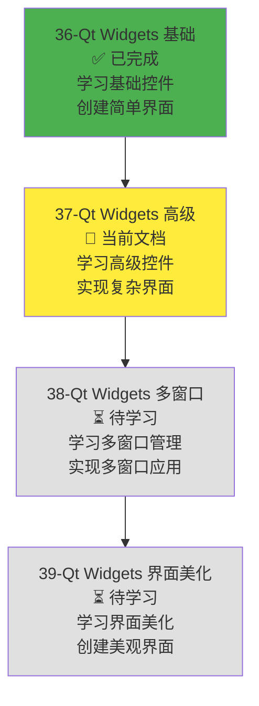
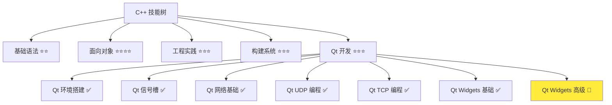
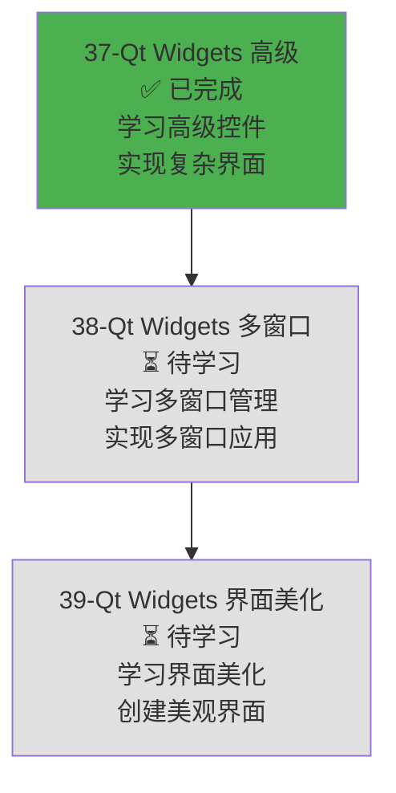

# Qt Widgets 高级控件

> **学习目标**：掌握 Qt Widgets 模块的高级控件（列表、表格、树形、进度条、组合框等），理解数据展示和复杂界面设计，能够创建数据展示应用，为开发局域网聊天软件的用户列表、消息历史等功能打下基础  
> **前置知识**：Qt Widgets 基础控件（QApplication、QWidget、QMainWindow、基础控件、布局管理）、Qt 信号槽机制、C++ 面向对象基础  
> **预计时间**：120 分钟  
> **难度等级**：⭐⭐⭐⭐  
> **技能收获**：QListWidget、QTableWidget、QTreeWidget、QProgressBar、QComboBox、QScrollArea、数据模型、复杂界面设计  
> **文档版本**：v1.0  
> **最后更新**：2025-11-27

📊 **难度等级说明**

| 等级           | 描述                       | 练习题数量     | 颜色码 |
| -------------- | -------------------------- | -------------- | ------ |
| **⭐**         | 入门级，零基础可学         | 5 题基础概念题 | 🟢绿   |
| **⭐⭐**       | 基础级，需要基本编程概念   | 5 题基础概念题 | 🟡黄   |
| **⭐⭐⭐**     | 中级，需要相关技术基础     | 3 题代码分析题 | 🟠橙   |
| **⭐⭐⭐⭐**   | 高级，需要扎实的技术功底   | 3 题代码分析题 | 🔴红   |
| **⭐⭐⭐⭐⭐** | 专家级，需要丰富的项目经验 | 2 题设计思考题 | 🟣紫   |

## 1. 学习目标

### 1.1 学习动机

- **实际需求**：开发局域网聊天软件和屏幕共享软件需要展示复杂数据（用户列表、消息历史、文件列表等）。Qt Widgets 高级控件提供了列表、表格、树形等数据展示控件，是开发复杂 GUI 应用的基础
- **应用场景**：聊天软件界面（用户列表、消息历史）、屏幕共享软件界面（文件列表、连接状态）、数据展示应用（学生管理系统、图书管理系统）、复杂界面设计
- **技能价值**：学会后能使用 Qt Widgets 高级控件创建数据展示界面，理解数据模型和视图的关系，为开发聊天软件和屏幕共享软件的数据展示功能打下基础
- **数据支持**：Qt Widgets 高级控件是 Qt 框架的重要组成部分，提供了完整的数据展示工具集，掌握高级控件是开发复杂 Qt GUI 应用的必备技能

### 1.1.1 为什么需要学习 Qt Widgets 高级控件？

**学习路径设计**：

在学习了 Qt Widgets 基础控件之后，我们需要学习高级控件来展示复杂数据。这样做的原因：

1. **聊天软件需求**：局域网聊天软件需要显示用户列表（QListWidget）、消息历史（QTableWidget）、文件列表（QTreeWidget）等
2. **屏幕共享需求**：屏幕共享软件需要显示连接状态（QProgressBar）、文件列表（QListWidget）、传输进度（QProgressDialog）等
3. **数据展示**：高级控件提供了列表、表格、树形等数据展示方式，适合展示结构化数据
4. **用户体验**：高级控件提供了更好的交互体验（选择、排序、过滤等）
5. **界面丰富**：高级控件让界面更丰富、功能更强大

**学习路径安排**：



**为什么先学基础控件再学高级控件？**

- ✅ **循序渐进**：基础控件（按钮、输入框）是 GUI 应用的基础，高级控件（列表、表格）是基础控件的组合和扩展
- ✅ **理解深入**：理解了基础控件后，更容易理解高级控件的内部结构和使用方法
- ✅ **实际应用**：先掌握基础控件，再学习高级控件，符合实际开发流程

**本章的学习重点**：

- ✅ **列表控件**：掌握 QListWidget、QListView 的使用，理解列表项的操作
- ✅ **表格控件**：掌握 QTableWidget、QTableView 的使用，理解数据模型
- ✅ **树形控件**：掌握 QTreeWidget、QTreeView 的使用，理解层级数据展示
- ✅ **进度和状态**：掌握 QProgressBar、QProgressDialog、QStatusBar 的使用
- ✅ **组合框和菜单**：掌握 QComboBox、QMenu、QMenuBar 的使用
- ✅ **滚动区域**：掌握 QScrollArea、QScrollBar 的使用
- ✅ **实际应用**：创建一个数据展示应用（学生管理系统界面）

> **类比**：Qt Widgets 高级控件就像**高级工具箱**：
>
> - **QListWidget** 就像**清单列表**，可以列出多个项目
> - **QTableWidget** 就像**表格**，可以展示多行多列的数据
> - **QTreeWidget** 就像**文件夹树**，可以展示层级结构
> - **QProgressBar** 就像**进度条**，可以显示任务进度
> - **QComboBox** 就像**下拉菜单**，可以从多个选项中选择
> - 通过组合这些"高级工具"，可以创建功能强大的数据展示界面

### 1.2 技能树位置



> **图表说明**：C++ 技能树结构图，当前文档点亮 Qt Widgets 高级技能点，为后续多窗口管理和界面美化做准备

### 1.3 前置知识检查

在开始学习之前，请确认你已经掌握：

- [ ] Qt Widgets 基础控件（QApplication、QWidget、QMainWindow、基础控件、布局管理）
- [ ] Qt 信号槽机制（QObject::connect、信号和槽的定义）
- [ ] C++ 面向对象基础（类、对象、继承）

> **未掌握处理**：若未通过，请先复习 [Qt Widgets 基础控件](./36-qt-widgets-basics.md) 和 [Qt 信号槽机制](./31-qt-signals-slots.md)

## 2. 核心内容

### 2.1 列表控件（QListWidget、QListView）

#### 2.1.1 QListWidget（列表控件）

**QListWidget**：Qt 提供的列表控件，用于显示和管理列表项。

**QListWidget 的特点**：

1. **列表展示**：可以显示多个列表项，每个列表项可以是文本、图标等
2. **选择模式**：支持单选、多选等选择模式
3. **排序功能**：支持列表项排序
4. **自定义项**：支持自定义列表项（QListWidgetItem）

**QListWidget 主要方法**：

| 方法                        | 说明                 | 返回值                   |
| --------------------------- | -------------------- | ------------------------ |
| `addItem()`                 | 添加列表项           | void                     |
| `addItem(QListWidgetItem*)` | 添加列表项对象       | void                     |
| `insertItem()`              | 在指定位置插入列表项 | void                     |
| `removeItemWidget()`        | 移除列表项           | void                     |
| `takeItem()`                | 移除并返回列表项     | QListWidgetItem\*        |
| `item()`                    | 获取指定位置的列表项 | QListWidgetItem\*        |
| `currentItem()`             | 获取当前选中的列表项 | QListWidgetItem\*        |
| `selectedItems()`           | 获取所有选中的列表项 | QList<QListWidgetItem\*> |
| `setSelectionMode()`        | 设置选择模式         | void                     |
| `count()`                   | 获取列表项数量       | int                      |
| `clear()`                   | 清空所有列表项       | void                     |

**QListWidget 主要信号**：

| 信号                   | 说明               | 参数                               |
| ---------------------- | ------------------ | ---------------------------------- |
| `itemClicked`          | 列表项被点击时发出 | QListWidgetItem\*                  |
| `itemDoubleClicked`    | 列表项被双击时发出 | QListWidgetItem\*                  |
| `itemSelectionChanged` | 选择改变时发出     | void                               |
| `currentItemChanged`   | 当前项改变时发出   | QListWidgetItem*, QListWidgetItem* |

**QListWidgetItem（列表项）主要方法**：

| 方法        | 说明           | 返回值   |
| ----------- | -------------- | -------- |
| `setText()` | 设置文本内容   | void     |
| `text()`    | 获取文本内容   | QString  |
| `setIcon()` | 设置图标       | void     |
| `icon()`    | 获取图标       | QIcon    |
| `setData()` | 设置自定义数据 | void     |
| `data()`    | 获取自定义数据 | QVariant |

**QListWidget 使用示例**：

```cpp
#include <QtWidgets/QApplication>
#include <QtWidgets/QListWidget>
#include <QtWidgets/QPushButton>
#include <QtWidgets/QVBoxLayout>
#include <QtWidgets/QWidget>
#include <QtCore/QDebug>

int main(int argc, char *argv[])
{
    QApplication app(argc, argv);

    QWidget window;
    window.setWindowTitle("QListWidget 示例");
    window.resize(400, 300);

    QVBoxLayout *layout = new QVBoxLayout(&window);

    // 创建列表控件
    QListWidget *listWidget = new QListWidget(&window);

    // 添加列表项
    listWidget->addItem("用户1");
    listWidget->addItem("用户2");
    listWidget->addItem("用户3");

    // 设置选择模式（多选）
    listWidget->setSelectionMode(QAbstractItemView::MultiSelection);

    // 创建按钮
    QPushButton *button = new QPushButton("显示选中项", &window);

    // 连接信号槽
    QObject::connect(button, &QPushButton::clicked, [listWidget]() {
        QList<QListWidgetItem*> selectedItems = listWidget->selectedItems();
        qDebug() << "选中的项：";
        for (QListWidgetItem *item : selectedItems) {
            qDebug() << "  -" << item->text();
        }
    });

    // 连接列表项点击信号
    QObject::connect(listWidget, &QListWidget::itemClicked, [](QListWidgetItem *item) {
        qDebug() << "点击了：" << item->text();
    });

    // 添加到布局
    layout->addWidget(listWidget);
    layout->addWidget(button);

    window.show();
    return app.exec();
}
```

> **类比**：QListWidget 就像**清单列表**，可以列出多个项目，用户可以点击选择。

#### 2.1.2 QListView（列表视图）

**QListView**：Qt 提供的列表视图控件，基于模型-视图架构，更灵活但使用更复杂。

**QListView vs QListWidget**：

| 特性           | QListWidget          | QListView            |
| -------------- | -------------------- | -------------------- |
| **使用复杂度** | 简单（直接使用）     | 复杂（需要数据模型） |
| **灵活性**     | 较低（固定功能）     | 较高（可自定义）     |
| **性能**       | 较低（适合小数据量） | 较高（适合大数据量） |
| **适用场景**   | 简单列表展示         | 复杂数据展示         |

**QListView 使用示例**（使用 QStringListModel）：

```cpp
#include <QtWidgets/QApplication>
#include <QtWidgets/QListView>
#include <QtCore/QStringListModel>
#include <QtWidgets/QVBoxLayout>
#include <QtWidgets/QWidget>

int main(int argc, char *argv[])
{
    QApplication app(argc, argv);

    QWidget window;
    window.setWindowTitle("QListView 示例");
    window.resize(400, 300);

    QVBoxLayout *layout = new QVBoxLayout(&window);

    // 创建数据模型
    QStringListModel *model = new QStringListModel(&window);
    QStringList list;
    list << "用户1" << "用户2" << "用户3";
    model->setStringList(list);

    // 创建列表视图
    QListView *listView = new QListView(&window);
    listView->setModel(model);

    // 添加到布局
    layout->addWidget(listView);

    window.show();
    return app.exec();
}
```

> **类比**：QListView 就像**可定制的清单列表**，需要先准备数据模型，然后展示数据。

### 2.2 表格控件（QTableWidget、QTableView）

#### 2.2.1 QTableWidget（表格控件）

**QTableWidget**：Qt 提供的表格控件，用于显示和管理表格数据。

**QTableWidget 的特点**：

1. **表格展示**：可以显示多行多列的数据
2. **单元格编辑**：支持单元格编辑
3. **选择模式**：支持行选择、列选择、单元格选择
4. **排序功能**：支持按列排序
5. **自定义项**：支持自定义表格项（QTableWidgetItem）

**QTableWidget 主要方法**：

| 方法                          | 说明                 | 返回值                    |
| ----------------------------- | -------------------- | ------------------------- |
| `setRowCount()`               | 设置行数             | void                      |
| `setColumnCount()`            | 设置列数             | void                      |
| `rowCount()`                  | 获取行数             | int                       |
| `columnCount()`               | 获取列数             | int                       |
| `setItem()`                   | 设置单元格项         | void                      |
| `item()`                      | 获取单元格项         | QTableWidgetItem\*        |
| `setHorizontalHeaderLabels()` | 设置水平表头标签     | void                      |
| `setVerticalHeaderLabels()`   | 设置垂直表头标签     | void                      |
| `setSelectionMode()`          | 设置选择模式         | void                      |
| `selectedItems()`             | 获取所有选中的单元格 | QList<QTableWidgetItem\*> |
| `clear()`                     | 清空所有数据         | void                      |

**QTableWidgetItem（表格项）主要方法**：

| 方法        | 说明           | 返回值   |
| ----------- | -------------- | -------- |
| `setText()` | 设置文本内容   | void     |
| `text()`    | 获取文本内容   | QString  |
| `setData()` | 设置自定义数据 | void     |
| `data()`    | 获取自定义数据 | QVariant |

**QTableWidget 使用示例**：

```cpp
#include <QtWidgets/QApplication>
#include <QtWidgets/QTableWidget>
#include <QtWidgets/QPushButton>
#include <QtWidgets/QVBoxLayout>
#include <QtWidgets/QWidget>
#include <QtCore/QDebug>

int main(int argc, char *argv[])
{
    QApplication app(argc, argv);

    QWidget window;
    window.setWindowTitle("QTableWidget 示例");
    window.resize(600, 400);

    QVBoxLayout *layout = new QVBoxLayout(&window);

    // 创建表格控件
    QTableWidget *tableWidget = new QTableWidget(&window);
    tableWidget->setRowCount(3);
    tableWidget->setColumnCount(3);

    // 设置表头
    QStringList headers;
    headers << "姓名" << "年龄" << "城市";
    tableWidget->setHorizontalHeaderLabels(headers);

    // 填充数据
    tableWidget->setItem(0, 0, new QTableWidgetItem("张三"));
    tableWidget->setItem(0, 1, new QTableWidgetItem("25"));
    tableWidget->setItem(0, 2, new QTableWidgetItem("北京"));

    tableWidget->setItem(1, 0, new QTableWidgetItem("李四"));
    tableWidget->setItem(1, 1, new QTableWidgetItem("30"));
    tableWidget->setItem(1, 2, new QTableWidgetItem("上海"));

    tableWidget->setItem(2, 0, new QTableWidgetItem("王五"));
    tableWidget->setItem(2, 1, new QTableWidgetItem("28"));
    tableWidget->setItem(2, 2, new QTableWidgetItem("广州"));

    // 设置选择模式（行选择）
    tableWidget->setSelectionBehavior(QAbstractItemView::SelectRows);

    // 创建按钮
    QPushButton *button = new QPushButton("显示选中行", &window);

    // 连接信号槽
    QObject::connect(button, &QPushButton::clicked, [tableWidget]() {
        QList<QTableWidgetItem*> selectedItems = tableWidget->selectedItems();
        if (!selectedItems.isEmpty()) {
            qDebug() << "选中的行：";
            for (QTableWidgetItem *item : selectedItems) {
                qDebug() << "  -" << item->text();
            }
        }
    });

    // 添加到布局
    layout->addWidget(tableWidget);
    layout->addWidget(button);

    window.show();
    return app.exec();
}
```

> **类比**：QTableWidget 就像**Excel 表格**，可以展示多行多列的数据，用户可以编辑和选择。

#### 2.2.2 QTableView（表格视图）

**QTableView**：Qt 提供的表格视图控件，基于模型-视图架构，更灵活但使用更复杂。

**QTableView vs QTableWidget**：

| 特性           | QTableWidget         | QTableView           |
| -------------- | -------------------- | -------------------- |
| **使用复杂度** | 简单（直接使用）     | 复杂（需要数据模型） |
| **灵活性**     | 较低（固定功能）     | 较高（可自定义）     |
| **性能**       | 较低（适合小数据量） | 较高（适合大数据量） |
| **适用场景**   | 简单表格展示         | 复杂数据展示         |

**QTableView 使用示例**（使用 QStandardItemModel）：

```cpp
#include <QtWidgets/QApplication>
#include <QtWidgets/QTableView>
#include <QtGui/QStandardItemModel>
#include <QtWidgets/QVBoxLayout>
#include <QtWidgets/QWidget>

int main(int argc, char *argv[])
{
    QApplication app(argc, argv);

    QWidget window;
    window.setWindowTitle("QTableView 示例");
    window.resize(600, 400);

    QVBoxLayout *layout = new QVBoxLayout(&window);

    // 创建数据模型
    QStandardItemModel *model = new QStandardItemModel(3, 3, &window);
    model->setHorizontalHeaderLabels(QStringList() << "姓名" << "年龄" << "城市");

    // 填充数据
    model->setItem(0, 0, new QStandardItem("张三"));
    model->setItem(0, 1, new QStandardItem("25"));
    model->setItem(0, 2, new QStandardItem("北京"));

    model->setItem(1, 0, new QStandardItem("李四"));
    model->setItem(1, 1, new QStandardItem("30"));
    model->setItem(1, 2, new QStandardItem("上海"));

    model->setItem(2, 0, new QStandardItem("王五"));
    model->setItem(2, 1, new QStandardItem("28"));
    model->setItem(2, 2, new QStandardItem("广州"));

    // 创建表格视图
    QTableView *tableView = new QTableView(&window);
    tableView->setModel(model);

    // 添加到布局
    layout->addWidget(tableView);

    window.show();
    return app.exec();
}
```

> **类比**：QTableView 就像**可定制的 Excel 表格**，需要先准备数据模型，然后展示数据。

### 2.3 树形控件（QTreeWidget、QTreeView）

#### 2.3.1 QTreeWidget（树形控件）

**QTreeWidget**：Qt 提供的树形控件，用于显示和管理层级数据。

**QTreeWidget 的特点**：

1. **层级展示**：可以显示父子关系的层级数据
2. **展开/折叠**：支持节点展开和折叠
3. **选择模式**：支持单选、多选等选择模式
4. **自定义项**：支持自定义树节点（QTreeWidgetItem）

**QTreeWidget 主要方法**：

| 方法                   | 说明                   | 返回值                   |
| ---------------------- | ---------------------- | ------------------------ |
| `addTopLevelItem()`    | 添加顶级节点           | void                     |
| `insertTopLevelItem()` | 在指定位置插入顶级节点 | void                     |
| `topLevelItem()`       | 获取指定位置的顶级节点 | QTreeWidgetItem\*        |
| `topLevelItemCount()`  | 获取顶级节点数量       | int                      |
| `setHeaderLabels()`    | 设置表头标签           | void                     |
| `currentItem()`        | 获取当前选中的节点     | QTreeWidgetItem\*        |
| `selectedItems()`      | 获取所有选中的节点     | QList<QTreeWidgetItem\*> |
| `clear()`              | 清空所有节点           | void                     |

**QTreeWidgetItem（树节点）主要方法**：

| 方法            | 说明                 | 返回值            |
| --------------- | -------------------- | ----------------- |
| `addChild()`    | 添加子节点           | void              |
| `insertChild()` | 在指定位置插入子节点 | void              |
| `removeChild()` | 移除子节点           | void              |
| `child()`       | 获取指定位置的子节点 | QTreeWidgetItem\* |
| `childCount()`  | 获取子节点数量       | int               |
| `parent()`      | 获取父节点           | QTreeWidgetItem\* |
| `setText()`     | 设置文本内容         | void              |
| `text()`        | 获取文本内容         | QString           |
| `setExpanded()` | 设置是否展开         | void              |
| `isExpanded()`  | 判断是否展开         | bool              |

**QTreeWidget 使用示例**：

```cpp
#include <QtWidgets/QApplication>
#include <QtWidgets/QTreeWidget>
#include <QtWidgets/QPushButton>
#include <QtWidgets/QVBoxLayout>
#include <QtWidgets/QWidget>
#include <QtCore/QDebug>

int main(int argc, char *argv[])
{
    QApplication app(argc, argv);

    QWidget window;
    window.setWindowTitle("QTreeWidget 示例");
    window.resize(400, 400);

    QVBoxLayout *layout = new QVBoxLayout(&window);

    // 创建树形控件
    QTreeWidget *treeWidget = new QTreeWidget(&window);
    treeWidget->setHeaderLabels(QStringList() << "名称" << "类型");

    // 创建顶级节点
    QTreeWidgetItem *root1 = new QTreeWidgetItem(treeWidget);
    root1->setText(0, "文件夹1");
    root1->setText(1, "文件夹");

    // 创建子节点
    QTreeWidgetItem *child1 = new QTreeWidgetItem(root1);
    child1->setText(0, "文件1.txt");
    child1->setText(1, "文件");

    QTreeWidgetItem *child2 = new QTreeWidgetItem(root1);
    child2->setText(0, "文件2.txt");
    child2->setText(1, "文件");

    // 创建另一个顶级节点
    QTreeWidgetItem *root2 = new QTreeWidgetItem(treeWidget);
    root2->setText(0, "文件夹2");
    root2->setText(1, "文件夹");

    QTreeWidgetItem *child3 = new QTreeWidgetItem(root2);
    child3->setText(0, "文件3.txt");
    child3->setText(1, "文件");

    // 连接信号槽
    QObject::connect(treeWidget, &QTreeWidget::itemClicked, [](QTreeWidgetItem *item, int column) {
        qDebug() << "点击了：" << item->text(0);
    });

    // 创建按钮
    QPushButton *button = new QPushButton("显示选中项", &window);
    QObject::connect(button, &QPushButton::clicked, [treeWidget]() {
        QTreeWidgetItem *item = treeWidget->currentItem();
        if (item) {
            qDebug() << "选中的项：" << item->text(0);
        }
    });

    // 添加到布局
    layout->addWidget(treeWidget);
    layout->addWidget(button);

    window.show();
    return app.exec();
}
```

> **类比**：QTreeWidget 就像**文件夹树**，可以展示层级结构，用户可以展开和折叠节点。

#### 2.3.2 QTreeView（树形视图）

**QTreeView**：Qt 提供的树形视图控件，基于模型-视图架构，更灵活但使用更复杂。

**QTreeView vs QTreeWidget**：

| 特性           | QTreeWidget          | QTreeView            |
| -------------- | -------------------- | -------------------- |
| **使用复杂度** | 简单（直接使用）     | 复杂（需要数据模型） |
| **灵活性**     | 较低（固定功能）     | 较高（可自定义）     |
| **性能**       | 较低（适合小数据量） | 较高（适合大数据量） |
| **适用场景**   | 简单树形展示         | 复杂数据展示         |

### 2.4 进度和状态（QProgressBar、QProgressDialog、QStatusBar）

#### 2.4.1 QProgressBar（进度条）

**QProgressBar**：Qt 提供的进度条控件，用于显示任务进度。

**QProgressBar 的特点**：

1. **进度显示**：可以显示 0-100% 的进度
2. **文本显示**：可以显示进度百分比文本
3. **方向设置**：支持水平、垂直方向
4. **样式定制**：支持自定义样式

**QProgressBar 主要方法**：

| 方法               | 说明                  | 返回值 |
| ------------------ | --------------------- | ------ |
| `setMinimum()`     | 设置最小值            | void   |
| `setMaximum()`     | 设置最大值            | void   |
| `setValue()`       | 设置当前值            | void   |
| `value()`          | 获取当前值            | int    |
| `setFormat()`      | 设置文本格式          | void   |
| `setOrientation()` | 设置方向（水平/垂直） | void   |

**QProgressBar 使用示例**：

```cpp
#include <QtWidgets/QApplication>
#include <QtWidgets/QProgressBar>
#include <QtWidgets/QPushButton>
#include <QtWidgets/QVBoxLayout>
#include <QtWidgets/QWidget>
#include <QtCore/QTimer>

int main(int argc, char *argv[])
{
    QApplication app(argc, argv);

    QWidget window;
    window.setWindowTitle("QProgressBar 示例");
    window.resize(400, 200);

    QVBoxLayout *layout = new QVBoxLayout(&window);

    // 创建进度条
    QProgressBar *progressBar = new QProgressBar(&window);
    progressBar->setMinimum(0);
    progressBar->setMaximum(100);
    progressBar->setValue(0);
    progressBar->setFormat("%p%");  // 显示百分比

    // 创建按钮
    QPushButton *button = new QPushButton("开始进度", &window);

    // 创建定时器模拟进度
    QTimer *timer = new QTimer(&window);
    int progress = 0;

    QObject::connect(timer, &QTimer::timeout, [&progress, progressBar, timer]() {
        progress += 10;
        progressBar->setValue(progress);
        if (progress >= 100) {
            timer->stop();
        }
    });

    QObject::connect(button, &QPushButton::clicked, [&progress, progressBar, timer]() {
        progress = 0;
        progressBar->setValue(0);
        timer->start(500);  // 每 500ms 更新一次
    });

    // 添加到布局
    layout->addWidget(progressBar);
    layout->addWidget(button);

    window.show();
    return app.exec();
}
```

> **类比**：QProgressBar 就像**进度条**，可以显示任务完成的百分比。

#### 2.4.2 QProgressDialog（进度对话框）

**QProgressDialog**：Qt 提供的进度对话框，用于显示长时间运行的任务进度。

**QProgressDialog 的特点**：

1. **模态对话框**：默认是模态对话框，会阻塞用户操作
2. **自动关闭**：进度完成后自动关闭
3. **取消按钮**：可以显示取消按钮

**QProgressDialog 主要方法**：

| 方法                | 说明         | 返回值 |
| ------------------- | ------------ | ------ |
| `setMinimum()`      | 设置最小值   | void   |
| `setMaximum()`      | 设置最大值   | void   |
| `setValue()`        | 设置当前值   | void   |
| `setLabelText()`    | 设置标签文本 | void   |
| `setCancelButton()` | 设置取消按钮 | void   |
| `wasCanceled()`     | 判断是否取消 | bool   |

**QProgressDialog 使用示例**：

```cpp
#include <QtWidgets/QApplication>
#include <QtWidgets/QProgressDialog>
#include <QtWidgets/QPushButton>
#include <QtWidgets/QVBoxLayout>
#include <QtWidgets/QWidget>
#include <QtCore/QTimer>

int main(int argc, char *argv[])
{
    QApplication app(argc, argv);

    QWidget window;
    window.setWindowTitle("QProgressDialog 示例");
    window.resize(400, 200);

    QVBoxLayout *layout = new QVBoxLayout(&window);

    // 创建按钮
    QPushButton *button = new QPushButton("开始任务", &window);

    QObject::connect(button, &QPushButton::clicked, []() {
        // 创建进度对话框
        QProgressDialog *dialog = new QProgressDialog("正在处理...", "取消", 0, 100);
        dialog->setWindowTitle("进度");
        dialog->setModal(true);
        dialog->show();

        // 模拟进度
        QTimer *timer = new QTimer();
        int progress = 0;

        QObject::connect(timer, &QTimer::timeout, [&progress, dialog, timer]() {
            progress += 10;
            dialog->setValue(progress);

            if (progress >= 100 || dialog->wasCanceled()) {
                timer->stop();
                dialog->close();
                delete dialog;
            }
        });

        timer->start(500);
    });

    // 添加到布局
    layout->addWidget(button);

    window.show();
    return app.exec();
}
```

> **类比**：QProgressDialog 就像**进度提示框**，显示长时间运行的任务进度，用户可以取消。

#### 2.4.3 QStatusBar（状态栏）

**QStatusBar**：Qt 提供的状态栏控件，通常用于 QMainWindow，显示应用程序状态信息。

**QStatusBar 的特点**：

1. **状态显示**：可以显示文本状态信息
2. **永久消息**：可以显示永久消息（不自动清除）
3. **临时消息**：可以显示临时消息（自动清除）

**QStatusBar 主要方法**：

| 方法                   | 说明         | 返回值 |
| ---------------------- | ------------ | ------ |
| `showMessage()`        | 显示临时消息 | void   |
| `clearMessage()`       | 清除消息     | void   |
| `addPermanentWidget()` | 添加永久控件 | void   |

**QStatusBar 使用示例**：

```cpp
#include <QtWidgets/QApplication>
#include <QtWidgets/QMainWindow>
#include <QtWidgets/QPushButton>
#include <QtWidgets/QVBoxLayout>
#include <QtWidgets/QWidget>

int main(int argc, char *argv[])
{
    QApplication app(argc, argv);

    QMainWindow window;
    window.setWindowTitle("QStatusBar 示例");
    window.resize(400, 200);

    // 获取状态栏
    QStatusBar *statusBar = window.statusBar();
    statusBar->showMessage("就绪");

    // 创建中央控件
    QWidget *centralWidget = new QWidget(&window);
    window.setCentralWidget(centralWidget);

    QVBoxLayout *layout = new QVBoxLayout(centralWidget);

    // 创建按钮
    QPushButton *button = new QPushButton("更新状态", centralWidget);
    QObject::connect(button, &QPushButton::clicked, [statusBar]() {
        statusBar->showMessage("状态已更新", 2000);  // 显示 2 秒后自动清除
    });

    // 添加到布局
    layout->addWidget(button);

    window.show();
    return app.exec();
}
```

> **类比**：QStatusBar 就像**状态栏**，显示应用程序的当前状态信息。

### 2.5 组合框和下拉菜单（QComboBox、QMenu、QMenuBar）

#### 2.5.1 QComboBox（组合框）

**QComboBox**：Qt 提供的组合框控件，用于从多个选项中选择一个。

**QComboBox 的特点**：

1. **下拉选择**：点击后显示下拉列表，可以选择一个选项
2. **可编辑**：可以设置为可编辑模式，允许用户输入
3. **数据存储**：每个选项可以存储文本和数据

**QComboBox 主要方法**：

| 方法                | 说明               | 返回值  |
| ------------------- | ------------------ | ------- |
| `addItem()`         | 添加选项           | void    |
| `insertItem()`      | 在指定位置插入选项 | void    |
| `removeItem()`      | 移除选项           | void    |
| `currentIndex()`    | 获取当前选中索引   | int     |
| `currentText()`     | 获取当前选中文本   | QString |
| `setCurrentIndex()` | 设置当前选中索引   | void    |
| `setEditable()`     | 设置是否可编辑     | void    |
| `count()`           | 获取选项数量       | int     |

**QComboBox 主要信号**：

| 信号                  | 说明               | 参数    |
| --------------------- | ------------------ | ------- |
| `currentIndexChanged` | 当前索引改变时发出 | int     |
| `currentTextChanged`  | 当前文本改变时发出 | QString |
| `activated`           | 选项被激活时发出   | int     |

**QComboBox 使用示例**：

```cpp
#include <QtWidgets/QApplication>
#include <QtWidgets/QComboBox>
#include <QtWidgets/QLabel>
#include <QtWidgets/QVBoxLayout>
#include <QtWidgets/QWidget>
#include <QtCore/QDebug>

int main(int argc, char *argv[])
{
    QApplication app(argc, argv);

    QWidget window;
    window.setWindowTitle("QComboBox 示例");
    window.resize(400, 200);

    QVBoxLayout *layout = new QVBoxLayout(&window);

    // 创建组合框
    QComboBox *comboBox = new QComboBox(&window);
    comboBox->addItem("选项1");
    comboBox->addItem("选项2");
    comboBox->addItem("选项3");

    // 创建标签
    QLabel *label = new QLabel("当前选择：选项1", &window);

    // 连接信号槽
    QObject::connect(comboBox, QOverload<int>::of(&QComboBox::currentIndexChanged),
                     [label, comboBox](int index) {
        QString text = comboBox->currentText();
        label->setText("当前选择：" + text);
        qDebug() << "选择了：" << text;
    });

    // 添加到布局
    layout->addWidget(comboBox);
    layout->addWidget(label);

    window.show();
    return app.exec();
}
```

> **类比**：QComboBox 就像**下拉菜单**，可以从多个选项中选择一个。

#### 2.5.2 QMenu（菜单）

**QMenu**：Qt 提供的菜单控件，用于创建下拉菜单。

**QMenu 的特点**：

1. **菜单项**：可以添加多个菜单项（QAction）
2. **子菜单**：可以添加子菜单
3. **分隔符**：可以添加分隔符
4. **快捷键**：支持快捷键

**QMenu 主要方法**：

| 方法             | 说明             | 返回值    |
| ---------------- | ---------------- | --------- |
| `addAction()`    | 添加菜单项       | QAction\* |
| `addMenu()`      | 添加子菜单       | QMenu\*   |
| `addSeparator()` | 添加分隔符       | QAction\* |
| `exec()`         | 显示菜单（弹出） | QAction\* |

**QMenu 使用示例**：

```cpp
#include <QtWidgets/QApplication>
#include <QtWidgets/QMainWindow>
#include <QtWidgets/QMenuBar>
#include <QtWidgets/QMenu>
#include <QtWidgets/QAction>
#include <QtCore/QDebug>

int main(int argc, char *argv[])
{
    QApplication app(argc, argv);

    QMainWindow window;
    window.setWindowTitle("QMenu 示例");
    window.resize(400, 300);

    // 获取菜单栏
    QMenuBar *menuBar = window.menuBar();

    // 创建文件菜单
    QMenu *fileMenu = menuBar->addMenu("文件");

    // 添加菜单项
    QAction *newAction = fileMenu->addAction("新建");
    QAction *openAction = fileMenu->addAction("打开");
    fileMenu->addSeparator();  // 添加分隔符
    QAction *exitAction = fileMenu->addAction("退出");

    // 连接信号槽
    QObject::connect(newAction, &QAction::triggered, []() {
        qDebug() << "新建文件";
    });

    QObject::connect(openAction, &QAction::triggered, []() {
        qDebug() << "打开文件";
    });

    QObject::connect(exitAction, &QAction::triggered, &app, &QApplication::quit);

    // 创建编辑菜单
    QMenu *editMenu = menuBar->addMenu("编辑");
    QAction *copyAction = editMenu->addAction("复制");
    QAction *pasteAction = editMenu->addAction("粘贴");

    window.show();
    return app.exec();
}
```

> **类比**：QMenu 就像**下拉菜单**，可以添加多个菜单项和子菜单。

#### 2.5.3 QMenuBar（菜单栏）

**QMenuBar**：Qt 提供的菜单栏控件，通常用于 QMainWindow，显示应用程序菜单。

**QMenuBar 的特点**：

1. **菜单栏**：可以添加多个菜单（QMenu）
2. **标准位置**：通常位于窗口顶部
3. **平台适配**：在不同平台上自动适配样式

**QMenuBar 主要方法**：

| 方法        | 说明     | 返回值  |
| ----------- | -------- | ------- |
| `addMenu()` | 添加菜单 | QMenu\* |

**QMenuBar 使用示例**（已在 QMenu 示例中展示）：

> **类比**：QMenuBar 就像**菜单栏**，可以添加多个菜单。

### 2.6 滚动区域（QScrollArea、QScrollBar）

#### 2.6.1 QScrollArea（滚动区域）

**QScrollArea**：Qt 提供的滚动区域控件，用于显示超出可见区域的内容。

**QScrollArea 的特点**：

1. **滚动支持**：自动显示滚动条，支持滚动查看内容
2. **内容控件**：可以放置任何 QWidget 作为内容
3. **滚动条控制**：可以控制滚动条的显示和隐藏

**QScrollArea 主要方法**：

| 方法                             | 说明                   | 返回值    |
| -------------------------------- | ---------------------- | --------- |
| `setWidget()`                    | 设置内容控件           | void      |
| `widget()`                       | 获取内容控件           | QWidget\* |
| `setWidgetResizable()`           | 设置内容是否可调整大小 | void      |
| `setHorizontalScrollBarPolicy()` | 设置水平滚动条策略     | void      |
| `setVerticalScrollBarPolicy()`   | 设置垂直滚动条策略     | void      |

**QScrollArea 使用示例**：

```cpp
#include <QtWidgets/QApplication>
#include <QtWidgets/QScrollArea>
#include <QtWidgets/QLabel>
#include <QtWidgets/QVBoxLayout>
#include <QtWidgets/QWidget>

int main(int argc, char *argv[])
{
    QApplication app(argc, argv);

    QWidget window;
    window.setWindowTitle("QScrollArea 示例");
    window.resize(400, 300);

    QVBoxLayout *layout = new QVBoxLayout(&window);

    // 创建滚动区域
    QScrollArea *scrollArea = new QScrollArea(&window);
    scrollArea->setWidgetResizable(true);  // 允许内容调整大小

    // 创建内容控件（一个很长的标签）
    QWidget *contentWidget = new QWidget();
    QVBoxLayout *contentLayout = new QVBoxLayout(contentWidget);

    for (int i = 0; i < 20; ++i) {
        QLabel *label = new QLabel(QString("这是第 %1 行内容").arg(i + 1), contentWidget);
        contentLayout->addWidget(label);
    }

    // 设置内容控件
    scrollArea->setWidget(contentWidget);

    // 添加到布局
    layout->addWidget(scrollArea);

    window.show();
    return app.exec();
}
```

> **类比**：QScrollArea 就像**滚动窗口**，可以滚动查看超出可见区域的内容。

#### 2.6.2 QScrollBar（滚动条）

**QScrollBar**：Qt 提供的滚动条控件，通常由 QScrollArea 自动创建，也可以单独使用。

**QScrollBar 的特点**：

1. **滚动控制**：可以控制内容的滚动位置
2. **方向设置**：支持水平、垂直方向
3. **值范围**：可以设置最小值和最大值

**QScrollBar 主要方法**：

| 方法               | 说明                  | 返回值 |
| ------------------ | --------------------- | ------ |
| `setMinimum()`     | 设置最小值            | void   |
| `setMaximum()`     | 设置最大值            | void   |
| `setValue()`       | 设置当前值            | void   |
| `value()`          | 获取当前值            | int    |
| `setOrientation()` | 设置方向（水平/垂直） | void   |

**QScrollBar 主要信号**：

| 信号           | 说明         | 参数 |
| -------------- | ------------ | ---- |
| `valueChanged` | 值改变时发出 | int  |

> **类比**：QScrollBar 就像**滚动条**，可以控制内容的滚动位置。

## 3. 完整应用示例

### 3.1 学生管理系统界面

创建一个完整的学生管理系统界面，展示如何使用高级控件：

```cpp
#include <QtWidgets/QApplication>
#include <QtWidgets/QMainWindow>
#include <QtWidgets/QTableWidget>
#include <QtWidgets/QListWidget>
#include <QtWidgets/QPushButton>
#include <QtWidgets/QLineEdit>
#include <QtWidgets/QVBoxLayout>
#include <QtWidgets/QHBoxLayout>
#include <QtWidgets/QWidget>
#include <QtWidgets/QLabel>
#include <QtWidgets/QComboBox>
#include <QtWidgets/QProgressBar>
#include <QtCore/QDebug>

class StudentManagementWindow : public QMainWindow
{
    Q_OBJECT

public:
    explicit StudentManagementWindow(QWidget *parent = nullptr)
        : QMainWindow(parent)
    {
        setWindowTitle("学生管理系统");
        resize(800, 600);

        // 创建中央控件
        QWidget *centralWidget = new QWidget(this);
        setCentralWidget(centralWidget);

        // 创建主布局
        QHBoxLayout *mainLayout = new QHBoxLayout(centralWidget);

        // 左侧：学生列表
        QWidget *leftWidget = new QWidget(centralWidget);
        QVBoxLayout *leftLayout = new QVBoxLayout(leftWidget);

        QLabel *listLabel = new QLabel("学生列表", leftWidget);
        m_studentList = new QListWidget(leftWidget);

        leftLayout->addWidget(listLabel);
        leftLayout->addWidget(m_studentList);

        // 右侧：学生信息表格
        QWidget *rightWidget = new QWidget(centralWidget);
        QVBoxLayout *rightLayout = new QVBoxLayout(rightWidget);

        QLabel *tableLabel = new QLabel("学生信息", rightWidget);
        m_studentTable = new QTableWidget(rightWidget);
        m_studentTable->setColumnCount(3);
        m_studentTable->setHorizontalHeaderLabels(QStringList() << "姓名" << "年龄" << "成绩");
        m_studentTable->setSelectionBehavior(QAbstractItemView::SelectRows);

        // 输入区域
        QWidget *inputWidget = new QWidget(rightWidget);
        QHBoxLayout *inputLayout = new QHBoxLayout(inputWidget);

        m_nameEdit = new QLineEdit(inputWidget);
        m_nameEdit->setPlaceholderText("姓名");
        m_ageEdit = new QLineEdit(inputWidget);
        m_ageEdit->setPlaceholderText("年龄");
        m_scoreEdit = new QLineEdit(inputWidget);
        m_scoreEdit->setPlaceholderText("成绩");

        QPushButton *addButton = new QPushButton("添加", inputWidget);
        QPushButton *deleteButton = new QPushButton("删除", inputWidget);

        inputLayout->addWidget(m_nameEdit);
        inputLayout->addWidget(m_ageEdit);
        inputLayout->addWidget(m_scoreEdit);
        inputLayout->addWidget(addButton);
        inputLayout->addWidget(deleteButton);

        // 进度条
        QLabel *progressLabel = new QLabel("数据加载进度", rightWidget);
        m_progressBar = new QProgressBar(rightWidget);
        m_progressBar->setMinimum(0);
        m_progressBar->setMaximum(100);
        m_progressBar->setValue(0);

        rightLayout->addWidget(tableLabel);
        rightLayout->addWidget(m_studentTable);
        rightLayout->addWidget(inputWidget);
        rightLayout->addWidget(progressLabel);
        rightLayout->addWidget(m_progressBar);

        // 添加到主布局
        mainLayout->addWidget(leftWidget, 1);
        mainLayout->addWidget(rightWidget, 2);

        // 连接信号槽
        connect(addButton, &QPushButton::clicked, this, &StudentManagementWindow::addStudent);
        connect(deleteButton, &QPushButton::clicked, this, &StudentManagementWindow::deleteStudent);
        connect(m_studentTable, &QTableWidget::itemSelectionChanged, this, &StudentManagementWindow::updateListSelection);
        connect(m_studentList, &QListWidget::itemClicked, this, &StudentManagementWindow::selectStudent);

        // 初始化数据
        addSampleData();
    }

private slots:
    void addStudent()
    {
        QString name = m_nameEdit->text();
        QString age = m_ageEdit->text();
        QString score = m_scoreEdit->text();

        if (name.isEmpty() || age.isEmpty() || score.isEmpty()) {
            qDebug() << "请填写完整信息";
            return;
        }

        // 添加到表格
        int row = m_studentTable->rowCount();
        m_studentTable->insertRow(row);
        m_studentTable->setItem(row, 0, new QTableWidgetItem(name));
        m_studentTable->setItem(row, 1, new QTableWidgetItem(age));
        m_studentTable->setItem(row, 2, new QTableWidgetItem(score));

        // 添加到列表
        m_studentList->addItem(name);

        // 清空输入框
        m_nameEdit->clear();
        m_ageEdit->clear();
        m_scoreEdit->clear();

        // 更新进度条
        int progress = (m_studentTable->rowCount() * 100) / 10;  // 假设最多 10 个学生
        m_progressBar->setValue(qMin(progress, 100));
    }

    void deleteStudent()
    {
        int currentRow = m_studentTable->currentRow();
        if (currentRow >= 0) {
            m_studentTable->removeRow(currentRow);
            QListWidgetItem *item = m_studentList->takeItem(currentRow);
            delete item;
        }
    }

    void updateListSelection()
    {
        int currentRow = m_studentTable->currentRow();
        if (currentRow >= 0) {
            m_studentList->setCurrentRow(currentRow);
        }
    }

    void selectStudent(QListWidgetItem *item)
    {
        int row = m_studentList->row(item);
        m_studentTable->selectRow(row);
    }

    void addSampleData()
    {
        // 添加示例数据
        QStringList names = {"张三", "李四", "王五"};
        QStringList ages = {"20", "21", "22"};
        QStringList scores = {"85", "90", "88"};

        for (int i = 0; i < names.size(); ++i) {
            int row = m_studentTable->rowCount();
            m_studentTable->insertRow(row);
            m_studentTable->setItem(row, 0, new QTableWidgetItem(names[i]));
            m_studentTable->setItem(row, 1, new QTableWidgetItem(ages[i]));
            m_studentTable->setItem(row, 2, new QTableWidgetItem(scores[i]));
            m_studentList->addItem(names[i]);
        }
    }

private:
    QListWidget *m_studentList;
    QTableWidget *m_studentTable;
    QLineEdit *m_nameEdit;
    QLineEdit *m_ageEdit;
    QLineEdit *m_scoreEdit;
    QProgressBar *m_progressBar;
};

#include "main.moc"

int main(int argc, char *argv[])
{
    QApplication app(argc, argv);

    StudentManagementWindow window;
    window.show();

    return app.exec();
}
```

**关键点说明**：

1. **QListWidget**：用于显示学生列表
2. **QTableWidget**：用于显示学生详细信息（姓名、年龄、成绩）
3. **QLineEdit**：用于输入学生信息
4. **QProgressBar**：用于显示数据加载进度
5. **信号槽连接**：连接列表和表格的选择事件，实现同步选择
6. **数据管理**：实现添加、删除学生功能

> **类比**：这个学生管理系统就像**一个数据管理工具**，可以查看、添加、删除学生信息。

### 3.2 项目场景

#### 3.2.1 QtLanChat 项目中的高级控件应用

在 QtLanChat 项目中，Qt Widgets 高级控件用于：

1. **聊天软件界面**：
   - **用户列表**：使用 `QListWidget` 显示在线用户列表，支持点击选择用户
   - **消息历史**：使用 `QTableWidget` 显示聊天消息历史（时间、发送者、消息内容）
   - **文件列表**：使用 `QTreeWidget` 显示文件传输列表（文件夹结构）
   - **传输进度**：使用 `QProgressBar` 显示文件传输进度
   - **连接状态**：使用 `QStatusBar` 显示连接状态、在线状态等信息
   - **消息类型选择**：使用 `QComboBox` 选择消息类型（文字、图片、文件等）

2. **屏幕共享软件界面**：
   - **连接列表**：使用 `QListWidget` 显示已连接的客户端列表
   - **共享设置**：使用 `QComboBox` 选择共享模式（全屏/窗口/区域）
   - **传输进度**：使用 `QProgressDialog` 显示屏幕数据传输进度
   - **状态显示**：使用 `QStatusBar` 显示共享状态、帧率、分辨率等信息
   - **文件列表**：使用 `QTreeWidget` 显示共享文件列表

**Qt Widgets 高级控件在 QtLanChat 中的应用对照表**：

| 控件类型            | 在聊天软件中的应用               | 在屏幕共享软件中的应用         |
| ------------------- | -------------------------------- | ------------------------------ |
| **QListWidget**     | 在线用户列表、消息列表           | 连接客户端列表、文件列表       |
| **QTableWidget**    | 消息历史（时间、发送者、内容）   | 连接信息（IP、端口、状态）     |
| **QTreeWidget**     | 文件传输列表（文件夹结构）       | 共享文件列表（文件夹结构）     |
| **QProgressBar**    | 文件传输进度                     | 屏幕数据传输进度               |
| **QProgressDialog** | 大文件传输进度对话框             | 屏幕数据传输进度对话框         |
| **QStatusBar**      | 连接状态、在线状态               | 共享状态、帧率、分辨率         |
| **QComboBox**       | 消息类型选择（文字/图片/文件）   | 共享模式选择（全屏/窗口/区域） |
| **QScrollArea**     | 消息显示区域（滚动查看历史消息） | 设置窗口（滚动查看所有设置项） |

## 4. 常见问题

### 4.1 QListWidget vs QListView

**问题**：什么时候使用 QListWidget，什么时候使用 QListView？

**回答**：

- **QListWidget**：适合简单列表展示，直接使用，不需要数据模型
- **QListView**：适合复杂数据展示，需要数据模型，性能更好

**选择建议**：

- 数据量小（< 100 项）：使用 QListWidget
- 数据量大（> 100 项）：使用 QListView + 数据模型
- 需要自定义显示：使用 QListView + 自定义模型

### 4.2 QTableWidget vs QTableView

**问题**：什么时候使用 QTableWidget，什么时候使用 QTableView？

**回答**：

- **QTableWidget**：适合简单表格展示，直接使用，不需要数据模型
- **QTableView**：适合复杂数据展示，需要数据模型，性能更好

**选择建议**：

- 数据量小（< 100 行）：使用 QTableWidget
- 数据量大（> 100 行）：使用 QTableView + 数据模型
- 需要自定义显示：使用 QTableView + 自定义模型

### 4.3 QTreeWidget vs QTreeView

**问题**：什么时候使用 QTreeWidget，什么时候使用 QTreeView？

**回答**：

- **QTreeWidget**：适合简单树形展示，直接使用，不需要数据模型
- **QTreeView**：适合复杂数据展示，需要数据模型，性能更好

**选择建议**：

- 数据量小（< 100 节点）：使用 QTreeWidget
- 数据量大（> 100 节点）：使用 QTreeView + 数据模型
- 需要自定义显示：使用 QTreeView + 自定义模型

### 4.4 如何提高列表/表格性能？

**问题**：当数据量很大时，列表和表格显示很慢，如何优化？

**回答**：

1. **使用视图控件**：使用 QListView、QTableView、QTreeView + 数据模型，而不是 Widget 控件
2. **虚拟滚动**：使用 QAbstractItemView::setUniformItemSizes() 启用统一项大小
3. **延迟加载**：只加载可见区域的数据，滚动时再加载更多数据
4. **分页显示**：将数据分页显示，每次只显示一页

### 4.5 如何自定义列表项/表格项的外观？

**问题**：如何自定义列表项或表格项的外观（颜色、字体、图标等）？

**回答**：

1. **使用 QListWidgetItem/QTableWidgetItem**：设置文本、图标、背景色等
2. **使用委托（Delegate）**：创建自定义委托类，继承 QStyledItemDelegate，重写 paint() 方法
3. **使用样式表（QSS）**：在后续文档（39-qt-widgets-styling.md）中学习

## 5. 练习题

### 5.1 基础概念题

1. **QListWidget 和 QListView 的区别是什么？**
   - A. QListWidget 需要数据模型，QListView 不需要
   - B. QListWidget 直接使用，QListView 需要数据模型
   - C. QListWidget 性能更好，QListView 性能较差
   - D. 没有区别

2. **QTableWidget 如何设置表头？**
   - A. 使用 setHeaderLabels()
   - B. 使用 setHorizontalHeaderLabels()
   - C. 使用 setVerticalHeaderLabels()
   - D. 以上都可以

3. **QProgressBar 的 setValue() 方法的作用是什么？**
   - A. 设置最小值
   - B. 设置最大值
   - C. 设置当前值
   - D. 设置文本格式

### 5.2 代码分析题

1. **分析以下代码，说明 QListWidget 的使用方法**：

   ```cpp
   QListWidget *listWidget = new QListWidget();
   listWidget->addItem("项目1");
   listWidget->addItem("项目2");
   listWidget->setSelectionMode(QAbstractItemView::MultiSelection);
   QList<QListWidgetItem*> selectedItems = listWidget->selectedItems();
   ```

2. **分析以下代码，说明 QTableWidget 的使用方法**：

   ```cpp
   QTableWidget *tableWidget = new QTableWidget();
   tableWidget->setRowCount(3);
   tableWidget->setColumnCount(2);
   tableWidget->setHorizontalHeaderLabels(QStringList() << "列1" << "列2");
   tableWidget->setItem(0, 0, new QTableWidgetItem("数据1"));
   ```

3. **分析以下代码，说明 QTreeWidget 的使用方法**：

   ```cpp
   QTreeWidget *treeWidget = new QTreeWidget();
   QTreeWidgetItem *root = new QTreeWidgetItem(treeWidget);
   root->setText(0, "根节点");
   QTreeWidgetItem *child = new QTreeWidgetItem(root);
   child->setText(0, "子节点");
   ```

### 5.3 编程实践题

1. **创建一个用户列表应用**：
   - 使用 QListWidget 显示用户列表
   - 添加"添加用户"按钮，可以添加新用户
   - 添加"删除用户"按钮，可以删除选中的用户
   - 显示当前选中的用户信息

2. **创建一个成绩管理应用**：
   - 使用 QTableWidget 显示学生成绩（姓名、科目、成绩）
   - 添加输入框输入新成绩
   - 使用 QProgressBar 显示平均成绩进度
   - 使用 QStatusBar 显示统计信息（总人数、平均分）

3. **创建一个文件浏览器应用**：
   - 使用 QTreeWidget 显示文件夹结构
   - 支持展开和折叠节点
   - 点击节点时显示节点信息
   - 使用 QComboBox 选择显示模式（详细/列表）

## 6. 配套代码说明

### 6.1 代码结构

配套代码位于 `src/stage1/37-qt-widgets-advanced/` 目录下，包含以下示例：

- `01-list-widget/`：QListWidget 示例
- `02-table-widget/`：QTableWidget 示例
- `03-tree-widget/`：QTreeWidget 示例
- `04-progress-bar/`：QProgressBar 和 QProgressDialog 示例
- `05-combo-box/`：QComboBox 示例
- `06-scroll-area/`：QScrollArea 示例
- `07-student-management/`：完整的学生管理系统示例

### 6.2 编译和运行

**编译单个示例**：

```bash
cd src/stage1/37-qt-widgets-advanced/01-list-widget
mkdir build && cd build
cmake ..
cmake --build .
```

**运行示例**：

```bash
./ListWidget  # 或 ./TableWidget, ./TreeWidget, ./ProgressBar, ./ComboBox, ./ScrollArea, ./StudentManagement
```

### 6.3 代码说明

每个示例都包含：

- `CMakeLists.txt`：CMake 配置文件
- `main.cpp`：主程序文件
- `README.md`：示例说明文档

## 7. 学习检查

完成本章学习后，请确认你已经掌握：

- [ ] 使用 QListWidget 创建列表
- [ ] 使用 QTableWidget 创建表格
- [ ] 使用 QTreeWidget 创建树形结构
- [ ] 使用 QProgressBar 显示进度
- [ ] 使用 QComboBox 创建下拉选择
- [ ] 使用 QScrollArea 创建滚动区域
- [ ] 创建一个完整的数据展示应用

## 8. 学习成果

完成本章学习后，你将能够：

- ✅ 理解 Qt Widgets 高级控件的核心概念（列表、表格、树形、进度条等）
- ✅ 使用列表控件展示数据列表（QListWidget、QListView）
- ✅ 使用表格控件展示表格数据（QTableWidget、QTableView）
- ✅ 使用树形控件展示层级数据（QTreeWidget、QTreeView）
- ✅ 使用进度条显示任务进度（QProgressBar、QProgressDialog）
- ✅ 使用组合框和菜单创建选择界面（QComboBox、QMenu、QMenuBar）
- ✅ 使用滚动区域显示大量内容（QScrollArea、QScrollBar）
- ✅ 创建一个完整的数据展示应用（学生管理系统界面）
- ✅ 为 QtLanChat 项目创建复杂的数据展示界面打下基础

## 9. 下一步学习

完成本章学习后，建议继续学习：

- **38-qt-widgets-multi-window.md**：Qt Widgets 多窗口管理，学习对话框和多窗口应用
- **39-qt-widgets-styling.md**：Qt Widgets 界面美化，学习样式表和界面美化技巧

**学习路径图**：


