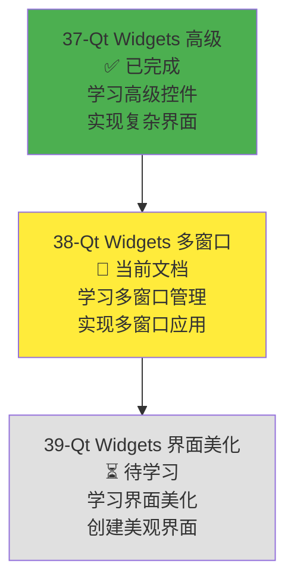
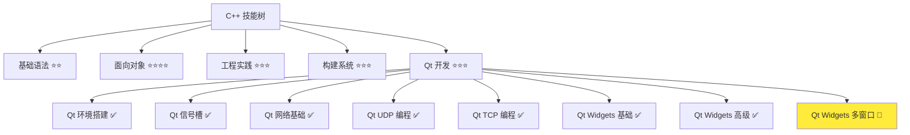
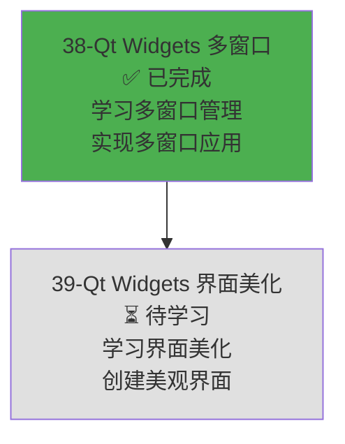

# Qt Widgets 多窗口管理

> **学习目标**：掌握 Qt Widgets 模块的多窗口管理（对话框、模态窗口、窗口通信），理解多窗口应用架构，能够创建多窗口应用，为开发局域网聊天软件的主窗口、设置窗口、关于窗口等功能打下基础  
> **前置知识**：Qt Widgets 基础控件（QApplication、QWidget、QMainWindow、基础控件、布局管理）、Qt Widgets 高级控件（QListWidget、QTableWidget、QProgressBar 等）、Qt 信号槽机制、C++ 面向对象基础  
> **预计时间**：90 分钟  
> **难度等级**：⭐⭐⭐⭐  
> **技能收获**：QDialog、QMessageBox、QInputDialog、QFileDialog、模态对话框、自定义对话框、多窗口应用架构、窗口间数据传递、窗口状态管理  
> **文档版本**：v1.0  
> **最后更新**：2025-12-02

📊 **难度等级说明**

| 等级           | 描述                       | 练习题数量     | 颜色码 |
| -------------- | -------------------------- | -------------- | ------ |
| **⭐**         | 入门级，零基础可学         | 5 题基础概念题 | 🟢绿   |
| **⭐⭐**       | 基础级，需要基本编程概念   | 5 题基础概念题 | 🟡黄   |
| **⭐⭐⭐**     | 中级，需要相关技术基础     | 3 题代码分析题 | 🟠橙   |
| **⭐⭐⭐⭐**   | 高级，需要扎实的技术功底   | 3 题代码分析题 | 🔴红   |
| **⭐⭐⭐⭐⭐** | 专家级，需要丰富的项目经验 | 2 题设计思考题 | 🟣紫   |

## 1. 学习目标

### 1.1 学习动机

- **实际需求**：开发局域网聊天软件和屏幕共享软件需要多个窗口（主窗口、设置窗口、关于窗口、文件选择对话框等）。Qt Widgets 多窗口管理提供了对话框和窗口管理功能，是开发复杂 GUI 应用的基础
- **应用场景**：聊天软件界面（主窗口、设置窗口、关于窗口）、屏幕共享软件界面（主窗口、配置窗口、文件选择对话框）、多窗口应用（主窗口 + 子窗口）、对话框应用（确认对话框、输入对话框、文件选择对话框）
- **技能价值**：学会后能使用 Qt Widgets 创建多窗口应用，理解对话框的使用方法，掌握窗口间数据传递和窗口状态管理，为开发聊天软件和屏幕共享软件的多窗口功能打下基础
- **数据支持**：Qt Widgets 多窗口管理是 Qt 框架的重要组成部分，提供了完整的对话框和窗口管理工具集，掌握多窗口管理是开发复杂 Qt GUI 应用的必备技能

### 1.1.1 为什么需要学习 Qt Widgets 多窗口管理？

**学习路径设计**：

在学习了 Qt Widgets 基础控件和高级控件之后，我们需要学习多窗口管理来创建复杂的多窗口应用。这样做的原因：

1. **聊天软件需求**：局域网聊天软件需要主窗口（聊天界面）、设置窗口（配置参数）、关于窗口（显示信息）、文件选择对话框（选择文件）等
2. **屏幕共享需求**：屏幕共享软件需要主窗口（共享界面）、配置窗口（设置参数）、文件选择对话框（选择共享文件）等
3. **用户体验**：多窗口应用提供了更好的用户体验，不同功能可以在不同窗口中实现
4. **功能分离**：多窗口应用可以将不同功能分离到不同窗口，代码结构更清晰
5. **对话框**：对话框是 GUI 应用的重要组成部分，用于用户交互（确认、输入、文件选择等）

**学习路径安排**：



**为什么先学高级控件再学多窗口管理？**

- ✅ **循序渐进**：高级控件（列表、表格）是单窗口应用的基础，多窗口管理是高级控件的扩展和应用
- ✅ **理解深入**：理解了高级控件后，更容易理解多窗口应用的结构和窗口间通信
- ✅ **实际应用**：先掌握高级控件，再学习多窗口管理，符合实际开发流程

**本章的学习重点**：

- ✅ **对话框基础**：掌握 QDialog、QMessageBox、QInputDialog、QFileDialog 的使用
- ✅ **模态与非模态**：理解模态对话框和非模态对话框的区别和使用场景
- ✅ **自定义对话框**：掌握继承 QDialog 创建自定义对话框，使用信号槽通信
- ✅ **多窗口应用架构**：理解主窗口 + 子窗口的架构，窗口管理器的使用
- ✅ **窗口间数据传递**：掌握信号槽、静态方法、单例模式等数据传递方式
- ✅ **窗口状态管理**：掌握窗口显示/隐藏、最小化/最大化、关闭事件的处理
- ✅ **实际应用**：创建一个多窗口应用（主窗口 + 设置窗口 + 关于窗口）

> **类比**：Qt Widgets 多窗口管理就像**多房间的房子**：
>
> - **QMainWindow** 就像**主房间**（客厅），是应用的主窗口
> - **QDialog** 就像**小房间**（书房、卧室），是对话框窗口
> - **模态对话框**就像**锁着的房间**，必须处理完才能离开
> - **非模态对话框**就像**开着的房间**，可以随时进出
> - **窗口间通信**就像**房间之间的门**，可以在不同房间之间传递信息
> - 通过组合这些"房间"，可以创建功能强大的多窗口应用

### 1.2 技能树位置



> **图表说明**：C++ 技能树结构图，当前文档点亮 Qt Widgets 多窗口技能点，为后续界面美化做准备

### 1.3 前置知识检查

在开始学习之前，请确认你已经掌握：

- [ ] Qt Widgets 基础控件（QApplication、QWidget、QMainWindow、基础控件、布局管理）
- [ ] Qt Widgets 高级控件（QListWidget、QTableWidget、QProgressBar、QComboBox 等）
- [ ] Qt 信号槽机制（QObject::connect、信号和槽的定义）
- [ ] C++ 面向对象基础（类、对象、继承）

> **未掌握处理**：若未通过，请先复习 [Qt Widgets 基础控件](./36-qt-widgets-basics.md)、[Qt Widgets 高级控件](./37-qt-widgets-advanced.md) 和 [Qt 信号槽机制](./31-qt-signals-slots.md)

## 2. 核心内容

### 2.1 对话框基础（QDialog、QMessageBox、QInputDialog、QFileDialog）

#### 2.1.1 QDialog（对话框基类）

**QDialog**：Qt 提供的对话框基类，所有对话框都继承自 QDialog。

**QDialog 的特点**：

1. **对话框窗口**：独立的窗口，可以显示在屏幕上
2. **模态/非模态**：可以是模态对话框（阻塞）或非模态对话框（非阻塞）
3. **返回值**：可以返回用户的选择（接受或拒绝）
4. **信号槽**：支持信号槽机制，可以与其他窗口通信

**QDialog 主要方法**：

| 方法               | 说明                        | 返回值 |
| ------------------ | --------------------------- | ------ |
| `exec()`           | 显示模态对话框（阻塞）      | int    |
| `show()`           | 显示非模态对话框（非阻塞）  | void   |
| `accept()`         | 接受对话框（返回 Accepted） | void   |
| `reject()`         | 拒绝对话框（返回 Rejected） | void   |
| `result()`         | 获取对话框返回值            | int    |
| `setModal()`       | 设置是否为模态对话框        | void   |
| `setWindowTitle()` | 设置对话框标题              | void   |

**QDialog 返回值**：

- `QDialog::Accepted`（1）：用户点击了"确定"或"接受"按钮
- `QDialog::Rejected`（0）：用户点击了"取消"或"拒绝"按钮

**QDialog 使用示例**：

```cpp
#include <QtWidgets/QApplication>
#include <QtWidgets/QDialog>
#include <QtWidgets/QPushButton>
#include <QtWidgets/QVBoxLayout>
#include <QtWidgets/QLabel>
#include <QtCore/QDebug>

int main(int argc, char *argv[])
{
    QApplication app(argc, argv);

    QDialog dialog;
    dialog.setWindowTitle("简单对话框");
    dialog.resize(300, 200);

    QVBoxLayout *layout = new QVBoxLayout(&dialog);

    QLabel *label = new QLabel("这是一个对话框", &dialog);
    QPushButton *okButton = new QPushButton("确定", &dialog);
    QPushButton *cancelButton = new QPushButton("取消", &dialog);

    // 连接信号槽
    QObject::connect(okButton, &QPushButton::clicked, &dialog, &QDialog::accept);
    QObject::connect(cancelButton, &QPushButton::clicked, &dialog, &QDialog::reject);

    layout->addWidget(label);
    layout->addWidget(okButton);
    layout->addWidget(cancelButton);

    // 显示模态对话框
    int result = dialog.exec();
    if (result == QDialog::Accepted) {
        qDebug() << "用户点击了确定";
    } else {
        qDebug() << "用户点击了取消";
    }

    return app.exec();
}
```

> **类比**：QDialog 就像**小房间**，可以独立显示，用户可以在里面进行操作。

#### 2.1.2 QMessageBox（消息框）

**QMessageBox**：Qt 提供的消息框类，用于显示各种类型的消息对话框。

**QMessageBox 的特点**：

1. **消息类型**：支持信息、警告、错误、问题等消息类型
2. **标准按钮**：提供标准按钮（确定、取消、是、否等）
3. **图标显示**：可以显示不同类型的图标
4. **简单易用**：提供了静态方法，使用简单

**QMessageBox 主要静态方法**：

| 方法            | 说明           | 返回值                      |
| --------------- | -------------- | --------------------------- |
| `information()` | 显示信息对话框 | QMessageBox::StandardButton |
| `warning()`     | 显示警告对话框 | QMessageBox::StandardButton |
| `critical()`    | 显示错误对话框 | QMessageBox::StandardButton |
| `question()`    | 显示问题对话框 | QMessageBox::StandardButton |
| `about()`       | 显示关于对话框 | void                        |

**QMessageBox::StandardButton 枚举**：

- `QMessageBox::Ok`：确定按钮
- `QMessageBox::Cancel`：取消按钮
- `QMessageBox::Yes`：是按钮
- `QMessageBox::No`：否按钮
- `QMessageBox::Save`：保存按钮
- `QMessageBox::Discard`：丢弃按钮

**QMessageBox 使用示例**：

```cpp
#include <QtWidgets/QApplication>
#include <QtWidgets/QMessageBox>
#include <QtWidgets/QPushButton>
#include <QtWidgets/QVBoxLayout>
#include <QtWidgets/QWidget>
#include <QtCore/QDebug>

int main(int argc, char *argv[])
{
    QApplication app(argc, argv);

    QWidget window;
    window.setWindowTitle("QMessageBox 示例");
    window.resize(400, 300);

    QVBoxLayout *layout = new QVBoxLayout(&window);

    // 信息对话框
    QPushButton *infoButton = new QPushButton("显示信息", &window);
    QObject::connect(infoButton, &QPushButton::clicked, []() {
        QMessageBox::information(nullptr, "信息", "这是一条信息消息");
    });

    // 警告对话框
    QPushButton *warningButton = new QPushButton("显示警告", &window);
    QObject::connect(warningButton, &QPushButton::clicked, []() {
        QMessageBox::warning(nullptr, "警告", "这是一条警告消息");
    });

    // 错误对话框
    QPushButton *errorButton = new QPushButton("显示错误", &window);
    QObject::connect(errorButton, &QPushButton::clicked, []() {
        QMessageBox::critical(nullptr, "错误", "这是一条错误消息");
    });

    // 问题对话框（确认对话框）
    QPushButton *questionButton = new QPushButton("显示问题", &window);
    QObject::connect(questionButton, &QPushButton::clicked, []() {
        QMessageBox::StandardButton reply = QMessageBox::question(
            nullptr, "确认", "确定要执行此操作吗？",
            QMessageBox::Yes | QMessageBox::No
        );
        if (reply == QMessageBox::Yes) {
            qDebug() << "用户选择了是";
        } else {
            qDebug() << "用户选择了否";
        }
    });

    // 关于对话框
    QPushButton *aboutButton = new QPushButton("显示关于", &window);
    QObject::connect(aboutButton, &QPushButton::clicked, []() {
        QMessageBox::about(nullptr, "关于", "这是一个示例应用程序\n版本 1.0");
    });

    layout->addWidget(infoButton);
    layout->addWidget(warningButton);
    layout->addWidget(errorButton);
    layout->addWidget(questionButton);
    layout->addWidget(aboutButton);

    window.show();
    return app.exec();
}
```

> **类比**：QMessageBox 就像**通知窗口**，可以显示各种类型的消息（信息、警告、错误、问题）。

#### 2.1.3 QInputDialog（输入对话框）

**QInputDialog**：Qt 提供的输入对话框类，用于获取用户输入。

**QInputDialog 的特点**：

1. **输入类型**：支持文本输入、整数输入、浮点数输入、下拉选择等
2. **验证功能**：可以设置输入验证（最小值、最大值、步长等）
3. **简单易用**：提供了静态方法，使用简单

**QInputDialog 主要静态方法**：

| 方法          | 说明           | 返回值  |
| ------------- | -------------- | ------- |
| `getText()`   | 获取文本输入   | QString |
| `getInt()`    | 获取整数输入   | int     |
| `getDouble()` | 获取浮点数输入 | double  |
| `getItem()`   | 获取下拉选择   | QString |

**QInputDialog 使用示例**：

```cpp
#include <QtWidgets/QApplication>
#include <QtWidgets/QInputDialog>
#include <QtWidgets/QPushButton>
#include <QtWidgets/QVBoxLayout>
#include <QtWidgets/QWidget>
#include <QtCore/QDebug>

int main(int argc, char *argv[])
{
    QApplication app(argc, argv);

    QWidget window;
    window.setWindowTitle("QInputDialog 示例");
    window.resize(400, 300);

    QVBoxLayout *layout = new QVBoxLayout(&window);

    // 文本输入
    QPushButton *textButton = new QPushButton("输入文本", &window);
    QObject::connect(textButton, &QPushButton::clicked, []() {
        bool ok;
        QString text = QInputDialog::getText(
            nullptr, "输入文本", "请输入用户名：",
            QLineEdit::Normal, "", &ok
        );
        if (ok && !text.isEmpty()) {
            qDebug() << "输入的文本：" << text;
        }
    });

    // 整数输入
    QPushButton *intButton = new QPushButton("输入整数", &window);
    QObject::connect(intButton, &QPushButton::clicked, []() {
        bool ok;
        int value = QInputDialog::getInt(
            nullptr, "输入整数", "请输入年龄：",
            20, 0, 150, 1, &ok
        );
        if (ok) {
            qDebug() << "输入的整数：" << value;
        }
    });

    // 浮点数输入
    QPushButton *doubleButton = new QPushButton("输入浮点数", &window);
    QObject::connect(doubleButton, &QPushButton::clicked, []() {
        bool ok;
        double value = QInputDialog::getDouble(
            nullptr, "输入浮点数", "请输入价格：",
            0.0, 0.0, 10000.0, 2, &ok
        );
        if (ok) {
            qDebug() << "输入的浮点数：" << value;
        }
    });

    // 下拉选择
    QPushButton *itemButton = new QPushButton("选择选项", &window);
    QObject::connect(itemButton, &QPushButton::clicked, []() {
        QStringList items;
        items << "选项1" << "选项2" << "选项3";
        bool ok;
        QString item = QInputDialog::getItem(
            nullptr, "选择选项", "请选择一个选项：",
            items, 0, false, &ok
        );
        if (ok && !item.isEmpty()) {
            qDebug() << "选择的选项：" << item;
        }
    });

    layout->addWidget(textButton);
    layout->addWidget(intButton);
    layout->addWidget(doubleButton);
    layout->addWidget(itemButton);

    window.show();
    return app.exec();
}
```

> **类比**：QInputDialog 就像**输入窗口**，可以获取用户输入的各种类型的数据（文本、数字、选择等）。

#### 2.1.4 QFileDialog（文件对话框）

**QFileDialog**：Qt 提供的文件对话框类，用于选择文件或目录。

**QFileDialog 的特点**：

1. **文件选择**：可以选择单个文件或多个文件
2. **目录选择**：可以选择目录
3. **文件过滤**：可以设置文件类型过滤器
4. **简单易用**：提供了静态方法，使用简单

**QFileDialog 主要静态方法**：

| 方法                     | 说明                 | 返回值      |
| ------------------------ | -------------------- | ----------- |
| `getOpenFileName()`      | 获取打开文件路径     | QString     |
| `getOpenFileNames()`     | 获取多个打开文件路径 | QStringList |
| `getSaveFileName()`      | 获取保存文件路径     | QString     |
| `getExistingDirectory()` | 获取目录路径         | QString     |

**QFileDialog 使用示例**：

```cpp
#include <QtWidgets/QApplication>
#include <QtWidgets/QFileDialog>
#include <QtWidgets/QPushButton>
#include <QtWidgets/QVBoxLayout>
#include <QtWidgets/QWidget>
#include <QtCore/QDebug>

int main(int argc, char *argv[])
{
    QApplication app(argc, argv);

    QWidget window;
    window.setWindowTitle("QFileDialog 示例");
    window.resize(400, 300);

    QVBoxLayout *layout = new QVBoxLayout(&window);

    // 打开单个文件
    QPushButton *openFileButton = new QPushButton("打开文件", &window);
    QObject::connect(openFileButton, &QPushButton::clicked, []() {
        QString fileName = QFileDialog::getOpenFileName(
            nullptr, "打开文件", "",
            "文本文件 (*.txt);;所有文件 (*.*)"
        );
        if (!fileName.isEmpty()) {
            qDebug() << "选择的文件：" << fileName;
        }
    });

    // 打开多个文件
    QPushButton *openFilesButton = new QPushButton("打开多个文件", &window);
    QObject::connect(openFilesButton, &QPushButton::clicked, []() {
        QStringList fileNames = QFileDialog::getOpenFileNames(
            nullptr, "打开文件", "",
            "文本文件 (*.txt);;所有文件 (*.*)"
        );
        if (!fileNames.isEmpty()) {
            qDebug() << "选择的文件：";
            for (const QString &fileName : fileNames) {
                qDebug() << "  -" << fileName;
            }
        }
    });

    // 保存文件
    QPushButton *saveFileButton = new QPushButton("保存文件", &window);
    QObject::connect(saveFileButton, &QPushButton::clicked, []() {
        QString fileName = QFileDialog::getSaveFileName(
            nullptr, "保存文件", "",
            "文本文件 (*.txt);;所有文件 (*.*)"
        );
        if (!fileName.isEmpty()) {
            qDebug() << "保存的文件：" << fileName;
        }
    });

    // 选择目录
    QPushButton *selectDirButton = new QPushButton("选择目录", &window);
    QObject::connect(selectDirButton, &QPushButton::clicked, []() {
        QString dirName = QFileDialog::getExistingDirectory(
            nullptr, "选择目录", ""
        );
        if (!dirName.isEmpty()) {
            qDebug() << "选择的目录：" << dirName;
        }
    });

    layout->addWidget(openFileButton);
    layout->addWidget(openFilesButton);
    layout->addWidget(saveFileButton);
    layout->addWidget(selectDirButton);

    window.show();
    return app.exec();
}
```

> **类比**：QFileDialog 就像**文件浏览器**，可以浏览和选择文件或目录。

### 2.2 模态与非模态对话框（exec() vs show()）

#### 2.2.1 模态对话框（Modal Dialog）

**模态对话框**：显示时会阻塞主窗口，用户必须处理完对话框才能继续操作主窗口。

**模态对话框的特点**：

1. **阻塞主窗口**：显示时主窗口无法操作
2. **必须处理**：用户必须关闭对话框才能继续
3. **返回值**：可以通过返回值获取用户的选择
4. **使用场景**：确认操作、重要输入、错误提示等

**模态对话框的使用方法**：

- 使用 `exec()` 方法显示模态对话框
- `exec()` 方法会阻塞，直到对话框关闭
- 返回值表示用户的选择（Accepted 或 Rejected）

**模态对话框示例**：

```cpp
#include <QtWidgets/QApplication>
#include <QtWidgets/QDialog>
#include <QtWidgets/QPushButton>
#include <QtWidgets/QVBoxLayout>
#include <QtWidgets/QLabel>
#include <QtCore/QDebug>

int main(int argc, char *argv[])
{
    QApplication app(argc, argv);

    QDialog dialog;
    dialog.setWindowTitle("模态对话框");
    dialog.setModal(true);  // 设置为模态对话框
    dialog.resize(300, 200);

    QVBoxLayout *layout = new QVBoxLayout(&dialog);

    QLabel *label = new QLabel("这是一个模态对话框\n必须处理完才能继续", &dialog);
    QPushButton *okButton = new QPushButton("确定", &dialog);

    QObject::connect(okButton, &QPushButton::clicked, &dialog, &QDialog::accept);

    layout->addWidget(label);
    layout->addWidget(okButton);

    // 显示模态对话框（阻塞）
    int result = dialog.exec();
    qDebug() << "对话框返回值：" << result;

    return app.exec();
}
```

> **类比**：模态对话框就像**锁着的房间**，必须处理完才能离开。

#### 2.2.2 非模态对话框（Modeless Dialog）

**非模态对话框**：显示时不会阻塞主窗口，用户可以同时操作主窗口和对话框。

**非模态对话框的特点**：

1. **不阻塞主窗口**：显示时主窗口仍然可以操作
2. **可以同时操作**：用户可以同时操作主窗口和对话框
3. **使用场景**：设置窗口、工具窗口、查找窗口等

**非模态对话框的使用方法**：

- 使用 `show()` 方法显示非模态对话框
- `show()` 方法不会阻塞，立即返回
- 对话框显示后，用户可以同时操作主窗口和对话框

**非模态对话框示例**：

```cpp
#include <QtWidgets/QApplication>
#include <QtWidgets/QMainWindow>
#include <QtWidgets/QDialog>
#include <QtWidgets/QPushButton>
#include <QtWidgets/QVBoxLayout>
#include <QtWidgets/QLabel>
#include <QtCore/QDebug>

int main(int argc, char *argv[])
{
    QApplication app(argc, argv);

    QMainWindow mainWindow;
    mainWindow.setWindowTitle("主窗口");
    mainWindow.resize(400, 300);

    QPushButton *button = new QPushButton("打开非模态对话框", &mainWindow);
    mainWindow.setCentralWidget(button);

    QObject::connect(button, &QPushButton::clicked, [&mainWindow]() {
        QDialog *dialog = new QDialog(&mainWindow);
        dialog->setWindowTitle("非模态对话框");
        dialog->setModal(false);  // 设置为非模态对话框
        dialog->resize(300, 200);

        QVBoxLayout *layout = new QVBoxLayout(dialog);

        QLabel *label = new QLabel("这是一个非模态对话框\n可以同时操作主窗口", dialog);
        QPushButton *closeButton = new QPushButton("关闭", dialog);

        QObject::connect(closeButton, &QPushButton::clicked, dialog, &QDialog::close);

        layout->addWidget(label);
        layout->addWidget(closeButton);

        // 显示非模态对话框（非阻塞）
        dialog->show();
        qDebug() << "对话框已显示，主窗口仍然可以操作";
    });

    mainWindow.show();
    return app.exec();
}
```

> **类比**：非模态对话框就像**开着的房间**，可以随时进出，不影响其他房间的使用。

#### 2.2.3 exec() vs show() 对比

**exec() vs show() 对比**：

| 特性           | exec()（模态）                    | show()（非模态）             |
| -------------- | --------------------------------- | ---------------------------- |
| **阻塞性**     | 阻塞，直到对话框关闭              | 非阻塞，立即返回             |
| **返回值**     | 返回用户选择（Accepted/Rejected） | 无返回值（void）             |
| **主窗口操作** | 无法操作主窗口                    | 可以同时操作主窗口           |
| **使用场景**   | 确认操作、重要输入                | 设置窗口、工具窗口           |
| **内存管理**   | 栈对象或智能指针                  | 通常使用堆对象，需要管理内存 |

**选择原则**：

- **需要用户确认或输入**：使用模态对话框（exec()）
- **设置窗口、工具窗口**：使用非模态对话框（show()）
- **错误提示、警告**：使用模态对话框（exec()）
- **查找窗口、帮助窗口**：使用非模态对话框（show()）

### 2.3 自定义对话框（继承 QDialog、信号槽通信）

#### 2.3.1 创建自定义对话框

**自定义对话框**：继承 QDialog 类，创建符合应用需求的对话框。

**自定义对话框的步骤**：

1. **继承 QDialog**：创建自定义对话框类，继承自 QDialog
2. **添加控件**：在对话框中添加需要的控件（按钮、输入框等）
3. **布局管理**：使用布局管理器排列控件
4. **信号槽连接**：连接信号槽，处理用户操作
5. **返回值处理**：在适当的时候调用 accept() 或 reject()

**自定义对话框示例**：

```cpp
#include <QtWidgets/QApplication>
#include <QtWidgets/QDialog>
#include <QtWidgets/QPushButton>
#include <QtWidgets/QLineEdit>
#include <QtWidgets/QVBoxLayout>
#include <QtWidgets/QHBoxLayout>
#include <QtWidgets/QLabel>
#include <QtWidgets/QMessageBox>
#include <QtCore/QDebug>

class LoginDialog : public QDialog
{
    Q_OBJECT

public:
    explicit LoginDialog(QWidget *parent = nullptr)
        : QDialog(parent)
    {
        setWindowTitle("登录");
        setModal(true);
        resize(300, 150);

        QVBoxLayout *layout = new QVBoxLayout(this);

        // 用户名输入
        QLabel *usernameLabel = new QLabel("用户名：", this);
        m_usernameEdit = new QLineEdit(this);
        m_usernameEdit->setPlaceholderText("请输入用户名");

        // 密码输入
        QLabel *passwordLabel = new QLabel("密码：", this);
        m_passwordEdit = new QLineEdit(this);
        m_passwordEdit->setPlaceholderText("请输入密码");
        m_passwordEdit->setEchoMode(QLineEdit::Password);

        // 按钮
        QHBoxLayout *buttonLayout = new QHBoxLayout();
        QPushButton *okButton = new QPushButton("确定", this);
        QPushButton *cancelButton = new QPushButton("取消", this);

        // 连接信号槽
        connect(okButton, &QPushButton::clicked, this, &LoginDialog::onOkClicked);
        connect(cancelButton, &QPushButton::clicked, this, &QDialog::reject);

        buttonLayout->addWidget(okButton);
        buttonLayout->addWidget(cancelButton);

        layout->addWidget(usernameLabel);
        layout->addWidget(m_usernameEdit);
        layout->addWidget(passwordLabel);
        layout->addWidget(m_passwordEdit);
        layout->addLayout(buttonLayout);
    }

    QString username() const { return m_usernameEdit->text(); }
    QString password() const { return m_passwordEdit->text(); }

private slots:
    void onOkClicked()
    {
        if (m_usernameEdit->text().isEmpty() || m_passwordEdit->text().isEmpty()) {
            QMessageBox::warning(this, "警告", "请输入用户名和密码");
            return;
        }
        accept();  // 接受对话框
    }

private:
    QLineEdit *m_usernameEdit;
    QLineEdit *m_passwordEdit;
};

#include "main.moc"

int main(int argc, char *argv[])
{
    QApplication app(argc, argv);

    LoginDialog dialog;
    if (dialog.exec() == QDialog::Accepted) {
        qDebug() << "用户名：" << dialog.username();
        qDebug() << "密码：" << dialog.password();
    }

    return app.exec();
}
```

> **类比**：自定义对话框就像**定制房间**，可以根据需求设计房间的布局和功能。

#### 2.3.2 对话框信号槽通信

**对话框信号槽通信**：对话框可以通过信号槽与其他窗口通信。

**对话框信号槽通信方式**：

1. **对话框发出信号**：对话框定义信号，在适当的时候发出
2. **主窗口连接信号**：主窗口连接对话框的信号，处理对话框的事件
3. **数据传递**：通过信号参数传递数据

**对话框信号槽通信示例**：

```cpp
#include <QtWidgets/QApplication>
#include <QtWidgets/QMainWindow>
#include <QtWidgets/QDialog>
#include <QtWidgets/QPushButton>
#include <QtWidgets/QLineEdit>
#include <QtWidgets/QVBoxLayout>
#include <QtWidgets/QHBoxLayout>
#include <QtWidgets/QLabel>
#include <QtCore/QDebug>

class SettingsDialog : public QDialog
{
    Q_OBJECT

public:
    explicit SettingsDialog(QWidget *parent = nullptr)
        : QDialog(parent)
    {
        setWindowTitle("设置");
        setModal(false);
        resize(300, 150);

        QVBoxLayout *layout = new QVBoxLayout(this);

        QLabel *label = new QLabel("服务器地址：", this);
        m_serverEdit = new QLineEdit(this);
        m_serverEdit->setPlaceholderText("请输入服务器地址");

        QHBoxLayout *buttonLayout = new QHBoxLayout();
        QPushButton *applyButton = new QPushButton("应用", this);
        QPushButton *cancelButton = new QPushButton("取消", this);

        connect(applyButton, &QPushButton::clicked, this, &SettingsDialog::onApplyClicked);
        connect(cancelButton, &QPushButton::clicked, this, &QDialog::close);

        buttonLayout->addWidget(applyButton);
        buttonLayout->addWidget(cancelButton);

        layout->addWidget(label);
        layout->addWidget(m_serverEdit);
        layout->addLayout(buttonLayout);
    }

signals:
    void settingsChanged(const QString &serverAddress);

private slots:
    void onApplyClicked()
    {
        emit settingsChanged(m_serverEdit->text());
        qDebug() << "设置已应用：" << m_serverEdit->text();
    }

private:
    QLineEdit *m_serverEdit;
};

class MainWindow : public QMainWindow
{
    Q_OBJECT

public:
    explicit MainWindow(QWidget *parent = nullptr)
        : QMainWindow(parent)
    {
        setWindowTitle("主窗口");
        resize(400, 300);

        QPushButton *button = new QPushButton("打开设置", this);
        setCentralWidget(button);

        connect(button, &QPushButton::clicked, this, &MainWindow::openSettings);
    }

private slots:
    void openSettings()
    {
        SettingsDialog *dialog = new SettingsDialog(this);
        connect(dialog, &SettingsDialog::settingsChanged, this, &MainWindow::onSettingsChanged);
        dialog->show();
    }

    void onSettingsChanged(const QString &serverAddress)
    {
        qDebug() << "主窗口收到设置更改：" << serverAddress;
        statusBar()->showMessage("服务器地址已更新：" + serverAddress, 3000);
    }
};

#include "main.moc"

int main(int argc, char *argv[])
{
    QApplication app(argc, argv);

    MainWindow window;
    window.show();

    return app.exec();
}
```

> **类比**：对话框信号槽通信就像**房间之间的门**，可以在不同房间之间传递信息。

### 2.4 多窗口应用架构（主窗口 + 子窗口、窗口管理器）

#### 2.4.1 多窗口应用架构

**多窗口应用架构**：主窗口 + 子窗口的架构模式，主窗口是应用的核心，子窗口提供特定功能。

**多窗口应用架构的特点**：

1. **主窗口**：应用的主窗口（QMainWindow），是应用的核心
2. **子窗口**：功能窗口（QDialog、QWidget），提供特定功能
3. **窗口管理**：管理多个窗口的显示、隐藏、关闭等
4. **数据共享**：窗口之间可以共享数据

**多窗口应用架构示例**：

```cpp
#include <QtWidgets/QApplication>
#include <QtWidgets/QMainWindow>
#include <QtWidgets/QDialog>
#include <QtWidgets/QPushButton>
#include <QtWidgets/QVBoxLayout>
#include <QtWidgets/QLabel>
#include <QtWidgets/QMenuBar>
#include <QtWidgets/QMenu>
#include <QtGui/QAction>
#include <QtCore/QDebug>

class SettingsWindow : public QDialog
{
    Q_OBJECT

public:
    explicit SettingsWindow(QWidget *parent = nullptr)
        : QDialog(parent)
    {
        setWindowTitle("设置");
        setModal(false);
        resize(400, 300);
    }
};

class AboutWindow : public QDialog
{
    Q_OBJECT

public:
    explicit AboutWindow(QWidget *parent = nullptr)
        : QDialog(parent)
    {
        setWindowTitle("关于");
        setModal(true);
        resize(300, 200);

        QVBoxLayout *layout = new QVBoxLayout(this);
        QLabel *label = new QLabel("QtLanChat\n版本 1.0\n\n一个局域网聊天软件", this);
        QPushButton *okButton = new QPushButton("确定", this);

        connect(okButton, &QPushButton::clicked, this, &QDialog::accept);

        layout->addWidget(label);
        layout->addWidget(okButton);
    }
};

class MainWindow : public QMainWindow
{
    Q_OBJECT

public:
    explicit MainWindow(QWidget *parent = nullptr)
        : QMainWindow(parent)
    {
        setWindowTitle("QtLanChat - 主窗口");
        resize(800, 600);

        // 创建菜单栏
        QMenuBar *menuBar = this->menuBar();
        QMenu *fileMenu = menuBar->addMenu("文件");
        QMenu *settingsMenu = menuBar->addMenu("设置");
        QMenu *helpMenu = menuBar->addMenu("帮助");

        // 文件菜单
        QAction *exitAction = fileMenu->addAction("退出");
        connect(exitAction, &QAction::triggered, this, &QWidget::close);

        // 设置菜单
        QAction *settingsAction = settingsMenu->addAction("设置");
        connect(settingsAction, &QAction::triggered, this, &MainWindow::openSettings);

        // 帮助菜单
        QAction *aboutAction = helpMenu->addAction("关于");
        connect(aboutAction, &QAction::triggered, this, &MainWindow::showAbout);

        // 中央控件
        QPushButton *button = new QPushButton("主窗口内容", this);
        setCentralWidget(button);
    }

private slots:
    void openSettings()
    {
        if (!m_settingsWindow) {
            m_settingsWindow = new SettingsWindow(this);
        }
        m_settingsWindow->show();
        m_settingsWindow->raise();
        m_settingsWindow->activateWindow();
    }

    void showAbout()
    {
        AboutWindow about(this);
        about.exec();
    }

private:
    SettingsWindow *m_settingsWindow = nullptr;
};

#include "main.moc"

int main(int argc, char *argv[])
{
    QApplication app(argc, argv);

    MainWindow window;
    window.show();

    return app.exec();
}
```

> **类比**：多窗口应用架构就像**多房间的房子**，主窗口是客厅，子窗口是其他房间（书房、卧室等）。

#### 2.4.2 窗口管理器

**窗口管理器**：管理多个窗口的显示、隐藏、关闭等操作。

**窗口管理器的功能**：

1. **窗口创建**：创建和管理多个窗口
2. **窗口显示**：控制窗口的显示和隐藏
3. **窗口激活**：激活指定的窗口
4. **窗口关闭**：关闭窗口并清理资源

**窗口管理器示例**：

```cpp
#include <QtWidgets/QApplication>
#include <QtWidgets/QMainWindow>
#include <QtWidgets/QDialog>
#include <QtWidgets/QPushButton>
#include <QtWidgets/QVBoxLayout>
#include <QtWidgets/QListWidget>
#include <QtCore/QMap>
#include <QtCore/QString>
#include <QtCore/QDebug>

class WindowManager
{
public:
    static WindowManager& instance()
    {
        static WindowManager manager;
        return manager;
    }

    void registerWindow(const QString &name, QWidget *window)
    {
        m_windows[name] = window;
    }

    void showWindow(const QString &name)
    {
        if (m_windows.contains(name)) {
            QWidget *window = m_windows[name];
            window->show();
            window->raise();
            window->activateWindow();
        }
    }

    void hideWindow(const QString &name)
    {
        if (m_windows.contains(name)) {
            m_windows[name]->hide();
        }
    }

    void closeWindow(const QString &name)
    {
        if (m_windows.contains(name)) {
            m_windows[name]->close();
            m_windows.remove(name);
        }
    }

private:
    QMap<QString, QWidget*> m_windows;
};

class MainWindow : public QMainWindow
{
    Q_OBJECT

public:
    explicit MainWindow(QWidget *parent = nullptr)
        : QMainWindow(parent)
    {
        setWindowTitle("窗口管理器示例");
        resize(400, 300);

        QWidget *centralWidget = new QWidget(this);
        setCentralWidget(centralWidget);

        QVBoxLayout *layout = new QVBoxLayout(centralWidget);

        QListWidget *listWidget = new QListWidget(this);
        listWidget->addItem("窗口1");
        listWidget->addItem("窗口2");
        listWidget->addItem("窗口3");

        QPushButton *showButton = new QPushButton("显示窗口", this);
        QPushButton *hideButton = new QPushButton("隐藏窗口", this);
        QPushButton *closeButton = new QPushButton("关闭窗口", this);

        connect(showButton, &QPushButton::clicked, [listWidget]() {
            QListWidgetItem *item = listWidget->currentItem();
            if (item) {
                WindowManager::instance().showWindow(item->text());
            }
        });

        connect(hideButton, &QPushButton::clicked, [listWidget]() {
            QListWidgetItem *item = listWidget->currentItem();
            if (item) {
                WindowManager::instance().hideWindow(item->text());
            }
        });

        connect(closeButton, &QPushButton::clicked, [listWidget]() {
            QListWidgetItem *item = listWidget->currentItem();
            if (item) {
                WindowManager::instance().closeWindow(item->text());
            }
        });

        layout->addWidget(listWidget);
        layout->addWidget(showButton);
        layout->addWidget(hideButton);
        layout->addWidget(closeButton);

        // 创建示例窗口
        createWindows();
    }

private:
    void createWindows()
    {
        for (int i = 1; i <= 3; ++i) {
            QDialog *dialog = new QDialog(this);
            dialog->setWindowTitle(QString("窗口 %1").arg(i));
            dialog->resize(300, 200);
            WindowManager::instance().registerWindow(QString("窗口%1").arg(i), dialog);
        }
    }
};

#include "main.moc"

int main(int argc, char *argv[])
{
    QApplication app(argc, argv);

    MainWindow window;
    window.show();

    return app.exec();
}
```

> **类比**：窗口管理器就像**房子的管理员**，负责管理所有房间（窗口）的开关和使用。

### 2.5 窗口间数据传递（信号槽、静态方法、单例模式）

#### 2.5.1 信号槽传递数据

**信号槽传递数据**：通过信号槽机制在窗口之间传递数据。

**信号槽传递数据的特点**：

1. **松耦合**：窗口之间通过信号槽连接，耦合度低
2. **类型安全**：信号槽参数类型必须匹配
3. **一对多**：一个信号可以连接多个槽
4. **异步**：信号槽是异步的，不会阻塞

**信号槽传递数据示例**：

```cpp
#include <QtWidgets/QApplication>
#include <QtWidgets/QMainWindow>
#include <QtWidgets/QDialog>
#include <QtWidgets/QPushButton>
#include <QtWidgets/QLineEdit>
#include <QtWidgets/QVBoxLayout>
#include <QtWidgets/QLabel>
#include <QtCore/QDebug>

class DataSenderDialog : public QDialog
{
    Q_OBJECT

public:
    explicit DataSenderDialog(QWidget *parent = nullptr)
        : QDialog(parent)
    {
        setWindowTitle("发送数据");
        resize(300, 150);

        QVBoxLayout *layout = new QVBoxLayout(this);

        QLabel *label = new QLabel("输入数据：", this);
        m_inputEdit = new QLineEdit(this);
        QPushButton *sendButton = new QPushButton("发送", this);

        connect(sendButton, &QPushButton::clicked, this, &DataSenderDialog::onSendClicked);

        layout->addWidget(label);
        layout->addWidget(m_inputEdit);
        layout->addWidget(sendButton);
    }

signals:
    void dataSent(const QString &data);

private slots:
    void onSendClicked()
    {
        QString data = m_inputEdit->text();
        if (!data.isEmpty()) {
            emit dataSent(data);
            qDebug() << "发送数据：" << data;
            close();
        }
    }

private:
    QLineEdit *m_inputEdit;
};

class MainWindow : public QMainWindow
{
    Q_OBJECT

public:
    explicit MainWindow(QWidget *parent = nullptr)
        : QMainWindow(parent)
    {
        setWindowTitle("接收数据");
        resize(400, 300);

        QWidget *centralWidget = new QWidget(this);
        setCentralWidget(centralWidget);

        QVBoxLayout *layout = new QVBoxLayout(centralWidget);

        m_dataLabel = new QLabel("等待数据...", this);
        QPushButton *openDialogButton = new QPushButton("打开对话框", this);

        connect(openDialogButton, &QPushButton::clicked, this, &MainWindow::openDialog);

        layout->addWidget(m_dataLabel);
        layout->addWidget(openDialogButton);
    }

private slots:
    void openDialog()
    {
        DataSenderDialog *dialog = new DataSenderDialog(this);
        connect(dialog, &DataSenderDialog::dataSent, this, &MainWindow::onDataReceived);
        dialog->show();
    }

    void onDataReceived(const QString &data)
    {
        m_dataLabel->setText("接收到的数据：" + data);
        qDebug() << "主窗口接收数据：" << data;
    }

private:
    QLabel *m_dataLabel;
};

#include "main.moc"

int main(int argc, char *argv[])
{
    QApplication app(argc, argv);

    MainWindow window;
    window.show();

    return app.exec();
}
```

> **类比**：信号槽传递数据就像**房间之间的门**，可以通过门传递信息。

#### 2.5.2 静态方法传递数据

**静态方法传递数据**：通过静态方法在窗口之间传递数据。

**静态方法传递数据的特点**：

1. **全局访问**：静态方法可以在任何地方调用
2. **简单直接**：调用简单，不需要对象实例
3. **数据共享**：适合共享全局数据

**静态方法传递数据示例**：

```cpp
#include <QtWidgets/QApplication>
#include <QtWidgets/QMainWindow>
#include <QtWidgets/QDialog>
#include <QtWidgets/QPushButton>
#include <QtWidgets/QLineEdit>
#include <QtWidgets/QVBoxLayout>
#include <QtWidgets/QLabel>
#include <QtCore/QDebug>

class DataManager
{
public:
    static void setData(const QString &data)
    {
        s_data = data;
    }

    static QString getData()
    {
        return s_data;
    }

private:
    static QString s_data;
};

QString DataManager::s_data = "";

class SettingsDialog : public QDialog
{
    Q_OBJECT

public:
    explicit SettingsDialog(QWidget *parent = nullptr)
        : QDialog(parent)
    {
        setWindowTitle("设置");
        resize(300, 150);

        QVBoxLayout *layout = new QVBoxLayout(this);

        QLabel *label = new QLabel("服务器地址：", this);
        m_serverEdit = new QLineEdit(this);
        QPushButton *saveButton = new QPushButton("保存", this);

        connect(saveButton, &QPushButton::clicked, this, &SettingsDialog::onSaveClicked);

        layout->addWidget(label);
        layout->addWidget(m_serverEdit);
        layout->addWidget(saveButton);
    }

private slots:
    void onSaveClicked()
    {
        QString serverAddress = m_serverEdit->text();
        DataManager::setData(serverAddress);
        qDebug() << "保存数据：" << serverAddress;
        close();
    }

private:
    QLineEdit *m_serverEdit;
};

class MainWindow : public QMainWindow
{
    Q_OBJECT

public:
    explicit MainWindow(QWidget *parent = nullptr)
        : QMainWindow(parent)
    {
        setWindowTitle("主窗口");
        resize(400, 300);

        QWidget *centralWidget = new QWidget(this);
        setCentralWidget(centralWidget);

        QVBoxLayout *layout = new QVBoxLayout(centralWidget);

        m_dataLabel = new QLabel("服务器地址：未设置", this);
        QPushButton *openSettingsButton = new QPushButton("打开设置", this);
        QPushButton *showDataButton = new QPushButton("显示数据", this);

        connect(openSettingsButton, &QPushButton::clicked, this, &MainWindow::openSettings);
        connect(showDataButton, &QPushButton::clicked, this, &MainWindow::showData);

        layout->addWidget(m_dataLabel);
        layout->addWidget(openSettingsButton);
        layout->addWidget(showDataButton);
    }

private slots:
    void openSettings()
    {
        SettingsDialog *dialog = new SettingsDialog(this);
        connect(dialog, &QDialog::finished, this, &MainWindow::updateData);
        dialog->show();
    }

    void showData()
    {
        QString data = DataManager::getData();
        m_dataLabel->setText("服务器地址：" + (data.isEmpty() ? "未设置" : data));
        qDebug() << "显示数据：" << data;
    }

    void updateData()
    {
        showData();
    }

private:
    QLabel *m_dataLabel;
};

#include "main.moc"

int main(int argc, char *argv[])
{
    QApplication app(argc, argv);

    MainWindow window;
    window.show();

    return app.exec();
}
```

> **类比**：静态方法传递数据就像**公共储物柜**，任何房间都可以存取物品。

#### 2.5.3 单例模式传递数据

**单例模式传递数据**：使用单例模式创建全局数据管理器，在窗口之间共享数据。

**单例模式传递数据的特点**：

1. **唯一实例**：整个应用只有一个实例
2. **全局访问**：可以在任何地方访问
3. **数据共享**：适合共享全局数据
4. **线程安全**：需要注意线程安全（当前示例不考虑多线程）

**单例模式传递数据示例**：

```cpp
#include <QtWidgets/QApplication>
#include <QtWidgets/QMainWindow>
#include <QtWidgets/QDialog>
#include <QtWidgets/QPushButton>
#include <QtWidgets/QLineEdit>
#include <QtWidgets/QVBoxLayout>
#include <QtWidgets/QLabel>
#include <QtCore/QDebug>

class AppConfig : public QObject
{
    Q_OBJECT

public:
    static AppConfig& instance()
    {
        static AppConfig config;
        return config;
    }

    void setServerAddress(const QString &address)
    {
        m_serverAddress = address;
        emit serverAddressChanged(address);
    }

    QString serverAddress() const
    {
        return m_serverAddress;
    }

signals:
    void serverAddressChanged(const QString &address);

private:
    AppConfig() = default;
    QString m_serverAddress;
};

class SettingsDialog : public QDialog
{
    Q_OBJECT

public:
    explicit SettingsDialog(QWidget *parent = nullptr)
        : QDialog(parent)
    {
        setWindowTitle("设置");
        resize(300, 150);

        QVBoxLayout *layout = new QVBoxLayout(this);

        QLabel *label = new QLabel("服务器地址：", this);
        m_serverEdit = new QLineEdit(this);
        m_serverEdit->setText(AppConfig::instance().serverAddress());
        QPushButton *saveButton = new QPushButton("保存", this);

        connect(saveButton, &QPushButton::clicked, this, &SettingsDialog::onSaveClicked);

        layout->addWidget(label);
        layout->addWidget(m_serverEdit);
        layout->addWidget(saveButton);
    }

private slots:
    void onSaveClicked()
    {
        AppConfig::instance().setServerAddress(m_serverEdit->text());
        qDebug() << "保存服务器地址：" << m_serverEdit->text();
        close();
    }

private:
    QLineEdit *m_serverEdit;
};

class MainWindow : public QMainWindow
{
    Q_OBJECT

public:
    explicit MainWindow(QWidget *parent = nullptr)
        : QMainWindow(parent)
    {
        setWindowTitle("主窗口");
        resize(400, 300);

        QWidget *centralWidget = new QWidget(this);
        setCentralWidget(centralWidget);

        QVBoxLayout *layout = new QVBoxLayout(centralWidget);

        m_addressLabel = new QLabel("服务器地址：未设置", this);
        QPushButton *openSettingsButton = new QPushButton("打开设置", this);

        connect(openSettingsButton, &QPushButton::clicked, this, &MainWindow::openSettings);
        connect(&AppConfig::instance(), &AppConfig::serverAddressChanged,
                this, &MainWindow::onServerAddressChanged);

        layout->addWidget(m_addressLabel);
        layout->addWidget(openSettingsButton);

        updateAddressLabel();
    }

private slots:
    void openSettings()
    {
        SettingsDialog *dialog = new SettingsDialog(this);
        dialog->show();
    }

    void onServerAddressChanged(const QString &address)
    {
        updateAddressLabel();
        qDebug() << "主窗口收到服务器地址更改：" << address;
    }

    void updateAddressLabel()
    {
        QString address = AppConfig::instance().serverAddress();
        m_addressLabel->setText("服务器地址：" + (address.isEmpty() ? "未设置" : address));
    }

private:
    QLabel *m_addressLabel;
};

#include "main.moc"

int main(int argc, char *argv[])
{
    QApplication app(argc, argv);

    MainWindow window;
    window.show();

    return app.exec();
}
```

> **类比**：单例模式传递数据就像**中央控制室**，所有房间都可以访问中央控制室的数据。

### 2.6 窗口状态管理（显示/隐藏、最小化/最大化、关闭事件）

#### 2.6.1 窗口显示和隐藏

**窗口显示和隐藏**：控制窗口的显示和隐藏状态。

**窗口显示和隐藏的方法**：

| 方法               | 说明             | 返回值 |
| ------------------ | ---------------- | ------ |
| `show()`           | 显示窗口         | void   |
| `hide()`           | 隐藏窗口         | void   |
| `isVisible()`      | 判断窗口是否可见 | bool   |
| `raise()`          | 将窗口置于最前   | void   |
| `activateWindow()` | 激活窗口         | void   |

**窗口显示和隐藏示例**：

```cpp
#include <QtWidgets/QApplication>
#include <QtWidgets/QMainWindow>
#include <QtWidgets/QPushButton>
#include <QtWidgets/QVBoxLayout>
#include <QtWidgets/QWidget>
#include <QtCore/QDebug>

int main(int argc, char *argv[])
{
    QApplication app(argc, argv);

    QMainWindow window;
    window.setWindowTitle("窗口状态管理");
    window.resize(400, 300);

    QWidget *centralWidget = new QWidget(&window);
    window.setCentralWidget(centralWidget);

    QVBoxLayout *layout = new QVBoxLayout(centralWidget);

    QPushButton *showButton = new QPushButton("显示窗口", centralWidget);
    QPushButton *hideButton = new QPushButton("隐藏窗口", centralWidget);
    QPushButton *raiseButton = new QPushButton("置顶窗口", centralWidget);

    QObject::connect(showButton, &QPushButton::clicked, [&window]() {
        window.show();
        qDebug() << "窗口已显示，可见性：" << window.isVisible();
    });

    QObject::connect(hideButton, &QPushButton::clicked, [&window]() {
        window.hide();
        qDebug() << "窗口已隐藏，可见性：" << window.isVisible();
    });

    QObject::connect(raiseButton, &QPushButton::clicked, [&window]() {
        window.raise();
        window.activateWindow();
        qDebug() << "窗口已置顶";
    });

    layout->addWidget(showButton);
    layout->addWidget(hideButton);
    layout->addWidget(raiseButton);

    window.show();
    return app.exec();
}
```

> **类比**：窗口显示和隐藏就像**房间的开关**，可以控制房间的可见性。

#### 2.6.2 窗口最小化和最大化

**窗口最小化和最大化**：控制窗口的最小化和最大化状态。

**窗口最小化和最大化的方法**：

| 方法              | 说明           | 返回值 |
| ----------------- | -------------- | ------ |
| `showMinimized()` | 最小化窗口     | void   |
| `showMaximized()` | 最大化窗口     | void   |
| `showNormal()`    | 恢复正常大小   | void   |
| `isMinimized()`   | 判断是否最小化 | bool   |
| `isMaximized()`   | 判断是否最大化 | bool   |

**窗口最小化和最大化示例**：

```cpp
#include <QtWidgets/QApplication>
#include <QtWidgets/QMainWindow>
#include <QtWidgets/QPushButton>
#include <QtWidgets/QVBoxLayout>
#include <QtWidgets/QWidget>
#include <QtCore/QDebug>

int main(int argc, char *argv[])
{
    QApplication app(argc, argv);

    QMainWindow window;
    window.setWindowTitle("窗口状态管理");
    window.resize(400, 300);

    QWidget *centralWidget = new QWidget(&window);
    window.setCentralWidget(centralWidget);

    QVBoxLayout *layout = new QVBoxLayout(centralWidget);

    QPushButton *minimizeButton = new QPushButton("最小化", centralWidget);
    QPushButton *maximizeButton = new QPushButton("最大化", centralWidget);
    QPushButton *normalButton = new QPushButton("正常大小", centralWidget);

    QObject::connect(minimizeButton, &QPushButton::clicked, [&window]() {
        window.showMinimized();
        qDebug() << "窗口已最小化";
    });

    QObject::connect(maximizeButton, &QPushButton::clicked, [&window]() {
        window.showMaximized();
        qDebug() << "窗口已最大化";
    });

    QObject::connect(normalButton, &QPushButton::clicked, [&window]() {
        window.showNormal();
        qDebug() << "窗口已恢复正常大小";
    });

    layout->addWidget(minimizeButton);
    layout->addWidget(maximizeButton);
    layout->addWidget(normalButton);

    window.show();
    return app.exec();
}
```

> **类比**：窗口最小化和最大化就像**房间的大小调整**，可以调整房间的大小。

#### 2.6.3 窗口关闭事件（closeEvent）

**窗口关闭事件**：处理窗口关闭时的操作（保存数据、确认关闭等）。

**closeEvent 方法**：

- `closeEvent(QCloseEvent *event)`：窗口关闭时自动调用
- `event->accept()`：接受关闭事件，窗口关闭
- `event->ignore()`：忽略关闭事件，窗口不关闭

**窗口关闭事件示例**：

```cpp
#include <QtWidgets/QApplication>
#include <QtWidgets/QMainWindow>
#include <QtGui/QCloseEvent>
#include <QtWidgets/QMessageBox>
#include <QtCore/QDebug>

class MainWindow : public QMainWindow
{
    Q_OBJECT

public:
    explicit MainWindow(QWidget *parent = nullptr)
        : QMainWindow(parent)
    {
        setWindowTitle("窗口关闭事件示例");
        resize(400, 300);
        m_hasUnsavedChanges = false;
    }

    void setUnsavedChanges(bool hasChanges)
    {
        m_hasUnsavedChanges = hasChanges;
    }

protected:
    void closeEvent(QCloseEvent *event) override
    {
        if (m_hasUnsavedChanges) {
            QMessageBox::StandardButton reply = QMessageBox::question(
                this, "确认", "有未保存的更改，确定要关闭吗？",
                QMessageBox::Yes | QMessageBox::No | QMessageBox::Save
            );

            if (reply == QMessageBox::Yes) {
                // 用户选择关闭，不保存
                event->accept();
                qDebug() << "窗口关闭，未保存更改";
            } else if (reply == QMessageBox::Save) {
                // 用户选择保存
                // saveData();
                event->accept();
                qDebug() << "窗口关闭，已保存更改";
            } else {
                // 用户选择取消
                event->ignore();
                qDebug() << "取消关闭窗口";
            }
        } else {
            event->accept();
            qDebug() << "窗口正常关闭";
        }
    }

private:
    bool m_hasUnsavedChanges;
};

#include "main.moc"

int main(int argc, char *argv[])
{
    QApplication app(argc, argv);

    MainWindow window;
    window.setUnsavedChanges(true);
    window.show();

    return app.exec();
}
```

> **类比**：窗口关闭事件就像**离开房间前的检查**，可以确认是否要离开，是否需要保存东西。

## 3. 完整应用示例

### 3.1 多窗口聊天应用

创建一个完整的多窗口聊天应用，展示如何使用多窗口管理：

```cpp
#include <QtWidgets/QApplication>
#include <QtWidgets/QMainWindow>
#include <QtWidgets/QDialog>
#include <QtWidgets/QPushButton>
#include <QtWidgets/QLineEdit>
#include <QtWidgets/QTextEdit>
#include <QtWidgets/QVBoxLayout>
#include <QtWidgets/QHBoxLayout>
#include <QtWidgets/QLabel>
#include <QtWidgets/QMenuBar>
#include <QtWidgets/QMenu>
#include <QtWidgets/QStatusBar>
#include <QtGui/QAction>
#include <QtWidgets/QMessageBox>
#include <QtGui/QCloseEvent>
#include <QtCore/QDebug>

class SettingsDialog : public QDialog
{
    Q_OBJECT

public:
    explicit SettingsDialog(QWidget *parent = nullptr)
        : QDialog(parent)
    {
        setWindowTitle("设置");
        setModal(false);
        resize(400, 300);

        QVBoxLayout *layout = new QVBoxLayout(this);

        QLabel *serverLabel = new QLabel("服务器地址：", this);
        m_serverEdit = new QLineEdit(this);
        m_serverEdit->setPlaceholderText("例如：192.168.1.100");

        QLabel *portLabel = new QLabel("端口：", this);
        m_portEdit = new QLineEdit(this);
        m_portEdit->setPlaceholderText("例如：12345");

        QHBoxLayout *buttonLayout = new QHBoxLayout();
        QPushButton *applyButton = new QPushButton("应用", this);
        QPushButton *cancelButton = new QPushButton("取消", this);

        connect(applyButton, &QPushButton::clicked, this, &SettingsDialog::onApplyClicked);
        connect(cancelButton, &QPushButton::clicked, this, &QDialog::close);

        buttonLayout->addWidget(applyButton);
        buttonLayout->addWidget(cancelButton);

        layout->addWidget(serverLabel);
        layout->addWidget(m_serverEdit);
        layout->addWidget(portLabel);
        layout->addWidget(m_portEdit);
        layout->addLayout(buttonLayout);
    }

signals:
    void settingsApplied(const QString &server, const QString &port);

private slots:
    void onApplyClicked()
    {
        QString server = m_serverEdit->text();
        QString port = m_portEdit->text();

        if (server.isEmpty() || port.isEmpty()) {
            QMessageBox::warning(this, "警告", "请填写完整的服务器地址和端口");
            return;
        }

        emit settingsApplied(server, port);
        QMessageBox::information(this, "提示", "设置已应用");
        close();
    }

private:
    QLineEdit *m_serverEdit;
    QLineEdit *m_portEdit;
};

class AboutDialog : public QDialog
{
    Q_OBJECT

public:
    explicit AboutDialog(QWidget *parent = nullptr)
        : QDialog(parent)
    {
        setWindowTitle("关于");
        setModal(true);
        resize(350, 200);

        QVBoxLayout *layout = new QVBoxLayout(this);

        QLabel *titleLabel = new QLabel("QtLanChat", this);
        titleLabel->setStyleSheet("font-size: 18px; font-weight: bold;");

        QLabel *versionLabel = new QLabel("版本 1.0", this);
        QLabel *descLabel = new QLabel("一个局域网聊天软件\n支持文字聊天、文件传输等功能", this);
        descLabel->setWordWrap(true);

        QPushButton *okButton = new QPushButton("确定", this);
        connect(okButton, &QPushButton::clicked, this, &QDialog::accept);

        layout->addWidget(titleLabel);
        layout->addWidget(versionLabel);
        layout->addWidget(descLabel);
        layout->addWidget(okButton);
    }
};

class MainWindow : public QMainWindow
{
    Q_OBJECT

public:
    explicit MainWindow(QWidget *parent = nullptr)
        : QMainWindow(parent)
    {
        setWindowTitle("QtLanChat - 主窗口");
        resize(600, 500);

        // 创建菜单栏
        QMenuBar *menuBar = this->menuBar();
        QMenu *fileMenu = menuBar->addMenu("文件");
        QMenu *settingsMenu = menuBar->addMenu("设置");
        QMenu *helpMenu = menuBar->addMenu("帮助");

        // 文件菜单
        QAction *exitAction = fileMenu->addAction("退出");
        connect(exitAction, &QAction::triggered, this, &QWidget::close);

        // 设置菜单
        QAction *settingsAction = settingsMenu->addAction("设置");
        connect(settingsAction, &QAction::triggered, this, &MainWindow::openSettings);

        // 帮助菜单
        QAction *aboutAction = helpMenu->addAction("关于");
        connect(aboutAction, &QAction::triggered, this, &MainWindow::showAbout);

        // 创建中央控件
        QWidget *centralWidget = new QWidget(this);
        setCentralWidget(centralWidget);

        QVBoxLayout *layout = new QVBoxLayout(centralWidget);

        // 消息显示区域
        m_messageEdit = new QTextEdit(centralWidget);
        m_messageEdit->setReadOnly(true);
        m_messageEdit->setPlainText("欢迎使用 QtLanChat！\n");

        // 输入区域
        QHBoxLayout *inputLayout = new QHBoxLayout();
        m_inputEdit = new QLineEdit(centralWidget);
        m_inputEdit->setPlaceholderText("输入消息...");
        QPushButton *sendButton = new QPushButton("发送", centralWidget);

        connect(sendButton, &QPushButton::clicked, this, &MainWindow::sendMessage);
        connect(m_inputEdit, &QLineEdit::returnPressed, this, &MainWindow::sendMessage);

        inputLayout->addWidget(m_inputEdit);
        inputLayout->addWidget(sendButton);

        layout->addWidget(m_messageEdit);
        layout->addLayout(inputLayout);

        // 状态栏
        statusBar()->showMessage("就绪");
    }

private slots:
    void openSettings()
    {
        if (!m_settingsDialog) {
            m_settingsDialog = new SettingsDialog(this);
            connect(m_settingsDialog, &SettingsDialog::settingsApplied,
                    this, &MainWindow::onSettingsApplied);
        }
        m_settingsDialog->show();
        m_settingsDialog->raise();
        m_settingsDialog->activateWindow();
    }

    void showAbout()
    {
        AboutDialog about(this);
        about.exec();
    }

    void sendMessage()
    {
        QString message = m_inputEdit->text();
        if (!message.isEmpty()) {
            m_messageEdit->append("我：" + message);
            m_inputEdit->clear();
            statusBar()->showMessage("消息已发送", 2000);
        }
    }

    void onSettingsApplied(const QString &server, const QString &port)
    {
        statusBar()->showMessage(QString("服务器：%1，端口：%2").arg(server).arg(port), 3000);
        qDebug() << "设置已应用 - 服务器：" << server << "，端口：" << port;
    }

protected:
    void closeEvent(QCloseEvent *event) override
    {
        QMessageBox::StandardButton reply = QMessageBox::question(
            this, "确认", "确定要退出吗？",
            QMessageBox::Yes | QMessageBox::No
        );

        if (reply == QMessageBox::Yes) {
            event->accept();
        } else {
            event->ignore();
        }
    }

private:
    QTextEdit *m_messageEdit;
    QLineEdit *m_inputEdit;
    SettingsDialog *m_settingsDialog = nullptr;
};

#include "main.moc"

int main(int argc, char *argv[])
{
    QApplication app(argc, argv);

    MainWindow window;
    window.show();

    return app.exec();
}
```

**关键点说明**：

1. **主窗口**：使用 QMainWindow 创建主窗口，包含菜单栏、中央控件、状态栏
2. **设置对话框**：使用 QDialog 创建非模态设置对话框，通过信号槽传递设置数据
3. **关于对话框**：使用 QDialog 创建模态关于对话框
4. **窗口间通信**：使用信号槽在窗口之间传递数据
5. **窗口状态管理**：重写 closeEvent 处理窗口关闭事件

> **类比**：这个多窗口聊天应用就像**一个完整的房子**，主窗口是客厅，设置窗口是书房，关于窗口是信息展示房间。

### 3.2 项目场景

#### 3.2.1 QtLanChat 项目中的多窗口应用

在 QtLanChat 项目中，Qt Widgets 多窗口管理用于：

1. **聊天软件界面**：
   - **主窗口**：使用 QMainWindow 创建主窗口，包含聊天界面、用户列表、消息输入等
   - **设置窗口**：使用 QDialog 创建非模态设置窗口，配置服务器地址、端口、用户名等
   - **关于窗口**：使用 QDialog 创建模态关于窗口，显示软件信息、版本号等
   - **文件选择对话框**：使用 QFileDialog 选择要发送的文件
   - **确认对话框**：使用 QMessageBox 确认操作（发送文件、退出应用等）
   - **输入对话框**：使用 QInputDialog 获取用户输入（用户名、服务器地址等）

2. **屏幕共享软件界面**：
   - **主窗口**：使用 QMainWindow 创建主窗口，包含共享界面、控制面板等
   - **配置窗口**：使用 QDialog 创建非模态配置窗口，设置共享参数（分辨率、帧率、编码格式等）
   - **文件选择对话框**：使用 QFileDialog 选择要共享的文件
   - **确认对话框**：使用 QMessageBox 确认操作（开始共享、停止共享等）

**Qt Widgets 多窗口管理在 QtLanChat 中的应用对照表**：

| 窗口类型         | 在聊天软件中的应用               | 在屏幕共享软件中的应用         |
| ---------------- | -------------------------------- | ------------------------------ |
| **QMainWindow**  | 主窗口（聊天界面、用户列表）     | 主窗口（共享界面、控制面板）   |
| **QDialog**      | 设置窗口、关于窗口               | 配置窗口、参数设置窗口         |
| **QMessageBox**  | 确认对话框（发送文件、退出应用） | 确认对话框（开始/停止共享）    |
| **QInputDialog** | 输入对话框（用户名、服务器地址） | 输入对话框（共享参数）         |
| **QFileDialog**  | 文件选择对话框（选择发送文件）   | 文件选择对话框（选择共享文件） |

## 4. 常见问题

### 4.1 模态对话框 vs 非模态对话框

**问题**：什么时候使用模态对话框，什么时候使用非模态对话框？

**回答**：

- **模态对话框**：需要用户确认或输入时使用（确认操作、重要输入、错误提示）
- **非模态对话框**：设置窗口、工具窗口、查找窗口等使用

**选择建议**：

- 需要用户确认：使用模态对话框（exec()）
- 设置窗口、工具窗口：使用非模态对话框（show()）
- 错误提示、警告：使用模态对话框（exec()）
- 查找窗口、帮助窗口：使用非模态对话框（show()）

### 4.2 窗口间数据传递方式选择

**问题**：信号槽、静态方法、单例模式，应该选择哪种方式传递数据？

**回答**：

- **信号槽**：适合窗口间的事件通知，松耦合，推荐使用
- **静态方法**：适合简单的全局数据共享，简单直接
- **单例模式**：适合复杂的全局数据管理，功能强大

**选择建议**：

- 窗口间事件通知：使用信号槽（推荐）
- 简单的全局数据：使用静态方法
- 复杂的全局数据：使用单例模式

### 4.3 对话框内存管理

**问题**：如何管理对话框的内存，避免内存泄漏？

**回答**：

1. **设置父对象**：创建对话框时设置父对象（`new QDialog(parent)`），父对象销毁时自动销毁对话框
2. **智能指针**：使用 `std::unique_ptr` 或 `std::shared_ptr` 管理对话框内存
3. **及时关闭**：对话框使用完毕后及时关闭，释放资源

**最佳实践**：

- 模态对话框：可以使用栈对象（`QDialog dialog(this)`）或设置父对象
- 非模态对话框：必须设置父对象或使用智能指针，避免内存泄漏

### 4.4 窗口关闭事件处理

**问题**：如何在窗口关闭时保存数据或确认关闭？

**回答**：

1. **重写 closeEvent**：在自定义窗口中重写 `closeEvent()` 方法
2. **显示确认对话框**：使用 QMessageBox 显示确认对话框
3. **保存数据**：在关闭前保存数据
4. **接受或忽略事件**：调用 `event->accept()` 或 `event->ignore()`

**示例**：

```cpp
void MainWindow::closeEvent(QCloseEvent *event)
{
    if (hasUnsavedChanges()) {
        QMessageBox::StandardButton reply = QMessageBox::question(
            this, "确认", "有未保存的更改，确定要关闭吗？",
            QMessageBox::Yes | QMessageBox::No | QMessageBox::Save
        );

        if (reply == QMessageBox::Save) {
            saveData();
            event->accept();
        } else if (reply == QMessageBox::Yes) {
            event->accept();
        } else {
            event->ignore();
        }
    } else {
        event->accept();
    }
}
```

## 5. 练习题

### 5.1 基础概念题

1. **QDialog 的 exec() 和 show() 方法的区别是什么？**
   - A. exec() 是模态对话框，show() 是非模态对话框
   - B. exec() 返回用户选择，show() 不返回值
   - C. exec() 阻塞主窗口，show() 不阻塞主窗口
   - D. 以上都是

2. **QMessageBox::question() 的返回值类型是什么？**
   - A. int
   - B. bool
   - C. QMessageBox::StandardButton
   - D. QString

3. **如何创建一个自定义对话框？**
   - A. 继承 QWidget
   - B. 继承 QDialog
   - C. 继承 QMainWindow
   - D. 直接使用 QDialog

### 5.2 代码分析题

1. **分析以下代码，说明模态对话框和非模态对话框的区别**：

   ```cpp
   // 模态对话框
   QDialog dialog;
   int result = dialog.exec();

   // 非模态对话框
   QDialog *dialog = new QDialog(parent);
   dialog->show();
   ```

2. **分析以下代码，说明窗口间数据传递的方式**：

   ```cpp
   // 信号槽传递
   connect(dialog, &SettingsDialog::settingsChanged, mainWindow, &MainWindow::onSettingsChanged);

   // 静态方法传递
   DataManager::setData(data);
   QString data = DataManager::getData();
   ```

3. **分析以下代码，说明窗口关闭事件的处理**：

   ```cpp
   void MainWindow::closeEvent(QCloseEvent *event)
   {
       QMessageBox::StandardButton reply = QMessageBox::question(
           this, "确认", "确定要关闭吗？",
           QMessageBox::Yes | QMessageBox::No
       );
       if (reply == QMessageBox::Yes) {
           event->accept();
       } else {
           event->ignore();
       }
   }
   ```

### 5.3 编程实践题

1. **创建一个设置窗口应用**：
   - 使用 QMainWindow 创建主窗口
   - 使用 QDialog 创建非模态设置窗口
   - 使用信号槽在窗口之间传递设置数据
   - 主窗口显示设置的数据

2. **创建一个文件管理应用**：
   - 使用 QFileDialog 选择文件
   - 使用 QMessageBox 确认操作
   - 使用 QInputDialog 获取用户输入
   - 显示文件信息和操作结果

3. **创建一个多窗口应用**：
   - 主窗口 + 设置窗口 + 关于窗口
   - 使用菜单栏打开不同窗口
   - 实现窗口间数据传递
   - 处理窗口关闭事件

## 6. 配套代码说明

### 6.1 代码结构

配套代码位于 `src/stage1/38-qt-widgets-multi-window/` 目录下，包含以下示例：

- `01-dialog-basic/`：QDialog 基础示例
- `02-message-box/`：QMessageBox 示例
- `03-input-dialog/`：QInputDialog 示例
- `04-file-dialog/`：QFileDialog 示例
- `05-modal-vs-modeless/`：模态与非模态对话框对比示例
- `06-custom-dialog/`：自定义对话框示例
- `07-multi-window/`：完整的多窗口应用示例

### 6.2 编译和运行

**编译单个示例**：

```bash
cd src/stage1/38-qt-widgets-multi-window/01-dialog-basic
mkdir build && cd build
cmake ..
cmake --build .
```

**运行示例**：

```bash
./DialogBasic  # 或 ./MessageBox, ./InputDialog, ./FileDialog, ./ModalVsModeless, ./CustomDialog, ./MultiWindow
```

### 6.3 代码说明

每个示例都包含：

- `CMakeLists.txt`：CMake 配置文件
- `main.cpp`：主程序文件（部分示例包含头文件和源文件）
- `README.md`：示例说明文档

## 7. 学习检查

完成本章学习后，请确认你已经掌握：

- [ ] 使用 QDialog 创建对话框
- [ ] 使用 QMessageBox 显示消息对话框
- [ ] 使用 QInputDialog 获取用户输入
- [ ] 使用 QFileDialog 选择文件
- [ ] 理解模态对话框和非模态对话框的区别
- [ ] 创建自定义对话框
- [ ] 实现窗口间数据传递
- [ ] 处理窗口关闭事件

## 8. 学习成果

完成本章学习后，你将能够：

- ✅ 理解 Qt Widgets 多窗口管理的核心概念（对话框、模态、窗口通信）
- ✅ 使用标准对话框（QMessageBox、QInputDialog、QFileDialog）
- ✅ 创建自定义对话框（继承 QDialog、信号槽通信）
- ✅ 理解模态对话框和非模态对话框的区别和使用场景
- ✅ 实现多窗口应用架构（主窗口 + 子窗口）
- ✅ 实现窗口间数据传递（信号槽、静态方法、单例模式）
- ✅ 处理窗口状态管理（显示/隐藏、最小化/最大化、关闭事件）
- ✅ 创建一个完整的多窗口应用（主窗口 + 设置窗口 + 关于窗口）
- ✅ 为 QtLanChat 项目创建多窗口应用打下基础

## 9. 下一步学习

完成本章学习后，建议继续学习：

- **39-qt-widgets-styling.md**：Qt Widgets 界面美化，学习样式表和界面美化技巧

**学习路径图**：


