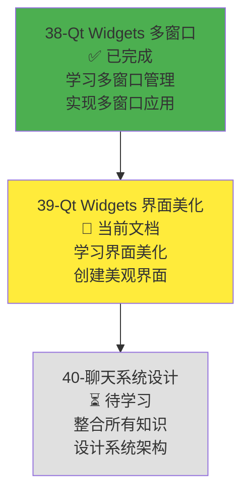
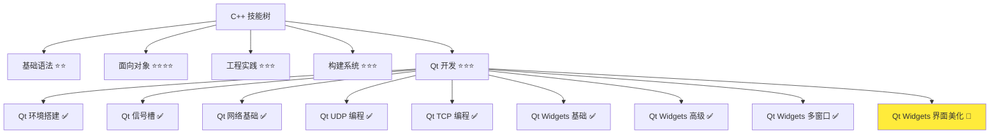
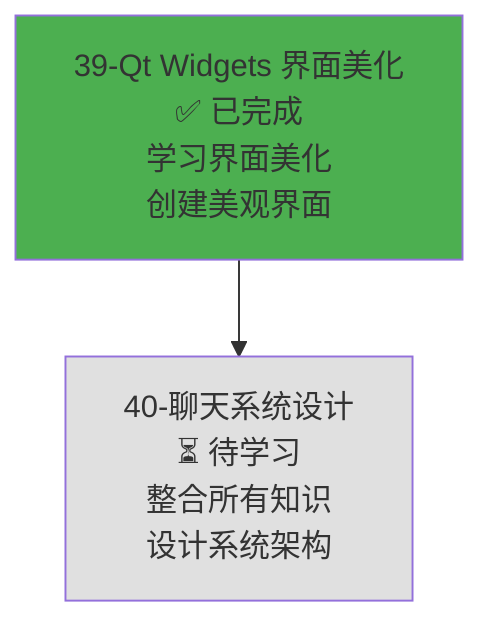

# Qt Widgets 界面美化

> **学习目标**：掌握 Qt Widgets 模块的界面美化技术（样式表、主题、图标、动画），理解现代化界面设计原则，能够创建美观的 GUI 应用，为开发局域网聊天软件的美观界面打下基础  
> **前置知识**：Qt Widgets 基础控件（QApplication、QWidget、QMainWindow、基础控件、布局管理）、Qt Widgets 高级控件（QListWidget、QTableWidget、QProgressBar 等）、Qt Widgets 多窗口管理（QDialog、QMessageBox 等）、Qt 信号槽机制、C++ 面向对象基础  
> **预计时间**：120 分钟  
> **难度等级**：⭐⭐⭐⭐  
> **技能收获**：QSS 样式表、QIcon、资源文件、QPropertyAnimation、主题设计、现代化界面设计  
> **文档版本**：v1.0  
> **最后更新**：2025-12-03

📊 **难度等级说明**

| 等级           | 描述                       | 练习题数量     | 颜色码 |
| -------------- | -------------------------- | -------------- | ------ |
| **⭐**         | 入门级，零基础可学         | 5 题基础概念题 | 🟢绿   |
| **⭐⭐**       | 基础级，需要基本编程概念   | 5 题基础概念题 | 🟡黄   |
| **⭐⭐⭐**     | 中级，需要相关技术基础     | 3 题代码分析题 | 🟠橙   |
| **⭐⭐⭐⭐**   | 高级，需要扎实的技术功底   | 3 题代码分析题 | 🔴红   |
| **⭐⭐⭐⭐⭐** | 专家级，需要丰富的项目经验 | 2 题设计思考题 | 🟣紫   |

## 1. 学习目标

### 1.1 学习动机

- **实际需求**：开发局域网聊天软件和屏幕共享软件需要美观的界面（现代化设计、主题切换、图标、动画效果等）。Qt Widgets 界面美化提供了样式表、主题、图标、动画等功能，是创建现代化 GUI 应用的基础
- **应用场景**：聊天软件界面美化（主题切换、图标、动画效果）、屏幕共享软件界面美化（现代化设计、过渡动画）、数据展示应用美化（表格样式、列表样式）、通用 GUI 应用美化
- **技能价值**：学会后能使用 Qt Widgets 创建美观的 GUI 应用，理解样式表和主题设计，掌握图标和动画的使用，为开发聊天软件和屏幕共享软件的美观界面打下基础
- **数据支持**：Qt Widgets 界面美化是 Qt 框架的重要组成部分，提供了完整的界面美化工具集，掌握界面美化是开发现代化 Qt GUI 应用的必备技能

### 1.1.1 为什么需要学习 Qt Widgets 界面美化？

**学习路径设计**：

在学习了 Qt Widgets 基础控件、高级控件和多窗口管理之后，我们需要学习界面美化来创建美观的应用。这样做的原因：

1. **用户体验**：美观的界面提供更好的用户体验，提升应用的专业性和吸引力
2. **主题切换**：支持浅色/深色主题切换，适应不同用户偏好和使用环境
3. **视觉反馈**：图标和动画提供视觉反馈，让用户操作更直观
4. **品牌形象**：统一的视觉风格和现代化设计提升品牌形象
5. **竞争力**：美观的界面是应用竞争力的重要组成部分

**学习路径安排**：



**为什么先学多窗口管理再学界面美化？**

- ✅ **循序渐进**：多窗口管理是功能实现的基础，界面美化是功能完善后的优化
- ✅ **理解深入**：理解了多窗口应用结构后，更容易理解如何美化不同窗口
- ✅ **实际应用**：先实现功能，再美化界面，符合实际开发流程

**本章的学习重点**：

- ✅ **样式表基础**：掌握 QSS 语法、选择器、属性、伪状态的使用
- ✅ **样式属性**：掌握颜色、字体、边框、背景、圆角等常用样式属性
- ✅ **主题设计**：理解浅色/深色主题、自定义调色板的设计和实现
- ✅ **图标和资源**：掌握 QIcon、资源文件 .qrc 的使用
- ✅ **动画效果**：掌握 QPropertyAnimation、动画组、过渡动画的使用
- ✅ **现代化设计**：了解 Material Design、Fluent Design 等设计风格
- ✅ **实际应用**：美化之前的应用（应用样式表、添加图标、实现动画效果）

> **类比**：Qt Widgets 界面美化就像**装修房子**：
>
> - **样式表（QSS）**就像**涂料和壁纸**，可以改变控件的外观
> - **主题**就像**装修风格**（现代、古典、简约等），统一整个应用的视觉风格
> - **图标**就像**装饰品**，让界面更生动有趣
> - **动画**就像**动态效果**（灯光、窗帘等），让界面更有活力
> - 通过组合这些"装修材料"，可以创建美观的现代化应用

### 1.2 技能树位置



> **图表说明**：C++ 技能树结构图，当前文档点亮 Qt Widgets 界面美化技能点，为后续项目实战做准备

### 1.3 前置知识检查

在开始学习之前，请确认你已经掌握：

- [ ] Qt Widgets 基础控件（QApplication、QWidget、QMainWindow、基础控件、布局管理）
- [ ] Qt Widgets 高级控件（QListWidget、QTableWidget、QProgressBar、QComboBox 等）
- [ ] Qt Widgets 多窗口管理（QDialog、QMessageBox、QInputDialog、QFileDialog）
- [ ] Qt 信号槽机制（QObject::connect、信号和槽的定义）
- [ ] C++ 面向对象基础（类、对象、继承）

> **未掌握处理**：若未通过，请先复习 [Qt Widgets 基础控件](./36-qt-widgets-basics.md)、[Qt Widgets 高级控件](./37-qt-widgets-advanced.md)、[Qt Widgets 多窗口管理](./38-qt-widgets-multi-window.md) 和 [Qt 信号槽机制](./31-qt-signals-slots.md)

## 2. 核心内容

### 2.1 Qt 样式表（QSS）基础

#### 2.1.1 什么是 QSS？

**QSS（Qt Style Sheets）**：Qt 提供的样式表系统，类似于 CSS（Cascading Style Sheets），用于自定义控件的外观。

**QSS 的特点**：

1. **类似 CSS**：语法和 CSS 类似，易于学习和使用
2. **灵活强大**：可以自定义几乎所有控件的外观
3. **运行时应用**：可以在运行时动态应用样式，支持主题切换
4. **继承和层叠**：支持样式继承和层叠，可以统一设置或单独定制

**QSS 的使用方法**：

- **setStyleSheet()**：为单个控件设置样式表
- **QApplication::setStyleSheet()**：为整个应用设置全局样式表
- **样式表文件**：可以将样式表保存到文件中，运行时加载

**QSS 基本示例**：

```cpp
#include <QtWidgets/QApplication>
#include <QtWidgets/QPushButton>
#include <QtWidgets/QWidget>
#include <QtWidgets/QVBoxLayout>

int main(int argc, char *argv[])
{
    QApplication app(argc, argv);

    QWidget window;
    window.setWindowTitle("QSS 示例");
    window.resize(300, 200);

    QVBoxLayout *layout = new QVBoxLayout(&window);

    // 为按钮设置样式表
    QPushButton *button1 = new QPushButton("红色按钮", &window);
    button1->setStyleSheet(
        "QPushButton {"
        "    background-color: #ff4444;"
        "    color: white;"
        "    border: none;"
        "    padding: 10px;"
        "    border-radius: 5px;"
        "}"
        "QPushButton:hover {"
        "    background-color: #ff6666;"
        "}"
        "QPushButton:pressed {"
        "    background-color: #ff2222;"
        "}"
    );

    // 为按钮设置样式表（圆角）
    QPushButton *button2 = new QPushButton("蓝色按钮", &window);
    button2->setStyleSheet(
        "QPushButton {"
        "    background-color: #4444ff;"
        "    color: white;"
        "    border: none;"
        "    padding: 10px;"
        "    border-radius: 10px;"
        "}"
        "QPushButton:hover {"
        "    background-color: #6666ff;"
        "}"
    );

    layout->addWidget(button1);
    layout->addWidget(button2);

    window.show();
    return app.exec();
}
```

> **类比**：QSS 就像**CSS 样式表**，可以改变控件的外观（颜色、字体、边框等）。

#### 2.1.2 QSS 选择器

**QSS 选择器**：用于选择要应用样式的控件。

**QSS 选择器类型**：

1. **类型选择器**：选择特定类型的控件（如 `QPushButton`）
2. **类选择器**：选择特定类的控件（如 `.myButton`）
3. **ID 选择器**：选择特定 ID 的控件（如 `#myButton`）
4. **属性选择器**：选择具有特定属性的控件（如 `QPushButton[flat="true"]`）
5. **子选择器**：选择子控件（如 `QWidget > QPushButton`）
6. **后代选择器**：选择后代控件（如 `QWidget QPushButton`）

**QSS 选择器示例**：

```cpp
#include <QtWidgets/QApplication>
#include <QtWidgets/QPushButton>
#include <QtWidgets/QWidget>
#include <QtWidgets/QVBoxLayout>
#include <QtCore/QString>

int main(int argc, char *argv[])
{
    QApplication app(argc, argv);

    QWidget window;
    window.setWindowTitle("QSS 选择器示例");
    window.resize(300, 300);

    QVBoxLayout *layout = new QVBoxLayout(&window);

    // 设置对象名称，用于 ID 选择器
    QPushButton *button1 = new QPushButton("按钮 1", &window);
    button1->setObjectName("primaryButton");

    QPushButton *button2 = new QPushButton("按钮 2", &window);
    button2->setObjectName("secondaryButton");

    QPushButton *button3 = new QPushButton("按钮 3", &window);

    // 使用全局样式表，应用不同的选择器
    app.setStyleSheet(
        // 类型选择器：所有 QPushButton
        "QPushButton {"
        "    padding: 10px;"
        "    border-radius: 5px;"
        "    font-size: 14px;"
        "}"
        // ID 选择器：特定 ID 的按钮
        "#primaryButton {"
        "    background-color: #4CAF50;"
        "    color: white;"
        "}"
        "#secondaryButton {"
        "    background-color: #2196F3;"
        "    color: white;"
        "}"
        // 类型选择器 + 伪状态：悬停状态
        "QPushButton:hover {"
        "    opacity: 0.8;"
        "}"
    );

    layout->addWidget(button1);
    layout->addWidget(button2);
    layout->addWidget(button3);

    window.show();
    return app.exec();
}
```

> **类比**：QSS 选择器就像**CSS 选择器**，可以选择要应用样式的控件。

#### 2.1.3 QSS 伪状态

**QSS 伪状态**：用于选择控件的特定状态（如悬停、按下、禁用等）。

**QSS 常用伪状态**：

| 伪状态      | 说明                       |
| ----------- | -------------------------- |
| `:hover`    | 鼠标悬停时                 |
| `:pressed`  | 按下时                     |
| `:checked`  | 选中时（复选框、单选按钮） |
| `:disabled` | 禁用时                     |
| `:enabled`  | 启用时                     |
| `:focus`    | 获得焦点时                 |
| `:selected` | 选中时（列表项、表格项）   |

**QSS 伪状态示例**：

```cpp
#include <QtWidgets/QApplication>
#include <QtWidgets/QPushButton>
#include <QtWidgets/QCheckBox>
#include <QtWidgets/QWidget>
#include <QtWidgets/QVBoxLayout>

int main(int argc, char *argv[])
{
    QApplication app(argc, argv);

    QWidget window;
    window.setWindowTitle("QSS 伪状态示例");
    window.resize(300, 200);

    QVBoxLayout *layout = new QVBoxLayout(&window);

    QPushButton *button = new QPushButton("悬停我", &window);
    QCheckBox *checkbox = new QCheckBox("选中我", &window);

    // 使用伪状态设置样式
    app.setStyleSheet(
        "QPushButton {"
        "    background-color: #4CAF50;"
        "    color: white;"
        "    padding: 10px;"
        "    border-radius: 5px;"
        "}"
        "QPushButton:hover {"
        "    background-color: #66BB6A;"
        "}"
        "QPushButton:pressed {"
        "    background-color: #388E3C;"
        "}"
        "QPushButton:disabled {"
        "    background-color: #CCCCCC;"
        "    color: #666666;"
        "}"
        "QCheckBox {"
        "    font-size: 14px;"
        "}"
        "QCheckBox:checked {"
        "    color: #4CAF50;"
        "}"
    );

    layout->addWidget(button);
    layout->addWidget(checkbox);

    window.show();
    return app.exec();
}
```

> **类比**：QSS 伪状态就像**CSS 伪类**，可以选择控件的特定状态。

### 2.2 常用样式属性

#### 2.2.1 颜色和背景

**颜色属性**：用于设置控件的前景色和背景色。

**常用颜色属性**：

| 属性                         | 说明           |
| ---------------------------- | -------------- |
| `color`                      | 前景色（文字） |
| `background-color`           | 背景色         |
| `border-color`               | 边框颜色       |
| `selection-color`            | 选中文字颜色   |
| `selection-background-color` | 选中背景颜色   |

**颜色值格式**：

- **十六进制**：`#RRGGBB` 或 `#AARRGGBB`（如 `#FF0000`、`#80FF0000`）
- **RGB**：`rgb(r, g, b)`（如 `rgb(255, 0, 0)`）
- **RGBA**：`rgba(r, g, b, a)`（如 `rgba(255, 0, 0, 0.5)`）
- **颜色名称**：`red`、`blue`、`green` 等

**颜色和背景示例**：

```cpp
#include <QtWidgets/QApplication>
#include <QtWidgets/QPushButton>
#include <QtWidgets/QLineEdit>
#include <QtWidgets/QWidget>
#include <QtWidgets/QVBoxLayout>

int main(int argc, char *argv[])
{
    QApplication app(argc, argv);

    QWidget window;
    window.setWindowTitle("颜色和背景示例");
    window.resize(300, 200);

    QVBoxLayout *layout = new QVBoxLayout(&window);

    QPushButton *button = new QPushButton("按钮", &window);
    QLineEdit *lineEdit = new QLineEdit(&window);
    lineEdit->setPlaceholderText("输入文本...");

    app.setStyleSheet(
        "QPushButton {"
        "    background-color: #4CAF50;"
        "    color: white;"
        "    padding: 10px;"
        "    border-radius: 5px;"
        "}"
        "QLineEdit {"
        "    background-color: #F5F5F5;"
        "    color: #333333;"
        "    padding: 8px;"
        "    border: 1px solid #CCCCCC;"
        "    border-radius: 4px;"
        "}"
        "QLineEdit:focus {"
        "    border: 2px solid #4CAF50;"
        "    background-color: white;"
        "}"
    );

    layout->addWidget(button);
    layout->addWidget(lineEdit);

    window.show();
    return app.exec();
}
```

#### 2.2.2 字体

**字体属性**：用于设置控件的字体样式。

**常用字体属性**：

| 属性          | 说明     |
| ------------- | -------- |
| `font-family` | 字体族   |
| `font-size`   | 字体大小 |
| `font-weight` | 字体粗细 |
| `font-style`  | 字体样式 |

**字体值格式**：

- **字体族**：`"Arial"`、`"Times New Roman"`、`"Courier New"` 等
- **字体大小**：`12px`、`14pt`、`1.2em` 等
- **字体粗细**：`normal`、`bold`、`100-900` 等
- **字体样式**：`normal`、`italic`、`oblique` 等

**字体示例**：

```cpp
#include <QtWidgets/QApplication>
#include <QtWidgets/QLabel>
#include <QtWidgets/QPushButton>
#include <QtWidgets/QWidget>
#include <QtWidgets/QVBoxLayout>

int main(int argc, char *argv[])
{
    QApplication app(argc, argv);

    QWidget window;
    window.setWindowTitle("字体示例");
    window.resize(300, 200);

    QVBoxLayout *layout = new QVBoxLayout(&window);

    QLabel *label1 = new QLabel("普通文本", &window);
    QLabel *label2 = new QLabel("粗体文本", &window);
    label2->setObjectName("boldLabel");
    QLabel *label3 = new QLabel("斜体文本", &window);
    label3->setObjectName("italicLabel");
    QPushButton *button = new QPushButton("按钮", &window);

    app.setStyleSheet(
        "QLabel {"
        "    font-size: 14px;"
        "    font-family: Arial;"
        "}"
        "QLabel#boldLabel {"
        "    font-weight: bold;"
        "    font-size: 16px;"
        "}"
        "QLabel#italicLabel {"
        "    font-style: italic;"
        "}"
        "QPushButton {"
        "    font-size: 14px;"
        "    font-weight: bold;"
        "    padding: 10px;"
        "}"
    );

    layout->addWidget(label1);
    layout->addWidget(label2);
    layout->addWidget(label3);
    layout->addWidget(button);

    window.show();
    return app.exec();
}
```

#### 2.2.3 边框和圆角

**边框属性**：用于设置控件的边框样式。

**常用边框属性**：

| 属性            | 说明         |
| --------------- | ------------ |
| `border`        | 边框（简写） |
| `border-width`  | 边框宽度     |
| `border-style`  | 边框样式     |
| `border-color`  | 边框颜色     |
| `border-radius` | 圆角半径     |

**边框值格式**：

- **边框宽度**：`1px`、`2px` 等
- **边框样式**：`solid`、`dashed`、`dotted`、`none` 等
- **边框颜色**：颜色值（如 `#CCCCCC`）
- **圆角半径**：`5px`、`10px` 等（支持四个值：`top-left top-right bottom-right bottom-left`）

**边框和圆角示例**：

```cpp
#include <QtWidgets/QApplication>
#include <QtWidgets/QPushButton>
#include <QtWidgets/QLineEdit>
#include <QtWidgets/QWidget>
#include <QtWidgets/QVBoxLayout>

int main(int argc, char *argv[])
{
    QApplication app(argc, argv);

    QWidget window;
    window.setWindowTitle("边框和圆角示例");
    window.resize(300, 250);

    QVBoxLayout *layout = new QVBoxLayout(&window);

    QPushButton *button1 = new QPushButton("圆角按钮", &window);
    button1->setObjectName("roundedButton");
    QPushButton *button2 = new QPushButton("带边框按钮", &window);
    button2->setObjectName("borderedButton");
    QLineEdit *lineEdit = new QLineEdit(&window);
    lineEdit->setPlaceholderText("圆角输入框...");

    app.setStyleSheet(
        "QPushButton {"
        "    padding: 10px;"
        "    background-color: #4CAF50;"
        "    color: white;"
        "}"
        "QPushButton#roundedButton {"
        "    border-radius: 10px;"
        "    border: none;"
        "}"
        "QPushButton#borderedButton {"
        "    border-radius: 5px;"
        "    border: 2px solid #388E3C;"
        "}"
        "QLineEdit {"
        "    padding: 8px;"
        "    border: 1px solid #CCCCCC;"
        "    border-radius: 8px;"
        "    background-color: white;"
        "}"
        "QLineEdit:focus {"
        "    border: 2px solid #4CAF50;"
        "}"
    );

    layout->addWidget(button1);
    layout->addWidget(button2);
    layout->addWidget(lineEdit);

    window.show();
    return app.exec();
}
```

### 2.3 主题和配色方案

#### 2.3.1 浅色/深色主题

**主题切换**：通过切换不同的样式表实现浅色/深色主题。

**主题设计原则**：

1. **对比度**：确保文字和背景有足够的对比度
2. **一致性**：保持整个应用的视觉风格一致
3. **可读性**：确保在不同主题下都有良好的可读性
4. **用户偏好**：支持用户选择主题

**浅色/深色主题示例**：

```cpp
#include <QtWidgets/QApplication>
#include <QtWidgets/QMainWindow>
#include <QtWidgets/QPushButton>
#include <QtWidgets/QVBoxLayout>
#include <QtWidgets/QWidget>
#include <QtWidgets/QMenuBar>
#include <QtWidgets/QMenu>
#include <QtGui/QAction>
#include <QtCore/QString>

class MainWindow : public QMainWindow
{
    Q_OBJECT

public:
    explicit MainWindow(QWidget *parent = nullptr)
        : QMainWindow(parent)
        , m_isDarkTheme(false)
    {
        setWindowTitle("主题切换示例");
        resize(400, 300);

        QWidget *centralWidget = new QWidget(this);
        setCentralWidget(centralWidget);

        QVBoxLayout *layout = new QVBoxLayout(centralWidget);

        m_button = new QPushButton("切换主题", this);
        connect(m_button, &QPushButton::clicked, this, &MainWindow::toggleTheme);

        layout->addWidget(m_button);

        // 创建菜单
        QMenuBar *menuBar = this->menuBar();
        QMenu *themeMenu = menuBar->addMenu("主题");
        QAction *lightAction = themeMenu->addAction("浅色主题");
        QAction *darkAction = themeMenu->addAction("深色主题");

        connect(lightAction, &QAction::triggered, this, &MainWindow::setLightTheme);
        connect(darkAction, &QAction::triggered, this, &MainWindow::setDarkTheme);

        // 应用初始主题（浅色）
        setLightTheme();
    }

private slots:
    void toggleTheme()
    {
        if (m_isDarkTheme) {
            setLightTheme();
        } else {
            setDarkTheme();
        }
    }

    void setLightTheme()
    {
        m_isDarkTheme = false;
        qApp->setStyleSheet(
            "QMainWindow {"
            "    background-color: #FFFFFF;"
            "}"
            "QPushButton {"
            "    background-color: #4CAF50;"
            "    color: white;"
            "    padding: 10px;"
            "    border-radius: 5px;"
            "    border: none;"
            "}"
            "QPushButton:hover {"
            "    background-color: #66BB6A;"
            "}"
            "QMenuBar {"
            "    background-color: #F5F5F5;"
            "    color: #333333;"
            "}"
            "QMenu {"
            "    background-color: white;"
            "    color: #333333;"
            "}"
        );
    }

    void setDarkTheme()
    {
        m_isDarkTheme = true;
        qApp->setStyleSheet(
            "QMainWindow {"
            "    background-color: #1E1E1E;"
            "}"
            "QPushButton {"
            "    background-color: #4CAF50;"
            "    color: white;"
            "    padding: 10px;"
            "    border-radius: 5px;"
            "    border: none;"
            "}"
            "QPushButton:hover {"
            "    background-color: #66BB6A;"
            "}"
            "QMenuBar {"
            "    background-color: #2D2D2D;"
            "    color: #FFFFFF;"
            "}"
            "QMenu {"
            "    background-color: #2D2D2D;"
            "    color: #FFFFFF;"
            "}"
        );
    }

private:
    QPushButton *m_button;
    bool m_isDarkTheme;
};

#include "main.moc"

int main(int argc, char *argv[])
{
    QApplication app(argc, argv);

    MainWindow window;
    window.show();

    return app.exec();
}
```

#### 2.3.2 自定义调色板

**调色板**：定义应用中使用的颜色集合，确保颜色使用的一致性。

**调色板设计原则**：

1. **主色调**：选择一个主色调，用于主要操作和强调
2. **辅助色**：选择辅助色，用于次要操作和装饰
3. **中性色**：选择中性色（灰、白、黑），用于背景和文字
4. **语义色**：定义语义色（成功、警告、错误、信息）

**自定义调色板示例**：

```cpp
#include <QtWidgets/QApplication>
#include <QtWidgets/QPushButton>
#include <QtWidgets/QWidget>
#include <QtWidgets/QVBoxLayout>
#include <QtWidgets/QLabel>
#include <QtCore/QString>

class ColorPalette
{
public:
    // 主色调
    static constexpr const char* PRIMARY = "#4CAF50";
    static constexpr const char* PRIMARY_DARK = "#388E3C";
    static constexpr const char* PRIMARY_LIGHT = "#66BB6A";

    // 辅助色
    static constexpr const char* SECONDARY = "#2196F3";
    static constexpr const char* SECONDARY_DARK = "#1976D2";
    static constexpr const char* SECONDARY_LIGHT = "#64B5F6";

    // 语义色
    static constexpr const char* SUCCESS = "#4CAF50";
    static constexpr const char* WARNING = "#FF9800";
    static constexpr const char* ERROR = "#F44336";
    static constexpr const char* INFO = "#2196F3";

    // 中性色
    static constexpr const char* BACKGROUND = "#FFFFFF";
    static constexpr const char* SURFACE = "#F5F5F5";
    static constexpr const char* TEXT_PRIMARY = "#212121";
    static constexpr const char* TEXT_SECONDARY = "#757575";
};

int main(int argc, char *argv[])
{
    QApplication app(argc, argv);

    QWidget window;
    window.setWindowTitle("自定义调色板示例");
    window.resize(300, 300);

    QVBoxLayout *layout = new QVBoxLayout(&window);

    QPushButton *primaryButton = new QPushButton("主要按钮", &window);
    primaryButton->setObjectName("primaryButton");
    QPushButton *secondaryButton = new QPushButton("次要按钮", &window);
    secondaryButton->setObjectName("secondaryButton");
    QPushButton *successButton = new QPushButton("成功", &window);
    successButton->setObjectName("successButton");
    QPushButton *warningButton = new QPushButton("警告", &window);
    warningButton->setObjectName("warningButton");
    QPushButton *errorButton = new QPushButton("错误", &window);
    errorButton->setObjectName("errorButton");

    // 使用自定义调色板
    QString styleSheet = QString(
        "QPushButton {"
        "    padding: 10px;"
        "    border-radius: 5px;"
        "    border: none;"
        "    color: white;"
        "}"
        "QPushButton#primaryButton {"
        "    background-color: %1;"
        "}"
        "QPushButton#primaryButton:hover {"
        "    background-color: %2;"
        "}"
        "QPushButton#secondaryButton {"
        "    background-color: %3;"
        "}"
        "QPushButton#secondaryButton:hover {"
        "    background-color: %4;"
        "}"
        "QPushButton#successButton {"
        "    background-color: %5;"
        "}"
        "QPushButton#warningButton {"
        "    background-color: %6;"
        "}"
        "QPushButton#errorButton {"
        "    background-color: %7;"
        "}"
    ).arg(ColorPalette::PRIMARY)
     .arg(ColorPalette::PRIMARY_LIGHT)
     .arg(ColorPalette::SECONDARY)
     .arg(ColorPalette::SECONDARY_LIGHT)
     .arg(ColorPalette::SUCCESS)
     .arg(ColorPalette::WARNING)
     .arg(ColorPalette::ERROR);

    app.setStyleSheet(styleSheet);

    layout->addWidget(primaryButton);
    layout->addWidget(secondaryButton);
    layout->addWidget(successButton);
    layout->addWidget(warningButton);
    layout->addWidget(errorButton);

    window.show();
    return app.exec();
}
```

### 2.4 图标和资源

#### 2.4.1 QIcon 基础

**QIcon**：Qt 提供的图标类，用于显示图标。

**QIcon 的特点**：

1. **多尺寸支持**：支持不同尺寸的图标（16x16、32x32、64x64 等）
2. **多状态支持**：支持不同状态的图标（正常、禁用、激活、选中等）
3. **多模式支持**：支持不同模式的图标（Normal、Disabled、Active、Selected）

**QIcon 的使用方法**：

- **构造函数**：`QIcon(const QString &fileName)`、`QIcon(const QPixmap &pixmap)`
- **addFile()**：添加图标文件
- **addPixmap()**：添加像素图
- **setThemeName()**：设置图标主题名称

**QIcon 示例**：

```cpp
#include <QtCore/QLoggingCategory>
#include <QtCore/QString>
#include <QtGui/QIcon>
#include <QtWidgets/QApplication>
#include <QtWidgets/QPushButton>
#include <QtWidgets/QStyle>
#include <QtWidgets/QVBoxLayout>
#include <QtWidgets/QWidget>

int main(int argc, char *argv[])
{
    // 抑制 macOS 上的 IMK 相关警告消息
    QLoggingCategory::setFilterRules("qt.qpa.input*.debug=false");

    QApplication app(argc, argv);

    QWidget window;
    window.setWindowTitle("QIcon 示例");
    window.resize(300, 200);

    QVBoxLayout *layout = new QVBoxLayout(&window);

    // 使用 Qt 内置的标准图标
    QPushButton *button1 = new QPushButton("打开文件", &window);
    QIcon icon1 = window.style()->standardIcon(QStyle::SP_DirOpenIcon);
    button1->setIcon(icon1);
    button1->setIconSize(QSize(24, 24));

    QPushButton *button2 = new QPushButton("保存文件", &window);
    QIcon icon2 = window.style()->standardIcon(QStyle::SP_DriveHDIcon);
    button2->setIcon(icon2);
    button2->setIconSize(QSize(32, 32));

    QPushButton *button3 = new QPushButton("关于", &window);
    QIcon icon3 = window.style()->standardIcon(QStyle::SP_MessageBoxInformation);
    button3->setIcon(icon3);
    button3->setIconSize(QSize(24, 24));

    layout->addWidget(button1);
    layout->addWidget(button2);
    layout->addWidget(button3);

    window.show();
    return app.exec();
}
```

#### 2.4.2 资源文件（.qrc）

**资源文件（.qrc）**：Qt 提供的资源管理系统，用于将资源文件（图标、图片、样式表等）嵌入到应用程序中。

**资源文件的优点**：

1. **嵌入应用**：资源文件嵌入到应用程序中，不需要单独分发
2. **路径统一**：使用统一的路径格式（`:/path/to/resource`）
3. **跨平台**：在不同平台上使用相同的路径格式

**资源文件的结构**：

```xml
<!DOCTYPE RCC>
<RCC version="1.0">
    <qresource>
        <file>icons/icon1.png</file>
        <file>icons/icon2.png</file>
        <file>styles/style.qss</file>
    </qresource>
</RCC>
```

**资源文件的使用**：

1. **创建 .qrc 文件**：在项目中创建资源文件（如 `resources.qrc`）
2. **添加资源**：在 .qrc 文件中添加资源文件路径
3. **在 CMakeLists.txt 中注册**：使用 `qt_add_resources()` 注册资源文件
4. **在代码中使用**：使用 `:/path/to/resource` 路径访问资源

**资源文件示例**：

**resources.qrc**：

```xml
<!DOCTYPE RCC>
<RCC version="1.0">
    <qresource>
        <file>icons/icon1.png</file>
        <file>icons/icon2.png</file>
        <file>styles/style.qss</file>
    </qresource>
</RCC>
```

**CMakeLists.txt**：

```cmake
cmake_minimum_required(VERSION 3.20)
project(IconExample)

set(CMAKE_CXX_STANDARD 17)
set(CMAKE_CXX_STANDARD_REQUIRED ON)

find_package(Qt6 REQUIRED COMPONENTS Core Widgets)

qt_add_executable(IconExample main.cpp)
qt_add_resources(IconExample "resources"
    PREFIX "/"
    FILES
        resources.qrc
)

target_link_libraries(IconExample Qt6::Core Qt6::Widgets)
```

**main.cpp**：

```cpp
#include <QtWidgets/QApplication>
#include <QtWidgets/QPushButton>
#include <QtWidgets/QWidget>
#include <QtWidgets/QVBoxLayout>
#include <QtGui/QIcon>
#include <QtCore/QFile>
#include <QtCore/QTextStream>
#include <QtCore/QString>

int main(int argc, char *argv[])
{
    QApplication app(argc, argv);

    QWidget window;
    window.setWindowTitle("资源文件示例");
    window.resize(300, 200);

    QVBoxLayout *layout = new QVBoxLayout(&window);

    // 从资源文件加载图标
    QPushButton *button = new QPushButton("带图标按钮", &window);
    QIcon icon(":/icons/icon1.png");
    button->setIcon(icon);
    button->setIconSize(QSize(24, 24));

    // 从资源文件加载样式表
    QFile styleFile(":/styles/style.qss");
    if (styleFile.open(QFile::ReadOnly | QFile::Text)) {
        QTextStream stream(&styleFile);
        app.setStyleSheet(stream.readAll());
    }

    layout->addWidget(button);

    window.show();
    return app.exec();
}
```

### 2.5 动画效果

#### 2.5.1 QPropertyAnimation 基础

**QPropertyAnimation**：Qt 提供的属性动画类，用于动画化控件的属性（位置、大小、颜色等）。

**QPropertyAnimation 的特点**：

1. **属性动画**：可以动画化任何 Qt 属性
2. **缓动函数**：支持多种缓动函数（线性、缓入、缓出、缓入缓出等）
3. **持续时间**：可以设置动画持续时间
4. **循环**：支持动画循环播放

**QPropertyAnimation 的使用方法**：

- **构造函数**：`QPropertyAnimation(QObject *target, const QByteArray &propertyName, QObject *parent = nullptr)`
- **setDuration()**：设置动画持续时间（毫秒）
- **setStartValue()**：设置起始值
- **setEndValue()**：设置结束值
- **setEasingCurve()**：设置缓动曲线
- **start()**：开始动画

**QPropertyAnimation 示例**：

```cpp
#include <QtWidgets/QApplication>
#include <QtWidgets/QPushButton>
#include <QtWidgets/QWidget>
#include <QtWidgets/QVBoxLayout>
#include <QtCore/QPropertyAnimation>
#include <QtCore/QAbstractAnimation>
#include <QtCore/QEasingCurve>

int main(int argc, char *argv[])
{
    QApplication app(argc, argv);

    QWidget window;
    window.setWindowTitle("QPropertyAnimation 示例");
    window.resize(400, 300);
    window.setStyleSheet("background-color: #F5F5F5;");

    QPushButton *button = new QPushButton("点击我", &window);
    button->setGeometry(50, 50, 100, 40);
    button->setStyleSheet(
        "QPushButton {"
        "    background-color: #4CAF50;"
        "    color: white;"
        "    border-radius: 5px;"
        "    border: none;"
        "}"
    );

    // 创建位置动画
    QPropertyAnimation *animation = new QPropertyAnimation(button, "geometry", &window);
    animation->setDuration(1000);
    animation->setStartValue(QRect(50, 50, 100, 40));
    animation->setEndValue(QRect(250, 200, 100, 40));
    animation->setEasingCurve(QEasingCurve::InOutQuad);

    // 点击按钮时启动动画
    QObject::connect(button, &QPushButton::clicked, [animation]() {
        if (animation->state() == QAbstractAnimation::Running) {
            animation->stop();
        }
        animation->start();
    });

    window.show();
    return app.exec();
}
```

#### 2.5.2 动画组

**动画组**：用于同时播放多个动画。

**QParallelAnimationGroup**：并行动画组，同时播放多个动画。

**QSequentialAnimationGroup**：顺序动画组，按顺序播放多个动画。

**动画组示例**：

```cpp
#include <QtWidgets/QApplication>
#include <QtWidgets/QPushButton>
#include <QtWidgets/QWidget>
#include <QtCore/QPropertyAnimation>
#include <QtCore/QParallelAnimationGroup>
#include <QtCore/QSequentialAnimationGroup>
#include <QtCore/QEasingCurve>

int main(int argc, char *argv[])
{
    QApplication app(argc, argv);

    QWidget window;
    window.setWindowTitle("动画组示例");
    window.resize(500, 400);
    window.setStyleSheet("background-color: #F5F5F5;");

    QPushButton *button1 = new QPushButton("按钮 1", &window);
    button1->setGeometry(50, 50, 100, 40);
    button1->setStyleSheet(
        "QPushButton {"
        "    background-color: #4CAF50;"
        "    color: white;"
        "    border-radius: 5px;"
        "    border: none;"
        "}"
    );

    QPushButton *button2 = new QPushButton("按钮 2", &window);
    button2->setGeometry(50, 150, 100, 40);
    button2->setStyleSheet(
        "QPushButton {"
        "    background-color: #2196F3;"
        "    color: white;"
        "    border-radius: 5px;"
        "    border: none;"
        "}"
    );

    // 创建并行动画组
    QParallelAnimationGroup *parallelGroup = new QParallelAnimationGroup(&window);

    QPropertyAnimation *anim1 = new QPropertyAnimation(button1, "geometry", &window);
    anim1->setDuration(1000);
    anim1->setStartValue(QRect(50, 50, 100, 40));
    anim1->setEndValue(QRect(350, 50, 100, 40));
    anim1->setEasingCurve(QEasingCurve::InOutQuad);

    QPropertyAnimation *anim2 = new QPropertyAnimation(button2, "geometry", &window);
    anim2->setDuration(1000);
    anim2->setStartValue(QRect(50, 150, 100, 40));
    anim2->setEndValue(QRect(350, 150, 100, 40));
    anim2->setEasingCurve(QEasingCurve::InOutQuad);

    parallelGroup->addAnimation(anim1);
    parallelGroup->addAnimation(anim2);

    // 点击按钮时启动并行动画
    QObject::connect(button1, &QPushButton::clicked, [parallelGroup]() {
        parallelGroup->start();
    });

    window.show();
    return app.exec();
}
```

#### 2.5.3 过渡动画

**过渡动画**：用于在状态变化时提供平滑的过渡效果。

**过渡动画的实现**：

1. **使用 QPropertyAnimation**：动画化属性变化
2. **使用样式表过渡**：QSS 不支持过渡动画，需要使用 QPropertyAnimation
3. **使用动画组**：组合多个动画实现复杂过渡

**过渡动画示例**：

```cpp
#include <QtWidgets/QApplication>
#include <QtWidgets/QPushButton>
#include <QtWidgets/QWidget>
#include <QtCore/QPropertyAnimation>
#include <QtCore/QEasingCurve>
#include <QtCore/QEvent>
#include <QtGui/QColor>

#include <QtGui/QEnterEvent>

class AnimatedButton : public QPushButton
{
    Q_OBJECT
    Q_PROPERTY(QColor backgroundColor READ backgroundColor WRITE setBackgroundColor)

public:
    explicit AnimatedButton(const QString &text, QWidget *parent = nullptr)
        : QPushButton(text, parent)
        , m_backgroundColor(QColor("#4CAF50"))
    {
        updateStyle();
    }

    QColor backgroundColor() const { return m_backgroundColor; }
    void setBackgroundColor(const QColor &color)
    {
        m_backgroundColor = color;
        updateStyle();
    }

protected:
    void enterEvent(QEnterEvent *event) override
    {
        QPushButton::enterEvent(event);
        emit mouseEntered();
    }

    void leaveEvent(QEvent *event) override
    {
        QPushButton::leaveEvent(event);
        emit mouseLeft();
    }

signals:
    void mouseEntered();
    void mouseLeft();

private:
    void updateStyle()
    {
        setStyleSheet(QString(
            "QPushButton {"
            "    background-color: %1;"
            "    color: white;"
            "    border-radius: 5px;"
            "    border: none;"
            "    padding: 10px;"
            "}"
        ).arg(m_backgroundColor.name()));
    }

    QColor m_backgroundColor;
};

#include "main.moc"

int main(int argc, char *argv[])
{
    QApplication app(argc, argv);

    QWidget window;
    window.setWindowTitle("过渡动画示例");
    window.resize(300, 200);
    window.setStyleSheet("background-color: #F5F5F5;");

    AnimatedButton *button = new AnimatedButton("悬停我", &window);
    button->setGeometry(100, 80, 100, 40);

    // 创建颜色过渡动画
    QPropertyAnimation *colorAnimation = new QPropertyAnimation(button, "backgroundColor", &window);
    colorAnimation->setDuration(300);
    colorAnimation->setStartValue(QColor("#4CAF50"));
    colorAnimation->setEndValue(QColor("#66BB6A"));

    QPropertyAnimation *colorAnimationBack = new QPropertyAnimation(button, "backgroundColor", &window);
    colorAnimationBack->setDuration(300);
    colorAnimationBack->setStartValue(QColor("#66BB6A"));
    colorAnimationBack->setEndValue(QColor("#4CAF50"));

    // 鼠标进入时启动动画
    QObject::connect(button, &AnimatedButton::mouseEntered, [colorAnimation]() {
        colorAnimation->start();
    });

    // 鼠标离开时启动返回动画
    QObject::connect(button, &AnimatedButton::mouseLeft, [colorAnimationBack]() {
        colorAnimationBack->start();
    });

    window.show();
    return app.exec();
}
```

### 2.6 现代化界面设计

#### 2.6.1 Material Design 风格

**Material Design**：Google 提出的设计语言，强调卡片、阴影、动画等元素。

**Material Design 特点**：

1. **卡片设计**：使用卡片展示内容
2. **阴影效果**：使用阴影提供层次感
3. **动画反馈**：使用动画提供视觉反馈
4. **颜色系统**：使用主色调和辅助色

**Material Design 风格示例**：

```cpp
#include <QtWidgets/QApplication>
#include <QtWidgets/QPushButton>
#include <QtWidgets/QWidget>
#include <QtWidgets/QVBoxLayout>
#include <QtWidgets/QLabel>

int main(int argc, char *argv[])
{
    QApplication app(argc, argv);

    QWidget window;
    window.setWindowTitle("Material Design 风格示例");
    window.resize(400, 300);
    window.setStyleSheet("background-color: #F5F5F5;");

    QWidget *card = new QWidget(&window);
    card->setGeometry(50, 50, 300, 200);
    card->setStyleSheet(
        "QWidget {"
        "    background-color: white;"
        "    border-radius: 4px;"
        "}"
    );

    QVBoxLayout *layout = new QVBoxLayout(card);
    layout->setContentsMargins(20, 20, 20, 20);

    QLabel *title = new QLabel("卡片标题", card);
    title->setStyleSheet(
        "QLabel {"
        "    font-size: 20px;"
        "    font-weight: bold;"
        "    color: #212121;"
        "}"
    );

    QLabel *content = new QLabel("这是卡片内容", card);
    content->setStyleSheet(
        "QLabel {"
        "    font-size: 14px;"
        "    color: #757575;"
        "}"
    );

    QPushButton *button = new QPushButton("操作", card);
    button->setStyleSheet(
        "QPushButton {"
        "    background-color: #2196F3;"
        "    color: white;"
        "    padding: 10px 20px;"
        "    border-radius: 4px;"
        "    border: none;"
        "    font-size: 14px;"
        "}"
        "QPushButton:hover {"
        "    background-color: #1976D2;"
        "}"
    );

    layout->addWidget(title);
    layout->addWidget(content);
    layout->addWidget(button);

    window.show();
    return app.exec();
}
```

#### 2.6.2 Fluent Design 风格

**Fluent Design**：Microsoft 提出的设计语言，强调流畅、自然、适应性。

**Fluent Design 特点**：

1. **流畅动画**：使用流畅的动画过渡
2. **深度和层次**：使用深度和层次提供空间感
3. **材质**：使用材质（如亚克力）提供视觉层次
4. **光感**：使用光感提供视觉引导

**Fluent Design 风格示例**：

```cpp
#include <QtWidgets/QApplication>
#include <QtWidgets/QPushButton>
#include <QtWidgets/QWidget>
#include <QtWidgets/QVBoxLayout>
#include <QtWidgets/QLabel>

int main(int argc, char *argv[])
{
    QApplication app(argc, argv);

    QWidget window;
    window.setWindowTitle("Fluent Design 风格示例");
    window.resize(400, 300);
    window.setStyleSheet("background-color: #F3F3F3;");

    QWidget *card = new QWidget(&window);
    card->setGeometry(50, 50, 300, 200);
    card->setStyleSheet(
        "QWidget {"
        "    background-color: rgba(255, 255, 255, 0.7);"
        "    border-radius: 8px;"
        "    border: 1px solid rgba(0, 0, 0, 0.1);"
        "}"
    );

    QVBoxLayout *layout = new QVBoxLayout(card);
    layout->setContentsMargins(20, 20, 20, 20);

    QLabel *title = new QLabel("卡片标题", card);
    title->setStyleSheet(
        "QLabel {"
        "    font-size: 24px;"
        "    font-weight: 600;"
        "    color: #000000;"
        "}"
    );

    QLabel *content = new QLabel("这是卡片内容", card);
    content->setStyleSheet(
        "QLabel {"
        "    font-size: 14px;"
        "    color: #666666;"
        "}"
    );

    QPushButton *button = new QPushButton("操作", card);
    button->setStyleSheet(
        "QPushButton {"
        "    background-color: #0078D4;"
        "    color: white;"
        "    padding: 10px 24px;"
        "    border-radius: 4px;"
        "    border: none;"
        "    font-size: 14px;"
        "}"
        "QPushButton:hover {"
        "    background-color: #106EBE;"
        "}"
        "QPushButton:pressed {"
        "    background-color: #005A9E;"
        "}"
    );

    layout->addWidget(title);
    layout->addWidget(content);
    layout->addWidget(button);

    window.show();
    return app.exec();
}
```

## 3. 完整应用示例

### 3.1 美化聊天应用界面

创建一个美化后的聊天应用界面，展示如何使用样式表、图标和动画：

```cpp
#include <QtWidgets/QApplication>
#include <QtWidgets/QMainWindow>
#include <QtWidgets/QWidget>
#include <QtWidgets/QVBoxLayout>
#include <QtWidgets/QHBoxLayout>
#include <QtWidgets/QPushButton>
#include <QtWidgets/QLineEdit>
#include <QtWidgets/QTextEdit>
#include <QtWidgets/QLabel>
#include <QtWidgets/QListWidget>
#include <QtWidgets/QMenuBar>
#include <QtWidgets/QMenu>
#include <QtWidgets/QStatusBar>
#include <QtGui/QAction>
#include <QtCore/QString>

class ChatWindow : public QMainWindow
{
    Q_OBJECT

public:
    explicit ChatWindow(QWidget *parent = nullptr)
        : QMainWindow(parent)
    {
        setWindowTitle("QtLanChat - 美化版");
        resize(800, 600);

        // 创建菜单栏
        QMenuBar *menuBar = this->menuBar();
        QMenu *fileMenu = menuBar->addMenu("文件");
        QMenu *viewMenu = menuBar->addMenu("视图");
        QMenu *helpMenu = menuBar->addMenu("帮助");

        QAction *exitAction = fileMenu->addAction("退出");
        connect(exitAction, &QAction::triggered, this, &QWidget::close);

        QAction *lightThemeAction = viewMenu->addAction("浅色主题");
        QAction *darkThemeAction = viewMenu->addAction("深色主题");
        connect(lightThemeAction, &QAction::triggered, this, &ChatWindow::setLightTheme);
        connect(darkThemeAction, &QAction::triggered, this, &ChatWindow::setDarkTheme);

        // 创建中央控件
        QWidget *centralWidget = new QWidget(this);
        setCentralWidget(centralWidget);

        QHBoxLayout *mainLayout = new QHBoxLayout(centralWidget);
        mainLayout->setSpacing(0);
        mainLayout->setContentsMargins(0, 0, 0, 0);

        // 用户列表
        QWidget *userListWidget = new QWidget(centralWidget);
        userListWidget->setFixedWidth(200);
        QVBoxLayout *userListLayout = new QVBoxLayout(userListWidget);
        userListLayout->setContentsMargins(0, 0, 0, 0);

        QLabel *userListTitle = new QLabel("在线用户", userListWidget);
        userListTitle->setObjectName("userListTitle");

        m_userList = new QListWidget(userListWidget);
        m_userList->addItem("用户 1");
        m_userList->addItem("用户 2");
        m_userList->addItem("用户 3");

        userListLayout->addWidget(userListTitle);
        userListLayout->addWidget(m_userList);

        // 聊天区域
        QWidget *chatWidget = new QWidget(centralWidget);
        QVBoxLayout *chatLayout = new QVBoxLayout(chatWidget);
        chatLayout->setContentsMargins(0, 0, 0, 0);
        chatLayout->setSpacing(0);

        m_messageArea = new QTextEdit(chatWidget);
        m_messageArea->setReadOnly(true);
        m_messageArea->setPlainText("欢迎使用 QtLanChat！\n");

        QWidget *inputWidget = new QWidget(chatWidget);
        QHBoxLayout *inputLayout = new QHBoxLayout(inputWidget);
        inputLayout->setContentsMargins(10, 10, 10, 10);

        m_inputEdit = new QLineEdit(inputWidget);
        m_inputEdit->setPlaceholderText("输入消息...");

        m_sendButton = new QPushButton("发送", inputWidget);
        m_sendButton->setObjectName("sendButton");

        connect(m_sendButton, &QPushButton::clicked, this, &ChatWindow::sendMessage);
        connect(m_inputEdit, &QLineEdit::returnPressed, this, &ChatWindow::sendMessage);

        inputLayout->addWidget(m_inputEdit);
        inputLayout->addWidget(m_sendButton);

        chatLayout->addWidget(m_messageArea);
        chatLayout->addWidget(inputWidget);

        mainLayout->addWidget(userListWidget);
        mainLayout->addWidget(chatWidget);

        // 状态栏
        statusBar()->showMessage("就绪");

        // 应用初始主题
        setLightTheme();
    }

private slots:
    void sendMessage()
    {
        QString message = m_inputEdit->text();
        if (!message.isEmpty()) {
            m_messageArea->append("我：" + message);
            m_inputEdit->clear();
            statusBar()->showMessage("消息已发送", 2000);
        }
    }

    void setLightTheme()
    {
        qApp->setStyleSheet(
            "QMainWindow {"
            "    background-color: #FFFFFF;"
            "}"
            "QMenuBar {"
            "    background-color: #F5F5F5;"
            "    color: #212121;"
            "    border-bottom: 1px solid #E0E0E0;"
            "}"
            "QMenu {"
            "    background-color: white;"
            "    color: #212121;"
            "    border: 1px solid #E0E0E0;"
            "}"
            "QMenu::item:selected {"
            "    background-color: #E3F2FD;"
            "}"
            "QLabel#userListTitle {"
            "    background-color: #2196F3;"
            "    color: white;"
            "    padding: 10px;"
            "    font-size: 14px;"
            "    font-weight: bold;"
            "}"
            "QListWidget {"
            "    background-color: #FAFAFA;"
            "    border: none;"
            "    font-size: 14px;"
            "}"
            "QListWidget::item {"
            "    padding: 8px;"
            "    border-bottom: 1px solid #E0E0E0;"
            "}"
            "QListWidget::item:hover {"
            "    background-color: #E3F2FD;"
            "}"
            "QListWidget::item:selected {"
            "    background-color: #2196F3;"
            "    color: white;"
            "}"
            "QTextEdit {"
            "    background-color: white;"
            "    border: none;"
            "    font-size: 14px;"
            "    padding: 10px;"
            "}"
            "QLineEdit {"
            "    background-color: white;"
            "    border: 1px solid #E0E0E0;"
            "    border-radius: 4px;"
            "    padding: 8px;"
            "    font-size: 14px;"
            "}"
            "QLineEdit:focus {"
            "    border: 2px solid #2196F3;"
            "}"
            "QPushButton#sendButton {"
            "    background-color: #2196F3;"
            "    color: white;"
            "    border: none;"
            "    border-radius: 4px;"
            "    padding: 8px 20px;"
            "    font-size: 14px;"
            "    font-weight: bold;"
            "}"
            "QPushButton#sendButton:hover {"
            "    background-color: #1976D2;"
            "}"
            "QPushButton#sendButton:pressed {"
            "    background-color: #1565C0;"
            "}"
            "QStatusBar {"
            "    background-color: #F5F5F5;"
            "    color: #757575;"
            "    border-top: 1px solid #E0E0E0;"
            "}"
        );
    }

    void setDarkTheme()
    {
        qApp->setStyleSheet(
            "QMainWindow {"
            "    background-color: #1E1E1E;"
            "}"
            "QMenuBar {"
            "    background-color: #2D2D2D;"
            "    color: #FFFFFF;"
            "    border-bottom: 1px solid #404040;"
            "}"
            "QMenu {"
            "    background-color: #2D2D2D;"
            "    color: #FFFFFF;"
            "    border: 1px solid #404040;"
            "}"
            "QMenu::item:selected {"
            "    background-color: #404040;"
            "}"
            "QLabel#userListTitle {"
            "    background-color: #0D7377;"
            "    color: white;"
            "    padding: 10px;"
            "    font-size: 14px;"
            "    font-weight: bold;"
            "}"
            "QListWidget {"
            "    background-color: #252526;"
            "    border: none;"
            "    color: #CCCCCC;"
            "    font-size: 14px;"
            "}"
            "QListWidget::item {"
            "    padding: 8px;"
            "    border-bottom: 1px solid #404040;"
            "}"
            "QListWidget::item:hover {"
            "    background-color: #2A2D2E;"
            "}"
            "QListWidget::item:selected {"
            "    background-color: #0D7377;"
            "    color: white;"
            "}"
            "QTextEdit {"
            "    background-color: #1E1E1E;"
            "    border: none;"
            "    color: #CCCCCC;"
            "    font-size: 14px;"
            "    padding: 10px;"
            "}"
            "QLineEdit {"
            "    background-color: #252526;"
            "    border: 1px solid #404040;"
            "    border-radius: 4px;"
            "    color: #CCCCCC;"
            "    padding: 8px;"
            "    font-size: 14px;"
            "}"
            "QLineEdit:focus {"
            "    border: 2px solid #0D7377;"
            "}"
            "QPushButton#sendButton {"
            "    background-color: #0D7377;"
            "    color: white;"
            "    border: none;"
            "    border-radius: 4px;"
            "    padding: 8px 20px;"
            "    font-size: 14px;"
            "    font-weight: bold;"
            "}"
            "QPushButton#sendButton:hover {"
            "    background-color: #14A085;"
            "}"
            "QPushButton#sendButton:pressed {"
            "    background-color: #0A5D61;"
            "}"
            "QStatusBar {"
            "    background-color: #2D2D2D;"
            "    color: #CCCCCC;"
            "    border-top: 1px solid #404040;"
            "}"
        );
    }

private:
    QListWidget *m_userList;
    QTextEdit *m_messageArea;
    QLineEdit *m_inputEdit;
    QPushButton *m_sendButton;
};

#include "main.moc"

int main(int argc, char *argv[])
{
    QApplication app(argc, argv);

    ChatWindow window;
    window.show();

    return app.exec();
}
```

**关键点说明**：

1. **样式表应用**：使用全局样式表统一应用样式
2. **主题切换**：支持浅色/深色主题切换
3. **现代化设计**：使用圆角、阴影、颜色等元素
4. **用户体验**：使用悬停效果、焦点效果等提供视觉反馈

### 3.2 项目场景

#### 3.2.1 QtLanChat 项目中的界面美化

在 QtLanChat 项目中，Qt Widgets 界面美化用于：

1. **聊天软件界面美化**：
   - **主题切换**：支持浅色/深色主题切换，适应不同用户偏好
   - **图标**：使用图标表示不同功能（发送、文件、设置等）
   - **动画效果**：使用动画提供视觉反馈（消息发送动画、连接动画等）
   - **现代化设计**：使用 Material Design 或 Fluent Design 风格
   - **样式表**：统一应用样式，确保视觉一致性

2. **屏幕共享软件界面美化**：
   - **主题切换**：支持浅色/深色主题切换
   - **图标**：使用图标表示不同状态（连接、断开、共享中等）
   - **动画效果**：使用动画显示连接状态、传输进度等
   - **现代化设计**：使用现代化设计风格提升用户体验

**Qt Widgets 界面美化在 QtLanChat 中的应用对照表**：

| 美化技术       | 在聊天软件中的应用                    | 在屏幕共享软件中的应用                |
| -------------- | ------------------------------------- | ------------------------------------- |
| **QSS 样式表** | 统一应用样式、主题切换、控件美化      | 统一应用样式、主题切换、控件美化      |
| **主题**       | 浅色/深色主题切换                     | 浅色/深色主题切换                     |
| **图标**       | 功能图标（发送、文件、设置等）        | 状态图标（连接、断开、共享中等）      |
| **动画**       | 消息发送动画、连接动画                | 连接动画、传输进度动画                |
| **现代化设计** | Material Design 或 Fluent Design 风格 | Material Design 或 Fluent Design 风格 |

## 4. 常见问题

### 4.1 QSS 样式表不生效

**问题**：设置了 QSS 样式表，但样式没有生效。

**可能原因**：

1. **选择器错误**：选择器写错了，没有选中目标控件
2. **样式被覆盖**：其他样式表覆盖了当前样式
3. **属性不支持**：使用的属性在当前控件上不支持
4. **语法错误**：QSS 语法错误导致样式表无法解析

**解决方法**：

1. **检查选择器**：确认选择器是否正确选中目标控件
2. **检查优先级**：确认样式表的优先级（全局样式表优先级较低）
3. **检查属性**：确认使用的属性是否支持
4. **检查语法**：确认 QSS 语法是否正确（括号、分号等）

### 4.2 资源文件无法加载

**问题**：资源文件无法加载，图标或样式表无法显示。

**可能原因**：

1. **路径错误**：资源文件路径不正确
2. **资源未注册**：资源文件未在 CMakeLists.txt 中注册
3. **文件不存在**：资源文件不存在或路径错误

**解决方法**：

1. **检查路径**：确认资源文件路径是否正确（`:/path/to/resource`）
2. **检查注册**：确认资源文件已在 CMakeLists.txt 中使用 `qt_add_resources()` 注册
3. **检查文件**：确认资源文件存在且路径正确

### 4.3 动画性能问题

**问题**：动画运行不流畅，有卡顿现象。

**可能原因**：

1. **动画过多**：同时运行的动画过多
2. **属性复杂**：动画化的属性计算复杂
3. **更新频率高**：动画更新频率过高

**解决方法**：

1. **减少动画**：减少同时运行的动画数量
2. **优化属性**：使用简单的属性进行动画
3. **调整频率**：降低动画更新频率或使用更高效的动画方式

### 4.4 主题切换不完整

**问题**：切换主题后，部分控件样式没有更新。

**可能原因**：

1. **样式表不完整**：主题样式表没有覆盖所有控件
2. **局部样式**：某些控件设置了局部样式表，覆盖了全局样式
3. **缓存问题**：样式表缓存导致更新不及时

**解决方法**：

1. **完善样式表**：确保主题样式表覆盖所有控件
2. **统一管理**：使用统一的样式表管理，避免局部样式覆盖
3. **强制更新**：切换主题后强制更新样式表

### 4.5 macOS 控制台警告消息

**问题**：在 macOS 上运行 Qt GUI 应用时，控制台会输出 "error messaging the mach port for IMKCFRunLoopWakeUpReliable" 等警告消息。

**原因**：这是 macOS 上运行 Qt GUI 应用时的常见警告，与输入法（IMK - Input Method Kit）相关，不影响程序功能。

**解决方法**：

在 `main()` 函数开头添加以下代码来抑制这些警告消息：

```cpp
#include <QtCore/QLoggingCategory>

int main(int argc, char *argv[])
{
    // 抑制 macOS 上的 IMK 相关警告消息
    QLoggingCategory::setFilterRules("qt.qpa.input*.debug=false");

    QApplication app(argc, argv);
    // ...
}
```

**注意**：这些警告消息不影响程序功能，但会在控制台输出，影响用户体验。建议在所有示例中添加此代码。

## 5. 练习题

### 5.1 基础概念题

1. **QSS 样式表的作用是什么？**
   - A. 用于自定义控件的外观
   - B. 用于处理事件
   - C. 用于管理布局
   - D. 用于网络通信

2. **QSS 选择器 `QPushButton:hover` 表示什么？**
   - A. 所有 QPushButton 控件
   - B. 鼠标悬停时的 QPushButton
   - C. 按下时的 QPushButton
   - D. 禁用时的 QPushButton

3. **资源文件的路径格式是什么？**
   - A. `./path/to/resource`
   - B. `:/path/to/resource`
   - C. `/path/to/resource`
   - D. `path/to/resource`

### 5.2 代码分析题

1. **分析以下 QSS 代码，说明各个属性的作用**：

   ```css
   QPushButton {
     background-color: #4caf50;
     color: white;
     padding: 10px;
     border-radius: 5px;
     border: none;
   }
   QPushButton:hover {
     background-color: #66bb6a;
   }
   ```

2. **分析以下代码，说明如何实现主题切换**：

   ```cpp
   void MainWindow::setDarkTheme()
   {
       qApp->setStyleSheet(
           "QMainWindow { background-color: #1E1E1E; }"
           "QPushButton { background-color: #0D7377; color: white; }"
       );
   }
   ```

3. **分析以下代码，说明 QPropertyAnimation 的使用方法**：

   ```cpp
   QPropertyAnimation *animation = new QPropertyAnimation(button, "geometry", this);
   animation->setDuration(1000);
   animation->setStartValue(QRect(0, 0, 100, 40));
   animation->setEndValue(QRect(200, 100, 100, 40));
   animation->start();
   ```

### 5.3 编程实践题

1. **创建一个美化后的登录窗口**：
   - 使用 QSS 样式表美化界面
   - 添加圆角、阴影等效果
   - 实现悬停和焦点效果

2. **实现主题切换功能**：
   - 创建浅色和深色主题
   - 添加主题切换按钮
   - 实现平滑的主题切换

3. **添加动画效果**：
   - 为按钮添加点击动画
   - 为窗口添加显示/隐藏动画
   - 实现平滑的过渡效果

## 6. 配套代码说明

### 6.1 代码结构

配套代码位于 `src/stage1/39-qt-widgets-styling/` 目录下，包含以下示例：

- `01-qss-basic/`：QSS 基础示例
- `02-qss-selectors/`：QSS 选择器示例
- `03-qss-pseudo-states/`：QSS 伪状态示例
- `04-theme-switching/`：主题切换示例
- `05-color-palette/`：自定义调色板示例
- `06-icons-resources/`：图标和资源文件示例
- `07-animations/`：动画效果示例（包含 QPropertyAnimation、动画组和过渡动画的综合示例）
- `08-chat-styled/`：美化后的聊天应用示例

### 6.2 编译和运行

**编译单个示例**：

```bash
cd src/stage1/39-qt-widgets-styling/01-qss-basic
mkdir build && cd build
cmake ..
cmake --build .
```

**运行示例**：

```bash
./QssBasic  # 或 ./QssSelectors, ./QssPseudoStates, ./ThemeSwitching, ./ColorPalette, ./IconsResources, ./Animations, ./ChatStyled
```

### 6.3 代码说明

每个示例都包含：

- `CMakeLists.txt`：CMake 配置文件
- `main.cpp`：主程序文件（部分示例包含资源文件）

**注意事项**：

1. **macOS 警告抑制**：所有示例都包含了 `QLoggingCategory::setFilterRules("qt.qpa.input*.debug=false");` 来抑制 macOS 上的 IMK（Input Method Kit）相关警告消息。这些警告不影响程序功能，但会在控制台输出，影响用户体验。

2. **图标使用**：`06-icons-resources` 示例使用 Qt 内置的标准图标（`QStyle::standardIcon()`），无需额外的资源文件即可运行。实际项目中可以使用资源文件（.qrc）来管理自定义图标。

## 7. 学习检查

完成本章学习后，请确认你已经掌握：

- [ ] 使用 QSS 样式表自定义控件外观
- [ ] 理解 QSS 选择器和伪状态的使用
- [ ] 实现主题切换功能
- [ ] 使用 QIcon 和资源文件
- [ ] 使用 QPropertyAnimation 创建动画效果
- [ ] 理解现代化界面设计原则
- [ ] 美化一个完整的应用界面

## 8. 学习成果

完成本章学习后，你将能够：

- ✅ 理解 Qt Widgets 界面美化的核心概念（样式表、主题、图标、动画）
- ✅ 使用 QSS 样式表自定义控件外观
- ✅ 理解 QSS 选择器和伪状态的使用
- ✅ 实现主题切换功能（浅色/深色主题）
- ✅ 使用 QIcon 和资源文件管理图标
- ✅ 使用 QPropertyAnimation 创建动画效果
- ✅ 理解现代化界面设计原则（Material Design、Fluent Design）
- ✅ 美化一个完整的应用界面
- ✅ 为 QtLanChat 项目创建美观的界面打下基础

## 9. 下一步学习

完成本章学习后，建议继续学习：

- **40-chat-system-design.md**：聊天系统设计，整合所有 C++ 和 Qt 知识，设计聊天系统架构

**学习路径图**：


