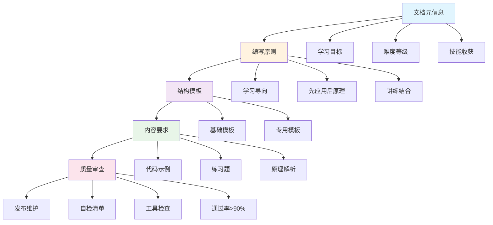
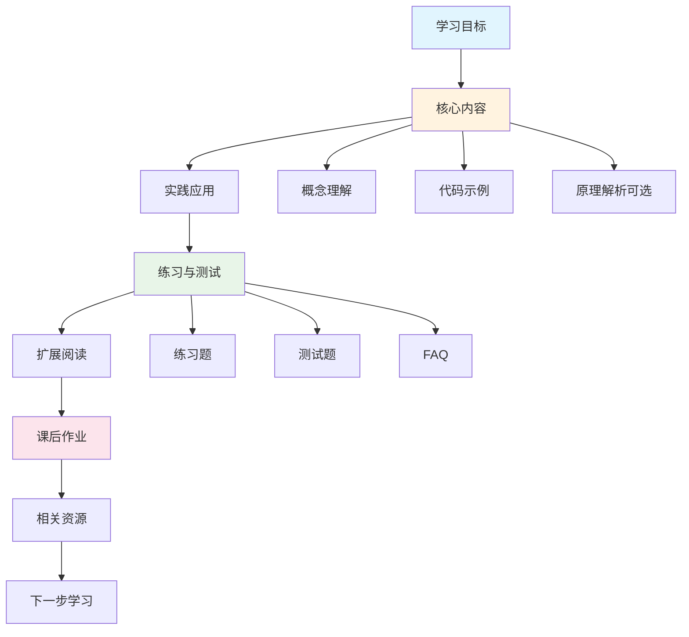
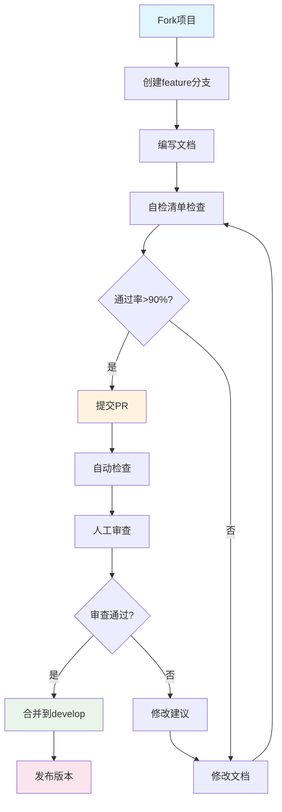

# QtLanChat-FeiQClone 文档编写规范

> 适用范围：C++ Qt 技术教程、项目文档、学习指南  
> 目标：确保文档 **易学、实用、可维护**，支持零基础到高级的渐进式学习  
> 责任人：IdevebI  
> 首次创建：2025-10-23  
> 最近更新：2025-10-23  
> 版本：v1.4  
> 变更影响：v1.4 简化结构，减少冗余，提升可读性，影响所有教程模板使用

  

## 📋 文档流程概览



## 1. 编写原则

### 1.1 核心原则

- **学习导向**：每篇文档都要有明确的学习目标和技能收获（至少 3 点）
- **目标先行**：文档开头明确说明"为什么要学"和"学完能做什么"
- **先应用后原理**：先让学习者看到效果，再深入理解原理
- **讲练结合**：理论 + 代码示例 + 练习题 + 测试题
- **循序渐进**：从零基础到高级，每个概念都有前置知识检查
- **社区与包容**：支持 Markdown 渲染，使用 ARIA 标签和 alt text，便于 GitHub 阅读和协作
  - 示例：``
- **可持续**：文档易更新，支持版本控制

### 1.2 量化指标

- **技能收获**：≥ 3 个具体技能点
- **练习题数量**：初级 5 题、中级 3 题、高级 2 题
- **文档长度**：教程<300 行、标准<400 行、项目<300 行
- **通过率**：文档检查>90%、学习效果>85%

## 2. 文档元信息

### 2.1 必填字段（6 个核心字段）

```markdown
# {文档标题}

> **学习目标**：{一句话说明学完这篇文档能掌握什么技能}  
> **前置知识**：{需要先掌握的概念}  
> **预计时间**：{学习时间}  
> **难度等级**：{⭐ 到 ⭐⭐⭐⭐⭐}  
> **技能收获**：{学完后能点亮哪些技能树节点}  
> **最后更新**：YYYY-MM-DD
```

### 2.2 难度等级说明

| 等级           | 描述                       | 示例         | 练习题数量     |
| -------------- | -------------------------- | ------------ | -------------- |
| **⭐**         | 入门级，零基础可学         | 变量基础     | 5 题基础概念题 |
| **⭐⭐**       | 基础级，需要基本编程概念   | 函数基础     | 5 题基础概念题 |
| **⭐⭐⭐**     | 中级，需要相关技术基础     | 指针与引用   | 3 题代码分析题 |
| **⭐⭐⭐⭐**   | 高级，需要扎实的技术功底   | 面向对象设计 | 3 题代码分析题 |
| **⭐⭐⭐⭐⭐** | 专家级，需要丰富的项目经验 | 性能优化     | 2 题设计思考题 |

## 3. 文档组织与拆分

### 3.1 文件命名规范

- **命名格式**：`{序号}-{英文主题}.md`
- **命名约定**：小写连字符，英文简写
- **文件编码**：UTF-8 无 BOM
- **示例**：`01-cpp-introduction.md`、`08-classes-objects.md`

### 3.2 目录归属

- **阶段教程** → `docs/stage{数字}/`
- **项目文档** → `docs/projects/`
- **标准规范** → `docs/standard/`
- **文档模板** → `docs/standard/template/`
- **资源文件** → `docs/assets/`（图片、代码截图存放）

### 3.3 拆分原则

- **单一技能点**：每篇文档只解决一个核心技能
- **长度控制**：
  - **教程文档**：200-300 行（<2000 字）
  - **标准文档**：300-400 行（<3000 字）
  - **项目文档**：200-300 行（<2000 字）
- **独立阅读**：每篇文档可以独立学习
- **渐进依赖**：文档间有清晰的前置依赖关系
- **合并原则**：相关概念可合并，如指针+引用

## 4. 文档结构与内容要求

### 4.1 标准结构（8 个主要章节）



### 4.2 内容要求

#### 4.2.1 代码示例

- **可运行示例**：所有代码示例必须能够编译运行
- **详细注释**：关键代码行必须有注释说明
- **现代 C++**：优先使用 C++11/14/17 特性
- **语言标签**：代码块必须使用语言标识（如 `cpp`）
- **示例**：

  ```cpp
  // 现代 C++ 示例
  #include <iostream>
  #include <memory>

  int main() {
      // 使用智能指针管理内存
      auto ptr = std::make_unique<int>(42);
      std::cout << "Value: " << *ptr << std::endl;
      return 0;
  }
  ```

#### 4.2.2 练习题设计

- **概念理解题**：选择题、判断题（初级 5 题）
- **代码分析题**：分析代码输出、找出错误（中级 3 题）
- **编程实践题**：编写具体功能（中级 3 题）
- **设计思考题**：系统设计、架构思考（高级 2 题）

#### 4.2.3 原理解析（复杂概念必填）

- **工作原理**：详细解释实现机制
- **设计思想**：为什么这样设计
- **性能考虑**：时间/空间复杂度分析

## 5. 质量审查与验收

### 5.1 自检清单（通过率>90%）

#### 5.1.1 内容编排检查

- [ ] 遵循"先应用后原理"的教学原则
- [ ] 文档结构逻辑清晰，层次分明
- [ ] 内容由浅入深，从简单到复杂
- [ ] 章节间过渡自然，重点突出

#### 5.1.2 用户适配性检查

- [ ] 学习目标明确且可验证
- [ ] 适用读者群体清晰
- [ ] 难度等级与目标读者匹配
- [ ] 前置知识要求合理
- [ ] 在技能树中的位置明确

#### 5.1.3 阅读收获感检查

- [ ] 技能收获具体明确（≥3 个技能点）
- [ ] 有练习题和测试题验证
- [ ] 能够解决实际问题
- [ ] 学习成果可量化

#### 5.1.4 内容含金量检查

- [ ] 代码示例具有实际应用价值
- [ ] 概念解释深入，不仅知其然更知其所以然
- [ ] 技术定义有权威出处（官方文档、标准规范）
- [ ] 原理解析透彻，设计思想清晰

#### 5.1.5 可访问性检查

- [ ] 图片有 alt text
- [ ] 颜色对比度符合标准
- [ ] 支持屏幕阅读器
- [ ] 链接有效，无死链

### 5.2 自动化工具

- **拼写检查**：Grammarly
- **格式检查**：Markdown Lint + Prettier
- **链接检查**：markdown-link-check
- **自动化**：GitHub Actions Markdown lint

### 5.3 通过率标准

- **文档检查**：>90% 项通过
- **学习效果**：>85% 项通过
- **审查周期**：<24 小时，责任人：项目维护者

## 6. 模板文件

### 6.1 可用模板

项目提供了完整的模板体系，位于 `docs/standard/template/` 目录：

- **01-basic-tutorial-template.md** - 基础教程模板（完整结构）
- **02-practice-application-template.md** - 实践应用结构
- **03-exercises-tests-template.md** - 练习与测试结构
- **04-extended-reading-template.md** - 扩展阅读结构
- **05-homework-template.md** - 课后作业及参考答案结构
- **06-resources-template.md** - 相关资源结构
- **07-next-steps-template.md** - 下一步学习结构

### 6.2 使用建议

- **新建文档**：复制 `01-basic-tutorial-template.md` 作为起点
- **专用结构**：根据需要引用其他专用模板
- **占位符**：模板中的 `{ }` 占位符需要填写具体内容
- **示例**：`{标题: 指针基础}` → `指针基础`

### 6.3 文档贡献

- **贡献流程**：Fork → 创建分支 → 提交 PR → 审查合并
- **贡献模板**：`.github/DOC_TEMPLATE.md`（待创建）
- **审查标准**：PR 需通过自检清单>90%
- **工具链**：Prettier 格式化 + GitHub Actions 自动检查

#### 6.3.1 PR 流程图



---

> **建议**：新建教程文档时，先填写元信息，再按模板结构填充内容。始终以学习效果为导向，确保每个概念都有实际应用价值。
