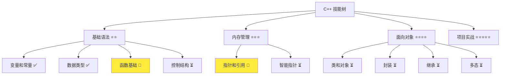
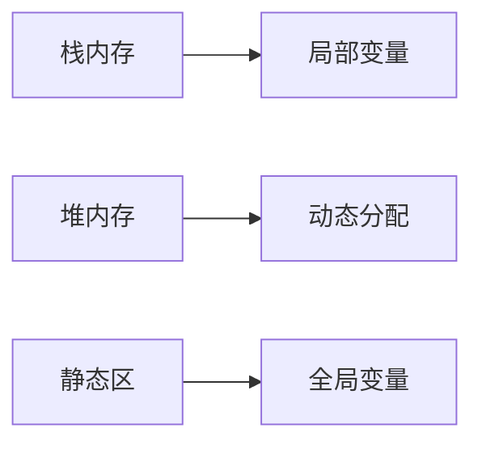

# 基础教程模板

> **模板用途**：C++ Qt 技术教程的标准模板  
> **适用场景**：零基础到高级的渐进式学习文档  
> **使用说明**：复制此模板，填写具体内容  
> **版本**：v1.4

## 📋 模板使用指南

1. **复制模板**：复制此文件到目标位置
2. **填写元信息**：完成文档头部的6个必填项
3. **按结构填充**：按照8个主要章节填充具体内容
4. **质量检查**：使用自检清单检查文档质量

---

# {文档标题}

> **学习目标**：{一句话说明学完这篇文档能掌握什么技能}  
> **前置知识**：{需要先掌握的概念}  
> **预计时间**：{学习时间}  
> **难度等级**：{⭐ 到 ⭐⭐⭐⭐⭐}  
> **技能收获**：{学完后能点亮哪些技能树节点}  
> **最后更新**：YYYY-MM-DD

## 1. 学习目标

### 1.1 学习动机

- **实际需求**：{解释为什么需要学习这个概念}
- **应用场景**：{在什么情况下会用到}
- **技能价值**：{学会后能解决什么问题}

### 1.2 技能树位置



### 1.3 前置知识检查

在开始学习之前，请确认你已经掌握：

- [ ] {前置知识 1}
- [ ] {前置知识 2}
- [ ] {前置知识 3}

## 2. 核心内容

### 2.1 概念理解

**{概念名称}**：{概念定义}

#### 设计原理

- **为什么这样设计**：{设计原因}
- **解决了什么问题**：{解决的问题}
- **有什么优势**：{优势分析}

#### 关键特性

1. **特性 1**：{详细说明}
2. **特性 2**：{详细说明}
3. **特性 3**：{详细说明}

### 2.2 代码示例

#### 基础示例

```cpp
// 现代 C++ 示例
#include <iostream>
#include <memory>

int main() {
    // 使用智能指针管理内存
    auto ptr = std::make_unique<int>(42);
    std::cout << "Value: " << *ptr << std::endl;
    return 0;
}
```

#### 编译运行

```bash
# 编译
g++ -std=c++17 -o example example.cpp

# 运行
./example
```

**预期输出**：

```
Value: 42
```

### 2.3 原理解析（复杂概念必填）

#### 工作原理

1. **步骤 1**：{详细解释}
2. **步骤 2**：{详细解释}
3. **步骤 3**：{详细解释}

#### 内存模型



#### 性能考虑

- **时间复杂度**：{时间复杂度分析}
- **空间复杂度**：{空间复杂度分析}
- **优化建议**：{性能优化建议}

## 3. 实践应用

### 3.1 项目场景

在 QtLanChat 项目中，这个概念用于：

- **应用场景 1**：{具体应用}
- **应用场景 2**：{具体应用}

### 3.2 实际代码

```cpp
// 项目中的实际应用示例
class ChatMessage {
private:
    std::string content;
    std::string sender;

public:
    ChatMessage(const std::string& msg, const std::string& from)
        : content(msg), sender(from) {}

    // 实际方法实现
    void display() const {
        std::cout << sender << ": " << content << std::endl;
    }
};
```

### 3.3 设计思路

- **为什么选择这种设计**：{设计原因}
- **解决了什么问题**：{解决的问题}
- **有什么优势**：{优势分析}

## 4. 练习与测试

### 4.1 练习题（根据难度等级调整数量）

#### 练习 1：基础应用

**题目**：{练习题目描述}

**要求**：

- 编写一个程序实现{具体功能}
- 使用{相关概念}
- 输出格式：{输出要求}

**参考答案**：

```cpp
// 参考答案代码
#include <iostream>

int main() {
    // 实现代码
    return 0;
}
```

**运行结果**：

```
{预期输出}
```


### 4.2 测试题

1. **关于{概念}，下列说法正确的是：**
   A.{选项 A} B.{选项 B} C.{选项 C} D.{选项 D}
   **答案**：{正确答案} **解析**：{详细解析}

2. **{概念}的主要作用是：**
   A.{选项 A} B.{选项 B} C.{选项 C} D.{选项 D}
   **答案**：{正确答案} **解析**：{详细解析}

### 4.3 常见问题 FAQ

- **Q: {常见问题}** **A: {详细解答}**
- **Q: {常见问题}** **A: {详细解答}**

## 5. 扩展阅读

### 5.1 学习资源

- **官方文档**：[C++ 官方标准](https://isocpp.org/)、[cppreference.com](https://en.cppreference.com/)
- **推荐书籍**：《C++ Primer》-{相关章节}、《Effective C++》-{相关章节}
- **在线资源**：[learncpp.com](https://www.learncpp.com/) -{相关教程}

## 6. 课后作业及参考答案

### 6.1 学习检查清单

- [ ] 能够解释{概念}的定义和作用
- [ ] 理解{概念}的设计原理
- [ ] 能够独立编写使用{概念}的代码
- [ ] 能够在实际项目中应用{概念}

### 6.2 综合练习

**作业题目**：{综合练习题目}

**要求**：{要求 1}、{要求 2}、{要求 3}

**参考答案**：

```cpp
// 综合练习参考答案
```

**评分标准**：功能实现（40%）、代码质量（30%）、设计思路（30%）

## 7. 相关资源

- **官方文档**：[C++ 官方标准](https://isocpp.org/)、[cppreference.com](https://en.cppreference.com/)、[Qt 官方文档](https://doc.qt.io/)
- **推荐书籍**：《C++ Primer》-{相关章节}、《Effective C++》-{相关章节}
- **在线资源**：[learncpp.com](https://www.learncpp.com/) -{相关教程}
- **工具推荐**：{相关开发工具 1}、{相关开发工具 2}

## 8. 下一步学习

**下一篇**：[{下一篇文档标题}](./{下一篇文档文件名}.md)

**学习路径**：

1. ✅{当前文档}- 已完成
2. 🔄{下一篇文档}- 下一步
3. ⏳{后续文档}- 待学习

**技能树更新**：

- ✅{技能点 1}
- ✅{技能点 2}
- ✅{技能点 3}

**学习成果**：

- **独立编写**：{具体能力描述}
- **解释原理**：{具体能力描述}
- **解决实际问题**：{具体能力描述}
- **应用到项目**：{具体能力描述}

---

**文档质量检查**：

- [ ] 学习目标明确且可验证
- [ ] 前置知识清晰
- [ ] 代码示例可运行
- [ ] 原理解释深入
- [ ] 练习题有答案
- [ ] 技能收获明确

---

> **建议**：新建教程文档时，先填写元信息，再按模板结构填充内容。始终以学习效果为导向，确保每个概念都有实际应用价值。