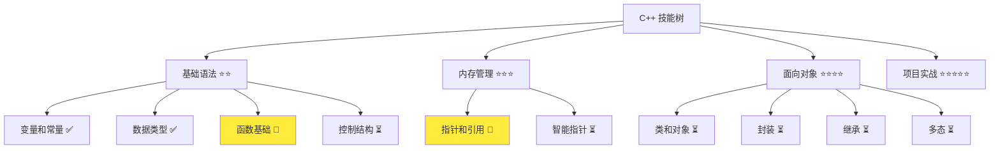
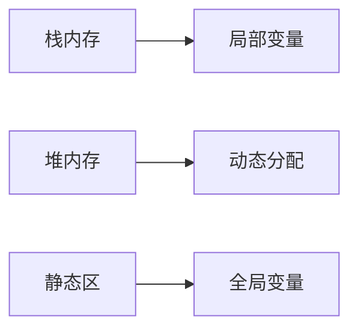
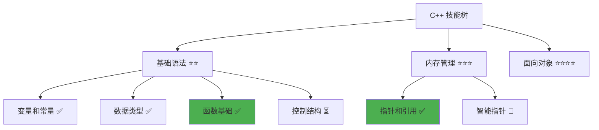

# {文档标题: 指针与引用}

> **目标与收获**：{学习目标和技能收获，如：掌握 C++内存管理基础，能够正确使用指针和引用，点亮内存管理、指针操作、引用使用技能点}  
> **前置知识**：{需要先掌握的概念，如：C++基础语法、变量和数据类型}  
> **预计时间**：{学习时间，如：45 分钟}  
> **难度等级**：{⭐到⭐⭐⭐⭐⭐，如：⭐⭐⭐}  
> **最后更新**：YYYY-MM-DD

📊 **难度等级说明**

| 等级           | 描述                       | 练习题数量     | 颜色码 |
| -------------- | -------------------------- | -------------- | ------ |
| **⭐**         | 入门级，零基础可学         | 5 题基础概念题 | 🟢绿   |
| **⭐⭐**       | 基础级，需要基本编程概念   | 5 题基础概念题 | 🟡黄   |
| **⭐⭐⭐**     | 中级，需要相关技术基础     | 3 题代码分析题 | 🟠橙   |
| **⭐⭐⭐⭐**   | 高级，需要扎实的技术功底   | 3 题代码分析题 | 🔴红   |
| **⭐⭐⭐⭐⭐** | 专家级，需要丰富的项目经验 | 2 题设计思考题 | 🟣紫   |

## 1. 学习目标

### 1.1 学习动机

- **实际需求**：{解释为什么需要学习这个概念，如：解决 80%初学者的内存管理痛点}
- **应用场景**：{在什么情况下会用到，如：动态内存分配、函数参数传递}
- **技能价值**：{学会后能解决什么问题，如：避免内存泄漏、提高程序性能}

### 1.2 技能树位置



### 1.3 前置知识检查

在开始学习之前，请确认你已经掌握：

- [ ] {前置知识 1}
- [ ] {前置知识 2}
- [ ] {前置知识 3}

> **未掌握处理**：若未通过，请先复习{前置文档链接，如：[变量基础](./01-variables.md)}

## 2. 核心内容

### 2.1 概念理解

**{概念名称}**：{概念定义}

> **类比教学**：必须为抽象概念添加生活化比喻，如：{概念}就像{生活场景}，{具体比喻说明}

#### 2.1.1 设计原理

- **为什么这样设计**：{设计原因，配合生活化比喻}
- **解决了什么问题**：{解决的问题，用类比说明}
- **有什么优势**：{优势分析，用生活场景解释}

#### 2.1.2 关键特性

1. **特性 1**：{详细说明，配合生活化比喻}
2. **特性 2**：{详细说明，配合生活化比喻}
3. **特性 3**：{详细说明，配合生活化比喻}

### 2.2 代码示例

#### 2.2.1 基础示例

```cpp
// 现代 C++ 示例
#include <iostream>
#include <memory>

int main() {
    // 使用智能指针管理内存（就像自动清理的垃圾桶）
    auto ptr = std::make_unique<int>(42);
    std::cout << "Value: " << *ptr << std::endl;
    return 0;
}
```

#### 2.2.2 编译运行

```bash
# 编译并运行
g++ -std=c++17 -o example example.cpp && ./example
```

**预期输出**：

```
Value: 42
```

### 2.3 原理解析（可选 - 复杂概念必填）

#### 2.3.1 工作原理

1. **步骤 1**：{详细解释，配合生活化比喻}
2. **步骤 2**：{详细解释，配合生活化比喻}
3. **步骤 3**：{详细解释，配合生活化比喻}

#### 2.3.2 内存模型



#### 2.3.3 性能考虑

- **时间复杂度**：{时间复杂度分析，用生活场景解释}
- **空间复杂度**：{空间复杂度分析，用生活场景解释}
- **优化建议**：{性能优化建议，用类比说明}

## 3. 实践应用

### 3.1 项目场景

在 QtLanChat 项目中，这个概念用于：

- **应用场景 1**：{具体应用}
- **应用场景 2**：{具体应用}

### 3.2 实际代码

```cpp
// 项目中的实际应用示例
class ChatMessage {
private:
    std::string content;
    std::string sender;

public:
    ChatMessage(const std::string& msg, const std::string& from)
        : content(msg), sender(from) {}

    // 实际方法实现
    void display() const {
        std::cout << sender << ": " << content << std::endl;
    }
};
```

### 3.3 设计思路（可选）

- **为什么选择这种设计**：{设计原因，用类比说明设计理念}
- **解决了什么问题**：{解决的问题，用生活场景解释}
- **有什么优势**：{优势分析，用生活化比喻}

## 4. 练习与测试

### 4.1 练习题（建议数量：初级 5 题，中级 3 题，高级 2 题）

#### 练习 1：基础应用

**题目**：{练习题目描述}

**要求**：

- 编写一个程序实现{具体功能}
- 使用{相关概念}
- 输出格式：{输出要求}

<details>
<summary>▶ 参考答案</summary>

```cpp
// 参考答案代码
#include <iostream>

int main() {
    // 实现代码
    return 0;
}
```

**运行结果**：

```
{预期输出}
```

</details>

### 4.2 测试题（可选）

1. **关于{概念}，下列说法正确的是：**
   A.{选项 A}

   B.{选项 B}

   C.{选项 C}

   D.{选项 D}
   **答案**：{正确答案}

   **解析**：{详细解析}

2. **{概念}的主要作用是：**
   A.{选项 A}

   B.{选项 B}

   C.{选项 C}

   D.{选项 D}
   **答案**：{正确答案}

   **解析**：{详细解析}

### 4.3 常见问题 FAQ

- Q1：{常见问题，如：指针和引用有什么区别？}
  - **A：**{详细解答，配合生活化比喻，如：指针就像门牌号，可以为空；引用就像房子的别名，不能为空}

- Q2：{常见问题，如：什么时候使用指针，什么时候使用引用？}
  - **A：**{详细解答，配合生活化比喻，如：需要表示"无值"状态时使用指针；需要避免空指针错误时使用引用}

- Q3：{常见问题，如：如何避免内存泄漏？}
  - **A：**{详细解答，配合生活化比喻，如：使用智能指针就像自动清理的垃圾桶；遵循 RAII 原则就像用完工具放回工具箱}

## 5. 资源与扩展（可选）

- **官方文档**：[C++ 官方标准](https://isocpp.org/)、[cppreference.com](https://en.cppreference.com/)
- **推荐书籍**：《C++ Primer》-{相关章节}、《Effective C++》-{相关章节}
- **在线资源**：[learncpp.com](https://www.learncpp.com/) -{相关教程}
- **视频资源**：{YouTube 教程链接，如：Qt C++ 教程}

## 6. 课后作业及参考答案（可选）

### 6.1 学习检查清单

- [ ] 能够解释{概念}的定义和作用
- [ ] 理解{概念}的设计原理
- [ ] 能够独立编写使用{概念}的代码
- [ ] 能够在实际项目中应用{概念}

### 6.2 综合练习

**作业题目**：{综合练习题目}

**要求**：{要求 1}、{要求 2}、{要求 3}

**时间估算**：{预计完成时间，如：30 分钟}

**参考答案**：

```cpp
// 综合练习参考答案
// why write this way: 解释设计思路
```

**评分标准**：功能实现（40%）、代码质量（30%）、设计思路（30%）

## 7. 下一步学习

**下一篇**：[{下一篇文档标题}](./{下一篇文档文件名}.md)

**学习路径**：

1. ✅{当前文档}- 已完成
2. 🔄{下一篇文档}- 下一步
3. ⏳{后续文档}- 待学习

**技能树更新**：



**学习成果**：

- **独立编写**：{具体能力描述，如：能够编写使用指针的程序}
- **解释原理**：{具体能力描述，如：能够解释指针的内存模型}
- **解决实际问题**：{具体能力描述，如：能够解决内存管理问题}
- **应用到项目**：{具体能力描述，如：能够在 Qt 项目中使用指针}
- **掌握度自评**：{自评百分比，如：80%}

> **指导建议**：<50% 建议复习，50-80% 继续学习，>80% 可进入下一阶段

---

**文档质量检查**：

- [ ] 学习目标明确且可验证
- [ ] 代码示例可运行
- [ ] 练习题有答案
- [ ] 技能收获明确
- [ ] 抽象概念配有生活化比喻
- [ ] 比喻体系一致，避免概念混乱
- [ ] 文档长度符合难度等级要求

---

> **建议**：新建教程文档时，先填写元信息，再按模板结构填充内容。始终以学习效果为导向，确保每个概念都有实际应用价值。**特别强调**：抽象概念必须配合生活化比喻，文档长度服务于教学效果，不以字数限制牺牲教学质量。
